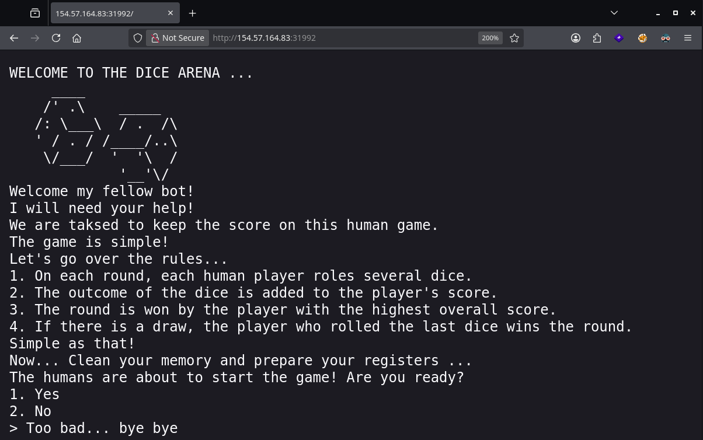
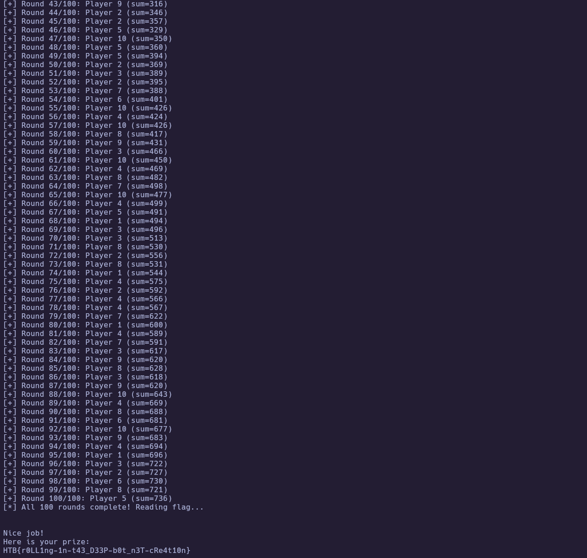

# HTB Challenge - LuckyDice

**Category:** `Misc`  
**Difficulty:** `Very Easy`  
**Tags:** #Misc #Automation #SocketProgramming #Parsing #TimingConstraint  
**Flag:** `HTB{...}` *(redact before publishing)*

---
## Synopsis

LuckyDice is a dice game server that runs 100 rounds where multiple players roll dice and you must identify the winner of each round — but with a **0.3-second timeout** that makes manual play impossible. The solution requires writing a script that connects via TCP, parses the dice rolls in real-time, computes each round's winner, and responds before the timeout expires.

---
## Skills Required

- Basic Python socket programming
- String parsing and pattern matching
- Understanding of game logic from source code

## Skills Learned

- Automating interactive TCP services under strict timing constraints
- Implementing buffered socket I/O to handle fragmented data
- Translating Python source code logic into an automated solver

---
## Analysis

### Challenge Materials

A Python 3 source file (`challenge.py`) showing the server-side game logic, plus a remote TCP instance to play against.

```
challenge.py  — 128 lines, Python 3 dice game server
Remote:       154.57.164.83:31992 (TCP)
```

### Initial Recon

Connecting to the instance (via browser or netcat) reveals a dice game with ASCII art. The server presents rules and asks "Are you ready?". After confirming, it runs 100 rounds of a dice-rolling game.



Reading `challenge.py` reveals the key constraints:

- **100 rounds** must all be answered correctly.
- **8–13 players** (randomly chosen per session) each roll dice per round.
- **Dice per round**: round `i` gives each player `i*2 + 2` dice (round 1 = 4 dice, round 50 = 102 dice, round 100 = 202 dice).
- **Winner**: player with the highest dice sum. Tie-break: highest player index wins.
- **Timeout**: 0.3 seconds — the server starts a timer when it prints the `> ` prompt and rejects answers that arrive too late.
- **Flag**: only revealed after all 100 rounds are answered correctly.

The 0.3-second timeout makes this **impossible to solve by hand**. This is clearly an automation challenge.

---
## Solution

### Step 1 – Understand the Winner Logic

From the source code, the winner is determined by:

```python
result = sorted(dice_sum.items(), key=lambda x:x[1])[-1][0][1].split('_')[1]
```

This sorts players by their dice sum (ascending), takes the **last** entry (highest sum), and extracts the player number. Because Python's `sorted()` is stable, if two players tie, the one added later to the dictionary (higher player index) appears last — implementing the "last dice roller wins ties" rule.

---
### Step 2 – Write the Solve Script

The game prints each player's dice values in the format `Player X: 1 3 5 2 ...` before asking "Who wins this round?". The script needs to:

1. Connect to the TCP socket.
2. Answer "1" to the ready prompt.
3. For each of 100 rounds: receive all output up to the `> ` prompt, parse the `Player X: ...` lines, sum each player's dice, find the winner (max sum, highest index for ties), and send the answer immediately.

The critical implementation detail is **buffered I/O**: the server flushes all round data (dice rolls + question + options + prompt) at once when `input()` is called. A naive `recvuntil("Who wins?")` followed by `recvuntil("> ")` will consume the prompt in the first call and then hang forever waiting for a second prompt that never arrives.

The solution uses a `Conn` class with an internal buffer that properly splits received data at the marker and preserves leftover bytes for subsequent reads.

---
### Step 3 – Run the Script and Capture the Flag

Running the solve script against the remote instance:

``` bash
python3 solve.py
```

The script completes all 100 rounds in under 30 seconds (well within the 0.3s per-round budget) and the server prints the flag.



🏁 **Flag obtained**

---
## Solve Script

```python
#!/usr/bin/env python3
"""solve.py — LuckyDice auto-solver
Connects to the remote dice game, parses each round's dice rolls,
computes the winning player, and responds within the 0.3s timeout.
"""
import socket
import sys


HOST = "154.57.164.83"
PORT = 31992


class Conn:
    """Buffered socket wrapper that splits data at markers without
    consuming bytes past the marker (avoids the 'lost prompt' bug)."""

    def __init__(self, host, port, timeout=30):
        self.sock = socket.socket(socket.AF_INET, socket.SOCK_STREAM)
        self.sock.settimeout(timeout)
        self.sock.connect((host, port))
        self.buf = b""

    def recvuntil(self, marker):
        while marker not in self.buf:
            chunk = self.sock.recv(4096)
            if not chunk:
                raise ConnectionError(f"Closed. Buffer:\n{self.buf.decode(errors='replace')}")
            self.buf += chunk
        idx = self.buf.index(marker) + len(marker)
        result = self.buf[:idx]
        self.buf = self.buf[idx:]
        return result

    def sendline(self, data):
        if isinstance(data, str):
            data = data.encode()
        self.sock.sendall(data + b"\n")

    def recv_remaining(self, timeout=5):
        self.sock.settimeout(timeout)
        out = self.buf
        while True:
            try:
                chunk = self.sock.recv(4096)
                if not chunk:
                    break
                out += chunk
            except socket.timeout:
                break
        return out.decode(errors='replace')

    def close(self):
        self.sock.close()


def solve():
    r = Conn(HOST, PORT)
    print(f"[*] Connected to {HOST}:{PORT}")

    r.recvuntil(b"> ")
    r.sendline("1")
    print("[*] Sent '1' (ready)")

    for rnd in range(100):
        data = r.recvuntil(b"> ").decode()

        players = {}
        for line in data.split("\n"):
            line = line.strip()
            if line.startswith("Player ") and ":" in line:
                parts = line.split(":")
                player_num = int(parts[0].replace("Player ", "").strip())
                dice_vals = list(map(int, parts[1].strip().split()))
                players[player_num] = sum(dice_vals)

        if not players:
            print(f"[!] No players parsed in round {rnd+1}!\n{data}")
            r.close()
            sys.exit(1)

        max_sum = max(players.values())
        winner = max(p for p, sv in players.items() if sv == max_sum)

        r.sendline(str(winner))

        resp = r.recvuntil(b"\n").decode()
        if "Correct" in resp:
            print(f"[+] Round {rnd+1}/100: Player {winner} (sum={max_sum})")
        else:
            print(f"[-] Round {rnd+1} FAILED: {resp.strip()}")
            r.close()
            sys.exit(1)

    print("[*] All 100 rounds complete! Reading flag...")
    flag = r.recv_remaining()
    print(flag)
    r.close()


if __name__ == "__main__":
    solve()
```

---
## Summary

1. **Analyzed source code** — identified the game rules, 0.3s timeout, winner calculation logic, and tie-breaking behavior.
2. **Wrote automated solver** — Python script using raw sockets with a buffered I/O wrapper to parse dice rolls and respond within the timeout.
3. **Ran against remote** — successfully completed 100 rounds and received the flag.

---
## Lessons Learned

- **Buffered I/O matters** — when a server flushes everything at once (common with Python's `input()`), a naive two-stage `recvuntil` can consume data meant for the second stage. Always use a buffer that preserves leftover bytes.
- **Read the source carefully for edge cases** — the tie-breaking rule (highest player index wins) is subtle in the `sorted()` + `[-1]` idiom and easy to miss. Getting this wrong would cause intermittent failures.
- **Timing constraints signal automation** — a 0.3s timeout on a 100-round game is the challenge author explicitly telling you this is a scripting challenge, not a logic puzzle.

---
## References

- [Python `socket` module documentation](https://docs.python.org/3/library/socket.html)
- [Python `sorted()` stability guarantee](https://docs.python.org/3/library/functions.html#sorted)
