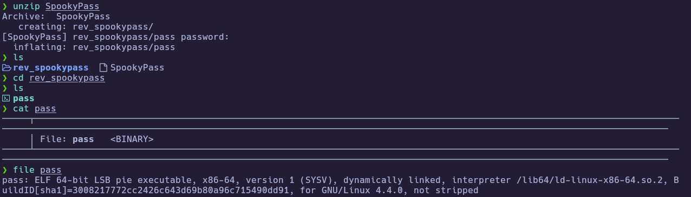
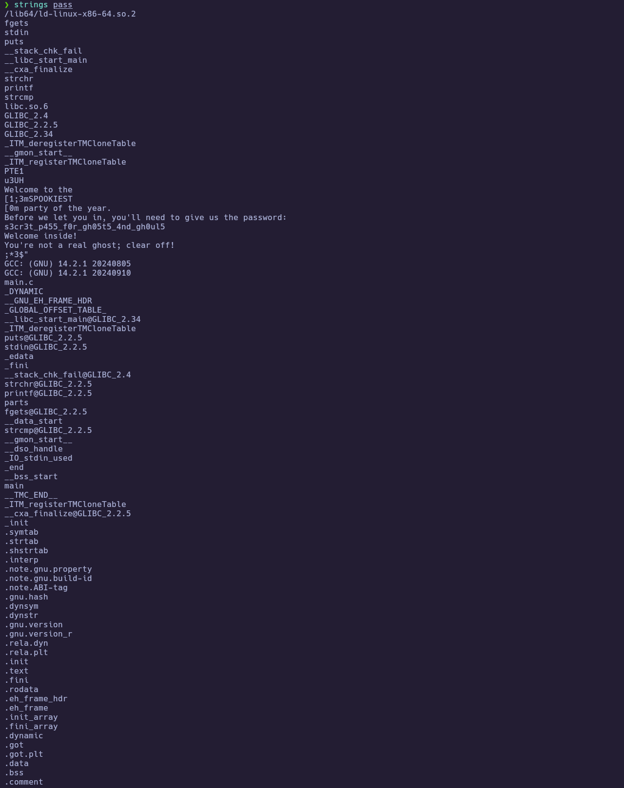
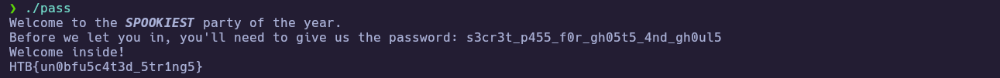

# HTB Challenge - SpookyPass

**Category:** `Reversing`  
**Difficulty:** `Very Easy`  
**Tags:** #Reversing #Strings #PlaintextPassword #strcmp  
**Flag:** `HTB{REDACTED}` *(redact before publishing)*

---
## Synopsis

SpookyPass is a Very Easy reversing challenge where a 64-bit ELF binary prompts for a password and compares it using `strcmp` against a hardcoded plaintext string. Running `strings` on the binary immediately reveals the password, which when entered prints the flag.

---
## Skills Required

- Basic Linux CLI (`file`, `strings`)
- Understanding of ELF binaries

## Skills Learned

- Using `strings` to extract readable data from binaries
- Identifying insecure hardcoded credentials via static analysis
- Recognizing `strcmp`-based password checks as low-hanging fruit in reversing challenges

---
## Analysis

### Challenge Materials

A password-protected zip archive (`SpookyPass`) containing a single binary:

``` bash
file pass
```



### Initial Recon

The binary is **not stripped**, meaning all symbol names are preserved. `checksec` shows standard protections (canary, NX, PIE) but these are irrelevant for a reversing challenge — we're not exploiting it, just understanding it.

```bash
checksec --file=pass
```

![[spookypass_02_checksec.png]]

Key symbols visible: `main`, `strcmp`, `printf`, `fgets`, `puts` — this tells us the program reads input with `fgets` and compares it with `strcmp`. No encryption, no obfuscation.

---
## Solution

### Step 1 – Extract Strings from the Binary

Since the binary is not stripped and uses `strcmp` for comparison, the password is likely stored as a plaintext string. Running `strings` confirms this immediately:

```bash
strings pass
```



Among the output, the interesting lines are:

```
Welcome to the
SPOOKIEST
party of the year.
Before we let you in, you'll need to give us the password:
s3cr3t_p455_f0r_gh05t5_4nd_gh0ul5
Welcome inside!
You're not a real ghost; clear off!
```

The program flow is clear: it prints a prompt, reads input, compares against `s3cr3t_p455_f0r_gh05t5_4nd_gh0ul5`, and either welcomes you (correct) or rejects you (wrong).

---
### Step 2 – Enter the Password

Feeding the extracted password to the binary yields the flag:

```bash
./pass
```



🏁 **Flag obtained**

---
## Summary

1. `strings pass` reveals a hardcoded plaintext password (`s3cr3t_p455_f0r_gh05t5_4nd_gh0ul5`).
2. Entering the password when prompted prints the flag.

---
## Lessons Learned

- **Always start with `strings`** — on easy reversing challenges, the answer is often sitting in plaintext. No need for Ghidra if the binary isn't obfuscated.
- **`file` + `checksec` + `strings`** is the standard triage trio for any unknown binary. It takes 10 seconds and immediately tells you what you're dealing with.
- **`strcmp` with a hardcoded secret is the simplest reversing pattern** — the binary has no obfuscation, no encoding, no anti-debug. In harder challenges, the comparison logic will be more complex (XOR, custom hash, character-by-character with transforms).

---
## References

- [GNU `strings` manual](https://sourceware.org/binutils/docs/binutils/strings.html)
- [checksec tool](https://github.com/slimm609/checksec.sh)
