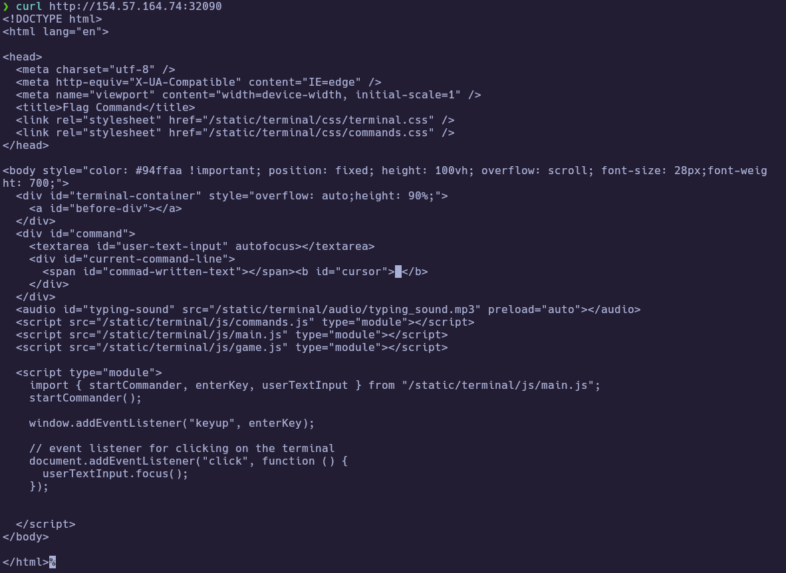
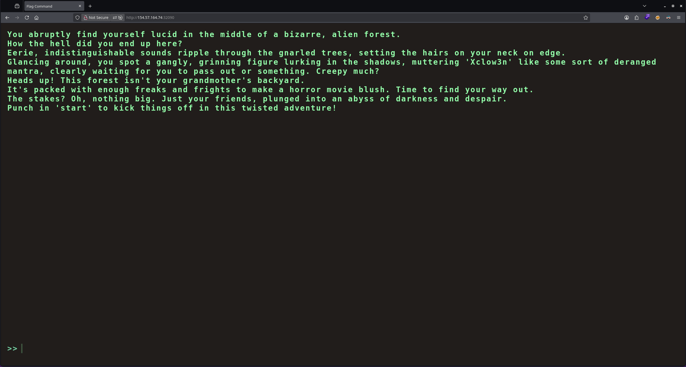
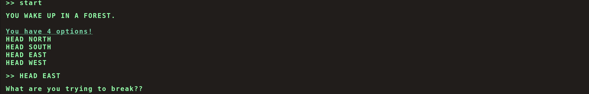
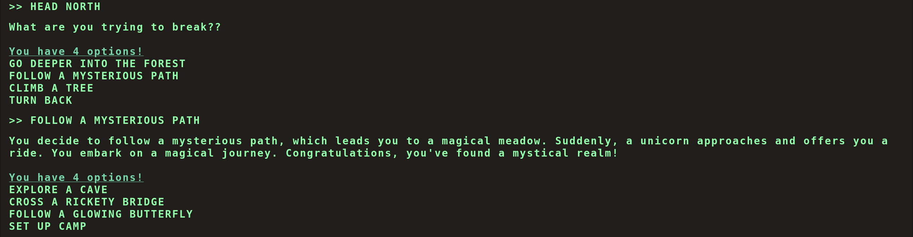
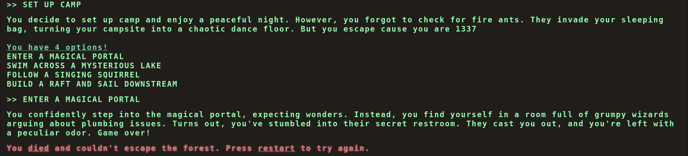
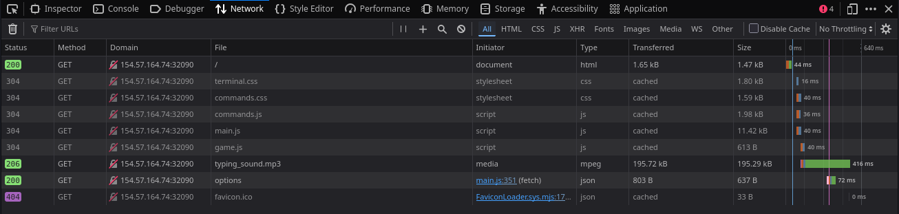
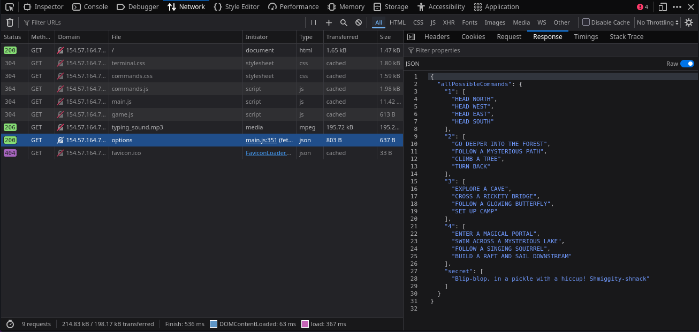
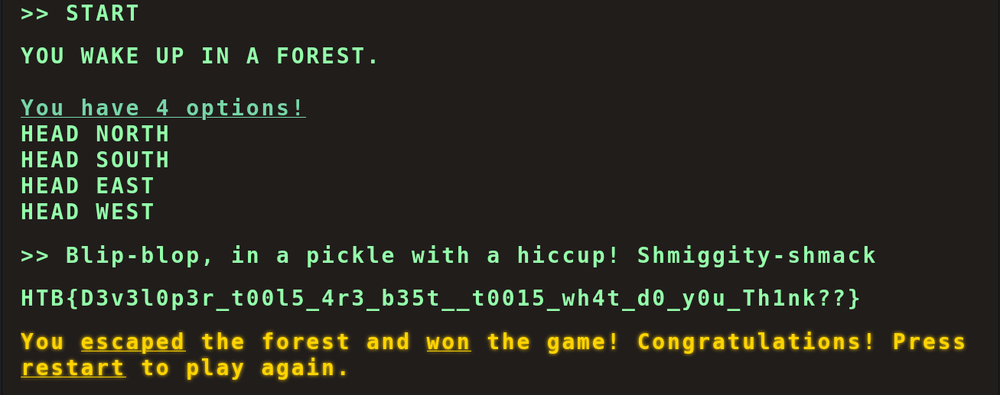

# HTB Challenge - Flag Command

**Category:** `Web`  
**Difficulty:** `Very Easy`  
**Tags:** #Web #APIDisclosure #JavaScriptReview #HiddenCommands #DevTools  
**Flag:** `HTB{...}` *(redact before publishing)*

---
## Synopsis

Flag Command is a terminal-style text adventure web game. The client-side JavaScript fetches all valid commands — including a hidden "secret" command — from a public API endpoint (`/api/options`). Sending the secret command to the game's monitor API immediately returns the flag, bypassing the entire game flow.

---
## Skills Required

- Reading JavaScript source code in browser DevTools
- Inspecting network requests (XHR/Fetch)

## Skills Learned

- Identifying sensitive information exposed in API responses
- Understanding client-side validation bypasses
- Using DevTools Network tab to discover hidden API endpoints and data

---
## Analysis

### Challenge Materials

A remote web instance serving a terminal-styled text adventure game. No downloadable files provided.

```
Remote: http://<TARGET_IP>:32090
Type: Web application (static HTML + JS modules + REST API)
```

### Initial Recon

Curling the target reveals a single-page application with three ES module scripts (`commands.js`, `main.js`, `game.js`) that control the game logic client-side.

```bash
curl http://<TARGET_IP>:32090
```



The web app presents a retro terminal interface with a text adventure game. Players type `start` then choose from directional options. Wrong choices lead to "Game over."



Playing through the game, wrong options immediately kill you:



Even following a seemingly valid path (HEAD NORTH → FOLLOW A MYSTERIOUS PATH → SET UP CAMP → ENTER A MAGICAL PORTAL) eventually results in death:





---
## Solution

### Step 1 – Inspect Network Traffic

After reloading the page, the DevTools Network tab reveals all resources loaded, including a `GET /api/options` request fetched by `main.js` on startup. This endpoint returns the game's command configuration.



---
### Step 2 – Discover the Secret Command

Inspecting the `/api/options` response reveals all valid commands for each game step, plus a `"secret"` key containing a hidden command that isn't shown to the player:

```json
{
  "allPossibleCommands": {
    "1": ["HEAD NORTH", "HEAD WEST", "HEAD EAST", "HEAD SOUTH"],
    "2": ["GO DEEPER INTO THE FOREST", "FOLLOW A MYSTERIOUS PATH", "CLIMB A TREE", "TURN BACK"],
    "3": ["EXPLORE A CAVE", "CROSS A RICKETY BRIDGE", "FOLLOW A GLOWING BUTTERFLY", "SET UP CAMP"],
    "4": ["ENTER A MAGICAL PORTAL", "SWIM ACROSS A MYSTERIOUS LAKE", "FOLLOW A SINGING SQUIRREL", "BUILD A RAFT AND SAIL DOWNSTREAM"],
    "secret": ["Blip-blop, in a pickle with a hiccup! Shmiggity-shmack"]
  }
}
```

The client-side code in `main.js` shows that the secret command bypasses step validation:

```javascript
if (availableOptions[currentStep].includes(currentCommand) || availableOptions['secret'].includes(currentCommand))
```



---
### Step 3 – Send the Secret Command

Typing the secret phrase directly in the game terminal (or sending it via POST to `/api/monitor`) returns the flag immediately:

```bash
# Via the game terminal:
>> START
>> Blip-blop, in a pickle with a hiccup! Shmiggity-shmack

# Or directly via curl:
curl -X POST http://<TARGET_IP>:32090/api/monitor \
  -H "Content-Type: application/json" \
  -d '{"command":"Blip-blop, in a pickle with a hiccup! Shmiggity-shmack"}'
```



🏁 **Flag obtained**

---
## Summary

1. Inspect the Network tab or read `main.js` source to discover the `GET /api/options` endpoint.
2. The API response exposes a `"secret"` command (`Blip-blop, in a pickle with a hiccup! Shmiggity-shmack`) not shown in the game UI.
3. Typing the secret command in the game (at any step) sends it to `POST /api/monitor`, which returns the flag.

---
## Lessons Learned

- **Always inspect client-side JavaScript and network requests** — web challenges at this level often have the answer exposed in API responses or JS source code. The challenge name itself ("Flag Command") hints at a hidden command.
- **Public API endpoints can leak sensitive data** — the `/api/options` endpoint serves the complete game state including secrets, with no authentication or server-side enforcement.
- **Client-side validation is not security** — the game could have validated the secret command server-side only, but instead it trusts the client to hide it from view.

---
## References

- [Firefox DevTools Network Monitor](https://firefox-source-docs.mozilla.org/devtools-user/network_monitor/)
- [Chrome DevTools Network Panel](https://developer.chrome.com/docs/devtools/network/)
