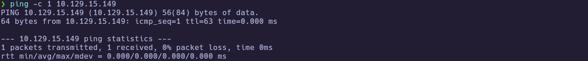
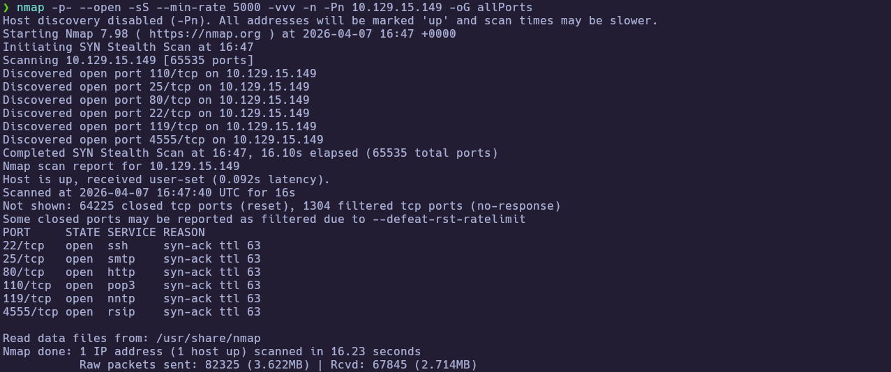
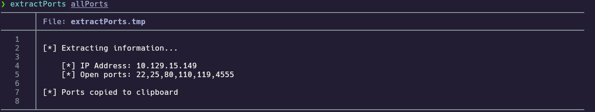
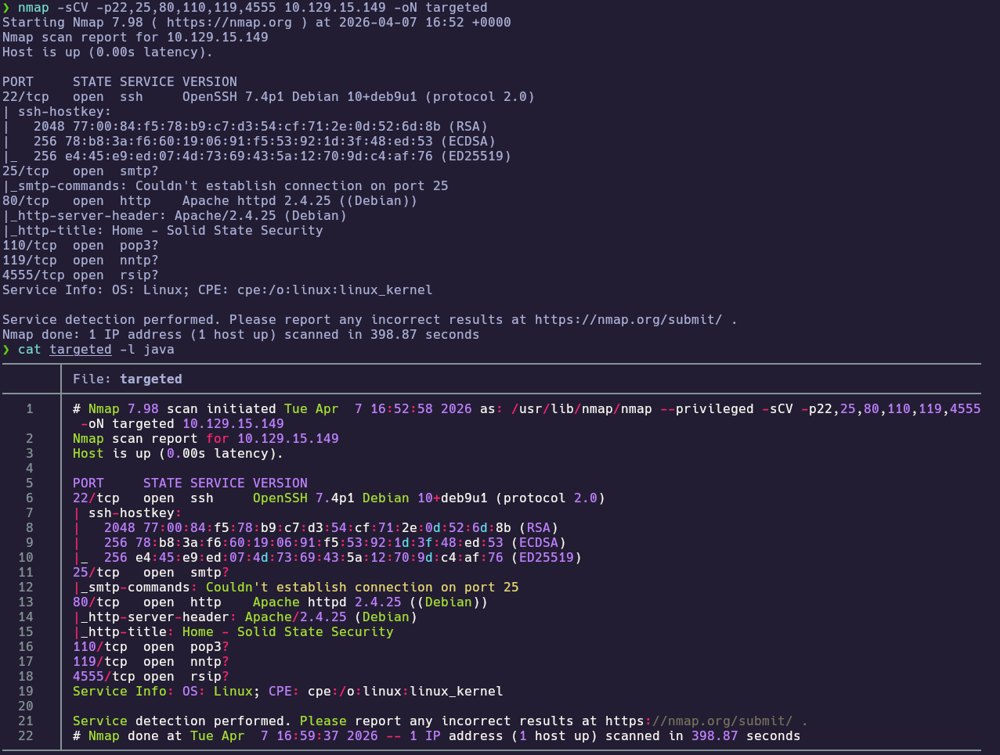
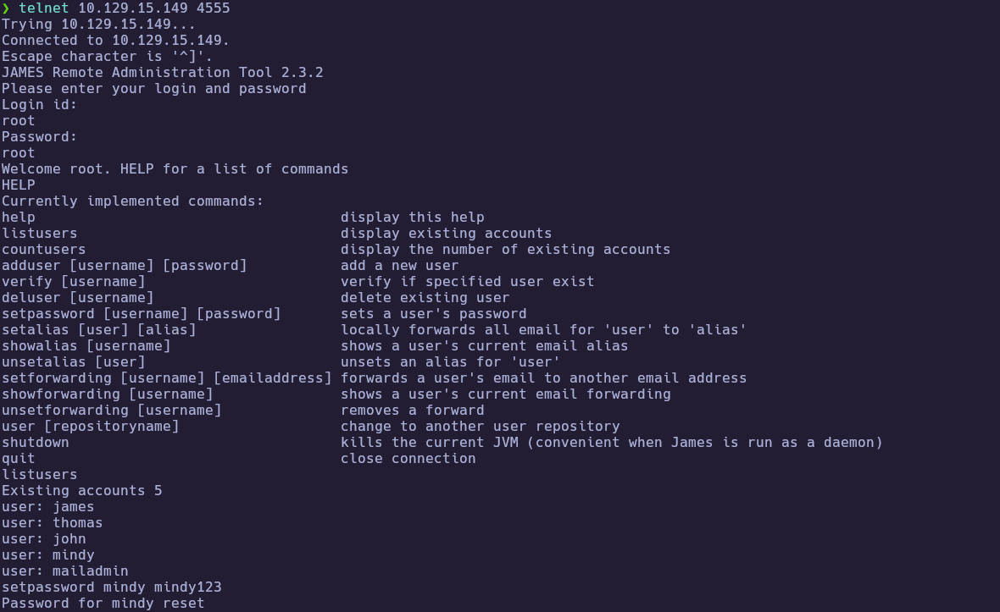
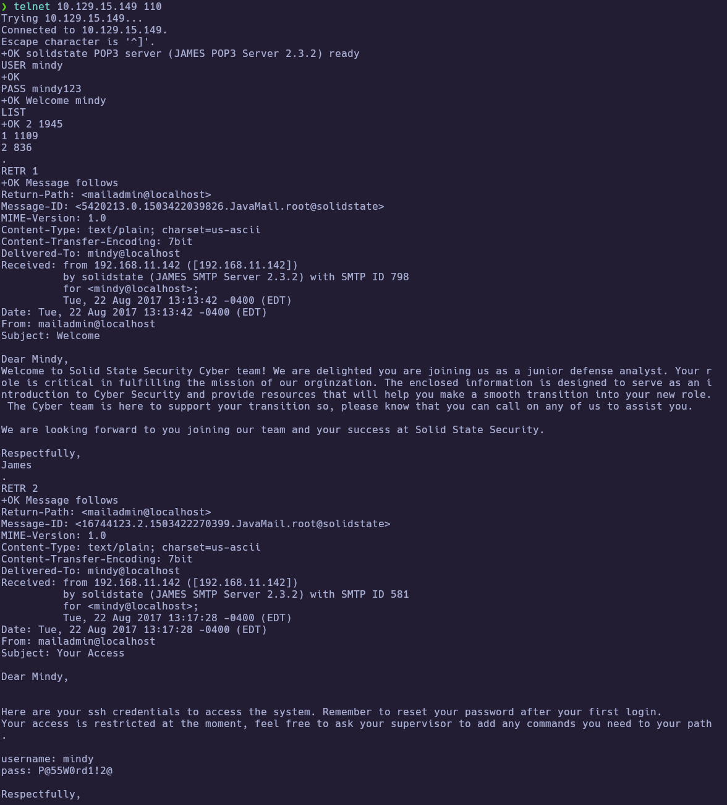
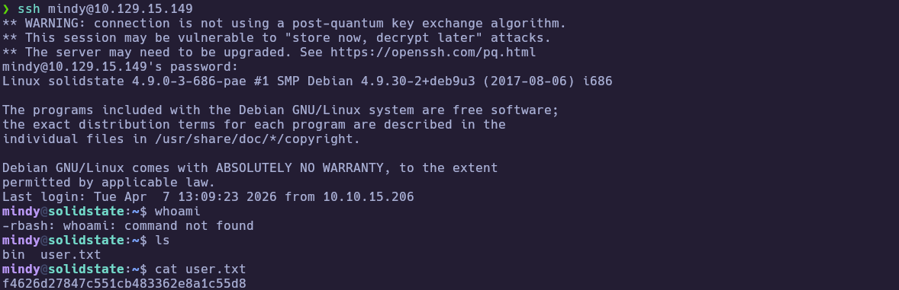
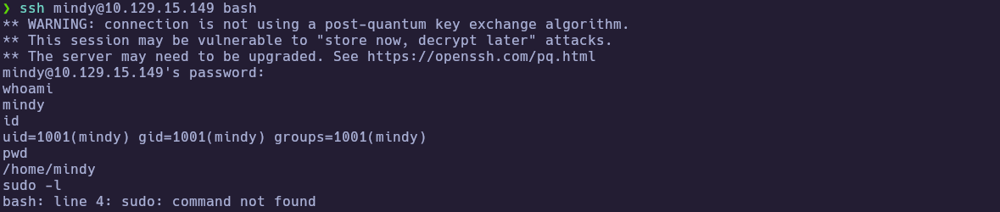
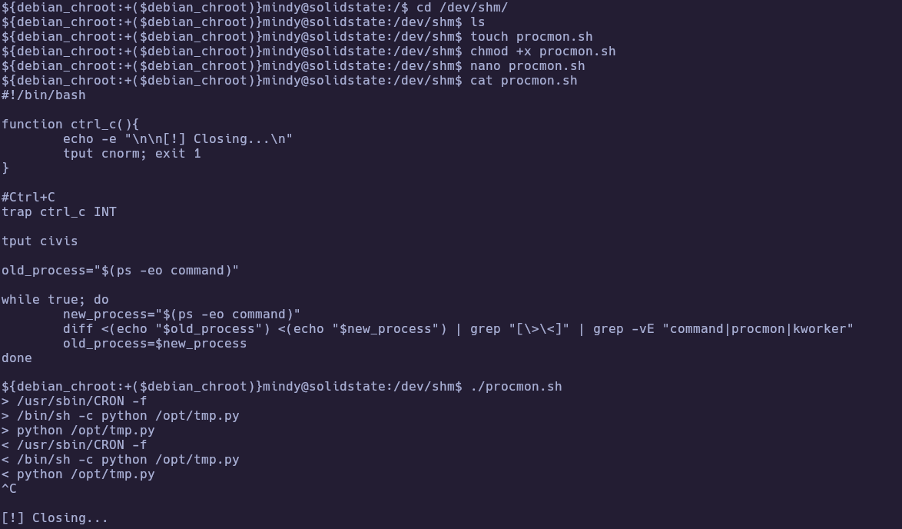
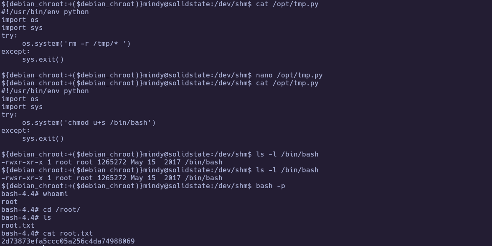

# HTB - SolidState

**IP Address:** `10.129.15.149`  
**OS:** `Linux (Debian 9 / i686)`  
**Difficulty:** `Medium`  
**Status:** `Retired`  
**Tags:** #Linux #Mail #ApacheJames #POP3 #SSH #rbash #Cron #WritableScript #SUID

---

## Synopsis

SolidState is compromised by chaining misconfigurations in a mail stack around **Apache James 2.3.2**.

Default James admin credentials allow listing valid local users and resetting a mailbox password. By authenticating to **POP3** as that user, an onboarding email reveals **SSH credentials**. SSH initially lands in a **restricted shell** (limited `PATH`, `rbash` behavior), but invoking `bash` through SSH yields a usable shell for enumeration.

Privilege escalation comes from a **root cron job** executing `python /opt/tmp.py` where the script is **writable by the low-priv user**, enabling code execution as root (e.g., setting the SUID bit on `/bin/bash` and using `bash -p`).

---

## Skills Required

- Basic Linux shell usage and service enumeration
- Reading mail over **POP3** with `telnet` (or equivalent)
- Recognizing restricted shells and escaping safely
- Identifying scheduled execution (cron) and correlating it to writable files

## Skills Learned

- Abusing **default credentials** on Apache James admin (4555)
- Pivoting **James → POP3 → SSH** using mailbox contents
- Escaping **`rbash`** by invoking an allowed shell explicitly
- PrivEsc via **writable script executed by root cron**

---

## 1. Initial Enumeration

### 1.1 Connectivity Test

Check if the host is alive using ICMP:

```bash
ping -c 1 10.129.15.149
```



The host responds, confirming it is reachable
### 1.2 Port Scanning

Scan all TCP ports to identify open services:

```bash
nmap -p- --open -sS --min-rate 5000 -vvv -n -Pn 10.129.15.149 -oG allPorts
```

Why these flags:

- `-p-`: scan all 65,535 TCP ports
- `--open`: show only open ports
- `-sS`: SYN scan
- `--min-rate 5000`: faster discovery scan
- `-vvv`: verbose output for timing/port discovery visibility
- `-n`: no DNS resolution
- `-Pn`: skip host discovery (treat host as up)
- `-oG`: grepable output for tooling



Extract the open ports:

```bash
extractPorts allPorts
```



### 1.3 Targeted Scan

Run a deeper scan on the identified ports with version detection and default scripts:

```bash
nmap -sCV -p22,25,80,110,119,4555 10.129.15.149 -oN targeted
```

- `-sC` : Run default NSE scripts  
- `-sV` : Detect service versions  
- `-oN` : Output in human-readable format  



**Findings:**

| Port(s) | Service | Notes |
|---|---|---|
| 22/tcp | SSH | OpenSSH 7.4p1 (Debian) |
| 80/tcp | HTTP | Apache 2.4.25 (Debian); low-content landing page in this run |
| 25/tcp | SMTP | Mail stack present (NSE scripts didn’t fully handshake in this run) |
| 110/tcp | POP3 | Used later to read mail after resetting password |
| 119/tcp | NNTP | Present but not required for this solve |
| 4555/tcp | James admin | Identifies as **JAMES Remote Administration Tool 2.3.2** |

---

## 2. Service Enumeration

### 2.1 Apache James admin (4555)

At this point we **did not have credentials** for any exposed service. A practical move is to try **common/default credentials** across the stack (SSH / mail services) before spending time on deeper web enumeration.

In this case, the only service where default credentials worked was the **Apache James Remote Administration** interface on port **4555** (`root:root`). Once authenticated, we can **enumerate valid users** and, crucially, **reset their passwords**, which enables mailbox access over POP3.

```bash
telnet 10.129.15.149 4555
```

Login used: `root` / `root` (default). Then:

```text
listusers
setpassword mindy mindy123
```



This yields a verified user list (including `mindy`) and the ability to reset her mailbox password so POP3 can be accessed.

In practice, most accounts either had **no mail** or their messages were not useful for gaining access. The only user whose mailbox contained actionable information for lateral access was **`mindy`**.

### 2.2 POP3 mailbox (110) → SSH creds

After resetting `mindy`’s password in James, we can log into POP3 as `mindy` and check her inbox.

```bash
telnet 10.129.15.149 110
```

```text
USER mindy
PASS mindy123
LIST
RETR 2
```

`LIST` shows **two emails**. The second one (`RETR 2`) contains **SSH credentials** for `mindy`, which becomes the pivot into the host.



---

## 3. Foothold

### 3.1 SSH as `mindy` (rbash) and bypass

Using the credentials from the email, SSH login succeeds and we can retrieve the user proof.

```bash
ssh mindy@10.129.15.149
```

After login, the session behaves as **restricted bash**:

- Common binaries are missing because `PATH` is constrained
- `PATH` is set to `/home/mindy/bin`

User proof:

```bash
cat /home/mindy/user.txt
```



🏁 **User flag obtained**

Because this is an `rbash`-style restriction and SSH allows us to specify a command, we can attempt to bypass it by invoking `bash` directly in the SSH command line. If the restriction is not enforced correctly, this drops us into a more functional shell:

```bash
ssh mindy@10.129.15.149 bash
```



Even with a usable shell, privileges are still limited: there is no direct root access, and the environment is constrained enough that you quickly run into missing tools / missing permissions.

---

## 4. Privilege Escalation

### 4.1 Discover root cron activity

To work comfortably, it helps to stabilize the shell (PTY) and then enumerate. While exploring the filesystem, you’ll notice many actions fail (missing binaries / restricted environment), and there is no obvious `sudo` path. At that point the key question becomes:

**Is root executing anything periodically (cron) that we can modify?**

A lightweight process monitor (`procmon.sh`) diffing `ps` output revealed cron executing a Python script:



The observed command was:

```text
/bin/sh -c python /opt/tmp.py
```

### 4.2 Abuse writable root-executed script

Because `/opt/tmp.py` is editable as `mindy`, modifying it gives code execution in the cron context (root).

In this run, `/opt/tmp.py` was modified to set the SUID bit on `/bin/bash`. After saving the file, we simply wait for the cron job to execute again until `/bin/bash` permissions change (SUID bit set).

Once `/bin/bash` is SUID, pop a root-preserving shell:

```bash
bash -p
cat /root/root.txt
```



🏁 **Root flag obtained**

---
# ✅ MACHINE COMPLETE

---
## Summary of Exploitation Path

1. **Service discovery** with `nmap` exposed a mail stack and **Apache James admin** on **4555**.
2. **Default credentials** on James (`root:root`) allowed **user enumeration** and **password resets**.
3. **POP3** login as `mindy` after reset revealed an email containing **SSH credentials**.
4. **SSH** as `mindy` landed in **restricted bash**; invoking `bash` via SSH provided a workable shell.
5. A **cron-executed** script (`python /opt/tmp.py`) was discovered; the script was **writable** by `mindy`.
6. Modifying `/opt/tmp.py` enabled **root code execution**, resulting in a root shell and final proof.

---

## Defensive Recommendations

- **Remove default credentials** and enforce strong admin passwords for Apache James (and disable/limit remote admin access on port **4555**).
- **Harden mail services**:
  - Restrict POP3 access, require TLS where possible, and avoid storing cleartext onboarding credentials in mailboxes.
  - Use unique, time-limited onboarding secrets and force rotation on first login.
- **Avoid restricted-shell security by PATH**: if you must restrict commands, use properly enforced controls (e.g., command restrictions via SSH `ForceCommand`, RBAC, or containers), not just a limited `PATH`.
- **Fix privilege escalation via cron**:
  - Ensure any cron-executed scripts are **owned by root** and **not writable** by unprivileged users.
  - Prefer immutable paths and strict permissions (e.g., `root:root` with `0755` or tighter).
  - Monitor for unexpected file permission changes (like SUID on `/bin/bash`) and alert.


